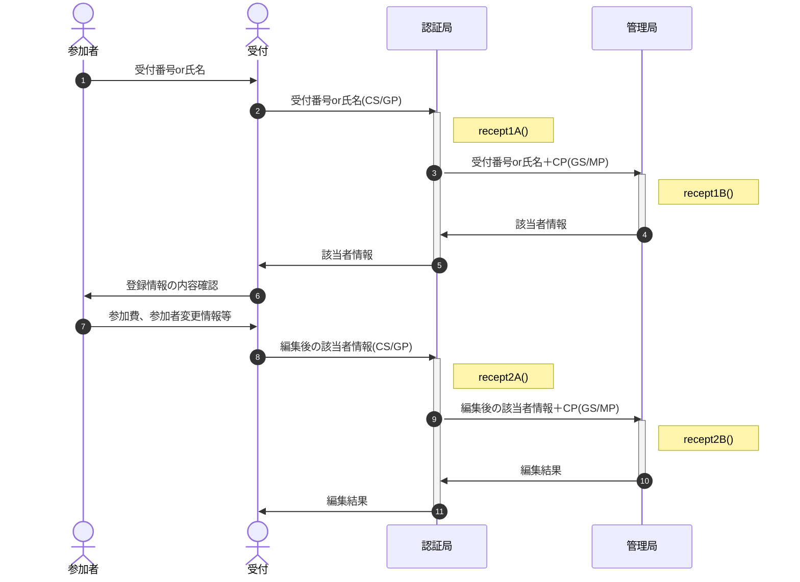

# class Recept + GAS

```mermaid
sequenceDiagram
  autonumber
  actor 参加者
  actor 受付
  participant 認証局
  participant 管理局

  参加者 ->> 受付 : 受付番号or氏名
  受付 ->> 認証局 : 受付番号or氏名(CS/GP)
  activate 認証局
  Note right of 認証局 : recept1A()
  認証局 ->> 管理局 : 受付番号or氏名＋CP(GS/MP)
  activate 管理局
  Note right of 管理局 : recept1B()
  管理局 ->> 認証局 : 該当者情報
  deactivate 管理局
  認証局 ->> 受付 : 該当者情報
  deactivate 認証局

  受付 ->> 参加者 : 登録情報の内容確認
  参加者 ->> 受付 : 参加費、参加者変更情報等

  受付 ->> 認証局 : 編集後の該当者情報(CS/GP)
  activate 認証局
  Note right of 認証局 : recept2A()
  認証局 ->> 管理局 : 編集後の該当者情報＋CP(GS/MP)
  activate 管理局
  Note right of 管理局 : recept2B()
  管理局 ->> 認証局 : 編集結果
  deactivate 管理局
  認証局 ->> 受付 : 編集結果
  deactivate 認証局
```