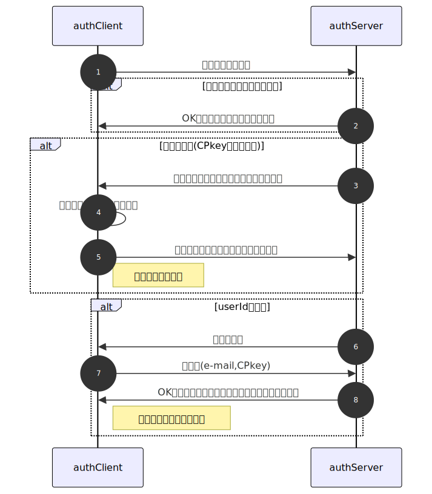

# <a name="ee755b0a70bd">Auth 1.1.0</a>

## 概要

## authCommon: authClient/Server共通設定・関数集

### <a name="a4bae9665fcc">option {Object} authClient/Server共通設定</a>

- tokenExpiry {number}=600000 (10分) トークンの有効期間(ミリ秒)
	
- passcodeDigit {number}=6 パスコードの桁数
	
- passcodeExpiry {number}=600000 (10分) パスコードの有効期間(ミリ秒)
	
- maxTrial {number}=3 パスコード入力の最大試行回数
	
- validityExpiry {number}=86400000 (1日) ログイン有効期間(ミリ秒)
	
- maxDevices {number}=5 単一アカウントで使用可能なデバイスの最大数
	
- freezing {number}=3600000 連続失敗した場合の凍結期間。ミリ秒。既定値1時間
	
- bits {number}=2048 RSA鍵ペアの鍵長
	
- adminMail {number}=null 管理者のメールアドレス
	
- adminName {number}=null 管理者名
	
## authClient

### pv - authClientのメンバ

- opt {Object} authClientのオプション設定
	
	- tokenExpiry {number}=600000 (10分) トークンの有効期間(ミリ秒)
		
	- passcodeDigit {number}=6 パスコードの桁数
		
	- passcodeExpiry {number}=600000 (10分) パスコードの有効期間(ミリ秒)
		
	- maxTrial {number}=3 パスコード入力の最大試行回数
		
	- validityExpiry {number}=86400000 (1日) ログイン有効期間(ミリ秒)
		
	- maxDevices {number}=5 単一アカウントで使用可能なデバイスの最大数
		
	- freezing {number}=3600000 連続失敗した場合の凍結期間。ミリ秒。既定値1時間
		
	- bits {number}=2048 RSA鍵ペアの鍵長
		
	- adminMail {number}=null 管理者のメールアドレス
		
	- adminName {number}=null 管理者名
		
	- storageKey {string}='authClient' localStorageのキー名
		
	- saveUserId {boolean}=true userIdをlocalStorageに保存するか否か
		
	- saveEmail {boolean}=false e-mailをlocalStorageに保存するか否か
		
	- <a name="e6693b2cc4bd">mirror {<a href="https://workflowy.com/#/53d27b6201fa">mirrorDef</a>[]} ローカル側にミラーを保持するテーブルの定義</a>
		
- userId {string} ユーザ識別子 
	ゲストも含めて識別するため、未定の場合は初期化時にUUIDを採番
- email {string} ユーザの連絡先メールアドレス
	
- CSkey {Object} クライアント側秘密鍵
	
- CPkey {string} クライアント側公開鍵
	
- SPkey {string} サーバ側公開鍵
	
### main: authClient主処理

- crondが無くても全件データ要求を行いSPkeyを取得、localStorageに保存
- URLクエリ・localStorageからuserId/e-mail取得を試行、取得できたらlocalStorageに保存
- 処理概要
	
	- URLクエリパラメータ・localStorageからuserId, e-mailの取得を試行 
		取得できたらlocalStorageとメンバ(pv)に保存
	- メンバ(cv)に引数を保存、未指定分には既定値を設定 
		[authClient/authServer共通オプション](#3c211d58f127)は引数で上書きしない
	- クライアント側鍵ペア未生成なら生成、メンバに保存
		
	- opt.mirrorに基づきauthServerにテーブル管理情報を要求、テーブルを作成
		
- <a name="f96870e08d4a">引数</a>
	
	- <a name="20004cac4de5">option {<a href="#6e19dabbd5cc">acMain_option</a>} authClient独自設定値</a>
		
- 戻り値 {Object.<string, function>} メソッドのオブジェクト
	
### request() : アプリケーションからの処理要求をauthServerに渡す

- 引数
	
	- <a name="7f56d7bb30a1">query {<a href="#5d949f3a25ab">acRequest_query</a>[]} サーバ側テーブルへの処理要求</a>
		
- 戻り値 : 処理結果(要加筆)
	
## authServer

### pv - authServerのメンバ

- query {<a href="#94c13922ade7">authServer</a>} 処理要求 
	起動時は引数"query"のコピー、以降は各メソッドにより情報を付加
- opt {Object} authServerのオプション設定
	
	- tokenExpiry {number}=600000 (10分) トークンの有効期間(ミリ秒)
		
	- passcodeDigit {number}=6 パスコードの桁数
		
	- passcodeExpiry {number}=600000 (10分) パスコードの有効期間(ミリ秒)
		
	- maxTrial {number}=3 パスコード入力の最大試行回数
		
	- validityExpiry {number}=86400000 (1日) ログイン有効期間(ミリ秒)
		
	- maxDevices {number}=5 単一アカウントで使用可能なデバイスの最大数
		
	- freezing {number}=3600000 連続失敗した場合の凍結期間。ミリ秒。既定値1時間
		
	- bits {number}=2048 RSA鍵ペアの鍵長
		
	- adminMail {number}=null 管理者のメールアドレス
		
	- adminName {number}=null 管理者名
		
	- [▼] authServer独自設定
		
- SPkey {string} サーバ側公開鍵
	
- SSkey {Object} サーバ側秘密鍵 
	DocumentProperties.SSkeyを`RSAKey.parse(DP.SSkey)`で復元した物
- account {Object} accountsシートから抽出したユーザ情報(行オブジェクト)
	
- device {Object} devicesシートから抽出したユーザ情報(行オブジェクト)
	
### main: authServer主処理

- <a name="6f1ce86a8fb5">引数</a>
	
	- query {<a href="#c9db0f7953c8">asMain_query</a>} クライアントからの処理要求 
		ユーザ側にCS/SPkeyが有った場合、暗号化＋署名
	- option {<a href="#83ede73058e8">asMain_option</a>} authServer独自設定値
		
- 戻り値 {<a href="#94c13922ade7">authServer</a>}
	
### constructor() : メンバの値設定、accounts/devicesシートの準備

- 処理概要
	
	- 引数の型チェック＋変換
		
	- メンバ(sv)に引数を保存、未指定分には既定値を設定 
		[authClient/authServer共通オプション](#3c211d58f127)は引数で上書きしない
	- DocumentPropertiesからSS/SPkeyを取得。未生成なら生成、DocumentPropertiesに保存
		
	- accounts/devicesシートが未作成なら追加
		
- 引数 : <a href="#6f1ce86a8fb5">mainの引数</a>がそのまま渡される
	
- 戻り値 {null|Error}
	
### verifyValidity() : アカウントの有効性検証

### login() : ログイン処理

## DocumentProperties
プロパティ名はauthServer.option.DocPropNameで指定
### SPkey {string} サーバ側公開鍵

### SSkey {string} サーバ側秘密鍵
復元は`RSAKey.parse(v.r.sKey)`で行う
## Google Spreadシートおよび項目定義

### <a name="2f8a77eb6f10">accounts - アカウント管理シートの項目</a>

- userId {string|number}='guest' ユーザ識別子(primaryKey) 
	default:101(0〜100はシステム用に留保), primaryKey
- email {string[]}=opt.adminMail ユーザのメールアドレス(unique)
	
- name {string}='ゲスト' ユーザの氏名
	
- phone {string}=''ユーザの電話番号
	
- address {string}='' ユーザの住所
	
- note {string}='' アカウント情報(備考)
	
- validityStart {string}=Date.now() 有効期間開始日時(ISO8601文字列)
	
- validityEnd {string}=validityStart+opt.validitySpan 有効期間終了日時(ISO8601文字列)
	
- authority {JSON}={} シート毎のアクセス権限。<code>{シート名:rwdos文字列}</code> 形式、既定値はアクセス権無し
	
- created {string}=Date.now() ユーザ登録日時(ISO8601拡張形式)
	
- updated {string}=Date.now() 最終更新日時(ISO8601拡張形式)
	
- deleted {string}='' 論理削除日時
	
### <a name="ae550a40dc50">devices - デバイス管理シートの項目</a>
複数デバイスでの単一アカウントの使用を可能にするため「account.userId(1) : device.userId(n)」で作成
- userId {string|number}='guest' ユーザ識別子 
	not null
- CPkey {string}='' クライアント側公開鍵、兼デバイスID 
	primaryKey。なおe-mailとデバイスIDの対応は取らない
- CPkeyExpiry {string}='' CPkey有効期限(ISO8601拡張形式) 
	期限内に適切な暗号化・署名された要求はOKとする
- note {string}='' ユーザ情報(備考)
	
- trial {<a href="#aaab38c8e75d">authTrial</a>} ログイン試行情報
	
- created {string}=Date.now() ユーザ登録日時(ISO8601拡張形式)
	
- updated {string}=Date.now() 最終更新日時(ISO8601拡張形式)
	
- deleted {string}='' 論理削除日時
	
### [old]

- accounts - アカウント管理シートの項目(2f8a77eb6f10) #copy
	
	- userId {string|number}='guest' ユーザ識別子(primaryKey) 
		default:101(0〜100はシステム用に留保), primaryKey
	- note {string}='' アカウント情報(備考)
		
	- validityStart {string}=Date.now() 有効期間開始日時(ISO8601文字列)
		
	- validityEnd {string}=validityStart+opt.validitySpan 有効期間終了日時(ISO8601文字列)
		
	- authority {JSON}={} シート毎のアクセス権限。<code>{シート名:rwdos文字列}</code> 形式、既定値はアクセス権無し
		
	- created {string}=Date.now() ユーザ登録日時(ISO8601拡張形式)
		
	- updated {string}=Date.now() 最終更新日時(ISO8601拡張形式)
		
	- deleted {string}='' 論理削除日時
		
- devices - デバイス管理シートの項目(ae550a40dc50) #copy 
	複数デバイスでの単一アカウントの使用を可能にするため「account.userId(1) : device.userId(n)」で作成
	- userId {string|number}='guest' ユーザ識別子 
		not null
	- email {string}=opt.adminMail ユーザのメールアドレス(unique) 
		primaryKey
	- name {string}='ゲスト' ユーザの氏名
		
	- phone {string}=''ユーザの電話番号
		
	- address {string}='' ユーザの住所
		
	- note {string}='' ユーザ情報(備考)
		
	- CPkey {string}='' クライアント側公開鍵
		
	- CPkeyExpiry {string}='' CPkey有効期限(ISO8601拡張形式) 
		期限内に適切な暗号化・署名された要求はOKとする
	- trial {<a href="#aaab38c8e75d">authTrial</a>} ログイン試行情報
		
	- created {string}=Date.now() ユーザ登録日時(ISO8601拡張形式)
		
	- updated {string}=Date.now() 最終更新日時(ISO8601拡張形式)
		
	- deleted {string}='' 論理削除日時
		
### log - SpreadDbのアクセスログシート
詳細はSpreadDb.[sdbLog](#dab8cfcec9d8)参照
## typedefs

### <a name="5d949f3a25ab">acRequest_query {Object} authClient.requestの引数"query"</a>

- table {string} 操作対象テーブル名
	
- command {string} 操作名 
	- commandの種類は下表の通り。なお新規アカウント登録はテーブル操作ではないので、rwdosの範囲外
	- "rwdos"とは"Read/Write/Delete/Own/Schema"の頭文字。管理者のみ実行可能な"c"(createTable)と特殊権限"o"を加えてシート毎のアクセス制御を行う。
	
	内容 | command | rwdos
	:-- | :-- | :-- 
	テーブル生成 | create | c
	参照 | select | r
	更新 | update | rw
	追加 | append/insert | w
	テーブル管理情報取得 | schema | s
	新規アカウント登録 | regist | x
- [where] {Object|Function|string} 対象レコードの判定条件 
	command='select','update','delete'で使用
	
	- Object ⇒ {キー項目名:キー項目の値}形式で、key:valueに該当するレコードを更新
	- function ⇒ 行オブジェクトを引数に対象ならtrueを返す関数で、trueが返されたレコードを更新
	- string
	  - 無名関数またはアロー関数のソース文字列 ⇒ new Functionで関数化。{〜} で囲みreturn文を付与。
	  - その他 ⇒ 項目定義で"primaryKey"を指定した項目の値
	- その他(Object,function,string以外) ⇒ 項目定義で"primaryKey"を指定した項目の値
- [set] {Object|Object[]|string|string[]|Function} 追加・更新する値 
	command='update','append'で使用
	
	- Object ⇒ appendなら行オブジェクト、updateなら{更新対象項目名:セットする値}
	- string ⇒ 上記Objectに変換可能なJSON文字列
	- Function ⇒ 行オブジェクトを引数に、上記Objectを返す関数
	  【例】abc欄にfuga+hogeの値をセットする : {func: o=>{return {abc:(o.fuga||0)+(o.hoge||0)}}}
### <a name="c9db0f7953c8">asMain_query {Object} authServerの引数"query"</a>

- table {string} 操作対象テーブル名
	
- command {string} 操作名 
	- commandの種類は下表の通り。なお新規アカウント登録はテーブル操作ではないので、rwdosの範囲外
	- "rwdos"とは"Read/Write/Delete/Own/Schema"の頭文字。管理者のみ実行可能な"c"(createTable)と特殊権限"o"を加えてシート毎のアクセス制御を行う。
	
	内容 | command | rwdos
	:-- | :-- | :-- 
	テーブル生成 | create | c
	参照 | select | r
	更新 | update | rw
	追加 | append/insert | w
	テーブル管理情報取得 | schema | s
	新規アカウント登録 | regist | x
- [where] {Object|Function|string} 対象レコードの判定条件 
	command='select','update','delete'で使用
	
	- Object ⇒ {キー項目名:キー項目の値}形式で、key:valueに該当するレコードを更新
	- function ⇒ 行オブジェクトを引数に対象ならtrueを返す関数で、trueが返されたレコードを更新
	- string
	  - 無名関数またはアロー関数のソース文字列 ⇒ new Functionで関数化。{〜} で囲みreturn文を付与。
	  - その他 ⇒ 項目定義で"primaryKey"を指定した項目の値
	- その他(Object,function,string以外) ⇒ 項目定義で"primaryKey"を指定した項目の値
- [set] {Object|Object[]|string|string[]|Function} 追加・更新する値 
	command='update','append'で使用
	
	- Object ⇒ appendなら行オブジェクト、updateなら{更新対象項目名:セットする値}
	- string ⇒ 上記Objectに変換可能なJSON文字列
	- Function ⇒ 行オブジェクトを引数に、上記Objectを返す関数
	  【例】abc欄にfuga+hogeの値をセットする : {func: o=>{return {abc:(o.fuga||0)+(o.hoge||0)}}}
- 【tokenに持たせるため削除】userId {string|number}="guest" ユーザ識別子(uuid等)
	
- queryId {string}=UUID クエリ・結果突合用文字列
	
- token {string} userIdを署名・暗号化した文字列
	
- [email] {string} ユーザのメールアドレス
	
- [passcode] {number|string} 入力されたパスコード 
	開発時はauthClient/authServerへの引数として扱う(∵自動テスト用)。リリース時には引数として与えるのは不可とする
	
	- authClientへの引数：ダイアログから入力されたパスコードの代替。配列可
	- authServerへの引数：乱数で発生させるパスコードの代替
### <a name="94c13922ade7">authServer {Object} authServerの戻り値</a>

- table {string} 操作対象テーブル名
	
- command {string} 操作名 
	- commandの種類は下表の通り。なお新規アカウント登録はテーブル操作ではないので、rwdosの範囲外
	- "rwdos"とは"Read/Write/Delete/Own/Schema"の頭文字。管理者のみ実行可能な"c"(createTable)と特殊権限"o"を加えてシート毎のアクセス制御を行う。
	
	内容 | command | rwdos
	:-- | :-- | :-- 
	テーブル生成 | create | c
	参照 | select | r
	更新 | update | rw
	追加 | append/insert | w
	テーブル管理情報取得 | schema | s
	新規アカウント登録 | regist | x
- [where] {Object|Function|string} 対象レコードの判定条件 
	command='select','update','delete'で使用
	
	- Object ⇒ {キー項目名:キー項目の値}形式で、key:valueに該当するレコードを更新
	- function ⇒ 行オブジェクトを引数に対象ならtrueを返す関数で、trueが返されたレコードを更新
	- string
	  - 無名関数またはアロー関数のソース文字列 ⇒ new Functionで関数化。{〜} で囲みreturn文を付与。
	  - その他 ⇒ 項目定義で"primaryKey"を指定した項目の値
	- その他(Object,function,string以外) ⇒ 項目定義で"primaryKey"を指定した項目の値
- [set] {Object|Object[]|string|string[]|Function} 追加・更新する値 
	command='update','append'で使用
	
	- Object ⇒ appendなら行オブジェクト、updateなら{更新対象項目名:セットする値}
	- string ⇒ 上記Objectに変換可能なJSON文字列
	- Function ⇒ 行オブジェクトを引数に、上記Objectを返す関数
	  【例】abc欄にfuga+hogeの値をセットする : {func: o=>{return {abc:(o.fuga||0)+(o.hoge||0)}}}
- 【tokenに持たせるため削除】userId {string|number}="guest" ユーザ識別子(uuid等)
	
- queryId {string}=UUID クエリ・結果突合用文字列
	
- token {string} userIdを署名・暗号化した文字列
	
- [email] {string} ユーザのメールアドレス
	
- [passcode] {number|string} 入力されたパスコード 
	開発時はauthClient/authServerへの引数として扱う(∵自動テスト用)。リリース時には引数として与えるのは不可とする
	
	- authClientへの引数：ダイアログから入力されたパスコードの代替。配列可
	- authServerへの引数：乱数で発生させるパスコードの代替
- timestamp {string} クエリ実行日時。ISO8601拡張形式
	
- qSts {string} クエリ単位の実行結果 
	正常終了なら"OK"。エラーコードは以下の通り。
	- create : "Already Exist", "No Cols and Data"
	- その他 : "No Table"
- num {number} 変更された行数 
	append:追加行数、update:変更行数、select:抽出行数、schema:0(固定)
- result {<a href="#d2f620e47c51">sdbResult</a>[]} レコード単位の実行結果
	
- status {string} authServerの実行結果 
	必要に応じてauthClientで追加変更
- SPkey {string} サーバ側公開鍵
	
### <a name="6e19dabbd5cc">acMain_option {Object} authClient独自設定値</a>

- storageKey {string}='authClient' localStorageのキー名
	
- saveUserId {boolean}=true userIdをlocalStorageに保存するか否か
	
- saveEmail {boolean}=false e-mailをlocalStorageに保存するか否か
	
- <a name="e6693b2cc4bd">mirror {<a href="#53d27b6201fa">mirrorDef</a>[]} ローカル側にミラーを保持するテーブルの定義</a>
	
### <a name="83ede73058e8">asMain_option {Object} authServer独自設定値</a>

- DocPropName {string}="authServer" DocumentPropertiesの項目名
	
- sdbOption {<a href="#a4a26014ccb3">sdbOption</a>} SpreadDbのオプション
	
- accountsTableName {string}='accounts' <a href="#2f8a77eb6f10">アカウント管理シート</a>の名前
	
- devicesTableName {string}='devices' <a href="#ae550a40dc50">デバイス管理シート</a>の名前
	
- guestAccount {<a href="#2f8a77eb6f10">accounts</a>}={} ゲストのアカウント管理設定 
	既定値はアカウント管理シートの既定値を流用
- guestDevice {<a href="#ae550a40dc50">devices</a>}={} ゲストのデバイス管理設定 
	既定値はデバイス管理シートの既定値を流用
- newAccount {<a href="#2f8a77eb6f10">accounts</a>}={} 新規登録者のアカウント管理設定 
	既定値はアカウント管理シートの既定値を流用
- newDevice {<a href="#ae550a40dc50">devices</a>}={} 新規登録者のデバイス管理設定 
	既定値はデバイス管理シートの既定値を流用
- validitySpan {number}=1,209,600,000(2週間) アカウントの有効期間
	
### <a name="aaab38c8e75d">authTrial {Object} ログイン試行関連情報</a>

- passcode {number} 設定されたパスコード
	
- datetime {string} パスコード通知メール送信日時 
	パスコード要求(client)>要求受領(server)>パスコード生成>通知メール送信の内、メール送信日時
- log {Object[]} 試行履歴情報
	
	- dt {string} パスコード検証日時(Date Time)
		
	- pc {number} ユーザが入力したパスコード(PassCode)
		
	- st {number} ステータス(STatus)。連続失敗回数、成功なら0
		
- thawing {string}='1970/01/01' 凍結解除日時
	
### <a name="3c211d58f127">commonOption {Object} authClient/authServer共通オプション</a>
以下は共通性維持のため、authClient/authServer起動時オプションでの変更は不可とする。 変更が必要な場合、build前のソースで変更する。
- tokenExpiry {number}=600,000(10分) トークンの有効期間(ミリ秒)
	
- passcodeDigit {number}=6  パスコードの桁数
	
- passcodeExpiry {number}=600,000(10分) パスコードの有効期間(ミリ秒) 
	メール送信〜受領〜パスコード入力〜送信〜確認処理終了までの時間。通信に係る時間も含む。不正防止のため、始点/終点ともサーバ側で時刻を設定する。
- maxTrial {number}=3 パスコード入力の最大試行回数
	
- validityExpiry {number}=86,400,000(1日) ログイン有効期間(ミリ秒) 
	有効期間を超えた場合は再ログインを必要とする
- maxDevices {number}=5 単一アカウントで使用可能なデバイスの最大数
	
- freezing {number}=3600000 連続失敗した場合の凍結期間。ミリ秒。既定値1時間
	
- bits {number}=2048 RSA鍵ペアの鍵長
	
- adminMail {string} 管理者のメールアドレス
	
- adminName {string} 管理者名
	
### <a name="53d27b6201fa">mirrorDef {Object} ミラーリングするテーブルの定義</a>
crond.set(), crond.clear()共通
- name {string} テーブル名
	
- func {function} ジョブ本体
	
- interval {number}=300000 実行間隔(ミリ秒) 
	0の場合はauthClientインスタンス化時のみ実行
- 
	
### <a name="5f4d3fd98b88">scenarioDef {Object} テストの定義</a>

- setup {<a href="#9b7b74078d9e">Object</a>} setupEnvironmentに渡す引数
	
- query {<a href="#7f56d7bb30a1">authClient_query</a>} authClientに渡す処理要求
	
- opt {<a href="#6e19dabbd5cc">authClient_option</a>} authClientに渡す起動時オプション
	
- check {<a href="#b9077d911a05">devTools_check_arg</a>} 実行結果の確認方法の定義
	
## 開発環境

### doTest() : テストパターン定義から、引数で指定されたテストを実行

- 引数
	
	- sce {string}='dev' テストパターン集の名前
		
	- start {number}=0 テストパターンの開始位置(0オリジン)
		
	- num {number}=1 実施するテストパターンの数
		
- 戻り値 {void}
	
- sample {Object.<string, Object>} テスト用サンプルデータ 
	- オブジェクトの形式はsetupEnvironment()の[arg.src](#38d23b83bbe7)参照
	- メンバ"dp"のみ別形式(DocumentPropertiesにセットするSPkey,SSkeyのJSON)
- scenario {Object.<string, <a href="#5f4d3fd98b88">scenarioDef</a>[]>} テストパターン毎の定義集
	
- setupEnvironment() : テスト環境構築：DocumentPropertiesのセット、テスト用シートの準備
	
	- 引数
		
		- <a name="9b7b74078d9e">arg {Object}</a>
			
			- obj {Object.<string,string>} {シート名：措置}形式のオブジェクト 
				「シート名='default'」は、メンバ名が存在しないシートに対して行う措置。またreadmeシートは必ず残す。
			- <a name="38d23b83bbe7">src {Object}=sample シート定義情報をまとめたオブジェクト</a>
				
				- [cols] {<a href="#df5b3c98954e">sdbColumn</a>[]} 新規作成シートの項目定義オブジェクトの配列
					
				- [<a href="#58dde3944536">set</a>] {Object|Object[]|string|string[]|Function} 追加・更新する値
					
			- dp {string}='asis' DocumentPropertiesに対する措置 
				- force : 強制的に再作成
				- ifnot : 不在なら作成、存在なら再作成しない(不在時作成。if not exist)
				- delete: 強制削除(defaultの既定値)。存在していれば削除、再作成はしない
				- asis  : そのまま何もしない
			- dpName {string}='authServer' - DocumentPropertyのキー名
				
### authPost() : クライアント—サーバ間の通信を代行

- 引数
	
	- arg {any} authClientからauthServerに渡す引数
		
- 戻り値 {any} authClientに渡すauthServerの処理結果
	
### テスト仕様

## その他
用語解説、注意事項、更新履歴、他
### 【参考】SpreadDbのエラーコード
| No | 設定項目 | コード | 発生箇所 | 原因 |
| --: | :-- | :-- | :-- | :-- |
| 1 | qSts | No Authority | doQuery | 指定されたテーブル操作の権限が無い |
| 2 | qSts | No command | doQuery | query.commandが無い、または文字列では無い |
| 3 | qSts | No Table name | doQuery | query.tableが無い、または文字列では無い |
| 4 | qSts | Invalid where clause | doQuery | (権限"o"で)where句の値がプリミティブ型ではない |
| 5 | qSts | No Table | doQuery genTable | (create以外で)対象テーブルが無い |
| 6 | qSts | No cols and data | genTable | createで項目定義も初期データも無い |
| 7 | qSts | Already Exist | createTable | シートが既に存在している |
| 8 | qSts | Duplicate | createTable | 初期レコード内に重複が存在 |
| 9 | qSts | Empty set | createTable appendRow | query.setが不在、または配列の長さが0 |
| 10 | qSts | Invalid set | appendRow | query.setが非配列なのに要素がオブジェクトではない |
| 11 | qSts | No set | appendRow updateRow | queryにメンバ"set"が不在 |
| 12 | qSts | No where | deleteRow updateRow | where句がqueryに無い |
| 13 | qSts | Undefined Column | updateRow | 更新対象項目がテーブルに無い |
| 14 | qSts | その他 | doQuery | エラーオブジェクトのmessage |
| 15 | rSts | Duplicate | appendRow updateRow | unique項目に重複した値を入れようとした |
| 16 | Error | Invalid Argument | functionalyze | 不適切な引数 |
| 17 | Error | Could not Lock | main | 規定回数以上シートのロックに失敗した |
### アカウントの状態遷移
アカウントは以下①〜④の4種類のいずれかの状態を取る。

| No | アカウント | userId |  ログイン | 状態 |
| :--: | :-- | :-- | :-- | :-- |
| ① | 未作成 |  |  | ゲスト、または新規登録希望だが未手続の人 |
| ② | 作成済 | 不明 |  | 登録済だが登録と異なるデバイスでアクセスしている人 |
| ③ |  | 判明 | 未 | 新規登録通知メールのURLクエリから開いた人 または申込に使用したデバイスからのアクセス |
| ④ |  |  | 済 | 申込済かつログインした人 |
### 注意事項

- ミラーリングするテーブルには"updated"を必須とする 
	更新対象レコードかの判別は"updated"を基準として行うため。
### 更新履歴

# 【参考】文書化対象外要素へのリンク

- <a name="d2f620e47c51">sdbResult {Object} レコード単位の実行結果</a>
	
	- <a name="6d2c404bdbd8">pKey {string} 処理対象レコードの識別子</a>
		
	- rSts {string}='OK' レコード単位での実行結果 
		append/updateで重複エラー時は"Duplicate"
	- diff {Object} 当該レコードの変更点 
		create : 初期値として追加した行オブジェクト
		select : 抽出された行オブジェクト
		append : 追加された行オブジェクト。Duplicateエラーの場合、重複項目と値
		update : 変更点。{変更された項目名:[変更前,変更後]}
		delete : 削除された行オブジェクト
		schema : 提供された項目定義(sdbColumn[])
- <a name="a4a26014ccb3">sdbOption {Object} オプション</a>
	
	- <a name="5554e1d6a61d">userId {string}='guest' ユーザの識別子</a> 
		指定する場合、必ずuserAuthも併せて指定
	- userAuth {Object.<string,string>}={} テーブル毎のアクセス権限。<code>{シート名:rwdos文字列}</code> 形式 
		r:select(read), w:write, d:delete, s:schema, o:own only(指定シートのprimaryKeyがuserIdと一致するレコードのみ参照・変更可。削除不可)。追加はwがあれば可
		
		o(own record only)の指定は他の'rwdos'に優先、'o'のみの指定と看做す(rwds指定は有っても無視)。
		また検索対象テーブルはprimaryKey要設定、検索条件もprimaryKeyの値のみ指定可
		read/writeは自分のみ可、delete/schemaは実行不可
	- log {string}='log' 変更履歴テーブル名 
		nullの場合、ログ出力は行わない。領域名 > A1記法 > シート名の順に解釈
	- maxTrial {number}=5 テーブル更新時、ロックされていた場合の最大試行回数
		
	- interval {number}=10000 テーブル更新時、ロックされていた場合の試行間隔(ミリ秒)
		
	- guestAuth {Object.<string,string>}={} ゲストに付与する権限。<code>{シート名:rwdos文字列}</code> 形式
		
	- adminId {string}='Administrator' 管理者として扱うuserId 
		管理者は全てのシートの全権限を持つ
	- additionalPrimaryKey {<a href="#df5b3c98954e">sdbColumn</a>} createTableで主キー無指定時に追加設定される主キー項目名 
		既定値は`{name:'rowId',type:'UUID',note:'主キー',primaryKey:true,default:()=>Utilities.getUuid()}`
- <a name="df5b3c98954e">sdbColumn {Object} 項目の構造情報</a> 
	= シート上のメモの文字列
	- name {string} 項目名
		
	- type {string} データ型。string,number,boolean,Date,JSON,UUID
		
	- format {string} 表示形式。type=Dateの場合のみ指定
		
	- options {string} 取り得る選択肢(配列)のJSON表現 
		ex. ["未入場","既収","未収","無料"]
	- default {function} 既定値を取得する関数。引数は当該行オブジェクト 
		指定の際は必ず<code>{〜}</code> で囲み、return文を付与のこと。
		ex.<code>o => {return toLocale(new Date())}</code>
	- primaryKey {boolean}=false 一意キー項目ならtrue
		
	- unique {boolean}=false primaryKey以外で一意な値を持つならtrue
		
	- auto_increment {bloolean|null|number|number[]}=false 自動採番項目 
		null ⇒ 自動採番しない
		boolean ⇒ true:自動採番する(基数=1,増減値=1)、false:自動採番しない
		number ⇒ 自動採番する(基数=指定値,増減値=1)
		number[] ⇒ 自動採番する(基数=添字0,増減値=添字1)
		object ⇒ {start:m,step:n}形式
	- suffix {string} "not null"等、上記以外のSQLのcreate table文のフィールド制約
		
	- note {string} 本項目に関する備考 
		ローカル側のcreate table等では使用しない
- <a name="dab8cfcec9d8">sdbLog {Object} 変更履歴オブジェクト</a> 
	| command | 権限 | status | ratio | record欄 | 備考 |
	| :-- | :--: | :-- | :-- | :-- | :-- |
	| create | — | Already Exist No Cols and Data | — | [sdbColumn](#df5b3c98954e) | 管理者のみ実行可 |
	| select | r | No Table | 抽出失敗/対象 | — | 「対象なのに失敗」は考慮しない |
	| update | rw | No Table | 更新失敗/対象 | {sts:[OK|Duplicate],diff:{項目名:[更新前,更新後]}} |  |
	| append | w | No Table | 追加失敗/対象 | {sts:[OK|Duplicate],diff:追加行Obj} |  |
	| delete | d | No Table | 削除失敗/対象 | — | 「対象なのに失敗」は考慮しない |
	| schema | s | No Table | — | [sdbColumn](#df5b3c98954e) |  |
	
	- command系メソッドはstatus,num,recordを返す
	- command系メソッドは、成功件数が0件でも「正常終了」とし、status="OK"とする
	- 戻り値がErrorオブジェクトの場合、status="System",record=Error.messageとする
	- record欄は、実際は上記Objの【配列】のJSON文字列とする
	
	以下、既定値は[genLog()](#6fb9aba6d9f9)で設定される値
	- logId {string}=Utilities.getUuid() 変更履歴レコードの識別子 
		primaryKey, default:UUID
	- timestamp {string}=toLocale(new Date()) 更新日時(ISO8601拡張形式)
		
	- userId {string}=<a href="#5554e1d6a61d">opt.userId</a> ユーザ識別子(uuid等)
		
	- queryId {string}=null SpreadDb呼出元で設定する、クエリ・結果突合用文字列 
		未設定の場合、メソッド呼び出し前にgenLogでUUIDを設定
	- table {string}=null 対象テーブル名
		
	- command {string}=null 操作内容(コマンド名) 
		設定内容は「[commandの種類とrwdos文字列によるアクセス制御](#0055bda95f77)」参照
	- [<a href="#741ee9383b92">data</a>] {Object|Function|string} 操作関数に渡された引数(データ) 
		createならcols、select/update/deleteならwhere、append/schemaなら空白。
		create/appendの追加レコード情報、selectの抽出レコード等はrecordで確認する運用を想定
	- <a href="#a0484ae4e8cb">qSt</a>s {string} クエリ単位の実行結果
		
	- num {number} 変更された行数 
		create: 初期値の行数、append:追加行数、update:変更行数、delete:削除行数、select:抽出行数、schema:0(固定)
	- <a href="#6d2c404bdbd8">pKey</a> {string} 変更したレコードのprimaryKey
		
	- rSts {string} レコード単位でのエラーコード
		
	- diff {Object} 当該レコードの変更点
		
- <a name="5554e1d6a61d">userId {string}='guest' ユーザの識別子</a> 
	指定する場合、必ずuserAuthも併せて指定
- <a name="741ee9383b92">where {Object|Function|string} 対象レコードの判定条件</a> 
	- Object ⇒ {キー項目名:キー項目の値}形式で、key:valueに該当するレコードを更新
	- function ⇒ 行オブジェクトを引数に対象ならtrueを返す関数で、trueが返されたレコードを更新
	- string
	  - 無名関数またはアロー関数のソース文字列 ⇒ new Functionで関数化。<code>{〜}</code> で囲みreturn文を付与。
	  - その他 ⇒ 項目定義で"primaryKey"を指定した項目の値
	- その他(Object,function,string以外) ⇒ 項目定義で"primaryKey"を指定した項目の値
- <a name="a0484ae4e8cb">□qSts {string} クエリ単位の実行結果</a> 
	正常終了なら"OK"。エラーコードは[エラーの種類](#60cbb24d684c)参照。
- <a name="6d2c404bdbd8">pKey {string} 処理対象レコードの識別子</a>
	
- <a name="58dde3944536">set {Object|Object[]|string|Function} 更新する値</a> 
	set句の指定方法
	- Object ⇒ create/appendなら行オブジェクト、updateなら{更新対象項目名:セットする値}
	- string ⇒ 上記Objectに変換可能なJSON文字列
	- Function ⇒ 行オブジェクトを引数に、上記Objectを返す関数
	  【例】abc欄にfuga+hogeの値をセットする : {func: o=>{return {abc:(o.fuga||0)+(o.hoge||0)}}}
- <a name="b9077d911a05">arg {Object}</a>
	
	- asis {any} 結果の値
		
	- tobe {any} 有るべき値
		
	- title {string}='' テストのタイトル(ex. SpreadDbTest.delete.4)
		
	- [opt] {Object} isEqual()に渡すオプション
		
