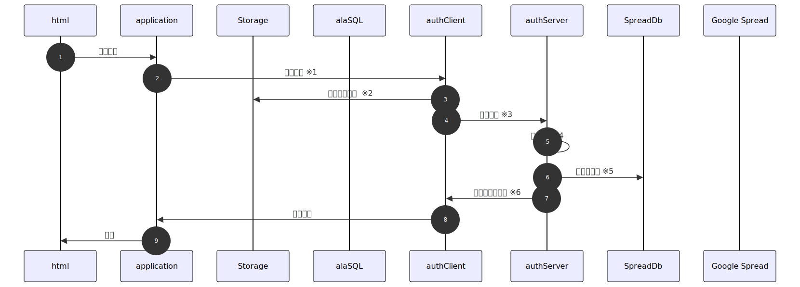
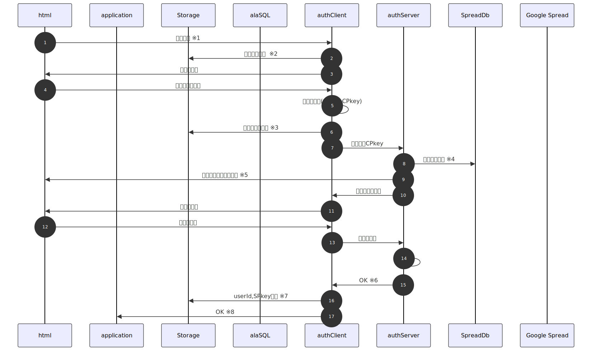
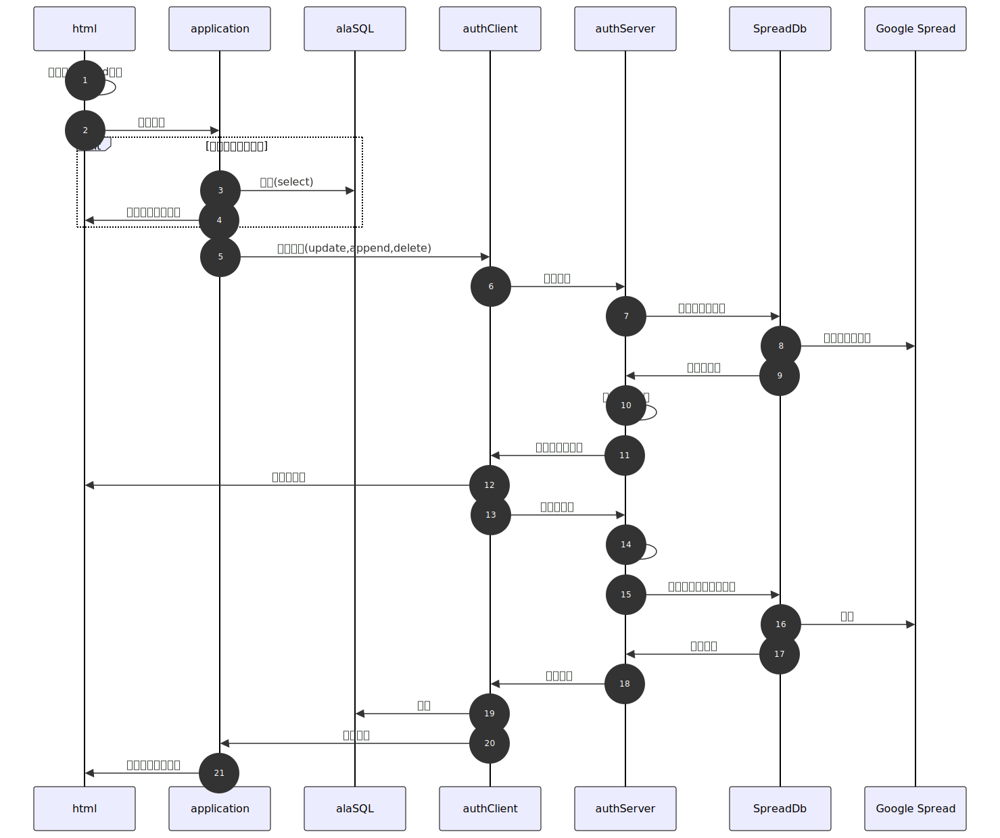
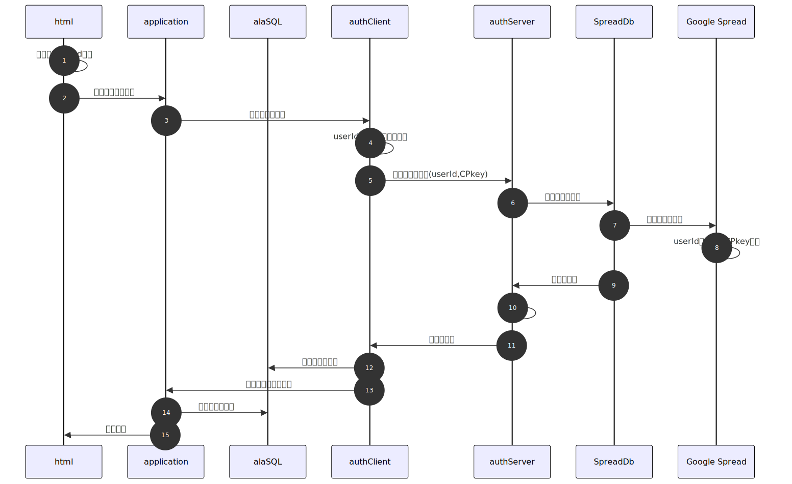

===== [fatal] hrefs only: リンク有るのにアンカー未定義の項目
cde13ea2b6d2: where
18ae7059355f: record
20e32e8d7cef: テーブルの管理情報
13ce21699fba: arg
ab046206f9d4: opt
fa0f16361253: UserStatus
f3f5e1e469cf: response] {[Object

# Auth 1.1.0

## 概要

"Auth"はクライアント側に"authClient"、サーバ側に"authServer"を配置し、クライアント側からのリクエストに応じてサーバ側テーブルの参照・更新・削除を行う。

なお利用に当たっては「アカウント」を必要とし、適宜ログインを必要とする。「ゲスト」他のロール毎にテーブルのアクセス権を設定し、アカウント毎にロールを設定することでアクセス制御を行う。

### ゲストとしてのアクセス

- ※1: 表示するページに必要な情報を要求するクエリ(ex.掲示板のやりとり)
- ※2: userId, CPkeyをブラウザのlocal/sessionStorageから取得できないか試行。 なおゲストなので空振りするはず(何れも存在しない)
- ※3: クエリのみ(userId, CPkeyともに無し)
- ※4: userIdが無いのでゲストと判断
- ※5: SpreadDbにクエリを送信。SpreadDbはゲスト権限で許容されるクエリかを判断、結果をauthServerに送信
- ※6: 掲示板のやりとり等、ゲストに提供できる情報のみを返信

### アカウント登録

- ※1: authClient.regist()を呼び出し。application経由も可。
- ※2: userId, CPkeyをブラウザのlocal/sessionStorageから取得できないか試行。 なおこの段階では空振りするはず(何れも存在しない)
- ※3: メールアドレス、CP/CSkeyはsessionStorageに保存
- ※4: 送付されたメールアドレスがアカウント一覧に登録されていないか確認、登録されていなければuserIdを採番しメアドとCPkeyを登録
- ※5: 図ではhtml(ブラウザ)宛になっているが、実際にはメーラで確認
- ※6: 採番されたuserId、サーバ側公開鍵(SPkey)も併せて通知
- ※7: userIdはlocalStorageに、SPkeyはsessionStorageに保存
- ※8: 以降、アカウント情報編集画面に遷移

### ログイン

### 参照・更新

### onload

## authClient

classとするとグローバルに呼び出すのが困難になるため、メンバをsessionStorageに保存するクロージャとする。

### 概要

### 保存する変数

- localStorage
	- userId {string|number}=null ユーザ識別子。nullはゲスト
- sessionStorage
	- CSkey {string} クライアント側秘密鍵
	- CPkey {string} クライアント側公開鍵
	- SPkey {string} サーバ側公開鍵

### 引数

- arg {Object}
	- userId {string|number}=null ユーザ識別子。nullはゲスト
	- query {Object}
		- table {string} 操作対象テーブル名 
			全commandで使用。command='schema'の場合、取得対象テーブル名またはその配列
		- command {string} 操作名 
			全commandで使用。update/delete/append
		- [where](#cde13ea2b6d2) {Object|Function|string} 対象レコードの判定条件 
			command='select','update','delete'で使用
		- [record](#18ae7059355f) {Object|Function} 追加・更新する値 
			command='update','append'で使用

### 戻り値 {null|Error}

### dialog() : email/パスコード入力ダイアログの表示・入力

- 概要
- 引数
- 戻り値

### request() : authServerに要求を送信

### createTable() : authServerからの[テーブルの管理情報](#20e32e8d7cef)を基にローカルDBのテーブルを作成

### syncDb() : authServerの更新結果をローカル側DBに反映

- 引数
	- arg {Object}
		- table {string} 操作対象テーブル名
		- command {string} 操作名

## authServer

### 概要

### 保存する変数

- DocumentProperties 
	プロパティ名はopt.DocPropNameで指定
	- SPkey {string} サーバ側公開鍵
	- SSkey {string} サーバ側秘密鍵 
		復元は`RSAKey.parse(v.r.sKey)`で行う

### 擬似メンバ"pv"

- [arg](#13ce21699fba) {Object} 引数argの内容
- [opt](#ab046206f9d4) {Object} 引数optの内容
- SSkey {Object} サーバ側秘密鍵
- SPkey {string} サーバ側公開鍵
- user {[UserStatus](#fa0f16361253)} 要求しているユーザの管理情報

### 引数

- arg {Object}
	- [userId] {string|number} ユーザ識別子
	- [email] {string} ユーザのメールアドレス 
		userId, email両方指定されていない場合、ゲストと看做す
	- [token] {string} 発信時刻(UNIX時刻)を暗号化・署名した文字列 
		発信後tokenExpiryを超えたものは無効
	- [CPkey] {string} ユーザの公開鍵
	- query {Object|Object[]}
		- table {string} 操作対象テーブル名 
			全commandで使用。command='schema'の場合、取得対象テーブル名またはその配列
		- command {string} 操作名 
			全commandで使用。update/delete/append
		- [where](#cde13ea2b6d2) {Object|Function|string} 対象レコードの判定条件 
			command='select','update','delete'で使用
		- [record](#18ae7059355f) {Object|Function} 追加・更新する値 
			command='update','append'で使用
	- [passcode] {number} 入力されたパスコード
- opt {Object} ※pv.optとして参照可
	- DocPropKey {string}='authServer' DocumentPropertiesのプロパティ名
	- accountTableName {string}='ユーザ管理' 「[ユーザ管理](#fa0f16361253)」シートの名前
	- tokenExpiry {number}=10分 トークンの有効期間
	- validityPeriod {number}=1日 ログイン有効期間 
		有効期間を超えた場合は再ログインを必要とする
	- graceTime {number}=10分 メール送信〜パスコード確認処理終了までの猶予時間(ミリ秒) 
		
	- passcodeValidityPeriod {number}=600000(10分) パスコードの有効期間。ミリ秒 
		メール送信〜受領〜パスコード入力〜送信〜確認処理終了までの時間。通信に係る時間も含む。不正防止のため、始点/終点ともサーバ側で時刻を設定する。
	- maxTrial {number}=3 パスコード入力の最大試行回数
	- passcodeDigit {number}=6  パスコードの桁数
	- freezing {number}=3600000 連続失敗した場合の凍結期間。ミリ秒。既定値1時間
	- bits {number}=1024 鍵長
	- guest {[UserStatus](#fa0f16361253)}={userId:'guest'} ゲストの権限設定
	- newcomer {[UserStatus](#fa0f16361253)}={} 新規ユーザの権限設定

### 戻り値

- status {string} 処理結果。No Mail, Invalid SPkey, Send PC, Retry, etc.
- [response] {[Object](#f3f5e1e469cf)[]} 要求に対する処理結果(=SpreadDb戻り値) 
	Errまたはretryの場合、undefined
- [userId] {string|number} 引数にuserIdが無く、status=retryの時にシートから引用
- [SPkey] {string} サーバ側公開鍵。status=retryの時に設定

### registUser() : ユーザ管理情報を生成、シートに追加

### 

### account() : 「ユーザ管理」シートの読込・書込

### encrypt() : トークンの作成

### decrypt() : トークンの解読、書名検証

## typedefs

### UserStatus {Object} 「ユーザ管理」シートの行オブジェクト

- userId {string|number} ユーザ識別子(primaryKey) 
	default:UUID, primaryKey
- email {string} ユーザのメールアドレス(unique) 
	unique
- name {string} ユーザの氏名
- phone {string} ユーザの電話番号
- address {string} ユーザの住所
- note {string} その他ユーザ情報(備考)
- validityStart {string} 有効期間開始日時(ISO8601文字列)
- validityEnd {string} 有効期間終了日時(ISO8601文字列)
- CPkey {string} クライアント側公開鍵
- CPkeyExpiry {string} CPkey有効期限 
	期限内に適切な暗号化・署名された要求はOKとする
- authority {JSON} シート毎のアクセス権限。<code>{シート名:rwdos文字列}</code> 形式
- trial {JSON} ログイン試行関連情報 
	default:''。ログイン成功時にクリア
	- passcode {number} 設定されたパスコード
	- datetime {string} パスコード通知メール送信日時 
		パスコード要求(client)>要求受領(server)>パスコード生成>通知メール送信の内、メール送信日時
	- log {Object[]} 試行履歴情報
		- dt {string} パスコード検証日時
		- pc {number} ユーザが入力したパスコード
		- cd {number} エラーコード
	- thawing {string} 凍結解除日時。通常undefined、凍結時にメンバ追加
- created {string} ユーザ登録日時
- updated {string} 最終更新日時
- deleted {string} 論理削除日時
