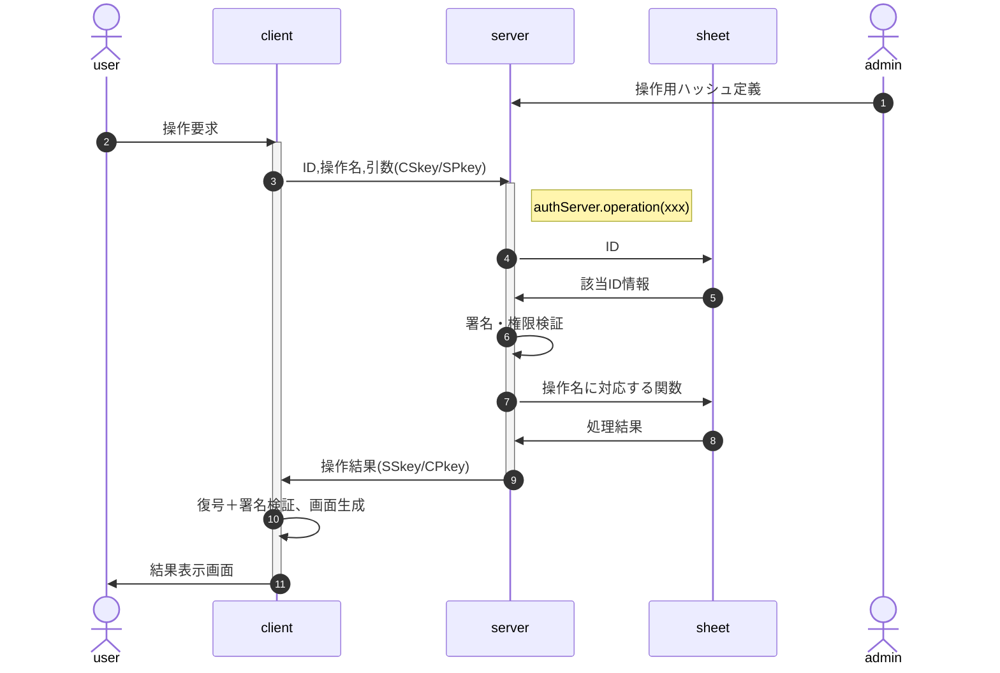

# 検索・編集・更新

シートの操作(CRUD)は、管理者が事前に`{操作名:実行関数}`の形でソースに埋め込んで定義する。 
例：`{lookup:(arg)=>data.find(x=>x.id==arg.id)}`

userは要求時に操作名を指定し、その実行結果を受け取る。

- 「署名・権限検証」では復号・署名検証の上、以下の点の確認を行う
  - CPkeyの有効期限
  - 該当IDは当該操作の実行権限を持つか
