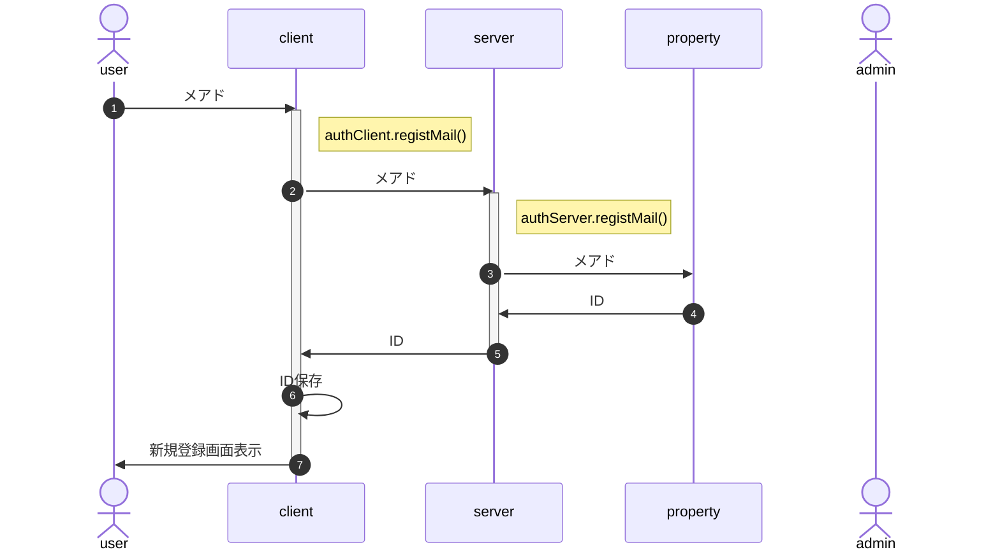

# 新規登録

新規登録では、[サーバ側のプロパティサービス](#332-%E3%83%A6%E3%83%BC%E3%82%B6%E6%83%85%E5%A0%B1)にIDとメアドのみ作成する。申込者名等、登録内容についてはログイン後に自情報編集画面を呼び出し、修正・加筆を行う。

- メアド入力欄は募集要項の一部とし、userId(受付番号)がlocalStrageに存在する場合は表示しない
- 応募締切等、新規要求ができる期間の制限は、client側でも行う(BurgerMenuの有効期間設定を想定)
- メアドは形式チェックのみ行い、到達確認および別ソースとの突合は行わない(ex.在校生メアド一覧との突合)
- 申込時に自分限定の申込情報操作のためログインすることになるので、メール到達確認はそこで行う
- IDはstoreUserInfo関数を使用してlocal/sessionStorageでの保存を想定(∵個人情報では無く、タブを閉じても保存しておきたい)