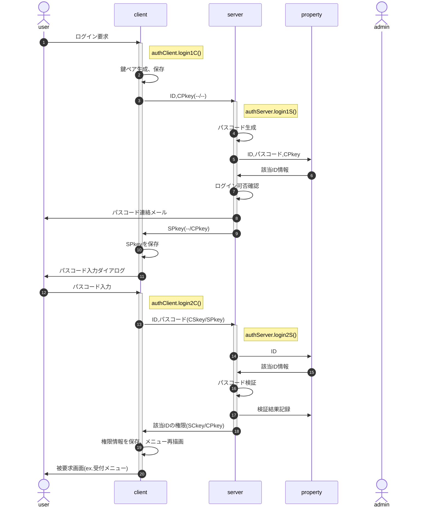

# ログイン要求

- IDは保存済の前提
- clientの鍵およびSPkeyはsessionStorageへの保存を想定 
  (∵当該session以外からの参照を阻止、かつ永続的な保存は望ましくない)
- 有効期間内の鍵ペアが存在したら、鍵ペア生成はスキップ
- 該当ID情報は[ユーザ情報](#332-%E3%83%A6%E3%83%BC%E3%82%B6%E6%83%85%E5%A0%B1)参照
- ログイン可否確認
  - 前回ログイン失敗(3回連続失敗)から一定以上の時間経過(既定値1時間)
  - パスコード再発行は上述の条件が満たされる限り認める 
    例：旧パスコードで2回連続失敗、再発行後の1回目で失敗したら凍結
- 「パスコード検証」は復号・署名確認の上、以下の点をチェックする
  - パスコードが一致
  - 試行回数が一定数以下(既定値3回)
  - パスコード生成から一定時間内(既定値15分)
  - ログイン可能な権限
- パスコード入力はダイアログで行う(開発工数低減)