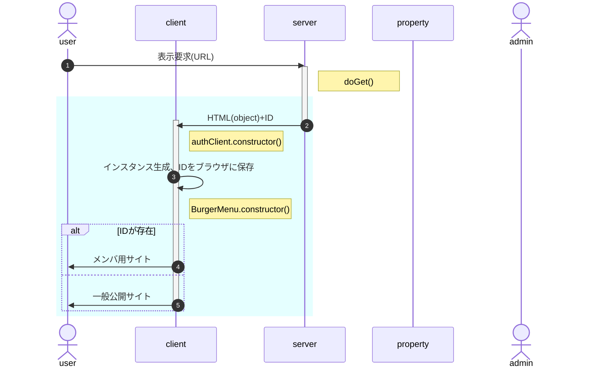

# onload時処理

- 水色の部分はhtmlのonload時処理
- 表示要求に対するserverからの戻り値(ID)は、[HtmlOutput.appendUntrusted()](https://developers.google.com/apps-script/reference/html/html-output?hl=ja#appenduntrustedaddedcontent)を使用して、HTMLの要素として返す。
- 「インスタンス生成」の処理内容
  1. authClient.constructor()
     1. localStorageにIDがあるか確認 
        不存在または不一致なら、serverから戻されたIDをlocalStorageに保存
  1. BurgerMenu.constructor()
     1. AuthインスタンスをBurgerMenuのインスタンスメンバとして生成(以下Burger.auth)
     1. Burger.auth.IDの値に従ってAuthメニュー描画(メニューアイコン、nav領域)
