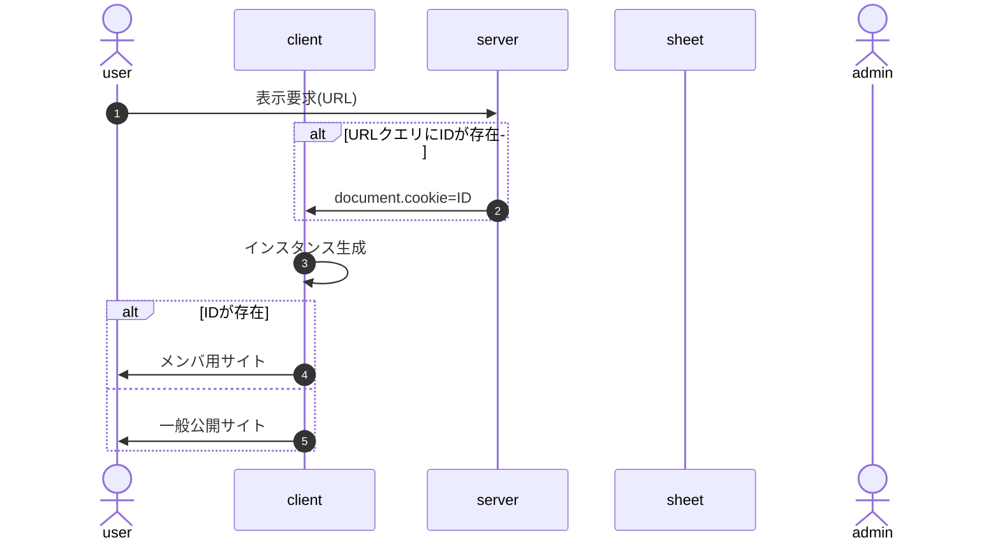

<!--【onload時処理】-->

1. インスタンス生成
   1. BurgerMenuインスタンス生成
      1. AuthインスタンスをBurgerMenuのインスタンスメンバとして生成(以下Burger.auth)
      1. Burger.auth.IDの値に従ってAuthメニュー描画(メニューアイコン、nav領域)
   1. Authインスタンス生成
      1. cookieにIDがあるか確認
         - cookieにIDが保存されていたらインスタンスのメンバ(以下Auth.ID)として保存
         - 保存されていなければ`Auth.ID=未定(null)`

- この段階では「IDが特定されているかどうか」のみ判定