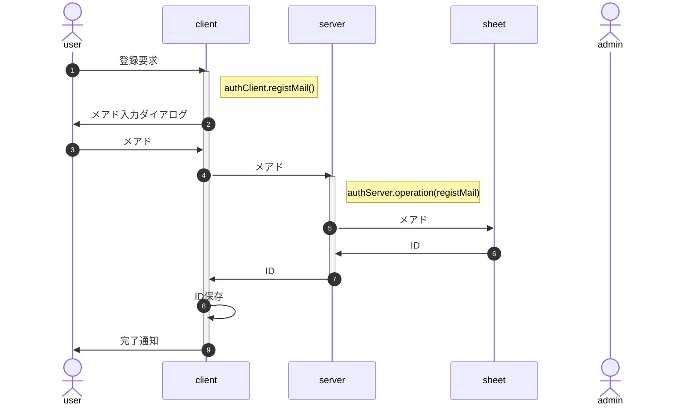
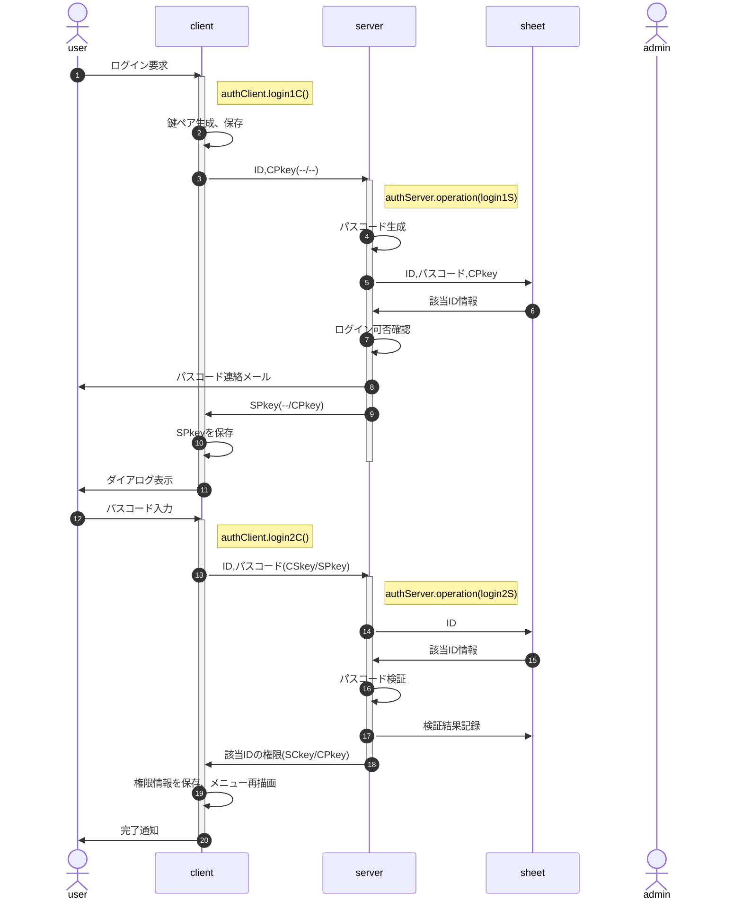
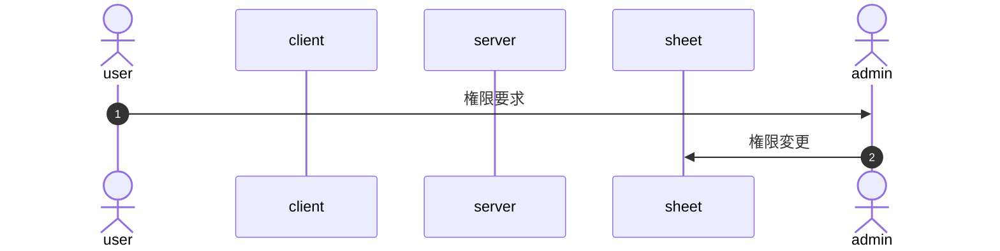
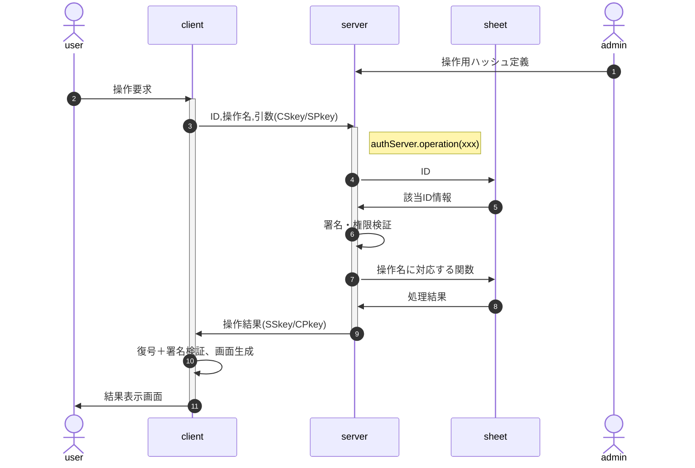

# Authクラス処理概要

## 前提

### 公開鍵・秘密鍵

窃取したIDでの操作を防止するため、clientで有効期間付きの鍵ペアを生成し、依頼元の信頼性を確保する(CSkey, CPkey : clientの秘密鍵・公開鍵)。

また何らかの手段でCPkeyが窃取されて操作要求が行われた場合、処理結果の暗号化で結果受領を阻止するため、server側も鍵ペアを使用する(SSkey, SPkey : serverの秘密鍵・公開鍵)。

以降の図中で`(XSkey/YPkey)`は「X側の秘密鍵で署名、Y側の公開鍵で暗号化する」の意味。

### シート操作オブジェクト

シートの操作(CRUD)は権限と有効期間の確認が必要なため、以下のようなオブジェクト(ハッシュ)を管理者がソースに埋め込む(configとして定義する)ことで行う。

```
config.operations = {
  lookup : {  // {string} 操作名
    auth : 0, // {number} 操作を許可する権限フラグの論理和
    from : null, // {string} 有効期間を設定する場合、開始日時文字列
    to : null, // {string} 同、終了日時文字列
    func: // {Arrow|Function} 操作を定義する関数
      (data,id) => data.find(x => x.id === id),
  },
  list : {...},
  update : {...},
  ...
}
```

## 新規登録

新規登録では、シート上にIDとメアドのみ作成する。申込者名等、登録内容についてはログイン後に自情報編集画面を呼び出し、修正・加筆を行う。



- 新規要求ができる期間の制限は、client側でも行う(BurgerMenuの有効期間設定を想定)
- メアド入力はダイアログで行う(開発工数低減)
- メアドは正規表現による形式チェックのみ、到達確認および別ソースとの突合は行わない(ex.在校生メアド一覧との突合)
- 申込時に自分限定の申込情報操作のためログインすることになるので、メール到達確認はそこで行う
- IDはcookieでの保存を想定(∵個人情報では無く、タブを閉じても保存しておきたい)

## ログイン要求



- IDは保存済の前提
- clientの鍵およびSPkeyはsessionStorageへの保存を想定<br>
  (∵当該session以外からの参照を阻止、かつ永続的な保存は望ましくない)
- 有効期間内の鍵ペアが存在したら、鍵ペア生成はスキップ
- 該当ID情報：ID、メアド、権限、現在設定中のパスコード＋生成日時、入力内容＋成否ログ
- ログイン可否確認
  - 前回ログイン失敗(3回連続失敗)から一定以上の時間経過(既定値1時間)
  - パスコード再発行は上述の条件が満たされる限り認める<br>
    例：旧パスコードで2回連続失敗、再発行後の1回目で失敗したら凍結
- 「パスコード検証」は復号・署名確認の上、以下の点をチェックする
  - パスコードが一致
  - 試行回数が一定数以下(既定値3回)
  - パスコード生成から一定時間内(既定値15分)
  - ログイン可能な権限
- パスコード入力はダイアログで行う(開発工数低減)

## 権限設定(変更)

権限を付与すべきかは個別に判断する必要があるため、システム化せず、管理者がシートを直接更新する。



## 検索・編集・更新

シートの操作(CRUD)は、管理者が事前に`{操作名:実行関数}`の形でソースに埋め込んで定義する。<br>
例：`{lookup:(arg)=>data.find(x=>x.id==arg.id)}`

userは要求時に操作名を指定し、その実行結果を受け取る。



- 「署名・権限検証」では復号・署名検証の上、以下の点の確認を行う
  - CPkeyの有効期限
  - 該当IDは当該操作の実行権限を持つか
