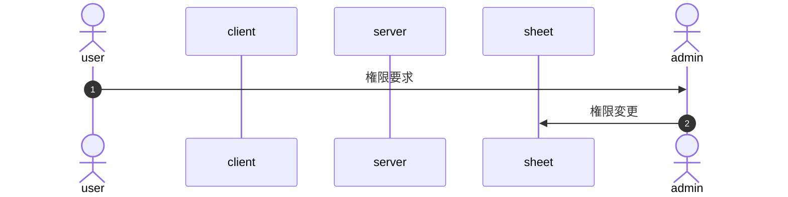

# 権限設定(変更)

権限を付与すべきかは個別に判断する必要があるため、システム化せず、管理者がシートを直接更新する。

```mermaid
sequenceDiagram
  autonumber
  actor user
  participant client
  participant server
  participant sheet
  actor admin

  user ->> admin : 権限要求
  admin ->> sheet : 権限変更
```
