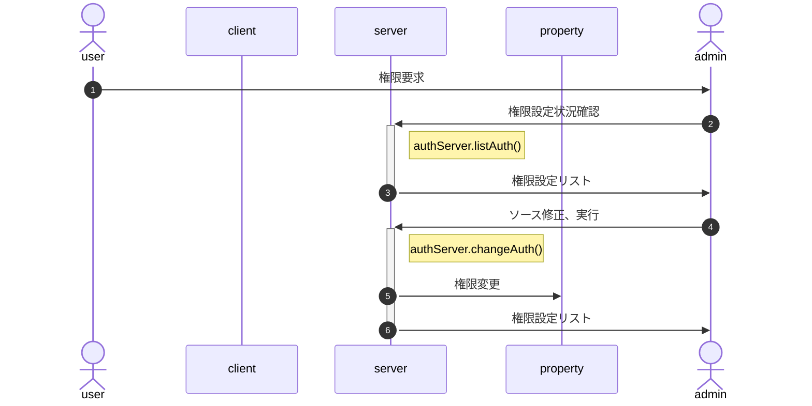

# 権限設定(変更)

権限を付与すべきかは個別に判断する必要があるため、システム化せず、管理者がソース(`authServer.changeAuth()`)を直接編集、GASコンソール上で実行する。

```mermaid
sequenceDiagram
  autonumber
  actor user
  participant client
  participant server
  participant property
  actor admin

  user ->> admin : 権限要求
  admin ->>+ server : 権限設定状況確認
  Note right of server : authServer.listAuth()
  server ->>- admin : 権限設定リスト
  admin ->>+ server : ソース修正、実行
  Note right of server : authServer.changeAuth()
  server ->> property : 権限変更
  server ->>- admin : 権限設定リスト
```
