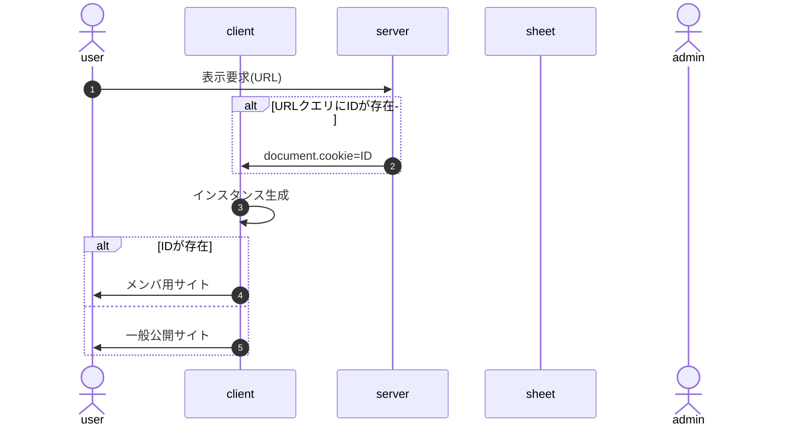
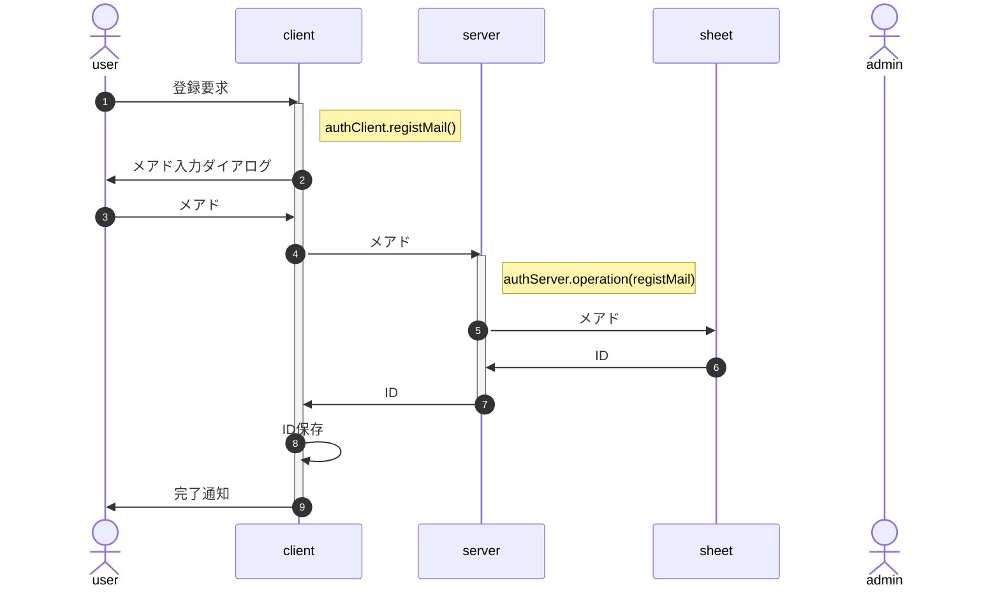
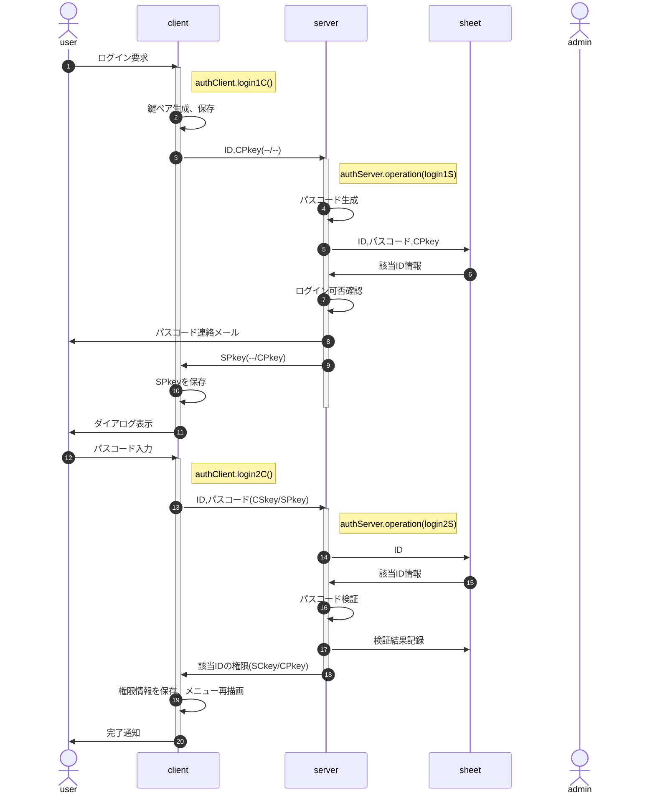
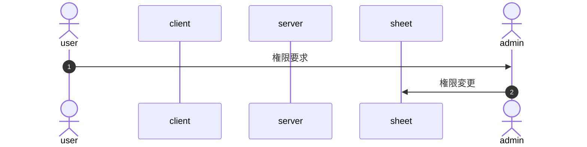
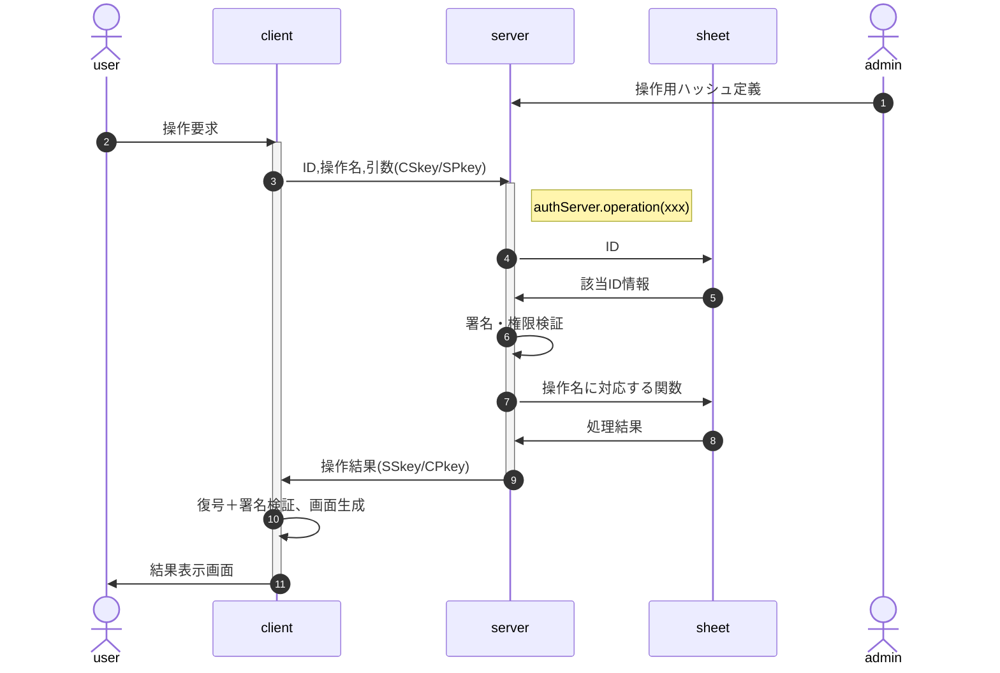

<!-- modifyMD original document 

<a name="Auth_top">class Auth</a>

イベントサイトにおける募集用・参加者用・スタッフ用メニューの表示制御等、認証に関する処理を行う。

クライアント(ブラウザ)側の"class authClient"とサーバ(GAS)側の"class authServer"に分かれるが、一体管理のためソースは一元管理する。

# 機能別処理フロー

## 初期化処理

<!--【初期化処理】--＞

システム導入時、Google Apps Scriptで一度だけ実行する必要のある処理。

実行後は秘匿のため、ソースごと削除することを推奨。このため独立した`initial.gs`を作成する。

### server側鍵ペア生成

### シートアクセス権の取得

### config Objの保存

## onload時処理

<!--【onload時処理】--＞

1. インスタンス生成
   1. BurgerMenuインスタンス生成
      1. AuthインスタンスをBurgerMenuのインスタンスメンバとして生成(以下Burger.auth)
      1. Burger.auth.IDの値に従ってAuthメニュー描画(メニューアイコン、nav領域)
   1. Authインスタンス生成
      1. cookieにIDがあるか確認
         - cookieにIDが保存されていたらインスタンスのメンバ(以下Auth.ID)として保存
         - 保存されていなければ`Auth.ID=未定(null)`

- この段階では「IDが特定されているかどうか」のみ判定
# 新規登録

新規登録では、シート上にIDとメアドのみ作成する。申込者名等、登録内容についてはログイン後に自情報編集画面を呼び出し、修正・加筆を行う。

- 新規要求ができる期間の制限は、client側でも行う(BurgerMenuの有効期間設定を想定)
- メアド入力はダイアログで行う(開発工数低減)
- メアドは正規表現による形式チェックのみ、到達確認および別ソースとの突合は行わない(ex.在校生メアド一覧との突合)
- 申込時に自分限定の申込情報操作のためログインすることになるので、メール到達確認はそこで行う
- IDはcookieでの保存を想定(∵個人情報では無く、タブを閉じても保存しておきたい)
# ログイン要求

- IDは保存済の前提
- clientの鍵およびSPkeyはsessionStorageへの保存を想定 
  (∵当該session以外からの参照を阻止、かつ永続的な保存は望ましくない)
- 有効期間内の鍵ペアが存在したら、鍵ペア生成はスキップ
- 該当ID情報：ID、メアド、権限、現在設定中のパスコード＋生成日時、入力内容＋成否ログ
- ログイン可否確認
  - 前回ログイン失敗(3回連続失敗)から一定以上の時間経過(既定値1時間)
  - パスコード再発行は上述の条件が満たされる限り認める 
    例：旧パスコードで2回連続失敗、再発行後の1回目で失敗したら凍結
- 「パスコード検証」は復号・署名確認の上、以下の点をチェックする
  - パスコードが一致
  - 試行回数が一定数以下(既定値3回)
  - パスコード生成から一定時間内(既定値15分)
  - ログイン可能な権限
- パスコード入力はダイアログで行う(開発工数低減)
# 権限設定(変更)

権限を付与すべきかは個別に判断する必要があるため、システム化せず、管理者がシートを直接更新する。

# 検索・編集・更新

シートの操作(CRUD)は、管理者が事前に`{操作名:実行関数}`の形でソースに埋め込んで定義する。 
例：`{lookup:(arg)=>data.find(x=>x.id==arg.id)}`

userは要求時に操作名を指定し、その実行結果を受け取る。

- 「署名・権限検証」では復号・署名検証の上、以下の点の確認を行う
  - CPkeyの有効期限
  - 該当IDは当該操作の実行権限を持つか

# 設定情報とオブジェクト定義

- client/server共通設定情報(config.common)
  > クラスメンバ
- authClient固有設定情報(config.client)
  > 保持するデータ構造を含む
- authServer固有設定情報(config.server)
- 引数・戻り値となるオブジェクトの定義(typedef)
- ID, RSA鍵(crypto)
  > client/serverで表にする。使用するライブラリcrypticoの使用方法を含む

# フォルダ構成

# フォルダ構成

- client/ : client(index.html)関係のソース
  - commonConfig.js : client/server共通config
  - clientConfig.js : client特有のconfig
  - proto.js : class Auth全体のソース
  - test.html : client関係のテスト用html
  - xxx.js : class Authの各メソッドのソース
- server/ : server(server.gs)関係のソース
  - serverConfig.js : server特有のconfig
- doc/ : readme.mdの各記事のソース集
  - proto.md : readme.mdのプロトタイプ
  - xxx.md : readme.mdに埋め込む各記事のソース
- build.sh : client/server全体のビルダ
- core.js : class Authのソース
- index.html : 
- server.gs : サーバ側Authのソース
- readme.md : doc配下を統合した、client/server全体の仕様書

# 仕様(JSDoc)

# プログラムソース

# 改版履歴

- rev.2.0.0 : class Authと統合
- rev.1.1.0 : 2024/03/14
  - setupInstanceをmergeDeeplyに置換(setupInstanceは廃番)
  - arg.funcの取り扱いを`new Function()`から直接関数を渡す形に修正
  - changeメソッドを廃止、changeScreenで代替
- rev.1.0.0 : 2024/01/03 初版
-->

<a name="Auth_top">class Auth</a>

イベントサイトにおける募集用・参加者用・スタッフ用メニューの表示制御等、認証に関する処理を行う。

クライアント(ブラウザ)側の"class authClient"とサーバ(GAS)側の"class authServer"に分かれるが、一体管理のためソースは一元管理する。

# 目次

1. <a href="#ac0001">機能別処理フロー</a>
   1. <a href="#ac0002">初期化処理</a>
      1. <a href="#ac0003">server側鍵ペア生成</a>
      1. <a href="#ac0004">シートアクセス権の取得</a>
      1. <a href="#ac0005">config Objの保存</a>
   1. <a href="#ac0006">onload時処理</a>
1. <a href="#ac0007">新規登録</a>
1. <a href="#ac0008">ログイン要求</a>
1. <a href="#ac0009">権限設定(変更)</a>
1. <a href="#ac0010">検索・編集・更新</a>
1. <a href="#ac0011">設定情報とオブジェクト定義</a>
1. <a href="#ac0012">フォルダ構成</a>
1. <a href="#ac0013">フォルダ構成</a>
1. <a href="#ac0014">仕様(JSDoc)</a>
1. <a href="#ac0015">プログラムソース</a>
1. <a href="#ac0016">改版履歴</a>

# 1 機能別処理フロー

[先頭](#ac0000)
 &gt; [機能別処理フロー | [新規登録](#ac0007) | [ログイン要求](#ac0008) | [権限設定(変更)](#ac0009) | [検索・編集・更新](#ac0010) | [設定情報とオブジェクト定義](#ac0011) | [フォルダ構成](#ac0012) | [フォルダ構成](#ac0013) | [仕様(JSDoc)](#ac0014) | [プログラムソース](#ac0015) | [改版履歴](#ac0016)]

## 1.1 初期化処理

[先頭](#ac0000) > [機能別処理フロー](#ac0001)
 &gt; [初期化処理 | [onload時処理](#ac0006)]

<!--【初期化処理】-->

システム導入時、Google Apps Scriptで一度だけ実行する必要のある処理。

実行後は秘匿のため、ソースごと削除することを推奨。このため独立した`initial.gs`を作成する。

### 1.1.1 server側鍵ペア生成

[先頭](#ac0000) > [機能別処理フロー](#ac0001) > [初期化処理](#ac0002)
 &gt; [server側鍵ペア生成 | [シートアクセス権の取得](#ac0004) | [config Objの保存](#ac0005)]

### 1.1.2 シートアクセス権の取得

[先頭](#ac0000) > [機能別処理フロー](#ac0001) > [初期化処理](#ac0002)
 &gt; [[server側鍵ペア生成](#ac0003) | シートアクセス権の取得 | [config Objの保存](#ac0005)]

### 1.1.3 config Objの保存

[先頭](#ac0000) > [機能別処理フロー](#ac0001) > [初期化処理](#ac0002)
 &gt; [[server側鍵ペア生成](#ac0003) | [シートアクセス権の取得](#ac0004) | config Objの保存]

## 1.2 onload時処理

[先頭](#ac0000) > [機能別処理フロー](#ac0001)
 &gt; [[初期化処理](#ac0002) | onload時処理]

<!--【onload時処理】-->

1. インスタンス生成
   1. BurgerMenuインスタンス生成
      1. AuthインスタンスをBurgerMenuのインスタンスメンバとして生成(以下Burger.auth)
      1. Burger.auth.IDの値に従ってAuthメニュー描画(メニューアイコン、nav領域)
   1. Authインスタンス生成
      1. cookieにIDがあるか確認
         - cookieにIDが保存されていたらインスタンスのメンバ(以下Auth.ID)として保存
         - 保存されていなければ`Auth.ID=未定(null)`

- この段階では「IDが特定されているかどうか」のみ判定
# 2 新規登録

[先頭](#ac0000)
 &gt; [[機能別処理フロー](#ac0001) | 新規登録 | [ログイン要求](#ac0008) | [権限設定(変更)](#ac0009) | [検索・編集・更新](#ac0010) | [設定情報とオブジェクト定義](#ac0011) | [フォルダ構成](#ac0012) | [フォルダ構成](#ac0013) | [仕様(JSDoc)](#ac0014) | [プログラムソース](#ac0015) | [改版履歴](#ac0016)]

新規登録では、シート上にIDとメアドのみ作成する。申込者名等、登録内容についてはログイン後に自情報編集画面を呼び出し、修正・加筆を行う。

- 新規要求ができる期間の制限は、client側でも行う(BurgerMenuの有効期間設定を想定)
- メアド入力はダイアログで行う(開発工数低減)
- メアドは正規表現による形式チェックのみ、到達確認および別ソースとの突合は行わない(ex.在校生メアド一覧との突合)
- 申込時に自分限定の申込情報操作のためログインすることになるので、メール到達確認はそこで行う
- IDはcookieでの保存を想定(∵個人情報では無く、タブを閉じても保存しておきたい)
# 3 ログイン要求

[先頭](#ac0000)
 &gt; [[機能別処理フロー](#ac0001) | [新規登録](#ac0007) | ログイン要求 | [権限設定(変更)](#ac0009) | [検索・編集・更新](#ac0010) | [設定情報とオブジェクト定義](#ac0011) | [フォルダ構成](#ac0012) | [フォルダ構成](#ac0013) | [仕様(JSDoc)](#ac0014) | [プログラムソース](#ac0015) | [改版履歴](#ac0016)]

- IDは保存済の前提
- clientの鍵およびSPkeyはsessionStorageへの保存を想定 
  (∵当該session以外からの参照を阻止、かつ永続的な保存は望ましくない)
- 有効期間内の鍵ペアが存在したら、鍵ペア生成はスキップ
- 該当ID情報：ID、メアド、権限、現在設定中のパスコード＋生成日時、入力内容＋成否ログ
- ログイン可否確認
  - 前回ログイン失敗(3回連続失敗)から一定以上の時間経過(既定値1時間)
  - パスコード再発行は上述の条件が満たされる限り認める 
    例：旧パスコードで2回連続失敗、再発行後の1回目で失敗したら凍結
- 「パスコード検証」は復号・署名確認の上、以下の点をチェックする
  - パスコードが一致
  - 試行回数が一定数以下(既定値3回)
  - パスコード生成から一定時間内(既定値15分)
  - ログイン可能な権限
- パスコード入力はダイアログで行う(開発工数低減)
# 4 権限設定(変更)

[先頭](#ac0000)
 &gt; [[機能別処理フロー](#ac0001) | [新規登録](#ac0007) | [ログイン要求](#ac0008) | 権限設定(変更) | [検索・編集・更新](#ac0010) | [設定情報とオブジェクト定義](#ac0011) | [フォルダ構成](#ac0012) | [フォルダ構成](#ac0013) | [仕様(JSDoc)](#ac0014) | [プログラムソース](#ac0015) | [改版履歴](#ac0016)]

権限を付与すべきかは個別に判断する必要があるため、システム化せず、管理者がシートを直接更新する。

# 5 検索・編集・更新

[先頭](#ac0000)
 &gt; [[機能別処理フロー](#ac0001) | [新規登録](#ac0007) | [ログイン要求](#ac0008) | [権限設定(変更)](#ac0009) | 検索・編集・更新 | [設定情報とオブジェクト定義](#ac0011) | [フォルダ構成](#ac0012) | [フォルダ構成](#ac0013) | [仕様(JSDoc)](#ac0014) | [プログラムソース](#ac0015) | [改版履歴](#ac0016)]

シートの操作(CRUD)は、管理者が事前に`{操作名:実行関数}`の形でソースに埋め込んで定義する。 
例：`{lookup:(arg)=>data.find(x=>x.id==arg.id)}`

userは要求時に操作名を指定し、その実行結果を受け取る。

- 「署名・権限検証」では復号・署名検証の上、以下の点の確認を行う
  - CPkeyの有効期限
  - 該当IDは当該操作の実行権限を持つか

# 6 設定情報とオブジェクト定義

[先頭](#ac0000)
 &gt; [[機能別処理フロー](#ac0001) | [新規登録](#ac0007) | [ログイン要求](#ac0008) | [権限設定(変更)](#ac0009) | [検索・編集・更新](#ac0010) | 設定情報とオブジェクト定義 | [フォルダ構成](#ac0012) | [フォルダ構成](#ac0013) | [仕様(JSDoc)](#ac0014) | [プログラムソース](#ac0015) | [改版履歴](#ac0016)]

- client/server共通設定情報(config.common)
  > クラスメンバ
- authClient固有設定情報(config.client)
  > 保持するデータ構造を含む
- authServer固有設定情報(config.server)
- 引数・戻り値となるオブジェクトの定義(typedef)
- ID, RSA鍵(crypto)
  > client/serverで表にする。使用するライブラリcrypticoの使用方法を含む

# 7 フォルダ構成

[先頭](#ac0000)
 &gt; [[機能別処理フロー](#ac0001) | [新規登録](#ac0007) | [ログイン要求](#ac0008) | [権限設定(変更)](#ac0009) | [検索・編集・更新](#ac0010) | [設定情報とオブジェクト定義](#ac0011) | フォルダ構成 | [フォルダ構成](#ac0013) | [仕様(JSDoc)](#ac0014) | [プログラムソース](#ac0015) | [改版履歴](#ac0016)]

# 8 フォルダ構成

[先頭](#ac0000)
 &gt; [[機能別処理フロー](#ac0001) | [新規登録](#ac0007) | [ログイン要求](#ac0008) | [権限設定(変更)](#ac0009) | [検索・編集・更新](#ac0010) | [設定情報とオブジェクト定義](#ac0011) | [フォルダ構成](#ac0012) | フォルダ構成 | [仕様(JSDoc)](#ac0014) | [プログラムソース](#ac0015) | [改版履歴](#ac0016)]

- client/ : client(index.html)関係のソース
  - commonConfig.js : client/server共通config
  - clientConfig.js : client特有のconfig
  - proto.js : class Auth全体のソース
  - test.html : client関係のテスト用html
  - xxx.js : class Authの各メソッドのソース
- server/ : server(server.gs)関係のソース
  - serverConfig.js : server特有のconfig
- doc/ : readme.mdの各記事のソース集
  - proto.md : readme.mdのプロトタイプ
  - xxx.md : readme.mdに埋め込む各記事のソース
- build.sh : client/server全体のビルダ
- core.js : class Authのソース
- index.html : 
- server.gs : サーバ側Authのソース
- readme.md : doc配下を統合した、client/server全体の仕様書

# 9 仕様(JSDoc)

[先頭](#ac0000)
 &gt; [[機能別処理フロー](#ac0001) | [新規登録](#ac0007) | [ログイン要求](#ac0008) | [権限設定(変更)](#ac0009) | [検索・編集・更新](#ac0010) | [設定情報とオブジェクト定義](#ac0011) | [フォルダ構成](#ac0012) | [フォルダ構成](#ac0013) | 仕様(JSDoc) | [プログラムソース](#ac0015) | [改版履歴](#ac0016)]

# 10 プログラムソース

[先頭](#ac0000)
 &gt; [[機能別処理フロー](#ac0001) | [新規登録](#ac0007) | [ログイン要求](#ac0008) | [権限設定(変更)](#ac0009) | [検索・編集・更新](#ac0010) | [設定情報とオブジェクト定義](#ac0011) | [フォルダ構成](#ac0012) | [フォルダ構成](#ac0013) | [仕様(JSDoc)](#ac0014) | プログラムソース | [改版履歴](#ac0016)]

# 11 改版履歴

[先頭](#ac0000)
 &gt; [[機能別処理フロー](#ac0001) | [新規登録](#ac0007) | [ログイン要求](#ac0008) | [権限設定(変更)](#ac0009) | [検索・編集・更新](#ac0010) | [設定情報とオブジェクト定義](#ac0011) | [フォルダ構成](#ac0012) | [フォルダ構成](#ac0013) | [仕様(JSDoc)](#ac0014) | [プログラムソース](#ac0015) | 改版履歴]

- rev.2.0.0 : class Authと統合
- rev.1.1.0 : 2024/03/14
  - setupInstanceをmergeDeeplyに置換(setupInstanceは廃番)
  - arg.funcの取り扱いを`new Function()`から直接関数を渡す形に修正
  - changeメソッドを廃止、changeScreenで代替
- rev.1.0.0 : 2024/01/03 初版

