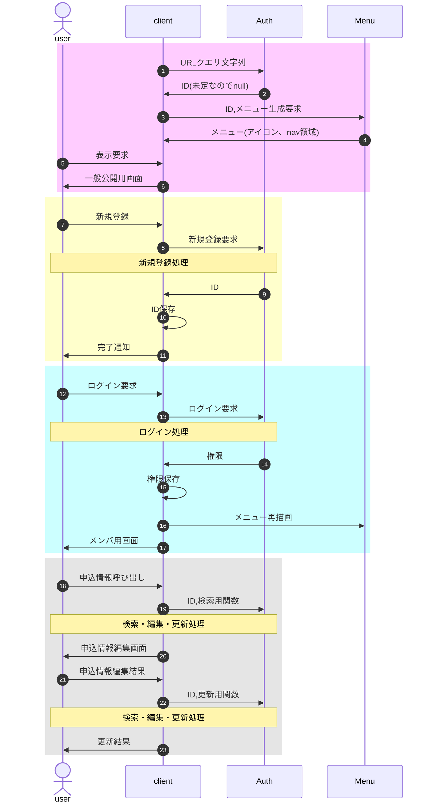
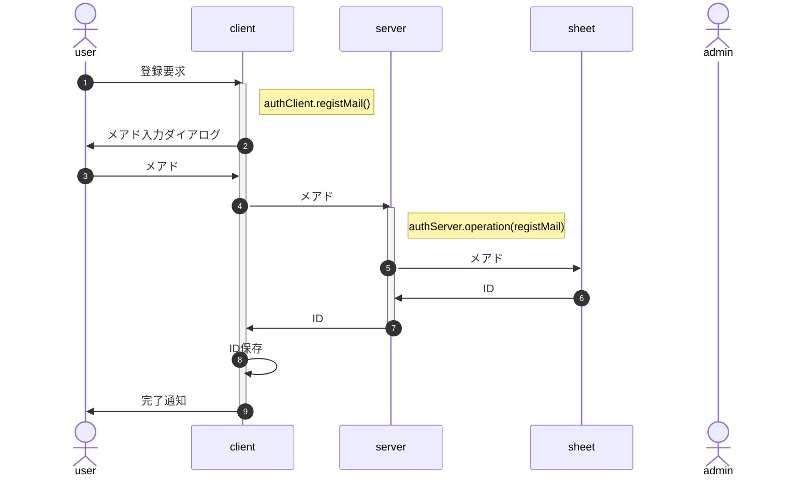
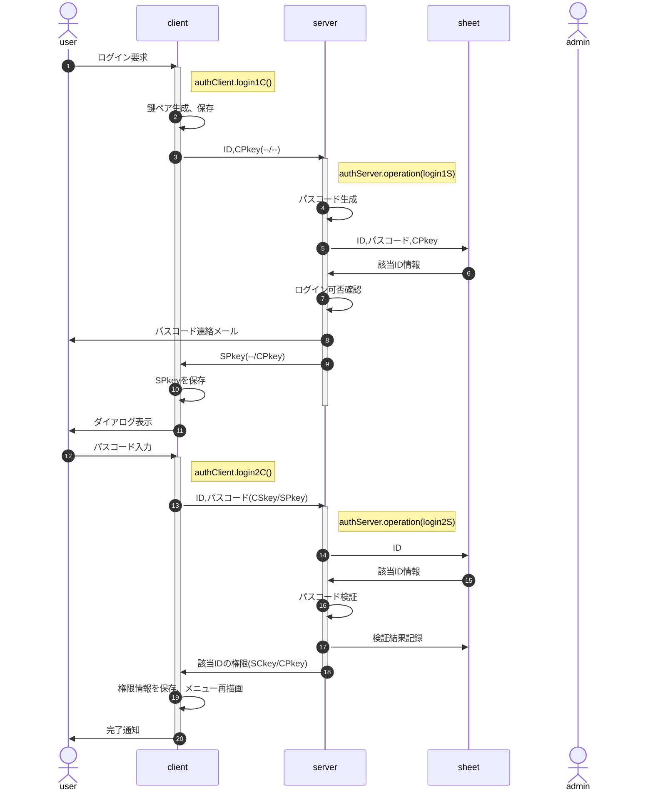
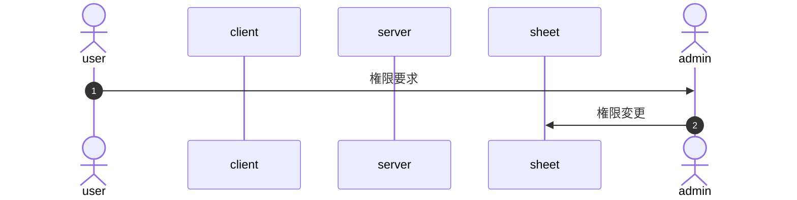
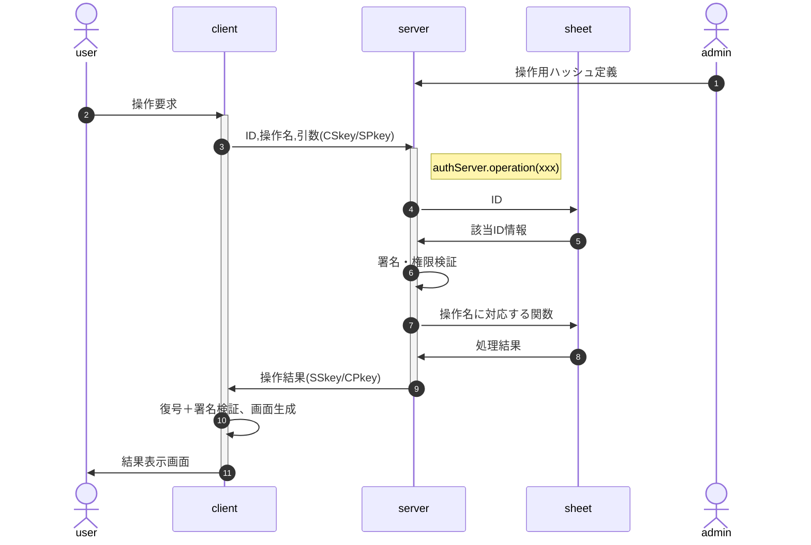

<!-- modifyMD original document 
<style>
/* -----------------------------------------------
  library/CSS/1.3.0/core.css
----------------------------------------------- */
html, body{
  width: 100%;
  margin: 0;
  /*font-size: 4vw;*/
  text-size-adjust: none; /* https://gotohayato.com/content/531/ */
}
body * {
  font-size: 1rem;
  font-family: sans-serif;
  box-sizing: border-box;
}
.num, .right {text-align:right;}
.screen {padding: 1rem;} /* SPAでの切替用画面 */
.title { /* Markdown他でのタイトル */
  font-size: 2.4rem;
  text-shadow: 2px 2px 5px #888;
}

/* --- テーブル -------------------------------- */
.table {display:grid}
th, .th, td, .td {
  margin: 0.2rem;
  padding: 0.2rem;
}
th, .th {
  background-color: #888;
  color: white;
}
td, .td {
  border-bottom: solid 1px #aaa;
  border-right: solid 1px #aaa;
}

/* --- 部品 ----------------------------------- */
.triDown { /* 下向き矢印 */
  --bw: 50px;
  width: 0px;
  height: 0px;
  border-top: calc(var(--bw) * 0.7) solid #aaa;
  border-right: var(--bw) solid transparent;
  border-left: var(--bw) solid transparent;
  border-bottom: calc(var(--bw) * 0.2) solid transparent;
}

/* --- 部品：待機画面 --------------------------- */
.loader,
.loader:after {
  border-radius: 50%;
  width: 10em;
  height: 10em;
}
.loader {
  margin: 60px auto;
  font-size: 10px;
  position: relative;
  text-indent: -9999em;
  border-top: 1.1em solid rgba(204,204,204, 0.2);
  border-right: 1.1em solid rgba(204,204,204, 0.2);
  border-bottom: 1.1em solid rgba(204,204,204, 0.2);
  border-left: 1.1em solid #cccccc;
  -webkit-transform: translateZ(0);
  -ms-transform: translateZ(0);
  transform: translateZ(0);
  -webkit-animation: load8 1.1s infinite linear;
  animation: load8 1.1s infinite linear;
}
@-webkit-keyframes load8 {
  0% {
    -webkit-transform: rotate(0deg);
    transform: rotate(0deg);
  }
  100% {
    -webkit-transform: rotate(360deg);
    transform: rotate(360deg);
  }
}
@keyframes load8 {
  0% {
    -webkit-transform: rotate(0deg);
    transform: rotate(0deg);
  }
  100% {
    -webkit-transform: rotate(360deg);
    transform: rotate(360deg);
  }
}
</style>
<p class="title"><a name="Auth_top">class Auth</a></p>

「参加者一覧」等、スタッフには必要だが参加者に公開したくないメニューが存在する。これの表示制御を行うため、スタッフと参加者では「権限(auth)」を分ける。

# authClient/authServerとBurgerMenuの連携

表示制御は、authClient/authServerによる権限確認機能と、それに基づいたBurgerMenuによる操作可能メニュー表示制御機能とが連携して行う。

連携は両方を呼び出すプログラム(ex.camp2024)のhtmlとconfigに所定の方法で定義することで実現する。

## Google Spreadシート

## BODYタグ内

## DOMContentLoaded(インスタンス化)

## インスタンス化時の引数定義

authClient/authServerとBurgerMenuで一部共通の値を設定する必要があるので、インスタンス化の際の引数を呼出元のconfigで設定することでこれを実現する。

### 共通部分

<!--:config.cooperation.js:--＞

### authClient特有部分

<!--:config.authClient.js:--＞

### authServer特有部分

<!--:config.authServer.js:--＞

### BurgerMenu特有部分

<!--:config.BurgerMenu.js:--＞

## 【備忘】GAS/htmlでの暗号化

- GAS
  - 鍵ペア生成
  - GASでの保存
  - 

### javascript用

- Node.jsスタイルで書かれたコードをブラウザ上で動くものに変換 : [ざっくりbrowserify入門](https://qiita.com/fgkm/items/a362b9917fa5f893c09a)
- [Javascriptで公開鍵ペア生成・暗号化/復号をしてみた](https://qiita.com/poruruba/items/272bdc8f539728d5b076)

javascript 鍵ペア ライブラリ


### GAS用

- [GASでトークン等を保存しておけるプロパティサービスについてまとめてみた](https://qiita.com/zumi0/items/85ca400d57f60728a7c7)
- [GASのプロパティサービス(プロパティストア)とは？3種類の各特徴と使い分け方まとめ](https://auto-worker.com/blog/?p=7829)


# SPAにおける表示制御

## 募集内容確認〜申込完了までの流れ

- 記号
  - client : camp2024等のブラウザ上のプログラム
  - Auth : class authClient+authServer
  - Menu : class BurgerMenu
- 領域色
  - ピンク : ID未定(初回)表示時の処理
  - 黄色 : 応募申込開始時の処理。詳細は「[新規登録](overview.md#新規登録)」参照
  - 水色 : メアド登録完了し、申込内容記入用のログイン処理。詳細は「[ログイン要求](overview.md#ログイン要求)」参照
  - 灰色 : ログイン完了後の申込内容記入処理。詳細は「[検索・編集・更新](overview.md#検索・編集・更新)」参照



■作成手順

1. Google Spreadを用意、名簿(list)シートを作成
1. configに名簿シート各項目の定義を記載
1. 実装する機能・ページ毎にclient(index.html)にDIV要素を作成
1. build.shを実行、client,server(server.gs)を生成
1. index.html,server.gsをシートのApps Scriptとしてコピー、デプロイ
# Authクラス処理概要

## 前提

### 公開鍵・秘密鍵

窃取したIDでの操作を防止するため、clientで有効期間付きの鍵ペアを生成し、依頼元の信頼性を確保する(CSkey, CPkey : clientの秘密鍵・公開鍵)。

また何らかの手段でCPkeyが窃取されて操作要求が行われた場合、処理結果の暗号化で結果受領を阻止するため、server側も鍵ペアを使用する(SSkey, SPkey : serverの秘密鍵・公開鍵)。

以降の図中で`(XSkey/YPkey)`は「X側の秘密鍵で署名、Y側の公開鍵で暗号化する」の意味。

### シート操作オブジェクト

シートの操作(CRUD)は権限と有効期間の確認が必要なため、以下のようなオブジェクト(ハッシュ)を管理者がソースに埋め込む(configとして定義する)ことで行う。

```
config.operations = {
  lookup : {  // {string} 操作名
    auth : 0, // {number} 操作を許可する権限フラグの論理和
    from : null, // {string} 有効期間を設定する場合、開始日時文字列
    to : null, // {string} 同、終了日時文字列
    func: // {Arrow|Function} 操作を定義する関数
      (data,id) => data.find(x => x.id === id),
  },
  list : {...},
  update : {...},
  ...
}
```

## 新規登録

新規登録では、シート上にIDとメアドのみ作成する。申込者名等、登録内容についてはログイン後に自情報編集画面を呼び出し、修正・加筆を行う。



- 新規要求ができる期間の制限は、client側でも行う(BurgerMenuの有効期間設定を想定)
- メアド入力はダイアログで行う(開発工数低減)
- メアドは正規表現による形式チェックのみ、到達確認および別ソースとの突合は行わない(ex.在校生メアド一覧との突合)
- 申込時に自分限定の申込情報操作のためログインすることになるので、メール到達確認はそこで行う
- IDはcookieでの保存を想定(∵個人情報では無く、タブを閉じても保存しておきたい)

## ログイン要求



- IDは保存済の前提
- clientの鍵およびSPkeyはsessionStorageへの保存を想定<br>
  (∵当該session以外からの参照を阻止、かつ永続的な保存は望ましくない)
- 有効期間内の鍵ペアが存在したら、鍵ペア生成はスキップ
- 該当ID情報：ID、メアド、権限、現在設定中のパスコード＋生成日時、入力内容＋成否ログ
- ログイン可否確認
  - 前回ログイン失敗(3回連続失敗)から一定以上の時間経過(既定値1時間)
  - パスコード再発行は上述の条件が満たされる限り認める<br>
    例：旧パスコードで2回連続失敗、再発行後の1回目で失敗したら凍結
- 「パスコード検証」は復号・署名確認の上、以下の点をチェックする
  - パスコードが一致
  - 試行回数が一定数以下(既定値3回)
  - パスコード生成から一定時間内(既定値15分)
  - ログイン可能な権限
- パスコード入力はダイアログで行う(開発工数低減)

## 権限設定(変更)

権限を付与すべきかは個別に判断する必要があるため、システム化せず、管理者がシートを直接更新する。



## 検索・編集・更新

シートの操作(CRUD)は、管理者が事前に`{操作名:実行関数}`の形でソースに埋め込んで定義する。<br>
例：`{lookup:(arg)=>data.find(x=>x.id==arg.id)}`

userは要求時に操作名を指定し、その実行結果を受け取る。



- 「署名・権限検証」では復号・署名検証の上、以下の点の確認を行う
  - CPkeyの有効期限
  - 該当IDは当該操作の実行権限を持つか

# フォルダ構成

- client/ : client(index.html)関係のソース
  - commonConfig.js : client/server共通config
  - clientConfig.js : client特有のconfig
  - proto.js : class Auth全体のソース
  - test.html : client関係のテスト用html
  - xxx.js : class Authの各メソッドのソース
- server/ : server(server.gs)関係のソース
  - serverConfig.js : server特有のconfig
- doc/ : readme.mdの各記事のソース集
  - proto.md : readme.mdのプロトタイプ
  - xxx.md : readme.mdに埋め込む各記事のソース
- build.sh : client/server全体のビルダ
- core.js : class Authのソース
- index.html : 
- server.gs : サーバ側Authのソース
- readme.md : doc配下を統合した、client/server全体の仕様書


# 仕様(JSDoc)


# プログラムソース


# 改版履歴

- rev.2.0.0 : class Authと統合
- rev.1.1.0 : 2024/03/14
  - setupInstanceをmergeDeeplyに置換(setupInstanceは廃番)
  - arg.funcの取り扱いを`new Function()`から直接関数を渡す形に修正
  - changeメソッドを廃止、changeScreenで代替
- rev.1.0.0 : 2024/01/03 初版
-->
<a name="ac0000"></a>
<style>
/* -----------------------------------------------
  library/CSS/1.3.0/core.css
----------------------------------------------- */
html, body{
  width: 100%;
  margin: 0;
  /*font-size: 4vw;*/
  text-size-adjust: none; /* https://gotohayato.com/content/531/ */
}
body * {
  font-size: 1rem;
  font-family: sans-serif;
  box-sizing: border-box;
}
.num, .right {text-align:right;}
.screen {padding: 1rem;} /* SPAでの切替用画面 */
.title { /* Markdown他でのタイトル */
  font-size: 2.4rem;
  text-shadow: 2px 2px 5px #888;
}

/* --- テーブル -------------------------------- */
.table {display:grid}
th, .th, td, .td {
  margin: 0.2rem;
  padding: 0.2rem;
}
th, .th {
  background-color: #888;
  color: white;
}
td, .td {
  border-bottom: solid 1px #aaa;
  border-right: solid 1px #aaa;
}

/* --- 部品 ----------------------------------- */
.triDown { /* 下向き矢印 */
  --bw: 50px;
  width: 0px;
  height: 0px;
  border-top: calc(var(--bw) * 0.7) solid #aaa;
  border-right: var(--bw) solid transparent;
  border-left: var(--bw) solid transparent;
  border-bottom: calc(var(--bw) * 0.2) solid transparent;
}

/* --- 部品：待機画面 --------------------------- */
.loader,
.loader:after {
  border-radius: 50%;
  width: 10em;
  height: 10em;
}
.loader {
  margin: 60px auto;
  font-size: 10px;
  position: relative;
  text-indent: -9999em;
  border-top: 1.1em solid rgba(204,204,204, 0.2);
  border-right: 1.1em solid rgba(204,204,204, 0.2);
  border-bottom: 1.1em solid rgba(204,204,204, 0.2);
  border-left: 1.1em solid #cccccc;
  -webkit-transform: translateZ(0);
  -ms-transform: translateZ(0);
  transform: translateZ(0);
  -webkit-animation: load8 1.1s infinite linear;
  animation: load8 1.1s infinite linear;
}
@-webkit-keyframes load8 {
  0% {
    -webkit-transform: rotate(0deg);
    transform: rotate(0deg);
  }
  100% {
    -webkit-transform: rotate(360deg);
    transform: rotate(360deg);
  }
}
@keyframes load8 {
  0% {
    -webkit-transform: rotate(0deg);
    transform: rotate(0deg);
  }
  100% {
    -webkit-transform: rotate(360deg);
    transform: rotate(360deg);
  }
}
</style>
<p class="title"><a name="Auth_top">class Auth</a></p>

「参加者一覧」等、スタッフには必要だが参加者に公開したくないメニューが存在する。これの表示制御を行うため、スタッフと参加者では「権限(auth)」を分ける。


# 目次

1. <a href="#ac0001">authClient/authServerとBurgerMenuの連携</a>
   1. <a href="#ac0002">Google Spreadシート</a>
   1. <a href="#ac0003">BODYタグ内</a>
   1. <a href="#ac0004">DOMContentLoaded(インスタンス化)</a>
   1. <a href="#ac0005">インスタンス化時の引数定義</a>
      1. <a href="#ac0006">共通部分</a>
      1. <a href="#ac0007">authClient特有部分</a>
      1. <a href="#ac0008">authServer特有部分</a>
      1. <a href="#ac0009">BurgerMenu特有部分</a>
   1. <a href="#ac0010">【備忘】GAS/htmlでの暗号化</a>
      1. <a href="#ac0011">javascript用</a>
      1. <a href="#ac0012">GAS用</a>
1. <a href="#ac0013">SPAにおける表示制御</a>
   1. <a href="#ac0014">募集内容確認〜申込完了までの流れ</a>
1. <a href="#ac0015">Authクラス処理概要</a>
   1. <a href="#ac0016">前提</a>
      1. <a href="#ac0017">公開鍵・秘密鍵</a>
      1. <a href="#ac0018">シート操作オブジェクト</a>
   1. <a href="#ac0019">新規登録</a>
   1. <a href="#ac0020">ログイン要求</a>
   1. <a href="#ac0021">権限設定(変更)</a>
   1. <a href="#ac0022">検索・編集・更新</a>
1. <a href="#ac0023">フォルダ構成</a>
1. <a href="#ac0024">仕様(JSDoc)</a>
1. <a href="#ac0025">プログラムソース</a>
1. <a href="#ac0026">改版履歴</a>

# 1 authClient/authServerとBurgerMenuの連携<a name="ac0001"></a>

[先頭](#ac0000)
<br>&gt; [authClient/authServerとBurgerMenuの連携 | [SPAにおける表示制御](#ac0013) | [Authクラス処理概要](#ac0015) | [フォルダ構成](#ac0023) | [仕様(JSDoc)](#ac0024) | [プログラムソース](#ac0025) | [改版履歴](#ac0026)]


表示制御は、authClient/authServerによる権限確認機能と、それに基づいたBurgerMenuによる操作可能メニュー表示制御機能とが連携して行う。

連携は両方を呼び出すプログラム(ex.camp2024)のhtmlとconfigに所定の方法で定義することで実現する。

## 1.1 Google Spreadシート<a name="ac0002"></a>

[先頭](#ac0000) > [authClient/authServerとBurgerMenuの連携](#ac0001)
<br>&gt; [Google Spreadシート | [BODYタグ内](#ac0003) | [DOMContentLoaded(インスタンス化)](#ac0004) | [インスタンス化時の引数定義](#ac0005) | [【備忘】GAS/htmlでの暗号化](#ac0010)]


## 1.2 BODYタグ内<a name="ac0003"></a>

[先頭](#ac0000) > [authClient/authServerとBurgerMenuの連携](#ac0001)
<br>&gt; [[Google Spreadシート](#ac0002) | BODYタグ内 | [DOMContentLoaded(インスタンス化)](#ac0004) | [インスタンス化時の引数定義](#ac0005) | [【備忘】GAS/htmlでの暗号化](#ac0010)]


## 1.3 DOMContentLoaded(インスタンス化)<a name="ac0004"></a>

[先頭](#ac0000) > [authClient/authServerとBurgerMenuの連携](#ac0001)
<br>&gt; [[Google Spreadシート](#ac0002) | [BODYタグ内](#ac0003) | DOMContentLoaded(インスタンス化) | [インスタンス化時の引数定義](#ac0005) | [【備忘】GAS/htmlでの暗号化](#ac0010)]


## 1.4 インスタンス化時の引数定義<a name="ac0005"></a>

[先頭](#ac0000) > [authClient/authServerとBurgerMenuの連携](#ac0001)
<br>&gt; [[Google Spreadシート](#ac0002) | [BODYタグ内](#ac0003) | [DOMContentLoaded(インスタンス化)](#ac0004) | インスタンス化時の引数定義 | [【備忘】GAS/htmlでの暗号化](#ac0010)]


authClient/authServerとBurgerMenuで一部共通の値を設定する必要があるので、インスタンス化の際の引数を呼出元のconfigで設定することでこれを実現する。

### 1.4.1 共通部分<a name="ac0006"></a>

[先頭](#ac0000) > [authClient/authServerとBurgerMenuの連携](#ac0001) > [インスタンス化時の引数定義](#ac0005)
<br>&gt; [共通部分 | [authClient特有部分](#ac0007) | [authServer特有部分](#ac0008) | [BurgerMenu特有部分](#ac0009)]


<!--:config.cooperation.js:-->

### 1.4.2 authClient特有部分<a name="ac0007"></a>

[先頭](#ac0000) > [authClient/authServerとBurgerMenuの連携](#ac0001) > [インスタンス化時の引数定義](#ac0005)
<br>&gt; [[共通部分](#ac0006) | authClient特有部分 | [authServer特有部分](#ac0008) | [BurgerMenu特有部分](#ac0009)]


<!--:config.authClient.js:-->

### 1.4.3 authServer特有部分<a name="ac0008"></a>

[先頭](#ac0000) > [authClient/authServerとBurgerMenuの連携](#ac0001) > [インスタンス化時の引数定義](#ac0005)
<br>&gt; [[共通部分](#ac0006) | [authClient特有部分](#ac0007) | authServer特有部分 | [BurgerMenu特有部分](#ac0009)]


<!--:config.authServer.js:-->

### 1.4.4 BurgerMenu特有部分<a name="ac0009"></a>

[先頭](#ac0000) > [authClient/authServerとBurgerMenuの連携](#ac0001) > [インスタンス化時の引数定義](#ac0005)
<br>&gt; [[共通部分](#ac0006) | [authClient特有部分](#ac0007) | [authServer特有部分](#ac0008) | BurgerMenu特有部分]


<!--:config.BurgerMenu.js:-->

## 1.5 【備忘】GAS/htmlでの暗号化<a name="ac0010"></a>

[先頭](#ac0000) > [authClient/authServerとBurgerMenuの連携](#ac0001)
<br>&gt; [[Google Spreadシート](#ac0002) | [BODYタグ内](#ac0003) | [DOMContentLoaded(インスタンス化)](#ac0004) | [インスタンス化時の引数定義](#ac0005) | 【備忘】GAS/htmlでの暗号化]


- GAS
  - 鍵ペア生成
  - GASでの保存
  - 

### 1.5.1 javascript用<a name="ac0011"></a>

[先頭](#ac0000) > [authClient/authServerとBurgerMenuの連携](#ac0001) > [【備忘】GAS/htmlでの暗号化](#ac0010)
<br>&gt; [javascript用 | [GAS用](#ac0012)]


- Node.jsスタイルで書かれたコードをブラウザ上で動くものに変換 : [ざっくりbrowserify入門](https://qiita.com/fgkm/items/a362b9917fa5f893c09a)
- [Javascriptで公開鍵ペア生成・暗号化/復号をしてみた](https://qiita.com/poruruba/items/272bdc8f539728d5b076)

javascript 鍵ペア ライブラリ


### 1.5.2 GAS用<a name="ac0012"></a>

[先頭](#ac0000) > [authClient/authServerとBurgerMenuの連携](#ac0001) > [【備忘】GAS/htmlでの暗号化](#ac0010)
<br>&gt; [[javascript用](#ac0011) | GAS用]


- [GASでトークン等を保存しておけるプロパティサービスについてまとめてみた](https://qiita.com/zumi0/items/85ca400d57f60728a7c7)
- [GASのプロパティサービス(プロパティストア)とは？3種類の各特徴と使い分け方まとめ](https://auto-worker.com/blog/?p=7829)


# 2 SPAにおける表示制御<a name="ac0013"></a>

[先頭](#ac0000)
<br>&gt; [[authClient/authServerとBurgerMenuの連携](#ac0001) | SPAにおける表示制御 | [Authクラス処理概要](#ac0015) | [フォルダ構成](#ac0023) | [仕様(JSDoc)](#ac0024) | [プログラムソース](#ac0025) | [改版履歴](#ac0026)]


## 2.1 募集内容確認〜申込完了までの流れ<a name="ac0014"></a>

[先頭](#ac0000) > [SPAにおける表示制御](#ac0013)
<br>&gt; [募集内容確認〜申込完了までの流れ]


- 記号
  - client : camp2024等のブラウザ上のプログラム
  - Auth : class authClient+authServer
  - Menu : class BurgerMenu
- 領域色
  - ピンク : ID未定(初回)表示時の処理
  - 黄色 : 応募申込開始時の処理。詳細は「[新規登録](overview.md#新規登録)」参照
  - 水色 : メアド登録完了し、申込内容記入用のログイン処理。詳細は「[ログイン要求](overview.md#ログイン要求)」参照
  - 灰色 : ログイン完了後の申込内容記入処理。詳細は「[検索・編集・更新](overview.md#検索・編集・更新)」参照


■作成手順

1. Google Spreadを用意、名簿(list)シートを作成
1. configに名簿シート各項目の定義を記載
1. 実装する機能・ページ毎にclient(index.html)にDIV要素を作成
1. build.shを実行、client,server(server.gs)を生成
1. index.html,server.gsをシートのApps Scriptとしてコピー、デプロイ
# 3 Authクラス処理概要<a name="ac0015"></a>

[先頭](#ac0000)
<br>&gt; [[authClient/authServerとBurgerMenuの連携](#ac0001) | [SPAにおける表示制御](#ac0013) | Authクラス処理概要 | [フォルダ構成](#ac0023) | [仕様(JSDoc)](#ac0024) | [プログラムソース](#ac0025) | [改版履歴](#ac0026)]


## 3.1 前提<a name="ac0016"></a>

[先頭](#ac0000) > [Authクラス処理概要](#ac0015)
<br>&gt; [前提 | [新規登録](#ac0019) | [ログイン要求](#ac0020) | [権限設定(変更)](#ac0021) | [検索・編集・更新](#ac0022)]


### 3.1.1 公開鍵・秘密鍵<a name="ac0017"></a>

[先頭](#ac0000) > [Authクラス処理概要](#ac0015) > [前提](#ac0016)
<br>&gt; [公開鍵・秘密鍵 | [シート操作オブジェクト](#ac0018)]


窃取したIDでの操作を防止するため、clientで有効期間付きの鍵ペアを生成し、依頼元の信頼性を確保する(CSkey, CPkey : clientの秘密鍵・公開鍵)。

また何らかの手段でCPkeyが窃取されて操作要求が行われた場合、処理結果の暗号化で結果受領を阻止するため、server側も鍵ペアを使用する(SSkey, SPkey : serverの秘密鍵・公開鍵)。

以降の図中で`(XSkey/YPkey)`は「X側の秘密鍵で署名、Y側の公開鍵で暗号化する」の意味。

### 3.1.2 シート操作オブジェクト<a name="ac0018"></a>

[先頭](#ac0000) > [Authクラス処理概要](#ac0015) > [前提](#ac0016)
<br>&gt; [[公開鍵・秘密鍵](#ac0017) | シート操作オブジェクト]


シートの操作(CRUD)は権限と有効期間の確認が必要なため、以下のようなオブジェクト(ハッシュ)を管理者がソースに埋め込む(configとして定義する)ことで行う。

```
config.operations = {
  lookup : {  // {string} 操作名
    auth : 0, // {number} 操作を許可する権限フラグの論理和
    from : null, // {string} 有効期間を設定する場合、開始日時文字列
    to : null, // {string} 同、終了日時文字列
    func: // {Arrow|Function} 操作を定義する関数
      (data,id) => data.find(x => x.id === id),
  },
  list : {...},
  update : {...},
  ...
}
```

## 3.2 新規登録<a name="ac0019"></a>

[先頭](#ac0000) > [Authクラス処理概要](#ac0015)
<br>&gt; [[前提](#ac0016) | 新規登録 | [ログイン要求](#ac0020) | [権限設定(変更)](#ac0021) | [検索・編集・更新](#ac0022)]


新規登録では、シート上にIDとメアドのみ作成する。申込者名等、登録内容についてはログイン後に自情報編集画面を呼び出し、修正・加筆を行う。


- 新規要求ができる期間の制限は、client側でも行う(BurgerMenuの有効期間設定を想定)
- メアド入力はダイアログで行う(開発工数低減)
- メアドは正規表現による形式チェックのみ、到達確認および別ソースとの突合は行わない(ex.在校生メアド一覧との突合)
- 申込時に自分限定の申込情報操作のためログインすることになるので、メール到達確認はそこで行う
- IDはcookieでの保存を想定(∵個人情報では無く、タブを閉じても保存しておきたい)

## 3.3 ログイン要求<a name="ac0020"></a>

[先頭](#ac0000) > [Authクラス処理概要](#ac0015)
<br>&gt; [[前提](#ac0016) | [新規登録](#ac0019) | ログイン要求 | [権限設定(変更)](#ac0021) | [検索・編集・更新](#ac0022)]


- IDは保存済の前提
- clientの鍵およびSPkeyはsessionStorageへの保存を想定<br>
  (∵当該session以外からの参照を阻止、かつ永続的な保存は望ましくない)
- 有効期間内の鍵ペアが存在したら、鍵ペア生成はスキップ
- 該当ID情報：ID、メアド、権限、現在設定中のパスコード＋生成日時、入力内容＋成否ログ
- ログイン可否確認
  - 前回ログイン失敗(3回連続失敗)から一定以上の時間経過(既定値1時間)
  - パスコード再発行は上述の条件が満たされる限り認める<br>
    例：旧パスコードで2回連続失敗、再発行後の1回目で失敗したら凍結
- 「パスコード検証」は復号・署名確認の上、以下の点をチェックする
  - パスコードが一致
  - 試行回数が一定数以下(既定値3回)
  - パスコード生成から一定時間内(既定値15分)
  - ログイン可能な権限
- パスコード入力はダイアログで行う(開発工数低減)

## 3.4 権限設定(変更)<a name="ac0021"></a>

[先頭](#ac0000) > [Authクラス処理概要](#ac0015)
<br>&gt; [[前提](#ac0016) | [新規登録](#ac0019) | [ログイン要求](#ac0020) | 権限設定(変更) | [検索・編集・更新](#ac0022)]


権限を付与すべきかは個別に判断する必要があるため、システム化せず、管理者がシートを直接更新する。


## 3.5 検索・編集・更新<a name="ac0022"></a>

[先頭](#ac0000) > [Authクラス処理概要](#ac0015)
<br>&gt; [[前提](#ac0016) | [新規登録](#ac0019) | [ログイン要求](#ac0020) | [権限設定(変更)](#ac0021) | 検索・編集・更新]


シートの操作(CRUD)は、管理者が事前に`{操作名:実行関数}`の形でソースに埋め込んで定義する。<br>
例：`{lookup:(arg)=>data.find(x=>x.id==arg.id)}`

userは要求時に操作名を指定し、その実行結果を受け取る。


- 「署名・権限検証」では復号・署名検証の上、以下の点の確認を行う
  - CPkeyの有効期限
  - 該当IDは当該操作の実行権限を持つか

# 4 フォルダ構成<a name="ac0023"></a>

[先頭](#ac0000)
<br>&gt; [[authClient/authServerとBurgerMenuの連携](#ac0001) | [SPAにおける表示制御](#ac0013) | [Authクラス処理概要](#ac0015) | フォルダ構成 | [仕様(JSDoc)](#ac0024) | [プログラムソース](#ac0025) | [改版履歴](#ac0026)]


- client/ : client(index.html)関係のソース
  - commonConfig.js : client/server共通config
  - clientConfig.js : client特有のconfig
  - proto.js : class Auth全体のソース
  - test.html : client関係のテスト用html
  - xxx.js : class Authの各メソッドのソース
- server/ : server(server.gs)関係のソース
  - serverConfig.js : server特有のconfig
- doc/ : readme.mdの各記事のソース集
  - proto.md : readme.mdのプロトタイプ
  - xxx.md : readme.mdに埋め込む各記事のソース
- build.sh : client/server全体のビルダ
- core.js : class Authのソース
- index.html : 
- server.gs : サーバ側Authのソース
- readme.md : doc配下を統合した、client/server全体の仕様書


# 5 仕様(JSDoc)<a name="ac0024"></a>

[先頭](#ac0000)
<br>&gt; [[authClient/authServerとBurgerMenuの連携](#ac0001) | [SPAにおける表示制御](#ac0013) | [Authクラス処理概要](#ac0015) | [フォルダ構成](#ac0023) | 仕様(JSDoc) | [プログラムソース](#ac0025) | [改版履歴](#ac0026)]


# 6 プログラムソース<a name="ac0025"></a>

[先頭](#ac0000)
<br>&gt; [[authClient/authServerとBurgerMenuの連携](#ac0001) | [SPAにおける表示制御](#ac0013) | [Authクラス処理概要](#ac0015) | [フォルダ構成](#ac0023) | [仕様(JSDoc)](#ac0024) | プログラムソース | [改版履歴](#ac0026)]


# 7 改版履歴<a name="ac0026"></a>

[先頭](#ac0000)
<br>&gt; [[authClient/authServerとBurgerMenuの連携](#ac0001) | [SPAにおける表示制御](#ac0013) | [Authクラス処理概要](#ac0015) | [フォルダ構成](#ac0023) | [仕様(JSDoc)](#ac0024) | [プログラムソース](#ac0025) | 改版履歴]


- rev.2.0.0 : class Authと統合
- rev.1.1.0 : 2024/03/14
  - setupInstanceをmergeDeeplyに置換(setupInstanceは廃番)
  - arg.funcの取り扱いを`new Function()`から直接関数を渡す形に修正
  - changeメソッドを廃止、changeScreenで代替
- rev.1.0.0 : 2024/01/03 初版

