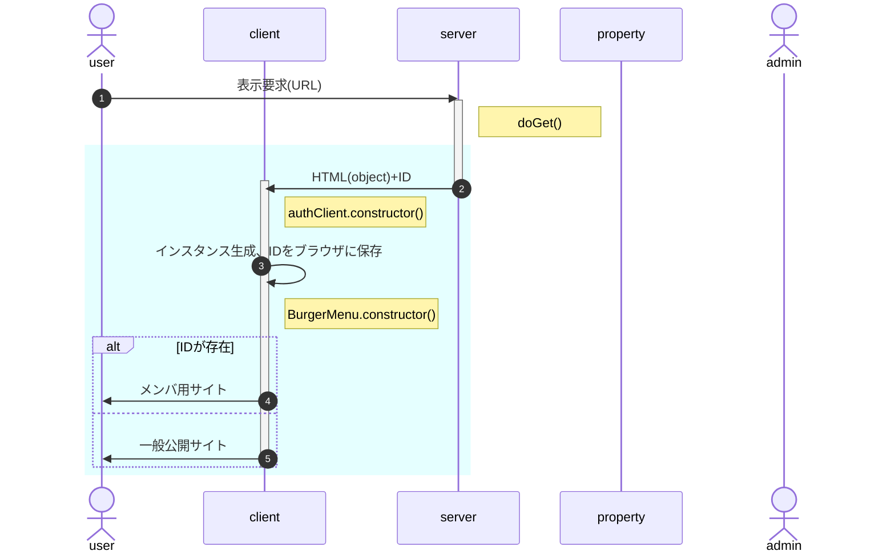
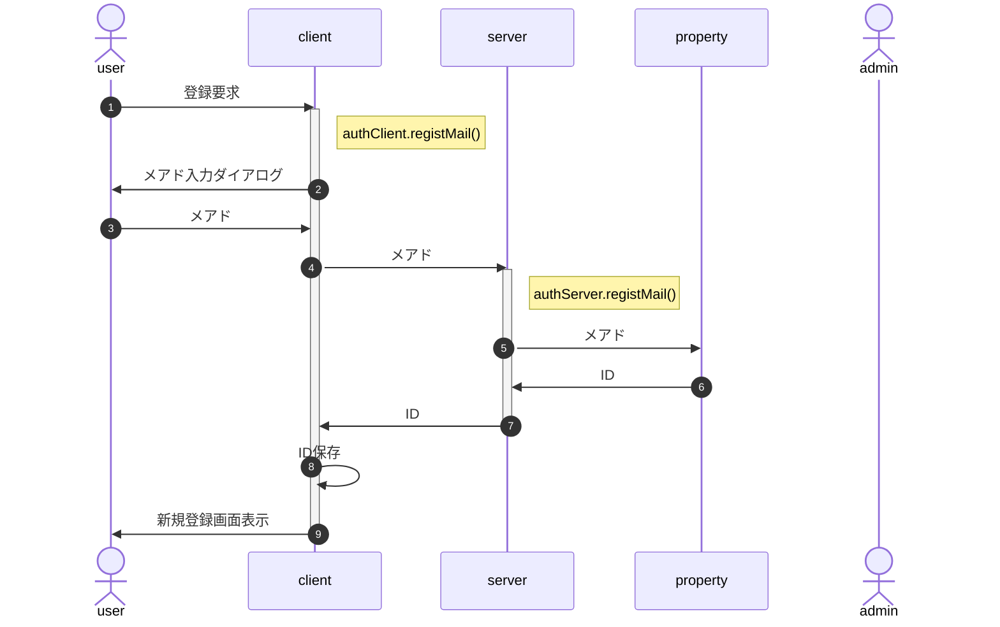
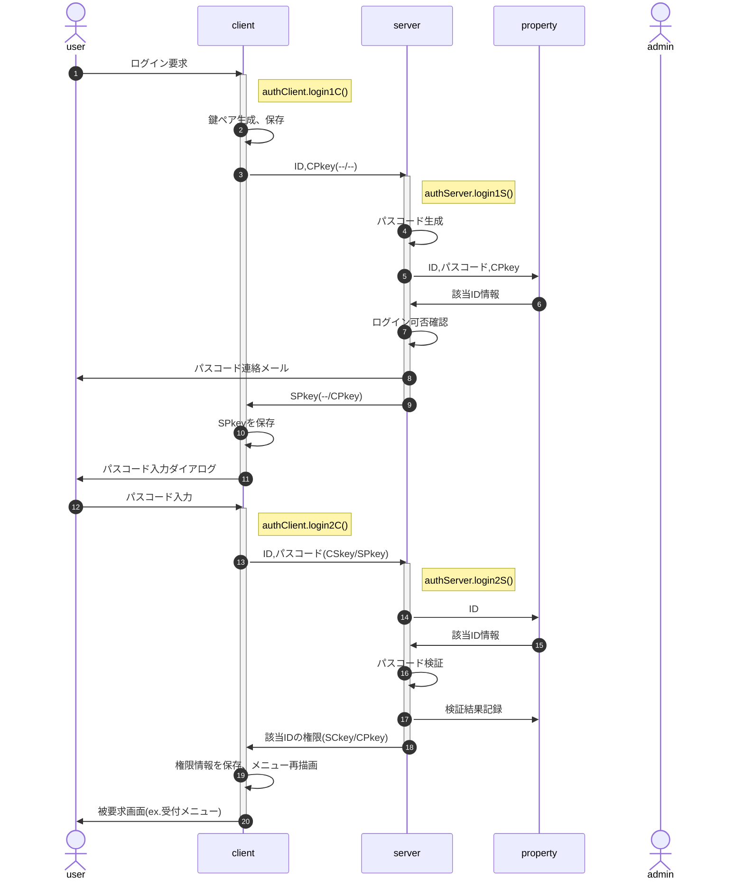
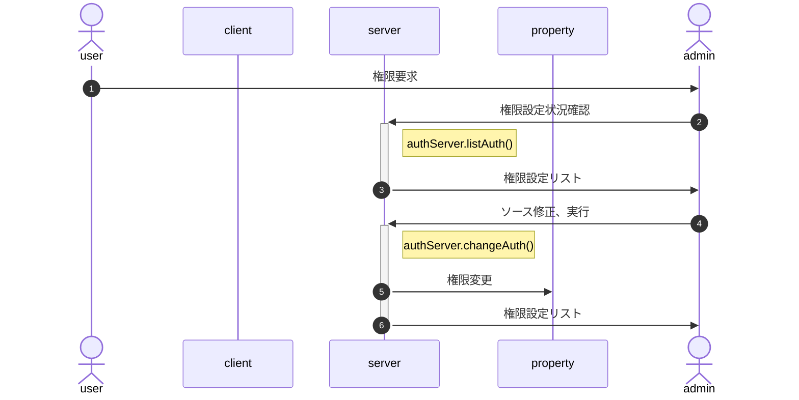
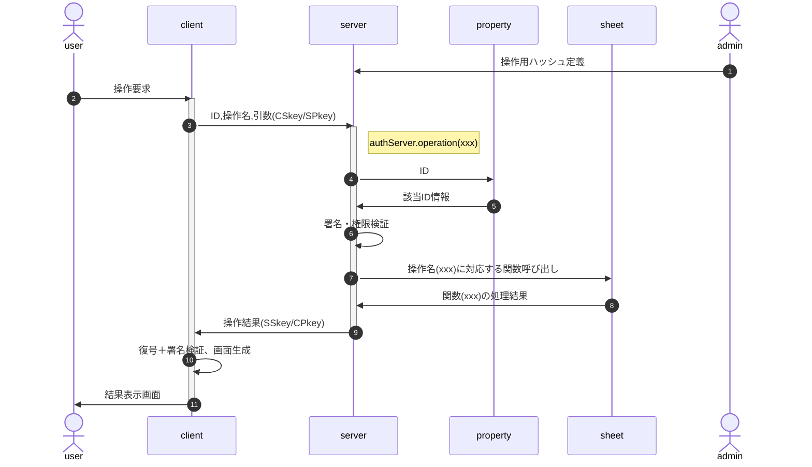

<!-- modifyMD original document 
<style>
/* -----------------------------------------------
  library/CSS/1.3.0/core.css
----------------------------------------------- */
html, body{
  width: 100%;
  margin: 0;
  /*font-size: 4vw;*/
  text-size-adjust: none; /* https://gotohayato.com/content/531/ */
}
body * {
  font-size: 1rem;
  font-family: sans-serif;
  box-sizing: border-box;
}
.num, .right {text-align:right;}
.screen {padding: 1rem;} /* SPAでの切替用画面 */
.title { /* Markdown他でのタイトル */
  font-size: 2.4rem;
  text-shadow: 2px 2px 5px #888;
}

/* --- テーブル -------------------------------- */
.table {display:grid}
th, .th, td, .td {
  margin: 0.2rem;
  padding: 0.2rem;
}
th, .th {
  background-color: #888;
  color: white;
}
td, .td {
  border-bottom: solid 1px #aaa;
  border-right: solid 1px #aaa;
}

/* --- 部品 ----------------------------------- */
.triDown { /* 下向き矢印 */
  --bw: 50px;
  width: 0px;
  height: 0px;
  border-top: calc(var(--bw) * 0.7) solid #aaa;
  border-right: var(--bw) solid transparent;
  border-left: var(--bw) solid transparent;
  border-bottom: calc(var(--bw) * 0.2) solid transparent;
}

/* --- 部品：待機画面 --------------------------- */
.loader,
.loader:after {
  border-radius: 50%;
  width: 10em;
  height: 10em;
}
.loader {
  margin: 60px auto;
  font-size: 10px;
  position: relative;
  text-indent: -9999em;
  border-top: 1.1em solid rgba(204,204,204, 0.2);
  border-right: 1.1em solid rgba(204,204,204, 0.2);
  border-bottom: 1.1em solid rgba(204,204,204, 0.2);
  border-left: 1.1em solid #cccccc;
  -webkit-transform: translateZ(0);
  -ms-transform: translateZ(0);
  transform: translateZ(0);
  -webkit-animation: load8 1.1s infinite linear;
  animation: load8 1.1s infinite linear;
}
@-webkit-keyframes load8 {
  0% {
    -webkit-transform: rotate(0deg);
    transform: rotate(0deg);
  }
  100% {
    -webkit-transform: rotate(360deg);
    transform: rotate(360deg);
  }
}
@keyframes load8 {
  0% {
    -webkit-transform: rotate(0deg);
    transform: rotate(0deg);
  }
  100% {
    -webkit-transform: rotate(360deg);
    transform: rotate(360deg);
  }
}
</style>
<p class="title"><a name="Auth_top">class Auth</a></p>

イベントサイトにおける募集用・参加者用・スタッフ用メニューの表示制御等、認証に関する処理を行う。

クライアント(ブラウザ)側の"class authClient"とサーバ(GAS)側の"class authServer"に分かれるが、一体管理のためソースは一元管理する。

# 初期化処理

システム導入時、**Google Apps Scriptで一度だけ実行**する必要のある処理。

実行後は秘匿のため、ソースごと削除することを推奨。このため独立した`initial.gs`を作成する。

### シートアクセス権の取得

### server側鍵ペア生成

### config情報の作成と保存

# 機能別処理フロー

## onload時処理



- 水色の部分はhtmlのonload時処理
- 表示要求に対するserverからの戻り値(ID)は、[HtmlOutput.appendUntrusted()](https://developers.google.com/apps-script/reference/html/html-output?hl=ja#appenduntrustedaddedcontent)を使用して、HTMLの要素として返す。
- 「インスタンス生成」の処理内容
  1. authClient.constructor()
     1. localStorageにIDがあるか確認<br>
        不存在または不一致なら、serverから戻されたIDをlocalStorageに保存
  1. BurgerMenu.constructor()
     1. AuthインスタンスをBurgerMenuのインスタンスメンバとして生成(以下Burger.auth)
     1. Burger.auth.IDの値に従ってAuthメニュー描画(メニューアイコン、nav領域)

## 新規登録

新規登録では、[サーバ側のプロパティサービス](#332-%E3%83%A6%E3%83%BC%E3%82%B6%E6%83%85%E5%A0%B1)にIDとメアドのみ作成する。申込者名等、登録内容についてはログイン後に自情報編集画面を呼び出し、修正・加筆を行う。



- 応募締切等、新規要求ができる期間の制限は、client側でも行う(BurgerMenuの有効期間設定を想定)
- メアド入力はダイアログで行う(開発工数低減)
- メアドは正規表現による形式チェックのみ、到達確認および別ソースとの突合は行わない(ex.在校生メアド一覧との突合)
- 申込時に自分限定の申込情報操作のためログインすることになるので、メール到達確認はそこで行う
- IDはcookieでの保存を想定(∵個人情報では無く、タブを閉じても保存しておきたい)

## ログイン要求



- IDは保存済の前提
- clientの鍵およびSPkeyはsessionStorageへの保存を想定<br>
  (∵当該session以外からの参照を阻止、かつ永続的な保存は望ましくない)
- 有効期間内の鍵ペアが存在したら、鍵ペア生成はスキップ
- 該当ID情報は[ユーザ情報](#332-%E3%83%A6%E3%83%BC%E3%82%B6%E6%83%85%E5%A0%B1)参照
- ログイン可否確認
  - 前回ログイン失敗(3回連続失敗)から一定以上の時間経過(既定値1時間)
  - パスコード再発行は上述の条件が満たされる限り認める<br>
    例：旧パスコードで2回連続失敗、再発行後の1回目で失敗したら凍結
- 「パスコード検証」は復号・署名確認の上、以下の点をチェックする
  - パスコードが一致
  - 試行回数が一定数以下(既定値3回)
  - パスコード生成から一定時間内(既定値15分)
  - ログイン可能な権限
- パスコード入力はダイアログで行う(開発工数低減)

## 権限設定、変更

権限を付与すべきかは個別に判断する必要があるため、システム化せず、管理者がソース(`authServer.changeAuth()`)を直接編集、GASコンソール上で実行する。



## 検索・編集・更新

シートの操作(CRUD)は、管理者が事前に`{操作名:実行関数}`の形でソースに埋め込んで定義する。<br>
例：`{lookup:(arg)=>data.find(x=>x.id==arg.id)}`

userは要求時に操作名を指定し、その実行結果を受け取る。



- 「署名・権限検証」では復号・署名検証の上、以下の点の確認を行う
  - CPkeyの有効期限
  - 該当IDは当該操作の実行権限を持つか

# 設定情報とオブジェクト定義

- client/server共通設定情報(config.common)
  > クラスメンバ
- authClient固有設定情報(config.client)
  > 保持するデータ構造を含む
- authServer固有設定情報(config.server)
- 引数・戻り値となるオブジェクトの定義(typedef)
- ID, RSA鍵(crypto)
  > client/serverで表にする。使用するライブラリcrypticoの使用方法を含む

## client:localStorageに保存する情報

## client:sessionStorageに保存する情報

## server:プロパティサービスに保存する情報

### server側config

1. {number} loginRetryInterval=3,600,000(60分) - 前回ログイン失敗(3回連続失敗)から再挑戦可能になるまでの時間(ミリ秒)
1. {number} numberOfLoginAttempts=3 - ログイン失敗になるまでの試行回数
1. {number} loginGraceTime=900,000(15分) - パスコード生成からログインまでの猶予時間(ミリ秒)
1. {number} userLoginLifeTime=86,400,000(24時間) - ログイン(CPkey)有効期間

### ユーザ情報

以下のオブジェクトをユーザ単位に作成し、プロパティサービスに保存する(key = String(ID))。

1. {number} id - ユーザID
1. {string} email - e-mail
1. {number} created - 本オブジェクトの作成日時(UNIX時刻)
1. {string} publicKey - ユーザの公開鍵
1. {number} authority - ユーザの権限
1. {Object[]} log - ログイン試行のログ。unshiftで保存、先頭を最新にする
   1. {number} startAt - 試行開始日時(UNIX時刻)
   1. {number} passcode - パスコード(原則数値6桁)
   1. {Object[]} trial - 試行。unshiftで保存、先頭を最新にする
      1. {number} timestamp - 試行日時(UNIX時刻)
      1. {number} entered - 入力されたパスコード
      1. {boolean} result - パスコードと入力値の比較結果(true:OK)
      1. {string} message='' - NGの場合の理由。OKなら空文字列
   1. {number} endAt - 試行終了日時(UNIX時刻)
   1. {boolean} result - 試行の結果(true:OK)

- 有効期間内かは最新のendAtから判断

# フォルダ構成

- archves : アーカイブ
- doc/ : readme.mdの各記事のソース集
  - proto.md : readme.mdのプロトタイプ
  - xxx.md : readme.mdに埋め込む各記事のソース
- src/ : プログラムソース
  - config.common.js : client/server共通config
  - config.client.js : client特有のconfig
  - config.server.js : server特有のconfig
  - authClient.js : class authClientのテンプレート
  - authServer.js : class authServerのテンプレート
  - authXxxx.yyyy.js : class authClient/Server各メソッドのソース
- test/ : テスト用
- build.sh : client/server全体のビルダ
- index.html : クライアント側のソース
- server.gs : サーバ側のソース
- initialize.gs : サーバ側初期化処理のソース
- readme.md : doc配下を統合した、client/server全体の仕様書

# 仕様(JSDoc)


<a name="authServer+initialize"></a>

GAS側の初期化処理
システム導入・再初期化時のみ実行。実行後はソースファイルごとシートから削除すること。

**Kind**: instance method of [<code>authServer</code>](#authServer)  

| Param | Type | Default | Description |
| --- | --- | --- | --- |
| [arg] | <code>Object</code> | <code>{}</code> | 内容はv.default参照 |

# プログラムソース

<details><summary>client.js</summary>

```
class authClient {
  //:x:$src/client.constructor.js::
  //:x:$src/client.registMail.js::
  //:x:$src/client.login1C.js::
  //:x:$src/client.login2C.js::
}
```

</details>

<details><summary>server.gs</summary>

```
class authServer {
/**
 * @constructor
 */
constructor(arg){
  const v = {whois:this.constructor.name+'.constructor',rv:null,step:0};
  console.log(`${v.whois} start.`);
  try {

    v.step = 9; // 終了処理
    console.log(`${v.whois} normal end.`);
    return v.rv;

  } catch(e) {
    e.message = `${v.whois} abnormal end at step.${v.step}`
    + `\n${e.message}`
    + `\narg=${stringify(arg)}`;  // 引数
    console.error(`${e.message}\nv=${stringify(v)}`);
    return e;
  }
}

/** GAS側の初期化処理
 * システム導入・再初期化時のみ実行。実行後はソースファイルごとシートから削除すること。
 * @param {Object} [arg={}] - 内容はv.default参照
 * @returns {void}
 */
initialize(arg={}){
  const v = {whois:this.constructor.name+'.initialize',rv:null,step:0,default:{
    name: 'authServer', // プロパティサービスに保存する際のラベル
    RSA:{
      bits: 2048,  // ビット長
      passphrase: createPassword(16), // 16桁のパスワードを自動生成
      publicKey: null, // 公開鍵
      privateKey: null, // 秘密鍵
    },
  }};
  console.log(`${v.whois} start.`);
  try {

    v.step = 1; // 事前準備
    v.name = arg.hasOwnProperty('name') ? arg.name : v.default.name;
    v.conf = Object.assign({},(
    PropertiesService.getDocumentProperties().getProperty(v.name)
    || {}), v.default, arg);

    // ------------------------------------------
    v.step = 2; // シートアクセス権の取得
    // ------------------------------------------

    // ------------------------------------------
    v.step = 3; // server側鍵ペア生成
    // ------------------------------------------
    v.conf.RSA.privateKey = // 秘密鍵の生成
    cryptico.generateRSAKey(v.conf.RSA.passphrase, v.conf.RSA.bits);
    v.conf.RSA.publicKey =  // 公開鍵の生成
    cryptico.publicKeyString(v.conf.RSA.privateKey);

    // ------------------------------------------
    v.step = 3; // v.conf情報の作成と保存
    // ------------------------------------------

    v.step = 9; // 終了処理
    // プロパティサービスへの保存
    PropertiesService.getDocumentProperties().setProperty(v.conf.name,v.conf);
    // 保存結果を表示して終了
    console.log(`${v.whois} normal end.\n${PropertiesService.getDocumentProperties().getProperty(v.conf.name)}`);
    return v.rv;

  } catch(e) {
    e.message = `${v.whois} abnormal end at step.${v.step}`
    + `\n${e.message}\nv.conf=${stringify(v.conf)}`;
    console.error(`${e.message}\nv=${stringify(v)}`);
    return e;
  }
}

  //:x:$src/server.registMail.js::
  //:x:$src/server.login1S.js::
  //:x:$src/server.login2S.js::
  //:x:$src/server.listAuth.js::
  listAuth(arg){
    const v = {whois:this.constructor.name+'.listAuth',rv:null,step:0};
    console.log(`${v.whois} start.`);
    try {
  
      v.step = 9; // 終了処理
      console.log(`${v.whois} normal end.`);
      return v.rv;
  
    } catch(e) {
      e.message = `${v.whois} abnormal end at step.${v.step}`
      + `\n${e.message}`
      + `\narg=${stringify(arg)}`;  // 引数
      console.error(`${e.message}\nv=${stringify(v)}`);
      return e;
    }
  }


  //:x:$src/server.changeAuth.js::
  //:x:$src/server.operation.js::
}
```

</details>

# 改版履歴

- rev.2.0.0 : class Authと統合
- rev.1.1.0 : 2024/03/14
  - setupInstanceをmergeDeeplyに置換(setupInstanceは廃番)
  - arg.funcの取り扱いを`new Function()`から直接関数を渡す形に修正
  - changeメソッドを廃止、changeScreenで代替
- rev.1.0.0 : 2024/01/03 初版
-->
<a name="ac0000"></a>
<style>
/* -----------------------------------------------
  library/CSS/1.3.0/core.css
----------------------------------------------- */
html, body{
  width: 100%;
  margin: 0;
  /*font-size: 4vw;*/
  text-size-adjust: none; /* https://gotohayato.com/content/531/ */
}
body * {
  font-size: 1rem;
  font-family: sans-serif;
  box-sizing: border-box;
}
.num, .right {text-align:right;}
.screen {padding: 1rem;} /* SPAでの切替用画面 */
.title { /* Markdown他でのタイトル */
  font-size: 2.4rem;
  text-shadow: 2px 2px 5px #888;
}

/* --- テーブル -------------------------------- */
.table {display:grid}
th, .th, td, .td {
  margin: 0.2rem;
  padding: 0.2rem;
}
th, .th {
  background-color: #888;
  color: white;
}
td, .td {
  border-bottom: solid 1px #aaa;
  border-right: solid 1px #aaa;
}

/* --- 部品 ----------------------------------- */
.triDown { /* 下向き矢印 */
  --bw: 50px;
  width: 0px;
  height: 0px;
  border-top: calc(var(--bw) * 0.7) solid #aaa;
  border-right: var(--bw) solid transparent;
  border-left: var(--bw) solid transparent;
  border-bottom: calc(var(--bw) * 0.2) solid transparent;
}

/* --- 部品：待機画面 --------------------------- */
.loader,
.loader:after {
  border-radius: 50%;
  width: 10em;
  height: 10em;
}
.loader {
  margin: 60px auto;
  font-size: 10px;
  position: relative;
  text-indent: -9999em;
  border-top: 1.1em solid rgba(204,204,204, 0.2);
  border-right: 1.1em solid rgba(204,204,204, 0.2);
  border-bottom: 1.1em solid rgba(204,204,204, 0.2);
  border-left: 1.1em solid #cccccc;
  -webkit-transform: translateZ(0);
  -ms-transform: translateZ(0);
  transform: translateZ(0);
  -webkit-animation: load8 1.1s infinite linear;
  animation: load8 1.1s infinite linear;
}
@-webkit-keyframes load8 {
  0% {
    -webkit-transform: rotate(0deg);
    transform: rotate(0deg);
  }
  100% {
    -webkit-transform: rotate(360deg);
    transform: rotate(360deg);
  }
}
@keyframes load8 {
  0% {
    -webkit-transform: rotate(0deg);
    transform: rotate(0deg);
  }
  100% {
    -webkit-transform: rotate(360deg);
    transform: rotate(360deg);
  }
}
</style>
<p class="title"><a name="Auth_top">class Auth</a></p>

イベントサイトにおける募集用・参加者用・スタッフ用メニューの表示制御等、認証に関する処理を行う。

クライアント(ブラウザ)側の"class authClient"とサーバ(GAS)側の"class authServer"に分かれるが、一体管理のためソースは一元管理する。


# 目次

1. <a href="#ac0001">初期化処理</a>
      1. <a href="#ac0002">シートアクセス権の取得</a>
      1. <a href="#ac0003">server側鍵ペア生成</a>
      1. <a href="#ac0004">config情報の作成と保存</a>
1. <a href="#ac0005">機能別処理フロー</a>
   1. <a href="#ac0006">onload時処理</a>
   1. <a href="#ac0007">新規登録</a>
   1. <a href="#ac0008">ログイン要求</a>
   1. <a href="#ac0009">権限設定、変更</a>
   1. <a href="#ac0010">検索・編集・更新</a>
1. <a href="#ac0011">設定情報とオブジェクト定義</a>
   1. <a href="#ac0012">client:localStorageに保存する情報</a>
   1. <a href="#ac0013">client:sessionStorageに保存する情報</a>
   1. <a href="#ac0014">server:プロパティサービスに保存する情報</a>
      1. <a href="#ac0015">server側config</a>
      1. <a href="#ac0016">ユーザ情報</a>
1. <a href="#ac0017">フォルダ構成</a>
1. <a href="#ac0018">仕様(JSDoc)</a>
1. <a href="#ac0019">プログラムソース</a>
1. <a href="#ac0020">改版履歴</a>

# 1 初期化処理<a name="ac0001"></a>

[先頭](#ac0000)
<br>&gt; [初期化処理 | [機能別処理フロー](#ac0005) | [設定情報とオブジェクト定義](#ac0011) | [フォルダ構成](#ac0017) | [仕様(JSDoc)](#ac0018) | [プログラムソース](#ac0019) | [改版履歴](#ac0020)]


システム導入時、**Google Apps Scriptで一度だけ実行**する必要のある処理。

実行後は秘匿のため、ソースごと削除することを推奨。このため独立した`initial.gs`を作成する。

### 1.1 シートアクセス権の取得<a name="ac0002"></a>

[先頭](#ac0000) > [初期化処理](#ac0001)
<br>&gt; [シートアクセス権の取得 | [server側鍵ペア生成](#ac0003) | [config情報の作成と保存](#ac0004)]


### 1.2 server側鍵ペア生成<a name="ac0003"></a>

[先頭](#ac0000) > [初期化処理](#ac0001)
<br>&gt; [[シートアクセス権の取得](#ac0002) | server側鍵ペア生成 | [config情報の作成と保存](#ac0004)]


### 1.3 config情報の作成と保存<a name="ac0004"></a>

[先頭](#ac0000) > [初期化処理](#ac0001)
<br>&gt; [[シートアクセス権の取得](#ac0002) | [server側鍵ペア生成](#ac0003) | config情報の作成と保存]


# 2 機能別処理フロー<a name="ac0005"></a>

[先頭](#ac0000)
<br>&gt; [[初期化処理](#ac0001) | 機能別処理フロー | [設定情報とオブジェクト定義](#ac0011) | [フォルダ構成](#ac0017) | [仕様(JSDoc)](#ac0018) | [プログラムソース](#ac0019) | [改版履歴](#ac0020)]


## 2.1 onload時処理<a name="ac0006"></a>

[先頭](#ac0000) > [機能別処理フロー](#ac0005)
<br>&gt; [onload時処理 | [新規登録](#ac0007) | [ログイン要求](#ac0008) | [権限設定、変更](#ac0009) | [検索・編集・更新](#ac0010)]


- 水色の部分はhtmlのonload時処理
- 表示要求に対するserverからの戻り値(ID)は、[HtmlOutput.appendUntrusted()](https://developers.google.com/apps-script/reference/html/html-output?hl=ja#appenduntrustedaddedcontent)を使用して、HTMLの要素として返す。
- 「インスタンス生成」の処理内容
  1. authClient.constructor()
     1. localStorageにIDがあるか確認<br>
        不存在または不一致なら、serverから戻されたIDをlocalStorageに保存
  1. BurgerMenu.constructor()
     1. AuthインスタンスをBurgerMenuのインスタンスメンバとして生成(以下Burger.auth)
     1. Burger.auth.IDの値に従ってAuthメニュー描画(メニューアイコン、nav領域)

## 2.2 新規登録<a name="ac0007"></a>

[先頭](#ac0000) > [機能別処理フロー](#ac0005)
<br>&gt; [[onload時処理](#ac0006) | 新規登録 | [ログイン要求](#ac0008) | [権限設定、変更](#ac0009) | [検索・編集・更新](#ac0010)]


新規登録では、[サーバ側のプロパティサービス](#332-%E3%83%A6%E3%83%BC%E3%82%B6%E6%83%85%E5%A0%B1)にIDとメアドのみ作成する。申込者名等、登録内容についてはログイン後に自情報編集画面を呼び出し、修正・加筆を行う。


- 応募締切等、新規要求ができる期間の制限は、client側でも行う(BurgerMenuの有効期間設定を想定)
- メアド入力はダイアログで行う(開発工数低減)
- メアドは正規表現による形式チェックのみ、到達確認および別ソースとの突合は行わない(ex.在校生メアド一覧との突合)
- 申込時に自分限定の申込情報操作のためログインすることになるので、メール到達確認はそこで行う
- IDはcookieでの保存を想定(∵個人情報では無く、タブを閉じても保存しておきたい)

## 2.3 ログイン要求<a name="ac0008"></a>

[先頭](#ac0000) > [機能別処理フロー](#ac0005)
<br>&gt; [[onload時処理](#ac0006) | [新規登録](#ac0007) | ログイン要求 | [権限設定、変更](#ac0009) | [検索・編集・更新](#ac0010)]


- IDは保存済の前提
- clientの鍵およびSPkeyはsessionStorageへの保存を想定<br>
  (∵当該session以外からの参照を阻止、かつ永続的な保存は望ましくない)
- 有効期間内の鍵ペアが存在したら、鍵ペア生成はスキップ
- 該当ID情報は[ユーザ情報](#332-%E3%83%A6%E3%83%BC%E3%82%B6%E6%83%85%E5%A0%B1)参照
- ログイン可否確認
  - 前回ログイン失敗(3回連続失敗)から一定以上の時間経過(既定値1時間)
  - パスコード再発行は上述の条件が満たされる限り認める<br>
    例：旧パスコードで2回連続失敗、再発行後の1回目で失敗したら凍結
- 「パスコード検証」は復号・署名確認の上、以下の点をチェックする
  - パスコードが一致
  - 試行回数が一定数以下(既定値3回)
  - パスコード生成から一定時間内(既定値15分)
  - ログイン可能な権限
- パスコード入力はダイアログで行う(開発工数低減)

## 2.4 権限設定、変更<a name="ac0009"></a>

[先頭](#ac0000) > [機能別処理フロー](#ac0005)
<br>&gt; [[onload時処理](#ac0006) | [新規登録](#ac0007) | [ログイン要求](#ac0008) | 権限設定、変更 | [検索・編集・更新](#ac0010)]


権限を付与すべきかは個別に判断する必要があるため、システム化せず、管理者がソース(`authServer.changeAuth()`)を直接編集、GASコンソール上で実行する。


## 2.5 検索・編集・更新<a name="ac0010"></a>

[先頭](#ac0000) > [機能別処理フロー](#ac0005)
<br>&gt; [[onload時処理](#ac0006) | [新規登録](#ac0007) | [ログイン要求](#ac0008) | [権限設定、変更](#ac0009) | 検索・編集・更新]


シートの操作(CRUD)は、管理者が事前に`{操作名:実行関数}`の形でソースに埋め込んで定義する。<br>
例：`{lookup:(arg)=>data.find(x=>x.id==arg.id)}`

userは要求時に操作名を指定し、その実行結果を受け取る。


- 「署名・権限検証」では復号・署名検証の上、以下の点の確認を行う
  - CPkeyの有効期限
  - 該当IDは当該操作の実行権限を持つか

# 3 設定情報とオブジェクト定義<a name="ac0011"></a>

[先頭](#ac0000)
<br>&gt; [[初期化処理](#ac0001) | [機能別処理フロー](#ac0005) | 設定情報とオブジェクト定義 | [フォルダ構成](#ac0017) | [仕様(JSDoc)](#ac0018) | [プログラムソース](#ac0019) | [改版履歴](#ac0020)]


- client/server共通設定情報(config.common)
  > クラスメンバ
- authClient固有設定情報(config.client)
  > 保持するデータ構造を含む
- authServer固有設定情報(config.server)
- 引数・戻り値となるオブジェクトの定義(typedef)
- ID, RSA鍵(crypto)
  > client/serverで表にする。使用するライブラリcrypticoの使用方法を含む

## 3.1 client:localStorageに保存する情報<a name="ac0012"></a>

[先頭](#ac0000) > [設定情報とオブジェクト定義](#ac0011)
<br>&gt; [client:localStorageに保存する情報 | [client:sessionStorageに保存する情報](#ac0013) | [server:プロパティサービスに保存する情報](#ac0014)]


## 3.2 client:sessionStorageに保存する情報<a name="ac0013"></a>

[先頭](#ac0000) > [設定情報とオブジェクト定義](#ac0011)
<br>&gt; [[client:localStorageに保存する情報](#ac0012) | client:sessionStorageに保存する情報 | [server:プロパティサービスに保存する情報](#ac0014)]


## 3.3 server:プロパティサービスに保存する情報<a name="ac0014"></a>

[先頭](#ac0000) > [設定情報とオブジェクト定義](#ac0011)
<br>&gt; [[client:localStorageに保存する情報](#ac0012) | [client:sessionStorageに保存する情報](#ac0013) | server:プロパティサービスに保存する情報]


### 3.3.1 server側config<a name="ac0015"></a>

[先頭](#ac0000) > [設定情報とオブジェクト定義](#ac0011) > [server:プロパティサービスに保存する情報](#ac0014)
<br>&gt; [server側config | [ユーザ情報](#ac0016)]


1. {number} loginRetryInterval=3,600,000(60分) - 前回ログイン失敗(3回連続失敗)から再挑戦可能になるまでの時間(ミリ秒)
1. {number} numberOfLoginAttempts=3 - ログイン失敗になるまでの試行回数
1. {number} loginGraceTime=900,000(15分) - パスコード生成からログインまでの猶予時間(ミリ秒)
1. {number} userLoginLifeTime=86,400,000(24時間) - ログイン(CPkey)有効期間

### 3.3.2 ユーザ情報<a name="ac0016"></a>

[先頭](#ac0000) > [設定情報とオブジェクト定義](#ac0011) > [server:プロパティサービスに保存する情報](#ac0014)
<br>&gt; [[server側config](#ac0015) | ユーザ情報]


以下のオブジェクトをユーザ単位に作成し、プロパティサービスに保存する(key = String(ID))。

1. {number} id - ユーザID
1. {string} email - e-mail
1. {number} created - 本オブジェクトの作成日時(UNIX時刻)
1. {string} publicKey - ユーザの公開鍵
1. {number} authority - ユーザの権限
1. {Object[]} log - ログイン試行のログ。unshiftで保存、先頭を最新にする
   1. {number} startAt - 試行開始日時(UNIX時刻)
   1. {number} passcode - パスコード(原則数値6桁)
   1. {Object[]} trial - 試行。unshiftで保存、先頭を最新にする
      1. {number} timestamp - 試行日時(UNIX時刻)
      1. {number} entered - 入力されたパスコード
      1. {boolean} result - パスコードと入力値の比較結果(true:OK)
      1. {string} message='' - NGの場合の理由。OKなら空文字列
   1. {number} endAt - 試行終了日時(UNIX時刻)
   1. {boolean} result - 試行の結果(true:OK)

- 有効期間内かは最新のendAtから判断

# 4 フォルダ構成<a name="ac0017"></a>

[先頭](#ac0000)
<br>&gt; [[初期化処理](#ac0001) | [機能別処理フロー](#ac0005) | [設定情報とオブジェクト定義](#ac0011) | フォルダ構成 | [仕様(JSDoc)](#ac0018) | [プログラムソース](#ac0019) | [改版履歴](#ac0020)]


- archves : アーカイブ
- doc/ : readme.mdの各記事のソース集
  - proto.md : readme.mdのプロトタイプ
  - xxx.md : readme.mdに埋め込む各記事のソース
- src/ : プログラムソース
  - config.common.js : client/server共通config
  - config.client.js : client特有のconfig
  - config.server.js : server特有のconfig
  - authClient.js : class authClientのテンプレート
  - authServer.js : class authServerのテンプレート
  - authXxxx.yyyy.js : class authClient/Server各メソッドのソース
- test/ : テスト用
- build.sh : client/server全体のビルダ
- index.html : クライアント側のソース
- server.gs : サーバ側のソース
- initialize.gs : サーバ側初期化処理のソース
- readme.md : doc配下を統合した、client/server全体の仕様書

# 5 仕様(JSDoc)<a name="ac0018"></a>

[先頭](#ac0000)
<br>&gt; [[初期化処理](#ac0001) | [機能別処理フロー](#ac0005) | [設定情報とオブジェクト定義](#ac0011) | [フォルダ構成](#ac0017) | 仕様(JSDoc) | [プログラムソース](#ac0019) | [改版履歴](#ac0020)]


<a name="authServer+initialize"></a>

GAS側の初期化処理
システム導入・再初期化時のみ実行。実行後はソースファイルごとシートから削除すること。

**Kind**: instance method of [<code>authServer</code>](#authServer)  

| Param | Type | Default | Description |
| --- | --- | --- | --- |
| [arg] | <code>Object</code> | <code>{}</code> | 内容はv.default参照 |

# 6 プログラムソース<a name="ac0019"></a>

[先頭](#ac0000)
<br>&gt; [[初期化処理](#ac0001) | [機能別処理フロー](#ac0005) | [設定情報とオブジェクト定義](#ac0011) | [フォルダ構成](#ac0017) | [仕様(JSDoc)](#ac0018) | プログラムソース | [改版履歴](#ac0020)]


<details><summary>client.js</summary>

```
class authClient {
  //:x:$src/client.constructor.js::
  //:x:$src/client.registMail.js::
  //:x:$src/client.login1C.js::
  //:x:$src/client.login2C.js::
}
```

</details>

<details><summary>server.gs</summary>

```
class authServer {
/**
 * @constructor
 */
constructor(arg){
  const v = {whois:this.constructor.name+'.constructor',rv:null,step:0};
  console.log(`${v.whois} start.`);
  try {

    v.step = 9; // 終了処理
    console.log(`${v.whois} normal end.`);
    return v.rv;

  } catch(e) {
    e.message = `${v.whois} abnormal end at step.${v.step}`
    + `\n${e.message}`
    + `\narg=${stringify(arg)}`;  // 引数
    console.error(`${e.message}\nv=${stringify(v)}`);
    return e;
  }
}

/** GAS側の初期化処理
 * システム導入・再初期化時のみ実行。実行後はソースファイルごとシートから削除すること。
 * @param {Object} [arg={}] - 内容はv.default参照
 * @returns {void}
 */
initialize(arg={}){
  const v = {whois:this.constructor.name+'.initialize',rv:null,step:0,default:{
    name: 'authServer', // プロパティサービスに保存する際のラベル
    RSA:{
      bits: 2048,  // ビット長
      passphrase: createPassword(16), // 16桁のパスワードを自動生成
      publicKey: null, // 公開鍵
      privateKey: null, // 秘密鍵
    },
  }};
  console.log(`${v.whois} start.`);
  try {

    v.step = 1; // 事前準備
    v.name = arg.hasOwnProperty('name') ? arg.name : v.default.name;
    v.conf = Object.assign({},(
    PropertiesService.getDocumentProperties().getProperty(v.name)
    || {}), v.default, arg);

    // ------------------------------------------
    v.step = 2; // シートアクセス権の取得
    // ------------------------------------------

    // ------------------------------------------
    v.step = 3; // server側鍵ペア生成
    // ------------------------------------------
    v.conf.RSA.privateKey = // 秘密鍵の生成
    cryptico.generateRSAKey(v.conf.RSA.passphrase, v.conf.RSA.bits);
    v.conf.RSA.publicKey =  // 公開鍵の生成
    cryptico.publicKeyString(v.conf.RSA.privateKey);

    // ------------------------------------------
    v.step = 3; // v.conf情報の作成と保存
    // ------------------------------------------

    v.step = 9; // 終了処理
    // プロパティサービスへの保存
    PropertiesService.getDocumentProperties().setProperty(v.conf.name,v.conf);
    // 保存結果を表示して終了
    console.log(`${v.whois} normal end.\n${PropertiesService.getDocumentProperties().getProperty(v.conf.name)}`);
    return v.rv;

  } catch(e) {
    e.message = `${v.whois} abnormal end at step.${v.step}`
    + `\n${e.message}\nv.conf=${stringify(v.conf)}`;
    console.error(`${e.message}\nv=${stringify(v)}`);
    return e;
  }
}

  //:x:$src/server.registMail.js::
  //:x:$src/server.login1S.js::
  //:x:$src/server.login2S.js::
  //:x:$src/server.listAuth.js::
  listAuth(arg){
    const v = {whois:this.constructor.name+'.listAuth',rv:null,step:0};
    console.log(`${v.whois} start.`);
    try {
  
      v.step = 9; // 終了処理
      console.log(`${v.whois} normal end.`);
      return v.rv;
  
    } catch(e) {
      e.message = `${v.whois} abnormal end at step.${v.step}`
      + `\n${e.message}`
      + `\narg=${stringify(arg)}`;  // 引数
      console.error(`${e.message}\nv=${stringify(v)}`);
      return e;
    }
  }


  //:x:$src/server.changeAuth.js::
  //:x:$src/server.operation.js::
}
```

</details>

# 7 改版履歴<a name="ac0020"></a>

[先頭](#ac0000)
<br>&gt; [[初期化処理](#ac0001) | [機能別処理フロー](#ac0005) | [設定情報とオブジェクト定義](#ac0011) | [フォルダ構成](#ac0017) | [仕様(JSDoc)](#ac0018) | [プログラムソース](#ac0019) | 改版履歴]


- rev.2.0.0 : class Authと統合
- rev.1.1.0 : 2024/03/14
  - setupInstanceをmergeDeeplyに置換(setupInstanceは廃番)
  - arg.funcの取り扱いを`new Function()`から直接関数を渡す形に修正
  - changeメソッドを廃止、changeScreenで代替
- rev.1.0.0 : 2024/01/03 初版

