<a name="BurgerMenu"></a>

## BurgerMenu
htmlからdata-BurgerMenu属性を持つ要素を抽出、ハンバーガーメニューを作成



#### BurgerMenuメンバ一覧

以下はthisとして「constructorのv.default < constructorの引数 < listViewの引数」の順で有効となる。

1. 「**太字**」はインスタンス生成時、必須指定項目
1. 「【*内部*】」は指定不要の項目(constructor他で自動的に設定されるメンバ)
1. その他はconstructorの引数で指定可、指定が無い項目は既定値をセット

- className {string} 【*内部*】'BurgerMenu'固定。ログ出力時に使用
- parent='body' {string|HTMLElement} 作成対象のdata-BurgerMenuを全て含む親要素。CSSセレクタかHTMLElementで指定。
- auth=2^32-1 {number} 利用者の閲覧権限。メニューのauth(data-BurgerMenu:{auth:x})とのビット積=0なら当該メニューは作成しない
- func {Object.<string,Function>} メニューから実行する関数を集めたライブラリ
- home {string} ホーム画面として使用するメニューの識別子

#### data-BurgerMenu属性に設定する文字列

- id {string} メニュー毎に作成する識別子
- label {string} nav領域に表示するメニューの名称
- func
- href
- auth=1 {number} メニューの使用権限。以下例ではシステム管理者は両方表示されるが、一般ユーザにはシステム設定は表示されない
  ```
  <div data-BurgerMenu="auth:1">利用案内</div>
  <div data-BurgerMenu="auth:8">システム設定</div>
  (中略)
  <script>
    const authority = new Auth(...);  // 利用権限を取得。一般ユーザ:1, 管理者:15
    const menu = new BurgerMenu({auth:authority.level}); // レベルを渡してメニュー生成
  ```

**Kind**: global class  
