<style>
/* -----------------------------------------------
  library/CSS/1.3.0/core.css
----------------------------------------------- */
html, body{
  width: 100%;
  margin: 0;
  /*font-size: 4vw;*/
  text-size-adjust: none; /* https://gotohayato.com/content/531/ */
}
body * {
  font-size: 1rem;
  font-family: sans-serif;
  box-sizing: border-box;
}
.num, .right {text-align:right;}
.screen {padding: 1rem;} /* SPAでの切替用画面 */
.title { /* Markdown他でのタイトル */
  font-size: 2.4rem;
  text-shadow: 2px 2px 5px #888;
}

/* --- テーブル -------------------------------- */
.table {display:grid}
th, .th, td, .td {
  margin: 0.2rem;
  padding: 0.2rem;
}
th, .th {
  background-color: #888;
  color: white;
}
td, .td {
  border-bottom: solid 1px #aaa;
  border-right: solid 1px #aaa;
}

/* --- 部品 ----------------------------------- */
.triDown { /* 下向き矢印 */
  --bw: 50px;
  width: 0px;
  height: 0px;
  border-top: calc(var(--bw) * 0.7) solid #aaa;
  border-right: var(--bw) solid transparent;
  border-left: var(--bw) solid transparent;
  border-bottom: calc(var(--bw) * 0.2) solid transparent;
}

/* --- 部品：待機画面 --------------------------- */
.loader,
.loader:after {
  border-radius: 50%;
  width: 10em;
  height: 10em;
}
.loader {
  margin: 60px auto;
  font-size: 10px;
  position: relative;
  text-indent: -9999em;
  border-top: 1.1em solid rgba(204,204,204, 0.2);
  border-right: 1.1em solid rgba(204,204,204, 0.2);
  border-bottom: 1.1em solid rgba(204,204,204, 0.2);
  border-left: 1.1em solid #cccccc;
  -webkit-transform: translateZ(0);
  -ms-transform: translateZ(0);
  transform: translateZ(0);
  -webkit-animation: load8 1.1s infinite linear;
  animation: load8 1.1s infinite linear;
}
@-webkit-keyframes load8 {
  0% {
    -webkit-transform: rotate(0deg);
    transform: rotate(0deg);
  }
  100% {
    -webkit-transform: rotate(360deg);
    transform: rotate(360deg);
  }
}
@keyframes load8 {
  0% {
    -webkit-transform: rotate(0deg);
    transform: rotate(0deg);
  }
  100% {
    -webkit-transform: rotate(360deg);
    transform: rotate(360deg);
  }
}
</style>
<p class="title">class BurgerMenu</p>

# 概要

## 機能概要

htmlからdata-BurgerMenu属性を持つ要素を抽出、ハンバーガーメニューを作成



# 使用方法

## htmlの設定

### body内部

- 表示部は&lt;div data-BurgerMenu&gt;の階層内で定義する。<br>
  階層外の要素はメニューで選択しても表示されない。
- data-BurgerMenu属性を持つ要素にIDとなるclass属性を付与

```
<body>
  <div class="c1001" data-BurgerMenu="label:'スタッフ',authority:2">
    <div class="c1002" data-BurgerMenu="label:'受付業務',func:'recept'"></div>
    <div class="c1003" data-BurgerMenu="label:'校内探険'">
        
    </div>
  </div>
  <div class="c1004" data-BurgerMenu="label:'Tips',href:'https://〜/tips.html'"></div>
</body>
```

下位の階層を持つ場合、自分自身の表示内容は持たせない(以下はNG)

```
<div data-BurgerMenu="label:'お知らせ'">
!!NG!! <p>お知らせのページです</p>
  <div data-BurgerMenu="label:'掲示板'">〜</div>
  <div data-BurgerMenu="label:'注意事項'">〜</div>
</div>
```

「お知らせ」は「掲示板」「注意事項」のブランチとして扱われるので、「&lt;p&gt;お知らせのページです&lt;/p&gt;」というお知らせページ自身の表示内容は定義不可。

### data-BurgerMenu属性に設定する文字列

タグのauthとその人の権限の論理積>0ならメニューを表示する。

オブジェクトの記述に準ずる。但し短縮するため前後の"{","}"は省略する。

- {string} id - メニューID
- {string} label - メニュー化する時の名称
- {string} [func] - メニュー選択時に実行する関数名。<br>
  関数名と実際の関数はBurgerMenuインスタンス生成時に定義。
- {string} [href] - 遷移先のURL。別タブが開かれる。
- {number} [auth] - 表示権限。<br>
  BurgerMenuインスタンス生成時のauthorityとの論理積>0なら表示する。<br>
  ex: 一般参加者1、スタッフ2として<br>
      data-BurgerMenu="authrotiry:2"とされた要素は、<br>
      new BurgerMenu({authority:1})の一般参加者は非表示、<br>
      new BurgerMenu({authority:2})のスタッフは表示となる。
- {string} [from] - メニュー有効期間の開始日時。Dateオブジェクトで処理可能な日時文字列で指定
- {string} [to] - メニュー有効期間の終了日時

注意事項

- func, hrefは排他。両方指定された場合はfuncを優先する
- func, href共に指定されなかった場合、SPAの画面切替指示と見なし、idの画面に切り替える
- href指定の場合、タグ内の文字列は無視される(下例2行目の「テスト」)
  ```
  <div data-BurgerMenu="id:'c41',label:'これはOK',href:'https://〜'"></div>
  <div data-BurgerMenu="id:'c41',label:'これはNG',href:'https://〜'">テスト</div>
  ```
- 以下例ではシステム管理者は両方表示されるが、一般ユーザにはシステム設定は表示されない
  ```
  <div data-BurgerMenu="auth:1">利用案内</div>
  <div data-BurgerMenu="auth:8">システム設定</div>
  (中略)
  <script>
    const authority = new Auth(...);  // 利用権限を取得。一般ユーザ:1, 管理者:15
    const menu = new BurgerMenu({auth:authority.level}); // レベルを渡してメニュー生成
  ```
- 申込フォームのように申込期限がある場合、同一IDで下の例のように設定する。
  ```
  <!-- 申込開始前 〜2024/03/31 -->
  <div data-BurgerMenu="id:'entryForm',to:'2024/04/01 00:00:00'">
    「まだお申し込みいただけません」
  </div>

  <!-- 申込期間内 2024/04/01〜07 -->
  <div data-BurgerMenu="id:'entryForm',from:'2024/04/01',to:'2024/04/08 00:00:00'">
    申込フォーム
  </div>

  <!-- 申込終了後 2024/04/08〜 -->
  <div data-BurgerMenu="id:'entryForm',from:'2024/04/08'">
    「申込は終了しました」
  </div>
  ```
- メニュー生成時点で有効期限を判断、同一IDが複数存在する場合はいずれか一つのDIVのみ残して残りを削除してメニューを生成する。

## scriptの設定

### scriptサンプル

```
window.addEventListener('DOMContentLoaded',() => {
  const v = {whois:'DOMContentLoaded',rv:null,step:0};
  console.log(`${v.whois} start.`);
  try {

    v.auth = new authClient();
    v.arg = {...}; // 次項「BurgerMenuクラスメンバ」参照
    v.menu = new BurgerMenu({
      auth: v.auth.authority, // 閲覧者の権限
    });
    if( v.menu instanceof Error ) throw v.menu;

    v.step = 99; // 終了処理
    console.log(`${v.whois} normal end.`);
    return v.rv;
  } catch(e) {
    e.message = `${v.whois} abnormal end at step.${v.step}\n${e.message}`;
    console.error(`${e.message}\nv=${JSON.stringify(v)}`);
    alert(e.message);
  }
});
```

### インスタンス生成時の引数

インスタンス生成時の引数はそのまま**BurgerMenuメンバ**となる。

以下はthisとして「constructorのv.default < constructorの引数 < listViewの引数」の順で有効となる。

1. 「**太字**」はインスタンス生成時、必須指定項目
1. 「【*内部*】」は指定不要の項目(constructor他で自動的に設定されるメンバ)
1. その他はconstructorの引数で指定可、指定が無い項目は既定値をセット

- className {string} 【*内部*】'BurgerMenu'固定。ログ出力時に使用
- wrapper='.BurgerMenu.screen[name="wrapper"]' {string|HTMLElement} 作成対象のdata-BurgerMenuを全て含む親要素。CSSセレクタかHTMLElementで指定。
- auth=1 {number} 利用者の閲覧権限。メニューのauth(data-BurgerMenu:{auth:x})とのビット積=0なら当該メニューは作成しない
- func {Object.<string,Function>} メニューから実行する関数を集めたライブラリ
- home {string} ホーム画面として使用するメニューの識別子。無指定の場合、wrapper直下でdata-BurgerMenu属性を持つ最初の要素
- initialSubMenu=true {boolean} サブメニューの初期状態。true:開いた状態、false:閉じた状態
- css {string} BurgerMenu専用CSS
- toggle {Arrow} 【*内部*】ナビゲーション領域の表示/非表示切り替え
- showChildren {Arrow} 【*内部*】ブランチの下位階層メニュー表示/非表示切り替え

# BurgerMenu仕様

**Kind**: global class  
<a name="new_BurgerMenu_new"></a>

## new BurgerMenu(arg)

| Param | Type |
| --- | --- |
| arg | <code>Object</code> | 

**Example**  
## htmlの設定

- wrapperに`class="BurgerMenu screen" name="wrapper"`を設定
- メニュー化する領域(divタグ)に`data-BurgerMenu`属性を追加(設定値は後掲)

```
<p class="title">BurgerMenu Test</p>
<div class="BurgerMenu screen" name="wrapper">
  <div data-BurgerMenu="id:'c11',label:'掲示板'">掲示板</div>
  <div data-BurgerMenu="id:'c21',label:'入会申込'">入会申込</div>
  <div data-BurgerMenu="id:'c30',label:'イベント情報'">
    <div data-BurgerMenu="id:'c31',label:'会場案内図'">会場案内図</div>
    <div data-BurgerMenu="id:'c32',label:'タイムテーブル'">タイムテーブル</div>
  </div>
  <div data-BurgerMenu="id:'c40',label:'その他'">
    <div data-BurgerMenu="id:'c41',label:'リンクテスト',href:'https://developer.mozilla.org/ja/'">hoge</div>
    <div data-BurgerMenu="id:'c42',label:'funcテスト',func:'test'">funcテスト</div>
  </div>
</div>
```

## scriptの設定

- インスタンス生成時の引数については次項参照

```
v.menu = new BurgerMenu({func:{test:(e)=>{alert('hoge');changeScreen('c42');}}});
if( v.menu instanceof Error ) throw v.menu;
```

## BurgerMenuメンバ一覧

以下はthisとして「constructorのv.default < constructorの引数 < listViewの引数」の順で有効となる。

1. 「**太字**」はインスタンス生成時、必須指定項目
1. 「【*内部*】」は指定不要の項目(constructor他で自動的に設定されるメンバ)
1. その他はconstructorの引数で指定可、指定が無い項目は既定値をセット

- className {string} 【*内部*】'BurgerMenu'固定。ログ出力時に使用
- wrapper='.BurgerMenu.screen[name="wrapper"]' {string|HTMLElement} 作成対象のdata-BurgerMenuを全て含む親要素。CSSセレクタかHTMLElementで指定。
- auth=1 {number} 利用者の閲覧権限。メニューのauth(data-BurgerMenu:{auth:x})とのビット積=0なら当該メニューは作成しない
- func {Object.<string,Function>} メニューから実行する関数を集めたライブラリ
- home {string} ホーム画面として使用するメニューの識別子。無指定の場合、wrapper直下でdata-BurgerMenu属性を持つ最初の要素
- initialSubMenu=true {boolean} サブメニューの初期状態。true:開いた状態、false:閉じた状態
- css {string} BurgerMenu専用CSS
- toggle {Arrow} 【*内部*】ナビゲーション領域の表示/非表示切り替え
- showChildren {Arrow} 【*内部*】ブランチの下位階層メニュー表示/非表示切り替え

## data-BurgerMenu属性に設定する文字列

- id {string} メニュー毎に作成する識別子
- label {string} nav領域に表示するメニューの名称
- func {string} constructorの引数で渡されたfuncオブジェクトのメンバ名。
- href {string} 遷移先ページのURL。
- auth=1 {number} メニューの使用権限。以下例ではシステム管理者は両方表示されるが、一般ユーザにはシステム設定は表示されない
  ```
  <div data-BurgerMenu="auth:1">利用案内</div>
  <div data-BurgerMenu="auth:8">システム設定</div>
  (中略)
  <script>
    const authority = new Auth(...);  // 利用権限を取得。一般ユーザ:1, 管理者:15
    const menu = new BurgerMenu({auth:authority.level}); // レベルを渡してメニュー生成
  ```

注意事項

- func, hrefは排他。両方指定された場合はfuncを優先する
- func, href共に指定されなかった場合、SPAの画面切替指示と見なし、idの画面に切り替える
- href指定の場合、タグ内の文字列は無視される(下例2行目の「テスト」)
  ```
  <div data-BurgerMenu="id:'c41',label:'これはOK',href:'https://〜'"></div>
  <div data-BurgerMenu="id:'c41',label:'これはNG',href:'https://〜'">テスト</div>
  ```

# プログラムソース

<details><summary>class BurgerMenu</summary>

```
/**
 * @classdesc htmlからdata-BurgerMenu属性を持つ要素を抽出、ハンバーガーメニューを作成
 * 
 * @example
 * 
 * ### htmlの設定
 * 
 * - wrapperに`class="BurgerMenu screen" name="wrapper"`を設定
 * - メニュー化する領域(divタグ)に`data-BurgerMenu`属性を追加(設定値は後掲)
 * 
 * ```
 * <p class="title">BurgerMenu Test</p>
 * <div class="BurgerMenu screen" name="wrapper">
 *   <div data-BurgerMenu="id:'c11',label:'掲示板'">掲示板</div>
 *   <div data-BurgerMenu="id:'c21',label:'入会申込'">入会申込</div>
 *   <div data-BurgerMenu="id:'c30',label:'イベント情報'">
 *     <div data-BurgerMenu="id:'c31',label:'会場案内図'">会場案内図</div>
 *     <div data-BurgerMenu="id:'c32',label:'タイムテーブル'">タイムテーブル</div>
 *   </div>
 *   <div data-BurgerMenu="id:'c40',label:'その他'">
 *     <div data-BurgerMenu="id:'c41',label:'リンクテスト',href:'https://developer.mozilla.org/ja/'">hoge</div>
 *     <div data-BurgerMenu="id:'c42',label:'funcテスト',func:'test'">funcテスト</div>
 *   </div>
 * </div>
 * ```
 * 
 * ### scriptの設定
 * 
 * - インスタンス生成時の引数については次項参照
 * 
 * ```
 * v.menu = new BurgerMenu({func:{test:(e)=>{alert('hoge');changeScreen('c42');}}});
 * if( v.menu instanceof Error ) throw v.menu;
 * ```
 * 
 * ### BurgerMenuメンバ一覧
 * 
 * 以下はthisとして「constructorのv.default < constructorの引数 < listViewの引数」の順で有効となる。
 * 
 * 1. 「**太字**」はインスタンス生成時、必須指定項目
 * 1. 「【*内部*】」は指定不要の項目(constructor他で自動的に設定されるメンバ)
 * 1. その他はconstructorの引数で指定可、指定が無い項目は既定値をセット
 * 
 * - className {string} 【*内部*】'BurgerMenu'固定。ログ出力時に使用
 * - wrapper='.BurgerMenu.screen[name="wrapper"]' {string|HTMLElement} 作成対象のdata-BurgerMenuを全て含む親要素。CSSセレクタかHTMLElementで指定。
 * - auth=1 {number} 利用者の閲覧権限。メニューのauth(data-BurgerMenu:{auth:x})とのビット積=0なら当該メニューは作成しない
 * - func {Object.<string,Function>} メニューから実行する関数を集めたライブラリ
 * - home {string} ホーム画面として使用するメニューの識別子。無指定の場合、wrapper直下でdata-BurgerMenu属性を持つ最初の要素
 * - initialSubMenu=true {boolean} サブメニューの初期状態。true:開いた状態、false:閉じた状態
 * - css {string} BurgerMenu専用CSS
 * - toggle {Arrow} 【*内部*】ナビゲーション領域の表示/非表示切り替え
 * - showChildren {Arrow} 【*内部*】ブランチの下位階層メニュー表示/非表示切り替え
 * 
 * ### data-BurgerMenu属性に設定する文字列
 * 
 * - id {string} メニュー毎に作成する識別子
 * - label {string} nav領域に表示するメニューの名称
 * - func {string} constructorの引数で渡されたfuncオブジェクトのメンバ名。
 * - href {string} 遷移先ページのURL。
 * - auth=1 {number} メニューの使用権限。以下例ではシステム管理者は両方表示されるが、一般ユーザにはシステム設定は表示されない
 *   ```
 *   <div data-BurgerMenu="auth:1">利用案内</div>
 *   <div data-BurgerMenu="auth:8">システム設定</div>
 *   (中略)
 *   <script>
 *     const authority = new Auth(...);  // 利用権限を取得。一般ユーザ:1, 管理者:15
 *     const menu = new BurgerMenu({auth:authority.level}); // レベルを渡してメニュー生成
 *   ```
 * 
 * 注意事項
 * 
 * - func, hrefは排他。両方指定された場合はfuncを優先する
 * - func, href共に指定されなかった場合、SPAの画面切替指示と見なし、idの画面に切り替える
 * - href指定の場合、タグ内の文字列は無視される(下例2行目の「テスト」)
 *   ```
 *   <div data-BurgerMenu="id:'c41',label:'これはOK',href:'https://〜'"></div>
 *   <div data-BurgerMenu="id:'c41',label:'これはNG',href:'https://〜'">テスト</div>
 *   ```
 * 
 */
class BurgerMenu {

  /**
   * @constructor
   * @param {Object} arg 
   * @returns {BurgerMenu|Error}
   */
  constructor(arg={}){
    this.className = 'BurgerMenu';
    const v = {whois:this.className+'.constructor',rv:null,step:0};
    console.log(`${v.whois} start.\narg=${stringify(arg)}`);
    try {

      v.step = 1; // 引数と既定値からメンバの値を設定
      v.r = this.#setProperties(arg);
      if( v.r instanceof Error ) throw v.r;

      v.step = 2; // アイコン、ナビ、背景の作成
      v.step = 2.1; // アイコンの作成
      this.icon = createElement({
        attr:{class:'icon'},
        event:{click:this.toggle},
        children:[{
          tag:'button',
          children:[{tag:'span'},{tag:'span'},{tag:'span'}],
        }]
      },this.wrapper);
      v.step = 2.2; // ナビゲータの作成
        this.navi = createElement({
        tag:'nav',
      },this.wrapper);
      v.step = 2.3; // ナビゲータ背景の作成
        this.back = createElement({
        attr:{class:'back'},
        event:{click:this.toggle},
      },this.wrapper);

      v.step = 3; // 親要素を走査してナビゲーションを作成
      v.rv = this.#genNavi(this.wrapper,this.navi);
      if( v.rv instanceof Error ) throw v.rv;

      v.step = 9; // 終了処理
      changeScreen(this.home);
      console.log(`${v.whois} normal end.`);
  
    } catch(e) {
      e.message = `${v.whois} abnormal end at step.${v.step}`
      + `\n${e.message}`
      + `\narg=${stringify(arg)}`;  // 引数
      console.error(`${e.message}\nv=${stringify(v)}`);
      return e;
    }
  }

  /** constructorの引数と既定値からthisの値を設定
   * @param {Object} arg - constructorに渡された引数オブジェクト
   * @returns {null|Error}
   */
  #setProperties(arg){
    const v = {whois:this.className+'.setProperties',rv:null,step:0};
    console.log(`${v.whois} start.`);
    try {
  
      v.step = 1; // 既定値の定義
      v.default = {
        wrapper: `.${this.className}[name="wrapper"]`, // {string|HTMLElement}
        auth: 1,
        func: {}, // {Object.<string,function>} メニューから呼び出される関数
        home: null,
        initialSubMenu: true, // サブメニューの初期状態。true:開いた状態、false:閉じた状態
      };
      v.default.css = `/* BurgerMenu専用CSS
          BurgerMenu共通変数定義
          --text: テキストおよびハンバーガーアイコンの線の色
          --maxIndex: ローディング画面優先なので、最大値2147483647-1
        */
        .BurgerMenu {
          --text : #000;
          --fore : #fff;
          --back : #ddd;
          --debug : rgba(255,0,0,1);
          --iconSize : 100px;
          --maxIndex : 2147483646;
          --navWidth : 0.7;
        }
        /* ハンバーガーアイコン
          icon周囲にiconSizeの40%程度の余白が必要なのでtop,rightを指定
        */
        .BurgerMenu .icon {
          display : flex;
          justify-content : flex-end;
          place-items : center;
          position : absolute;
          top : calc(var(--iconSize) * 0.4);
          right : calc(var(--iconSize) * 0.4);
          width : var(--iconSize);
          height : var(--iconSize);
          z-index : var(--maxIndex);
        }
        .BurgerMenu .icon > button {
          place-content : center center;
          display : block;
          margin : 0;
          padding : 0px;
          box-sizing : border-box;
          width : calc(var(--iconSize) * 0.7);
          height : calc(var(--iconSize) * 0.7);
          border : none;
          background : rgba(0,0,0,0);
          position : relative;
          box-shadow : none;
        }
        .BurgerMenu .icon button span {
          display : block;
          width : 100%;
          height : calc(var(--iconSize) * 0.12);
          border-radius : calc(var(--iconSize) * 0.06);
          position : absolute;
          left : 0;
          background : var(--text);
          transition : top 0.24s, transform 0.24s, opacity 0.24s;
        }
        .BurgerMenu .icon button span:nth-child(1) {
          top : 0;
        }
        .BurgerMenu .icon button span:nth-child(2) {
          top : 50%;
          transform : translateY(-50%);
        }
        .BurgerMenu .icon button span:nth-child(3) {
          top : 100%;
          transform : translateY(-100%);
        }
        .BurgerMenu .icon button span.is_active:nth-child(1) {
          top : 50%;
          transform : translateY(-50%) rotate(135deg);
        }
        .BurgerMenu .icon button span.is_active:nth-child(2) {
          transform : translate(50%, -50%);
          opacity : 0;
        }
        .BurgerMenu .icon button span.is_active:nth-child(3) {
          top : 50%;
          transform : translateY(-50%) rotate(-135deg);
        }
        /* ナビゲーション領域 */
        .BurgerMenu nav {
          display : none;
        }
        .BurgerMenu nav.is_active {
          display : block;
          margin : 0 0 0 auto;
          font-size : 1rem;
          position : absolute;
          top : calc(var(--iconSize) * 1.8);
          right : 0;
          width : calc(100% * var(--navWidth));
          height : var(--iconSize);
          z-index : var(--maxIndex);
        }
        .BurgerMenu nav ul {
          margin : 0rem 0rem 1rem 0rem;
          padding : 0rem 0rem 0rem 0rem;
          background-color : var(--back);
        }
        .BurgerMenu nav ul ul { /* 2階層以降のulにのみ適用 */
          display : none;
        }
        .BurgerMenu nav ul ul.is_open {
          display : block;
          border-top : solid 0.2rem var(--fore);
          border-left : solid 0.7rem var(--fore);
        }
        .BurgerMenu nav li {
          margin : 0.6rem 0rem 0.3rem 0.5rem;
          padding : 0.5rem 0rem 0rem 0rem;
          list-style : none;
          background-color : var(--back);
        }
        .BurgerMenu nav li a {
          color : var(--text);
          text-decoration : none;
          font-size: 1.5rem;
        },
        /* 背景 */
        .BurgerMenu .back {
          display : none;
        }
        .BurgerMenu .back.is_active {
          display : block;
          position : absolute;
          top : 0;
          right : 0;
          width : 100vw;
          height : 100vh;
          z-index : calc(var(--maxIndex) - 1);
          background : rgba(100,100,100,0.8);
        }
      `;
      v.default.toggle = () => {  // ナビゲーション領域の表示/非表示切り替え
        document.querySelector(`.${this.className} nav`).classList.toggle('is_active');
        document.querySelector(`.${this.className} .back`).classList.toggle('is_active');
        document.querySelectorAll(`.${this.className} .icon button span`)
        .forEach(x => x.classList.toggle('is_active'));        
      };
      v.default.showChildren = (event) => { // ブランチの下位階層メニュー表示/非表示切り替え
        event.target.parentNode.querySelector('ul').classList.toggle('is_open');
        let m = event.target.innerText.match(/^([▶️▼])(.+)/);
        const text = ((m[1] === '▼') ? '▶️' : '▼') + m[2];
        event.target.innerText = text;  
      };

      v.step = 2; // 引数と既定値から設定値のオブジェクトを作成
      v.arg = mergeDeeply(arg,v.default);
      if( v.arg instanceof Error ) throw v.arg;

      v.step = 3; // メンバに設定値をコピー
      for( v.x in v.arg ) this[v.x] = v.arg[v.x];

      v.step = 4; // wrapperが文字列(CSSセレクタ)ならHTMLElementに変更
      if( typeof this.wrapper === 'string' ){
        this.wrapper = document.querySelector(this.wrapper);
      }
      v.step = 5; // homeが無指定ならwrapper直下でdata-BurgerMenu属性を持つ最初の要素の識別子
      if( this.home === null ){
        for( v.i=0 ; v.i<this.wrapper.childElementCount ; v.i++ ){
          v.x = this.wrapper.children[v.i].getAttribute(`data-${this.className}`);
          if( v.x ){
            v.r = this.#objectize(v.x);
            if( v.r instanceof Error ) throw v.r;
            this.home = v.r.id;
            break;
          }
        }
      }
      v.step = 6; // BurgerMenu専用CSSが未定義なら追加
      if( !document.querySelector(`style[name="${this.className}"]`) ){
        v.styleTag = document.createElement('style');
        v.styleTag.setAttribute('name',this.className);
        v.styleTag.textContent = this.css;
        document.head.appendChild(v.styleTag);
      }
      v.step = 7; // 待機画面が未定義ならbody直下に追加
      if( !document.querySelector('body > div[name="loading"]') ){
        v.r = createElement({
          attr:{name:'loading',class:'loader screen'},
          text:'loading...'
        },'body');
      }
  
      v.step = 8; // 終了処理
      console.log(`${v.whois} normal end.`);
      return v.rv;
  
    } catch(e) {
      e.message = `${v.whois} abnormal end at step.${v.step}`
      + `\n${e.message}`
      + `\narg=${stringify(arg)}`;  // 引数
      console.error(`${e.message}\nv=${stringify(v)}`);
      return e;
    }
  }
  
  /** data-BurgerMenu属性の文字列をオブジェクトに変換
   * BurgerMenu専用として、以下の制限は許容する
   * - メンバ名は英小文字に限定
   * - カンマは区切記号のみで、id,label,func,hrefの値(文字列)内には不存在
   * 
   * @param {string} arg - data-BurgerMenuにセットされた文字列
   * @returns {Object|null|Error} 引数がnullまたは空文字列ならnullを返す
   */
  #objectize(arg){
    const v = {whois:this.className+'.objectize',rv:{},step:0};
    console.log(`${v.whois} start.`);
    try {

      v.step = 1; // nullまたは空文字列にはnullを返す
      if( !arg || arg.length === 0 ) return null;

      v.step = 2; // カンマで分割
      v.p = arg.split(',');

      v.step = 3; // 各値をオブジェクト化
      for( v.i=0 ; v.i<v.p.length ; v.i++ ){
        v.m = v.p[v.i].match(/^([a-z]+):['"]?(.+?)['"]?$/);
        if( v.m ){
          v.rv[v.m[1]] = v.m[2];
        } else {
          throw new Error('data-BurgerMenuの設定値が不適切です\n'+arg);
        }
      }

      v.step = 4.1; // idの存否チェック
      if( !v.rv.hasOwnProperty('id') )
        throw new Error('data-BurgerMenuの設定値にはidが必須です\n'+arg);
      v.step = 4.2; // authの既定値設定
      v.rv.auth = v.rv.hasOwnProperty('auth') ? Number(v.rv.auth) : 1;
      v.step = 4.3; // func,href両方有ればhrefを削除
      if( v.rv.hasOwnProperty('func') && v.rv.hasOwnProperty('href') )
        delete v.rv.href;

      v.step = 5; // 終了処理
      console.log(`${v.whois} normal end.`);
      return v.rv;
  
    } catch(e) {
      e.message = `${v.whois} abnormal end at step.${v.step}`
      + `\n${e.message}`
      + `\narg=${stringify(arg)}`;  // 引数
      console.error(`${e.message}\nv=${stringify(v)}`);
      return e;
    }
  }
  
  /** 親要素を走査してナビゲーションを作成
   * @param {HTMLElement} parent - body等の親要素。
   * @param {HTMLElement} navi - nav等のナビゲーション領域
   * @returns {null|Error}
   */
  #genNavi(parent=this.parent,navi=this.navi){
    const v = {whois:this.className+'.genNavi',rv:null,step:0};
    console.log(`${v.whois} start.`);
    try {

      v.step = 1; // 子要素を順次走査し、data-BurgerMenuを持つ要素をnaviに追加
      for( v.i=0 ; v.i<parent.childElementCount ; v.i++ ){
        v.d = parent.children[v.i];

        v.step = 2; // data-BurgerMenuを持たない要素はスキップ
        v.attr = this.#objectize(v.d.getAttribute(`data-${this.className}`));
        if( v.attr instanceof Error ) throw v.attr;
        if( v.attr === null ) continue;

        v.step = 3; // 実行権限がない機能・画面はナビに追加しない
        if( (this.auth & v.attr.auth) === 0 ) continue;

        v.step = 4.1; // screenクラスが無ければ追加
        v.class = v.d.className.match(/screen/);
        if( !v.class ) v.d.classList.add('screen'); 
        v.step = 4.2; // nameが無ければ追加
        v.name = v.d.getAttribute('name');
        if( !v.name ){
          v.name = v.attr.id;
          v.d.setAttribute('name',v.name);
        }
        v.step = 4.3; // nav領域にul未設定なら追加
        if( navi.tagName !== 'UL' ){
          v.r = createElement({tag:'ul',attr:{class:this.className}},navi);
          if( v.r instanceof Error ) throw v.r;
          navi = v.r;
          console.log(navi);
        }

        v.step = 5; // メニューの追加
        v.li = {tag:'li',children:[{
          tag:'a',
          text:v.attr.label,
          attr:{class:this.className,name:v.attr.id},
        }]};
        v.hasChild = false;
        if( v.attr.hasOwnProperty('func') ){
          v.step = 5.1; // 指定関数実行の場合
          Object.assign(v.li.children[0],{
            attr:{href:'#'},
            event:{click:(event)=>{
              this.toggle();  // メニューを閉じる
              this.func[v.attr.func](event); // 指定関数の実行
            }},
          });
        } else if( v.attr.hasOwnProperty('href') ){
          v.step = 5.2; // 他サイトへの遷移指定の場合
          Object.assign(v.li.children[0].attr,{href:v.attr.href,target:'_blank'});
          Object.assign(v.li.children[0],{event:{click:this.toggle}}); // 遷移後メニューを閉じる
        } else {
          v.step = 5.3; // その他(=画面切替)の場合
          // 子孫メニューがあるか確認
          if( v.d.querySelector(`[data-${this.className}]`) ){
            v.step = 5.33; // 子孫メニューが存在する場合
            v.hasChild = true; // 再帰呼出用のフラグを立てる
            Object.assign(v.li.children[0],{
              // 初期がサブメニュー表示ならclassにis_openを追加
              attr:{class:(this.initialSubMenu ? 'is_open' : '')},
              // '▼'または'▶︎'をメニューの前につける
              text: (this.initialSubMenu ? '▶︎' : '▼') + v.li.children[0].text,
              event: {click:this.showChildren}
            });
          } else { // 子孫メニューが存在しない場合
            v.step = 5.33; // nameを指定して画面切替
            Object.assign(v.li.children[0],{
              event:{click:(event)=>{
                changeScreen(event.target.getAttribute('name'));
                this.toggle();
              }}
            });
          }
        }

        v.step = 5.4; // navi領域にliを追加
        v.r = createElement(v.li,navi);
        if( v.r instanceof Error ) throw v.r;

        v.step = 5.5; // 子要素にdata-BurgerMenuが存在する場合、再帰呼出
        if( v.hasChild ){
          v.r = this.#genNavi(v.d,v.r);
          if( v.r instanceof Error ) throw v.r;
        }
      }

      v.step = 6; // 終了処理
      console.log(`${v.whois} normal end.`);
      return v.rv;
  
    } catch(e) {
      e.message = `${v.whois} abnormal end at step.${v.step}`
      + `\n${e.message}`
      + `\narg=${stringify(arg)}`;  // 引数
      console.error(`${e.message}\nv=${stringify(v)}`);
      return e;
    }
  }
}
```

</details>

# 改版履歴

- rev.1.2.0 : 2024/04/11
  - genNavi(メニュー再描画)で利用者権限(auth)による制御を追加
  - data-BurgerMenu属性で、label省略時はidを使用するよう変更
  - this.className -> this.constructor.name に変更
- rev.1.1.0 : 2024/03/14
  - setupInstanceをmergeDeeplyに置換(setupInstanceは廃番)
  - arg.funcの取り扱いを`new Function()`から直接関数を渡す形に修正
  - changeメソッドを廃止、changeScreenで代替
- rev.1.0.0 : 2024/01/03 初版
