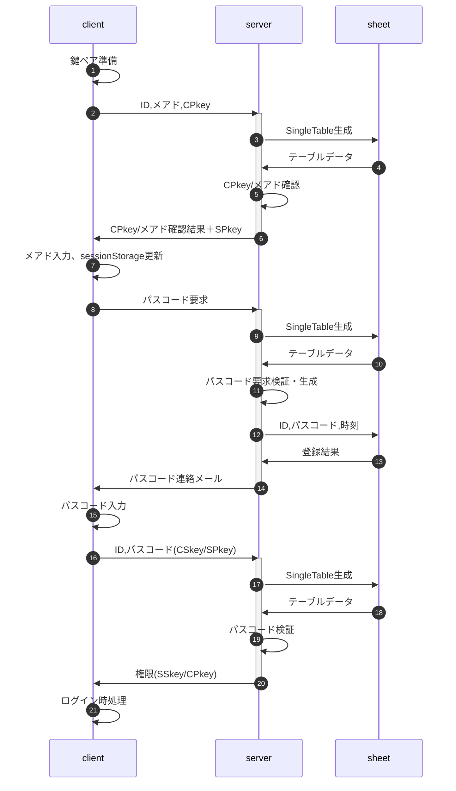
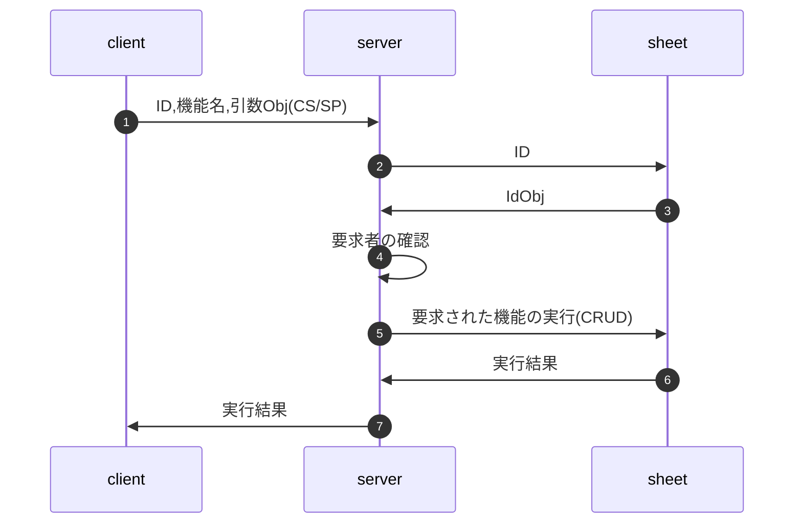

# 認証の手順

## 用語解説、凡例

- パスフレーズ：client側の鍵ペア生成のキーとなる文字列。ブラウザのsessionStorageに保存
- パスコード：ログイン時の二要素認証の際にserverから送られる6桁の数字
- CPkey:clientの公開鍵、CSkey:clientの秘密鍵、SPkey:serverの公開鍵、SSkey:serverの秘密鍵
- `(XS/YP)`は、XSkeyで署名・YPkeyで暗号化の意味
- 署名・暗号のいずれかを行わない場合、'--'で表記
  - `(XS/--)` ⇒ XSkeyで署名、暗号化は無し
  - `(--/YP)` ⇒ 署名は無し、YPkeyで暗号化
  - `(--/--)` ⇒ 平文

## 起動時の処理

画面要求された時はIDを確認し、cookieに保存する。

- URLのクエリ文字列にIDが含まれている ⇒ cookieにIDを保存(上書き)
- URLのクエリ文字列にIDが含まれていない
  - cookieにIDが保存されている ⇒ そのままcookieのIDを利用
  - cookieにIDが保存されていない ⇒ cookieにID=0(未定)を保存

## ログイン要求時の処理

- 鍵ペア準備
  - sessionStorageにパスフレーズ未登録の場合
    1. パスフレーズを生成、sessionStorageに保存
    1. パスフレーズからCPkey/CSkeyを生成、インスタンスのメンバとして保存
- CPkey/メアド確認
  - メールアドレス
    | sheet | client | server action | return | client action |
    | :-- | :-- | :-- | :-- | :-- |
    | 登録済 | 有り(一致) | 不要 | false | 不要 |
    |  | 有り(不一致) | 不要 | sheet.email | clientのメアドをsheetのそれで上書き |
    |  | 無し | 不要 | sheet.email | sessionStorageにsheet.emailを保存 |
    | 未登録 | 有り | sheetにclient.emailを登録 | false | 不要 |
    |  | 無し | 不要 | true | ダイアログから入力、sessionStorageに保存 |
  - CPkey
    | sheet | client | server action | return | client action |
    | :-- | :-- | :-- | :-- | :-- |
    | 登録済 | 有り(一致) | 不要 | false | 不要 |
    |  | 有り(不一致) | client.CPkeyでシートを更新 | false | 不要 |
    |  | 無し | 不要 | Error | Errorメッセージを出して終了 |
    | 未登録 | 有り | client.CPkeyをシートに登録 | false | 不要 |
    |  | 無し | 不要 | Error | Errorメッセージを出して終了 |
- パスコード要求は「ID,メアド(CSkey/SPkey)」を送る
- パスコード要求検証・生成
  1. 送られたメアドを復号・署名検証、sheet.emailと一致
  1. シートに記録されている権限は、ログイン可能
  1. 前回ログイン3連続失敗から一定以上の時間経過
  1. 上述が全てOKならパスコードを生成
- パスコード検証
  1. CPkey/SSkeyで復号・署名検証
  1. パスコードが一致
  1. 試行回数が一定数以下(既定値3回)
  1. パスコード登録から一定時間内(既定値10分)
  1. シートに記録されている権限は、ログイン可能
- ログイン時処理
  1. 権限を復号・署名検証、sessionStorageに保存
  1. メニュー再描画

【注意事項】

1. メアドを事前に入力、二要素認証することで
   - 実在かつメール受信可能なアドレスであることを確認
   - メアドの保持者以外の、悪意のある第三者がアクセスすることを抑止
1. SPkeyはsessionStorageに保存せず変数として保持し、アクセス権の有効期間を最小化
1. メアド入力、パスコード入力はダイアログで行う(開発工数低減)
1. 権限の値は[configの設定](#configの設定)参照

## 要権限メニュー表示要求時の処理

- 要求の実行結果がリストや候補者(複数)になる可能性もあるので、実際にはserver<->sheetはテーブル全体のデータをやりとりする
- 要求者の確認
  1. 引数Obj(JSON文字列)をSCkeyで復号
  1. 復号された文字列についてCPkeyで署名検証
  1. 復号された文字列をparse、オブジェクト化できれば正規の要求
  1. 有効期限(既定値48時間)の検証
- 「要求された機能」は、事前にserver側で用意した関数に限定する(clientから渡すのは関数では無く、「機能名(文字列)」)
- 「要求された機能の実行」では、漏洩リスク低減のため、戻り値を必要最小限の情報に絞る
