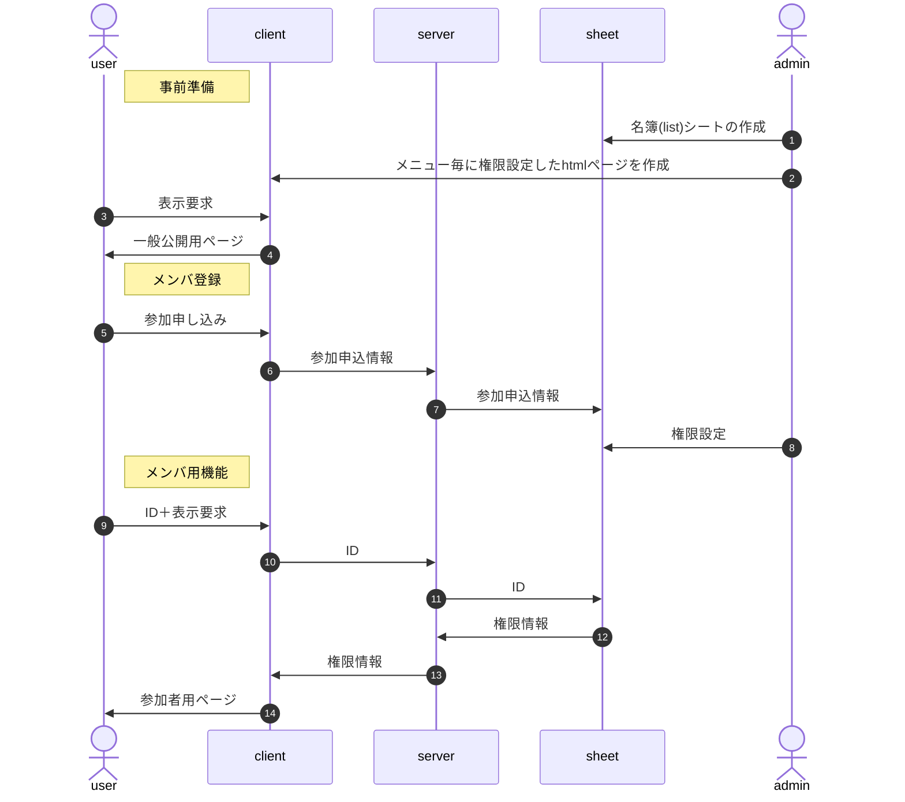

# 使用方法

使用時の大まかな流れは以下の通り。



■作成手順

1. Google Spreadを用意、名簿(list)シートを作成
1. configに名簿シート各項目の定義を記載
1. 実装する機能・ページ毎にclient(index.html)にDIV要素を作成
1. build.shを実行、client,server(server.gs)を生成
1. index.html,server.gsをシートのApps Scriptとしてコピー、デプロイ

## 1.名簿(list)シートの作成

- ID(primaryKey)
- passcode : 6桁の数字
- authLog : 「タイムスタンプ＋入力内容」をJSON化
- email
- timestamp : 生成日時
- name
- reading
- tel
- note : フォームから入力された備考
- cancel
- authority
- publicKey
- keyCreated
- certificate : 判定日時
- isTest : テスト用ならtrue
- memo : シートで入力した内部用備考

<!-- シートイメージを追加 -->

## 2.config定義

「BurgerMenuクラスメンバ⊇インスタンス生成時の引数」となる。ここではクラスメンバ全体について説明。

//::config::

## 3.index.htmlの作成

### 3.1 BODYタグ内部

#### 3.1.1 htmlソースイメージ

- 表示部は&lt;div data-BurgerMenu&gt;の階層内で定義する。<br>
  階層外の要素はメニューで選択しても表示されない。
- data-BurgerMenu属性を持つ要素にIDとなるclass属性を付与

```
<body>
  <div class="c1001" data-BurgerMenu="label:'スタッフ',authority:2">
    <div class="c1002" data-BurgerMenu="label:'受付業務',func:'recept'"></div>
    <div class="c1003" data-BurgerMenu="label:'校内探険'">
        
    </div>
  </div>
  <div class="c1004" data-BurgerMenu="label:'Tips',href:'https://〜/tips.html'"></div>
</body>
```

下位の階層を持つ場合、自分自身の表示内容は持たせない(以下はNG)

```
<div data-BurgerMenu="label:'お知らせ'">
!!NG!! <p>お知らせのページです</p>
  <div data-BurgerMenu="label:'掲示板'">〜</div>
  <div data-BurgerMenu="label:'注意事項'">〜</div>
</div>
```

「お知らせ」は「掲示板」「注意事項」のブランチとして扱われるので、「&lt;p&gt;お知らせのページです&lt;/p&gt;」というお知らせページ自身の表示内容は定義不可。

#### 3.1.2 data-BurgerMenu属性の書き方

タグのauthとその人の権限の論理積>0ならメニューを表示する。

オブジェクトの記述に準ずる。但し短縮するため前後の"{","}"は省略する。

- {string} label - メニュー化する時の名称
- {string} [func] - メニュー選択時に実行する関数名。<br>
  関数名と実際の関数はBurgerMenuインスタンス生成時に定義。
- {string} [href] - 遷移先のURL。別タブが開かれる。
- {number} [authority] - 表示権限。<br>
  BurgerMenuインスタンス生成時のauthorityとの論理積>0なら表示する。<br>
  ex: 一般参加者1、スタッフ2として<br>
      data-BurgerMenu="authrotiry:2"とされた要素は、<br>
      new BurgerMenu({authority:1})の一般参加者は非表示、<br>
      new BurgerMenu({authority:2})のスタッフは表示となる。

### 3.2 script部

```
window.addEventListener('DOMContentLoaded',() => {
  const v = {whois:'DOMContentLoaded',rv:null,step:0};
  console.log(`${v.whois} start.`);
  try {

    v.arg = {...}; // 次項「BurgerMenuクラスメンバ」参照
    v.menu = new BurgerMenu(v.arg);
    if( v.menu instanceof Error ) throw v.menu;

    v.step = 99; // 終了処理
    console.log(`${v.whois} normal end.`);
    return v.rv;
  } catch(e) {
    e.message = `${v.whois} abnormal end at step.${v.step}\n${e.message}`;
    console.error(`${e.message}\nv=${JSON.stringify(v)}`);
    alert(e.message);
  }
});
```

## 4.build.shの生成物

- client/ : client(index.html)関係のソース
  - commonConfig.js : client/server共通config
  - clientConfig.js : client特有のconfig
  - proto.js : class BurgerMenu全体のソース
  - test.html : client関係のテスト用html
  - xxx.js : class BurgerMenuの各メソッドのソース
- server/ : server(server.gs)関係のソース
  - serverConfig.js : server特有のconfig
- doc/ : readme.mdの各記事のソース集
  - proto.md : readme.mdのプロトタイプ
  - xxx.md : readme.mdに埋め込む各記事のソース
- build.sh : client/server全体のビルダ
- core.js : class BurgerMenuのソース
- index.html : 
- server.gs : サーバ側BurgerMenuのソース
- readme.md : client/server全体の仕様書
