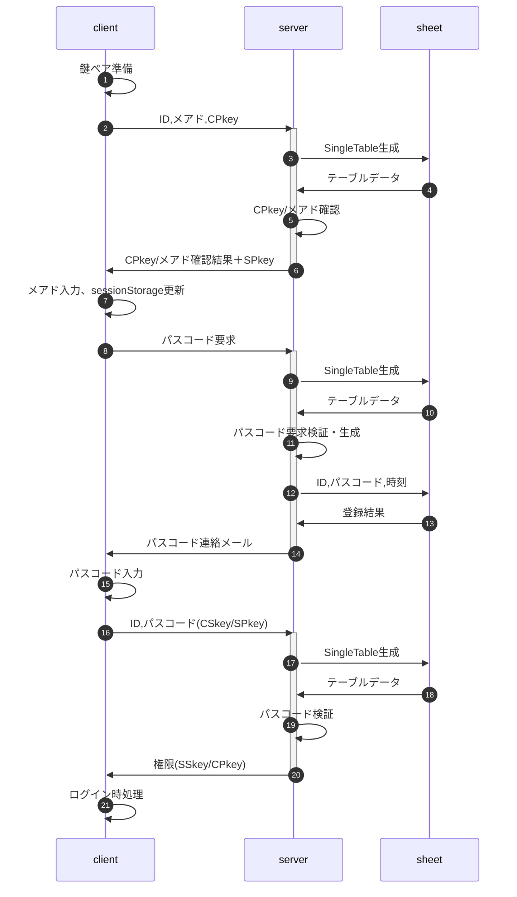
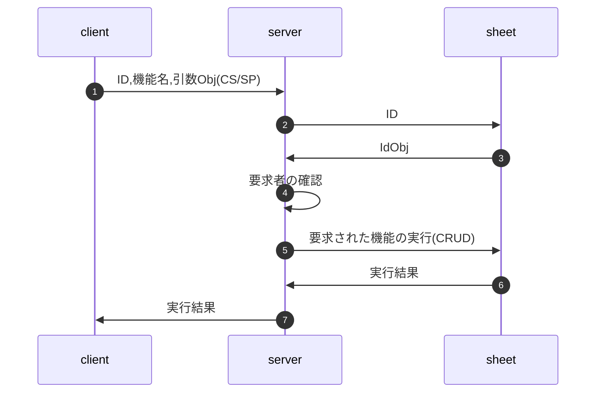

<style scoped type="text/css">
html, body{
  width: 100%;
  margin: 0;
    text-size-adjust: none; }
body * {
  font-size: 1rem;
  font-family: sans-serif;
  box-sizing: border-box;
}
.num, .right {text-align:right;}
.screen {padding: 1rem;} .title {   font-size: 2.4rem;
  text-shadow: 2px 2px 5px #888;
}

.table {display:grid}
th, .th, td, .td {
  margin: 0.2rem;
  padding: 0.2rem;
}
th, .th {
  background-color: #888;
  color: white;
}
td, .td {
  border-bottom: solid 1px #aaa;
  border-right: solid 1px #aaa;
}

.triDown {   --bw: 50px;
  width: 0px;
  height: 0px;
  border-top: calc(var(--bw) * 0.7) solid #aaa;
  border-right: var(--bw) solid transparent;
  border-left: var(--bw) solid transparent;
  border-bottom: calc(var(--bw) * 0.2) solid transparent;
}

.loader,
.loader:after {
  border-radius: 50%;
  width: 10em;
  height: 10em;
}
.loader {
  margin: 60px auto;
  font-size: 10px;
  position: relative;
  text-indent: -9999em;
  border-top: 1.1em solid rgba(204,204,204, 0.2);
  border-right: 1.1em solid rgba(204,204,204, 0.2);
  border-bottom: 1.1em solid rgba(204,204,204, 0.2);
  border-left: 1.1em solid #cccccc;
  -webkit-transform: translateZ(0);
  -ms-transform: translateZ(0);
  transform: translateZ(0);
  -webkit-animation: load8 1.1s infinite linear;
  animation: load8 1.1s infinite linear;
}
@-webkit-keyframes load8 {
  0% {
    -webkit-transform: rotate(0deg);
    transform: rotate(0deg);
  }
  100% {
    -webkit-transform: rotate(360deg);
    transform: rotate(360deg);
  }
}
@keyframes load8 {
  0% {
    -webkit-transform: rotate(0deg);
    transform: rotate(0deg);
  }
  100% {
    -webkit-transform: rotate(360deg);
    transform: rotate(360deg);
  }
}
</style>
<p class="title">class BurgerMenu</p>

htmlソースからdata-BurgerMenu属性を持つ要素を抽出、表示内容の権限の存否に従ってハンバーガーメニューを作成


「参加者一覧」等、スタッフには必要だが参加者に公開したくないメニューが存在する。これの表示制御を行うため、スタッフと参加者では「権限(auth)」を分ける。

閲覧者が権限を持つかはGoogle Spread上に保存し、適宜「認証」を行って「利便性を確保しつつ、役割に応じた最低限の情報に限定」する。具体的な方法は「[認証の手順](#認証の手順)」の項を参照。


[先頭](#top) | [使用方法](#useage) | [生成されるナビ](#deliverables) | [認証の手順](#authorization) | [仕様(JSDoc)](#jsdoc) | [プログラムソース](#program_source) | [改版履歴](#revision_history)
<a name="useage"></a>
# 1.使用方法

## 1.1 BODYタグ内部

### htmlソースイメージ

- 表示部は&lt;div data-BurgerMenu&gt;の階層内で定義する。<br>
  階層外の要素はメニューで選択しても表示されない。
- data-BurgerMenu属性を持つ要素にIDとなるclass属性を付与

```
<body>
  <div class="c1001" data-BurgerMenu="label:'スタッフ',authority:2">
    <div class="c1002" data-BurgerMenu="label:'受付業務',func:'recept'"></div>
    <div class="c1003" data-BurgerMenu="label:'校内探険'">
        
    </div>
  </div>
  <div class="c1004" data-BurgerMenu="label:'Tips',href:'https://〜/tips.html'"></div>
</body>
```

下位の階層を持つ場合、自分自身の表示内容は持たせない(以下はNG)

```
<div data-BurgerMenu="label:'お知らせ'">
!!NG!! <p>お知らせのページです</p>
  <div data-BurgerMenu="label:'掲示板'">〜</div>
  <div data-BurgerMenu="label:'注意事項'">〜</div>
</div>
```

「お知らせ」は「掲示板」「注意事項」のブランチとして扱われるので、「&lt;p&gt;お知らせのページです&lt;/p&gt;」というお知らせページ自身の表示内容は定義不可。

### data-BurgerMenu属性の書き方

オブジェクトの記述に準ずる。但し短縮するため前後の"{","}"は省略する。

- {string} label - メニュー化する時の名称
- {string} [func] - メニュー選択時に実行する関数名。<br>
  関数名と実際の関数はBurgerMenuインスタンス生成時に定義。
- {string} [href] - 遷移先のURL。別タブが開かれる。
- {number} [authority] - 表示権限。<br>
  BurgerMenuインスタンス生成時のauthorityとの論理積>0なら表示する。<br>
  ex: 一般参加者1、スタッフ2として<br>
      data-BurgerMenu="authrotiry:2"とされた要素は、<br>
      new BurgerMenu({authority:1})の一般参加者は非表示、<br>
      new BurgerMenu({authority:2})のスタッフは表示となる。

## 1.2 script部

```
window.addEventListener('DOMContentLoaded',() => {
  const v = {whois:'DOMContentLoaded',rv:null,step:0};
  console.log(`${v.whois} start.`);
  try {

    v.arg = {...}; // 次項「BurgerMenuクラスメンバ」参照
    v.menu = new BurgerMenu(v.arg);
    if( v.menu instanceof Error ) throw v.menu;

    v.step = 99; // 終了処理
    console.log(`${v.whois} normal end.`);
    return v.rv;
  } catch(e) {
    e.message = `${v.whois} abnormal end at step.${v.step}\n${e.message}`;
    console.error(`${e.message}\nv=${JSON.stringify(v)}`);
    alert(e.message);
  }
});
```

## 1.3 インスタンス生成時の引数

「BurgerMenuクラスメンバ⊇インスタンス生成時の引数」となる。ここではクラスメンバ全体について説明。

```
const config = (()=>{
  const common = {};  // client/server共通定義

  // ------------------------------------------
  // アクセス権限
  // ------------------------------------------
  common.auth = {
    // 無権限
    none       :  0,
    // 個人情報を含まないコンテンツ
    memberMenu :  1,  // 2^0=1 : (一般公開しない)参加者向け情報の閲覧
    staffMenu  :  2,  // 2^1=2 : スタッフ向け情報の閲覧(応募状況、等)
    // 掲示板の閲覧・投稿
    viewBoard  :  4,  // 2^2=4 : スタッフ投稿の閲覧。但し0でもWhat's Newは閲覧可
    postBoard  :  8,  // 2^3=8 : 掲示板への投稿
    // 参加者個人情報の作成・検索・編集
    editSelf   : 16,  // 2^4=16 : 自分の申込情報の新規作成・編集
    editAll    : 32,  // 2^5=32 : 横断的な申込情報の検索・編集
  };
  common.auth.visitor = common.auth.none; // 訪問者。一般公開部分のみ閲覧可(無権限)
  common.auth.member = common.auth.visitor  // 参加者
    + common.auth.memberMenu + common.auth.viewBoard + common.auth.editSelf;
  common.auth.staff = common.auth.member  // スタッフ(一般)。横断的な申込情報の検索・編集以外はOK
    + common.auth.staffMenu + common.auth.postBoard;
  common.auth.core = common.auth.staff  // コアスタッフ
    + common.auth.editAll;


  // ------------------------------------------
  // クライアント側・サーバ側特有の定義
  // ------------------------------------------
  // clientConfig, serverConfig では変数'unique'に格納されるオブジェクトとして定義
  // ex. const unique = (common=>{})(common);

//::place_holder::

  return mergeDeeply(unique,common);
})();
```

## 1.4 Google Spreadシート

- ID(primaryKey)
- passcode : 6桁の数字
- authLog : 「タイムスタンプ＋入力内容」をJSON化
- email
- timestamp : 生成日時
- name
- reading
- tel
- note : フォームから入力された備考
- cancel
- authority
- publicKey
- keyCreated
- certificate : 判定日時
- isTest : テスト用ならtrue
- memo : シートで入力した内部用備考

<!-- シートイメージを追加 -->

## 1.5 【参考】権限(auth)の判定方法

タグのauthとその人の権限の論理積>0ならメニューを表示

[先頭](#top) | [使用方法](#useage) | [生成されるナビ](#deliverables) | [認証の手順](#authorization) | [仕様(JSDoc)](#jsdoc) | [プログラムソース](#program_source) | [改版履歴](#revision_history)
<a name="deliverables"></a>
# 2.生成されるナビ

- 通常の画面(校内探検)<br>
  ソースに付与されたIDに対応する文字列をname属性として持ち、
  クリックすると`<div class="(name属性の値)">`を持つ要素(該当画面)を開くイベントを付与
- func指定があった場合(受付業務)<br>
  name属性として「ID＋実行する関数名」を持ち、
  クリックすると該当画面を開き、指定された関数を実行するイベントを付与
- href指定があった場合(Tips)<br>
  href属性を持ち、クリックすると遷移先画面を開くイベントを付与

```
<nav>
  <ul>
    <li name="c1001">スタッフ
      <ul>
        <li><a name="c1002\trecept">受付業務</a></li>
        <li><a name="c1003">校内探検</a></li>
      </ul>
    </li>
    <li><a name="c1004" href="https://〜/tips.html">Tips</a></li>
  </ul>
</nav>
```

<!-- 画像イメージを追加 -->


[先頭](#top) | [使用方法](#useage) | [生成されるナビ](#deliverables) | [認証の手順](#authorization) | [仕様(JSDoc)](#jsdoc) | [プログラムソース](#program_source) | [改版履歴](#revision_history)
<a name="authorization"></a>
# 認証の手順

## 用語解説、凡例

- パスフレーズ：client側の鍵ペア生成のキーとなる文字列。ブラウザのsessionStorageに保存
- パスコード：ログイン時の二要素認証の際にserverから送られる6桁の数字
- CPkey:clientの公開鍵、CSkey:clientの秘密鍵、SPkey:serverの公開鍵、SSkey:serverの秘密鍵
- `(XS/YP)`は、XSkeyで署名・YPkeyで暗号化の意味
- 署名・暗号のいずれかを行わない場合、'--'で表記
  - `(XS/--)` ⇒ XSkeyで署名、暗号化は無し
  - `(--/YP)` ⇒ 署名は無し、YPkeyで暗号化
  - `(--/--)` ⇒ 平文

## 起動時の処理

画面要求された時はIDを確認し、cookieに保存する。

- URLのクエリ文字列にIDが含まれている ⇒ cookieにIDを保存(上書き)
- URLのクエリ文字列にIDが含まれていない
  - cookieにIDが保存されている ⇒ そのままcookieのIDを利用
  - cookieにIDが保存されていない ⇒ cookieにID=0(未定)を保存

## ログイン要求時の処理



- 鍵ペア準備
  - sessionStorageにパスフレーズ未登録の場合
    1. パスフレーズを生成、sessionStorageに保存
    1. パスフレーズからCPkey/CSkeyを生成、インスタンスのメンバとして保存
- CPkey/メアド確認
  - メールアドレス
    | sheet | client | server action | return | client action |
    | :-- | :-- | :-- | :-- | :-- |
    | 登録済 | 有り(一致) | 不要 | false | 不要 |
    |  | 有り(不一致) | 不要 | sheet.email | clientのメアドをsheetのそれで上書き |
    |  | 無し | 不要 | sheet.email | sessionStorageにsheet.emailを保存 |
    | 未登録 | 有り | sheetにclient.emailを登録 | false | 不要 |
    |  | 無し | 不要 | true | ダイアログから入力、sessionStorageに保存 |
  - CPkey
    | sheet | client | server action | return | client action |
    | :-- | :-- | :-- | :-- | :-- |
    | 登録済 | 有り(一致) | 不要 | false | 不要 |
    |  | 有り(不一致) | client.CPkeyでシートを更新 | false | 不要 |
    |  | 無し | 不要 | Error | Errorメッセージを出して終了 |
    | 未登録 | 有り | client.CPkeyをシートに登録 | false | 不要 |
    |  | 無し | 不要 | Error | Errorメッセージを出して終了 |
- パスコード要求は「ID,メアド(CSkey/SPkey)」を送る
- パスコード要求検証・生成
  1. 送られたメアドを復号・署名検証、sheet.emailと一致
  1. シートに記録されている権限は、ログイン可能
  1. 前回ログイン3連続失敗から一定以上の時間経過
  1. 上述が全てOKならパスコードを生成
- パスコード検証
  1. CPkey/SSkeyで復号・署名検証
  1. パスコードが一致
  1. 試行回数が一定数以下(既定値3回)
  1. パスコード登録から一定時間内(既定値10分)
  1. シートに記録されている権限は、ログイン可能
- ログイン時処理
  1. 権限を復号・署名検証、sessionStorageに保存
  1. メニュー再描画

【注意事項】

1. メアドを事前に入力、二要素認証することで
   - 実在かつメール受信可能なアドレスであることを確認
   - メアドの保持者以外の、悪意のある第三者がアクセスすることを抑止
1. SPkeyはsessionStorageに保存せず変数として保持し、アクセス権の有効期間を最小化
1. メアド入力、パスコード入力はダイアログで行う(開発工数低減)
1. 権限の値は[configの設定](#configの設定)参照

## 要権限メニュー表示要求時の処理



- 要求の実行結果がリストや候補者(複数)になる可能性もあるので、実際にはserver<->sheetはテーブル全体のデータをやりとりする
- 要求者の確認
  1. 引数Obj(JSON文字列)をSCkeyで復号
  1. 復号された文字列についてCPkeyで署名検証
  1. 復号された文字列をparse、オブジェクト化できれば正規の要求
  1. 有効期限(既定値48時間)の検証
- 「要求された機能」は、事前にserver側で用意した関数に限定する(clientから渡すのは関数では無く、「機能名(文字列)」)
- 「要求された機能の実行」では、漏洩リスク低減のため、戻り値を必要最小限の情報に絞る


[先頭](#top) | [使用方法](#useage) | [生成されるナビ](#deliverables) | [認証の手順](#authorization) | [仕様(JSDoc)](#jsdoc) | [プログラムソース](#program_source) | [改版履歴](#revision_history)
<a name="jsdoc"></a>
# 仕様(JSDoc)

<a name="BurgerMenu"></a>

## BurgerMenu
htmlソースからdata-BurgerMenu属性を持つ要素を抽出、表示内容の権限の存否に従ってハンバーガーメニューを作成

**Kind**: global class  

* [BurgerMenu](#BurgerMenu)
    * [new BurgerMenu(arg)](#new_BurgerMenu_new)
    * [.setProperties(arg)](#BurgerMenu+setProperties) ⇒ <code>null</code> \| <code>Error</code>

<a name="new_BurgerMenu_new"></a>

### new BurgerMenu(arg)

| Param | Type |
| --- | --- |
| arg | <code>Object</code> | 

<a name="BurgerMenu+setProperties"></a>

### burgerMenu.setProperties(arg) ⇒ <code>null</code> \| <code>Error</code>
constructorの引数と既定値からthisの値を設定

**Kind**: instance method of [<code>BurgerMenu</code>](#BurgerMenu)  

| Param | Type | Description |
| --- | --- | --- |
| arg | <code>Object</code> | constructorに渡された引数オブジェクト |


[先頭](#top) | [使用方法](#useage) | [生成されるナビ](#deliverables) | [認証の手順](#authorization) | [仕様(JSDoc)](#jsdoc) | [プログラムソース](#program_source) | [改版履歴](#revision_history)
<a name="program_source"></a>
# プログラムソース

<!--::source::-->

[先頭](#top) | [使用方法](#useage) | [生成されるナビ](#deliverables) | [認証の手順](#authorization) | [仕様(JSDoc)](#jsdoc) | [プログラムソース](#program_source) | [改版履歴](#revision_history)
<a name="revision_history"></a>
# 改版履歴

- rev.2.0.0 : class Authと統合
- rev.1.1.0 : 2024/03/14
  - setupInstanceをmergeDeeplyに置換(setupInstanceは廃番)
  - arg.funcの取り扱いを`new Function()`から直接関数を渡す形に修正
  - changeメソッドを廃止、changeScreenで代替
- rev.1.0.0 : 2024/01/03 初版
