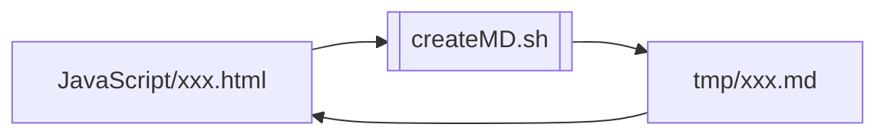
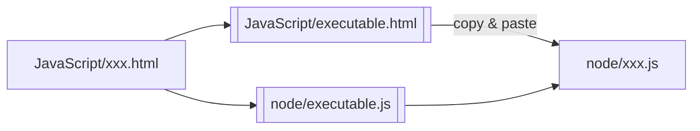

独自ライブラリ：JavaScript

# 開発方針

    1. CSS, HTML, JavaScript, Doc, Testの一元管理
    2. オンラインツール、バッチも同一ファイルから使用・作成可能

## 課題

1. メニューなど、一つの機能はCSS/HTML/Scriptから成るが、一元管理がしにくい 
   ドキュメント・テスト(仕様・スクリプト)は特に散逸しやすい
1. MarkDownで出力できない(できるはずだが試行錯誤でめげた)
1. Mermaid等の拡張機能をJSDocに入れることは困難
1. JSDocの@typeDefの記述は一箇所だが、参照は多くの場合入力・出力の2箇所、またはそれ以上になる
1. JSDocの出力ファイルが多く、管理が煩雑(README.mdからの参照が複雑)

## 対応

- VueライクにCSS/HTML/Scriptを一つのファイルにまとめる
- 文書は基本JSDocで残す。JSDocで表現しにくい図(Mermaid等)はMarkDownで記述可能にする
- テスト仕様およびツールも同一ファイルに残す
- 「表示モード」を設定、以下のように制御する
  - Doc : JSDoc + 補足説明を表示
  - Test : テスト用画面を表示。consoleでテストする場合は割愛
  - App : オンラインツール画面を表示
- ソース修正時は"update.js"を実行し、ライブラリおよび単体実行用(Node.js)ファイルを更新

## 補足

- 他コンポーネントで定義したオブジェクトへの参照が定義できないが、これは暫定的に補足説明に追記することで対応

# 使用方法

# 作成・修正手順

1. JavaScriptフォルダで、参考となるコンポーネントをコピー
   - 最新：textContent.html
1. `./createMD.sh xxx`を実行(拡張子は不要)、`tmp/xxx.md`に作成されたMDを`JavaScript/xxx.html`に反映

## 仕様書の参照(doc)

`JavaScript/xxx.html`を開き、「仕様書」モードを選択

## オンラインツール(webApp)

`JavaScript/xxx.html`を開き、「webアプリ」モードを選択

## テストの実施

以下のテスト仕様書・テストスクリプト・テストデータは`<script class="test">`内部に記述する。

1. テスト仕様書を`xxxTest()`のJSDocに記述
1. テストデータを準備、`xxxTest()`にテストスクリプトを記述
1. 開発者コンソールでテスト。画面が必要な場合、`JavaScript/xxx.html`を開き、「テスト」モードを選択

## 単体実行可能なJSの作成

以下のいずれかを実行。

- `JavaScript/executable.html`をwebアプリモードで開き、コンポーネントのソースを貼付
- `node node/executable.js -i:xxx.html -o:node/xxx.js`を実行

## ライブラリの作成

以下を順番に実行。

1. createLib.shでどのコンポーネントをどのライブラリに組み込むか指定
1. `./createLib.sh`を実行。

外部参照が必要なコンポーネントの場合、判明の都度外部参照をライブラリを利用するアプリに記述。