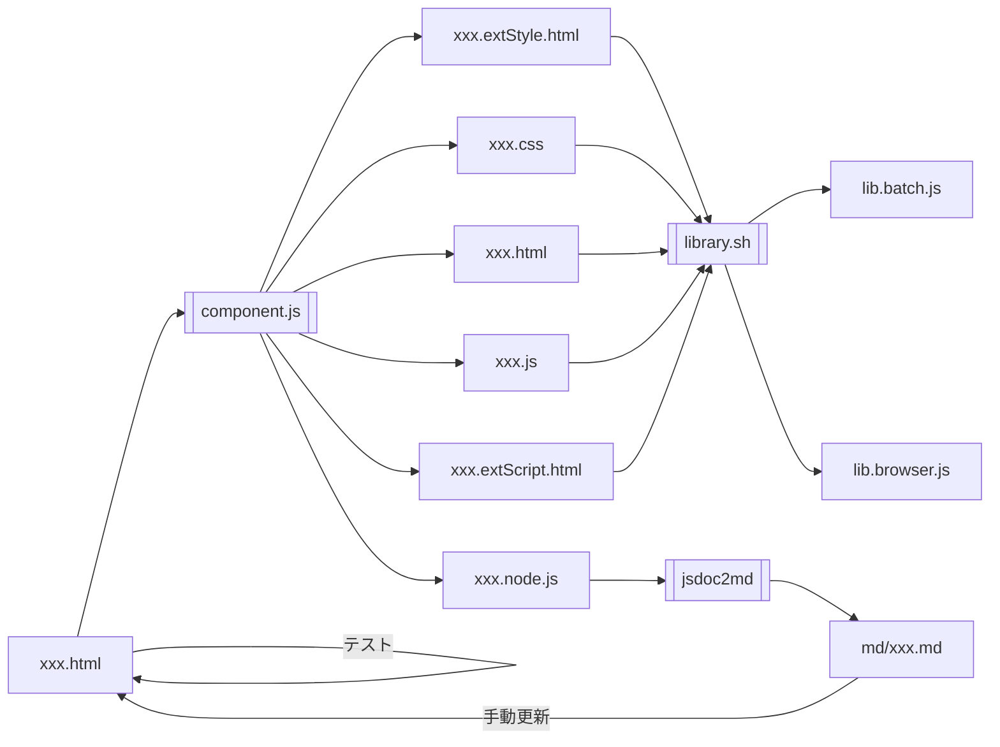

<p style="font-size:2rem">独自ライブラリ：JavaScript</p>

# 開発方針

    1. CSS, HTML, JavaScript, Doc, Testの一元管理
    2. オンラインツール、バッチも同一ファイルから使用・作成可能

## 課題

1. メニューなど、一つの機能はCSS/HTML/Scriptから成るが、一元管理がしにくい<br>
   ドキュメント・テスト(仕様・スクリプト)は特に散逸しやすい
1. MarkDownで出力できない(できるはずだが試行錯誤でめげた)
1. Mermaid等の拡張機能をJSDocに入れることは困難
1. JSDocの@typeDefの記述は一箇所だが、参照は多くの場合入力・出力の2箇所、またはそれ以上になる
1. JSDocの出力ファイルが多く、管理が煩雑(README.mdからの参照が複雑)

## 対応

- VueライクにCSS/HTML/Scriptを一つのファイルにまとめる
- 文書は基本JSDocで残す。JSDocで表現しにくい図(Mermaid等)はMarkDownで記述可能にする
- テスト仕様およびツールも同一ファイルに残す
- 「表示モード」を設定、以下のように制御する
  - Doc : JSDoc + 補足説明を表示
  - Test : テスト用画面を表示。consoleでテストする場合は割愛
  - App : オンラインツール画面を表示
- ソース修正時は"update.js"を実行し、ライブラリおよび単体実行用(Node.js)ファイルを更新

## 補足

- 他コンポーネントで定義したオブジェクトへの参照が定義できないが、これは暫定的に補足説明に追記することで対応


# 更新手順

## フロー



## 使用するフォルダと構成

```
library
├── CSS : ライブラリ共通のCSSファイル(ex.szDefault.css)を集めたフォルダ
│   └── szDefault.css
├── JavaScript : JavaScriptで記述されたコンポーネントを集めたフォルダ
│   ├── CSS : 親フォルダに存在するコンポーネントの内、独自CSS定義部
│   ├── ext : 同様に、CSS/Scriptの外部参照
│   ├── HTML : 同様に、独自HTML部
│   ├── scr : 同様に、Script部
│   ├── md : コンポーネントのJSDoc+補足説明部分のMarkdownテキスト
│   └── README.md : ライブラリの内、JavaScriptに関する説明
├── README.md : ライブラリの構成・運用に関する説明
├── lib : コンポーネントを取捨選択して作成された用途別ライブラリ
│   └── szLib.js
└── node : コマンドライン(Node.js)で実行な形式のコンポーネント<br>
          ※ nodeで実行可能なら記述言語を問わず、当フォルダに集約する。
```

# コンポーネント

## 構成

- 表示モード：3つの表示モード(文書、テスト、オンラインツール)それぞれで表示するなら'1'、非表示なら'0'
- 抽出
  - css (JavaScript/CSS/xxx.css) : コンポーネントのCSS部分として出力
  - html (JavaScript/HTML/xxx.html) : コンポーネントのHTML部分として出力
  - js (JavaScript/script/xxx.js) : コンポーネントのスクリプト部分として出力
  - ext (JavaScript/external/xxx.html) : コンポーネントの外部参照部分として出力
  - node (node/xxx.js) : コマンドライン(Node.js)で実行な形式のコンポーネントとして出力

<style type="text/css">
  td span.o {font-weight: 900;　/*border: solid 2px red;background-color:white;*/}
  td span.x {color:#aaa; /*text-decoration: line-through;*/}
</style>

No | 内容 / CSSセレクタ | 表示モード / 抽出先
--: | :-- | :--
&emsp; | <span class="o">スタイルシート</span> | ==========
11 | コンポーネントで使用する外部スタイルシートへの参照<br>&lt;link rel=&quot;stylesheet&quot; href=&quot;〜&quot; /&gt; | <span class="x">doc</span>, <span class="x">test</span>, <span class="x">app</span><br><span class="x">css</span>, <span class="x">html</span>, <span class="x">js</span>, <span class="o">ext</span>, <span class="x">node</span>
12 | 独自に追加定義したスタイルシート<br>&lt;style type=&quot;text/css&quot; class=&quot;source&quot;&gt; | <span class="x">doc</span>, <span class="x">test</span>, <span class="x">app</span><br><span class="o">css</span>, <span class="x">html</span>, <span class="x">js</span>, <span class="x">ext</span>, <span class="x">node</span>
&emsp;| <span class="o">HTML</span> | ==========
21 | ソース内JSDocをMarkdown化したテキスト<br>&lt;style type=&quot;text/markdown&quot; class=&quot;jsdoc&quot;&gt; ⇒ &lt;div class=&quot;jsdoc&quot;&gt; | <span class="o">doc</span>, <span class="x">test</span>, <span class="x">app</span><br><span class="x">css</span>, <span class="x">html</span>, <span class="x">js</span>, <span class="x">ext</span>, <span class="o">node</span>
22 | JSDoc以外の補足説明<br>&lt;style type=&quot;text/markdown&quot; class=&quot;doc&quot;&gt; ⇒ &lt;div class=&quot;doc&quot;&gt; | <span class="o">doc</span>, <span class="x">test</span>, <span class="x">app</span><br><span class="x">css</span>, <span class="x">html</span>, <span class="x">js</span>, <span class="x">ext</span>, <span class="o">node</span>
23 | テスト仕様書<br>&lt;style type=&quot;text/markdown&quot; class=&quot;test&quot;&gt; ⇒ &lt;div class=&quot;test&quot;&gt; | <span class="x">doc</span>, <span class="o">test</span>, <span class="x">app</span><br><span class="x">css</span>, <span class="x">html</span>, <span class="x">js</span>, <span class="x">ext</span>, <span class="x">node</span>
24 | コンポーネントのHTML部<br>&lt;div class=&quot;source&quot;&gt; | <span class="x">doc</span>, <span class="x">test</span>, <span class="o">app</span><br><span class="x">css</span>, <span class="o">html</span>, <span class="x">js</span>, <span class="x">ext</span>, <span class="x">node</span>
&emsp;| <span class="o">スクリプト</span> | ==========
31 | コンポーネントで使用する外部スクリプトへの参照<br>&lt;script src=&quot;〜&quot;&gt;&lt;/script&gt; | <span class="x">doc</span>, <span class="x">test</span>, <span class="x">app</span><br><span class="x">css</span>, <span class="x">html</span>, <span class="x">js</span>, <span class="o">ext</span>, <span class="o">node</span>
32 | コンポーネントのスクリプト部<br>&lt;script type=&quot;text/javascript&quot; class=&quot;source&quot;&gt; | <span class="x">doc</span>, <span class="x">test</span>, <span class="x">app</span><br><span class="x">css</span>, <span class="x">html</span>, <span class="o">js</span>, <span class="x">ext</span>, <span class="o">node</span>
33 | テストでのみ使用するスクリプト<br>&lt;script type=&quot;text/javascript&quot; class=&quot;test&quot;&gt; | <span class="x">doc</span>, <span class="x">test</span>, <span class="x">app</span><br><span class="x">css</span>, <span class="x">html</span>, <span class="x">js</span>, <span class="x">ext</span>, <span class="x">node</span>
34 | オンラインツールモードでのみ使用するスクリプト<br>&lt;script type=&quot;text/javascript&quot; class=&quot;app&quot;&gt; | <span class="x">doc</span>, <span class="x">test</span>, <span class="x">app</span><br><span class="x">css</span>, <span class="x">html</span>, <span class="x">js</span>, <span class="x">ext</span>, <span class="x">node</span>
35 | 本ファイルを開いた際に実行されるスクリプト<br>&lt;script type=&quot;text/javascript&quot;&gt; | <span class="x">doc</span>, <span class="x">test</span>, <span class="x">app</span><br><span class="x">css</span>, <span class="x">html</span>, <span class="x">js</span>, <span class="x">ext</span>, <span class="x">node</span>

- 仕様書/テスト/オンラインツール画面でのみ使用するスタイルは、No.12で`.doc`,`.test`,`.app`で指定する

## テンプレート

```
<!DOCTYPE html><html lang="ja">
<head>
  <meta http-equiv="Content-Type" content="text/html; charset=UTF-8">
  <meta http-equiv="Content-Style-Type" content="text/css">
  <meta http-equiv="Content-Script-Type" content="text/javascript">
  <!-- MarkDownテキストをHTML化するCDN -->
  <script src="https://taisukef.github.io/marked_md/marked.min.js"></script>
  <title>proto</title>
  <link rel="stylesheet" href="szDefault.css" />
  <style type="text/css" class="source">
    <!-- ここに一元管理対象HTML+CSS+JavaScriptの【CSS】部を記述 -->
  </style>
</head>
<body>
  <style type="text/markdown" class="doc">
    <!-- ここにjsdoc2mdの結果を貼付 -->
  </style>

  <div class="source">
    <!-- ここに一元管理対象HTML+CSS+JavaScriptの【HTML】部を記述 -->
  </div>

  <style type="text/markdown" class="test">
    <!-- ここにjsdoc2mdの結果を貼付 -->
  </style>
</body>
<script type="text/javascript" class="source">
/* ここに一元管理対象HTML+CSS+JavaScriptの【JavaScript】部を記述 */

/** proto: 概要を一行で記述
 * @desc 
 * @param {} [arg=''] - 説明文
 * @returns {} 説明文
 */
function proto(text=''){
  console.log('=== proto start');
  const v = {rv:[]};
  try {

    // 事前処理：引数チェック、既定値の設定

    console.log('=== proto end');
    return v.rv;

  } catch(e){
    alert(e.stack); // ローカルの場合は有効化
    throw e; //以降の処理を全て停止
    //v.rv.stack = e.stack; return v.rv; // 処理継続
  }
}
</script>

<script type="text/javascript" class="test">
/* ここにテスト用ソースを記述 */

function protoTest(){
  const v = {};
}
</script>

<script type="text/javascript">
/* ここに本HTML表示時の処理を記述 */

  window.addEventListener('DOMContentLoaded',() => {
    const v = {};
    protoTest();

    v.doc = document.createElement('div');
    v.doc.classList.add('sz');

    // MarkDownで記述された部分をHTML化して表示
    v.text = document.querySelector('.doc[type="text/markdown"]').textContent;
    v.text = proto(v.text);
    v.md = marked(v.text);
    v.doc.innerHTML = v.md;
    document.querySelector('body').prepend(v.doc);
  });
</script>
</html>
```

## 参考：NGだった試行

<ol>
<li><details><summary>要素のソースとして読み込み -> JavaScript以外のファイルは読み込めない</summary>

- [HTMLで様々な外部ファイルを読み込む方法](https://webukatu.com/wordpress/blog/16232/)

```
// DIVとして読み込み
v.lib.menu = document.createElement('div');
v.lib.menu.src = 'lib/szMenu.html';
v.menu = v.lib.menu.querySelector('script');
console.log(v.lib.menu, v.menu); // -> 中身が空

// SCRIPTとして読み込み
v.lib.menu = document.createElement('script');
v.lib.menu.src = 'lib/szMenu.html';
v.menu = v.lib.menu.querySelector('body');
console.log(v.lib.menu, v.menu);  // -> 中身が空
```

</details></li>

<li><details><summary>fetchで読み込み -> blocked by CORS policy</summary>

- Qiita：[私がよく使うJSからの外部JSの読み込み方法](https://qiita.com/a01sa01to/items/fc6bf8bb5b1cb0db01cf)

```
    fetch('lib/szMenu.html').then(r=>{
      console.log(r);
    });
    /*
    fetch('lib/szMenu.html').then(r=>r.text()).then(r=>eval(r)).then(r=>{
      console.log(r);
    });
    */
```

</details></li>
</ol>