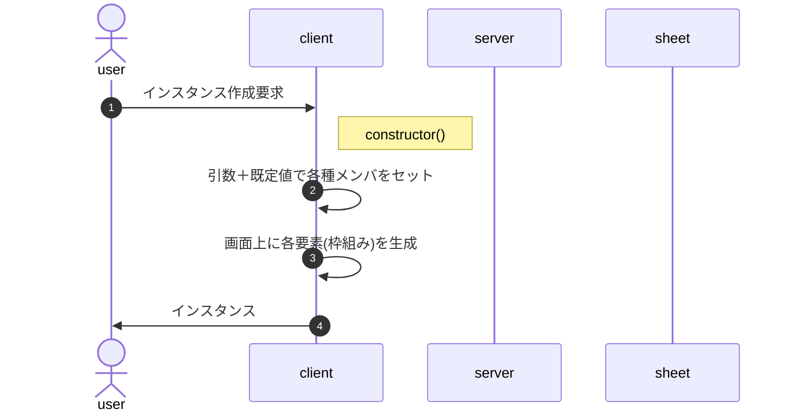
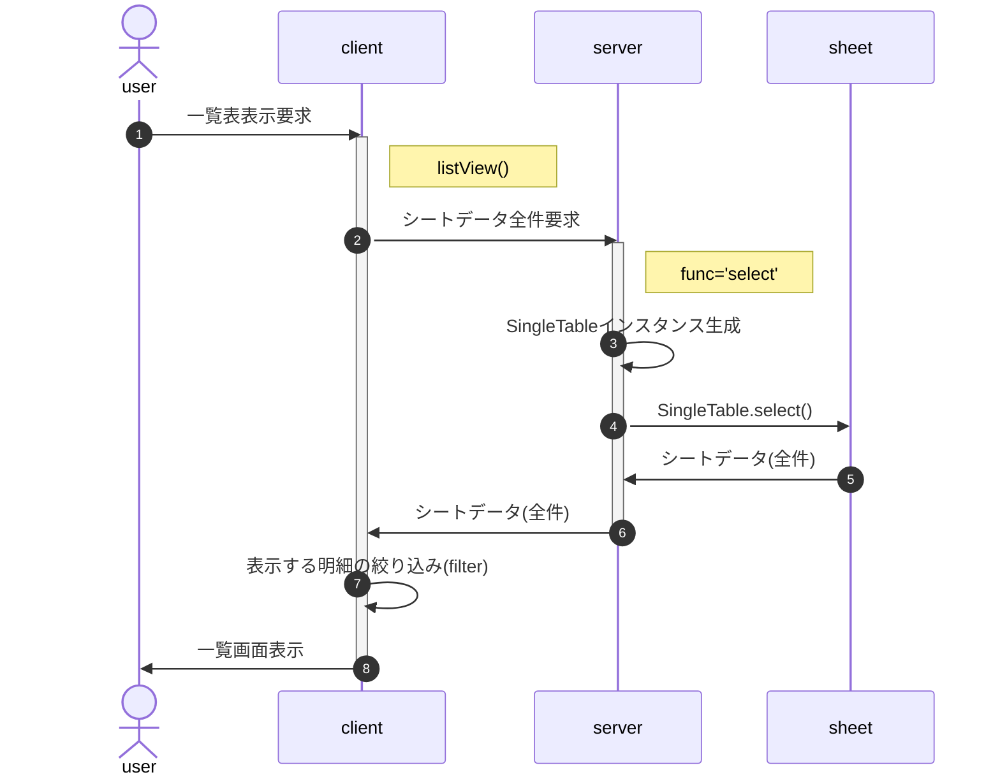
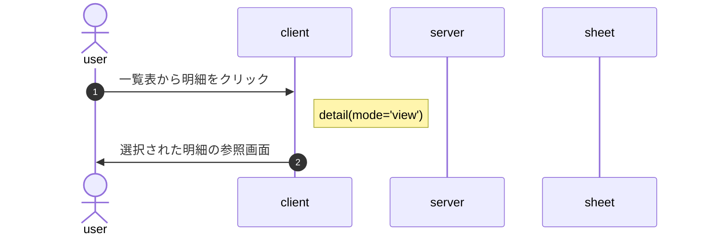
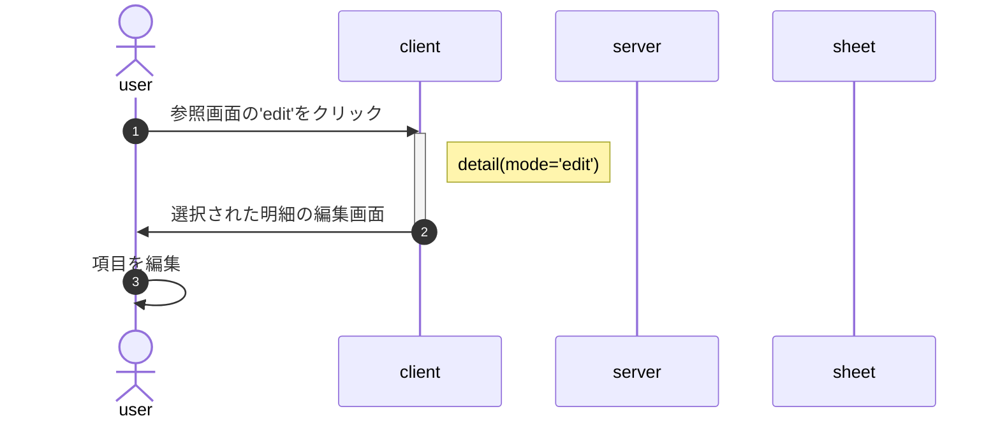
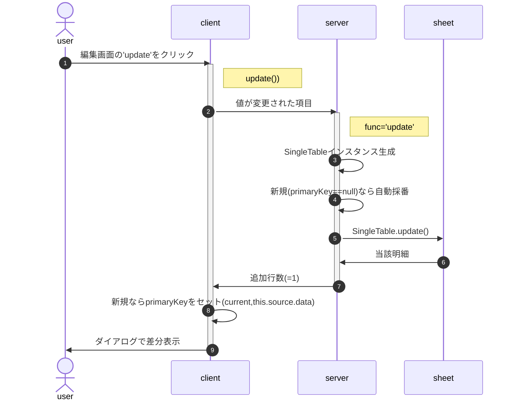
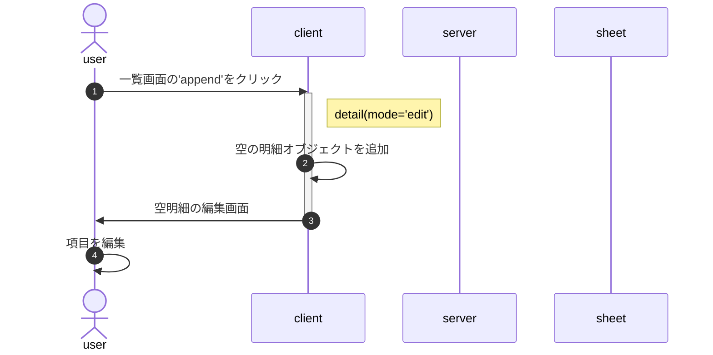
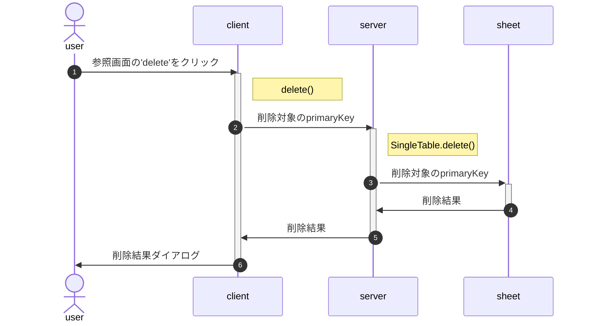

<style>
.triDown { /* 下向き矢印 */
  --bw: 50px;
  width: 0px;
  height: 0px;
  border-top: calc(var(--bw) * 0.7) solid #aaa;
  border-right: var(--bw) solid transparent;
  border-left: var(--bw) solid transparent;
  border-bottom: calc(var(--bw) * 0.2) solid transparent;
}
.title {
  font-size: 2.4rem;
  text-shadow: 2px 2px 5px #888;
}
</style>

<p class="title">class SingleTableClient</p>

Google Spreadの単一シート(テーブル)の内容を、html(SPA)で参照・編集・追加・削除(CRUD)する。

[画面遷移](#画面遷移) | [画面構成](#画面構成) | [動作イメージ](#動作イメージ) | [JSDoc](#SingleTableClient) | [source](#source) | [改版履歴](#history)

# 画面遷移

<svg xmlns="http://www.w3.org/2000/svg" xmlns:xlink="http://www.w3.org/1999/xlink" version="1.1" width="416px" viewBox="-0.5 -0.5 416 311" content="&lt;mxfile host=&quot;app.diagrams.net&quot; modified=&quot;2024-03-02T00:53:33.603Z&quot; agent=&quot;Mozilla/5.0 (Macintosh; Intel Mac OS X 10_15_7) AppleWebKit/537.36 (KHTML, like Gecko) Chrome/122.0.0.0 Safari/537.36&quot; etag=&quot;cnunemI6uOsLkZhS0_zh&quot; version=&quot;22.1.20&quot; type=&quot;google&quot;&gt;&#10;  &lt;diagram name=&quot;ページ1&quot; id=&quot;BmNqtl1x02siel_nC2De&quot;&gt;&#10;    &lt;mxGraphModel dx=&quot;693&quot; dy=&quot;491&quot; grid=&quot;1&quot; gridSize=&quot;10&quot; guides=&quot;1&quot; tooltips=&quot;1&quot; connect=&quot;1&quot; arrows=&quot;1&quot; fold=&quot;1&quot; page=&quot;1&quot; pageScale=&quot;1&quot; pageWidth=&quot;827&quot; pageHeight=&quot;1169&quot; math=&quot;0&quot; shadow=&quot;0&quot;&gt;&#10;      &lt;root&gt;&#10;        &lt;mxCell id=&quot;0&quot; /&gt;&#10;        &lt;mxCell id=&quot;1&quot; parent=&quot;0&quot; /&gt;&#10;        &lt;mxCell id=&quot;0oVSfXQeK1aMUrLuZPPZ-36&quot; value=&quot;detail()&quot; style=&quot;rounded=0;whiteSpace=wrap;html=1;fontSize=16;fillColor=#E6E6E6;strokeColor=none;align=left;verticalAlign=bottom;&quot; vertex=&quot;1&quot; parent=&quot;1&quot;&gt;&#10;          &lt;mxGeometry x=&quot;389&quot; y=&quot;150&quot; width=&quot;142&quot; height=&quot;200&quot; as=&quot;geometry&quot; /&gt;&#10;        &lt;/mxCell&gt;&#10;        &lt;mxCell id=&quot;0oVSfXQeK1aMUrLuZPPZ-34&quot; value=&quot;list()&quot; style=&quot;rounded=0;whiteSpace=wrap;html=1;fontSize=16;fillColor=#E6E6E6;strokeColor=none;align=left;verticalAlign=bottom;&quot; vertex=&quot;1&quot; parent=&quot;1&quot;&gt;&#10;          &lt;mxGeometry x=&quot;148&quot; y=&quot;150&quot; width=&quot;142&quot; height=&quot;200&quot; as=&quot;geometry&quot; /&gt;&#10;        &lt;/mxCell&gt;&#10;        &lt;mxCell id=&quot;0oVSfXQeK1aMUrLuZPPZ-2&quot; value=&quot;&quot; style=&quot;ellipse;whiteSpace=wrap;html=1;aspect=fixed;fontSize=16;&quot; vertex=&quot;1&quot; parent=&quot;1&quot;&gt;&#10;          &lt;mxGeometry x=&quot;170&quot; y=&quot;80&quot; width=&quot;40&quot; height=&quot;40&quot; as=&quot;geometry&quot; /&gt;&#10;        &lt;/mxCell&gt;&#10;        &lt;mxCell id=&quot;0oVSfXQeK1aMUrLuZPPZ-13&quot; style=&quot;edgeStyle=none;curved=1;rounded=0;orthogonalLoop=1;jettySize=auto;html=1;exitX=0.5;exitY=1;exitDx=0;exitDy=0;entryX=0.25;entryY=0;entryDx=0;entryDy=0;fontSize=12;startSize=8;endSize=8;&quot; edge=&quot;1&quot; parent=&quot;1&quot; source=&quot;0oVSfXQeK1aMUrLuZPPZ-1&quot; target=&quot;0oVSfXQeK1aMUrLuZPPZ-3&quot;&gt;&#10;          &lt;mxGeometry relative=&quot;1&quot; as=&quot;geometry&quot;&gt;&#10;            &lt;mxPoint x=&quot;760&quot; y=&quot;76&quot; as=&quot;targetPoint&quot; /&gt;&#10;          &lt;/mxGeometry&gt;&#10;        &lt;/mxCell&gt;&#10;        &lt;mxCell id=&quot;0oVSfXQeK1aMUrLuZPPZ-1&quot; value=&quot;始&quot; style=&quot;text;html=1;strokeColor=none;fillColor=none;align=center;verticalAlign=middle;whiteSpace=wrap;rounded=0;fontSize=16;&quot; vertex=&quot;1&quot; parent=&quot;1&quot;&gt;&#10;          &lt;mxGeometry x=&quot;170&quot; y=&quot;80&quot; width=&quot;40&quot; height=&quot;40&quot; as=&quot;geometry&quot; /&gt;&#10;        &lt;/mxCell&gt;&#10;        &lt;mxCell id=&quot;0oVSfXQeK1aMUrLuZPPZ-8&quot; style=&quot;edgeStyle=none;curved=1;rounded=0;orthogonalLoop=1;jettySize=auto;html=1;exitX=1;exitY=0.75;exitDx=0;exitDy=0;entryX=0;entryY=0.75;entryDx=0;entryDy=0;fontSize=12;startSize=8;endSize=8;&quot; edge=&quot;1&quot; parent=&quot;1&quot; source=&quot;0oVSfXQeK1aMUrLuZPPZ-3&quot; target=&quot;0oVSfXQeK1aMUrLuZPPZ-4&quot;&gt;&#10;          &lt;mxGeometry relative=&quot;1&quot; as=&quot;geometry&quot;&gt;&#10;            &lt;mxPoint x=&quot;280&quot; y=&quot;236&quot; as=&quot;sourcePoint&quot; /&gt;&#10;            &lt;mxPoint x=&quot;400&quot; y=&quot;236&quot; as=&quot;targetPoint&quot; /&gt;&#10;          &lt;/mxGeometry&gt;&#10;        &lt;/mxCell&gt;&#10;        &lt;mxCell id=&quot;0oVSfXQeK1aMUrLuZPPZ-18&quot; style=&quot;edgeStyle=none;curved=1;rounded=0;orthogonalLoop=1;jettySize=auto;html=1;exitX=0.25;exitY=1;exitDx=0;exitDy=0;entryX=0.25;entryY=0;entryDx=0;entryDy=0;fontSize=12;startSize=8;endSize=8;&quot; edge=&quot;1&quot; parent=&quot;1&quot; source=&quot;0oVSfXQeK1aMUrLuZPPZ-3&quot; target=&quot;0oVSfXQeK1aMUrLuZPPZ-5&quot;&gt;&#10;          &lt;mxGeometry relative=&quot;1&quot; as=&quot;geometry&quot; /&gt;&#10;        &lt;/mxCell&gt;&#10;        &lt;mxCell id=&quot;0oVSfXQeK1aMUrLuZPPZ-27&quot; style=&quot;edgeStyle=orthogonalEdgeStyle;rounded=0;orthogonalLoop=1;jettySize=auto;html=1;exitX=0;exitY=0.5;exitDx=0;exitDy=0;fontSize=12;startSize=8;endSize=8;&quot; edge=&quot;1&quot; parent=&quot;1&quot; source=&quot;0oVSfXQeK1aMUrLuZPPZ-3&quot;&gt;&#10;          &lt;mxGeometry relative=&quot;1&quot; as=&quot;geometry&quot;&gt;&#10;            &lt;mxPoint x=&quot;460&quot; y=&quot;320&quot; as=&quot;targetPoint&quot; /&gt;&#10;            &lt;Array as=&quot;points&quot;&gt;&#10;              &lt;mxPoint x=&quot;140&quot; y=&quot;180&quot; /&gt;&#10;              &lt;mxPoint x=&quot;140&quot; y=&quot;360&quot; /&gt;&#10;              &lt;mxPoint x=&quot;460&quot; y=&quot;360&quot; /&gt;&#10;            &lt;/Array&gt;&#10;          &lt;/mxGeometry&gt;&#10;        &lt;/mxCell&gt;&#10;        &lt;mxCell id=&quot;0oVSfXQeK1aMUrLuZPPZ-3&quot; value=&quot;一覧表&quot; style=&quot;rounded=0;whiteSpace=wrap;html=1;fontSize=16;align=center;horizontal=1;verticalAlign=middle;&quot; vertex=&quot;1&quot; parent=&quot;1&quot;&gt;&#10;          &lt;mxGeometry x=&quot;160&quot; y=&quot;160&quot; width=&quot;120&quot; height=&quot;40&quot; as=&quot;geometry&quot; /&gt;&#10;        &lt;/mxCell&gt;&#10;        &lt;mxCell id=&quot;0oVSfXQeK1aMUrLuZPPZ-9&quot; style=&quot;edgeStyle=none;curved=1;rounded=0;orthogonalLoop=1;jettySize=auto;html=1;exitX=0;exitY=0.25;exitDx=0;exitDy=0;entryX=1;entryY=0.25;entryDx=0;entryDy=0;fontSize=12;startSize=8;endSize=8;&quot; edge=&quot;1&quot; parent=&quot;1&quot; source=&quot;0oVSfXQeK1aMUrLuZPPZ-4&quot; target=&quot;0oVSfXQeK1aMUrLuZPPZ-3&quot;&gt;&#10;          &lt;mxGeometry relative=&quot;1&quot; as=&quot;geometry&quot;&gt;&#10;            &lt;mxPoint x=&quot;770&quot; y=&quot;239&quot; as=&quot;sourcePoint&quot; /&gt;&#10;            &lt;mxPoint x=&quot;650&quot; y=&quot;239&quot; as=&quot;targetPoint&quot; /&gt;&#10;          &lt;/mxGeometry&gt;&#10;        &lt;/mxCell&gt;&#10;        &lt;mxCell id=&quot;0oVSfXQeK1aMUrLuZPPZ-11&quot; style=&quot;edgeStyle=orthogonalEdgeStyle;rounded=0;orthogonalLoop=1;jettySize=auto;html=1;exitX=0.25;exitY=0;exitDx=0;exitDy=0;entryX=0.75;entryY=0;entryDx=0;entryDy=0;fontSize=12;startSize=8;endSize=8;&quot; edge=&quot;1&quot; parent=&quot;1&quot; source=&quot;0oVSfXQeK1aMUrLuZPPZ-4&quot; target=&quot;0oVSfXQeK1aMUrLuZPPZ-3&quot;&gt;&#10;          &lt;mxGeometry relative=&quot;1&quot; as=&quot;geometry&quot;&gt;&#10;            &lt;Array as=&quot;points&quot;&gt;&#10;              &lt;mxPoint x=&quot;430&quot; y=&quot;120&quot; /&gt;&#10;              &lt;mxPoint x=&quot;250&quot; y=&quot;120&quot; /&gt;&#10;            &lt;/Array&gt;&#10;          &lt;/mxGeometry&gt;&#10;        &lt;/mxCell&gt;&#10;        &lt;mxCell id=&quot;0oVSfXQeK1aMUrLuZPPZ-14&quot; style=&quot;edgeStyle=none;curved=1;rounded=0;orthogonalLoop=1;jettySize=auto;html=1;exitX=0.25;exitY=1;exitDx=0;exitDy=0;entryX=0.25;entryY=0;entryDx=0;entryDy=0;fontSize=12;startSize=8;endSize=8;&quot; edge=&quot;1&quot; parent=&quot;1&quot; source=&quot;0oVSfXQeK1aMUrLuZPPZ-4&quot; target=&quot;0oVSfXQeK1aMUrLuZPPZ-6&quot;&gt;&#10;          &lt;mxGeometry relative=&quot;1&quot; as=&quot;geometry&quot; /&gt;&#10;        &lt;/mxCell&gt;&#10;        &lt;mxCell id=&quot;0oVSfXQeK1aMUrLuZPPZ-4&quot; value=&quot;詳細(参照)&quot; style=&quot;rounded=0;whiteSpace=wrap;html=1;fontSize=16;align=center;horizontal=1;verticalAlign=middle;&quot; vertex=&quot;1&quot; parent=&quot;1&quot;&gt;&#10;          &lt;mxGeometry x=&quot;400&quot; y=&quot;160&quot; width=&quot;120&quot; height=&quot;40&quot; as=&quot;geometry&quot; /&gt;&#10;        &lt;/mxCell&gt;&#10;        &lt;mxCell id=&quot;0oVSfXQeK1aMUrLuZPPZ-19&quot; style=&quot;edgeStyle=none;curved=1;rounded=0;orthogonalLoop=1;jettySize=auto;html=1;exitX=0.75;exitY=0;exitDx=0;exitDy=0;entryX=0.75;entryY=1;entryDx=0;entryDy=0;fontSize=12;startSize=8;endSize=8;&quot; edge=&quot;1&quot; parent=&quot;1&quot; source=&quot;0oVSfXQeK1aMUrLuZPPZ-5&quot; target=&quot;0oVSfXQeK1aMUrLuZPPZ-3&quot;&gt;&#10;          &lt;mxGeometry relative=&quot;1&quot; as=&quot;geometry&quot; /&gt;&#10;        &lt;/mxCell&gt;&#10;        &lt;mxCell id=&quot;0oVSfXQeK1aMUrLuZPPZ-23&quot; style=&quot;edgeStyle=orthogonalEdgeStyle;rounded=0;orthogonalLoop=1;jettySize=auto;html=1;exitX=1;exitY=0.25;exitDx=0;exitDy=0;entryX=0;entryY=0.75;entryDx=0;entryDy=0;fontSize=12;startSize=8;endSize=8;&quot; edge=&quot;1&quot; parent=&quot;1&quot; source=&quot;0oVSfXQeK1aMUrLuZPPZ-5&quot; target=&quot;0oVSfXQeK1aMUrLuZPPZ-4&quot;&gt;&#10;          &lt;mxGeometry relative=&quot;1&quot; as=&quot;geometry&quot;&gt;&#10;            &lt;Array as=&quot;points&quot;&gt;&#10;              &lt;mxPoint x=&quot;320&quot; y=&quot;290&quot; /&gt;&#10;              &lt;mxPoint x=&quot;320&quot; y=&quot;190&quot; /&gt;&#10;            &lt;/Array&gt;&#10;          &lt;/mxGeometry&gt;&#10;        &lt;/mxCell&gt;&#10;        &lt;mxCell id=&quot;0oVSfXQeK1aMUrLuZPPZ-25&quot; style=&quot;edgeStyle=orthogonalEdgeStyle;rounded=0;orthogonalLoop=1;jettySize=auto;html=1;exitX=0.5;exitY=1;exitDx=0;exitDy=0;entryX=0.5;entryY=1;entryDx=0;entryDy=0;fontSize=12;startSize=8;endSize=8;&quot; edge=&quot;1&quot; parent=&quot;1&quot; source=&quot;0oVSfXQeK1aMUrLuZPPZ-34&quot; target=&quot;0oVSfXQeK1aMUrLuZPPZ-6&quot;&gt;&#10;          &lt;mxGeometry relative=&quot;1&quot; as=&quot;geometry&quot;&gt;&#10;            &lt;Array as=&quot;points&quot;&gt;&#10;              &lt;mxPoint x=&quot;220&quot; y=&quot;360&quot; /&gt;&#10;              &lt;mxPoint x=&quot;460&quot; y=&quot;360&quot; /&gt;&#10;            &lt;/Array&gt;&#10;          &lt;/mxGeometry&gt;&#10;        &lt;/mxCell&gt;&#10;        &lt;mxCell id=&quot;0oVSfXQeK1aMUrLuZPPZ-5&quot; value=&quot;検索結果一覧&quot; style=&quot;rounded=0;whiteSpace=wrap;html=1;fontSize=16;align=center;horizontal=1;verticalAlign=middle;&quot; vertex=&quot;1&quot; parent=&quot;1&quot;&gt;&#10;          &lt;mxGeometry x=&quot;160&quot; y=&quot;280&quot; width=&quot;120&quot; height=&quot;40&quot; as=&quot;geometry&quot; /&gt;&#10;        &lt;/mxCell&gt;&#10;        &lt;mxCell id=&quot;0oVSfXQeK1aMUrLuZPPZ-15&quot; style=&quot;edgeStyle=none;curved=1;rounded=0;orthogonalLoop=1;jettySize=auto;html=1;exitX=0.75;exitY=0;exitDx=0;exitDy=0;entryX=0.75;entryY=1;entryDx=0;entryDy=0;fontSize=12;startSize=8;endSize=8;&quot; edge=&quot;1&quot; parent=&quot;1&quot; source=&quot;0oVSfXQeK1aMUrLuZPPZ-6&quot; target=&quot;0oVSfXQeK1aMUrLuZPPZ-4&quot;&gt;&#10;          &lt;mxGeometry relative=&quot;1&quot; as=&quot;geometry&quot; /&gt;&#10;        &lt;/mxCell&gt;&#10;        &lt;mxCell id=&quot;0oVSfXQeK1aMUrLuZPPZ-30&quot; style=&quot;edgeStyle=orthogonalEdgeStyle;rounded=0;orthogonalLoop=1;jettySize=auto;html=1;exitX=0;exitY=0.5;exitDx=0;exitDy=0;entryX=1;entryY=0.25;entryDx=0;entryDy=0;fontSize=12;startSize=8;endSize=8;jumpStyle=arc;&quot; edge=&quot;1&quot; parent=&quot;1&quot; source=&quot;0oVSfXQeK1aMUrLuZPPZ-6&quot; target=&quot;0oVSfXQeK1aMUrLuZPPZ-3&quot;&gt;&#10;          &lt;mxGeometry relative=&quot;1&quot; as=&quot;geometry&quot;&gt;&#10;            &lt;Array as=&quot;points&quot;&gt;&#10;              &lt;mxPoint x=&quot;360&quot; y=&quot;300&quot; /&gt;&#10;              &lt;mxPoint x=&quot;360&quot; y=&quot;170&quot; /&gt;&#10;            &lt;/Array&gt;&#10;          &lt;/mxGeometry&gt;&#10;        &lt;/mxCell&gt;&#10;        &lt;mxCell id=&quot;0oVSfXQeK1aMUrLuZPPZ-6&quot; value=&quot;詳細(編集)&quot; style=&quot;rounded=0;whiteSpace=wrap;html=1;fontSize=16;align=center;horizontal=1;verticalAlign=middle;&quot; vertex=&quot;1&quot; parent=&quot;1&quot;&gt;&#10;          &lt;mxGeometry x=&quot;400&quot; y=&quot;280&quot; width=&quot;120&quot; height=&quot;40&quot; as=&quot;geometry&quot; /&gt;&#10;        &lt;/mxCell&gt;&#10;        &lt;mxCell id=&quot;0oVSfXQeK1aMUrLuZPPZ-7&quot; value=&quot;明細&quot; style=&quot;text;html=1;strokeColor=none;fillColor=none;align=center;verticalAlign=middle;whiteSpace=wrap;rounded=0;fontSize=16;&quot; vertex=&quot;1&quot; parent=&quot;1&quot;&gt;&#10;          &lt;mxGeometry x=&quot;268&quot; y=&quot;187&quot; width=&quot;60&quot; height=&quot;30&quot; as=&quot;geometry&quot; /&gt;&#10;        &lt;/mxCell&gt;&#10;        &lt;mxCell id=&quot;0oVSfXQeK1aMUrLuZPPZ-10&quot; value=&quot;list&quot; style=&quot;text;html=1;strokeColor=none;fillColor=none;align=center;verticalAlign=middle;whiteSpace=wrap;rounded=0;fontSize=16;&quot; vertex=&quot;1&quot; parent=&quot;1&quot;&gt;&#10;          &lt;mxGeometry x=&quot;351&quot; y=&quot;145&quot; width=&quot;60&quot; height=&quot;30&quot; as=&quot;geometry&quot; /&gt;&#10;        &lt;/mxCell&gt;&#10;        &lt;mxCell id=&quot;0oVSfXQeK1aMUrLuZPPZ-12&quot; value=&quot;delete&quot; style=&quot;text;html=1;strokeColor=none;fillColor=none;align=center;verticalAlign=middle;whiteSpace=wrap;rounded=0;fontSize=16;&quot; vertex=&quot;1&quot; parent=&quot;1&quot;&gt;&#10;          &lt;mxGeometry x=&quot;310&quot; y=&quot;96&quot; width=&quot;60&quot; height=&quot;30&quot; as=&quot;geometry&quot; /&gt;&#10;        &lt;/mxCell&gt;&#10;        &lt;mxCell id=&quot;0oVSfXQeK1aMUrLuZPPZ-16&quot; value=&quot;edit&quot; style=&quot;text;html=1;strokeColor=none;fillColor=none;align=center;verticalAlign=middle;whiteSpace=wrap;rounded=0;fontSize=16;rotation=-90;&quot; vertex=&quot;1&quot; parent=&quot;1&quot;&gt;&#10;          &lt;mxGeometry x=&quot;388&quot; y=&quot;210&quot; width=&quot;60&quot; height=&quot;30&quot; as=&quot;geometry&quot; /&gt;&#10;        &lt;/mxCell&gt;&#10;        &lt;mxCell id=&quot;0oVSfXQeK1aMUrLuZPPZ-17&quot; value=&quot;view&quot; style=&quot;text;html=1;strokeColor=none;fillColor=none;align=center;verticalAlign=middle;whiteSpace=wrap;rounded=0;fontSize=16;rotation=-90;&quot; vertex=&quot;1&quot; parent=&quot;1&quot;&gt;&#10;          &lt;mxGeometry x=&quot;470&quot; y=&quot;236&quot; width=&quot;60&quot; height=&quot;30&quot; as=&quot;geometry&quot; /&gt;&#10;        &lt;/mxCell&gt;&#10;        &lt;mxCell id=&quot;0oVSfXQeK1aMUrLuZPPZ-21&quot; value=&quot;clear&quot; style=&quot;text;html=1;strokeColor=none;fillColor=none;align=center;verticalAlign=middle;whiteSpace=wrap;rounded=0;fontSize=16;rotation=-90;&quot; vertex=&quot;1&quot; parent=&quot;1&quot;&gt;&#10;          &lt;mxGeometry x=&quot;230&quot; y=&quot;240&quot; width=&quot;60&quot; height=&quot;30&quot; as=&quot;geometry&quot; /&gt;&#10;        &lt;/mxCell&gt;&#10;        &lt;mxCell id=&quot;0oVSfXQeK1aMUrLuZPPZ-22&quot; value=&quot;search&quot; style=&quot;text;html=1;strokeColor=none;fillColor=none;align=center;verticalAlign=middle;whiteSpace=wrap;rounded=0;fontSize=16;rotation=-90;&quot; vertex=&quot;1&quot; parent=&quot;1&quot;&gt;&#10;          &lt;mxGeometry x=&quot;148&quot; y=&quot;216&quot; width=&quot;60&quot; height=&quot;30&quot; as=&quot;geometry&quot; /&gt;&#10;        &lt;/mxCell&gt;&#10;        &lt;mxCell id=&quot;0oVSfXQeK1aMUrLuZPPZ-24&quot; value=&quot;明細&quot; style=&quot;text;html=1;strokeColor=none;fillColor=none;align=center;verticalAlign=middle;whiteSpace=wrap;rounded=0;fontSize=16;&quot; vertex=&quot;1&quot; parent=&quot;1&quot;&gt;&#10;          &lt;mxGeometry x=&quot;268&quot; y=&quot;266&quot; width=&quot;60&quot; height=&quot;30&quot; as=&quot;geometry&quot; /&gt;&#10;        &lt;/mxCell&gt;&#10;        &lt;mxCell id=&quot;0oVSfXQeK1aMUrLuZPPZ-26&quot; value=&quot;append&quot; style=&quot;text;html=1;strokeColor=none;fillColor=none;align=center;verticalAlign=middle;whiteSpace=wrap;rounded=0;fontSize=16;&quot; vertex=&quot;1&quot; parent=&quot;1&quot;&gt;&#10;          &lt;mxGeometry x=&quot;310&quot; y=&quot;360&quot; width=&quot;60&quot; height=&quot;30&quot; as=&quot;geometry&quot; /&gt;&#10;        &lt;/mxCell&gt;&#10;        &lt;mxCell id=&quot;0oVSfXQeK1aMUrLuZPPZ-29&quot; value=&quot;append&quot; style=&quot;text;html=1;strokeColor=none;fillColor=none;align=center;verticalAlign=middle;whiteSpace=wrap;rounded=0;fontSize=16;rotation=-90;&quot; vertex=&quot;1&quot; parent=&quot;1&quot;&gt;&#10;          &lt;mxGeometry x=&quot;100&quot; y=&quot;190&quot; width=&quot;60&quot; height=&quot;30&quot; as=&quot;geometry&quot; /&gt;&#10;        &lt;/mxCell&gt;&#10;        &lt;mxCell id=&quot;0oVSfXQeK1aMUrLuZPPZ-31&quot; value=&quot;list&quot; style=&quot;text;html=1;strokeColor=none;fillColor=none;align=center;verticalAlign=middle;whiteSpace=wrap;rounded=0;fontSize=16;&quot; vertex=&quot;1&quot; parent=&quot;1&quot;&gt;&#10;          &lt;mxGeometry x=&quot;351&quot; y=&quot;275&quot; width=&quot;60&quot; height=&quot;30&quot; as=&quot;geometry&quot; /&gt;&#10;        &lt;/mxCell&gt;&#10;        &lt;mxCell id=&quot;0oVSfXQeK1aMUrLuZPPZ-32&quot; style=&quot;edgeStyle=none;curved=1;rounded=0;orthogonalLoop=1;jettySize=auto;html=1;exitX=0.5;exitY=0;exitDx=0;exitDy=0;entryX=0.5;entryY=1;entryDx=0;entryDy=0;fontSize=12;startSize=8;endSize=8;&quot; edge=&quot;1&quot; parent=&quot;1&quot; source=&quot;0oVSfXQeK1aMUrLuZPPZ-6&quot; target=&quot;0oVSfXQeK1aMUrLuZPPZ-4&quot;&gt;&#10;          &lt;mxGeometry relative=&quot;1&quot; as=&quot;geometry&quot;&gt;&#10;            &lt;mxPoint x=&quot;570&quot; y=&quot;275&quot; as=&quot;sourcePoint&quot; /&gt;&#10;            &lt;mxPoint x=&quot;570&quot; y=&quot;195&quot; as=&quot;targetPoint&quot; /&gt;&#10;          &lt;/mxGeometry&gt;&#10;        &lt;/mxCell&gt;&#10;        &lt;mxCell id=&quot;0oVSfXQeK1aMUrLuZPPZ-33&quot; value=&quot;update&quot; style=&quot;text;html=1;strokeColor=none;fillColor=none;align=center;verticalAlign=middle;whiteSpace=wrap;rounded=0;fontSize=16;rotation=-90;&quot; vertex=&quot;1&quot; parent=&quot;1&quot;&gt;&#10;          &lt;mxGeometry x=&quot;438&quot; y=&quot;235&quot; width=&quot;60&quot; height=&quot;30&quot; as=&quot;geometry&quot; /&gt;&#10;        &lt;/mxCell&gt;&#10;        &lt;mxCell id=&quot;0oVSfXQeK1aMUrLuZPPZ-35&quot; value=&quot;&quot; style=&quot;edgeStyle=orthogonalEdgeStyle;rounded=0;orthogonalLoop=1;jettySize=auto;html=1;exitX=0.5;exitY=1;exitDx=0;exitDy=0;entryX=0.5;entryY=1;entryDx=0;entryDy=0;fontSize=12;startSize=8;endSize=8;&quot; edge=&quot;1&quot; parent=&quot;1&quot; source=&quot;0oVSfXQeK1aMUrLuZPPZ-5&quot; target=&quot;0oVSfXQeK1aMUrLuZPPZ-34&quot;&gt;&#10;          &lt;mxGeometry relative=&quot;1&quot; as=&quot;geometry&quot;&gt;&#10;            &lt;mxPoint x=&quot;220&quot; y=&quot;320&quot; as=&quot;sourcePoint&quot; /&gt;&#10;            &lt;mxPoint x=&quot;460&quot; y=&quot;320&quot; as=&quot;targetPoint&quot; /&gt;&#10;            &lt;Array as=&quot;points&quot; /&gt;&#10;          &lt;/mxGeometry&gt;&#10;        &lt;/mxCell&gt;&#10;      &lt;/root&gt;&#10;    &lt;/mxGraphModel&gt;&#10;  &lt;/diagram&gt;&#10;&lt;/mxfile&gt;&#10;" onclick="(function(svg){var src=window.event.target||window.event.srcElement;while (src!=null&amp;&amp;src.nodeName.toLowerCase()!='a'){src=src.parentNode;}if(src==null){if(svg.wnd!=null&amp;&amp;!svg.wnd.closed){svg.wnd.focus();}else{var r=function(evt){if(evt.data=='ready'&amp;&amp;evt.source==svg.wnd){svg.wnd.postMessage(decodeURIComponent(svg.getAttribute('content')),'*');window.removeEventListener('message',r);}};window.addEventListener('message',r);svg.wnd=window.open('https://viewer.diagrams.net/?client=1&amp;page=0&amp;edit=_blank');}}})(this);" style="cursor:pointer;max-width:100%;max-height:311px;"><defs/><g><rect x="274" y="70" width="142" height="200" fill="#e6e6e6" stroke="none" pointer-events="all"/><g transform="translate(-0.5 -0.5)"><switch><foreignObject pointer-events="none" width="100%" height="100%" requiredFeatures="http://www.w3.org/TR/SVG11/feature#Extensibility" style="overflow: visible; text-align: left;"><div xmlns="http://www.w3.org/1999/xhtml" style="display: flex; align-items: unsafe flex-end; justify-content: unsafe flex-start; width: 140px; height: 1px; padding-top: 267px; margin-left: 276px;"><div data-drawio-colors="color: rgb(0, 0, 0); " style="box-sizing: border-box; font-size: 0px; text-align: left;"><div style="display: inline-block; font-size: 16px; font-family: Helvetica; color: rgb(0, 0, 0); line-height: 1.2; pointer-events: all; white-space: normal; overflow-wrap: normal;">detail()</div></div></div></foreignObject><text x="276" y="267" fill="rgb(0, 0, 0)" font-family="Helvetica" font-size="16px">detail()</text></switch></g><rect x="33" y="70" width="142" height="200" fill="#e6e6e6" stroke="none" pointer-events="all"/><g transform="translate(-0.5 -0.5)"><switch><foreignObject pointer-events="none" width="100%" height="100%" requiredFeatures="http://www.w3.org/TR/SVG11/feature#Extensibility" style="overflow: visible; text-align: left;"><div xmlns="http://www.w3.org/1999/xhtml" style="display: flex; align-items: unsafe flex-end; justify-content: unsafe flex-start; width: 140px; height: 1px; padding-top: 267px; margin-left: 35px;"><div data-drawio-colors="color: rgb(0, 0, 0); " style="box-sizing: border-box; font-size: 0px; text-align: left;"><div style="display: inline-block; font-size: 16px; font-family: Helvetica; color: rgb(0, 0, 0); line-height: 1.2; pointer-events: all; white-space: normal; overflow-wrap: normal;">list()</div></div></div></foreignObject><text x="35" y="267" fill="rgb(0, 0, 0)" font-family="Helvetica" font-size="16px">list()</text></switch></g><ellipse cx="75" cy="20" rx="20" ry="20" fill="rgb(255, 255, 255)" stroke="rgb(0, 0, 0)" pointer-events="all"/><path d="M 75 40 Q 75 40 75 72.13" fill="none" stroke="rgb(0, 0, 0)" stroke-miterlimit="10" pointer-events="stroke"/><path d="M 75 78.88 L 70.5 69.88 L 75 72.13 L 79.5 69.88 Z" fill="rgb(0, 0, 0)" stroke="rgb(0, 0, 0)" stroke-miterlimit="10" pointer-events="all"/><rect x="55" y="0" width="40" height="40" fill="none" stroke="none" pointer-events="all"/><g transform="translate(-0.5 -0.5)"><switch><foreignObject pointer-events="none" width="100%" height="100%" requiredFeatures="http://www.w3.org/TR/SVG11/feature#Extensibility" style="overflow: visible; text-align: left;"><div xmlns="http://www.w3.org/1999/xhtml" style="display: flex; align-items: unsafe center; justify-content: unsafe center; width: 38px; height: 1px; padding-top: 20px; margin-left: 56px;"><div data-drawio-colors="color: rgb(0, 0, 0); " style="box-sizing: border-box; font-size: 0px; text-align: center;"><div style="display: inline-block; font-size: 16px; font-family: Helvetica; color: rgb(0, 0, 0); line-height: 1.2; pointer-events: all; white-space: normal; overflow-wrap: normal;">始</div></div></div></foreignObject><text x="75" y="25" fill="rgb(0, 0, 0)" font-family="Helvetica" font-size="16px" text-anchor="middle">始</text></switch></g><path d="M 165 110 Q 165 110 277.13 110" fill="none" stroke="rgb(0, 0, 0)" stroke-miterlimit="10" pointer-events="stroke"/><path d="M 283.88 110 L 274.88 114.5 L 277.13 110 L 274.88 105.5 Z" fill="rgb(0, 0, 0)" stroke="rgb(0, 0, 0)" stroke-miterlimit="10" pointer-events="all"/><path d="M 75 120 Q 75 120 75 192.13" fill="none" stroke="rgb(0, 0, 0)" stroke-miterlimit="10" pointer-events="stroke"/><path d="M 75 198.88 L 70.5 189.88 L 75 192.13 L 79.5 189.88 Z" fill="rgb(0, 0, 0)" stroke="rgb(0, 0, 0)" stroke-miterlimit="10" pointer-events="all"/><path d="M 45 100 L 25 100 L 25 280 L 345 280 L 345 247.87" fill="none" stroke="rgb(0, 0, 0)" stroke-miterlimit="10" pointer-events="stroke"/><path d="M 345 241.12 L 349.5 250.12 L 345 247.87 L 340.5 250.12 Z" fill="rgb(0, 0, 0)" stroke="rgb(0, 0, 0)" stroke-miterlimit="10" pointer-events="all"/><rect x="45" y="80" width="120" height="40" fill="rgb(255, 255, 255)" stroke="rgb(0, 0, 0)" pointer-events="all"/><g transform="translate(-0.5 -0.5)"><switch><foreignObject pointer-events="none" width="100%" height="100%" requiredFeatures="http://www.w3.org/TR/SVG11/feature#Extensibility" style="overflow: visible; text-align: left;"><div xmlns="http://www.w3.org/1999/xhtml" style="display: flex; align-items: unsafe center; justify-content: unsafe center; width: 118px; height: 1px; padding-top: 100px; margin-left: 46px;"><div data-drawio-colors="color: rgb(0, 0, 0); " style="box-sizing: border-box; font-size: 0px; text-align: center;"><div style="display: inline-block; font-size: 16px; font-family: Helvetica; color: rgb(0, 0, 0); line-height: 1.2; pointer-events: all; white-space: normal; overflow-wrap: normal;">一覧表</div></div></div></foreignObject><text x="105" y="105" fill="rgb(0, 0, 0)" font-family="Helvetica" font-size="16px" text-anchor="middle">一覧表</text></switch></g><path d="M 285 90 Q 285 90 172.87 90" fill="none" stroke="rgb(0, 0, 0)" stroke-miterlimit="10" pointer-events="stroke"/><path d="M 166.12 90 L 175.12 85.5 L 172.87 90 L 175.12 94.5 Z" fill="rgb(0, 0, 0)" stroke="rgb(0, 0, 0)" stroke-miterlimit="10" pointer-events="all"/><path d="M 315 80 L 315 40 L 135 40 L 135 72.13" fill="none" stroke="rgb(0, 0, 0)" stroke-miterlimit="10" pointer-events="stroke"/><path d="M 135 78.88 L 130.5 69.88 L 135 72.13 L 139.5 69.88 Z" fill="rgb(0, 0, 0)" stroke="rgb(0, 0, 0)" stroke-miterlimit="10" pointer-events="all"/><path d="M 315 120 Q 315 120 315 192.13" fill="none" stroke="rgb(0, 0, 0)" stroke-miterlimit="10" pointer-events="stroke"/><path d="M 315 198.88 L 310.5 189.88 L 315 192.13 L 319.5 189.88 Z" fill="rgb(0, 0, 0)" stroke="rgb(0, 0, 0)" stroke-miterlimit="10" pointer-events="all"/><rect x="285" y="80" width="120" height="40" fill="rgb(255, 255, 255)" stroke="rgb(0, 0, 0)" pointer-events="all"/><g transform="translate(-0.5 -0.5)"><switch><foreignObject pointer-events="none" width="100%" height="100%" requiredFeatures="http://www.w3.org/TR/SVG11/feature#Extensibility" style="overflow: visible; text-align: left;"><div xmlns="http://www.w3.org/1999/xhtml" style="display: flex; align-items: unsafe center; justify-content: unsafe center; width: 118px; height: 1px; padding-top: 100px; margin-left: 286px;"><div data-drawio-colors="color: rgb(0, 0, 0); " style="box-sizing: border-box; font-size: 0px; text-align: center;"><div style="display: inline-block; font-size: 16px; font-family: Helvetica; color: rgb(0, 0, 0); line-height: 1.2; pointer-events: all; white-space: normal; overflow-wrap: normal;">詳細(参照)</div></div></div></foreignObject><text x="345" y="105" fill="rgb(0, 0, 0)" font-family="Helvetica" font-size="16px" text-anchor="middle">詳細(参照)</text></switch></g><path d="M 135 200 Q 135 200 135 127.87" fill="none" stroke="rgb(0, 0, 0)" stroke-miterlimit="10" pointer-events="stroke"/><path d="M 135 121.12 L 139.5 130.12 L 135 127.87 L 130.5 130.12 Z" fill="rgb(0, 0, 0)" stroke="rgb(0, 0, 0)" stroke-miterlimit="10" pointer-events="all"/><path d="M 165 210 L 205 210 L 205 110 L 277.13 110" fill="none" stroke="rgb(0, 0, 0)" stroke-miterlimit="10" pointer-events="stroke"/><path d="M 283.88 110 L 274.88 114.5 L 277.13 110 L 274.88 105.5 Z" fill="rgb(0, 0, 0)" stroke="rgb(0, 0, 0)" stroke-miterlimit="10" pointer-events="all"/><path d="M 104 270 L 105 270 L 105 280 L 345 280 L 345 247.87" fill="none" stroke="rgb(0, 0, 0)" stroke-miterlimit="10" pointer-events="stroke"/><path d="M 345 241.12 L 349.5 250.12 L 345 247.87 L 340.5 250.12 Z" fill="rgb(0, 0, 0)" stroke="rgb(0, 0, 0)" stroke-miterlimit="10" pointer-events="all"/><rect x="45" y="200" width="120" height="40" fill="rgb(255, 255, 255)" stroke="rgb(0, 0, 0)" pointer-events="all"/><g transform="translate(-0.5 -0.5)"><switch><foreignObject pointer-events="none" width="100%" height="100%" requiredFeatures="http://www.w3.org/TR/SVG11/feature#Extensibility" style="overflow: visible; text-align: left;"><div xmlns="http://www.w3.org/1999/xhtml" style="display: flex; align-items: unsafe center; justify-content: unsafe center; width: 118px; height: 1px; padding-top: 220px; margin-left: 46px;"><div data-drawio-colors="color: rgb(0, 0, 0); " style="box-sizing: border-box; font-size: 0px; text-align: center;"><div style="display: inline-block; font-size: 16px; font-family: Helvetica; color: rgb(0, 0, 0); line-height: 1.2; pointer-events: all; white-space: normal; overflow-wrap: normal;">検索結果一覧</div></div></div></foreignObject><text x="105" y="225" fill="rgb(0, 0, 0)" font-family="Helvetica" font-size="16px" text-anchor="middle">検索結果一覧</text></switch></g><path d="M 375 200 Q 375 200 375 127.87" fill="none" stroke="rgb(0, 0, 0)" stroke-miterlimit="10" pointer-events="stroke"/><path d="M 375 121.12 L 379.5 130.12 L 375 127.87 L 370.5 130.12 Z" fill="rgb(0, 0, 0)" stroke="rgb(0, 0, 0)" stroke-miterlimit="10" pointer-events="all"/><path d="M 285 220 L 245 220 L 245 113 C 248.9 113 248.9 107 245 107 L 245 107 L 245 90 L 172.87 90" fill="none" stroke="rgb(0, 0, 0)" stroke-miterlimit="10" pointer-events="stroke"/><path d="M 166.12 90 L 175.12 85.5 L 172.87 90 L 175.12 94.5 Z" fill="rgb(0, 0, 0)" stroke="rgb(0, 0, 0)" stroke-miterlimit="10" pointer-events="all"/><rect x="285" y="200" width="120" height="40" fill="rgb(255, 255, 255)" stroke="rgb(0, 0, 0)" pointer-events="all"/><g transform="translate(-0.5 -0.5)"><switch><foreignObject pointer-events="none" width="100%" height="100%" requiredFeatures="http://www.w3.org/TR/SVG11/feature#Extensibility" style="overflow: visible; text-align: left;"><div xmlns="http://www.w3.org/1999/xhtml" style="display: flex; align-items: unsafe center; justify-content: unsafe center; width: 118px; height: 1px; padding-top: 220px; margin-left: 286px;"><div data-drawio-colors="color: rgb(0, 0, 0); " style="box-sizing: border-box; font-size: 0px; text-align: center;"><div style="display: inline-block; font-size: 16px; font-family: Helvetica; color: rgb(0, 0, 0); line-height: 1.2; pointer-events: all; white-space: normal; overflow-wrap: normal;">詳細(編集)</div></div></div></foreignObject><text x="345" y="225" fill="rgb(0, 0, 0)" font-family="Helvetica" font-size="16px" text-anchor="middle">詳細(編集)</text></switch></g><rect x="153" y="107" width="60" height="30" fill="none" stroke="none" pointer-events="all"/><g transform="translate(-0.5 -0.5)"><switch><foreignObject pointer-events="none" width="100%" height="100%" requiredFeatures="http://www.w3.org/TR/SVG11/feature#Extensibility" style="overflow: visible; text-align: left;"><div xmlns="http://www.w3.org/1999/xhtml" style="display: flex; align-items: unsafe center; justify-content: unsafe center; width: 58px; height: 1px; padding-top: 122px; margin-left: 154px;"><div data-drawio-colors="color: rgb(0, 0, 0); " style="box-sizing: border-box; font-size: 0px; text-align: center;"><div style="display: inline-block; font-size: 16px; font-family: Helvetica; color: rgb(0, 0, 0); line-height: 1.2; pointer-events: all; white-space: normal; overflow-wrap: normal;">明細</div></div></div></foreignObject><text x="183" y="127" fill="rgb(0, 0, 0)" font-family="Helvetica" font-size="16px" text-anchor="middle">明細</text></switch></g><rect x="236" y="65" width="60" height="30" fill="none" stroke="none" pointer-events="all"/><g transform="translate(-0.5 -0.5)"><switch><foreignObject pointer-events="none" width="100%" height="100%" requiredFeatures="http://www.w3.org/TR/SVG11/feature#Extensibility" style="overflow: visible; text-align: left;"><div xmlns="http://www.w3.org/1999/xhtml" style="display: flex; align-items: unsafe center; justify-content: unsafe center; width: 58px; height: 1px; padding-top: 80px; margin-left: 237px;"><div data-drawio-colors="color: rgb(0, 0, 0); " style="box-sizing: border-box; font-size: 0px; text-align: center;"><div style="display: inline-block; font-size: 16px; font-family: Helvetica; color: rgb(0, 0, 0); line-height: 1.2; pointer-events: all; white-space: normal; overflow-wrap: normal;">list</div></div></div></foreignObject><text x="266" y="85" fill="rgb(0, 0, 0)" font-family="Helvetica" font-size="16px" text-anchor="middle">list</text></switch></g><rect x="195" y="16" width="60" height="30" fill="none" stroke="none" pointer-events="all"/><g transform="translate(-0.5 -0.5)"><switch><foreignObject pointer-events="none" width="100%" height="100%" requiredFeatures="http://www.w3.org/TR/SVG11/feature#Extensibility" style="overflow: visible; text-align: left;"><div xmlns="http://www.w3.org/1999/xhtml" style="display: flex; align-items: unsafe center; justify-content: unsafe center; width: 58px; height: 1px; padding-top: 31px; margin-left: 196px;"><div data-drawio-colors="color: rgb(0, 0, 0); " style="box-sizing: border-box; font-size: 0px; text-align: center;"><div style="display: inline-block; font-size: 16px; font-family: Helvetica; color: rgb(0, 0, 0); line-height: 1.2; pointer-events: all; white-space: normal; overflow-wrap: normal;">delete</div></div></div></foreignObject><text x="225" y="36" fill="rgb(0, 0, 0)" font-family="Helvetica" font-size="16px" text-anchor="middle">delete</text></switch></g><rect x="273" y="130" width="60" height="30" fill="none" stroke="none" transform="rotate(-90,303,145)" pointer-events="all"/><g transform="translate(-0.5 -0.5)rotate(-90 303 145)"><switch><foreignObject pointer-events="none" width="100%" height="100%" requiredFeatures="http://www.w3.org/TR/SVG11/feature#Extensibility" style="overflow: visible; text-align: left;"><div xmlns="http://www.w3.org/1999/xhtml" style="display: flex; align-items: unsafe center; justify-content: unsafe center; width: 58px; height: 1px; padding-top: 145px; margin-left: 274px;"><div data-drawio-colors="color: rgb(0, 0, 0); " style="box-sizing: border-box; font-size: 0px; text-align: center;"><div style="display: inline-block; font-size: 16px; font-family: Helvetica; color: rgb(0, 0, 0); line-height: 1.2; pointer-events: all; white-space: normal; overflow-wrap: normal;">edit</div></div></div></foreignObject><text x="303" y="150" fill="rgb(0, 0, 0)" font-family="Helvetica" font-size="16px" text-anchor="middle">edit</text></switch></g><rect x="355" y="156" width="60" height="30" fill="none" stroke="none" transform="rotate(-90,385,171)" pointer-events="all"/><g transform="translate(-0.5 -0.5)rotate(-90 385 171)"><switch><foreignObject pointer-events="none" width="100%" height="100%" requiredFeatures="http://www.w3.org/TR/SVG11/feature#Extensibility" style="overflow: visible; text-align: left;"><div xmlns="http://www.w3.org/1999/xhtml" style="display: flex; align-items: unsafe center; justify-content: unsafe center; width: 58px; height: 1px; padding-top: 171px; margin-left: 356px;"><div data-drawio-colors="color: rgb(0, 0, 0); " style="box-sizing: border-box; font-size: 0px; text-align: center;"><div style="display: inline-block; font-size: 16px; font-family: Helvetica; color: rgb(0, 0, 0); line-height: 1.2; pointer-events: all; white-space: normal; overflow-wrap: normal;">view</div></div></div></foreignObject><text x="385" y="176" fill="rgb(0, 0, 0)" font-family="Helvetica" font-size="16px" text-anchor="middle">view</text></switch></g><rect x="115" y="160" width="60" height="30" fill="none" stroke="none" transform="rotate(-90,145,175)" pointer-events="all"/><g transform="translate(-0.5 -0.5)rotate(-90 145 175)"><switch><foreignObject pointer-events="none" width="100%" height="100%" requiredFeatures="http://www.w3.org/TR/SVG11/feature#Extensibility" style="overflow: visible; text-align: left;"><div xmlns="http://www.w3.org/1999/xhtml" style="display: flex; align-items: unsafe center; justify-content: unsafe center; width: 58px; height: 1px; padding-top: 175px; margin-left: 116px;"><div data-drawio-colors="color: rgb(0, 0, 0); " style="box-sizing: border-box; font-size: 0px; text-align: center;"><div style="display: inline-block; font-size: 16px; font-family: Helvetica; color: rgb(0, 0, 0); line-height: 1.2; pointer-events: all; white-space: normal; overflow-wrap: normal;">clear</div></div></div></foreignObject><text x="145" y="180" fill="rgb(0, 0, 0)" font-family="Helvetica" font-size="16px" text-anchor="middle">clear</text></switch></g><rect x="33" y="136" width="60" height="30" fill="none" stroke="none" transform="rotate(-90,63,151)" pointer-events="all"/><g transform="translate(-0.5 -0.5)rotate(-90 63 151)"><switch><foreignObject pointer-events="none" width="100%" height="100%" requiredFeatures="http://www.w3.org/TR/SVG11/feature#Extensibility" style="overflow: visible; text-align: left;"><div xmlns="http://www.w3.org/1999/xhtml" style="display: flex; align-items: unsafe center; justify-content: unsafe center; width: 58px; height: 1px; padding-top: 151px; margin-left: 34px;"><div data-drawio-colors="color: rgb(0, 0, 0); " style="box-sizing: border-box; font-size: 0px; text-align: center;"><div style="display: inline-block; font-size: 16px; font-family: Helvetica; color: rgb(0, 0, 0); line-height: 1.2; pointer-events: all; white-space: normal; overflow-wrap: normal;">search</div></div></div></foreignObject><text x="63" y="156" fill="rgb(0, 0, 0)" font-family="Helvetica" font-size="16px" text-anchor="middle">search</text></switch></g><rect x="153" y="186" width="60" height="30" fill="none" stroke="none" pointer-events="all"/><g transform="translate(-0.5 -0.5)"><switch><foreignObject pointer-events="none" width="100%" height="100%" requiredFeatures="http://www.w3.org/TR/SVG11/feature#Extensibility" style="overflow: visible; text-align: left;"><div xmlns="http://www.w3.org/1999/xhtml" style="display: flex; align-items: unsafe center; justify-content: unsafe center; width: 58px; height: 1px; padding-top: 201px; margin-left: 154px;"><div data-drawio-colors="color: rgb(0, 0, 0); " style="box-sizing: border-box; font-size: 0px; text-align: center;"><div style="display: inline-block; font-size: 16px; font-family: Helvetica; color: rgb(0, 0, 0); line-height: 1.2; pointer-events: all; white-space: normal; overflow-wrap: normal;">明細</div></div></div></foreignObject><text x="183" y="206" fill="rgb(0, 0, 0)" font-family="Helvetica" font-size="16px" text-anchor="middle">明細</text></switch></g><rect x="195" y="280" width="60" height="30" fill="none" stroke="none" pointer-events="all"/><g transform="translate(-0.5 -0.5)"><switch><foreignObject pointer-events="none" width="100%" height="100%" requiredFeatures="http://www.w3.org/TR/SVG11/feature#Extensibility" style="overflow: visible; text-align: left;"><div xmlns="http://www.w3.org/1999/xhtml" style="display: flex; align-items: unsafe center; justify-content: unsafe center; width: 58px; height: 1px; padding-top: 295px; margin-left: 196px;"><div data-drawio-colors="color: rgb(0, 0, 0); " style="box-sizing: border-box; font-size: 0px; text-align: center;"><div style="display: inline-block; font-size: 16px; font-family: Helvetica; color: rgb(0, 0, 0); line-height: 1.2; pointer-events: all; white-space: normal; overflow-wrap: normal;">append</div></div></div></foreignObject><text x="225" y="300" fill="rgb(0, 0, 0)" font-family="Helvetica" font-size="16px" text-anchor="middle">append</text></switch></g><rect x="-15" y="110" width="60" height="30" fill="none" stroke="none" transform="rotate(-90,15,125)" pointer-events="all"/><g transform="translate(-0.5 -0.5)rotate(-90 15 125)"><switch><foreignObject pointer-events="none" width="100%" height="100%" requiredFeatures="http://www.w3.org/TR/SVG11/feature#Extensibility" style="overflow: visible; text-align: left;"><div xmlns="http://www.w3.org/1999/xhtml" style="display: flex; align-items: unsafe center; justify-content: unsafe center; width: 58px; height: 1px; padding-top: 125px; margin-left: -14px;"><div data-drawio-colors="color: rgb(0, 0, 0); " style="box-sizing: border-box; font-size: 0px; text-align: center;"><div style="display: inline-block; font-size: 16px; font-family: Helvetica; color: rgb(0, 0, 0); line-height: 1.2; pointer-events: all; white-space: normal; overflow-wrap: normal;">append</div></div></div></foreignObject><text x="15" y="130" fill="rgb(0, 0, 0)" font-family="Helvetica" font-size="16px" text-anchor="middle">append</text></switch></g><rect x="236" y="195" width="60" height="30" fill="none" stroke="none" pointer-events="all"/><g transform="translate(-0.5 -0.5)"><switch><foreignObject pointer-events="none" width="100%" height="100%" requiredFeatures="http://www.w3.org/TR/SVG11/feature#Extensibility" style="overflow: visible; text-align: left;"><div xmlns="http://www.w3.org/1999/xhtml" style="display: flex; align-items: unsafe center; justify-content: unsafe center; width: 58px; height: 1px; padding-top: 210px; margin-left: 237px;"><div data-drawio-colors="color: rgb(0, 0, 0); " style="box-sizing: border-box; font-size: 0px; text-align: center;"><div style="display: inline-block; font-size: 16px; font-family: Helvetica; color: rgb(0, 0, 0); line-height: 1.2; pointer-events: all; white-space: normal; overflow-wrap: normal;">list</div></div></div></foreignObject><text x="266" y="215" fill="rgb(0, 0, 0)" font-family="Helvetica" font-size="16px" text-anchor="middle">list</text></switch></g><path d="M 345 200 Q 345 200 345 127.87" fill="none" stroke="rgb(0, 0, 0)" stroke-miterlimit="10" pointer-events="stroke"/><path d="M 345 121.12 L 349.5 130.12 L 345 127.87 L 340.5 130.12 Z" fill="rgb(0, 0, 0)" stroke="rgb(0, 0, 0)" stroke-miterlimit="10" pointer-events="all"/><rect x="323" y="155" width="60" height="30" fill="none" stroke="none" transform="rotate(-90,353,170)" pointer-events="all"/><g transform="translate(-0.5 -0.5)rotate(-90 353 170)"><switch><foreignObject pointer-events="none" width="100%" height="100%" requiredFeatures="http://www.w3.org/TR/SVG11/feature#Extensibility" style="overflow: visible; text-align: left;"><div xmlns="http://www.w3.org/1999/xhtml" style="display: flex; align-items: unsafe center; justify-content: unsafe center; width: 58px; height: 1px; padding-top: 170px; margin-left: 324px;"><div data-drawio-colors="color: rgb(0, 0, 0); " style="box-sizing: border-box; font-size: 0px; text-align: center;"><div style="display: inline-block; font-size: 16px; font-family: Helvetica; color: rgb(0, 0, 0); line-height: 1.2; pointer-events: all; white-space: normal; overflow-wrap: normal;">update</div></div></div></foreignObject><text x="353" y="175" fill="rgb(0, 0, 0)" font-family="Helvetica" font-size="16px" text-anchor="middle">update</text></switch></g><path d="M 105 240 L 104 240 L 104 262.13" fill="none" stroke="rgb(0, 0, 0)" stroke-miterlimit="10" pointer-events="stroke"/><path d="M 104 268.88 L 99.5 259.88 L 104 262.13 L 108.5 259.88 Z" fill="rgb(0, 0, 0)" stroke="rgb(0, 0, 0)" stroke-miterlimit="10" pointer-events="all"/></g><switch><g requiredFeatures="http://www.w3.org/TR/SVG11/feature#Extensibility"/><a transform="translate(0,-5)" xlink:href="https://www.drawio.com/doc/faq/svg-export-text-problems" target="_blank"><text text-anchor="middle" font-size="10px" x="50%" y="100%">Text is not SVG - cannot display</text></a></switch></svg>

# 画面構成

### 要素(DIV)構成図

<svg xmlns="http://www.w3.org/2000/svg" xmlns:xlink="http://www.w3.org/1999/xlink" version="1.1" width="821px" viewBox="-0.5 -0.5 821 631" content="&lt;mxfile host=&quot;app.diagrams.net&quot; modified=&quot;2024-03-02T02:04:35.379Z&quot; agent=&quot;Mozilla/5.0 (Macintosh; Intel Mac OS X 10_15_7) AppleWebKit/537.36 (KHTML, like Gecko) Chrome/122.0.0.0 Safari/537.36&quot; etag=&quot;Wqvalr0SWTN1OwwHoch1&quot; version=&quot;22.1.20&quot; type=&quot;google&quot; pages=&quot;2&quot;&gt;&#10;  &lt;diagram name=&quot;画面遷移&quot; id=&quot;BmNqtl1x02siel_nC2De&quot;&gt;&#10;    &lt;mxGraphModel dx=&quot;667&quot; dy=&quot;491&quot; grid=&quot;1&quot; gridSize=&quot;10&quot; guides=&quot;1&quot; tooltips=&quot;1&quot; connect=&quot;1&quot; arrows=&quot;1&quot; fold=&quot;1&quot; page=&quot;1&quot; pageScale=&quot;1&quot; pageWidth=&quot;827&quot; pageHeight=&quot;1169&quot; math=&quot;0&quot; shadow=&quot;0&quot;&gt;&#10;      &lt;root&gt;&#10;        &lt;mxCell id=&quot;0&quot; /&gt;&#10;        &lt;mxCell id=&quot;1&quot; parent=&quot;0&quot; /&gt;&#10;        &lt;mxCell id=&quot;0oVSfXQeK1aMUrLuZPPZ-36&quot; value=&quot;detail()&quot; style=&quot;rounded=0;whiteSpace=wrap;html=1;fontSize=16;fillColor=#E6E6E6;strokeColor=none;align=left;verticalAlign=bottom;&quot; vertex=&quot;1&quot; parent=&quot;1&quot;&gt;&#10;          &lt;mxGeometry x=&quot;389&quot; y=&quot;150&quot; width=&quot;142&quot; height=&quot;200&quot; as=&quot;geometry&quot; /&gt;&#10;        &lt;/mxCell&gt;&#10;        &lt;mxCell id=&quot;0oVSfXQeK1aMUrLuZPPZ-34&quot; value=&quot;list()&quot; style=&quot;rounded=0;whiteSpace=wrap;html=1;fontSize=16;fillColor=#E6E6E6;strokeColor=none;align=left;verticalAlign=bottom;&quot; vertex=&quot;1&quot; parent=&quot;1&quot;&gt;&#10;          &lt;mxGeometry x=&quot;148&quot; y=&quot;150&quot; width=&quot;142&quot; height=&quot;200&quot; as=&quot;geometry&quot; /&gt;&#10;        &lt;/mxCell&gt;&#10;        &lt;mxCell id=&quot;0oVSfXQeK1aMUrLuZPPZ-2&quot; value=&quot;&quot; style=&quot;ellipse;whiteSpace=wrap;html=1;aspect=fixed;fontSize=16;&quot; vertex=&quot;1&quot; parent=&quot;1&quot;&gt;&#10;          &lt;mxGeometry x=&quot;170&quot; y=&quot;80&quot; width=&quot;40&quot; height=&quot;40&quot; as=&quot;geometry&quot; /&gt;&#10;        &lt;/mxCell&gt;&#10;        &lt;mxCell id=&quot;0oVSfXQeK1aMUrLuZPPZ-13&quot; style=&quot;edgeStyle=none;curved=1;rounded=0;orthogonalLoop=1;jettySize=auto;html=1;exitX=0.5;exitY=1;exitDx=0;exitDy=0;entryX=0.25;entryY=0;entryDx=0;entryDy=0;fontSize=12;startSize=8;endSize=8;&quot; edge=&quot;1&quot; parent=&quot;1&quot; source=&quot;0oVSfXQeK1aMUrLuZPPZ-1&quot; target=&quot;0oVSfXQeK1aMUrLuZPPZ-3&quot;&gt;&#10;          &lt;mxGeometry relative=&quot;1&quot; as=&quot;geometry&quot;&gt;&#10;            &lt;mxPoint x=&quot;760&quot; y=&quot;76&quot; as=&quot;targetPoint&quot; /&gt;&#10;          &lt;/mxGeometry&gt;&#10;        &lt;/mxCell&gt;&#10;        &lt;mxCell id=&quot;0oVSfXQeK1aMUrLuZPPZ-1&quot; value=&quot;始&quot; style=&quot;text;html=1;strokeColor=none;fillColor=none;align=center;verticalAlign=middle;whiteSpace=wrap;rounded=0;fontSize=16;&quot; vertex=&quot;1&quot; parent=&quot;1&quot;&gt;&#10;          &lt;mxGeometry x=&quot;170&quot; y=&quot;80&quot; width=&quot;40&quot; height=&quot;40&quot; as=&quot;geometry&quot; /&gt;&#10;        &lt;/mxCell&gt;&#10;        &lt;mxCell id=&quot;0oVSfXQeK1aMUrLuZPPZ-8&quot; style=&quot;edgeStyle=none;curved=1;rounded=0;orthogonalLoop=1;jettySize=auto;html=1;exitX=1;exitY=0.75;exitDx=0;exitDy=0;entryX=0;entryY=0.75;entryDx=0;entryDy=0;fontSize=12;startSize=8;endSize=8;&quot; edge=&quot;1&quot; parent=&quot;1&quot; source=&quot;0oVSfXQeK1aMUrLuZPPZ-3&quot; target=&quot;0oVSfXQeK1aMUrLuZPPZ-4&quot;&gt;&#10;          &lt;mxGeometry relative=&quot;1&quot; as=&quot;geometry&quot;&gt;&#10;            &lt;mxPoint x=&quot;280&quot; y=&quot;236&quot; as=&quot;sourcePoint&quot; /&gt;&#10;            &lt;mxPoint x=&quot;400&quot; y=&quot;236&quot; as=&quot;targetPoint&quot; /&gt;&#10;          &lt;/mxGeometry&gt;&#10;        &lt;/mxCell&gt;&#10;        &lt;mxCell id=&quot;0oVSfXQeK1aMUrLuZPPZ-18&quot; style=&quot;edgeStyle=none;curved=1;rounded=0;orthogonalLoop=1;jettySize=auto;html=1;exitX=0.25;exitY=1;exitDx=0;exitDy=0;entryX=0.25;entryY=0;entryDx=0;entryDy=0;fontSize=12;startSize=8;endSize=8;&quot; edge=&quot;1&quot; parent=&quot;1&quot; source=&quot;0oVSfXQeK1aMUrLuZPPZ-3&quot; target=&quot;0oVSfXQeK1aMUrLuZPPZ-5&quot;&gt;&#10;          &lt;mxGeometry relative=&quot;1&quot; as=&quot;geometry&quot; /&gt;&#10;        &lt;/mxCell&gt;&#10;        &lt;mxCell id=&quot;0oVSfXQeK1aMUrLuZPPZ-27&quot; style=&quot;edgeStyle=orthogonalEdgeStyle;rounded=0;orthogonalLoop=1;jettySize=auto;html=1;exitX=0;exitY=0.5;exitDx=0;exitDy=0;fontSize=12;startSize=8;endSize=8;&quot; edge=&quot;1&quot; parent=&quot;1&quot; source=&quot;0oVSfXQeK1aMUrLuZPPZ-3&quot;&gt;&#10;          &lt;mxGeometry relative=&quot;1&quot; as=&quot;geometry&quot;&gt;&#10;            &lt;mxPoint x=&quot;460&quot; y=&quot;320&quot; as=&quot;targetPoint&quot; /&gt;&#10;            &lt;Array as=&quot;points&quot;&gt;&#10;              &lt;mxPoint x=&quot;140&quot; y=&quot;180&quot; /&gt;&#10;              &lt;mxPoint x=&quot;140&quot; y=&quot;360&quot; /&gt;&#10;              &lt;mxPoint x=&quot;460&quot; y=&quot;360&quot; /&gt;&#10;            &lt;/Array&gt;&#10;          &lt;/mxGeometry&gt;&#10;        &lt;/mxCell&gt;&#10;        &lt;mxCell id=&quot;0oVSfXQeK1aMUrLuZPPZ-3&quot; value=&quot;一覧表&quot; style=&quot;rounded=0;whiteSpace=wrap;html=1;fontSize=16;align=center;horizontal=1;verticalAlign=middle;&quot; vertex=&quot;1&quot; parent=&quot;1&quot;&gt;&#10;          &lt;mxGeometry x=&quot;160&quot; y=&quot;160&quot; width=&quot;120&quot; height=&quot;40&quot; as=&quot;geometry&quot; /&gt;&#10;        &lt;/mxCell&gt;&#10;        &lt;mxCell id=&quot;0oVSfXQeK1aMUrLuZPPZ-9&quot; style=&quot;edgeStyle=none;curved=1;rounded=0;orthogonalLoop=1;jettySize=auto;html=1;exitX=0;exitY=0.25;exitDx=0;exitDy=0;entryX=1;entryY=0.25;entryDx=0;entryDy=0;fontSize=12;startSize=8;endSize=8;&quot; edge=&quot;1&quot; parent=&quot;1&quot; source=&quot;0oVSfXQeK1aMUrLuZPPZ-4&quot; target=&quot;0oVSfXQeK1aMUrLuZPPZ-3&quot;&gt;&#10;          &lt;mxGeometry relative=&quot;1&quot; as=&quot;geometry&quot;&gt;&#10;            &lt;mxPoint x=&quot;770&quot; y=&quot;239&quot; as=&quot;sourcePoint&quot; /&gt;&#10;            &lt;mxPoint x=&quot;650&quot; y=&quot;239&quot; as=&quot;targetPoint&quot; /&gt;&#10;          &lt;/mxGeometry&gt;&#10;        &lt;/mxCell&gt;&#10;        &lt;mxCell id=&quot;0oVSfXQeK1aMUrLuZPPZ-11&quot; style=&quot;edgeStyle=orthogonalEdgeStyle;rounded=0;orthogonalLoop=1;jettySize=auto;html=1;exitX=0.25;exitY=0;exitDx=0;exitDy=0;entryX=0.75;entryY=0;entryDx=0;entryDy=0;fontSize=12;startSize=8;endSize=8;&quot; edge=&quot;1&quot; parent=&quot;1&quot; source=&quot;0oVSfXQeK1aMUrLuZPPZ-4&quot; target=&quot;0oVSfXQeK1aMUrLuZPPZ-3&quot;&gt;&#10;          &lt;mxGeometry relative=&quot;1&quot; as=&quot;geometry&quot;&gt;&#10;            &lt;Array as=&quot;points&quot;&gt;&#10;              &lt;mxPoint x=&quot;430&quot; y=&quot;120&quot; /&gt;&#10;              &lt;mxPoint x=&quot;250&quot; y=&quot;120&quot; /&gt;&#10;            &lt;/Array&gt;&#10;          &lt;/mxGeometry&gt;&#10;        &lt;/mxCell&gt;&#10;        &lt;mxCell id=&quot;0oVSfXQeK1aMUrLuZPPZ-14&quot; style=&quot;edgeStyle=none;curved=1;rounded=0;orthogonalLoop=1;jettySize=auto;html=1;exitX=0.25;exitY=1;exitDx=0;exitDy=0;entryX=0.25;entryY=0;entryDx=0;entryDy=0;fontSize=12;startSize=8;endSize=8;&quot; edge=&quot;1&quot; parent=&quot;1&quot; source=&quot;0oVSfXQeK1aMUrLuZPPZ-4&quot; target=&quot;0oVSfXQeK1aMUrLuZPPZ-6&quot;&gt;&#10;          &lt;mxGeometry relative=&quot;1&quot; as=&quot;geometry&quot; /&gt;&#10;        &lt;/mxCell&gt;&#10;        &lt;mxCell id=&quot;0oVSfXQeK1aMUrLuZPPZ-4&quot; value=&quot;詳細(参照)&quot; style=&quot;rounded=0;whiteSpace=wrap;html=1;fontSize=16;align=center;horizontal=1;verticalAlign=middle;&quot; vertex=&quot;1&quot; parent=&quot;1&quot;&gt;&#10;          &lt;mxGeometry x=&quot;400&quot; y=&quot;160&quot; width=&quot;120&quot; height=&quot;40&quot; as=&quot;geometry&quot; /&gt;&#10;        &lt;/mxCell&gt;&#10;        &lt;mxCell id=&quot;0oVSfXQeK1aMUrLuZPPZ-19&quot; style=&quot;edgeStyle=none;curved=1;rounded=0;orthogonalLoop=1;jettySize=auto;html=1;exitX=0.75;exitY=0;exitDx=0;exitDy=0;entryX=0.75;entryY=1;entryDx=0;entryDy=0;fontSize=12;startSize=8;endSize=8;&quot; edge=&quot;1&quot; parent=&quot;1&quot; source=&quot;0oVSfXQeK1aMUrLuZPPZ-5&quot; target=&quot;0oVSfXQeK1aMUrLuZPPZ-3&quot;&gt;&#10;          &lt;mxGeometry relative=&quot;1&quot; as=&quot;geometry&quot; /&gt;&#10;        &lt;/mxCell&gt;&#10;        &lt;mxCell id=&quot;0oVSfXQeK1aMUrLuZPPZ-23&quot; style=&quot;edgeStyle=orthogonalEdgeStyle;rounded=0;orthogonalLoop=1;jettySize=auto;html=1;exitX=1;exitY=0.25;exitDx=0;exitDy=0;entryX=0;entryY=0.75;entryDx=0;entryDy=0;fontSize=12;startSize=8;endSize=8;&quot; edge=&quot;1&quot; parent=&quot;1&quot; source=&quot;0oVSfXQeK1aMUrLuZPPZ-5&quot; target=&quot;0oVSfXQeK1aMUrLuZPPZ-4&quot;&gt;&#10;          &lt;mxGeometry relative=&quot;1&quot; as=&quot;geometry&quot;&gt;&#10;            &lt;Array as=&quot;points&quot;&gt;&#10;              &lt;mxPoint x=&quot;320&quot; y=&quot;290&quot; /&gt;&#10;              &lt;mxPoint x=&quot;320&quot; y=&quot;190&quot; /&gt;&#10;            &lt;/Array&gt;&#10;          &lt;/mxGeometry&gt;&#10;        &lt;/mxCell&gt;&#10;        &lt;mxCell id=&quot;0oVSfXQeK1aMUrLuZPPZ-25&quot; style=&quot;edgeStyle=orthogonalEdgeStyle;rounded=0;orthogonalLoop=1;jettySize=auto;html=1;exitX=0.5;exitY=1;exitDx=0;exitDy=0;entryX=0.5;entryY=1;entryDx=0;entryDy=0;fontSize=12;startSize=8;endSize=8;&quot; edge=&quot;1&quot; parent=&quot;1&quot; source=&quot;0oVSfXQeK1aMUrLuZPPZ-34&quot; target=&quot;0oVSfXQeK1aMUrLuZPPZ-6&quot;&gt;&#10;          &lt;mxGeometry relative=&quot;1&quot; as=&quot;geometry&quot;&gt;&#10;            &lt;Array as=&quot;points&quot;&gt;&#10;              &lt;mxPoint x=&quot;220&quot; y=&quot;360&quot; /&gt;&#10;              &lt;mxPoint x=&quot;460&quot; y=&quot;360&quot; /&gt;&#10;            &lt;/Array&gt;&#10;          &lt;/mxGeometry&gt;&#10;        &lt;/mxCell&gt;&#10;        &lt;mxCell id=&quot;0oVSfXQeK1aMUrLuZPPZ-5&quot; value=&quot;検索結果一覧&quot; style=&quot;rounded=0;whiteSpace=wrap;html=1;fontSize=16;align=center;horizontal=1;verticalAlign=middle;&quot; vertex=&quot;1&quot; parent=&quot;1&quot;&gt;&#10;          &lt;mxGeometry x=&quot;160&quot; y=&quot;280&quot; width=&quot;120&quot; height=&quot;40&quot; as=&quot;geometry&quot; /&gt;&#10;        &lt;/mxCell&gt;&#10;        &lt;mxCell id=&quot;0oVSfXQeK1aMUrLuZPPZ-15&quot; style=&quot;edgeStyle=none;curved=1;rounded=0;orthogonalLoop=1;jettySize=auto;html=1;exitX=0.75;exitY=0;exitDx=0;exitDy=0;entryX=0.75;entryY=1;entryDx=0;entryDy=0;fontSize=12;startSize=8;endSize=8;&quot; edge=&quot;1&quot; parent=&quot;1&quot; source=&quot;0oVSfXQeK1aMUrLuZPPZ-6&quot; target=&quot;0oVSfXQeK1aMUrLuZPPZ-4&quot;&gt;&#10;          &lt;mxGeometry relative=&quot;1&quot; as=&quot;geometry&quot; /&gt;&#10;        &lt;/mxCell&gt;&#10;        &lt;mxCell id=&quot;0oVSfXQeK1aMUrLuZPPZ-30&quot; style=&quot;edgeStyle=orthogonalEdgeStyle;rounded=0;orthogonalLoop=1;jettySize=auto;html=1;exitX=0;exitY=0.5;exitDx=0;exitDy=0;entryX=1;entryY=0.25;entryDx=0;entryDy=0;fontSize=12;startSize=8;endSize=8;jumpStyle=arc;&quot; edge=&quot;1&quot; parent=&quot;1&quot; source=&quot;0oVSfXQeK1aMUrLuZPPZ-6&quot; target=&quot;0oVSfXQeK1aMUrLuZPPZ-3&quot;&gt;&#10;          &lt;mxGeometry relative=&quot;1&quot; as=&quot;geometry&quot;&gt;&#10;            &lt;Array as=&quot;points&quot;&gt;&#10;              &lt;mxPoint x=&quot;360&quot; y=&quot;300&quot; /&gt;&#10;              &lt;mxPoint x=&quot;360&quot; y=&quot;170&quot; /&gt;&#10;            &lt;/Array&gt;&#10;          &lt;/mxGeometry&gt;&#10;        &lt;/mxCell&gt;&#10;        &lt;mxCell id=&quot;0oVSfXQeK1aMUrLuZPPZ-6&quot; value=&quot;詳細(編集)&quot; style=&quot;rounded=0;whiteSpace=wrap;html=1;fontSize=16;align=center;horizontal=1;verticalAlign=middle;&quot; vertex=&quot;1&quot; parent=&quot;1&quot;&gt;&#10;          &lt;mxGeometry x=&quot;400&quot; y=&quot;280&quot; width=&quot;120&quot; height=&quot;40&quot; as=&quot;geometry&quot; /&gt;&#10;        &lt;/mxCell&gt;&#10;        &lt;mxCell id=&quot;0oVSfXQeK1aMUrLuZPPZ-7&quot; value=&quot;明細&quot; style=&quot;text;html=1;strokeColor=none;fillColor=none;align=center;verticalAlign=middle;whiteSpace=wrap;rounded=0;fontSize=16;&quot; vertex=&quot;1&quot; parent=&quot;1&quot;&gt;&#10;          &lt;mxGeometry x=&quot;268&quot; y=&quot;187&quot; width=&quot;60&quot; height=&quot;30&quot; as=&quot;geometry&quot; /&gt;&#10;        &lt;/mxCell&gt;&#10;        &lt;mxCell id=&quot;0oVSfXQeK1aMUrLuZPPZ-10&quot; value=&quot;list&quot; style=&quot;text;html=1;strokeColor=none;fillColor=none;align=center;verticalAlign=middle;whiteSpace=wrap;rounded=0;fontSize=16;&quot; vertex=&quot;1&quot; parent=&quot;1&quot;&gt;&#10;          &lt;mxGeometry x=&quot;351&quot; y=&quot;145&quot; width=&quot;60&quot; height=&quot;30&quot; as=&quot;geometry&quot; /&gt;&#10;        &lt;/mxCell&gt;&#10;        &lt;mxCell id=&quot;0oVSfXQeK1aMUrLuZPPZ-12&quot; value=&quot;delete&quot; style=&quot;text;html=1;strokeColor=none;fillColor=none;align=center;verticalAlign=middle;whiteSpace=wrap;rounded=0;fontSize=16;&quot; vertex=&quot;1&quot; parent=&quot;1&quot;&gt;&#10;          &lt;mxGeometry x=&quot;310&quot; y=&quot;96&quot; width=&quot;60&quot; height=&quot;30&quot; as=&quot;geometry&quot; /&gt;&#10;        &lt;/mxCell&gt;&#10;        &lt;mxCell id=&quot;0oVSfXQeK1aMUrLuZPPZ-16&quot; value=&quot;edit&quot; style=&quot;text;html=1;strokeColor=none;fillColor=none;align=center;verticalAlign=middle;whiteSpace=wrap;rounded=0;fontSize=16;rotation=-90;&quot; vertex=&quot;1&quot; parent=&quot;1&quot;&gt;&#10;          &lt;mxGeometry x=&quot;388&quot; y=&quot;210&quot; width=&quot;60&quot; height=&quot;30&quot; as=&quot;geometry&quot; /&gt;&#10;        &lt;/mxCell&gt;&#10;        &lt;mxCell id=&quot;0oVSfXQeK1aMUrLuZPPZ-17&quot; value=&quot;view&quot; style=&quot;text;html=1;strokeColor=none;fillColor=none;align=center;verticalAlign=middle;whiteSpace=wrap;rounded=0;fontSize=16;rotation=-90;&quot; vertex=&quot;1&quot; parent=&quot;1&quot;&gt;&#10;          &lt;mxGeometry x=&quot;470&quot; y=&quot;236&quot; width=&quot;60&quot; height=&quot;30&quot; as=&quot;geometry&quot; /&gt;&#10;        &lt;/mxCell&gt;&#10;        &lt;mxCell id=&quot;0oVSfXQeK1aMUrLuZPPZ-21&quot; value=&quot;clear&quot; style=&quot;text;html=1;strokeColor=none;fillColor=none;align=center;verticalAlign=middle;whiteSpace=wrap;rounded=0;fontSize=16;rotation=-90;&quot; vertex=&quot;1&quot; parent=&quot;1&quot;&gt;&#10;          &lt;mxGeometry x=&quot;230&quot; y=&quot;240&quot; width=&quot;60&quot; height=&quot;30&quot; as=&quot;geometry&quot; /&gt;&#10;        &lt;/mxCell&gt;&#10;        &lt;mxCell id=&quot;0oVSfXQeK1aMUrLuZPPZ-22&quot; value=&quot;search&quot; style=&quot;text;html=1;strokeColor=none;fillColor=none;align=center;verticalAlign=middle;whiteSpace=wrap;rounded=0;fontSize=16;rotation=-90;&quot; vertex=&quot;1&quot; parent=&quot;1&quot;&gt;&#10;          &lt;mxGeometry x=&quot;148&quot; y=&quot;216&quot; width=&quot;60&quot; height=&quot;30&quot; as=&quot;geometry&quot; /&gt;&#10;        &lt;/mxCell&gt;&#10;        &lt;mxCell id=&quot;0oVSfXQeK1aMUrLuZPPZ-24&quot; value=&quot;明細&quot; style=&quot;text;html=1;strokeColor=none;fillColor=none;align=center;verticalAlign=middle;whiteSpace=wrap;rounded=0;fontSize=16;&quot; vertex=&quot;1&quot; parent=&quot;1&quot;&gt;&#10;          &lt;mxGeometry x=&quot;268&quot; y=&quot;266&quot; width=&quot;60&quot; height=&quot;30&quot; as=&quot;geometry&quot; /&gt;&#10;        &lt;/mxCell&gt;&#10;        &lt;mxCell id=&quot;0oVSfXQeK1aMUrLuZPPZ-26&quot; value=&quot;append&quot; style=&quot;text;html=1;strokeColor=none;fillColor=none;align=center;verticalAlign=middle;whiteSpace=wrap;rounded=0;fontSize=16;&quot; vertex=&quot;1&quot; parent=&quot;1&quot;&gt;&#10;          &lt;mxGeometry x=&quot;310&quot; y=&quot;360&quot; width=&quot;60&quot; height=&quot;30&quot; as=&quot;geometry&quot; /&gt;&#10;        &lt;/mxCell&gt;&#10;        &lt;mxCell id=&quot;0oVSfXQeK1aMUrLuZPPZ-29&quot; value=&quot;append&quot; style=&quot;text;html=1;strokeColor=none;fillColor=none;align=center;verticalAlign=middle;whiteSpace=wrap;rounded=0;fontSize=16;rotation=-90;&quot; vertex=&quot;1&quot; parent=&quot;1&quot;&gt;&#10;          &lt;mxGeometry x=&quot;100&quot; y=&quot;190&quot; width=&quot;60&quot; height=&quot;30&quot; as=&quot;geometry&quot; /&gt;&#10;        &lt;/mxCell&gt;&#10;        &lt;mxCell id=&quot;0oVSfXQeK1aMUrLuZPPZ-31&quot; value=&quot;list&quot; style=&quot;text;html=1;strokeColor=none;fillColor=none;align=center;verticalAlign=middle;whiteSpace=wrap;rounded=0;fontSize=16;&quot; vertex=&quot;1&quot; parent=&quot;1&quot;&gt;&#10;          &lt;mxGeometry x=&quot;351&quot; y=&quot;275&quot; width=&quot;60&quot; height=&quot;30&quot; as=&quot;geometry&quot; /&gt;&#10;        &lt;/mxCell&gt;&#10;        &lt;mxCell id=&quot;0oVSfXQeK1aMUrLuZPPZ-32&quot; style=&quot;edgeStyle=none;curved=1;rounded=0;orthogonalLoop=1;jettySize=auto;html=1;exitX=0.5;exitY=0;exitDx=0;exitDy=0;entryX=0.5;entryY=1;entryDx=0;entryDy=0;fontSize=12;startSize=8;endSize=8;&quot; edge=&quot;1&quot; parent=&quot;1&quot; source=&quot;0oVSfXQeK1aMUrLuZPPZ-6&quot; target=&quot;0oVSfXQeK1aMUrLuZPPZ-4&quot;&gt;&#10;          &lt;mxGeometry relative=&quot;1&quot; as=&quot;geometry&quot;&gt;&#10;            &lt;mxPoint x=&quot;570&quot; y=&quot;275&quot; as=&quot;sourcePoint&quot; /&gt;&#10;            &lt;mxPoint x=&quot;570&quot; y=&quot;195&quot; as=&quot;targetPoint&quot; /&gt;&#10;          &lt;/mxGeometry&gt;&#10;        &lt;/mxCell&gt;&#10;        &lt;mxCell id=&quot;0oVSfXQeK1aMUrLuZPPZ-33&quot; value=&quot;update&quot; style=&quot;text;html=1;strokeColor=none;fillColor=none;align=center;verticalAlign=middle;whiteSpace=wrap;rounded=0;fontSize=16;rotation=-90;&quot; vertex=&quot;1&quot; parent=&quot;1&quot;&gt;&#10;          &lt;mxGeometry x=&quot;438&quot; y=&quot;235&quot; width=&quot;60&quot; height=&quot;30&quot; as=&quot;geometry&quot; /&gt;&#10;        &lt;/mxCell&gt;&#10;        &lt;mxCell id=&quot;0oVSfXQeK1aMUrLuZPPZ-35&quot; value=&quot;&quot; style=&quot;edgeStyle=orthogonalEdgeStyle;rounded=0;orthogonalLoop=1;jettySize=auto;html=1;exitX=0.5;exitY=1;exitDx=0;exitDy=0;entryX=0.5;entryY=1;entryDx=0;entryDy=0;fontSize=12;startSize=8;endSize=8;&quot; edge=&quot;1&quot; parent=&quot;1&quot; source=&quot;0oVSfXQeK1aMUrLuZPPZ-5&quot; target=&quot;0oVSfXQeK1aMUrLuZPPZ-34&quot;&gt;&#10;          &lt;mxGeometry relative=&quot;1&quot; as=&quot;geometry&quot;&gt;&#10;            &lt;mxPoint x=&quot;220&quot; y=&quot;320&quot; as=&quot;sourcePoint&quot; /&gt;&#10;            &lt;mxPoint x=&quot;460&quot; y=&quot;320&quot; as=&quot;targetPoint&quot; /&gt;&#10;            &lt;Array as=&quot;points&quot; /&gt;&#10;          &lt;/mxGeometry&gt;&#10;        &lt;/mxCell&gt;&#10;      &lt;/root&gt;&#10;    &lt;/mxGraphModel&gt;&#10;  &lt;/diagram&gt;&#10;  &lt;diagram id=&quot;x9GljNQLF31GsQKFESc-&quot; name=&quot;画面構成&quot;&gt;&#10;    &lt;mxGraphModel dx=&quot;1828&quot; dy=&quot;737&quot; grid=&quot;1&quot; gridSize=&quot;10&quot; guides=&quot;1&quot; tooltips=&quot;1&quot; connect=&quot;1&quot; arrows=&quot;1&quot; fold=&quot;1&quot; page=&quot;1&quot; pageScale=&quot;1&quot; pageWidth=&quot;827&quot; pageHeight=&quot;1169&quot; math=&quot;0&quot; shadow=&quot;0&quot;&gt;&#10;      &lt;root&gt;&#10;        &lt;mxCell id=&quot;0&quot; /&gt;&#10;        &lt;mxCell id=&quot;1&quot; parent=&quot;0&quot; /&gt;&#10;        &lt;mxCell id=&quot;VMSYsfXam8NqVvxBMb7p-58&quot; value=&quot;parent&quot; style=&quot;rounded=0;whiteSpace=wrap;html=1;fontSize=16;align=left;verticalAlign=top;strokeColor=none;fillColor=#E6E6E6;&quot; vertex=&quot;1&quot; parent=&quot;1&quot;&gt;&#10;          &lt;mxGeometry x=&quot;200&quot; y=&quot;50&quot; width=&quot;580&quot; height=&quot;630&quot; as=&quot;geometry&quot; /&gt;&#10;        &lt;/mxCell&gt;&#10;        &lt;mxCell id=&quot;VMSYsfXam8NqVvxBMb7p-14&quot; value=&quot;.SingleTableClient[name=&amp;quot;wrapper&amp;quot;]&quot; style=&quot;rounded=0;whiteSpace=wrap;html=1;fontSize=16;align=left;verticalAlign=top;&quot; vertex=&quot;1&quot; parent=&quot;1&quot;&gt;&#10;          &lt;mxGeometry x=&quot;210&quot; y=&quot;80&quot; width=&quot;560&quot; height=&quot;590&quot; as=&quot;geometry&quot; /&gt;&#10;        &lt;/mxCell&gt;&#10;        &lt;mxCell id=&quot;VMSYsfXam8NqVvxBMb7p-13&quot; value=&quot;.screen[name=&amp;quot;list&amp;quot;]&quot; style=&quot;rounded=0;whiteSpace=wrap;html=1;fontSize=16;align=left;verticalAlign=top;&quot; vertex=&quot;1&quot; parent=&quot;1&quot;&gt;&#10;          &lt;mxGeometry x=&quot;220&quot; y=&quot;110&quot; width=&quot;260&quot; height=&quot;550&quot; as=&quot;geometry&quot; /&gt;&#10;        &lt;/mxCell&gt;&#10;        &lt;mxCell id=&quot;VMSYsfXam8NqVvxBMb7p-15&quot; value=&quot;[name=&amp;quot;header&amp;quot;]&quot; style=&quot;rounded=0;whiteSpace=wrap;html=1;fontSize=16;align=left;verticalAlign=top;&quot; vertex=&quot;1&quot; parent=&quot;1&quot;&gt;&#10;          &lt;mxGeometry x=&quot;230&quot; y=&quot;140&quot; width=&quot;240&quot; height=&quot;190&quot; as=&quot;geometry&quot; /&gt;&#10;        &lt;/mxCell&gt;&#10;        &lt;mxCell id=&quot;VMSYsfXam8NqVvxBMb7p-4&quot; value=&quot;name=&amp;quot;control&amp;quot;&quot; style=&quot;rounded=0;whiteSpace=wrap;html=1;fontSize=16;align=left;verticalAlign=top;&quot; vertex=&quot;1&quot; parent=&quot;1&quot;&gt;&#10;          &lt;mxGeometry x=&quot;240&quot; y=&quot;210&quot; width=&quot;220&quot; height=&quot;110&quot; as=&quot;geometry&quot; /&gt;&#10;        &lt;/mxCell&gt;&#10;        &lt;mxCell id=&quot;VMSYsfXam8NqVvxBMb7p-6&quot; value=&quot;append&quot; style=&quot;rounded=0;whiteSpace=wrap;html=1;fontSize=16;fillColor=#E6E6E6;strokeColor=none;dashed=1;&quot; vertex=&quot;1&quot; parent=&quot;1&quot;&gt;&#10;          &lt;mxGeometry x=&quot;250&quot; y=&quot;240&quot; width=&quot;70&quot; height=&quot;30&quot; as=&quot;geometry&quot; /&gt;&#10;        &lt;/mxCell&gt;&#10;        &lt;mxCell id=&quot;VMSYsfXam8NqVvxBMb7p-16&quot; value=&quot;[name=&amp;quot;items&amp;quot;]&quot; style=&quot;rounded=0;whiteSpace=wrap;html=1;fontSize=16;align=left;verticalAlign=middle;&quot; vertex=&quot;1&quot; parent=&quot;1&quot;&gt;&#10;          &lt;mxGeometry x=&quot;240&quot; y=&quot;170&quot; width=&quot;220&quot; height=&quot;30&quot; as=&quot;geometry&quot; /&gt;&#10;        &lt;/mxCell&gt;&#10;        &lt;mxCell id=&quot;VMSYsfXam8NqVvxBMb7p-17&quot; value=&quot;[name=&amp;quot;header&amp;quot;]&quot; style=&quot;rounded=0;whiteSpace=wrap;html=1;fontSize=16;align=left;verticalAlign=top;&quot; vertex=&quot;1&quot; parent=&quot;1&quot;&gt;&#10;          &lt;mxGeometry x=&quot;230&quot; y=&quot;460&quot; width=&quot;240&quot; height=&quot;190&quot; as=&quot;geometry&quot; /&gt;&#10;        &lt;/mxCell&gt;&#10;        &lt;mxCell id=&quot;VMSYsfXam8NqVvxBMb7p-18&quot; value=&quot;name=&amp;quot;control&amp;quot;&quot; style=&quot;rounded=0;whiteSpace=wrap;html=1;fontSize=16;align=left;verticalAlign=top;&quot; vertex=&quot;1&quot; parent=&quot;1&quot;&gt;&#10;          &lt;mxGeometry x=&quot;240&quot; y=&quot;530&quot; width=&quot;220&quot; height=&quot;110&quot; as=&quot;geometry&quot; /&gt;&#10;        &lt;/mxCell&gt;&#10;        &lt;mxCell id=&quot;VMSYsfXam8NqVvxBMb7p-19&quot; value=&quot;append&quot; style=&quot;rounded=0;whiteSpace=wrap;html=1;fontSize=16;fillColor=#E6E6E6;strokeColor=none;dashed=1;&quot; vertex=&quot;1&quot; parent=&quot;1&quot;&gt;&#10;          &lt;mxGeometry x=&quot;250&quot; y=&quot;560&quot; width=&quot;70&quot; height=&quot;30&quot; as=&quot;geometry&quot; /&gt;&#10;        &lt;/mxCell&gt;&#10;        &lt;mxCell id=&quot;VMSYsfXam8NqVvxBMb7p-20&quot; value=&quot;[name=&amp;quot;items&amp;quot;]&quot; style=&quot;rounded=0;whiteSpace=wrap;html=1;fontSize=16;align=left;verticalAlign=middle;&quot; vertex=&quot;1&quot; parent=&quot;1&quot;&gt;&#10;          &lt;mxGeometry x=&quot;240&quot; y=&quot;490&quot; width=&quot;220&quot; height=&quot;30&quot; as=&quot;geometry&quot; /&gt;&#10;        &lt;/mxCell&gt;&#10;        &lt;mxCell id=&quot;VMSYsfXam8NqVvxBMb7p-21&quot; value=&quot;[name=&amp;quot;table&amp;quot;]&quot; style=&quot;rounded=0;whiteSpace=wrap;html=1;fontSize=16;align=left;verticalAlign=top;&quot; vertex=&quot;1&quot; parent=&quot;1&quot;&gt;&#10;          &lt;mxGeometry x=&quot;230&quot; y=&quot;340&quot; width=&quot;240&quot; height=&quot;110&quot; as=&quot;geometry&quot; /&gt;&#10;        &lt;/mxCell&gt;&#10;        &lt;mxCell id=&quot;VMSYsfXam8NqVvxBMb7p-32&quot; value=&quot;.screen[name=&amp;quot;detail&amp;quot;]&quot; style=&quot;rounded=0;whiteSpace=wrap;html=1;fontSize=16;align=left;verticalAlign=top;&quot; vertex=&quot;1&quot; parent=&quot;1&quot;&gt;&#10;          &lt;mxGeometry x=&quot;500&quot; y=&quot;110&quot; width=&quot;260&quot; height=&quot;550&quot; as=&quot;geometry&quot; /&gt;&#10;        &lt;/mxCell&gt;&#10;        &lt;mxCell id=&quot;VMSYsfXam8NqVvxBMb7p-33&quot; value=&quot;[name=&amp;quot;header&amp;quot;]&quot; style=&quot;rounded=0;whiteSpace=wrap;html=1;fontSize=16;align=left;verticalAlign=top;&quot; vertex=&quot;1&quot; parent=&quot;1&quot;&gt;&#10;          &lt;mxGeometry x=&quot;510&quot; y=&quot;140&quot; width=&quot;240&quot; height=&quot;190&quot; as=&quot;geometry&quot; /&gt;&#10;        &lt;/mxCell&gt;&#10;        &lt;mxCell id=&quot;VMSYsfXam8NqVvxBMb7p-34&quot; value=&quot;name=&amp;quot;control&amp;quot;&quot; style=&quot;rounded=0;whiteSpace=wrap;html=1;fontSize=16;align=left;verticalAlign=top;&quot; vertex=&quot;1&quot; parent=&quot;1&quot;&gt;&#10;          &lt;mxGeometry x=&quot;520&quot; y=&quot;210&quot; width=&quot;220&quot; height=&quot;110&quot; as=&quot;geometry&quot; /&gt;&#10;        &lt;/mxCell&gt;&#10;        &lt;mxCell id=&quot;VMSYsfXam8NqVvxBMb7p-36&quot; value=&quot;[name=&amp;quot;items&amp;quot;]&quot; style=&quot;rounded=0;whiteSpace=wrap;html=1;fontSize=16;align=left;verticalAlign=middle;&quot; vertex=&quot;1&quot; parent=&quot;1&quot;&gt;&#10;          &lt;mxGeometry x=&quot;520&quot; y=&quot;170&quot; width=&quot;220&quot; height=&quot;30&quot; as=&quot;geometry&quot; /&gt;&#10;        &lt;/mxCell&gt;&#10;        &lt;mxCell id=&quot;VMSYsfXam8NqVvxBMb7p-37&quot; value=&quot;[name=&amp;quot;header&amp;quot;]&quot; style=&quot;rounded=0;whiteSpace=wrap;html=1;fontSize=16;align=left;verticalAlign=top;&quot; vertex=&quot;1&quot; parent=&quot;1&quot;&gt;&#10;          &lt;mxGeometry x=&quot;510&quot; y=&quot;460&quot; width=&quot;240&quot; height=&quot;190&quot; as=&quot;geometry&quot; /&gt;&#10;        &lt;/mxCell&gt;&#10;        &lt;mxCell id=&quot;VMSYsfXam8NqVvxBMb7p-38&quot; value=&quot;name=&amp;quot;control&amp;quot;&quot; style=&quot;rounded=0;whiteSpace=wrap;html=1;fontSize=16;align=left;verticalAlign=top;&quot; vertex=&quot;1&quot; parent=&quot;1&quot;&gt;&#10;          &lt;mxGeometry x=&quot;520&quot; y=&quot;530&quot; width=&quot;220&quot; height=&quot;110&quot; as=&quot;geometry&quot; /&gt;&#10;        &lt;/mxCell&gt;&#10;        &lt;mxCell id=&quot;VMSYsfXam8NqVvxBMb7p-40&quot; value=&quot;[name=&amp;quot;items&amp;quot;]&quot; style=&quot;rounded=0;whiteSpace=wrap;html=1;fontSize=16;align=left;verticalAlign=middle;&quot; vertex=&quot;1&quot; parent=&quot;1&quot;&gt;&#10;          &lt;mxGeometry x=&quot;520&quot; y=&quot;490&quot; width=&quot;220&quot; height=&quot;30&quot; as=&quot;geometry&quot; /&gt;&#10;        &lt;/mxCell&gt;&#10;        &lt;mxCell id=&quot;VMSYsfXam8NqVvxBMb7p-41&quot; value=&quot;[name=&amp;quot;table&amp;quot;]&quot; style=&quot;rounded=0;whiteSpace=wrap;html=1;fontSize=16;align=left;verticalAlign=top;&quot; vertex=&quot;1&quot; parent=&quot;1&quot;&gt;&#10;          &lt;mxGeometry x=&quot;510&quot; y=&quot;340&quot; width=&quot;240&quot; height=&quot;110&quot; as=&quot;geometry&quot; /&gt;&#10;        &lt;/mxCell&gt;&#10;        &lt;mxCell id=&quot;VMSYsfXam8NqVvxBMb7p-42&quot; value=&quot;list&quot; style=&quot;rounded=0;whiteSpace=wrap;html=1;fontSize=16;fillColor=#E6E6E6;strokeColor=none;dashed=1;&quot; vertex=&quot;1&quot; parent=&quot;1&quot;&gt;&#10;          &lt;mxGeometry x=&quot;530&quot; y=&quot;280&quot; width=&quot;60&quot; height=&quot;30&quot; as=&quot;geometry&quot; /&gt;&#10;        &lt;/mxCell&gt;&#10;        &lt;mxCell id=&quot;VMSYsfXam8NqVvxBMb7p-43&quot; value=&quot;view&quot; style=&quot;rounded=0;whiteSpace=wrap;html=1;fontSize=16;fillColor=#E6E6E6;strokeColor=none;dashed=1;&quot; vertex=&quot;1&quot; parent=&quot;1&quot;&gt;&#10;          &lt;mxGeometry x=&quot;600&quot; y=&quot;280&quot; width=&quot;60&quot; height=&quot;30&quot; as=&quot;geometry&quot; /&gt;&#10;        &lt;/mxCell&gt;&#10;        &lt;mxCell id=&quot;VMSYsfXam8NqVvxBMb7p-44&quot; value=&quot;update&quot; style=&quot;rounded=0;whiteSpace=wrap;html=1;fontSize=16;fillColor=#E6E6E6;strokeColor=none;dashed=1;&quot; vertex=&quot;1&quot; parent=&quot;1&quot;&gt;&#10;          &lt;mxGeometry x=&quot;670&quot; y=&quot;280&quot; width=&quot;60&quot; height=&quot;30&quot; as=&quot;geometry&quot; /&gt;&#10;        &lt;/mxCell&gt;&#10;        &lt;mxCell id=&quot;VMSYsfXam8NqVvxBMb7p-45&quot; value=&quot;list&quot; style=&quot;rounded=0;whiteSpace=wrap;html=1;fontSize=16;fillColor=#E6E6E6;strokeColor=none;dashed=1;&quot; vertex=&quot;1&quot; parent=&quot;1&quot;&gt;&#10;          &lt;mxGeometry x=&quot;530&quot; y=&quot;240&quot; width=&quot;60&quot; height=&quot;30&quot; as=&quot;geometry&quot; /&gt;&#10;        &lt;/mxCell&gt;&#10;        &lt;mxCell id=&quot;VMSYsfXam8NqVvxBMb7p-46&quot; value=&quot;edit&quot; style=&quot;rounded=0;whiteSpace=wrap;html=1;fontSize=16;fillColor=#E6E6E6;strokeColor=none;dashed=1;&quot; vertex=&quot;1&quot; parent=&quot;1&quot;&gt;&#10;          &lt;mxGeometry x=&quot;600&quot; y=&quot;240&quot; width=&quot;60&quot; height=&quot;30&quot; as=&quot;geometry&quot; /&gt;&#10;        &lt;/mxCell&gt;&#10;        &lt;mxCell id=&quot;VMSYsfXam8NqVvxBMb7p-47&quot; value=&quot;delete&quot; style=&quot;rounded=0;whiteSpace=wrap;html=1;fontSize=16;fillColor=#E6E6E6;strokeColor=none;dashed=1;&quot; vertex=&quot;1&quot; parent=&quot;1&quot;&gt;&#10;          &lt;mxGeometry x=&quot;670&quot; y=&quot;240&quot; width=&quot;60&quot; height=&quot;30&quot; as=&quot;geometry&quot; /&gt;&#10;        &lt;/mxCell&gt;&#10;        &lt;mxCell id=&quot;VMSYsfXam8NqVvxBMb7p-10&quot; value=&quot;list&quot; style=&quot;rounded=0;whiteSpace=wrap;html=1;fontSize=16;fillColor=#E6E6E6;strokeColor=none;dashed=1;&quot; vertex=&quot;1&quot; parent=&quot;1&quot;&gt;&#10;          &lt;mxGeometry x=&quot;530&quot; y=&quot;600&quot; width=&quot;60&quot; height=&quot;30&quot; as=&quot;geometry&quot; /&gt;&#10;        &lt;/mxCell&gt;&#10;        &lt;mxCell id=&quot;VMSYsfXam8NqVvxBMb7p-11&quot; value=&quot;view&quot; style=&quot;rounded=0;whiteSpace=wrap;html=1;fontSize=16;fillColor=#E6E6E6;strokeColor=none;dashed=1;&quot; vertex=&quot;1&quot; parent=&quot;1&quot;&gt;&#10;          &lt;mxGeometry x=&quot;600&quot; y=&quot;600&quot; width=&quot;60&quot; height=&quot;30&quot; as=&quot;geometry&quot; /&gt;&#10;        &lt;/mxCell&gt;&#10;        &lt;mxCell id=&quot;VMSYsfXam8NqVvxBMb7p-12&quot; value=&quot;update&quot; style=&quot;rounded=0;whiteSpace=wrap;html=1;fontSize=16;fillColor=#E6E6E6;strokeColor=none;dashed=1;&quot; vertex=&quot;1&quot; parent=&quot;1&quot;&gt;&#10;          &lt;mxGeometry x=&quot;670&quot; y=&quot;600&quot; width=&quot;60&quot; height=&quot;30&quot; as=&quot;geometry&quot; /&gt;&#10;        &lt;/mxCell&gt;&#10;        &lt;mxCell id=&quot;VMSYsfXam8NqVvxBMb7p-7&quot; value=&quot;list&quot; style=&quot;rounded=0;whiteSpace=wrap;html=1;fontSize=16;fillColor=#E6E6E6;strokeColor=none;dashed=1;&quot; vertex=&quot;1&quot; parent=&quot;1&quot;&gt;&#10;          &lt;mxGeometry x=&quot;530&quot; y=&quot;560&quot; width=&quot;60&quot; height=&quot;30&quot; as=&quot;geometry&quot; /&gt;&#10;        &lt;/mxCell&gt;&#10;        &lt;mxCell id=&quot;VMSYsfXam8NqVvxBMb7p-8&quot; value=&quot;edit&quot; style=&quot;rounded=0;whiteSpace=wrap;html=1;fontSize=16;fillColor=#E6E6E6;strokeColor=none;dashed=1;&quot; vertex=&quot;1&quot; parent=&quot;1&quot;&gt;&#10;          &lt;mxGeometry x=&quot;600&quot; y=&quot;560&quot; width=&quot;60&quot; height=&quot;30&quot; as=&quot;geometry&quot; /&gt;&#10;        &lt;/mxCell&gt;&#10;        &lt;mxCell id=&quot;VMSYsfXam8NqVvxBMb7p-9&quot; value=&quot;delete&quot; style=&quot;rounded=0;whiteSpace=wrap;html=1;fontSize=16;fillColor=#E6E6E6;strokeColor=none;dashed=1;&quot; vertex=&quot;1&quot; parent=&quot;1&quot;&gt;&#10;          &lt;mxGeometry x=&quot;670&quot; y=&quot;560&quot; width=&quot;60&quot; height=&quot;30&quot; as=&quot;geometry&quot; /&gt;&#10;        &lt;/mxCell&gt;&#10;        &lt;mxCell id=&quot;VMSYsfXam8NqVvxBMb7p-48&quot; value=&quot;body &amp;amp;gt;&amp;lt;br&amp;gt;div[name=&amp;quot;loading&amp;quot;]&quot; style=&quot;rounded=0;whiteSpace=wrap;html=1;fontSize=16;align=left;verticalAlign=top;&quot; vertex=&quot;1&quot; parent=&quot;1&quot;&gt;&#10;          &lt;mxGeometry x=&quot;-40&quot; y=&quot;50&quot; width=&quot;220&quot; height=&quot;80&quot; as=&quot;geometry&quot; /&gt;&#10;        &lt;/mxCell&gt;&#10;        &lt;mxCell id=&quot;VMSYsfXam8NqVvxBMb7p-49&quot; value=&quot;id&quot; style=&quot;rounded=0;whiteSpace=wrap;html=1;fontSize=16;fillColor=#FFFFFF;strokeColor=default;dashed=1;&quot; vertex=&quot;1&quot; parent=&quot;1&quot;&gt;&#10;          &lt;mxGeometry x=&quot;250&quot; y=&quot;370&quot; width=&quot;60&quot; height=&quot;30&quot; as=&quot;geometry&quot; /&gt;&#10;        &lt;/mxCell&gt;&#10;        &lt;mxCell id=&quot;VMSYsfXam8NqVvxBMb7p-50&quot; value=&quot;title&quot; style=&quot;rounded=0;whiteSpace=wrap;html=1;fontSize=16;fillColor=#FFFFFF;strokeColor=default;dashed=1;&quot; vertex=&quot;1&quot; parent=&quot;1&quot;&gt;&#10;          &lt;mxGeometry x=&quot;320&quot; y=&quot;370&quot; width=&quot;60&quot; height=&quot;30&quot; as=&quot;geometry&quot; /&gt;&#10;        &lt;/mxCell&gt;&#10;        &lt;mxCell id=&quot;VMSYsfXam8NqVvxBMb7p-51&quot; value=&quot;search&quot; style=&quot;rounded=0;whiteSpace=wrap;html=1;fontSize=16;fillColor=#E6E6E6;strokeColor=default;dashed=1;strokeWidth=2;&quot; vertex=&quot;1&quot; parent=&quot;1&quot;&gt;&#10;          &lt;mxGeometry x=&quot;330&quot; y=&quot;240&quot; width=&quot;60&quot; height=&quot;30&quot; as=&quot;geometry&quot; /&gt;&#10;        &lt;/mxCell&gt;&#10;        &lt;mxCell id=&quot;VMSYsfXam8NqVvxBMb7p-52&quot; value=&quot;id&quot; style=&quot;rounded=0;whiteSpace=wrap;html=1;fontSize=16;fillColor=#FFFFFF;strokeColor=default;dashed=1;&quot; vertex=&quot;1&quot; parent=&quot;1&quot;&gt;&#10;          &lt;mxGeometry x=&quot;530&quot; y=&quot;370&quot; width=&quot;60&quot; height=&quot;30&quot; as=&quot;geometry&quot; /&gt;&#10;        &lt;/mxCell&gt;&#10;        &lt;mxCell id=&quot;VMSYsfXam8NqVvxBMb7p-53&quot; value=&quot;title&quot; style=&quot;rounded=0;whiteSpace=wrap;html=1;fontSize=16;fillColor=#FFFFFF;strokeColor=default;dashed=1;&quot; vertex=&quot;1&quot; parent=&quot;1&quot;&gt;&#10;          &lt;mxGeometry x=&quot;600&quot; y=&quot;370&quot; width=&quot;60&quot; height=&quot;30&quot; as=&quot;geometry&quot; /&gt;&#10;        &lt;/mxCell&gt;&#10;        &lt;mxCell id=&quot;VMSYsfXam8NqVvxBMb7p-54&quot; value=&quot;date&quot; style=&quot;rounded=0;whiteSpace=wrap;html=1;fontSize=16;fillColor=#FFFFFF;strokeColor=default;dashed=1;&quot; vertex=&quot;1&quot; parent=&quot;1&quot;&gt;&#10;          &lt;mxGeometry x=&quot;670&quot; y=&quot;370&quot; width=&quot;60&quot; height=&quot;30&quot; as=&quot;geometry&quot; /&gt;&#10;        &lt;/mxCell&gt;&#10;        &lt;mxCell id=&quot;VMSYsfXam8NqVvxBMb7p-55&quot; value=&quot;article&quot; style=&quot;rounded=0;whiteSpace=wrap;html=1;fontSize=16;fillColor=#FFFFFF;strokeColor=default;dashed=1;&quot; vertex=&quot;1&quot; parent=&quot;1&quot;&gt;&#10;          &lt;mxGeometry x=&quot;530&quot; y=&quot;410&quot; width=&quot;60&quot; height=&quot;30&quot; as=&quot;geometry&quot; /&gt;&#10;        &lt;/mxCell&gt;&#10;        &lt;mxCell id=&quot;VMSYsfXam8NqVvxBMb7p-56&quot; value=&quot;note&quot; style=&quot;rounded=0;whiteSpace=wrap;html=1;fontSize=16;fillColor=#FFFFFF;strokeColor=default;dashed=1;&quot; vertex=&quot;1&quot; parent=&quot;1&quot;&gt;&#10;          &lt;mxGeometry x=&quot;600&quot; y=&quot;410&quot; width=&quot;60&quot; height=&quot;30&quot; as=&quot;geometry&quot; /&gt;&#10;        &lt;/mxCell&gt;&#10;      &lt;/root&gt;&#10;    &lt;/mxGraphModel&gt;&#10;  &lt;/diagram&gt;&#10;&lt;/mxfile&gt;&#10;" onclick="(function(svg){var src=window.event.target||window.event.srcElement;while (src!=null&amp;&amp;src.nodeName.toLowerCase()!='a'){src=src.parentNode;}if(src==null){if(svg.wnd!=null&amp;&amp;!svg.wnd.closed){svg.wnd.focus();}else{var r=function(evt){if(evt.data=='ready'&amp;&amp;evt.source==svg.wnd){svg.wnd.postMessage(decodeURIComponent(svg.getAttribute('content')),'*');window.removeEventListener('message',r);}};window.addEventListener('message',r);svg.wnd=window.open('https://viewer.diagrams.net/?client=1&amp;page=1&amp;edit=_blank');}}})(this);" style="cursor:pointer;max-width:100%;max-height:631px;"><defs/><g><rect x="240" y="0" width="580" height="630" fill="#e6e6e6" stroke="none" pointer-events="all"/><g transform="translate(-0.5 -0.5)"><switch><foreignObject pointer-events="none" width="100%" height="100%" requiredFeatures="http://www.w3.org/TR/SVG11/feature#Extensibility" style="overflow: visible; text-align: left;"><div xmlns="http://www.w3.org/1999/xhtml" style="display: flex; align-items: unsafe flex-start; justify-content: unsafe flex-start; width: 578px; height: 1px; padding-top: 7px; margin-left: 242px;"><div data-drawio-colors="color: rgb(0, 0, 0); " style="box-sizing: border-box; font-size: 0px; text-align: left;"><div style="display: inline-block; font-size: 16px; font-family: Helvetica; color: rgb(0, 0, 0); line-height: 1.2; pointer-events: all; white-space: normal; overflow-wrap: normal;">parent</div></div></div></foreignObject><text x="242" y="23" fill="rgb(0, 0, 0)" font-family="Helvetica" font-size="16px">parent</text></switch></g><rect x="250" y="30" width="560" height="590" fill="rgb(255, 255, 255)" stroke="rgb(0, 0, 0)" pointer-events="all"/><g transform="translate(-0.5 -0.5)"><switch><foreignObject pointer-events="none" width="100%" height="100%" requiredFeatures="http://www.w3.org/TR/SVG11/feature#Extensibility" style="overflow: visible; text-align: left;"><div xmlns="http://www.w3.org/1999/xhtml" style="display: flex; align-items: unsafe flex-start; justify-content: unsafe flex-start; width: 558px; height: 1px; padding-top: 37px; margin-left: 252px;"><div data-drawio-colors="color: rgb(0, 0, 0); " style="box-sizing: border-box; font-size: 0px; text-align: left;"><div style="display: inline-block; font-size: 16px; font-family: Helvetica; color: rgb(0, 0, 0); line-height: 1.2; pointer-events: all; white-space: normal; overflow-wrap: normal;">.SingleTableClient[name="wrapper"]</div></div></div></foreignObject><text x="252" y="53" fill="rgb(0, 0, 0)" font-family="Helvetica" font-size="16px">.SingleTableClient[name="wrapper"]</text></switch></g><rect x="260" y="60" width="260" height="550" fill="rgb(255, 255, 255)" stroke="rgb(0, 0, 0)" pointer-events="all"/><g transform="translate(-0.5 -0.5)"><switch><foreignObject pointer-events="none" width="100%" height="100%" requiredFeatures="http://www.w3.org/TR/SVG11/feature#Extensibility" style="overflow: visible; text-align: left;"><div xmlns="http://www.w3.org/1999/xhtml" style="display: flex; align-items: unsafe flex-start; justify-content: unsafe flex-start; width: 258px; height: 1px; padding-top: 67px; margin-left: 262px;"><div data-drawio-colors="color: rgb(0, 0, 0); " style="box-sizing: border-box; font-size: 0px; text-align: left;"><div style="display: inline-block; font-size: 16px; font-family: Helvetica; color: rgb(0, 0, 0); line-height: 1.2; pointer-events: all; white-space: normal; overflow-wrap: normal;">.screen[name="list"]</div></div></div></foreignObject><text x="262" y="83" fill="rgb(0, 0, 0)" font-family="Helvetica" font-size="16px">.screen[name="list"]</text></switch></g><rect x="270" y="90" width="240" height="190" fill="rgb(255, 255, 255)" stroke="rgb(0, 0, 0)" pointer-events="all"/><g transform="translate(-0.5 -0.5)"><switch><foreignObject pointer-events="none" width="100%" height="100%" requiredFeatures="http://www.w3.org/TR/SVG11/feature#Extensibility" style="overflow: visible; text-align: left;"><div xmlns="http://www.w3.org/1999/xhtml" style="display: flex; align-items: unsafe flex-start; justify-content: unsafe flex-start; width: 238px; height: 1px; padding-top: 97px; margin-left: 272px;"><div data-drawio-colors="color: rgb(0, 0, 0); " style="box-sizing: border-box; font-size: 0px; text-align: left;"><div style="display: inline-block; font-size: 16px; font-family: Helvetica; color: rgb(0, 0, 0); line-height: 1.2; pointer-events: all; white-space: normal; overflow-wrap: normal;">[name="header"]</div></div></div></foreignObject><text x="272" y="113" fill="rgb(0, 0, 0)" font-family="Helvetica" font-size="16px">[name="header"]</text></switch></g><rect x="280" y="160" width="220" height="110" fill="rgb(255, 255, 255)" stroke="rgb(0, 0, 0)" pointer-events="all"/><g transform="translate(-0.5 -0.5)"><switch><foreignObject pointer-events="none" width="100%" height="100%" requiredFeatures="http://www.w3.org/TR/SVG11/feature#Extensibility" style="overflow: visible; text-align: left;"><div xmlns="http://www.w3.org/1999/xhtml" style="display: flex; align-items: unsafe flex-start; justify-content: unsafe flex-start; width: 218px; height: 1px; padding-top: 167px; margin-left: 282px;"><div data-drawio-colors="color: rgb(0, 0, 0); " style="box-sizing: border-box; font-size: 0px; text-align: left;"><div style="display: inline-block; font-size: 16px; font-family: Helvetica; color: rgb(0, 0, 0); line-height: 1.2; pointer-events: all; white-space: normal; overflow-wrap: normal;">name="control"</div></div></div></foreignObject><text x="282" y="183" fill="rgb(0, 0, 0)" font-family="Helvetica" font-size="16px">name="control"</text></switch></g><rect x="290" y="190" width="70" height="30" fill="#e6e6e6" stroke="none" pointer-events="all"/><g transform="translate(-0.5 -0.5)"><switch><foreignObject pointer-events="none" width="100%" height="100%" requiredFeatures="http://www.w3.org/TR/SVG11/feature#Extensibility" style="overflow: visible; text-align: left;"><div xmlns="http://www.w3.org/1999/xhtml" style="display: flex; align-items: unsafe center; justify-content: unsafe center; width: 68px; height: 1px; padding-top: 205px; margin-left: 291px;"><div data-drawio-colors="color: rgb(0, 0, 0); " style="box-sizing: border-box; font-size: 0px; text-align: center;"><div style="display: inline-block; font-size: 16px; font-family: Helvetica; color: rgb(0, 0, 0); line-height: 1.2; pointer-events: all; white-space: normal; overflow-wrap: normal;">append</div></div></div></foreignObject><text x="325" y="210" fill="rgb(0, 0, 0)" font-family="Helvetica" font-size="16px" text-anchor="middle">append</text></switch></g><rect x="280" y="120" width="220" height="30" fill="rgb(255, 255, 255)" stroke="rgb(0, 0, 0)" pointer-events="all"/><g transform="translate(-0.5 -0.5)"><switch><foreignObject pointer-events="none" width="100%" height="100%" requiredFeatures="http://www.w3.org/TR/SVG11/feature#Extensibility" style="overflow: visible; text-align: left;"><div xmlns="http://www.w3.org/1999/xhtml" style="display: flex; align-items: unsafe center; justify-content: unsafe flex-start; width: 218px; height: 1px; padding-top: 135px; margin-left: 282px;"><div data-drawio-colors="color: rgb(0, 0, 0); " style="box-sizing: border-box; font-size: 0px; text-align: left;"><div style="display: inline-block; font-size: 16px; font-family: Helvetica; color: rgb(0, 0, 0); line-height: 1.2; pointer-events: all; white-space: normal; overflow-wrap: normal;">[name="items"]</div></div></div></foreignObject><text x="282" y="140" fill="rgb(0, 0, 0)" font-family="Helvetica" font-size="16px">[name="items"]</text></switch></g><rect x="270" y="410" width="240" height="190" fill="rgb(255, 255, 255)" stroke="rgb(0, 0, 0)" pointer-events="all"/><g transform="translate(-0.5 -0.5)"><switch><foreignObject pointer-events="none" width="100%" height="100%" requiredFeatures="http://www.w3.org/TR/SVG11/feature#Extensibility" style="overflow: visible; text-align: left;"><div xmlns="http://www.w3.org/1999/xhtml" style="display: flex; align-items: unsafe flex-start; justify-content: unsafe flex-start; width: 238px; height: 1px; padding-top: 417px; margin-left: 272px;"><div data-drawio-colors="color: rgb(0, 0, 0); " style="box-sizing: border-box; font-size: 0px; text-align: left;"><div style="display: inline-block; font-size: 16px; font-family: Helvetica; color: rgb(0, 0, 0); line-height: 1.2; pointer-events: all; white-space: normal; overflow-wrap: normal;">[name="header"]</div></div></div></foreignObject><text x="272" y="433" fill="rgb(0, 0, 0)" font-family="Helvetica" font-size="16px">[name="header"]</text></switch></g><rect x="280" y="480" width="220" height="110" fill="rgb(255, 255, 255)" stroke="rgb(0, 0, 0)" pointer-events="all"/><g transform="translate(-0.5 -0.5)"><switch><foreignObject pointer-events="none" width="100%" height="100%" requiredFeatures="http://www.w3.org/TR/SVG11/feature#Extensibility" style="overflow: visible; text-align: left;"><div xmlns="http://www.w3.org/1999/xhtml" style="display: flex; align-items: unsafe flex-start; justify-content: unsafe flex-start; width: 218px; height: 1px; padding-top: 487px; margin-left: 282px;"><div data-drawio-colors="color: rgb(0, 0, 0); " style="box-sizing: border-box; font-size: 0px; text-align: left;"><div style="display: inline-block; font-size: 16px; font-family: Helvetica; color: rgb(0, 0, 0); line-height: 1.2; pointer-events: all; white-space: normal; overflow-wrap: normal;">name="control"</div></div></div></foreignObject><text x="282" y="503" fill="rgb(0, 0, 0)" font-family="Helvetica" font-size="16px">name="control"</text></switch></g><rect x="290" y="510" width="70" height="30" fill="#e6e6e6" stroke="none" pointer-events="all"/><g transform="translate(-0.5 -0.5)"><switch><foreignObject pointer-events="none" width="100%" height="100%" requiredFeatures="http://www.w3.org/TR/SVG11/feature#Extensibility" style="overflow: visible; text-align: left;"><div xmlns="http://www.w3.org/1999/xhtml" style="display: flex; align-items: unsafe center; justify-content: unsafe center; width: 68px; height: 1px; padding-top: 525px; margin-left: 291px;"><div data-drawio-colors="color: rgb(0, 0, 0); " style="box-sizing: border-box; font-size: 0px; text-align: center;"><div style="display: inline-block; font-size: 16px; font-family: Helvetica; color: rgb(0, 0, 0); line-height: 1.2; pointer-events: all; white-space: normal; overflow-wrap: normal;">append</div></div></div></foreignObject><text x="325" y="530" fill="rgb(0, 0, 0)" font-family="Helvetica" font-size="16px" text-anchor="middle">append</text></switch></g><rect x="280" y="440" width="220" height="30" fill="rgb(255, 255, 255)" stroke="rgb(0, 0, 0)" pointer-events="all"/><g transform="translate(-0.5 -0.5)"><switch><foreignObject pointer-events="none" width="100%" height="100%" requiredFeatures="http://www.w3.org/TR/SVG11/feature#Extensibility" style="overflow: visible; text-align: left;"><div xmlns="http://www.w3.org/1999/xhtml" style="display: flex; align-items: unsafe center; justify-content: unsafe flex-start; width: 218px; height: 1px; padding-top: 455px; margin-left: 282px;"><div data-drawio-colors="color: rgb(0, 0, 0); " style="box-sizing: border-box; font-size: 0px; text-align: left;"><div style="display: inline-block; font-size: 16px; font-family: Helvetica; color: rgb(0, 0, 0); line-height: 1.2; pointer-events: all; white-space: normal; overflow-wrap: normal;">[name="items"]</div></div></div></foreignObject><text x="282" y="460" fill="rgb(0, 0, 0)" font-family="Helvetica" font-size="16px">[name="items"]</text></switch></g><rect x="270" y="290" width="240" height="110" fill="rgb(255, 255, 255)" stroke="rgb(0, 0, 0)" pointer-events="all"/><g transform="translate(-0.5 -0.5)"><switch><foreignObject pointer-events="none" width="100%" height="100%" requiredFeatures="http://www.w3.org/TR/SVG11/feature#Extensibility" style="overflow: visible; text-align: left;"><div xmlns="http://www.w3.org/1999/xhtml" style="display: flex; align-items: unsafe flex-start; justify-content: unsafe flex-start; width: 238px; height: 1px; padding-top: 297px; margin-left: 272px;"><div data-drawio-colors="color: rgb(0, 0, 0); " style="box-sizing: border-box; font-size: 0px; text-align: left;"><div style="display: inline-block; font-size: 16px; font-family: Helvetica; color: rgb(0, 0, 0); line-height: 1.2; pointer-events: all; white-space: normal; overflow-wrap: normal;">[name="table"]</div></div></div></foreignObject><text x="272" y="313" fill="rgb(0, 0, 0)" font-family="Helvetica" font-size="16px">[name="table"]</text></switch></g><rect x="540" y="60" width="260" height="550" fill="rgb(255, 255, 255)" stroke="rgb(0, 0, 0)" pointer-events="all"/><g transform="translate(-0.5 -0.5)"><switch><foreignObject pointer-events="none" width="100%" height="100%" requiredFeatures="http://www.w3.org/TR/SVG11/feature#Extensibility" style="overflow: visible; text-align: left;"><div xmlns="http://www.w3.org/1999/xhtml" style="display: flex; align-items: unsafe flex-start; justify-content: unsafe flex-start; width: 258px; height: 1px; padding-top: 67px; margin-left: 542px;"><div data-drawio-colors="color: rgb(0, 0, 0); " style="box-sizing: border-box; font-size: 0px; text-align: left;"><div style="display: inline-block; font-size: 16px; font-family: Helvetica; color: rgb(0, 0, 0); line-height: 1.2; pointer-events: all; white-space: normal; overflow-wrap: normal;">.screen[name="detail"]</div></div></div></foreignObject><text x="542" y="83" fill="rgb(0, 0, 0)" font-family="Helvetica" font-size="16px">.screen[name="detail"]</text></switch></g><rect x="550" y="90" width="240" height="190" fill="rgb(255, 255, 255)" stroke="rgb(0, 0, 0)" pointer-events="all"/><g transform="translate(-0.5 -0.5)"><switch><foreignObject pointer-events="none" width="100%" height="100%" requiredFeatures="http://www.w3.org/TR/SVG11/feature#Extensibility" style="overflow: visible; text-align: left;"><div xmlns="http://www.w3.org/1999/xhtml" style="display: flex; align-items: unsafe flex-start; justify-content: unsafe flex-start; width: 238px; height: 1px; padding-top: 97px; margin-left: 552px;"><div data-drawio-colors="color: rgb(0, 0, 0); " style="box-sizing: border-box; font-size: 0px; text-align: left;"><div style="display: inline-block; font-size: 16px; font-family: Helvetica; color: rgb(0, 0, 0); line-height: 1.2; pointer-events: all; white-space: normal; overflow-wrap: normal;">[name="header"]</div></div></div></foreignObject><text x="552" y="113" fill="rgb(0, 0, 0)" font-family="Helvetica" font-size="16px">[name="header"]</text></switch></g><rect x="560" y="160" width="220" height="110" fill="rgb(255, 255, 255)" stroke="rgb(0, 0, 0)" pointer-events="all"/><g transform="translate(-0.5 -0.5)"><switch><foreignObject pointer-events="none" width="100%" height="100%" requiredFeatures="http://www.w3.org/TR/SVG11/feature#Extensibility" style="overflow: visible; text-align: left;"><div xmlns="http://www.w3.org/1999/xhtml" style="display: flex; align-items: unsafe flex-start; justify-content: unsafe flex-start; width: 218px; height: 1px; padding-top: 167px; margin-left: 562px;"><div data-drawio-colors="color: rgb(0, 0, 0); " style="box-sizing: border-box; font-size: 0px; text-align: left;"><div style="display: inline-block; font-size: 16px; font-family: Helvetica; color: rgb(0, 0, 0); line-height: 1.2; pointer-events: all; white-space: normal; overflow-wrap: normal;">name="control"</div></div></div></foreignObject><text x="562" y="183" fill="rgb(0, 0, 0)" font-family="Helvetica" font-size="16px">name="control"</text></switch></g><rect x="560" y="120" width="220" height="30" fill="rgb(255, 255, 255)" stroke="rgb(0, 0, 0)" pointer-events="all"/><g transform="translate(-0.5 -0.5)"><switch><foreignObject pointer-events="none" width="100%" height="100%" requiredFeatures="http://www.w3.org/TR/SVG11/feature#Extensibility" style="overflow: visible; text-align: left;"><div xmlns="http://www.w3.org/1999/xhtml" style="display: flex; align-items: unsafe center; justify-content: unsafe flex-start; width: 218px; height: 1px; padding-top: 135px; margin-left: 562px;"><div data-drawio-colors="color: rgb(0, 0, 0); " style="box-sizing: border-box; font-size: 0px; text-align: left;"><div style="display: inline-block; font-size: 16px; font-family: Helvetica; color: rgb(0, 0, 0); line-height: 1.2; pointer-events: all; white-space: normal; overflow-wrap: normal;">[name="items"]</div></div></div></foreignObject><text x="562" y="140" fill="rgb(0, 0, 0)" font-family="Helvetica" font-size="16px">[name="items"]</text></switch></g><rect x="550" y="410" width="240" height="190" fill="rgb(255, 255, 255)" stroke="rgb(0, 0, 0)" pointer-events="all"/><g transform="translate(-0.5 -0.5)"><switch><foreignObject pointer-events="none" width="100%" height="100%" requiredFeatures="http://www.w3.org/TR/SVG11/feature#Extensibility" style="overflow: visible; text-align: left;"><div xmlns="http://www.w3.org/1999/xhtml" style="display: flex; align-items: unsafe flex-start; justify-content: unsafe flex-start; width: 238px; height: 1px; padding-top: 417px; margin-left: 552px;"><div data-drawio-colors="color: rgb(0, 0, 0); " style="box-sizing: border-box; font-size: 0px; text-align: left;"><div style="display: inline-block; font-size: 16px; font-family: Helvetica; color: rgb(0, 0, 0); line-height: 1.2; pointer-events: all; white-space: normal; overflow-wrap: normal;">[name="header"]</div></div></div></foreignObject><text x="552" y="433" fill="rgb(0, 0, 0)" font-family="Helvetica" font-size="16px">[name="header"]</text></switch></g><rect x="560" y="480" width="220" height="110" fill="rgb(255, 255, 255)" stroke="rgb(0, 0, 0)" pointer-events="all"/><g transform="translate(-0.5 -0.5)"><switch><foreignObject pointer-events="none" width="100%" height="100%" requiredFeatures="http://www.w3.org/TR/SVG11/feature#Extensibility" style="overflow: visible; text-align: left;"><div xmlns="http://www.w3.org/1999/xhtml" style="display: flex; align-items: unsafe flex-start; justify-content: unsafe flex-start; width: 218px; height: 1px; padding-top: 487px; margin-left: 562px;"><div data-drawio-colors="color: rgb(0, 0, 0); " style="box-sizing: border-box; font-size: 0px; text-align: left;"><div style="display: inline-block; font-size: 16px; font-family: Helvetica; color: rgb(0, 0, 0); line-height: 1.2; pointer-events: all; white-space: normal; overflow-wrap: normal;">name="control"</div></div></div></foreignObject><text x="562" y="503" fill="rgb(0, 0, 0)" font-family="Helvetica" font-size="16px">name="control"</text></switch></g><rect x="560" y="440" width="220" height="30" fill="rgb(255, 255, 255)" stroke="rgb(0, 0, 0)" pointer-events="all"/><g transform="translate(-0.5 -0.5)"><switch><foreignObject pointer-events="none" width="100%" height="100%" requiredFeatures="http://www.w3.org/TR/SVG11/feature#Extensibility" style="overflow: visible; text-align: left;"><div xmlns="http://www.w3.org/1999/xhtml" style="display: flex; align-items: unsafe center; justify-content: unsafe flex-start; width: 218px; height: 1px; padding-top: 455px; margin-left: 562px;"><div data-drawio-colors="color: rgb(0, 0, 0); " style="box-sizing: border-box; font-size: 0px; text-align: left;"><div style="display: inline-block; font-size: 16px; font-family: Helvetica; color: rgb(0, 0, 0); line-height: 1.2; pointer-events: all; white-space: normal; overflow-wrap: normal;">[name="items"]</div></div></div></foreignObject><text x="562" y="460" fill="rgb(0, 0, 0)" font-family="Helvetica" font-size="16px">[name="items"]</text></switch></g><rect x="550" y="290" width="240" height="110" fill="rgb(255, 255, 255)" stroke="rgb(0, 0, 0)" pointer-events="all"/><g transform="translate(-0.5 -0.5)"><switch><foreignObject pointer-events="none" width="100%" height="100%" requiredFeatures="http://www.w3.org/TR/SVG11/feature#Extensibility" style="overflow: visible; text-align: left;"><div xmlns="http://www.w3.org/1999/xhtml" style="display: flex; align-items: unsafe flex-start; justify-content: unsafe flex-start; width: 238px; height: 1px; padding-top: 297px; margin-left: 552px;"><div data-drawio-colors="color: rgb(0, 0, 0); " style="box-sizing: border-box; font-size: 0px; text-align: left;"><div style="display: inline-block; font-size: 16px; font-family: Helvetica; color: rgb(0, 0, 0); line-height: 1.2; pointer-events: all; white-space: normal; overflow-wrap: normal;">[name="table"]</div></div></div></foreignObject><text x="552" y="313" fill="rgb(0, 0, 0)" font-family="Helvetica" font-size="16px">[name="table"]</text></switch></g><rect x="570" y="230" width="60" height="30" fill="#e6e6e6" stroke="none" pointer-events="all"/><g transform="translate(-0.5 -0.5)"><switch><foreignObject pointer-events="none" width="100%" height="100%" requiredFeatures="http://www.w3.org/TR/SVG11/feature#Extensibility" style="overflow: visible; text-align: left;"><div xmlns="http://www.w3.org/1999/xhtml" style="display: flex; align-items: unsafe center; justify-content: unsafe center; width: 58px; height: 1px; padding-top: 245px; margin-left: 571px;"><div data-drawio-colors="color: rgb(0, 0, 0); " style="box-sizing: border-box; font-size: 0px; text-align: center;"><div style="display: inline-block; font-size: 16px; font-family: Helvetica; color: rgb(0, 0, 0); line-height: 1.2; pointer-events: all; white-space: normal; overflow-wrap: normal;">list</div></div></div></foreignObject><text x="600" y="250" fill="rgb(0, 0, 0)" font-family="Helvetica" font-size="16px" text-anchor="middle">list</text></switch></g><rect x="640" y="230" width="60" height="30" fill="#e6e6e6" stroke="none" pointer-events="all"/><g transform="translate(-0.5 -0.5)"><switch><foreignObject pointer-events="none" width="100%" height="100%" requiredFeatures="http://www.w3.org/TR/SVG11/feature#Extensibility" style="overflow: visible; text-align: left;"><div xmlns="http://www.w3.org/1999/xhtml" style="display: flex; align-items: unsafe center; justify-content: unsafe center; width: 58px; height: 1px; padding-top: 245px; margin-left: 641px;"><div data-drawio-colors="color: rgb(0, 0, 0); " style="box-sizing: border-box; font-size: 0px; text-align: center;"><div style="display: inline-block; font-size: 16px; font-family: Helvetica; color: rgb(0, 0, 0); line-height: 1.2; pointer-events: all; white-space: normal; overflow-wrap: normal;">view</div></div></div></foreignObject><text x="670" y="250" fill="rgb(0, 0, 0)" font-family="Helvetica" font-size="16px" text-anchor="middle">view</text></switch></g><rect x="710" y="230" width="60" height="30" fill="#e6e6e6" stroke="none" pointer-events="all"/><g transform="translate(-0.5 -0.5)"><switch><foreignObject pointer-events="none" width="100%" height="100%" requiredFeatures="http://www.w3.org/TR/SVG11/feature#Extensibility" style="overflow: visible; text-align: left;"><div xmlns="http://www.w3.org/1999/xhtml" style="display: flex; align-items: unsafe center; justify-content: unsafe center; width: 58px; height: 1px; padding-top: 245px; margin-left: 711px;"><div data-drawio-colors="color: rgb(0, 0, 0); " style="box-sizing: border-box; font-size: 0px; text-align: center;"><div style="display: inline-block; font-size: 16px; font-family: Helvetica; color: rgb(0, 0, 0); line-height: 1.2; pointer-events: all; white-space: normal; overflow-wrap: normal;">update</div></div></div></foreignObject><text x="740" y="250" fill="rgb(0, 0, 0)" font-family="Helvetica" font-size="16px" text-anchor="middle">update</text></switch></g><rect x="570" y="190" width="60" height="30" fill="#e6e6e6" stroke="none" pointer-events="all"/><g transform="translate(-0.5 -0.5)"><switch><foreignObject pointer-events="none" width="100%" height="100%" requiredFeatures="http://www.w3.org/TR/SVG11/feature#Extensibility" style="overflow: visible; text-align: left;"><div xmlns="http://www.w3.org/1999/xhtml" style="display: flex; align-items: unsafe center; justify-content: unsafe center; width: 58px; height: 1px; padding-top: 205px; margin-left: 571px;"><div data-drawio-colors="color: rgb(0, 0, 0); " style="box-sizing: border-box; font-size: 0px; text-align: center;"><div style="display: inline-block; font-size: 16px; font-family: Helvetica; color: rgb(0, 0, 0); line-height: 1.2; pointer-events: all; white-space: normal; overflow-wrap: normal;">list</div></div></div></foreignObject><text x="600" y="210" fill="rgb(0, 0, 0)" font-family="Helvetica" font-size="16px" text-anchor="middle">list</text></switch></g><rect x="640" y="190" width="60" height="30" fill="#e6e6e6" stroke="none" pointer-events="all"/><g transform="translate(-0.5 -0.5)"><switch><foreignObject pointer-events="none" width="100%" height="100%" requiredFeatures="http://www.w3.org/TR/SVG11/feature#Extensibility" style="overflow: visible; text-align: left;"><div xmlns="http://www.w3.org/1999/xhtml" style="display: flex; align-items: unsafe center; justify-content: unsafe center; width: 58px; height: 1px; padding-top: 205px; margin-left: 641px;"><div data-drawio-colors="color: rgb(0, 0, 0); " style="box-sizing: border-box; font-size: 0px; text-align: center;"><div style="display: inline-block; font-size: 16px; font-family: Helvetica; color: rgb(0, 0, 0); line-height: 1.2; pointer-events: all; white-space: normal; overflow-wrap: normal;">edit</div></div></div></foreignObject><text x="670" y="210" fill="rgb(0, 0, 0)" font-family="Helvetica" font-size="16px" text-anchor="middle">edit</text></switch></g><rect x="710" y="190" width="60" height="30" fill="#e6e6e6" stroke="none" pointer-events="all"/><g transform="translate(-0.5 -0.5)"><switch><foreignObject pointer-events="none" width="100%" height="100%" requiredFeatures="http://www.w3.org/TR/SVG11/feature#Extensibility" style="overflow: visible; text-align: left;"><div xmlns="http://www.w3.org/1999/xhtml" style="display: flex; align-items: unsafe center; justify-content: unsafe center; width: 58px; height: 1px; padding-top: 205px; margin-left: 711px;"><div data-drawio-colors="color: rgb(0, 0, 0); " style="box-sizing: border-box; font-size: 0px; text-align: center;"><div style="display: inline-block; font-size: 16px; font-family: Helvetica; color: rgb(0, 0, 0); line-height: 1.2; pointer-events: all; white-space: normal; overflow-wrap: normal;">delete</div></div></div></foreignObject><text x="740" y="210" fill="rgb(0, 0, 0)" font-family="Helvetica" font-size="16px" text-anchor="middle">delete</text></switch></g><rect x="570" y="550" width="60" height="30" fill="#e6e6e6" stroke="none" pointer-events="all"/><g transform="translate(-0.5 -0.5)"><switch><foreignObject pointer-events="none" width="100%" height="100%" requiredFeatures="http://www.w3.org/TR/SVG11/feature#Extensibility" style="overflow: visible; text-align: left;"><div xmlns="http://www.w3.org/1999/xhtml" style="display: flex; align-items: unsafe center; justify-content: unsafe center; width: 58px; height: 1px; padding-top: 565px; margin-left: 571px;"><div data-drawio-colors="color: rgb(0, 0, 0); " style="box-sizing: border-box; font-size: 0px; text-align: center;"><div style="display: inline-block; font-size: 16px; font-family: Helvetica; color: rgb(0, 0, 0); line-height: 1.2; pointer-events: all; white-space: normal; overflow-wrap: normal;">list</div></div></div></foreignObject><text x="600" y="570" fill="rgb(0, 0, 0)" font-family="Helvetica" font-size="16px" text-anchor="middle">list</text></switch></g><rect x="640" y="550" width="60" height="30" fill="#e6e6e6" stroke="none" pointer-events="all"/><g transform="translate(-0.5 -0.5)"><switch><foreignObject pointer-events="none" width="100%" height="100%" requiredFeatures="http://www.w3.org/TR/SVG11/feature#Extensibility" style="overflow: visible; text-align: left;"><div xmlns="http://www.w3.org/1999/xhtml" style="display: flex; align-items: unsafe center; justify-content: unsafe center; width: 58px; height: 1px; padding-top: 565px; margin-left: 641px;"><div data-drawio-colors="color: rgb(0, 0, 0); " style="box-sizing: border-box; font-size: 0px; text-align: center;"><div style="display: inline-block; font-size: 16px; font-family: Helvetica; color: rgb(0, 0, 0); line-height: 1.2; pointer-events: all; white-space: normal; overflow-wrap: normal;">view</div></div></div></foreignObject><text x="670" y="570" fill="rgb(0, 0, 0)" font-family="Helvetica" font-size="16px" text-anchor="middle">view</text></switch></g><rect x="710" y="550" width="60" height="30" fill="#e6e6e6" stroke="none" pointer-events="all"/><g transform="translate(-0.5 -0.5)"><switch><foreignObject pointer-events="none" width="100%" height="100%" requiredFeatures="http://www.w3.org/TR/SVG11/feature#Extensibility" style="overflow: visible; text-align: left;"><div xmlns="http://www.w3.org/1999/xhtml" style="display: flex; align-items: unsafe center; justify-content: unsafe center; width: 58px; height: 1px; padding-top: 565px; margin-left: 711px;"><div data-drawio-colors="color: rgb(0, 0, 0); " style="box-sizing: border-box; font-size: 0px; text-align: center;"><div style="display: inline-block; font-size: 16px; font-family: Helvetica; color: rgb(0, 0, 0); line-height: 1.2; pointer-events: all; white-space: normal; overflow-wrap: normal;">update</div></div></div></foreignObject><text x="740" y="570" fill="rgb(0, 0, 0)" font-family="Helvetica" font-size="16px" text-anchor="middle">update</text></switch></g><rect x="570" y="510" width="60" height="30" fill="#e6e6e6" stroke="none" pointer-events="all"/><g transform="translate(-0.5 -0.5)"><switch><foreignObject pointer-events="none" width="100%" height="100%" requiredFeatures="http://www.w3.org/TR/SVG11/feature#Extensibility" style="overflow: visible; text-align: left;"><div xmlns="http://www.w3.org/1999/xhtml" style="display: flex; align-items: unsafe center; justify-content: unsafe center; width: 58px; height: 1px; padding-top: 525px; margin-left: 571px;"><div data-drawio-colors="color: rgb(0, 0, 0); " style="box-sizing: border-box; font-size: 0px; text-align: center;"><div style="display: inline-block; font-size: 16px; font-family: Helvetica; color: rgb(0, 0, 0); line-height: 1.2; pointer-events: all; white-space: normal; overflow-wrap: normal;">list</div></div></div></foreignObject><text x="600" y="530" fill="rgb(0, 0, 0)" font-family="Helvetica" font-size="16px" text-anchor="middle">list</text></switch></g><rect x="640" y="510" width="60" height="30" fill="#e6e6e6" stroke="none" pointer-events="all"/><g transform="translate(-0.5 -0.5)"><switch><foreignObject pointer-events="none" width="100%" height="100%" requiredFeatures="http://www.w3.org/TR/SVG11/feature#Extensibility" style="overflow: visible; text-align: left;"><div xmlns="http://www.w3.org/1999/xhtml" style="display: flex; align-items: unsafe center; justify-content: unsafe center; width: 58px; height: 1px; padding-top: 525px; margin-left: 641px;"><div data-drawio-colors="color: rgb(0, 0, 0); " style="box-sizing: border-box; font-size: 0px; text-align: center;"><div style="display: inline-block; font-size: 16px; font-family: Helvetica; color: rgb(0, 0, 0); line-height: 1.2; pointer-events: all; white-space: normal; overflow-wrap: normal;">edit</div></div></div></foreignObject><text x="670" y="530" fill="rgb(0, 0, 0)" font-family="Helvetica" font-size="16px" text-anchor="middle">edit</text></switch></g><rect x="710" y="510" width="60" height="30" fill="#e6e6e6" stroke="none" pointer-events="all"/><g transform="translate(-0.5 -0.5)"><switch><foreignObject pointer-events="none" width="100%" height="100%" requiredFeatures="http://www.w3.org/TR/SVG11/feature#Extensibility" style="overflow: visible; text-align: left;"><div xmlns="http://www.w3.org/1999/xhtml" style="display: flex; align-items: unsafe center; justify-content: unsafe center; width: 58px; height: 1px; padding-top: 525px; margin-left: 711px;"><div data-drawio-colors="color: rgb(0, 0, 0); " style="box-sizing: border-box; font-size: 0px; text-align: center;"><div style="display: inline-block; font-size: 16px; font-family: Helvetica; color: rgb(0, 0, 0); line-height: 1.2; pointer-events: all; white-space: normal; overflow-wrap: normal;">delete</div></div></div></foreignObject><text x="740" y="530" fill="rgb(0, 0, 0)" font-family="Helvetica" font-size="16px" text-anchor="middle">delete</text></switch></g><rect x="0" y="0" width="220" height="80" fill="rgb(255, 255, 255)" stroke="rgb(0, 0, 0)" pointer-events="all"/><g transform="translate(-0.5 -0.5)"><switch><foreignObject pointer-events="none" width="100%" height="100%" requiredFeatures="http://www.w3.org/TR/SVG11/feature#Extensibility" style="overflow: visible; text-align: left;"><div xmlns="http://www.w3.org/1999/xhtml" style="display: flex; align-items: unsafe flex-start; justify-content: unsafe flex-start; width: 218px; height: 1px; padding-top: 7px; margin-left: 2px;"><div data-drawio-colors="color: rgb(0, 0, 0); " style="box-sizing: border-box; font-size: 0px; text-align: left;"><div style="display: inline-block; font-size: 16px; font-family: Helvetica; color: rgb(0, 0, 0); line-height: 1.2; pointer-events: all; white-space: normal; overflow-wrap: normal;">body &gt;<br />div[name="loading"]</div></div></div></foreignObject><text x="2" y="23" fill="rgb(0, 0, 0)" font-family="Helvetica" font-size="16px">body &gt;...</text></switch></g><rect x="290" y="320" width="60" height="30" fill="#ffffff" stroke="rgb(0, 0, 0)" stroke-dasharray="3 3" pointer-events="all"/><g transform="translate(-0.5 -0.5)"><switch><foreignObject pointer-events="none" width="100%" height="100%" requiredFeatures="http://www.w3.org/TR/SVG11/feature#Extensibility" style="overflow: visible; text-align: left;"><div xmlns="http://www.w3.org/1999/xhtml" style="display: flex; align-items: unsafe center; justify-content: unsafe center; width: 58px; height: 1px; padding-top: 335px; margin-left: 291px;"><div data-drawio-colors="color: rgb(0, 0, 0); " style="box-sizing: border-box; font-size: 0px; text-align: center;"><div style="display: inline-block; font-size: 16px; font-family: Helvetica; color: rgb(0, 0, 0); line-height: 1.2; pointer-events: all; white-space: normal; overflow-wrap: normal;">id</div></div></div></foreignObject><text x="320" y="340" fill="rgb(0, 0, 0)" font-family="Helvetica" font-size="16px" text-anchor="middle">id</text></switch></g><rect x="360" y="320" width="60" height="30" fill="#ffffff" stroke="rgb(0, 0, 0)" stroke-dasharray="3 3" pointer-events="all"/><g transform="translate(-0.5 -0.5)"><switch><foreignObject pointer-events="none" width="100%" height="100%" requiredFeatures="http://www.w3.org/TR/SVG11/feature#Extensibility" style="overflow: visible; text-align: left;"><div xmlns="http://www.w3.org/1999/xhtml" style="display: flex; align-items: unsafe center; justify-content: unsafe center; width: 58px; height: 1px; padding-top: 335px; margin-left: 361px;"><div data-drawio-colors="color: rgb(0, 0, 0); " style="box-sizing: border-box; font-size: 0px; text-align: center;"><div style="display: inline-block; font-size: 16px; font-family: Helvetica; color: rgb(0, 0, 0); line-height: 1.2; pointer-events: all; white-space: normal; overflow-wrap: normal;">title</div></div></div></foreignObject><text x="390" y="340" fill="rgb(0, 0, 0)" font-family="Helvetica" font-size="16px" text-anchor="middle">title</text></switch></g><rect x="370" y="190" width="60" height="30" fill="#e6e6e6" stroke="rgb(0, 0, 0)" stroke-width="2" stroke-dasharray="6 6" pointer-events="all"/><g transform="translate(-0.5 -0.5)"><switch><foreignObject pointer-events="none" width="100%" height="100%" requiredFeatures="http://www.w3.org/TR/SVG11/feature#Extensibility" style="overflow: visible; text-align: left;"><div xmlns="http://www.w3.org/1999/xhtml" style="display: flex; align-items: unsafe center; justify-content: unsafe center; width: 58px; height: 1px; padding-top: 205px; margin-left: 371px;"><div data-drawio-colors="color: rgb(0, 0, 0); " style="box-sizing: border-box; font-size: 0px; text-align: center;"><div style="display: inline-block; font-size: 16px; font-family: Helvetica; color: rgb(0, 0, 0); line-height: 1.2; pointer-events: all; white-space: normal; overflow-wrap: normal;">search</div></div></div></foreignObject><text x="400" y="210" fill="rgb(0, 0, 0)" font-family="Helvetica" font-size="16px" text-anchor="middle">search</text></switch></g><rect x="570" y="320" width="60" height="30" fill="#ffffff" stroke="rgb(0, 0, 0)" stroke-dasharray="3 3" pointer-events="all"/><g transform="translate(-0.5 -0.5)"><switch><foreignObject pointer-events="none" width="100%" height="100%" requiredFeatures="http://www.w3.org/TR/SVG11/feature#Extensibility" style="overflow: visible; text-align: left;"><div xmlns="http://www.w3.org/1999/xhtml" style="display: flex; align-items: unsafe center; justify-content: unsafe center; width: 58px; height: 1px; padding-top: 335px; margin-left: 571px;"><div data-drawio-colors="color: rgb(0, 0, 0); " style="box-sizing: border-box; font-size: 0px; text-align: center;"><div style="display: inline-block; font-size: 16px; font-family: Helvetica; color: rgb(0, 0, 0); line-height: 1.2; pointer-events: all; white-space: normal; overflow-wrap: normal;">id</div></div></div></foreignObject><text x="600" y="340" fill="rgb(0, 0, 0)" font-family="Helvetica" font-size="16px" text-anchor="middle">id</text></switch></g><rect x="640" y="320" width="60" height="30" fill="#ffffff" stroke="rgb(0, 0, 0)" stroke-dasharray="3 3" pointer-events="all"/><g transform="translate(-0.5 -0.5)"><switch><foreignObject pointer-events="none" width="100%" height="100%" requiredFeatures="http://www.w3.org/TR/SVG11/feature#Extensibility" style="overflow: visible; text-align: left;"><div xmlns="http://www.w3.org/1999/xhtml" style="display: flex; align-items: unsafe center; justify-content: unsafe center; width: 58px; height: 1px; padding-top: 335px; margin-left: 641px;"><div data-drawio-colors="color: rgb(0, 0, 0); " style="box-sizing: border-box; font-size: 0px; text-align: center;"><div style="display: inline-block; font-size: 16px; font-family: Helvetica; color: rgb(0, 0, 0); line-height: 1.2; pointer-events: all; white-space: normal; overflow-wrap: normal;">title</div></div></div></foreignObject><text x="670" y="340" fill="rgb(0, 0, 0)" font-family="Helvetica" font-size="16px" text-anchor="middle">title</text></switch></g><rect x="710" y="320" width="60" height="30" fill="#ffffff" stroke="rgb(0, 0, 0)" stroke-dasharray="3 3" pointer-events="all"/><g transform="translate(-0.5 -0.5)"><switch><foreignObject pointer-events="none" width="100%" height="100%" requiredFeatures="http://www.w3.org/TR/SVG11/feature#Extensibility" style="overflow: visible; text-align: left;"><div xmlns="http://www.w3.org/1999/xhtml" style="display: flex; align-items: unsafe center; justify-content: unsafe center; width: 58px; height: 1px; padding-top: 335px; margin-left: 711px;"><div data-drawio-colors="color: rgb(0, 0, 0); " style="box-sizing: border-box; font-size: 0px; text-align: center;"><div style="display: inline-block; font-size: 16px; font-family: Helvetica; color: rgb(0, 0, 0); line-height: 1.2; pointer-events: all; white-space: normal; overflow-wrap: normal;">date</div></div></div></foreignObject><text x="740" y="340" fill="rgb(0, 0, 0)" font-family="Helvetica" font-size="16px" text-anchor="middle">date</text></switch></g><rect x="570" y="360" width="60" height="30" fill="#ffffff" stroke="rgb(0, 0, 0)" stroke-dasharray="3 3" pointer-events="all"/><g transform="translate(-0.5 -0.5)"><switch><foreignObject pointer-events="none" width="100%" height="100%" requiredFeatures="http://www.w3.org/TR/SVG11/feature#Extensibility" style="overflow: visible; text-align: left;"><div xmlns="http://www.w3.org/1999/xhtml" style="display: flex; align-items: unsafe center; justify-content: unsafe center; width: 58px; height: 1px; padding-top: 375px; margin-left: 571px;"><div data-drawio-colors="color: rgb(0, 0, 0); " style="box-sizing: border-box; font-size: 0px; text-align: center;"><div style="display: inline-block; font-size: 16px; font-family: Helvetica; color: rgb(0, 0, 0); line-height: 1.2; pointer-events: all; white-space: normal; overflow-wrap: normal;">article</div></div></div></foreignObject><text x="600" y="380" fill="rgb(0, 0, 0)" font-family="Helvetica" font-size="16px" text-anchor="middle">article</text></switch></g><rect x="640" y="360" width="60" height="30" fill="#ffffff" stroke="rgb(0, 0, 0)" stroke-dasharray="3 3" pointer-events="all"/><g transform="translate(-0.5 -0.5)"><switch><foreignObject pointer-events="none" width="100%" height="100%" requiredFeatures="http://www.w3.org/TR/SVG11/feature#Extensibility" style="overflow: visible; text-align: left;"><div xmlns="http://www.w3.org/1999/xhtml" style="display: flex; align-items: unsafe center; justify-content: unsafe center; width: 58px; height: 1px; padding-top: 375px; margin-left: 641px;"><div data-drawio-colors="color: rgb(0, 0, 0); " style="box-sizing: border-box; font-size: 0px; text-align: center;"><div style="display: inline-block; font-size: 16px; font-family: Helvetica; color: rgb(0, 0, 0); line-height: 1.2; pointer-events: all; white-space: normal; overflow-wrap: normal;">note</div></div></div></foreignObject><text x="670" y="380" fill="rgb(0, 0, 0)" font-family="Helvetica" font-size="16px" text-anchor="middle">note</text></switch></g></g><switch><g requiredFeatures="http://www.w3.org/TR/SVG11/feature#Extensibility"/><a transform="translate(0,-5)" xlink:href="https://www.drawio.com/doc/faq/svg-export-text-problems" target="_blank"><text text-anchor="middle" font-size="10px" x="50%" y="100%">Text is not SVG - cannot display</text></a></switch></svg>

### 画面上の要素の役割

- loading : 待機画面。不存在の場合のみ、body直下に追加
- parent : SingleTableClientの親要素
  - wrapper : SingleTableClient全体
    - list : 一覧表を作成する領域
      - header : 一覧表のヘッダ部
        - items : 一覧表名称等、ヘッダに必要な要素を追加する領域
        - control : 検索(窓、ボタン、クリア)、新規等のボタンの追加する領域
      - table : 一覧表のテーブルを作成する領域
      - footer : 一覧表のフッタ部
        - items : フッタに必要な要素を追加する領域
        - control : 上下にボタンを用意する場合に使用する領域
    - detail : 詳細画面(参照・編集兼用)を作成する領域
      - header : 詳細画面のヘッダ部
        - items ※ : 詳細画面名称等
        - control : 一覧、編集 or 更新、削除
      - table : 項目を構成する要素の集合
      - footer : 詳細画面のフッタ部
        - items
        - control

# 動作イメージ

- client : class SingleTableClient
- server : function SingleTableServer
- sheet : class SingleTable + シート本体

## 初期設定



## 一覧表示



## 詳細表示



## 詳細編集



以降、更新処理に続く

## 更新



## 追加



- 以降、更新処理に続く
- 空の明細オブジェクトのprimaryKeyは`null`を設定(採番はserverで実施)

## 削除



- deleteクリック後の確認ダイアログは、上図から割愛

__JSDoc

<!--
# 動作イメージ

## サンプルデータ

## 動作結果

### パターン①

<div class="triDown"></div>

<a name="source"></a>

-->

# source

<details><summary>core.js</summary>

```
__source
```

</details>

<!--
<details><summary>test.js</summary>

```
__test
```

</details>
-->

<details><summary>build.sh</summary>

```
__build
```

</details>

<a name="history"></a>

# 改版履歴

- rev.1.0.0 : 2024/03/01 初版
