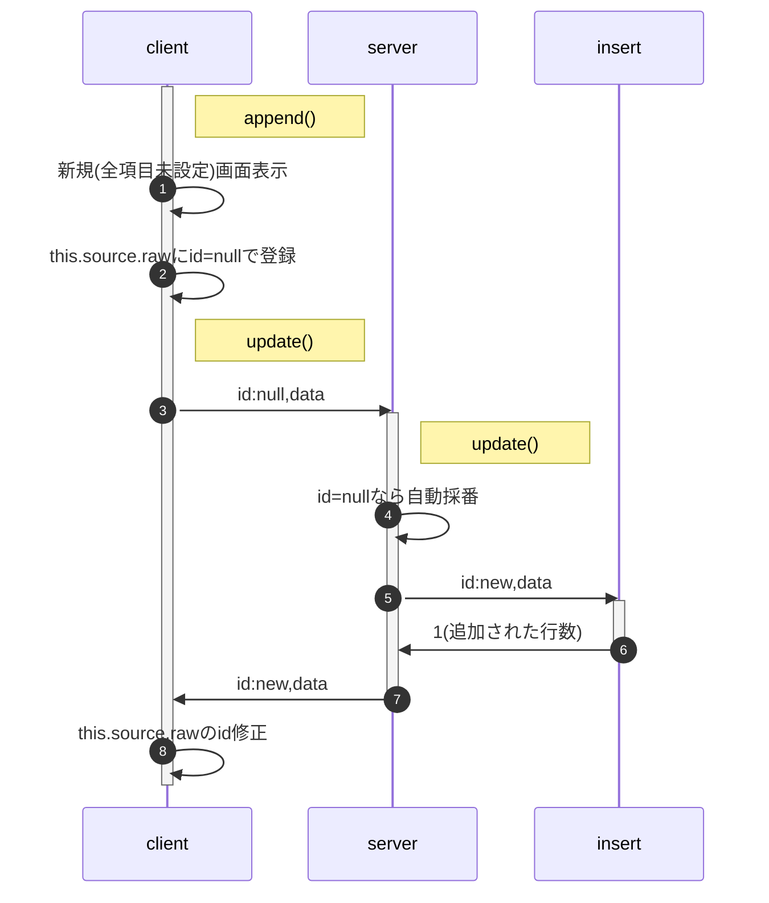

<style>
.triDown { /* 下向き矢印 */
  --bw: 50px;
  width: 0px;
  height: 0px;
  border-top: calc(var(--bw) * 0.7) solid #aaa;
  border-right: var(--bw) solid transparent;
  border-left: var(--bw) solid transparent;
  border-bottom: calc(var(--bw) * 0.2) solid transparent;
}
.title {
  font-size: 2.4rem;
  text-shadow: 2px 2px 5px #888;
}
</style>

<p class="title">class SingleTableClient</p>

Google Spreadの単一シート(テーブル)の内容を、html(SPA)で参照・編集・追加・削除(CRUD)する。

[画面遷移](#画面遷移) | [画面構成](#画面構成)

[Documents](#documents) | [動作イメージ](#OperationImage) | [source](#source) | [改版履歴](#history)

# Documents

## 画面遷移

<svg xmlns="http://www.w3.org/2000/svg" xmlns:xlink="http://www.w3.org/1999/xlink" version="1.1" width="416px" viewBox="-0.5 -0.5 416 311" content="&lt;mxfile host=&quot;app.diagrams.net&quot; modified=&quot;2024-03-02T00:53:33.603Z&quot; agent=&quot;Mozilla/5.0 (Macintosh; Intel Mac OS X 10_15_7) AppleWebKit/537.36 (KHTML, like Gecko) Chrome/122.0.0.0 Safari/537.36&quot; etag=&quot;cnunemI6uOsLkZhS0_zh&quot; version=&quot;22.1.20&quot; type=&quot;google&quot;&gt;&#10;  &lt;diagram name=&quot;ページ1&quot; id=&quot;BmNqtl1x02siel_nC2De&quot;&gt;&#10;    &lt;mxGraphModel dx=&quot;693&quot; dy=&quot;491&quot; grid=&quot;1&quot; gridSize=&quot;10&quot; guides=&quot;1&quot; tooltips=&quot;1&quot; connect=&quot;1&quot; arrows=&quot;1&quot; fold=&quot;1&quot; page=&quot;1&quot; pageScale=&quot;1&quot; pageWidth=&quot;827&quot; pageHeight=&quot;1169&quot; math=&quot;0&quot; shadow=&quot;0&quot;&gt;&#10;      &lt;root&gt;&#10;        &lt;mxCell id=&quot;0&quot; /&gt;&#10;        &lt;mxCell id=&quot;1&quot; parent=&quot;0&quot; /&gt;&#10;        &lt;mxCell id=&quot;0oVSfXQeK1aMUrLuZPPZ-36&quot; value=&quot;detail()&quot; style=&quot;rounded=0;whiteSpace=wrap;html=1;fontSize=16;fillColor=#E6E6E6;strokeColor=none;align=left;verticalAlign=bottom;&quot; vertex=&quot;1&quot; parent=&quot;1&quot;&gt;&#10;          &lt;mxGeometry x=&quot;389&quot; y=&quot;150&quot; width=&quot;142&quot; height=&quot;200&quot; as=&quot;geometry&quot; /&gt;&#10;        &lt;/mxCell&gt;&#10;        &lt;mxCell id=&quot;0oVSfXQeK1aMUrLuZPPZ-34&quot; value=&quot;list()&quot; style=&quot;rounded=0;whiteSpace=wrap;html=1;fontSize=16;fillColor=#E6E6E6;strokeColor=none;align=left;verticalAlign=bottom;&quot; vertex=&quot;1&quot; parent=&quot;1&quot;&gt;&#10;          &lt;mxGeometry x=&quot;148&quot; y=&quot;150&quot; width=&quot;142&quot; height=&quot;200&quot; as=&quot;geometry&quot; /&gt;&#10;        &lt;/mxCell&gt;&#10;        &lt;mxCell id=&quot;0oVSfXQeK1aMUrLuZPPZ-2&quot; value=&quot;&quot; style=&quot;ellipse;whiteSpace=wrap;html=1;aspect=fixed;fontSize=16;&quot; vertex=&quot;1&quot; parent=&quot;1&quot;&gt;&#10;          &lt;mxGeometry x=&quot;170&quot; y=&quot;80&quot; width=&quot;40&quot; height=&quot;40&quot; as=&quot;geometry&quot; /&gt;&#10;        &lt;/mxCell&gt;&#10;        &lt;mxCell id=&quot;0oVSfXQeK1aMUrLuZPPZ-13&quot; style=&quot;edgeStyle=none;curved=1;rounded=0;orthogonalLoop=1;jettySize=auto;html=1;exitX=0.5;exitY=1;exitDx=0;exitDy=0;entryX=0.25;entryY=0;entryDx=0;entryDy=0;fontSize=12;startSize=8;endSize=8;&quot; edge=&quot;1&quot; parent=&quot;1&quot; source=&quot;0oVSfXQeK1aMUrLuZPPZ-1&quot; target=&quot;0oVSfXQeK1aMUrLuZPPZ-3&quot;&gt;&#10;          &lt;mxGeometry relative=&quot;1&quot; as=&quot;geometry&quot;&gt;&#10;            &lt;mxPoint x=&quot;760&quot; y=&quot;76&quot; as=&quot;targetPoint&quot; /&gt;&#10;          &lt;/mxGeometry&gt;&#10;        &lt;/mxCell&gt;&#10;        &lt;mxCell id=&quot;0oVSfXQeK1aMUrLuZPPZ-1&quot; value=&quot;始&quot; style=&quot;text;html=1;strokeColor=none;fillColor=none;align=center;verticalAlign=middle;whiteSpace=wrap;rounded=0;fontSize=16;&quot; vertex=&quot;1&quot; parent=&quot;1&quot;&gt;&#10;          &lt;mxGeometry x=&quot;170&quot; y=&quot;80&quot; width=&quot;40&quot; height=&quot;40&quot; as=&quot;geometry&quot; /&gt;&#10;        &lt;/mxCell&gt;&#10;        &lt;mxCell id=&quot;0oVSfXQeK1aMUrLuZPPZ-8&quot; style=&quot;edgeStyle=none;curved=1;rounded=0;orthogonalLoop=1;jettySize=auto;html=1;exitX=1;exitY=0.75;exitDx=0;exitDy=0;entryX=0;entryY=0.75;entryDx=0;entryDy=0;fontSize=12;startSize=8;endSize=8;&quot; edge=&quot;1&quot; parent=&quot;1&quot; source=&quot;0oVSfXQeK1aMUrLuZPPZ-3&quot; target=&quot;0oVSfXQeK1aMUrLuZPPZ-4&quot;&gt;&#10;          &lt;mxGeometry relative=&quot;1&quot; as=&quot;geometry&quot;&gt;&#10;            &lt;mxPoint x=&quot;280&quot; y=&quot;236&quot; as=&quot;sourcePoint&quot; /&gt;&#10;            &lt;mxPoint x=&quot;400&quot; y=&quot;236&quot; as=&quot;targetPoint&quot; /&gt;&#10;          &lt;/mxGeometry&gt;&#10;        &lt;/mxCell&gt;&#10;        &lt;mxCell id=&quot;0oVSfXQeK1aMUrLuZPPZ-18&quot; style=&quot;edgeStyle=none;curved=1;rounded=0;orthogonalLoop=1;jettySize=auto;html=1;exitX=0.25;exitY=1;exitDx=0;exitDy=0;entryX=0.25;entryY=0;entryDx=0;entryDy=0;fontSize=12;startSize=8;endSize=8;&quot; edge=&quot;1&quot; parent=&quot;1&quot; source=&quot;0oVSfXQeK1aMUrLuZPPZ-3&quot; target=&quot;0oVSfXQeK1aMUrLuZPPZ-5&quot;&gt;&#10;          &lt;mxGeometry relative=&quot;1&quot; as=&quot;geometry&quot; /&gt;&#10;        &lt;/mxCell&gt;&#10;        &lt;mxCell id=&quot;0oVSfXQeK1aMUrLuZPPZ-27&quot; style=&quot;edgeStyle=orthogonalEdgeStyle;rounded=0;orthogonalLoop=1;jettySize=auto;html=1;exitX=0;exitY=0.5;exitDx=0;exitDy=0;fontSize=12;startSize=8;endSize=8;&quot; edge=&quot;1&quot; parent=&quot;1&quot; source=&quot;0oVSfXQeK1aMUrLuZPPZ-3&quot;&gt;&#10;          &lt;mxGeometry relative=&quot;1&quot; as=&quot;geometry&quot;&gt;&#10;            &lt;mxPoint x=&quot;460&quot; y=&quot;320&quot; as=&quot;targetPoint&quot; /&gt;&#10;            &lt;Array as=&quot;points&quot;&gt;&#10;              &lt;mxPoint x=&quot;140&quot; y=&quot;180&quot; /&gt;&#10;              &lt;mxPoint x=&quot;140&quot; y=&quot;360&quot; /&gt;&#10;              &lt;mxPoint x=&quot;460&quot; y=&quot;360&quot; /&gt;&#10;            &lt;/Array&gt;&#10;          &lt;/mxGeometry&gt;&#10;        &lt;/mxCell&gt;&#10;        &lt;mxCell id=&quot;0oVSfXQeK1aMUrLuZPPZ-3&quot; value=&quot;一覧表&quot; style=&quot;rounded=0;whiteSpace=wrap;html=1;fontSize=16;align=center;horizontal=1;verticalAlign=middle;&quot; vertex=&quot;1&quot; parent=&quot;1&quot;&gt;&#10;          &lt;mxGeometry x=&quot;160&quot; y=&quot;160&quot; width=&quot;120&quot; height=&quot;40&quot; as=&quot;geometry&quot; /&gt;&#10;        &lt;/mxCell&gt;&#10;        &lt;mxCell id=&quot;0oVSfXQeK1aMUrLuZPPZ-9&quot; style=&quot;edgeStyle=none;curved=1;rounded=0;orthogonalLoop=1;jettySize=auto;html=1;exitX=0;exitY=0.25;exitDx=0;exitDy=0;entryX=1;entryY=0.25;entryDx=0;entryDy=0;fontSize=12;startSize=8;endSize=8;&quot; edge=&quot;1&quot; parent=&quot;1&quot; source=&quot;0oVSfXQeK1aMUrLuZPPZ-4&quot; target=&quot;0oVSfXQeK1aMUrLuZPPZ-3&quot;&gt;&#10;          &lt;mxGeometry relative=&quot;1&quot; as=&quot;geometry&quot;&gt;&#10;            &lt;mxPoint x=&quot;770&quot; y=&quot;239&quot; as=&quot;sourcePoint&quot; /&gt;&#10;            &lt;mxPoint x=&quot;650&quot; y=&quot;239&quot; as=&quot;targetPoint&quot; /&gt;&#10;          &lt;/mxGeometry&gt;&#10;        &lt;/mxCell&gt;&#10;        &lt;mxCell id=&quot;0oVSfXQeK1aMUrLuZPPZ-11&quot; style=&quot;edgeStyle=orthogonalEdgeStyle;rounded=0;orthogonalLoop=1;jettySize=auto;html=1;exitX=0.25;exitY=0;exitDx=0;exitDy=0;entryX=0.75;entryY=0;entryDx=0;entryDy=0;fontSize=12;startSize=8;endSize=8;&quot; edge=&quot;1&quot; parent=&quot;1&quot; source=&quot;0oVSfXQeK1aMUrLuZPPZ-4&quot; target=&quot;0oVSfXQeK1aMUrLuZPPZ-3&quot;&gt;&#10;          &lt;mxGeometry relative=&quot;1&quot; as=&quot;geometry&quot;&gt;&#10;            &lt;Array as=&quot;points&quot;&gt;&#10;              &lt;mxPoint x=&quot;430&quot; y=&quot;120&quot; /&gt;&#10;              &lt;mxPoint x=&quot;250&quot; y=&quot;120&quot; /&gt;&#10;            &lt;/Array&gt;&#10;          &lt;/mxGeometry&gt;&#10;        &lt;/mxCell&gt;&#10;        &lt;mxCell id=&quot;0oVSfXQeK1aMUrLuZPPZ-14&quot; style=&quot;edgeStyle=none;curved=1;rounded=0;orthogonalLoop=1;jettySize=auto;html=1;exitX=0.25;exitY=1;exitDx=0;exitDy=0;entryX=0.25;entryY=0;entryDx=0;entryDy=0;fontSize=12;startSize=8;endSize=8;&quot; edge=&quot;1&quot; parent=&quot;1&quot; source=&quot;0oVSfXQeK1aMUrLuZPPZ-4&quot; target=&quot;0oVSfXQeK1aMUrLuZPPZ-6&quot;&gt;&#10;          &lt;mxGeometry relative=&quot;1&quot; as=&quot;geometry&quot; /&gt;&#10;        &lt;/mxCell&gt;&#10;        &lt;mxCell id=&quot;0oVSfXQeK1aMUrLuZPPZ-4&quot; value=&quot;詳細(参照)&quot; style=&quot;rounded=0;whiteSpace=wrap;html=1;fontSize=16;align=center;horizontal=1;verticalAlign=middle;&quot; vertex=&quot;1&quot; parent=&quot;1&quot;&gt;&#10;          &lt;mxGeometry x=&quot;400&quot; y=&quot;160&quot; width=&quot;120&quot; height=&quot;40&quot; as=&quot;geometry&quot; /&gt;&#10;        &lt;/mxCell&gt;&#10;        &lt;mxCell id=&quot;0oVSfXQeK1aMUrLuZPPZ-19&quot; style=&quot;edgeStyle=none;curved=1;rounded=0;orthogonalLoop=1;jettySize=auto;html=1;exitX=0.75;exitY=0;exitDx=0;exitDy=0;entryX=0.75;entryY=1;entryDx=0;entryDy=0;fontSize=12;startSize=8;endSize=8;&quot; edge=&quot;1&quot; parent=&quot;1&quot; source=&quot;0oVSfXQeK1aMUrLuZPPZ-5&quot; target=&quot;0oVSfXQeK1aMUrLuZPPZ-3&quot;&gt;&#10;          &lt;mxGeometry relative=&quot;1&quot; as=&quot;geometry&quot; /&gt;&#10;        &lt;/mxCell&gt;&#10;        &lt;mxCell id=&quot;0oVSfXQeK1aMUrLuZPPZ-23&quot; style=&quot;edgeStyle=orthogonalEdgeStyle;rounded=0;orthogonalLoop=1;jettySize=auto;html=1;exitX=1;exitY=0.25;exitDx=0;exitDy=0;entryX=0;entryY=0.75;entryDx=0;entryDy=0;fontSize=12;startSize=8;endSize=8;&quot; edge=&quot;1&quot; parent=&quot;1&quot; source=&quot;0oVSfXQeK1aMUrLuZPPZ-5&quot; target=&quot;0oVSfXQeK1aMUrLuZPPZ-4&quot;&gt;&#10;          &lt;mxGeometry relative=&quot;1&quot; as=&quot;geometry&quot;&gt;&#10;            &lt;Array as=&quot;points&quot;&gt;&#10;              &lt;mxPoint x=&quot;320&quot; y=&quot;290&quot; /&gt;&#10;              &lt;mxPoint x=&quot;320&quot; y=&quot;190&quot; /&gt;&#10;            &lt;/Array&gt;&#10;          &lt;/mxGeometry&gt;&#10;        &lt;/mxCell&gt;&#10;        &lt;mxCell id=&quot;0oVSfXQeK1aMUrLuZPPZ-25&quot; style=&quot;edgeStyle=orthogonalEdgeStyle;rounded=0;orthogonalLoop=1;jettySize=auto;html=1;exitX=0.5;exitY=1;exitDx=0;exitDy=0;entryX=0.5;entryY=1;entryDx=0;entryDy=0;fontSize=12;startSize=8;endSize=8;&quot; edge=&quot;1&quot; parent=&quot;1&quot; source=&quot;0oVSfXQeK1aMUrLuZPPZ-34&quot; target=&quot;0oVSfXQeK1aMUrLuZPPZ-6&quot;&gt;&#10;          &lt;mxGeometry relative=&quot;1&quot; as=&quot;geometry&quot;&gt;&#10;            &lt;Array as=&quot;points&quot;&gt;&#10;              &lt;mxPoint x=&quot;220&quot; y=&quot;360&quot; /&gt;&#10;              &lt;mxPoint x=&quot;460&quot; y=&quot;360&quot; /&gt;&#10;            &lt;/Array&gt;&#10;          &lt;/mxGeometry&gt;&#10;        &lt;/mxCell&gt;&#10;        &lt;mxCell id=&quot;0oVSfXQeK1aMUrLuZPPZ-5&quot; value=&quot;検索結果一覧&quot; style=&quot;rounded=0;whiteSpace=wrap;html=1;fontSize=16;align=center;horizontal=1;verticalAlign=middle;&quot; vertex=&quot;1&quot; parent=&quot;1&quot;&gt;&#10;          &lt;mxGeometry x=&quot;160&quot; y=&quot;280&quot; width=&quot;120&quot; height=&quot;40&quot; as=&quot;geometry&quot; /&gt;&#10;        &lt;/mxCell&gt;&#10;        &lt;mxCell id=&quot;0oVSfXQeK1aMUrLuZPPZ-15&quot; style=&quot;edgeStyle=none;curved=1;rounded=0;orthogonalLoop=1;jettySize=auto;html=1;exitX=0.75;exitY=0;exitDx=0;exitDy=0;entryX=0.75;entryY=1;entryDx=0;entryDy=0;fontSize=12;startSize=8;endSize=8;&quot; edge=&quot;1&quot; parent=&quot;1&quot; source=&quot;0oVSfXQeK1aMUrLuZPPZ-6&quot; target=&quot;0oVSfXQeK1aMUrLuZPPZ-4&quot;&gt;&#10;          &lt;mxGeometry relative=&quot;1&quot; as=&quot;geometry&quot; /&gt;&#10;        &lt;/mxCell&gt;&#10;        &lt;mxCell id=&quot;0oVSfXQeK1aMUrLuZPPZ-30&quot; style=&quot;edgeStyle=orthogonalEdgeStyle;rounded=0;orthogonalLoop=1;jettySize=auto;html=1;exitX=0;exitY=0.5;exitDx=0;exitDy=0;entryX=1;entryY=0.25;entryDx=0;entryDy=0;fontSize=12;startSize=8;endSize=8;jumpStyle=arc;&quot; edge=&quot;1&quot; parent=&quot;1&quot; source=&quot;0oVSfXQeK1aMUrLuZPPZ-6&quot; target=&quot;0oVSfXQeK1aMUrLuZPPZ-3&quot;&gt;&#10;          &lt;mxGeometry relative=&quot;1&quot; as=&quot;geometry&quot;&gt;&#10;            &lt;Array as=&quot;points&quot;&gt;&#10;              &lt;mxPoint x=&quot;360&quot; y=&quot;300&quot; /&gt;&#10;              &lt;mxPoint x=&quot;360&quot; y=&quot;170&quot; /&gt;&#10;            &lt;/Array&gt;&#10;          &lt;/mxGeometry&gt;&#10;        &lt;/mxCell&gt;&#10;        &lt;mxCell id=&quot;0oVSfXQeK1aMUrLuZPPZ-6&quot; value=&quot;詳細(編集)&quot; style=&quot;rounded=0;whiteSpace=wrap;html=1;fontSize=16;align=center;horizontal=1;verticalAlign=middle;&quot; vertex=&quot;1&quot; parent=&quot;1&quot;&gt;&#10;          &lt;mxGeometry x=&quot;400&quot; y=&quot;280&quot; width=&quot;120&quot; height=&quot;40&quot; as=&quot;geometry&quot; /&gt;&#10;        &lt;/mxCell&gt;&#10;        &lt;mxCell id=&quot;0oVSfXQeK1aMUrLuZPPZ-7&quot; value=&quot;明細&quot; style=&quot;text;html=1;strokeColor=none;fillColor=none;align=center;verticalAlign=middle;whiteSpace=wrap;rounded=0;fontSize=16;&quot; vertex=&quot;1&quot; parent=&quot;1&quot;&gt;&#10;          &lt;mxGeometry x=&quot;268&quot; y=&quot;187&quot; width=&quot;60&quot; height=&quot;30&quot; as=&quot;geometry&quot; /&gt;&#10;        &lt;/mxCell&gt;&#10;        &lt;mxCell id=&quot;0oVSfXQeK1aMUrLuZPPZ-10&quot; value=&quot;list&quot; style=&quot;text;html=1;strokeColor=none;fillColor=none;align=center;verticalAlign=middle;whiteSpace=wrap;rounded=0;fontSize=16;&quot; vertex=&quot;1&quot; parent=&quot;1&quot;&gt;&#10;          &lt;mxGeometry x=&quot;351&quot; y=&quot;145&quot; width=&quot;60&quot; height=&quot;30&quot; as=&quot;geometry&quot; /&gt;&#10;        &lt;/mxCell&gt;&#10;        &lt;mxCell id=&quot;0oVSfXQeK1aMUrLuZPPZ-12&quot; value=&quot;delete&quot; style=&quot;text;html=1;strokeColor=none;fillColor=none;align=center;verticalAlign=middle;whiteSpace=wrap;rounded=0;fontSize=16;&quot; vertex=&quot;1&quot; parent=&quot;1&quot;&gt;&#10;          &lt;mxGeometry x=&quot;310&quot; y=&quot;96&quot; width=&quot;60&quot; height=&quot;30&quot; as=&quot;geometry&quot; /&gt;&#10;        &lt;/mxCell&gt;&#10;        &lt;mxCell id=&quot;0oVSfXQeK1aMUrLuZPPZ-16&quot; value=&quot;edit&quot; style=&quot;text;html=1;strokeColor=none;fillColor=none;align=center;verticalAlign=middle;whiteSpace=wrap;rounded=0;fontSize=16;rotation=-90;&quot; vertex=&quot;1&quot; parent=&quot;1&quot;&gt;&#10;          &lt;mxGeometry x=&quot;388&quot; y=&quot;210&quot; width=&quot;60&quot; height=&quot;30&quot; as=&quot;geometry&quot; /&gt;&#10;        &lt;/mxCell&gt;&#10;        &lt;mxCell id=&quot;0oVSfXQeK1aMUrLuZPPZ-17&quot; value=&quot;view&quot; style=&quot;text;html=1;strokeColor=none;fillColor=none;align=center;verticalAlign=middle;whiteSpace=wrap;rounded=0;fontSize=16;rotation=-90;&quot; vertex=&quot;1&quot; parent=&quot;1&quot;&gt;&#10;          &lt;mxGeometry x=&quot;470&quot; y=&quot;236&quot; width=&quot;60&quot; height=&quot;30&quot; as=&quot;geometry&quot; /&gt;&#10;        &lt;/mxCell&gt;&#10;        &lt;mxCell id=&quot;0oVSfXQeK1aMUrLuZPPZ-21&quot; value=&quot;clear&quot; style=&quot;text;html=1;strokeColor=none;fillColor=none;align=center;verticalAlign=middle;whiteSpace=wrap;rounded=0;fontSize=16;rotation=-90;&quot; vertex=&quot;1&quot; parent=&quot;1&quot;&gt;&#10;          &lt;mxGeometry x=&quot;230&quot; y=&quot;240&quot; width=&quot;60&quot; height=&quot;30&quot; as=&quot;geometry&quot; /&gt;&#10;        &lt;/mxCell&gt;&#10;        &lt;mxCell id=&quot;0oVSfXQeK1aMUrLuZPPZ-22&quot; value=&quot;search&quot; style=&quot;text;html=1;strokeColor=none;fillColor=none;align=center;verticalAlign=middle;whiteSpace=wrap;rounded=0;fontSize=16;rotation=-90;&quot; vertex=&quot;1&quot; parent=&quot;1&quot;&gt;&#10;          &lt;mxGeometry x=&quot;148&quot; y=&quot;216&quot; width=&quot;60&quot; height=&quot;30&quot; as=&quot;geometry&quot; /&gt;&#10;        &lt;/mxCell&gt;&#10;        &lt;mxCell id=&quot;0oVSfXQeK1aMUrLuZPPZ-24&quot; value=&quot;明細&quot; style=&quot;text;html=1;strokeColor=none;fillColor=none;align=center;verticalAlign=middle;whiteSpace=wrap;rounded=0;fontSize=16;&quot; vertex=&quot;1&quot; parent=&quot;1&quot;&gt;&#10;          &lt;mxGeometry x=&quot;268&quot; y=&quot;266&quot; width=&quot;60&quot; height=&quot;30&quot; as=&quot;geometry&quot; /&gt;&#10;        &lt;/mxCell&gt;&#10;        &lt;mxCell id=&quot;0oVSfXQeK1aMUrLuZPPZ-26&quot; value=&quot;append&quot; style=&quot;text;html=1;strokeColor=none;fillColor=none;align=center;verticalAlign=middle;whiteSpace=wrap;rounded=0;fontSize=16;&quot; vertex=&quot;1&quot; parent=&quot;1&quot;&gt;&#10;          &lt;mxGeometry x=&quot;310&quot; y=&quot;360&quot; width=&quot;60&quot; height=&quot;30&quot; as=&quot;geometry&quot; /&gt;&#10;        &lt;/mxCell&gt;&#10;        &lt;mxCell id=&quot;0oVSfXQeK1aMUrLuZPPZ-29&quot; value=&quot;append&quot; style=&quot;text;html=1;strokeColor=none;fillColor=none;align=center;verticalAlign=middle;whiteSpace=wrap;rounded=0;fontSize=16;rotation=-90;&quot; vertex=&quot;1&quot; parent=&quot;1&quot;&gt;&#10;          &lt;mxGeometry x=&quot;100&quot; y=&quot;190&quot; width=&quot;60&quot; height=&quot;30&quot; as=&quot;geometry&quot; /&gt;&#10;        &lt;/mxCell&gt;&#10;        &lt;mxCell id=&quot;0oVSfXQeK1aMUrLuZPPZ-31&quot; value=&quot;list&quot; style=&quot;text;html=1;strokeColor=none;fillColor=none;align=center;verticalAlign=middle;whiteSpace=wrap;rounded=0;fontSize=16;&quot; vertex=&quot;1&quot; parent=&quot;1&quot;&gt;&#10;          &lt;mxGeometry x=&quot;351&quot; y=&quot;275&quot; width=&quot;60&quot; height=&quot;30&quot; as=&quot;geometry&quot; /&gt;&#10;        &lt;/mxCell&gt;&#10;        &lt;mxCell id=&quot;0oVSfXQeK1aMUrLuZPPZ-32&quot; style=&quot;edgeStyle=none;curved=1;rounded=0;orthogonalLoop=1;jettySize=auto;html=1;exitX=0.5;exitY=0;exitDx=0;exitDy=0;entryX=0.5;entryY=1;entryDx=0;entryDy=0;fontSize=12;startSize=8;endSize=8;&quot; edge=&quot;1&quot; parent=&quot;1&quot; source=&quot;0oVSfXQeK1aMUrLuZPPZ-6&quot; target=&quot;0oVSfXQeK1aMUrLuZPPZ-4&quot;&gt;&#10;          &lt;mxGeometry relative=&quot;1&quot; as=&quot;geometry&quot;&gt;&#10;            &lt;mxPoint x=&quot;570&quot; y=&quot;275&quot; as=&quot;sourcePoint&quot; /&gt;&#10;            &lt;mxPoint x=&quot;570&quot; y=&quot;195&quot; as=&quot;targetPoint&quot; /&gt;&#10;          &lt;/mxGeometry&gt;&#10;        &lt;/mxCell&gt;&#10;        &lt;mxCell id=&quot;0oVSfXQeK1aMUrLuZPPZ-33&quot; value=&quot;update&quot; style=&quot;text;html=1;strokeColor=none;fillColor=none;align=center;verticalAlign=middle;whiteSpace=wrap;rounded=0;fontSize=16;rotation=-90;&quot; vertex=&quot;1&quot; parent=&quot;1&quot;&gt;&#10;          &lt;mxGeometry x=&quot;438&quot; y=&quot;235&quot; width=&quot;60&quot; height=&quot;30&quot; as=&quot;geometry&quot; /&gt;&#10;        &lt;/mxCell&gt;&#10;        &lt;mxCell id=&quot;0oVSfXQeK1aMUrLuZPPZ-35&quot; value=&quot;&quot; style=&quot;edgeStyle=orthogonalEdgeStyle;rounded=0;orthogonalLoop=1;jettySize=auto;html=1;exitX=0.5;exitY=1;exitDx=0;exitDy=0;entryX=0.5;entryY=1;entryDx=0;entryDy=0;fontSize=12;startSize=8;endSize=8;&quot; edge=&quot;1&quot; parent=&quot;1&quot; source=&quot;0oVSfXQeK1aMUrLuZPPZ-5&quot; target=&quot;0oVSfXQeK1aMUrLuZPPZ-34&quot;&gt;&#10;          &lt;mxGeometry relative=&quot;1&quot; as=&quot;geometry&quot;&gt;&#10;            &lt;mxPoint x=&quot;220&quot; y=&quot;320&quot; as=&quot;sourcePoint&quot; /&gt;&#10;            &lt;mxPoint x=&quot;460&quot; y=&quot;320&quot; as=&quot;targetPoint&quot; /&gt;&#10;            &lt;Array as=&quot;points&quot; /&gt;&#10;          &lt;/mxGeometry&gt;&#10;        &lt;/mxCell&gt;&#10;      &lt;/root&gt;&#10;    &lt;/mxGraphModel&gt;&#10;  &lt;/diagram&gt;&#10;&lt;/mxfile&gt;&#10;" onclick="(function(svg){var src=window.event.target||window.event.srcElement;while (src!=null&amp;&amp;src.nodeName.toLowerCase()!='a'){src=src.parentNode;}if(src==null){if(svg.wnd!=null&amp;&amp;!svg.wnd.closed){svg.wnd.focus();}else{var r=function(evt){if(evt.data=='ready'&amp;&amp;evt.source==svg.wnd){svg.wnd.postMessage(decodeURIComponent(svg.getAttribute('content')),'*');window.removeEventListener('message',r);}};window.addEventListener('message',r);svg.wnd=window.open('https://viewer.diagrams.net/?client=1&amp;page=0&amp;edit=_blank');}}})(this);" style="cursor:pointer;max-width:100%;max-height:311px;"><defs/><g><rect x="274" y="70" width="142" height="200" fill="#e6e6e6" stroke="none" pointer-events="all"/><g transform="translate(-0.5 -0.5)"><switch><foreignObject pointer-events="none" width="100%" height="100%" requiredFeatures="http://www.w3.org/TR/SVG11/feature#Extensibility" style="overflow: visible; text-align: left;"><div xmlns="http://www.w3.org/1999/xhtml" style="display: flex; align-items: unsafe flex-end; justify-content: unsafe flex-start; width: 140px; height: 1px; padding-top: 267px; margin-left: 276px;"><div data-drawio-colors="color: rgb(0, 0, 0); " style="box-sizing: border-box; font-size: 0px; text-align: left;"><div style="display: inline-block; font-size: 16px; font-family: Helvetica; color: rgb(0, 0, 0); line-height: 1.2; pointer-events: all; white-space: normal; overflow-wrap: normal;">detail()</div></div></div></foreignObject><text x="276" y="267" fill="rgb(0, 0, 0)" font-family="Helvetica" font-size="16px">detail()</text></switch></g><rect x="33" y="70" width="142" height="200" fill="#e6e6e6" stroke="none" pointer-events="all"/><g transform="translate(-0.5 -0.5)"><switch><foreignObject pointer-events="none" width="100%" height="100%" requiredFeatures="http://www.w3.org/TR/SVG11/feature#Extensibility" style="overflow: visible; text-align: left;"><div xmlns="http://www.w3.org/1999/xhtml" style="display: flex; align-items: unsafe flex-end; justify-content: unsafe flex-start; width: 140px; height: 1px; padding-top: 267px; margin-left: 35px;"><div data-drawio-colors="color: rgb(0, 0, 0); " style="box-sizing: border-box; font-size: 0px; text-align: left;"><div style="display: inline-block; font-size: 16px; font-family: Helvetica; color: rgb(0, 0, 0); line-height: 1.2; pointer-events: all; white-space: normal; overflow-wrap: normal;">list()</div></div></div></foreignObject><text x="35" y="267" fill="rgb(0, 0, 0)" font-family="Helvetica" font-size="16px">list()</text></switch></g><ellipse cx="75" cy="20" rx="20" ry="20" fill="rgb(255, 255, 255)" stroke="rgb(0, 0, 0)" pointer-events="all"/><path d="M 75 40 Q 75 40 75 72.13" fill="none" stroke="rgb(0, 0, 0)" stroke-miterlimit="10" pointer-events="stroke"/><path d="M 75 78.88 L 70.5 69.88 L 75 72.13 L 79.5 69.88 Z" fill="rgb(0, 0, 0)" stroke="rgb(0, 0, 0)" stroke-miterlimit="10" pointer-events="all"/><rect x="55" y="0" width="40" height="40" fill="none" stroke="none" pointer-events="all"/><g transform="translate(-0.5 -0.5)"><switch><foreignObject pointer-events="none" width="100%" height="100%" requiredFeatures="http://www.w3.org/TR/SVG11/feature#Extensibility" style="overflow: visible; text-align: left;"><div xmlns="http://www.w3.org/1999/xhtml" style="display: flex; align-items: unsafe center; justify-content: unsafe center; width: 38px; height: 1px; padding-top: 20px; margin-left: 56px;"><div data-drawio-colors="color: rgb(0, 0, 0); " style="box-sizing: border-box; font-size: 0px; text-align: center;"><div style="display: inline-block; font-size: 16px; font-family: Helvetica; color: rgb(0, 0, 0); line-height: 1.2; pointer-events: all; white-space: normal; overflow-wrap: normal;">始</div></div></div></foreignObject><text x="75" y="25" fill="rgb(0, 0, 0)" font-family="Helvetica" font-size="16px" text-anchor="middle">始</text></switch></g><path d="M 165 110 Q 165 110 277.13 110" fill="none" stroke="rgb(0, 0, 0)" stroke-miterlimit="10" pointer-events="stroke"/><path d="M 283.88 110 L 274.88 114.5 L 277.13 110 L 274.88 105.5 Z" fill="rgb(0, 0, 0)" stroke="rgb(0, 0, 0)" stroke-miterlimit="10" pointer-events="all"/><path d="M 75 120 Q 75 120 75 192.13" fill="none" stroke="rgb(0, 0, 0)" stroke-miterlimit="10" pointer-events="stroke"/><path d="M 75 198.88 L 70.5 189.88 L 75 192.13 L 79.5 189.88 Z" fill="rgb(0, 0, 0)" stroke="rgb(0, 0, 0)" stroke-miterlimit="10" pointer-events="all"/><path d="M 45 100 L 25 100 L 25 280 L 345 280 L 345 247.87" fill="none" stroke="rgb(0, 0, 0)" stroke-miterlimit="10" pointer-events="stroke"/><path d="M 345 241.12 L 349.5 250.12 L 345 247.87 L 340.5 250.12 Z" fill="rgb(0, 0, 0)" stroke="rgb(0, 0, 0)" stroke-miterlimit="10" pointer-events="all"/><rect x="45" y="80" width="120" height="40" fill="rgb(255, 255, 255)" stroke="rgb(0, 0, 0)" pointer-events="all"/><g transform="translate(-0.5 -0.5)"><switch><foreignObject pointer-events="none" width="100%" height="100%" requiredFeatures="http://www.w3.org/TR/SVG11/feature#Extensibility" style="overflow: visible; text-align: left;"><div xmlns="http://www.w3.org/1999/xhtml" style="display: flex; align-items: unsafe center; justify-content: unsafe center; width: 118px; height: 1px; padding-top: 100px; margin-left: 46px;"><div data-drawio-colors="color: rgb(0, 0, 0); " style="box-sizing: border-box; font-size: 0px; text-align: center;"><div style="display: inline-block; font-size: 16px; font-family: Helvetica; color: rgb(0, 0, 0); line-height: 1.2; pointer-events: all; white-space: normal; overflow-wrap: normal;">一覧表</div></div></div></foreignObject><text x="105" y="105" fill="rgb(0, 0, 0)" font-family="Helvetica" font-size="16px" text-anchor="middle">一覧表</text></switch></g><path d="M 285 90 Q 285 90 172.87 90" fill="none" stroke="rgb(0, 0, 0)" stroke-miterlimit="10" pointer-events="stroke"/><path d="M 166.12 90 L 175.12 85.5 L 172.87 90 L 175.12 94.5 Z" fill="rgb(0, 0, 0)" stroke="rgb(0, 0, 0)" stroke-miterlimit="10" pointer-events="all"/><path d="M 315 80 L 315 40 L 135 40 L 135 72.13" fill="none" stroke="rgb(0, 0, 0)" stroke-miterlimit="10" pointer-events="stroke"/><path d="M 135 78.88 L 130.5 69.88 L 135 72.13 L 139.5 69.88 Z" fill="rgb(0, 0, 0)" stroke="rgb(0, 0, 0)" stroke-miterlimit="10" pointer-events="all"/><path d="M 315 120 Q 315 120 315 192.13" fill="none" stroke="rgb(0, 0, 0)" stroke-miterlimit="10" pointer-events="stroke"/><path d="M 315 198.88 L 310.5 189.88 L 315 192.13 L 319.5 189.88 Z" fill="rgb(0, 0, 0)" stroke="rgb(0, 0, 0)" stroke-miterlimit="10" pointer-events="all"/><rect x="285" y="80" width="120" height="40" fill="rgb(255, 255, 255)" stroke="rgb(0, 0, 0)" pointer-events="all"/><g transform="translate(-0.5 -0.5)"><switch><foreignObject pointer-events="none" width="100%" height="100%" requiredFeatures="http://www.w3.org/TR/SVG11/feature#Extensibility" style="overflow: visible; text-align: left;"><div xmlns="http://www.w3.org/1999/xhtml" style="display: flex; align-items: unsafe center; justify-content: unsafe center; width: 118px; height: 1px; padding-top: 100px; margin-left: 286px;"><div data-drawio-colors="color: rgb(0, 0, 0); " style="box-sizing: border-box; font-size: 0px; text-align: center;"><div style="display: inline-block; font-size: 16px; font-family: Helvetica; color: rgb(0, 0, 0); line-height: 1.2; pointer-events: all; white-space: normal; overflow-wrap: normal;">詳細(参照)</div></div></div></foreignObject><text x="345" y="105" fill="rgb(0, 0, 0)" font-family="Helvetica" font-size="16px" text-anchor="middle">詳細(参照)</text></switch></g><path d="M 135 200 Q 135 200 135 127.87" fill="none" stroke="rgb(0, 0, 0)" stroke-miterlimit="10" pointer-events="stroke"/><path d="M 135 121.12 L 139.5 130.12 L 135 127.87 L 130.5 130.12 Z" fill="rgb(0, 0, 0)" stroke="rgb(0, 0, 0)" stroke-miterlimit="10" pointer-events="all"/><path d="M 165 210 L 205 210 L 205 110 L 277.13 110" fill="none" stroke="rgb(0, 0, 0)" stroke-miterlimit="10" pointer-events="stroke"/><path d="M 283.88 110 L 274.88 114.5 L 277.13 110 L 274.88 105.5 Z" fill="rgb(0, 0, 0)" stroke="rgb(0, 0, 0)" stroke-miterlimit="10" pointer-events="all"/><path d="M 104 270 L 105 270 L 105 280 L 345 280 L 345 247.87" fill="none" stroke="rgb(0, 0, 0)" stroke-miterlimit="10" pointer-events="stroke"/><path d="M 345 241.12 L 349.5 250.12 L 345 247.87 L 340.5 250.12 Z" fill="rgb(0, 0, 0)" stroke="rgb(0, 0, 0)" stroke-miterlimit="10" pointer-events="all"/><rect x="45" y="200" width="120" height="40" fill="rgb(255, 255, 255)" stroke="rgb(0, 0, 0)" pointer-events="all"/><g transform="translate(-0.5 -0.5)"><switch><foreignObject pointer-events="none" width="100%" height="100%" requiredFeatures="http://www.w3.org/TR/SVG11/feature#Extensibility" style="overflow: visible; text-align: left;"><div xmlns="http://www.w3.org/1999/xhtml" style="display: flex; align-items: unsafe center; justify-content: unsafe center; width: 118px; height: 1px; padding-top: 220px; margin-left: 46px;"><div data-drawio-colors="color: rgb(0, 0, 0); " style="box-sizing: border-box; font-size: 0px; text-align: center;"><div style="display: inline-block; font-size: 16px; font-family: Helvetica; color: rgb(0, 0, 0); line-height: 1.2; pointer-events: all; white-space: normal; overflow-wrap: normal;">検索結果一覧</div></div></div></foreignObject><text x="105" y="225" fill="rgb(0, 0, 0)" font-family="Helvetica" font-size="16px" text-anchor="middle">検索結果一覧</text></switch></g><path d="M 375 200 Q 375 200 375 127.87" fill="none" stroke="rgb(0, 0, 0)" stroke-miterlimit="10" pointer-events="stroke"/><path d="M 375 121.12 L 379.5 130.12 L 375 127.87 L 370.5 130.12 Z" fill="rgb(0, 0, 0)" stroke="rgb(0, 0, 0)" stroke-miterlimit="10" pointer-events="all"/><path d="M 285 220 L 245 220 L 245 113 C 248.9 113 248.9 107 245 107 L 245 107 L 245 90 L 172.87 90" fill="none" stroke="rgb(0, 0, 0)" stroke-miterlimit="10" pointer-events="stroke"/><path d="M 166.12 90 L 175.12 85.5 L 172.87 90 L 175.12 94.5 Z" fill="rgb(0, 0, 0)" stroke="rgb(0, 0, 0)" stroke-miterlimit="10" pointer-events="all"/><rect x="285" y="200" width="120" height="40" fill="rgb(255, 255, 255)" stroke="rgb(0, 0, 0)" pointer-events="all"/><g transform="translate(-0.5 -0.5)"><switch><foreignObject pointer-events="none" width="100%" height="100%" requiredFeatures="http://www.w3.org/TR/SVG11/feature#Extensibility" style="overflow: visible; text-align: left;"><div xmlns="http://www.w3.org/1999/xhtml" style="display: flex; align-items: unsafe center; justify-content: unsafe center; width: 118px; height: 1px; padding-top: 220px; margin-left: 286px;"><div data-drawio-colors="color: rgb(0, 0, 0); " style="box-sizing: border-box; font-size: 0px; text-align: center;"><div style="display: inline-block; font-size: 16px; font-family: Helvetica; color: rgb(0, 0, 0); line-height: 1.2; pointer-events: all; white-space: normal; overflow-wrap: normal;">詳細(編集)</div></div></div></foreignObject><text x="345" y="225" fill="rgb(0, 0, 0)" font-family="Helvetica" font-size="16px" text-anchor="middle">詳細(編集)</text></switch></g><rect x="153" y="107" width="60" height="30" fill="none" stroke="none" pointer-events="all"/><g transform="translate(-0.5 -0.5)"><switch><foreignObject pointer-events="none" width="100%" height="100%" requiredFeatures="http://www.w3.org/TR/SVG11/feature#Extensibility" style="overflow: visible; text-align: left;"><div xmlns="http://www.w3.org/1999/xhtml" style="display: flex; align-items: unsafe center; justify-content: unsafe center; width: 58px; height: 1px; padding-top: 122px; margin-left: 154px;"><div data-drawio-colors="color: rgb(0, 0, 0); " style="box-sizing: border-box; font-size: 0px; text-align: center;"><div style="display: inline-block; font-size: 16px; font-family: Helvetica; color: rgb(0, 0, 0); line-height: 1.2; pointer-events: all; white-space: normal; overflow-wrap: normal;">明細</div></div></div></foreignObject><text x="183" y="127" fill="rgb(0, 0, 0)" font-family="Helvetica" font-size="16px" text-anchor="middle">明細</text></switch></g><rect x="236" y="65" width="60" height="30" fill="none" stroke="none" pointer-events="all"/><g transform="translate(-0.5 -0.5)"><switch><foreignObject pointer-events="none" width="100%" height="100%" requiredFeatures="http://www.w3.org/TR/SVG11/feature#Extensibility" style="overflow: visible; text-align: left;"><div xmlns="http://www.w3.org/1999/xhtml" style="display: flex; align-items: unsafe center; justify-content: unsafe center; width: 58px; height: 1px; padding-top: 80px; margin-left: 237px;"><div data-drawio-colors="color: rgb(0, 0, 0); " style="box-sizing: border-box; font-size: 0px; text-align: center;"><div style="display: inline-block; font-size: 16px; font-family: Helvetica; color: rgb(0, 0, 0); line-height: 1.2; pointer-events: all; white-space: normal; overflow-wrap: normal;">list</div></div></div></foreignObject><text x="266" y="85" fill="rgb(0, 0, 0)" font-family="Helvetica" font-size="16px" text-anchor="middle">list</text></switch></g><rect x="195" y="16" width="60" height="30" fill="none" stroke="none" pointer-events="all"/><g transform="translate(-0.5 -0.5)"><switch><foreignObject pointer-events="none" width="100%" height="100%" requiredFeatures="http://www.w3.org/TR/SVG11/feature#Extensibility" style="overflow: visible; text-align: left;"><div xmlns="http://www.w3.org/1999/xhtml" style="display: flex; align-items: unsafe center; justify-content: unsafe center; width: 58px; height: 1px; padding-top: 31px; margin-left: 196px;"><div data-drawio-colors="color: rgb(0, 0, 0); " style="box-sizing: border-box; font-size: 0px; text-align: center;"><div style="display: inline-block; font-size: 16px; font-family: Helvetica; color: rgb(0, 0, 0); line-height: 1.2; pointer-events: all; white-space: normal; overflow-wrap: normal;">delete</div></div></div></foreignObject><text x="225" y="36" fill="rgb(0, 0, 0)" font-family="Helvetica" font-size="16px" text-anchor="middle">delete</text></switch></g><rect x="273" y="130" width="60" height="30" fill="none" stroke="none" transform="rotate(-90,303,145)" pointer-events="all"/><g transform="translate(-0.5 -0.5)rotate(-90 303 145)"><switch><foreignObject pointer-events="none" width="100%" height="100%" requiredFeatures="http://www.w3.org/TR/SVG11/feature#Extensibility" style="overflow: visible; text-align: left;"><div xmlns="http://www.w3.org/1999/xhtml" style="display: flex; align-items: unsafe center; justify-content: unsafe center; width: 58px; height: 1px; padding-top: 145px; margin-left: 274px;"><div data-drawio-colors="color: rgb(0, 0, 0); " style="box-sizing: border-box; font-size: 0px; text-align: center;"><div style="display: inline-block; font-size: 16px; font-family: Helvetica; color: rgb(0, 0, 0); line-height: 1.2; pointer-events: all; white-space: normal; overflow-wrap: normal;">edit</div></div></div></foreignObject><text x="303" y="150" fill="rgb(0, 0, 0)" font-family="Helvetica" font-size="16px" text-anchor="middle">edit</text></switch></g><rect x="355" y="156" width="60" height="30" fill="none" stroke="none" transform="rotate(-90,385,171)" pointer-events="all"/><g transform="translate(-0.5 -0.5)rotate(-90 385 171)"><switch><foreignObject pointer-events="none" width="100%" height="100%" requiredFeatures="http://www.w3.org/TR/SVG11/feature#Extensibility" style="overflow: visible; text-align: left;"><div xmlns="http://www.w3.org/1999/xhtml" style="display: flex; align-items: unsafe center; justify-content: unsafe center; width: 58px; height: 1px; padding-top: 171px; margin-left: 356px;"><div data-drawio-colors="color: rgb(0, 0, 0); " style="box-sizing: border-box; font-size: 0px; text-align: center;"><div style="display: inline-block; font-size: 16px; font-family: Helvetica; color: rgb(0, 0, 0); line-height: 1.2; pointer-events: all; white-space: normal; overflow-wrap: normal;">view</div></div></div></foreignObject><text x="385" y="176" fill="rgb(0, 0, 0)" font-family="Helvetica" font-size="16px" text-anchor="middle">view</text></switch></g><rect x="115" y="160" width="60" height="30" fill="none" stroke="none" transform="rotate(-90,145,175)" pointer-events="all"/><g transform="translate(-0.5 -0.5)rotate(-90 145 175)"><switch><foreignObject pointer-events="none" width="100%" height="100%" requiredFeatures="http://www.w3.org/TR/SVG11/feature#Extensibility" style="overflow: visible; text-align: left;"><div xmlns="http://www.w3.org/1999/xhtml" style="display: flex; align-items: unsafe center; justify-content: unsafe center; width: 58px; height: 1px; padding-top: 175px; margin-left: 116px;"><div data-drawio-colors="color: rgb(0, 0, 0); " style="box-sizing: border-box; font-size: 0px; text-align: center;"><div style="display: inline-block; font-size: 16px; font-family: Helvetica; color: rgb(0, 0, 0); line-height: 1.2; pointer-events: all; white-space: normal; overflow-wrap: normal;">clear</div></div></div></foreignObject><text x="145" y="180" fill="rgb(0, 0, 0)" font-family="Helvetica" font-size="16px" text-anchor="middle">clear</text></switch></g><rect x="33" y="136" width="60" height="30" fill="none" stroke="none" transform="rotate(-90,63,151)" pointer-events="all"/><g transform="translate(-0.5 -0.5)rotate(-90 63 151)"><switch><foreignObject pointer-events="none" width="100%" height="100%" requiredFeatures="http://www.w3.org/TR/SVG11/feature#Extensibility" style="overflow: visible; text-align: left;"><div xmlns="http://www.w3.org/1999/xhtml" style="display: flex; align-items: unsafe center; justify-content: unsafe center; width: 58px; height: 1px; padding-top: 151px; margin-left: 34px;"><div data-drawio-colors="color: rgb(0, 0, 0); " style="box-sizing: border-box; font-size: 0px; text-align: center;"><div style="display: inline-block; font-size: 16px; font-family: Helvetica; color: rgb(0, 0, 0); line-height: 1.2; pointer-events: all; white-space: normal; overflow-wrap: normal;">search</div></div></div></foreignObject><text x="63" y="156" fill="rgb(0, 0, 0)" font-family="Helvetica" font-size="16px" text-anchor="middle">search</text></switch></g><rect x="153" y="186" width="60" height="30" fill="none" stroke="none" pointer-events="all"/><g transform="translate(-0.5 -0.5)"><switch><foreignObject pointer-events="none" width="100%" height="100%" requiredFeatures="http://www.w3.org/TR/SVG11/feature#Extensibility" style="overflow: visible; text-align: left;"><div xmlns="http://www.w3.org/1999/xhtml" style="display: flex; align-items: unsafe center; justify-content: unsafe center; width: 58px; height: 1px; padding-top: 201px; margin-left: 154px;"><div data-drawio-colors="color: rgb(0, 0, 0); " style="box-sizing: border-box; font-size: 0px; text-align: center;"><div style="display: inline-block; font-size: 16px; font-family: Helvetica; color: rgb(0, 0, 0); line-height: 1.2; pointer-events: all; white-space: normal; overflow-wrap: normal;">明細</div></div></div></foreignObject><text x="183" y="206" fill="rgb(0, 0, 0)" font-family="Helvetica" font-size="16px" text-anchor="middle">明細</text></switch></g><rect x="195" y="280" width="60" height="30" fill="none" stroke="none" pointer-events="all"/><g transform="translate(-0.5 -0.5)"><switch><foreignObject pointer-events="none" width="100%" height="100%" requiredFeatures="http://www.w3.org/TR/SVG11/feature#Extensibility" style="overflow: visible; text-align: left;"><div xmlns="http://www.w3.org/1999/xhtml" style="display: flex; align-items: unsafe center; justify-content: unsafe center; width: 58px; height: 1px; padding-top: 295px; margin-left: 196px;"><div data-drawio-colors="color: rgb(0, 0, 0); " style="box-sizing: border-box; font-size: 0px; text-align: center;"><div style="display: inline-block; font-size: 16px; font-family: Helvetica; color: rgb(0, 0, 0); line-height: 1.2; pointer-events: all; white-space: normal; overflow-wrap: normal;">append</div></div></div></foreignObject><text x="225" y="300" fill="rgb(0, 0, 0)" font-family="Helvetica" font-size="16px" text-anchor="middle">append</text></switch></g><rect x="-15" y="110" width="60" height="30" fill="none" stroke="none" transform="rotate(-90,15,125)" pointer-events="all"/><g transform="translate(-0.5 -0.5)rotate(-90 15 125)"><switch><foreignObject pointer-events="none" width="100%" height="100%" requiredFeatures="http://www.w3.org/TR/SVG11/feature#Extensibility" style="overflow: visible; text-align: left;"><div xmlns="http://www.w3.org/1999/xhtml" style="display: flex; align-items: unsafe center; justify-content: unsafe center; width: 58px; height: 1px; padding-top: 125px; margin-left: -14px;"><div data-drawio-colors="color: rgb(0, 0, 0); " style="box-sizing: border-box; font-size: 0px; text-align: center;"><div style="display: inline-block; font-size: 16px; font-family: Helvetica; color: rgb(0, 0, 0); line-height: 1.2; pointer-events: all; white-space: normal; overflow-wrap: normal;">append</div></div></div></foreignObject><text x="15" y="130" fill="rgb(0, 0, 0)" font-family="Helvetica" font-size="16px" text-anchor="middle">append</text></switch></g><rect x="236" y="195" width="60" height="30" fill="none" stroke="none" pointer-events="all"/><g transform="translate(-0.5 -0.5)"><switch><foreignObject pointer-events="none" width="100%" height="100%" requiredFeatures="http://www.w3.org/TR/SVG11/feature#Extensibility" style="overflow: visible; text-align: left;"><div xmlns="http://www.w3.org/1999/xhtml" style="display: flex; align-items: unsafe center; justify-content: unsafe center; width: 58px; height: 1px; padding-top: 210px; margin-left: 237px;"><div data-drawio-colors="color: rgb(0, 0, 0); " style="box-sizing: border-box; font-size: 0px; text-align: center;"><div style="display: inline-block; font-size: 16px; font-family: Helvetica; color: rgb(0, 0, 0); line-height: 1.2; pointer-events: all; white-space: normal; overflow-wrap: normal;">list</div></div></div></foreignObject><text x="266" y="215" fill="rgb(0, 0, 0)" font-family="Helvetica" font-size="16px" text-anchor="middle">list</text></switch></g><path d="M 345 200 Q 345 200 345 127.87" fill="none" stroke="rgb(0, 0, 0)" stroke-miterlimit="10" pointer-events="stroke"/><path d="M 345 121.12 L 349.5 130.12 L 345 127.87 L 340.5 130.12 Z" fill="rgb(0, 0, 0)" stroke="rgb(0, 0, 0)" stroke-miterlimit="10" pointer-events="all"/><rect x="323" y="155" width="60" height="30" fill="none" stroke="none" transform="rotate(-90,353,170)" pointer-events="all"/><g transform="translate(-0.5 -0.5)rotate(-90 353 170)"><switch><foreignObject pointer-events="none" width="100%" height="100%" requiredFeatures="http://www.w3.org/TR/SVG11/feature#Extensibility" style="overflow: visible; text-align: left;"><div xmlns="http://www.w3.org/1999/xhtml" style="display: flex; align-items: unsafe center; justify-content: unsafe center; width: 58px; height: 1px; padding-top: 170px; margin-left: 324px;"><div data-drawio-colors="color: rgb(0, 0, 0); " style="box-sizing: border-box; font-size: 0px; text-align: center;"><div style="display: inline-block; font-size: 16px; font-family: Helvetica; color: rgb(0, 0, 0); line-height: 1.2; pointer-events: all; white-space: normal; overflow-wrap: normal;">update</div></div></div></foreignObject><text x="353" y="175" fill="rgb(0, 0, 0)" font-family="Helvetica" font-size="16px" text-anchor="middle">update</text></switch></g><path d="M 105 240 L 104 240 L 104 262.13" fill="none" stroke="rgb(0, 0, 0)" stroke-miterlimit="10" pointer-events="stroke"/><path d="M 104 268.88 L 99.5 259.88 L 104 262.13 L 108.5 259.88 Z" fill="rgb(0, 0, 0)" stroke="rgb(0, 0, 0)" stroke-miterlimit="10" pointer-events="all"/></g><switch><g requiredFeatures="http://www.w3.org/TR/SVG11/feature#Extensibility"/><a transform="translate(0,-5)" xlink:href="https://www.drawio.com/doc/faq/svg-export-text-problems" target="_blank"><text text-anchor="middle" font-size="10px" x="50%" y="100%">Text is not SVG - cannot display</text></a></switch></svg>

## 画面構成

### 要素(DIV)構成図

<svg xmlns="http://www.w3.org/2000/svg" xmlns:xlink="http://www.w3.org/1999/xlink" version="1.1" width="821px" viewBox="-0.5 -0.5 821 631" content="&lt;mxfile host=&quot;app.diagrams.net&quot; modified=&quot;2024-03-02T02:04:35.379Z&quot; agent=&quot;Mozilla/5.0 (Macintosh; Intel Mac OS X 10_15_7) AppleWebKit/537.36 (KHTML, like Gecko) Chrome/122.0.0.0 Safari/537.36&quot; etag=&quot;Wqvalr0SWTN1OwwHoch1&quot; version=&quot;22.1.20&quot; type=&quot;google&quot; pages=&quot;2&quot;&gt;&#10;  &lt;diagram name=&quot;画面遷移&quot; id=&quot;BmNqtl1x02siel_nC2De&quot;&gt;&#10;    &lt;mxGraphModel dx=&quot;667&quot; dy=&quot;491&quot; grid=&quot;1&quot; gridSize=&quot;10&quot; guides=&quot;1&quot; tooltips=&quot;1&quot; connect=&quot;1&quot; arrows=&quot;1&quot; fold=&quot;1&quot; page=&quot;1&quot; pageScale=&quot;1&quot; pageWidth=&quot;827&quot; pageHeight=&quot;1169&quot; math=&quot;0&quot; shadow=&quot;0&quot;&gt;&#10;      &lt;root&gt;&#10;        &lt;mxCell id=&quot;0&quot; /&gt;&#10;        &lt;mxCell id=&quot;1&quot; parent=&quot;0&quot; /&gt;&#10;        &lt;mxCell id=&quot;0oVSfXQeK1aMUrLuZPPZ-36&quot; value=&quot;detail()&quot; style=&quot;rounded=0;whiteSpace=wrap;html=1;fontSize=16;fillColor=#E6E6E6;strokeColor=none;align=left;verticalAlign=bottom;&quot; vertex=&quot;1&quot; parent=&quot;1&quot;&gt;&#10;          &lt;mxGeometry x=&quot;389&quot; y=&quot;150&quot; width=&quot;142&quot; height=&quot;200&quot; as=&quot;geometry&quot; /&gt;&#10;        &lt;/mxCell&gt;&#10;        &lt;mxCell id=&quot;0oVSfXQeK1aMUrLuZPPZ-34&quot; value=&quot;list()&quot; style=&quot;rounded=0;whiteSpace=wrap;html=1;fontSize=16;fillColor=#E6E6E6;strokeColor=none;align=left;verticalAlign=bottom;&quot; vertex=&quot;1&quot; parent=&quot;1&quot;&gt;&#10;          &lt;mxGeometry x=&quot;148&quot; y=&quot;150&quot; width=&quot;142&quot; height=&quot;200&quot; as=&quot;geometry&quot; /&gt;&#10;        &lt;/mxCell&gt;&#10;        &lt;mxCell id=&quot;0oVSfXQeK1aMUrLuZPPZ-2&quot; value=&quot;&quot; style=&quot;ellipse;whiteSpace=wrap;html=1;aspect=fixed;fontSize=16;&quot; vertex=&quot;1&quot; parent=&quot;1&quot;&gt;&#10;          &lt;mxGeometry x=&quot;170&quot; y=&quot;80&quot; width=&quot;40&quot; height=&quot;40&quot; as=&quot;geometry&quot; /&gt;&#10;        &lt;/mxCell&gt;&#10;        &lt;mxCell id=&quot;0oVSfXQeK1aMUrLuZPPZ-13&quot; style=&quot;edgeStyle=none;curved=1;rounded=0;orthogonalLoop=1;jettySize=auto;html=1;exitX=0.5;exitY=1;exitDx=0;exitDy=0;entryX=0.25;entryY=0;entryDx=0;entryDy=0;fontSize=12;startSize=8;endSize=8;&quot; edge=&quot;1&quot; parent=&quot;1&quot; source=&quot;0oVSfXQeK1aMUrLuZPPZ-1&quot; target=&quot;0oVSfXQeK1aMUrLuZPPZ-3&quot;&gt;&#10;          &lt;mxGeometry relative=&quot;1&quot; as=&quot;geometry&quot;&gt;&#10;            &lt;mxPoint x=&quot;760&quot; y=&quot;76&quot; as=&quot;targetPoint&quot; /&gt;&#10;          &lt;/mxGeometry&gt;&#10;        &lt;/mxCell&gt;&#10;        &lt;mxCell id=&quot;0oVSfXQeK1aMUrLuZPPZ-1&quot; value=&quot;始&quot; style=&quot;text;html=1;strokeColor=none;fillColor=none;align=center;verticalAlign=middle;whiteSpace=wrap;rounded=0;fontSize=16;&quot; vertex=&quot;1&quot; parent=&quot;1&quot;&gt;&#10;          &lt;mxGeometry x=&quot;170&quot; y=&quot;80&quot; width=&quot;40&quot; height=&quot;40&quot; as=&quot;geometry&quot; /&gt;&#10;        &lt;/mxCell&gt;&#10;        &lt;mxCell id=&quot;0oVSfXQeK1aMUrLuZPPZ-8&quot; style=&quot;edgeStyle=none;curved=1;rounded=0;orthogonalLoop=1;jettySize=auto;html=1;exitX=1;exitY=0.75;exitDx=0;exitDy=0;entryX=0;entryY=0.75;entryDx=0;entryDy=0;fontSize=12;startSize=8;endSize=8;&quot; edge=&quot;1&quot; parent=&quot;1&quot; source=&quot;0oVSfXQeK1aMUrLuZPPZ-3&quot; target=&quot;0oVSfXQeK1aMUrLuZPPZ-4&quot;&gt;&#10;          &lt;mxGeometry relative=&quot;1&quot; as=&quot;geometry&quot;&gt;&#10;            &lt;mxPoint x=&quot;280&quot; y=&quot;236&quot; as=&quot;sourcePoint&quot; /&gt;&#10;            &lt;mxPoint x=&quot;400&quot; y=&quot;236&quot; as=&quot;targetPoint&quot; /&gt;&#10;          &lt;/mxGeometry&gt;&#10;        &lt;/mxCell&gt;&#10;        &lt;mxCell id=&quot;0oVSfXQeK1aMUrLuZPPZ-18&quot; style=&quot;edgeStyle=none;curved=1;rounded=0;orthogonalLoop=1;jettySize=auto;html=1;exitX=0.25;exitY=1;exitDx=0;exitDy=0;entryX=0.25;entryY=0;entryDx=0;entryDy=0;fontSize=12;startSize=8;endSize=8;&quot; edge=&quot;1&quot; parent=&quot;1&quot; source=&quot;0oVSfXQeK1aMUrLuZPPZ-3&quot; target=&quot;0oVSfXQeK1aMUrLuZPPZ-5&quot;&gt;&#10;          &lt;mxGeometry relative=&quot;1&quot; as=&quot;geometry&quot; /&gt;&#10;        &lt;/mxCell&gt;&#10;        &lt;mxCell id=&quot;0oVSfXQeK1aMUrLuZPPZ-27&quot; style=&quot;edgeStyle=orthogonalEdgeStyle;rounded=0;orthogonalLoop=1;jettySize=auto;html=1;exitX=0;exitY=0.5;exitDx=0;exitDy=0;fontSize=12;startSize=8;endSize=8;&quot; edge=&quot;1&quot; parent=&quot;1&quot; source=&quot;0oVSfXQeK1aMUrLuZPPZ-3&quot;&gt;&#10;          &lt;mxGeometry relative=&quot;1&quot; as=&quot;geometry&quot;&gt;&#10;            &lt;mxPoint x=&quot;460&quot; y=&quot;320&quot; as=&quot;targetPoint&quot; /&gt;&#10;            &lt;Array as=&quot;points&quot;&gt;&#10;              &lt;mxPoint x=&quot;140&quot; y=&quot;180&quot; /&gt;&#10;              &lt;mxPoint x=&quot;140&quot; y=&quot;360&quot; /&gt;&#10;              &lt;mxPoint x=&quot;460&quot; y=&quot;360&quot; /&gt;&#10;            &lt;/Array&gt;&#10;          &lt;/mxGeometry&gt;&#10;        &lt;/mxCell&gt;&#10;        &lt;mxCell id=&quot;0oVSfXQeK1aMUrLuZPPZ-3&quot; value=&quot;一覧表&quot; style=&quot;rounded=0;whiteSpace=wrap;html=1;fontSize=16;align=center;horizontal=1;verticalAlign=middle;&quot; vertex=&quot;1&quot; parent=&quot;1&quot;&gt;&#10;          &lt;mxGeometry x=&quot;160&quot; y=&quot;160&quot; width=&quot;120&quot; height=&quot;40&quot; as=&quot;geometry&quot; /&gt;&#10;        &lt;/mxCell&gt;&#10;        &lt;mxCell id=&quot;0oVSfXQeK1aMUrLuZPPZ-9&quot; style=&quot;edgeStyle=none;curved=1;rounded=0;orthogonalLoop=1;jettySize=auto;html=1;exitX=0;exitY=0.25;exitDx=0;exitDy=0;entryX=1;entryY=0.25;entryDx=0;entryDy=0;fontSize=12;startSize=8;endSize=8;&quot; edge=&quot;1&quot; parent=&quot;1&quot; source=&quot;0oVSfXQeK1aMUrLuZPPZ-4&quot; target=&quot;0oVSfXQeK1aMUrLuZPPZ-3&quot;&gt;&#10;          &lt;mxGeometry relative=&quot;1&quot; as=&quot;geometry&quot;&gt;&#10;            &lt;mxPoint x=&quot;770&quot; y=&quot;239&quot; as=&quot;sourcePoint&quot; /&gt;&#10;            &lt;mxPoint x=&quot;650&quot; y=&quot;239&quot; as=&quot;targetPoint&quot; /&gt;&#10;          &lt;/mxGeometry&gt;&#10;        &lt;/mxCell&gt;&#10;        &lt;mxCell id=&quot;0oVSfXQeK1aMUrLuZPPZ-11&quot; style=&quot;edgeStyle=orthogonalEdgeStyle;rounded=0;orthogonalLoop=1;jettySize=auto;html=1;exitX=0.25;exitY=0;exitDx=0;exitDy=0;entryX=0.75;entryY=0;entryDx=0;entryDy=0;fontSize=12;startSize=8;endSize=8;&quot; edge=&quot;1&quot; parent=&quot;1&quot; source=&quot;0oVSfXQeK1aMUrLuZPPZ-4&quot; target=&quot;0oVSfXQeK1aMUrLuZPPZ-3&quot;&gt;&#10;          &lt;mxGeometry relative=&quot;1&quot; as=&quot;geometry&quot;&gt;&#10;            &lt;Array as=&quot;points&quot;&gt;&#10;              &lt;mxPoint x=&quot;430&quot; y=&quot;120&quot; /&gt;&#10;              &lt;mxPoint x=&quot;250&quot; y=&quot;120&quot; /&gt;&#10;            &lt;/Array&gt;&#10;          &lt;/mxGeometry&gt;&#10;        &lt;/mxCell&gt;&#10;        &lt;mxCell id=&quot;0oVSfXQeK1aMUrLuZPPZ-14&quot; style=&quot;edgeStyle=none;curved=1;rounded=0;orthogonalLoop=1;jettySize=auto;html=1;exitX=0.25;exitY=1;exitDx=0;exitDy=0;entryX=0.25;entryY=0;entryDx=0;entryDy=0;fontSize=12;startSize=8;endSize=8;&quot; edge=&quot;1&quot; parent=&quot;1&quot; source=&quot;0oVSfXQeK1aMUrLuZPPZ-4&quot; target=&quot;0oVSfXQeK1aMUrLuZPPZ-6&quot;&gt;&#10;          &lt;mxGeometry relative=&quot;1&quot; as=&quot;geometry&quot; /&gt;&#10;        &lt;/mxCell&gt;&#10;        &lt;mxCell id=&quot;0oVSfXQeK1aMUrLuZPPZ-4&quot; value=&quot;詳細(参照)&quot; style=&quot;rounded=0;whiteSpace=wrap;html=1;fontSize=16;align=center;horizontal=1;verticalAlign=middle;&quot; vertex=&quot;1&quot; parent=&quot;1&quot;&gt;&#10;          &lt;mxGeometry x=&quot;400&quot; y=&quot;160&quot; width=&quot;120&quot; height=&quot;40&quot; as=&quot;geometry&quot; /&gt;&#10;        &lt;/mxCell&gt;&#10;        &lt;mxCell id=&quot;0oVSfXQeK1aMUrLuZPPZ-19&quot; style=&quot;edgeStyle=none;curved=1;rounded=0;orthogonalLoop=1;jettySize=auto;html=1;exitX=0.75;exitY=0;exitDx=0;exitDy=0;entryX=0.75;entryY=1;entryDx=0;entryDy=0;fontSize=12;startSize=8;endSize=8;&quot; edge=&quot;1&quot; parent=&quot;1&quot; source=&quot;0oVSfXQeK1aMUrLuZPPZ-5&quot; target=&quot;0oVSfXQeK1aMUrLuZPPZ-3&quot;&gt;&#10;          &lt;mxGeometry relative=&quot;1&quot; as=&quot;geometry&quot; /&gt;&#10;        &lt;/mxCell&gt;&#10;        &lt;mxCell id=&quot;0oVSfXQeK1aMUrLuZPPZ-23&quot; style=&quot;edgeStyle=orthogonalEdgeStyle;rounded=0;orthogonalLoop=1;jettySize=auto;html=1;exitX=1;exitY=0.25;exitDx=0;exitDy=0;entryX=0;entryY=0.75;entryDx=0;entryDy=0;fontSize=12;startSize=8;endSize=8;&quot; edge=&quot;1&quot; parent=&quot;1&quot; source=&quot;0oVSfXQeK1aMUrLuZPPZ-5&quot; target=&quot;0oVSfXQeK1aMUrLuZPPZ-4&quot;&gt;&#10;          &lt;mxGeometry relative=&quot;1&quot; as=&quot;geometry&quot;&gt;&#10;            &lt;Array as=&quot;points&quot;&gt;&#10;              &lt;mxPoint x=&quot;320&quot; y=&quot;290&quot; /&gt;&#10;              &lt;mxPoint x=&quot;320&quot; y=&quot;190&quot; /&gt;&#10;            &lt;/Array&gt;&#10;          &lt;/mxGeometry&gt;&#10;        &lt;/mxCell&gt;&#10;        &lt;mxCell id=&quot;0oVSfXQeK1aMUrLuZPPZ-25&quot; style=&quot;edgeStyle=orthogonalEdgeStyle;rounded=0;orthogonalLoop=1;jettySize=auto;html=1;exitX=0.5;exitY=1;exitDx=0;exitDy=0;entryX=0.5;entryY=1;entryDx=0;entryDy=0;fontSize=12;startSize=8;endSize=8;&quot; edge=&quot;1&quot; parent=&quot;1&quot; source=&quot;0oVSfXQeK1aMUrLuZPPZ-34&quot; target=&quot;0oVSfXQeK1aMUrLuZPPZ-6&quot;&gt;&#10;          &lt;mxGeometry relative=&quot;1&quot; as=&quot;geometry&quot;&gt;&#10;            &lt;Array as=&quot;points&quot;&gt;&#10;              &lt;mxPoint x=&quot;220&quot; y=&quot;360&quot; /&gt;&#10;              &lt;mxPoint x=&quot;460&quot; y=&quot;360&quot; /&gt;&#10;            &lt;/Array&gt;&#10;          &lt;/mxGeometry&gt;&#10;        &lt;/mxCell&gt;&#10;        &lt;mxCell id=&quot;0oVSfXQeK1aMUrLuZPPZ-5&quot; value=&quot;検索結果一覧&quot; style=&quot;rounded=0;whiteSpace=wrap;html=1;fontSize=16;align=center;horizontal=1;verticalAlign=middle;&quot; vertex=&quot;1&quot; parent=&quot;1&quot;&gt;&#10;          &lt;mxGeometry x=&quot;160&quot; y=&quot;280&quot; width=&quot;120&quot; height=&quot;40&quot; as=&quot;geometry&quot; /&gt;&#10;        &lt;/mxCell&gt;&#10;        &lt;mxCell id=&quot;0oVSfXQeK1aMUrLuZPPZ-15&quot; style=&quot;edgeStyle=none;curved=1;rounded=0;orthogonalLoop=1;jettySize=auto;html=1;exitX=0.75;exitY=0;exitDx=0;exitDy=0;entryX=0.75;entryY=1;entryDx=0;entryDy=0;fontSize=12;startSize=8;endSize=8;&quot; edge=&quot;1&quot; parent=&quot;1&quot; source=&quot;0oVSfXQeK1aMUrLuZPPZ-6&quot; target=&quot;0oVSfXQeK1aMUrLuZPPZ-4&quot;&gt;&#10;          &lt;mxGeometry relative=&quot;1&quot; as=&quot;geometry&quot; /&gt;&#10;        &lt;/mxCell&gt;&#10;        &lt;mxCell id=&quot;0oVSfXQeK1aMUrLuZPPZ-30&quot; style=&quot;edgeStyle=orthogonalEdgeStyle;rounded=0;orthogonalLoop=1;jettySize=auto;html=1;exitX=0;exitY=0.5;exitDx=0;exitDy=0;entryX=1;entryY=0.25;entryDx=0;entryDy=0;fontSize=12;startSize=8;endSize=8;jumpStyle=arc;&quot; edge=&quot;1&quot; parent=&quot;1&quot; source=&quot;0oVSfXQeK1aMUrLuZPPZ-6&quot; target=&quot;0oVSfXQeK1aMUrLuZPPZ-3&quot;&gt;&#10;          &lt;mxGeometry relative=&quot;1&quot; as=&quot;geometry&quot;&gt;&#10;            &lt;Array as=&quot;points&quot;&gt;&#10;              &lt;mxPoint x=&quot;360&quot; y=&quot;300&quot; /&gt;&#10;              &lt;mxPoint x=&quot;360&quot; y=&quot;170&quot; /&gt;&#10;            &lt;/Array&gt;&#10;          &lt;/mxGeometry&gt;&#10;        &lt;/mxCell&gt;&#10;        &lt;mxCell id=&quot;0oVSfXQeK1aMUrLuZPPZ-6&quot; value=&quot;詳細(編集)&quot; style=&quot;rounded=0;whiteSpace=wrap;html=1;fontSize=16;align=center;horizontal=1;verticalAlign=middle;&quot; vertex=&quot;1&quot; parent=&quot;1&quot;&gt;&#10;          &lt;mxGeometry x=&quot;400&quot; y=&quot;280&quot; width=&quot;120&quot; height=&quot;40&quot; as=&quot;geometry&quot; /&gt;&#10;        &lt;/mxCell&gt;&#10;        &lt;mxCell id=&quot;0oVSfXQeK1aMUrLuZPPZ-7&quot; value=&quot;明細&quot; style=&quot;text;html=1;strokeColor=none;fillColor=none;align=center;verticalAlign=middle;whiteSpace=wrap;rounded=0;fontSize=16;&quot; vertex=&quot;1&quot; parent=&quot;1&quot;&gt;&#10;          &lt;mxGeometry x=&quot;268&quot; y=&quot;187&quot; width=&quot;60&quot; height=&quot;30&quot; as=&quot;geometry&quot; /&gt;&#10;        &lt;/mxCell&gt;&#10;        &lt;mxCell id=&quot;0oVSfXQeK1aMUrLuZPPZ-10&quot; value=&quot;list&quot; style=&quot;text;html=1;strokeColor=none;fillColor=none;align=center;verticalAlign=middle;whiteSpace=wrap;rounded=0;fontSize=16;&quot; vertex=&quot;1&quot; parent=&quot;1&quot;&gt;&#10;          &lt;mxGeometry x=&quot;351&quot; y=&quot;145&quot; width=&quot;60&quot; height=&quot;30&quot; as=&quot;geometry&quot; /&gt;&#10;        &lt;/mxCell&gt;&#10;        &lt;mxCell id=&quot;0oVSfXQeK1aMUrLuZPPZ-12&quot; value=&quot;delete&quot; style=&quot;text;html=1;strokeColor=none;fillColor=none;align=center;verticalAlign=middle;whiteSpace=wrap;rounded=0;fontSize=16;&quot; vertex=&quot;1&quot; parent=&quot;1&quot;&gt;&#10;          &lt;mxGeometry x=&quot;310&quot; y=&quot;96&quot; width=&quot;60&quot; height=&quot;30&quot; as=&quot;geometry&quot; /&gt;&#10;        &lt;/mxCell&gt;&#10;        &lt;mxCell id=&quot;0oVSfXQeK1aMUrLuZPPZ-16&quot; value=&quot;edit&quot; style=&quot;text;html=1;strokeColor=none;fillColor=none;align=center;verticalAlign=middle;whiteSpace=wrap;rounded=0;fontSize=16;rotation=-90;&quot; vertex=&quot;1&quot; parent=&quot;1&quot;&gt;&#10;          &lt;mxGeometry x=&quot;388&quot; y=&quot;210&quot; width=&quot;60&quot; height=&quot;30&quot; as=&quot;geometry&quot; /&gt;&#10;        &lt;/mxCell&gt;&#10;        &lt;mxCell id=&quot;0oVSfXQeK1aMUrLuZPPZ-17&quot; value=&quot;view&quot; style=&quot;text;html=1;strokeColor=none;fillColor=none;align=center;verticalAlign=middle;whiteSpace=wrap;rounded=0;fontSize=16;rotation=-90;&quot; vertex=&quot;1&quot; parent=&quot;1&quot;&gt;&#10;          &lt;mxGeometry x=&quot;470&quot; y=&quot;236&quot; width=&quot;60&quot; height=&quot;30&quot; as=&quot;geometry&quot; /&gt;&#10;        &lt;/mxCell&gt;&#10;        &lt;mxCell id=&quot;0oVSfXQeK1aMUrLuZPPZ-21&quot; value=&quot;clear&quot; style=&quot;text;html=1;strokeColor=none;fillColor=none;align=center;verticalAlign=middle;whiteSpace=wrap;rounded=0;fontSize=16;rotation=-90;&quot; vertex=&quot;1&quot; parent=&quot;1&quot;&gt;&#10;          &lt;mxGeometry x=&quot;230&quot; y=&quot;240&quot; width=&quot;60&quot; height=&quot;30&quot; as=&quot;geometry&quot; /&gt;&#10;        &lt;/mxCell&gt;&#10;        &lt;mxCell id=&quot;0oVSfXQeK1aMUrLuZPPZ-22&quot; value=&quot;search&quot; style=&quot;text;html=1;strokeColor=none;fillColor=none;align=center;verticalAlign=middle;whiteSpace=wrap;rounded=0;fontSize=16;rotation=-90;&quot; vertex=&quot;1&quot; parent=&quot;1&quot;&gt;&#10;          &lt;mxGeometry x=&quot;148&quot; y=&quot;216&quot; width=&quot;60&quot; height=&quot;30&quot; as=&quot;geometry&quot; /&gt;&#10;        &lt;/mxCell&gt;&#10;        &lt;mxCell id=&quot;0oVSfXQeK1aMUrLuZPPZ-24&quot; value=&quot;明細&quot; style=&quot;text;html=1;strokeColor=none;fillColor=none;align=center;verticalAlign=middle;whiteSpace=wrap;rounded=0;fontSize=16;&quot; vertex=&quot;1&quot; parent=&quot;1&quot;&gt;&#10;          &lt;mxGeometry x=&quot;268&quot; y=&quot;266&quot; width=&quot;60&quot; height=&quot;30&quot; as=&quot;geometry&quot; /&gt;&#10;        &lt;/mxCell&gt;&#10;        &lt;mxCell id=&quot;0oVSfXQeK1aMUrLuZPPZ-26&quot; value=&quot;append&quot; style=&quot;text;html=1;strokeColor=none;fillColor=none;align=center;verticalAlign=middle;whiteSpace=wrap;rounded=0;fontSize=16;&quot; vertex=&quot;1&quot; parent=&quot;1&quot;&gt;&#10;          &lt;mxGeometry x=&quot;310&quot; y=&quot;360&quot; width=&quot;60&quot; height=&quot;30&quot; as=&quot;geometry&quot; /&gt;&#10;        &lt;/mxCell&gt;&#10;        &lt;mxCell id=&quot;0oVSfXQeK1aMUrLuZPPZ-29&quot; value=&quot;append&quot; style=&quot;text;html=1;strokeColor=none;fillColor=none;align=center;verticalAlign=middle;whiteSpace=wrap;rounded=0;fontSize=16;rotation=-90;&quot; vertex=&quot;1&quot; parent=&quot;1&quot;&gt;&#10;          &lt;mxGeometry x=&quot;100&quot; y=&quot;190&quot; width=&quot;60&quot; height=&quot;30&quot; as=&quot;geometry&quot; /&gt;&#10;        &lt;/mxCell&gt;&#10;        &lt;mxCell id=&quot;0oVSfXQeK1aMUrLuZPPZ-31&quot; value=&quot;list&quot; style=&quot;text;html=1;strokeColor=none;fillColor=none;align=center;verticalAlign=middle;whiteSpace=wrap;rounded=0;fontSize=16;&quot; vertex=&quot;1&quot; parent=&quot;1&quot;&gt;&#10;          &lt;mxGeometry x=&quot;351&quot; y=&quot;275&quot; width=&quot;60&quot; height=&quot;30&quot; as=&quot;geometry&quot; /&gt;&#10;        &lt;/mxCell&gt;&#10;        &lt;mxCell id=&quot;0oVSfXQeK1aMUrLuZPPZ-32&quot; style=&quot;edgeStyle=none;curved=1;rounded=0;orthogonalLoop=1;jettySize=auto;html=1;exitX=0.5;exitY=0;exitDx=0;exitDy=0;entryX=0.5;entryY=1;entryDx=0;entryDy=0;fontSize=12;startSize=8;endSize=8;&quot; edge=&quot;1&quot; parent=&quot;1&quot; source=&quot;0oVSfXQeK1aMUrLuZPPZ-6&quot; target=&quot;0oVSfXQeK1aMUrLuZPPZ-4&quot;&gt;&#10;          &lt;mxGeometry relative=&quot;1&quot; as=&quot;geometry&quot;&gt;&#10;            &lt;mxPoint x=&quot;570&quot; y=&quot;275&quot; as=&quot;sourcePoint&quot; /&gt;&#10;            &lt;mxPoint x=&quot;570&quot; y=&quot;195&quot; as=&quot;targetPoint&quot; /&gt;&#10;          &lt;/mxGeometry&gt;&#10;        &lt;/mxCell&gt;&#10;        &lt;mxCell id=&quot;0oVSfXQeK1aMUrLuZPPZ-33&quot; value=&quot;update&quot; style=&quot;text;html=1;strokeColor=none;fillColor=none;align=center;verticalAlign=middle;whiteSpace=wrap;rounded=0;fontSize=16;rotation=-90;&quot; vertex=&quot;1&quot; parent=&quot;1&quot;&gt;&#10;          &lt;mxGeometry x=&quot;438&quot; y=&quot;235&quot; width=&quot;60&quot; height=&quot;30&quot; as=&quot;geometry&quot; /&gt;&#10;        &lt;/mxCell&gt;&#10;        &lt;mxCell id=&quot;0oVSfXQeK1aMUrLuZPPZ-35&quot; value=&quot;&quot; style=&quot;edgeStyle=orthogonalEdgeStyle;rounded=0;orthogonalLoop=1;jettySize=auto;html=1;exitX=0.5;exitY=1;exitDx=0;exitDy=0;entryX=0.5;entryY=1;entryDx=0;entryDy=0;fontSize=12;startSize=8;endSize=8;&quot; edge=&quot;1&quot; parent=&quot;1&quot; source=&quot;0oVSfXQeK1aMUrLuZPPZ-5&quot; target=&quot;0oVSfXQeK1aMUrLuZPPZ-34&quot;&gt;&#10;          &lt;mxGeometry relative=&quot;1&quot; as=&quot;geometry&quot;&gt;&#10;            &lt;mxPoint x=&quot;220&quot; y=&quot;320&quot; as=&quot;sourcePoint&quot; /&gt;&#10;            &lt;mxPoint x=&quot;460&quot; y=&quot;320&quot; as=&quot;targetPoint&quot; /&gt;&#10;            &lt;Array as=&quot;points&quot; /&gt;&#10;          &lt;/mxGeometry&gt;&#10;        &lt;/mxCell&gt;&#10;      &lt;/root&gt;&#10;    &lt;/mxGraphModel&gt;&#10;  &lt;/diagram&gt;&#10;  &lt;diagram id=&quot;x9GljNQLF31GsQKFESc-&quot; name=&quot;画面構成&quot;&gt;&#10;    &lt;mxGraphModel dx=&quot;1828&quot; dy=&quot;737&quot; grid=&quot;1&quot; gridSize=&quot;10&quot; guides=&quot;1&quot; tooltips=&quot;1&quot; connect=&quot;1&quot; arrows=&quot;1&quot; fold=&quot;1&quot; page=&quot;1&quot; pageScale=&quot;1&quot; pageWidth=&quot;827&quot; pageHeight=&quot;1169&quot; math=&quot;0&quot; shadow=&quot;0&quot;&gt;&#10;      &lt;root&gt;&#10;        &lt;mxCell id=&quot;0&quot; /&gt;&#10;        &lt;mxCell id=&quot;1&quot; parent=&quot;0&quot; /&gt;&#10;        &lt;mxCell id=&quot;VMSYsfXam8NqVvxBMb7p-58&quot; value=&quot;parent&quot; style=&quot;rounded=0;whiteSpace=wrap;html=1;fontSize=16;align=left;verticalAlign=top;strokeColor=none;fillColor=#E6E6E6;&quot; vertex=&quot;1&quot; parent=&quot;1&quot;&gt;&#10;          &lt;mxGeometry x=&quot;200&quot; y=&quot;50&quot; width=&quot;580&quot; height=&quot;630&quot; as=&quot;geometry&quot; /&gt;&#10;        &lt;/mxCell&gt;&#10;        &lt;mxCell id=&quot;VMSYsfXam8NqVvxBMb7p-14&quot; value=&quot;.SingleTableClient[name=&amp;quot;wrapper&amp;quot;]&quot; style=&quot;rounded=0;whiteSpace=wrap;html=1;fontSize=16;align=left;verticalAlign=top;&quot; vertex=&quot;1&quot; parent=&quot;1&quot;&gt;&#10;          &lt;mxGeometry x=&quot;210&quot; y=&quot;80&quot; width=&quot;560&quot; height=&quot;590&quot; as=&quot;geometry&quot; /&gt;&#10;        &lt;/mxCell&gt;&#10;        &lt;mxCell id=&quot;VMSYsfXam8NqVvxBMb7p-13&quot; value=&quot;.screen[name=&amp;quot;list&amp;quot;]&quot; style=&quot;rounded=0;whiteSpace=wrap;html=1;fontSize=16;align=left;verticalAlign=top;&quot; vertex=&quot;1&quot; parent=&quot;1&quot;&gt;&#10;          &lt;mxGeometry x=&quot;220&quot; y=&quot;110&quot; width=&quot;260&quot; height=&quot;550&quot; as=&quot;geometry&quot; /&gt;&#10;        &lt;/mxCell&gt;&#10;        &lt;mxCell id=&quot;VMSYsfXam8NqVvxBMb7p-15&quot; value=&quot;[name=&amp;quot;header&amp;quot;]&quot; style=&quot;rounded=0;whiteSpace=wrap;html=1;fontSize=16;align=left;verticalAlign=top;&quot; vertex=&quot;1&quot; parent=&quot;1&quot;&gt;&#10;          &lt;mxGeometry x=&quot;230&quot; y=&quot;140&quot; width=&quot;240&quot; height=&quot;190&quot; as=&quot;geometry&quot; /&gt;&#10;        &lt;/mxCell&gt;&#10;        &lt;mxCell id=&quot;VMSYsfXam8NqVvxBMb7p-4&quot; value=&quot;name=&amp;quot;control&amp;quot;&quot; style=&quot;rounded=0;whiteSpace=wrap;html=1;fontSize=16;align=left;verticalAlign=top;&quot; vertex=&quot;1&quot; parent=&quot;1&quot;&gt;&#10;          &lt;mxGeometry x=&quot;240&quot; y=&quot;210&quot; width=&quot;220&quot; height=&quot;110&quot; as=&quot;geometry&quot; /&gt;&#10;        &lt;/mxCell&gt;&#10;        &lt;mxCell id=&quot;VMSYsfXam8NqVvxBMb7p-6&quot; value=&quot;append&quot; style=&quot;rounded=0;whiteSpace=wrap;html=1;fontSize=16;fillColor=#E6E6E6;strokeColor=none;dashed=1;&quot; vertex=&quot;1&quot; parent=&quot;1&quot;&gt;&#10;          &lt;mxGeometry x=&quot;250&quot; y=&quot;240&quot; width=&quot;70&quot; height=&quot;30&quot; as=&quot;geometry&quot; /&gt;&#10;        &lt;/mxCell&gt;&#10;        &lt;mxCell id=&quot;VMSYsfXam8NqVvxBMb7p-16&quot; value=&quot;[name=&amp;quot;items&amp;quot;]&quot; style=&quot;rounded=0;whiteSpace=wrap;html=1;fontSize=16;align=left;verticalAlign=middle;&quot; vertex=&quot;1&quot; parent=&quot;1&quot;&gt;&#10;          &lt;mxGeometry x=&quot;240&quot; y=&quot;170&quot; width=&quot;220&quot; height=&quot;30&quot; as=&quot;geometry&quot; /&gt;&#10;        &lt;/mxCell&gt;&#10;        &lt;mxCell id=&quot;VMSYsfXam8NqVvxBMb7p-17&quot; value=&quot;[name=&amp;quot;header&amp;quot;]&quot; style=&quot;rounded=0;whiteSpace=wrap;html=1;fontSize=16;align=left;verticalAlign=top;&quot; vertex=&quot;1&quot; parent=&quot;1&quot;&gt;&#10;          &lt;mxGeometry x=&quot;230&quot; y=&quot;460&quot; width=&quot;240&quot; height=&quot;190&quot; as=&quot;geometry&quot; /&gt;&#10;        &lt;/mxCell&gt;&#10;        &lt;mxCell id=&quot;VMSYsfXam8NqVvxBMb7p-18&quot; value=&quot;name=&amp;quot;control&amp;quot;&quot; style=&quot;rounded=0;whiteSpace=wrap;html=1;fontSize=16;align=left;verticalAlign=top;&quot; vertex=&quot;1&quot; parent=&quot;1&quot;&gt;&#10;          &lt;mxGeometry x=&quot;240&quot; y=&quot;530&quot; width=&quot;220&quot; height=&quot;110&quot; as=&quot;geometry&quot; /&gt;&#10;        &lt;/mxCell&gt;&#10;        &lt;mxCell id=&quot;VMSYsfXam8NqVvxBMb7p-19&quot; value=&quot;append&quot; style=&quot;rounded=0;whiteSpace=wrap;html=1;fontSize=16;fillColor=#E6E6E6;strokeColor=none;dashed=1;&quot; vertex=&quot;1&quot; parent=&quot;1&quot;&gt;&#10;          &lt;mxGeometry x=&quot;250&quot; y=&quot;560&quot; width=&quot;70&quot; height=&quot;30&quot; as=&quot;geometry&quot; /&gt;&#10;        &lt;/mxCell&gt;&#10;        &lt;mxCell id=&quot;VMSYsfXam8NqVvxBMb7p-20&quot; value=&quot;[name=&amp;quot;items&amp;quot;]&quot; style=&quot;rounded=0;whiteSpace=wrap;html=1;fontSize=16;align=left;verticalAlign=middle;&quot; vertex=&quot;1&quot; parent=&quot;1&quot;&gt;&#10;          &lt;mxGeometry x=&quot;240&quot; y=&quot;490&quot; width=&quot;220&quot; height=&quot;30&quot; as=&quot;geometry&quot; /&gt;&#10;        &lt;/mxCell&gt;&#10;        &lt;mxCell id=&quot;VMSYsfXam8NqVvxBMb7p-21&quot; value=&quot;[name=&amp;quot;table&amp;quot;]&quot; style=&quot;rounded=0;whiteSpace=wrap;html=1;fontSize=16;align=left;verticalAlign=top;&quot; vertex=&quot;1&quot; parent=&quot;1&quot;&gt;&#10;          &lt;mxGeometry x=&quot;230&quot; y=&quot;340&quot; width=&quot;240&quot; height=&quot;110&quot; as=&quot;geometry&quot; /&gt;&#10;        &lt;/mxCell&gt;&#10;        &lt;mxCell id=&quot;VMSYsfXam8NqVvxBMb7p-32&quot; value=&quot;.screen[name=&amp;quot;detail&amp;quot;]&quot; style=&quot;rounded=0;whiteSpace=wrap;html=1;fontSize=16;align=left;verticalAlign=top;&quot; vertex=&quot;1&quot; parent=&quot;1&quot;&gt;&#10;          &lt;mxGeometry x=&quot;500&quot; y=&quot;110&quot; width=&quot;260&quot; height=&quot;550&quot; as=&quot;geometry&quot; /&gt;&#10;        &lt;/mxCell&gt;&#10;        &lt;mxCell id=&quot;VMSYsfXam8NqVvxBMb7p-33&quot; value=&quot;[name=&amp;quot;header&amp;quot;]&quot; style=&quot;rounded=0;whiteSpace=wrap;html=1;fontSize=16;align=left;verticalAlign=top;&quot; vertex=&quot;1&quot; parent=&quot;1&quot;&gt;&#10;          &lt;mxGeometry x=&quot;510&quot; y=&quot;140&quot; width=&quot;240&quot; height=&quot;190&quot; as=&quot;geometry&quot; /&gt;&#10;        &lt;/mxCell&gt;&#10;        &lt;mxCell id=&quot;VMSYsfXam8NqVvxBMb7p-34&quot; value=&quot;name=&amp;quot;control&amp;quot;&quot; style=&quot;rounded=0;whiteSpace=wrap;html=1;fontSize=16;align=left;verticalAlign=top;&quot; vertex=&quot;1&quot; parent=&quot;1&quot;&gt;&#10;          &lt;mxGeometry x=&quot;520&quot; y=&quot;210&quot; width=&quot;220&quot; height=&quot;110&quot; as=&quot;geometry&quot; /&gt;&#10;        &lt;/mxCell&gt;&#10;        &lt;mxCell id=&quot;VMSYsfXam8NqVvxBMb7p-36&quot; value=&quot;[name=&amp;quot;items&amp;quot;]&quot; style=&quot;rounded=0;whiteSpace=wrap;html=1;fontSize=16;align=left;verticalAlign=middle;&quot; vertex=&quot;1&quot; parent=&quot;1&quot;&gt;&#10;          &lt;mxGeometry x=&quot;520&quot; y=&quot;170&quot; width=&quot;220&quot; height=&quot;30&quot; as=&quot;geometry&quot; /&gt;&#10;        &lt;/mxCell&gt;&#10;        &lt;mxCell id=&quot;VMSYsfXam8NqVvxBMb7p-37&quot; value=&quot;[name=&amp;quot;header&amp;quot;]&quot; style=&quot;rounded=0;whiteSpace=wrap;html=1;fontSize=16;align=left;verticalAlign=top;&quot; vertex=&quot;1&quot; parent=&quot;1&quot;&gt;&#10;          &lt;mxGeometry x=&quot;510&quot; y=&quot;460&quot; width=&quot;240&quot; height=&quot;190&quot; as=&quot;geometry&quot; /&gt;&#10;        &lt;/mxCell&gt;&#10;        &lt;mxCell id=&quot;VMSYsfXam8NqVvxBMb7p-38&quot; value=&quot;name=&amp;quot;control&amp;quot;&quot; style=&quot;rounded=0;whiteSpace=wrap;html=1;fontSize=16;align=left;verticalAlign=top;&quot; vertex=&quot;1&quot; parent=&quot;1&quot;&gt;&#10;          &lt;mxGeometry x=&quot;520&quot; y=&quot;530&quot; width=&quot;220&quot; height=&quot;110&quot; as=&quot;geometry&quot; /&gt;&#10;        &lt;/mxCell&gt;&#10;        &lt;mxCell id=&quot;VMSYsfXam8NqVvxBMb7p-40&quot; value=&quot;[name=&amp;quot;items&amp;quot;]&quot; style=&quot;rounded=0;whiteSpace=wrap;html=1;fontSize=16;align=left;verticalAlign=middle;&quot; vertex=&quot;1&quot; parent=&quot;1&quot;&gt;&#10;          &lt;mxGeometry x=&quot;520&quot; y=&quot;490&quot; width=&quot;220&quot; height=&quot;30&quot; as=&quot;geometry&quot; /&gt;&#10;        &lt;/mxCell&gt;&#10;        &lt;mxCell id=&quot;VMSYsfXam8NqVvxBMb7p-41&quot; value=&quot;[name=&amp;quot;table&amp;quot;]&quot; style=&quot;rounded=0;whiteSpace=wrap;html=1;fontSize=16;align=left;verticalAlign=top;&quot; vertex=&quot;1&quot; parent=&quot;1&quot;&gt;&#10;          &lt;mxGeometry x=&quot;510&quot; y=&quot;340&quot; width=&quot;240&quot; height=&quot;110&quot; as=&quot;geometry&quot; /&gt;&#10;        &lt;/mxCell&gt;&#10;        &lt;mxCell id=&quot;VMSYsfXam8NqVvxBMb7p-42&quot; value=&quot;list&quot; style=&quot;rounded=0;whiteSpace=wrap;html=1;fontSize=16;fillColor=#E6E6E6;strokeColor=none;dashed=1;&quot; vertex=&quot;1&quot; parent=&quot;1&quot;&gt;&#10;          &lt;mxGeometry x=&quot;530&quot; y=&quot;280&quot; width=&quot;60&quot; height=&quot;30&quot; as=&quot;geometry&quot; /&gt;&#10;        &lt;/mxCell&gt;&#10;        &lt;mxCell id=&quot;VMSYsfXam8NqVvxBMb7p-43&quot; value=&quot;view&quot; style=&quot;rounded=0;whiteSpace=wrap;html=1;fontSize=16;fillColor=#E6E6E6;strokeColor=none;dashed=1;&quot; vertex=&quot;1&quot; parent=&quot;1&quot;&gt;&#10;          &lt;mxGeometry x=&quot;600&quot; y=&quot;280&quot; width=&quot;60&quot; height=&quot;30&quot; as=&quot;geometry&quot; /&gt;&#10;        &lt;/mxCell&gt;&#10;        &lt;mxCell id=&quot;VMSYsfXam8NqVvxBMb7p-44&quot; value=&quot;update&quot; style=&quot;rounded=0;whiteSpace=wrap;html=1;fontSize=16;fillColor=#E6E6E6;strokeColor=none;dashed=1;&quot; vertex=&quot;1&quot; parent=&quot;1&quot;&gt;&#10;          &lt;mxGeometry x=&quot;670&quot; y=&quot;280&quot; width=&quot;60&quot; height=&quot;30&quot; as=&quot;geometry&quot; /&gt;&#10;        &lt;/mxCell&gt;&#10;        &lt;mxCell id=&quot;VMSYsfXam8NqVvxBMb7p-45&quot; value=&quot;list&quot; style=&quot;rounded=0;whiteSpace=wrap;html=1;fontSize=16;fillColor=#E6E6E6;strokeColor=none;dashed=1;&quot; vertex=&quot;1&quot; parent=&quot;1&quot;&gt;&#10;          &lt;mxGeometry x=&quot;530&quot; y=&quot;240&quot; width=&quot;60&quot; height=&quot;30&quot; as=&quot;geometry&quot; /&gt;&#10;        &lt;/mxCell&gt;&#10;        &lt;mxCell id=&quot;VMSYsfXam8NqVvxBMb7p-46&quot; value=&quot;edit&quot; style=&quot;rounded=0;whiteSpace=wrap;html=1;fontSize=16;fillColor=#E6E6E6;strokeColor=none;dashed=1;&quot; vertex=&quot;1&quot; parent=&quot;1&quot;&gt;&#10;          &lt;mxGeometry x=&quot;600&quot; y=&quot;240&quot; width=&quot;60&quot; height=&quot;30&quot; as=&quot;geometry&quot; /&gt;&#10;        &lt;/mxCell&gt;&#10;        &lt;mxCell id=&quot;VMSYsfXam8NqVvxBMb7p-47&quot; value=&quot;delete&quot; style=&quot;rounded=0;whiteSpace=wrap;html=1;fontSize=16;fillColor=#E6E6E6;strokeColor=none;dashed=1;&quot; vertex=&quot;1&quot; parent=&quot;1&quot;&gt;&#10;          &lt;mxGeometry x=&quot;670&quot; y=&quot;240&quot; width=&quot;60&quot; height=&quot;30&quot; as=&quot;geometry&quot; /&gt;&#10;        &lt;/mxCell&gt;&#10;        &lt;mxCell id=&quot;VMSYsfXam8NqVvxBMb7p-10&quot; value=&quot;list&quot; style=&quot;rounded=0;whiteSpace=wrap;html=1;fontSize=16;fillColor=#E6E6E6;strokeColor=none;dashed=1;&quot; vertex=&quot;1&quot; parent=&quot;1&quot;&gt;&#10;          &lt;mxGeometry x=&quot;530&quot; y=&quot;600&quot; width=&quot;60&quot; height=&quot;30&quot; as=&quot;geometry&quot; /&gt;&#10;        &lt;/mxCell&gt;&#10;        &lt;mxCell id=&quot;VMSYsfXam8NqVvxBMb7p-11&quot; value=&quot;view&quot; style=&quot;rounded=0;whiteSpace=wrap;html=1;fontSize=16;fillColor=#E6E6E6;strokeColor=none;dashed=1;&quot; vertex=&quot;1&quot; parent=&quot;1&quot;&gt;&#10;          &lt;mxGeometry x=&quot;600&quot; y=&quot;600&quot; width=&quot;60&quot; height=&quot;30&quot; as=&quot;geometry&quot; /&gt;&#10;        &lt;/mxCell&gt;&#10;        &lt;mxCell id=&quot;VMSYsfXam8NqVvxBMb7p-12&quot; value=&quot;update&quot; style=&quot;rounded=0;whiteSpace=wrap;html=1;fontSize=16;fillColor=#E6E6E6;strokeColor=none;dashed=1;&quot; vertex=&quot;1&quot; parent=&quot;1&quot;&gt;&#10;          &lt;mxGeometry x=&quot;670&quot; y=&quot;600&quot; width=&quot;60&quot; height=&quot;30&quot; as=&quot;geometry&quot; /&gt;&#10;        &lt;/mxCell&gt;&#10;        &lt;mxCell id=&quot;VMSYsfXam8NqVvxBMb7p-7&quot; value=&quot;list&quot; style=&quot;rounded=0;whiteSpace=wrap;html=1;fontSize=16;fillColor=#E6E6E6;strokeColor=none;dashed=1;&quot; vertex=&quot;1&quot; parent=&quot;1&quot;&gt;&#10;          &lt;mxGeometry x=&quot;530&quot; y=&quot;560&quot; width=&quot;60&quot; height=&quot;30&quot; as=&quot;geometry&quot; /&gt;&#10;        &lt;/mxCell&gt;&#10;        &lt;mxCell id=&quot;VMSYsfXam8NqVvxBMb7p-8&quot; value=&quot;edit&quot; style=&quot;rounded=0;whiteSpace=wrap;html=1;fontSize=16;fillColor=#E6E6E6;strokeColor=none;dashed=1;&quot; vertex=&quot;1&quot; parent=&quot;1&quot;&gt;&#10;          &lt;mxGeometry x=&quot;600&quot; y=&quot;560&quot; width=&quot;60&quot; height=&quot;30&quot; as=&quot;geometry&quot; /&gt;&#10;        &lt;/mxCell&gt;&#10;        &lt;mxCell id=&quot;VMSYsfXam8NqVvxBMb7p-9&quot; value=&quot;delete&quot; style=&quot;rounded=0;whiteSpace=wrap;html=1;fontSize=16;fillColor=#E6E6E6;strokeColor=none;dashed=1;&quot; vertex=&quot;1&quot; parent=&quot;1&quot;&gt;&#10;          &lt;mxGeometry x=&quot;670&quot; y=&quot;560&quot; width=&quot;60&quot; height=&quot;30&quot; as=&quot;geometry&quot; /&gt;&#10;        &lt;/mxCell&gt;&#10;        &lt;mxCell id=&quot;VMSYsfXam8NqVvxBMb7p-48&quot; value=&quot;body &amp;amp;gt;&amp;lt;br&amp;gt;div[name=&amp;quot;loading&amp;quot;]&quot; style=&quot;rounded=0;whiteSpace=wrap;html=1;fontSize=16;align=left;verticalAlign=top;&quot; vertex=&quot;1&quot; parent=&quot;1&quot;&gt;&#10;          &lt;mxGeometry x=&quot;-40&quot; y=&quot;50&quot; width=&quot;220&quot; height=&quot;80&quot; as=&quot;geometry&quot; /&gt;&#10;        &lt;/mxCell&gt;&#10;        &lt;mxCell id=&quot;VMSYsfXam8NqVvxBMb7p-49&quot; value=&quot;id&quot; style=&quot;rounded=0;whiteSpace=wrap;html=1;fontSize=16;fillColor=#FFFFFF;strokeColor=default;dashed=1;&quot; vertex=&quot;1&quot; parent=&quot;1&quot;&gt;&#10;          &lt;mxGeometry x=&quot;250&quot; y=&quot;370&quot; width=&quot;60&quot; height=&quot;30&quot; as=&quot;geometry&quot; /&gt;&#10;        &lt;/mxCell&gt;&#10;        &lt;mxCell id=&quot;VMSYsfXam8NqVvxBMb7p-50&quot; value=&quot;title&quot; style=&quot;rounded=0;whiteSpace=wrap;html=1;fontSize=16;fillColor=#FFFFFF;strokeColor=default;dashed=1;&quot; vertex=&quot;1&quot; parent=&quot;1&quot;&gt;&#10;          &lt;mxGeometry x=&quot;320&quot; y=&quot;370&quot; width=&quot;60&quot; height=&quot;30&quot; as=&quot;geometry&quot; /&gt;&#10;        &lt;/mxCell&gt;&#10;        &lt;mxCell id=&quot;VMSYsfXam8NqVvxBMb7p-51&quot; value=&quot;search&quot; style=&quot;rounded=0;whiteSpace=wrap;html=1;fontSize=16;fillColor=#E6E6E6;strokeColor=default;dashed=1;strokeWidth=2;&quot; vertex=&quot;1&quot; parent=&quot;1&quot;&gt;&#10;          &lt;mxGeometry x=&quot;330&quot; y=&quot;240&quot; width=&quot;60&quot; height=&quot;30&quot; as=&quot;geometry&quot; /&gt;&#10;        &lt;/mxCell&gt;&#10;        &lt;mxCell id=&quot;VMSYsfXam8NqVvxBMb7p-52&quot; value=&quot;id&quot; style=&quot;rounded=0;whiteSpace=wrap;html=1;fontSize=16;fillColor=#FFFFFF;strokeColor=default;dashed=1;&quot; vertex=&quot;1&quot; parent=&quot;1&quot;&gt;&#10;          &lt;mxGeometry x=&quot;530&quot; y=&quot;370&quot; width=&quot;60&quot; height=&quot;30&quot; as=&quot;geometry&quot; /&gt;&#10;        &lt;/mxCell&gt;&#10;        &lt;mxCell id=&quot;VMSYsfXam8NqVvxBMb7p-53&quot; value=&quot;title&quot; style=&quot;rounded=0;whiteSpace=wrap;html=1;fontSize=16;fillColor=#FFFFFF;strokeColor=default;dashed=1;&quot; vertex=&quot;1&quot; parent=&quot;1&quot;&gt;&#10;          &lt;mxGeometry x=&quot;600&quot; y=&quot;370&quot; width=&quot;60&quot; height=&quot;30&quot; as=&quot;geometry&quot; /&gt;&#10;        &lt;/mxCell&gt;&#10;        &lt;mxCell id=&quot;VMSYsfXam8NqVvxBMb7p-54&quot; value=&quot;date&quot; style=&quot;rounded=0;whiteSpace=wrap;html=1;fontSize=16;fillColor=#FFFFFF;strokeColor=default;dashed=1;&quot; vertex=&quot;1&quot; parent=&quot;1&quot;&gt;&#10;          &lt;mxGeometry x=&quot;670&quot; y=&quot;370&quot; width=&quot;60&quot; height=&quot;30&quot; as=&quot;geometry&quot; /&gt;&#10;        &lt;/mxCell&gt;&#10;        &lt;mxCell id=&quot;VMSYsfXam8NqVvxBMb7p-55&quot; value=&quot;article&quot; style=&quot;rounded=0;whiteSpace=wrap;html=1;fontSize=16;fillColor=#FFFFFF;strokeColor=default;dashed=1;&quot; vertex=&quot;1&quot; parent=&quot;1&quot;&gt;&#10;          &lt;mxGeometry x=&quot;530&quot; y=&quot;410&quot; width=&quot;60&quot; height=&quot;30&quot; as=&quot;geometry&quot; /&gt;&#10;        &lt;/mxCell&gt;&#10;        &lt;mxCell id=&quot;VMSYsfXam8NqVvxBMb7p-56&quot; value=&quot;note&quot; style=&quot;rounded=0;whiteSpace=wrap;html=1;fontSize=16;fillColor=#FFFFFF;strokeColor=default;dashed=1;&quot; vertex=&quot;1&quot; parent=&quot;1&quot;&gt;&#10;          &lt;mxGeometry x=&quot;600&quot; y=&quot;410&quot; width=&quot;60&quot; height=&quot;30&quot; as=&quot;geometry&quot; /&gt;&#10;        &lt;/mxCell&gt;&#10;      &lt;/root&gt;&#10;    &lt;/mxGraphModel&gt;&#10;  &lt;/diagram&gt;&#10;&lt;/mxfile&gt;&#10;" onclick="(function(svg){var src=window.event.target||window.event.srcElement;while (src!=null&amp;&amp;src.nodeName.toLowerCase()!='a'){src=src.parentNode;}if(src==null){if(svg.wnd!=null&amp;&amp;!svg.wnd.closed){svg.wnd.focus();}else{var r=function(evt){if(evt.data=='ready'&amp;&amp;evt.source==svg.wnd){svg.wnd.postMessage(decodeURIComponent(svg.getAttribute('content')),'*');window.removeEventListener('message',r);}};window.addEventListener('message',r);svg.wnd=window.open('https://viewer.diagrams.net/?client=1&amp;page=1&amp;edit=_blank');}}})(this);" style="cursor:pointer;max-width:100%;max-height:631px;"><defs/><g><rect x="240" y="0" width="580" height="630" fill="#e6e6e6" stroke="none" pointer-events="all"/><g transform="translate(-0.5 -0.5)"><switch><foreignObject pointer-events="none" width="100%" height="100%" requiredFeatures="http://www.w3.org/TR/SVG11/feature#Extensibility" style="overflow: visible; text-align: left;"><div xmlns="http://www.w3.org/1999/xhtml" style="display: flex; align-items: unsafe flex-start; justify-content: unsafe flex-start; width: 578px; height: 1px; padding-top: 7px; margin-left: 242px;"><div data-drawio-colors="color: rgb(0, 0, 0); " style="box-sizing: border-box; font-size: 0px; text-align: left;"><div style="display: inline-block; font-size: 16px; font-family: Helvetica; color: rgb(0, 0, 0); line-height: 1.2; pointer-events: all; white-space: normal; overflow-wrap: normal;">parent</div></div></div></foreignObject><text x="242" y="23" fill="rgb(0, 0, 0)" font-family="Helvetica" font-size="16px">parent</text></switch></g><rect x="250" y="30" width="560" height="590" fill="rgb(255, 255, 255)" stroke="rgb(0, 0, 0)" pointer-events="all"/><g transform="translate(-0.5 -0.5)"><switch><foreignObject pointer-events="none" width="100%" height="100%" requiredFeatures="http://www.w3.org/TR/SVG11/feature#Extensibility" style="overflow: visible; text-align: left;"><div xmlns="http://www.w3.org/1999/xhtml" style="display: flex; align-items: unsafe flex-start; justify-content: unsafe flex-start; width: 558px; height: 1px; padding-top: 37px; margin-left: 252px;"><div data-drawio-colors="color: rgb(0, 0, 0); " style="box-sizing: border-box; font-size: 0px; text-align: left;"><div style="display: inline-block; font-size: 16px; font-family: Helvetica; color: rgb(0, 0, 0); line-height: 1.2; pointer-events: all; white-space: normal; overflow-wrap: normal;">.SingleTableClient[name="wrapper"]</div></div></div></foreignObject><text x="252" y="53" fill="rgb(0, 0, 0)" font-family="Helvetica" font-size="16px">.SingleTableClient[name="wrapper"]</text></switch></g><rect x="260" y="60" width="260" height="550" fill="rgb(255, 255, 255)" stroke="rgb(0, 0, 0)" pointer-events="all"/><g transform="translate(-0.5 -0.5)"><switch><foreignObject pointer-events="none" width="100%" height="100%" requiredFeatures="http://www.w3.org/TR/SVG11/feature#Extensibility" style="overflow: visible; text-align: left;"><div xmlns="http://www.w3.org/1999/xhtml" style="display: flex; align-items: unsafe flex-start; justify-content: unsafe flex-start; width: 258px; height: 1px; padding-top: 67px; margin-left: 262px;"><div data-drawio-colors="color: rgb(0, 0, 0); " style="box-sizing: border-box; font-size: 0px; text-align: left;"><div style="display: inline-block; font-size: 16px; font-family: Helvetica; color: rgb(0, 0, 0); line-height: 1.2; pointer-events: all; white-space: normal; overflow-wrap: normal;">.screen[name="list"]</div></div></div></foreignObject><text x="262" y="83" fill="rgb(0, 0, 0)" font-family="Helvetica" font-size="16px">.screen[name="list"]</text></switch></g><rect x="270" y="90" width="240" height="190" fill="rgb(255, 255, 255)" stroke="rgb(0, 0, 0)" pointer-events="all"/><g transform="translate(-0.5 -0.5)"><switch><foreignObject pointer-events="none" width="100%" height="100%" requiredFeatures="http://www.w3.org/TR/SVG11/feature#Extensibility" style="overflow: visible; text-align: left;"><div xmlns="http://www.w3.org/1999/xhtml" style="display: flex; align-items: unsafe flex-start; justify-content: unsafe flex-start; width: 238px; height: 1px; padding-top: 97px; margin-left: 272px;"><div data-drawio-colors="color: rgb(0, 0, 0); " style="box-sizing: border-box; font-size: 0px; text-align: left;"><div style="display: inline-block; font-size: 16px; font-family: Helvetica; color: rgb(0, 0, 0); line-height: 1.2; pointer-events: all; white-space: normal; overflow-wrap: normal;">[name="header"]</div></div></div></foreignObject><text x="272" y="113" fill="rgb(0, 0, 0)" font-family="Helvetica" font-size="16px">[name="header"]</text></switch></g><rect x="280" y="160" width="220" height="110" fill="rgb(255, 255, 255)" stroke="rgb(0, 0, 0)" pointer-events="all"/><g transform="translate(-0.5 -0.5)"><switch><foreignObject pointer-events="none" width="100%" height="100%" requiredFeatures="http://www.w3.org/TR/SVG11/feature#Extensibility" style="overflow: visible; text-align: left;"><div xmlns="http://www.w3.org/1999/xhtml" style="display: flex; align-items: unsafe flex-start; justify-content: unsafe flex-start; width: 218px; height: 1px; padding-top: 167px; margin-left: 282px;"><div data-drawio-colors="color: rgb(0, 0, 0); " style="box-sizing: border-box; font-size: 0px; text-align: left;"><div style="display: inline-block; font-size: 16px; font-family: Helvetica; color: rgb(0, 0, 0); line-height: 1.2; pointer-events: all; white-space: normal; overflow-wrap: normal;">name="control"</div></div></div></foreignObject><text x="282" y="183" fill="rgb(0, 0, 0)" font-family="Helvetica" font-size="16px">name="control"</text></switch></g><rect x="290" y="190" width="70" height="30" fill="#e6e6e6" stroke="none" pointer-events="all"/><g transform="translate(-0.5 -0.5)"><switch><foreignObject pointer-events="none" width="100%" height="100%" requiredFeatures="http://www.w3.org/TR/SVG11/feature#Extensibility" style="overflow: visible; text-align: left;"><div xmlns="http://www.w3.org/1999/xhtml" style="display: flex; align-items: unsafe center; justify-content: unsafe center; width: 68px; height: 1px; padding-top: 205px; margin-left: 291px;"><div data-drawio-colors="color: rgb(0, 0, 0); " style="box-sizing: border-box; font-size: 0px; text-align: center;"><div style="display: inline-block; font-size: 16px; font-family: Helvetica; color: rgb(0, 0, 0); line-height: 1.2; pointer-events: all; white-space: normal; overflow-wrap: normal;">append</div></div></div></foreignObject><text x="325" y="210" fill="rgb(0, 0, 0)" font-family="Helvetica" font-size="16px" text-anchor="middle">append</text></switch></g><rect x="280" y="120" width="220" height="30" fill="rgb(255, 255, 255)" stroke="rgb(0, 0, 0)" pointer-events="all"/><g transform="translate(-0.5 -0.5)"><switch><foreignObject pointer-events="none" width="100%" height="100%" requiredFeatures="http://www.w3.org/TR/SVG11/feature#Extensibility" style="overflow: visible; text-align: left;"><div xmlns="http://www.w3.org/1999/xhtml" style="display: flex; align-items: unsafe center; justify-content: unsafe flex-start; width: 218px; height: 1px; padding-top: 135px; margin-left: 282px;"><div data-drawio-colors="color: rgb(0, 0, 0); " style="box-sizing: border-box; font-size: 0px; text-align: left;"><div style="display: inline-block; font-size: 16px; font-family: Helvetica; color: rgb(0, 0, 0); line-height: 1.2; pointer-events: all; white-space: normal; overflow-wrap: normal;">[name="items"]</div></div></div></foreignObject><text x="282" y="140" fill="rgb(0, 0, 0)" font-family="Helvetica" font-size="16px">[name="items"]</text></switch></g><rect x="270" y="410" width="240" height="190" fill="rgb(255, 255, 255)" stroke="rgb(0, 0, 0)" pointer-events="all"/><g transform="translate(-0.5 -0.5)"><switch><foreignObject pointer-events="none" width="100%" height="100%" requiredFeatures="http://www.w3.org/TR/SVG11/feature#Extensibility" style="overflow: visible; text-align: left;"><div xmlns="http://www.w3.org/1999/xhtml" style="display: flex; align-items: unsafe flex-start; justify-content: unsafe flex-start; width: 238px; height: 1px; padding-top: 417px; margin-left: 272px;"><div data-drawio-colors="color: rgb(0, 0, 0); " style="box-sizing: border-box; font-size: 0px; text-align: left;"><div style="display: inline-block; font-size: 16px; font-family: Helvetica; color: rgb(0, 0, 0); line-height: 1.2; pointer-events: all; white-space: normal; overflow-wrap: normal;">[name="header"]</div></div></div></foreignObject><text x="272" y="433" fill="rgb(0, 0, 0)" font-family="Helvetica" font-size="16px">[name="header"]</text></switch></g><rect x="280" y="480" width="220" height="110" fill="rgb(255, 255, 255)" stroke="rgb(0, 0, 0)" pointer-events="all"/><g transform="translate(-0.5 -0.5)"><switch><foreignObject pointer-events="none" width="100%" height="100%" requiredFeatures="http://www.w3.org/TR/SVG11/feature#Extensibility" style="overflow: visible; text-align: left;"><div xmlns="http://www.w3.org/1999/xhtml" style="display: flex; align-items: unsafe flex-start; justify-content: unsafe flex-start; width: 218px; height: 1px; padding-top: 487px; margin-left: 282px;"><div data-drawio-colors="color: rgb(0, 0, 0); " style="box-sizing: border-box; font-size: 0px; text-align: left;"><div style="display: inline-block; font-size: 16px; font-family: Helvetica; color: rgb(0, 0, 0); line-height: 1.2; pointer-events: all; white-space: normal; overflow-wrap: normal;">name="control"</div></div></div></foreignObject><text x="282" y="503" fill="rgb(0, 0, 0)" font-family="Helvetica" font-size="16px">name="control"</text></switch></g><rect x="290" y="510" width="70" height="30" fill="#e6e6e6" stroke="none" pointer-events="all"/><g transform="translate(-0.5 -0.5)"><switch><foreignObject pointer-events="none" width="100%" height="100%" requiredFeatures="http://www.w3.org/TR/SVG11/feature#Extensibility" style="overflow: visible; text-align: left;"><div xmlns="http://www.w3.org/1999/xhtml" style="display: flex; align-items: unsafe center; justify-content: unsafe center; width: 68px; height: 1px; padding-top: 525px; margin-left: 291px;"><div data-drawio-colors="color: rgb(0, 0, 0); " style="box-sizing: border-box; font-size: 0px; text-align: center;"><div style="display: inline-block; font-size: 16px; font-family: Helvetica; color: rgb(0, 0, 0); line-height: 1.2; pointer-events: all; white-space: normal; overflow-wrap: normal;">append</div></div></div></foreignObject><text x="325" y="530" fill="rgb(0, 0, 0)" font-family="Helvetica" font-size="16px" text-anchor="middle">append</text></switch></g><rect x="280" y="440" width="220" height="30" fill="rgb(255, 255, 255)" stroke="rgb(0, 0, 0)" pointer-events="all"/><g transform="translate(-0.5 -0.5)"><switch><foreignObject pointer-events="none" width="100%" height="100%" requiredFeatures="http://www.w3.org/TR/SVG11/feature#Extensibility" style="overflow: visible; text-align: left;"><div xmlns="http://www.w3.org/1999/xhtml" style="display: flex; align-items: unsafe center; justify-content: unsafe flex-start; width: 218px; height: 1px; padding-top: 455px; margin-left: 282px;"><div data-drawio-colors="color: rgb(0, 0, 0); " style="box-sizing: border-box; font-size: 0px; text-align: left;"><div style="display: inline-block; font-size: 16px; font-family: Helvetica; color: rgb(0, 0, 0); line-height: 1.2; pointer-events: all; white-space: normal; overflow-wrap: normal;">[name="items"]</div></div></div></foreignObject><text x="282" y="460" fill="rgb(0, 0, 0)" font-family="Helvetica" font-size="16px">[name="items"]</text></switch></g><rect x="270" y="290" width="240" height="110" fill="rgb(255, 255, 255)" stroke="rgb(0, 0, 0)" pointer-events="all"/><g transform="translate(-0.5 -0.5)"><switch><foreignObject pointer-events="none" width="100%" height="100%" requiredFeatures="http://www.w3.org/TR/SVG11/feature#Extensibility" style="overflow: visible; text-align: left;"><div xmlns="http://www.w3.org/1999/xhtml" style="display: flex; align-items: unsafe flex-start; justify-content: unsafe flex-start; width: 238px; height: 1px; padding-top: 297px; margin-left: 272px;"><div data-drawio-colors="color: rgb(0, 0, 0); " style="box-sizing: border-box; font-size: 0px; text-align: left;"><div style="display: inline-block; font-size: 16px; font-family: Helvetica; color: rgb(0, 0, 0); line-height: 1.2; pointer-events: all; white-space: normal; overflow-wrap: normal;">[name="table"]</div></div></div></foreignObject><text x="272" y="313" fill="rgb(0, 0, 0)" font-family="Helvetica" font-size="16px">[name="table"]</text></switch></g><rect x="540" y="60" width="260" height="550" fill="rgb(255, 255, 255)" stroke="rgb(0, 0, 0)" pointer-events="all"/><g transform="translate(-0.5 -0.5)"><switch><foreignObject pointer-events="none" width="100%" height="100%" requiredFeatures="http://www.w3.org/TR/SVG11/feature#Extensibility" style="overflow: visible; text-align: left;"><div xmlns="http://www.w3.org/1999/xhtml" style="display: flex; align-items: unsafe flex-start; justify-content: unsafe flex-start; width: 258px; height: 1px; padding-top: 67px; margin-left: 542px;"><div data-drawio-colors="color: rgb(0, 0, 0); " style="box-sizing: border-box; font-size: 0px; text-align: left;"><div style="display: inline-block; font-size: 16px; font-family: Helvetica; color: rgb(0, 0, 0); line-height: 1.2; pointer-events: all; white-space: normal; overflow-wrap: normal;">.screen[name="detail"]</div></div></div></foreignObject><text x="542" y="83" fill="rgb(0, 0, 0)" font-family="Helvetica" font-size="16px">.screen[name="detail"]</text></switch></g><rect x="550" y="90" width="240" height="190" fill="rgb(255, 255, 255)" stroke="rgb(0, 0, 0)" pointer-events="all"/><g transform="translate(-0.5 -0.5)"><switch><foreignObject pointer-events="none" width="100%" height="100%" requiredFeatures="http://www.w3.org/TR/SVG11/feature#Extensibility" style="overflow: visible; text-align: left;"><div xmlns="http://www.w3.org/1999/xhtml" style="display: flex; align-items: unsafe flex-start; justify-content: unsafe flex-start; width: 238px; height: 1px; padding-top: 97px; margin-left: 552px;"><div data-drawio-colors="color: rgb(0, 0, 0); " style="box-sizing: border-box; font-size: 0px; text-align: left;"><div style="display: inline-block; font-size: 16px; font-family: Helvetica; color: rgb(0, 0, 0); line-height: 1.2; pointer-events: all; white-space: normal; overflow-wrap: normal;">[name="header"]</div></div></div></foreignObject><text x="552" y="113" fill="rgb(0, 0, 0)" font-family="Helvetica" font-size="16px">[name="header"]</text></switch></g><rect x="560" y="160" width="220" height="110" fill="rgb(255, 255, 255)" stroke="rgb(0, 0, 0)" pointer-events="all"/><g transform="translate(-0.5 -0.5)"><switch><foreignObject pointer-events="none" width="100%" height="100%" requiredFeatures="http://www.w3.org/TR/SVG11/feature#Extensibility" style="overflow: visible; text-align: left;"><div xmlns="http://www.w3.org/1999/xhtml" style="display: flex; align-items: unsafe flex-start; justify-content: unsafe flex-start; width: 218px; height: 1px; padding-top: 167px; margin-left: 562px;"><div data-drawio-colors="color: rgb(0, 0, 0); " style="box-sizing: border-box; font-size: 0px; text-align: left;"><div style="display: inline-block; font-size: 16px; font-family: Helvetica; color: rgb(0, 0, 0); line-height: 1.2; pointer-events: all; white-space: normal; overflow-wrap: normal;">name="control"</div></div></div></foreignObject><text x="562" y="183" fill="rgb(0, 0, 0)" font-family="Helvetica" font-size="16px">name="control"</text></switch></g><rect x="560" y="120" width="220" height="30" fill="rgb(255, 255, 255)" stroke="rgb(0, 0, 0)" pointer-events="all"/><g transform="translate(-0.5 -0.5)"><switch><foreignObject pointer-events="none" width="100%" height="100%" requiredFeatures="http://www.w3.org/TR/SVG11/feature#Extensibility" style="overflow: visible; text-align: left;"><div xmlns="http://www.w3.org/1999/xhtml" style="display: flex; align-items: unsafe center; justify-content: unsafe flex-start; width: 218px; height: 1px; padding-top: 135px; margin-left: 562px;"><div data-drawio-colors="color: rgb(0, 0, 0); " style="box-sizing: border-box; font-size: 0px; text-align: left;"><div style="display: inline-block; font-size: 16px; font-family: Helvetica; color: rgb(0, 0, 0); line-height: 1.2; pointer-events: all; white-space: normal; overflow-wrap: normal;">[name="items"]</div></div></div></foreignObject><text x="562" y="140" fill="rgb(0, 0, 0)" font-family="Helvetica" font-size="16px">[name="items"]</text></switch></g><rect x="550" y="410" width="240" height="190" fill="rgb(255, 255, 255)" stroke="rgb(0, 0, 0)" pointer-events="all"/><g transform="translate(-0.5 -0.5)"><switch><foreignObject pointer-events="none" width="100%" height="100%" requiredFeatures="http://www.w3.org/TR/SVG11/feature#Extensibility" style="overflow: visible; text-align: left;"><div xmlns="http://www.w3.org/1999/xhtml" style="display: flex; align-items: unsafe flex-start; justify-content: unsafe flex-start; width: 238px; height: 1px; padding-top: 417px; margin-left: 552px;"><div data-drawio-colors="color: rgb(0, 0, 0); " style="box-sizing: border-box; font-size: 0px; text-align: left;"><div style="display: inline-block; font-size: 16px; font-family: Helvetica; color: rgb(0, 0, 0); line-height: 1.2; pointer-events: all; white-space: normal; overflow-wrap: normal;">[name="header"]</div></div></div></foreignObject><text x="552" y="433" fill="rgb(0, 0, 0)" font-family="Helvetica" font-size="16px">[name="header"]</text></switch></g><rect x="560" y="480" width="220" height="110" fill="rgb(255, 255, 255)" stroke="rgb(0, 0, 0)" pointer-events="all"/><g transform="translate(-0.5 -0.5)"><switch><foreignObject pointer-events="none" width="100%" height="100%" requiredFeatures="http://www.w3.org/TR/SVG11/feature#Extensibility" style="overflow: visible; text-align: left;"><div xmlns="http://www.w3.org/1999/xhtml" style="display: flex; align-items: unsafe flex-start; justify-content: unsafe flex-start; width: 218px; height: 1px; padding-top: 487px; margin-left: 562px;"><div data-drawio-colors="color: rgb(0, 0, 0); " style="box-sizing: border-box; font-size: 0px; text-align: left;"><div style="display: inline-block; font-size: 16px; font-family: Helvetica; color: rgb(0, 0, 0); line-height: 1.2; pointer-events: all; white-space: normal; overflow-wrap: normal;">name="control"</div></div></div></foreignObject><text x="562" y="503" fill="rgb(0, 0, 0)" font-family="Helvetica" font-size="16px">name="control"</text></switch></g><rect x="560" y="440" width="220" height="30" fill="rgb(255, 255, 255)" stroke="rgb(0, 0, 0)" pointer-events="all"/><g transform="translate(-0.5 -0.5)"><switch><foreignObject pointer-events="none" width="100%" height="100%" requiredFeatures="http://www.w3.org/TR/SVG11/feature#Extensibility" style="overflow: visible; text-align: left;"><div xmlns="http://www.w3.org/1999/xhtml" style="display: flex; align-items: unsafe center; justify-content: unsafe flex-start; width: 218px; height: 1px; padding-top: 455px; margin-left: 562px;"><div data-drawio-colors="color: rgb(0, 0, 0); " style="box-sizing: border-box; font-size: 0px; text-align: left;"><div style="display: inline-block; font-size: 16px; font-family: Helvetica; color: rgb(0, 0, 0); line-height: 1.2; pointer-events: all; white-space: normal; overflow-wrap: normal;">[name="items"]</div></div></div></foreignObject><text x="562" y="460" fill="rgb(0, 0, 0)" font-family="Helvetica" font-size="16px">[name="items"]</text></switch></g><rect x="550" y="290" width="240" height="110" fill="rgb(255, 255, 255)" stroke="rgb(0, 0, 0)" pointer-events="all"/><g transform="translate(-0.5 -0.5)"><switch><foreignObject pointer-events="none" width="100%" height="100%" requiredFeatures="http://www.w3.org/TR/SVG11/feature#Extensibility" style="overflow: visible; text-align: left;"><div xmlns="http://www.w3.org/1999/xhtml" style="display: flex; align-items: unsafe flex-start; justify-content: unsafe flex-start; width: 238px; height: 1px; padding-top: 297px; margin-left: 552px;"><div data-drawio-colors="color: rgb(0, 0, 0); " style="box-sizing: border-box; font-size: 0px; text-align: left;"><div style="display: inline-block; font-size: 16px; font-family: Helvetica; color: rgb(0, 0, 0); line-height: 1.2; pointer-events: all; white-space: normal; overflow-wrap: normal;">[name="table"]</div></div></div></foreignObject><text x="552" y="313" fill="rgb(0, 0, 0)" font-family="Helvetica" font-size="16px">[name="table"]</text></switch></g><rect x="570" y="230" width="60" height="30" fill="#e6e6e6" stroke="none" pointer-events="all"/><g transform="translate(-0.5 -0.5)"><switch><foreignObject pointer-events="none" width="100%" height="100%" requiredFeatures="http://www.w3.org/TR/SVG11/feature#Extensibility" style="overflow: visible; text-align: left;"><div xmlns="http://www.w3.org/1999/xhtml" style="display: flex; align-items: unsafe center; justify-content: unsafe center; width: 58px; height: 1px; padding-top: 245px; margin-left: 571px;"><div data-drawio-colors="color: rgb(0, 0, 0); " style="box-sizing: border-box; font-size: 0px; text-align: center;"><div style="display: inline-block; font-size: 16px; font-family: Helvetica; color: rgb(0, 0, 0); line-height: 1.2; pointer-events: all; white-space: normal; overflow-wrap: normal;">list</div></div></div></foreignObject><text x="600" y="250" fill="rgb(0, 0, 0)" font-family="Helvetica" font-size="16px" text-anchor="middle">list</text></switch></g><rect x="640" y="230" width="60" height="30" fill="#e6e6e6" stroke="none" pointer-events="all"/><g transform="translate(-0.5 -0.5)"><switch><foreignObject pointer-events="none" width="100%" height="100%" requiredFeatures="http://www.w3.org/TR/SVG11/feature#Extensibility" style="overflow: visible; text-align: left;"><div xmlns="http://www.w3.org/1999/xhtml" style="display: flex; align-items: unsafe center; justify-content: unsafe center; width: 58px; height: 1px; padding-top: 245px; margin-left: 641px;"><div data-drawio-colors="color: rgb(0, 0, 0); " style="box-sizing: border-box; font-size: 0px; text-align: center;"><div style="display: inline-block; font-size: 16px; font-family: Helvetica; color: rgb(0, 0, 0); line-height: 1.2; pointer-events: all; white-space: normal; overflow-wrap: normal;">view</div></div></div></foreignObject><text x="670" y="250" fill="rgb(0, 0, 0)" font-family="Helvetica" font-size="16px" text-anchor="middle">view</text></switch></g><rect x="710" y="230" width="60" height="30" fill="#e6e6e6" stroke="none" pointer-events="all"/><g transform="translate(-0.5 -0.5)"><switch><foreignObject pointer-events="none" width="100%" height="100%" requiredFeatures="http://www.w3.org/TR/SVG11/feature#Extensibility" style="overflow: visible; text-align: left;"><div xmlns="http://www.w3.org/1999/xhtml" style="display: flex; align-items: unsafe center; justify-content: unsafe center; width: 58px; height: 1px; padding-top: 245px; margin-left: 711px;"><div data-drawio-colors="color: rgb(0, 0, 0); " style="box-sizing: border-box; font-size: 0px; text-align: center;"><div style="display: inline-block; font-size: 16px; font-family: Helvetica; color: rgb(0, 0, 0); line-height: 1.2; pointer-events: all; white-space: normal; overflow-wrap: normal;">update</div></div></div></foreignObject><text x="740" y="250" fill="rgb(0, 0, 0)" font-family="Helvetica" font-size="16px" text-anchor="middle">update</text></switch></g><rect x="570" y="190" width="60" height="30" fill="#e6e6e6" stroke="none" pointer-events="all"/><g transform="translate(-0.5 -0.5)"><switch><foreignObject pointer-events="none" width="100%" height="100%" requiredFeatures="http://www.w3.org/TR/SVG11/feature#Extensibility" style="overflow: visible; text-align: left;"><div xmlns="http://www.w3.org/1999/xhtml" style="display: flex; align-items: unsafe center; justify-content: unsafe center; width: 58px; height: 1px; padding-top: 205px; margin-left: 571px;"><div data-drawio-colors="color: rgb(0, 0, 0); " style="box-sizing: border-box; font-size: 0px; text-align: center;"><div style="display: inline-block; font-size: 16px; font-family: Helvetica; color: rgb(0, 0, 0); line-height: 1.2; pointer-events: all; white-space: normal; overflow-wrap: normal;">list</div></div></div></foreignObject><text x="600" y="210" fill="rgb(0, 0, 0)" font-family="Helvetica" font-size="16px" text-anchor="middle">list</text></switch></g><rect x="640" y="190" width="60" height="30" fill="#e6e6e6" stroke="none" pointer-events="all"/><g transform="translate(-0.5 -0.5)"><switch><foreignObject pointer-events="none" width="100%" height="100%" requiredFeatures="http://www.w3.org/TR/SVG11/feature#Extensibility" style="overflow: visible; text-align: left;"><div xmlns="http://www.w3.org/1999/xhtml" style="display: flex; align-items: unsafe center; justify-content: unsafe center; width: 58px; height: 1px; padding-top: 205px; margin-left: 641px;"><div data-drawio-colors="color: rgb(0, 0, 0); " style="box-sizing: border-box; font-size: 0px; text-align: center;"><div style="display: inline-block; font-size: 16px; font-family: Helvetica; color: rgb(0, 0, 0); line-height: 1.2; pointer-events: all; white-space: normal; overflow-wrap: normal;">edit</div></div></div></foreignObject><text x="670" y="210" fill="rgb(0, 0, 0)" font-family="Helvetica" font-size="16px" text-anchor="middle">edit</text></switch></g><rect x="710" y="190" width="60" height="30" fill="#e6e6e6" stroke="none" pointer-events="all"/><g transform="translate(-0.5 -0.5)"><switch><foreignObject pointer-events="none" width="100%" height="100%" requiredFeatures="http://www.w3.org/TR/SVG11/feature#Extensibility" style="overflow: visible; text-align: left;"><div xmlns="http://www.w3.org/1999/xhtml" style="display: flex; align-items: unsafe center; justify-content: unsafe center; width: 58px; height: 1px; padding-top: 205px; margin-left: 711px;"><div data-drawio-colors="color: rgb(0, 0, 0); " style="box-sizing: border-box; font-size: 0px; text-align: center;"><div style="display: inline-block; font-size: 16px; font-family: Helvetica; color: rgb(0, 0, 0); line-height: 1.2; pointer-events: all; white-space: normal; overflow-wrap: normal;">delete</div></div></div></foreignObject><text x="740" y="210" fill="rgb(0, 0, 0)" font-family="Helvetica" font-size="16px" text-anchor="middle">delete</text></switch></g><rect x="570" y="550" width="60" height="30" fill="#e6e6e6" stroke="none" pointer-events="all"/><g transform="translate(-0.5 -0.5)"><switch><foreignObject pointer-events="none" width="100%" height="100%" requiredFeatures="http://www.w3.org/TR/SVG11/feature#Extensibility" style="overflow: visible; text-align: left;"><div xmlns="http://www.w3.org/1999/xhtml" style="display: flex; align-items: unsafe center; justify-content: unsafe center; width: 58px; height: 1px; padding-top: 565px; margin-left: 571px;"><div data-drawio-colors="color: rgb(0, 0, 0); " style="box-sizing: border-box; font-size: 0px; text-align: center;"><div style="display: inline-block; font-size: 16px; font-family: Helvetica; color: rgb(0, 0, 0); line-height: 1.2; pointer-events: all; white-space: normal; overflow-wrap: normal;">list</div></div></div></foreignObject><text x="600" y="570" fill="rgb(0, 0, 0)" font-family="Helvetica" font-size="16px" text-anchor="middle">list</text></switch></g><rect x="640" y="550" width="60" height="30" fill="#e6e6e6" stroke="none" pointer-events="all"/><g transform="translate(-0.5 -0.5)"><switch><foreignObject pointer-events="none" width="100%" height="100%" requiredFeatures="http://www.w3.org/TR/SVG11/feature#Extensibility" style="overflow: visible; text-align: left;"><div xmlns="http://www.w3.org/1999/xhtml" style="display: flex; align-items: unsafe center; justify-content: unsafe center; width: 58px; height: 1px; padding-top: 565px; margin-left: 641px;"><div data-drawio-colors="color: rgb(0, 0, 0); " style="box-sizing: border-box; font-size: 0px; text-align: center;"><div style="display: inline-block; font-size: 16px; font-family: Helvetica; color: rgb(0, 0, 0); line-height: 1.2; pointer-events: all; white-space: normal; overflow-wrap: normal;">view</div></div></div></foreignObject><text x="670" y="570" fill="rgb(0, 0, 0)" font-family="Helvetica" font-size="16px" text-anchor="middle">view</text></switch></g><rect x="710" y="550" width="60" height="30" fill="#e6e6e6" stroke="none" pointer-events="all"/><g transform="translate(-0.5 -0.5)"><switch><foreignObject pointer-events="none" width="100%" height="100%" requiredFeatures="http://www.w3.org/TR/SVG11/feature#Extensibility" style="overflow: visible; text-align: left;"><div xmlns="http://www.w3.org/1999/xhtml" style="display: flex; align-items: unsafe center; justify-content: unsafe center; width: 58px; height: 1px; padding-top: 565px; margin-left: 711px;"><div data-drawio-colors="color: rgb(0, 0, 0); " style="box-sizing: border-box; font-size: 0px; text-align: center;"><div style="display: inline-block; font-size: 16px; font-family: Helvetica; color: rgb(0, 0, 0); line-height: 1.2; pointer-events: all; white-space: normal; overflow-wrap: normal;">update</div></div></div></foreignObject><text x="740" y="570" fill="rgb(0, 0, 0)" font-family="Helvetica" font-size="16px" text-anchor="middle">update</text></switch></g><rect x="570" y="510" width="60" height="30" fill="#e6e6e6" stroke="none" pointer-events="all"/><g transform="translate(-0.5 -0.5)"><switch><foreignObject pointer-events="none" width="100%" height="100%" requiredFeatures="http://www.w3.org/TR/SVG11/feature#Extensibility" style="overflow: visible; text-align: left;"><div xmlns="http://www.w3.org/1999/xhtml" style="display: flex; align-items: unsafe center; justify-content: unsafe center; width: 58px; height: 1px; padding-top: 525px; margin-left: 571px;"><div data-drawio-colors="color: rgb(0, 0, 0); " style="box-sizing: border-box; font-size: 0px; text-align: center;"><div style="display: inline-block; font-size: 16px; font-family: Helvetica; color: rgb(0, 0, 0); line-height: 1.2; pointer-events: all; white-space: normal; overflow-wrap: normal;">list</div></div></div></foreignObject><text x="600" y="530" fill="rgb(0, 0, 0)" font-family="Helvetica" font-size="16px" text-anchor="middle">list</text></switch></g><rect x="640" y="510" width="60" height="30" fill="#e6e6e6" stroke="none" pointer-events="all"/><g transform="translate(-0.5 -0.5)"><switch><foreignObject pointer-events="none" width="100%" height="100%" requiredFeatures="http://www.w3.org/TR/SVG11/feature#Extensibility" style="overflow: visible; text-align: left;"><div xmlns="http://www.w3.org/1999/xhtml" style="display: flex; align-items: unsafe center; justify-content: unsafe center; width: 58px; height: 1px; padding-top: 525px; margin-left: 641px;"><div data-drawio-colors="color: rgb(0, 0, 0); " style="box-sizing: border-box; font-size: 0px; text-align: center;"><div style="display: inline-block; font-size: 16px; font-family: Helvetica; color: rgb(0, 0, 0); line-height: 1.2; pointer-events: all; white-space: normal; overflow-wrap: normal;">edit</div></div></div></foreignObject><text x="670" y="530" fill="rgb(0, 0, 0)" font-family="Helvetica" font-size="16px" text-anchor="middle">edit</text></switch></g><rect x="710" y="510" width="60" height="30" fill="#e6e6e6" stroke="none" pointer-events="all"/><g transform="translate(-0.5 -0.5)"><switch><foreignObject pointer-events="none" width="100%" height="100%" requiredFeatures="http://www.w3.org/TR/SVG11/feature#Extensibility" style="overflow: visible; text-align: left;"><div xmlns="http://www.w3.org/1999/xhtml" style="display: flex; align-items: unsafe center; justify-content: unsafe center; width: 58px; height: 1px; padding-top: 525px; margin-left: 711px;"><div data-drawio-colors="color: rgb(0, 0, 0); " style="box-sizing: border-box; font-size: 0px; text-align: center;"><div style="display: inline-block; font-size: 16px; font-family: Helvetica; color: rgb(0, 0, 0); line-height: 1.2; pointer-events: all; white-space: normal; overflow-wrap: normal;">delete</div></div></div></foreignObject><text x="740" y="530" fill="rgb(0, 0, 0)" font-family="Helvetica" font-size="16px" text-anchor="middle">delete</text></switch></g><rect x="0" y="0" width="220" height="80" fill="rgb(255, 255, 255)" stroke="rgb(0, 0, 0)" pointer-events="all"/><g transform="translate(-0.5 -0.5)"><switch><foreignObject pointer-events="none" width="100%" height="100%" requiredFeatures="http://www.w3.org/TR/SVG11/feature#Extensibility" style="overflow: visible; text-align: left;"><div xmlns="http://www.w3.org/1999/xhtml" style="display: flex; align-items: unsafe flex-start; justify-content: unsafe flex-start; width: 218px; height: 1px; padding-top: 7px; margin-left: 2px;"><div data-drawio-colors="color: rgb(0, 0, 0); " style="box-sizing: border-box; font-size: 0px; text-align: left;"><div style="display: inline-block; font-size: 16px; font-family: Helvetica; color: rgb(0, 0, 0); line-height: 1.2; pointer-events: all; white-space: normal; overflow-wrap: normal;">body &gt;<br />div[name="loading"]</div></div></div></foreignObject><text x="2" y="23" fill="rgb(0, 0, 0)" font-family="Helvetica" font-size="16px">body &gt;...</text></switch></g><rect x="290" y="320" width="60" height="30" fill="#ffffff" stroke="rgb(0, 0, 0)" stroke-dasharray="3 3" pointer-events="all"/><g transform="translate(-0.5 -0.5)"><switch><foreignObject pointer-events="none" width="100%" height="100%" requiredFeatures="http://www.w3.org/TR/SVG11/feature#Extensibility" style="overflow: visible; text-align: left;"><div xmlns="http://www.w3.org/1999/xhtml" style="display: flex; align-items: unsafe center; justify-content: unsafe center; width: 58px; height: 1px; padding-top: 335px; margin-left: 291px;"><div data-drawio-colors="color: rgb(0, 0, 0); " style="box-sizing: border-box; font-size: 0px; text-align: center;"><div style="display: inline-block; font-size: 16px; font-family: Helvetica; color: rgb(0, 0, 0); line-height: 1.2; pointer-events: all; white-space: normal; overflow-wrap: normal;">id</div></div></div></foreignObject><text x="320" y="340" fill="rgb(0, 0, 0)" font-family="Helvetica" font-size="16px" text-anchor="middle">id</text></switch></g><rect x="360" y="320" width="60" height="30" fill="#ffffff" stroke="rgb(0, 0, 0)" stroke-dasharray="3 3" pointer-events="all"/><g transform="translate(-0.5 -0.5)"><switch><foreignObject pointer-events="none" width="100%" height="100%" requiredFeatures="http://www.w3.org/TR/SVG11/feature#Extensibility" style="overflow: visible; text-align: left;"><div xmlns="http://www.w3.org/1999/xhtml" style="display: flex; align-items: unsafe center; justify-content: unsafe center; width: 58px; height: 1px; padding-top: 335px; margin-left: 361px;"><div data-drawio-colors="color: rgb(0, 0, 0); " style="box-sizing: border-box; font-size: 0px; text-align: center;"><div style="display: inline-block; font-size: 16px; font-family: Helvetica; color: rgb(0, 0, 0); line-height: 1.2; pointer-events: all; white-space: normal; overflow-wrap: normal;">title</div></div></div></foreignObject><text x="390" y="340" fill="rgb(0, 0, 0)" font-family="Helvetica" font-size="16px" text-anchor="middle">title</text></switch></g><rect x="370" y="190" width="60" height="30" fill="#e6e6e6" stroke="rgb(0, 0, 0)" stroke-width="2" stroke-dasharray="6 6" pointer-events="all"/><g transform="translate(-0.5 -0.5)"><switch><foreignObject pointer-events="none" width="100%" height="100%" requiredFeatures="http://www.w3.org/TR/SVG11/feature#Extensibility" style="overflow: visible; text-align: left;"><div xmlns="http://www.w3.org/1999/xhtml" style="display: flex; align-items: unsafe center; justify-content: unsafe center; width: 58px; height: 1px; padding-top: 205px; margin-left: 371px;"><div data-drawio-colors="color: rgb(0, 0, 0); " style="box-sizing: border-box; font-size: 0px; text-align: center;"><div style="display: inline-block; font-size: 16px; font-family: Helvetica; color: rgb(0, 0, 0); line-height: 1.2; pointer-events: all; white-space: normal; overflow-wrap: normal;">search</div></div></div></foreignObject><text x="400" y="210" fill="rgb(0, 0, 0)" font-family="Helvetica" font-size="16px" text-anchor="middle">search</text></switch></g><rect x="570" y="320" width="60" height="30" fill="#ffffff" stroke="rgb(0, 0, 0)" stroke-dasharray="3 3" pointer-events="all"/><g transform="translate(-0.5 -0.5)"><switch><foreignObject pointer-events="none" width="100%" height="100%" requiredFeatures="http://www.w3.org/TR/SVG11/feature#Extensibility" style="overflow: visible; text-align: left;"><div xmlns="http://www.w3.org/1999/xhtml" style="display: flex; align-items: unsafe center; justify-content: unsafe center; width: 58px; height: 1px; padding-top: 335px; margin-left: 571px;"><div data-drawio-colors="color: rgb(0, 0, 0); " style="box-sizing: border-box; font-size: 0px; text-align: center;"><div style="display: inline-block; font-size: 16px; font-family: Helvetica; color: rgb(0, 0, 0); line-height: 1.2; pointer-events: all; white-space: normal; overflow-wrap: normal;">id</div></div></div></foreignObject><text x="600" y="340" fill="rgb(0, 0, 0)" font-family="Helvetica" font-size="16px" text-anchor="middle">id</text></switch></g><rect x="640" y="320" width="60" height="30" fill="#ffffff" stroke="rgb(0, 0, 0)" stroke-dasharray="3 3" pointer-events="all"/><g transform="translate(-0.5 -0.5)"><switch><foreignObject pointer-events="none" width="100%" height="100%" requiredFeatures="http://www.w3.org/TR/SVG11/feature#Extensibility" style="overflow: visible; text-align: left;"><div xmlns="http://www.w3.org/1999/xhtml" style="display: flex; align-items: unsafe center; justify-content: unsafe center; width: 58px; height: 1px; padding-top: 335px; margin-left: 641px;"><div data-drawio-colors="color: rgb(0, 0, 0); " style="box-sizing: border-box; font-size: 0px; text-align: center;"><div style="display: inline-block; font-size: 16px; font-family: Helvetica; color: rgb(0, 0, 0); line-height: 1.2; pointer-events: all; white-space: normal; overflow-wrap: normal;">title</div></div></div></foreignObject><text x="670" y="340" fill="rgb(0, 0, 0)" font-family="Helvetica" font-size="16px" text-anchor="middle">title</text></switch></g><rect x="710" y="320" width="60" height="30" fill="#ffffff" stroke="rgb(0, 0, 0)" stroke-dasharray="3 3" pointer-events="all"/><g transform="translate(-0.5 -0.5)"><switch><foreignObject pointer-events="none" width="100%" height="100%" requiredFeatures="http://www.w3.org/TR/SVG11/feature#Extensibility" style="overflow: visible; text-align: left;"><div xmlns="http://www.w3.org/1999/xhtml" style="display: flex; align-items: unsafe center; justify-content: unsafe center; width: 58px; height: 1px; padding-top: 335px; margin-left: 711px;"><div data-drawio-colors="color: rgb(0, 0, 0); " style="box-sizing: border-box; font-size: 0px; text-align: center;"><div style="display: inline-block; font-size: 16px; font-family: Helvetica; color: rgb(0, 0, 0); line-height: 1.2; pointer-events: all; white-space: normal; overflow-wrap: normal;">date</div></div></div></foreignObject><text x="740" y="340" fill="rgb(0, 0, 0)" font-family="Helvetica" font-size="16px" text-anchor="middle">date</text></switch></g><rect x="570" y="360" width="60" height="30" fill="#ffffff" stroke="rgb(0, 0, 0)" stroke-dasharray="3 3" pointer-events="all"/><g transform="translate(-0.5 -0.5)"><switch><foreignObject pointer-events="none" width="100%" height="100%" requiredFeatures="http://www.w3.org/TR/SVG11/feature#Extensibility" style="overflow: visible; text-align: left;"><div xmlns="http://www.w3.org/1999/xhtml" style="display: flex; align-items: unsafe center; justify-content: unsafe center; width: 58px; height: 1px; padding-top: 375px; margin-left: 571px;"><div data-drawio-colors="color: rgb(0, 0, 0); " style="box-sizing: border-box; font-size: 0px; text-align: center;"><div style="display: inline-block; font-size: 16px; font-family: Helvetica; color: rgb(0, 0, 0); line-height: 1.2; pointer-events: all; white-space: normal; overflow-wrap: normal;">article</div></div></div></foreignObject><text x="600" y="380" fill="rgb(0, 0, 0)" font-family="Helvetica" font-size="16px" text-anchor="middle">article</text></switch></g><rect x="640" y="360" width="60" height="30" fill="#ffffff" stroke="rgb(0, 0, 0)" stroke-dasharray="3 3" pointer-events="all"/><g transform="translate(-0.5 -0.5)"><switch><foreignObject pointer-events="none" width="100%" height="100%" requiredFeatures="http://www.w3.org/TR/SVG11/feature#Extensibility" style="overflow: visible; text-align: left;"><div xmlns="http://www.w3.org/1999/xhtml" style="display: flex; align-items: unsafe center; justify-content: unsafe center; width: 58px; height: 1px; padding-top: 375px; margin-left: 641px;"><div data-drawio-colors="color: rgb(0, 0, 0); " style="box-sizing: border-box; font-size: 0px; text-align: center;"><div style="display: inline-block; font-size: 16px; font-family: Helvetica; color: rgb(0, 0, 0); line-height: 1.2; pointer-events: all; white-space: normal; overflow-wrap: normal;">note</div></div></div></foreignObject><text x="670" y="380" fill="rgb(0, 0, 0)" font-family="Helvetica" font-size="16px" text-anchor="middle">note</text></switch></g></g><switch><g requiredFeatures="http://www.w3.org/TR/SVG11/feature#Extensibility"/><a transform="translate(0,-5)" xlink:href="https://www.drawio.com/doc/faq/svg-export-text-problems" target="_blank"><text text-anchor="middle" font-size="10px" x="50%" y="100%">Text is not SVG - cannot display</text></a></switch></svg>

### 各要素の役割

- loading : 待機画面。不存在の場合のみ、body直下に追加
- parent : SingleTableClientの親要素
  - wrapper : SingleTableClient全体
    - list : 一覧表を作成する領域
      - header : 一覧表のヘッダ部
        - items : 一覧表名称等、ヘッダに必要な要素を追加する領域
        - control : 検索(窓、ボタン、クリア)、新規等のボタンの追加する領域
      - table : 一覧表のテーブルを作成する領域
      - footer : 一覧表のフッタ部
        - items : フッタに必要な要素を追加する領域
        - control : 上下にボタンを用意する場合に使用する領域
    - detail : 詳細画面(参照・編集兼用)を作成する領域
      - header : 詳細画面のヘッダ部
        - items ※ : 詳細画面名称等
        - control : 一覧、編集 or 更新、削除
      - table : 項目を構成する要素の集合
      - footer : 詳細画面のフッタ部
        - items
        - control

## JSDoc

<a name="SingleTableClient"></a>

## SingleTableClient
**Kind**: global class  

* [SingleTableClient](#SingleTableClient)
    * [new SingleTableClient(arg)](#new_SingleTableClient_new)
    * [.realize(obj, row, depth)](#SingleTableClient+realize) ⇒ <code>Object</code>
    * [.list(arg)](#SingleTableClient+list) ⇒ <code>HTMLObjectElement</code> \| <code>Error</code>
    * [.detail()](#SingleTableClient+detail)
    * [.search()](#SingleTableClient+search)
    * [.clear()](#SingleTableClient+clear)
    * [.append()](#SingleTableClient+append)
    * [.update()](#SingleTableClient+update)
    * [.delete()](#SingleTableClient+delete)

<a name="new_SingleTableClient_new"></a>

### new SingleTableClient(arg)
Google Spreadの単一シート(テーブル)の内容をhtml(SPA)でCRUD
- シートをCRUDする場合はarg.nameを、シート無しの場合はarg.dataを指定
- クラスのメンバはconstructor内のv.default参照

#### itemオブジェクト

```
id:{
  head:{},
  body:{},
}
```

- プロパティ名はname属性にセットされる

```
table:{
  id:{
    view:{
      text: x=>('0000'+x.id).slice(-4),
      style:{
        textAlign:'right',
        gridRow:'1/2',gridColumn:'1/2'
      }
    }
  },
  label:{
    edit:{},
    view:{},
  },
}
```

- view/editが不在の場合、当該モード時には表示しない
- 関数の引数は当該オブジェクト


| Param | Type | Description |
| --- | --- | --- |
| arg | <code>Object</code> | 内容はv.default定義を参照 |

<a name="SingleTableClient+realize"></a>

### singleTableClient.realize(obj, row, depth) ⇒ <code>Object</code>
関数で定義された項目を再帰的に検索し、実数化

**Kind**: instance method of [<code>SingleTableClient</code>](#SingleTableClient)  
**Returns**: <code>Object</code> - 実数化済のオブジェクト  

| Param | Type | Default | Description |
| --- | --- | --- | --- |
| obj | <code>Object</code> |  | 関数を含む、実数化対象オブジェクト。例： |
| row | <code>Object</code> |  | 関数に渡す、行オブジェクト(シート上の1行分のデータ) |
| depth | <code>number</code> | <code>0</code> | 呼出の階層。デバッグ用 |

**Example**  
```
realize({tag:'p',text:x=>x.title},{id:10,title:'fuga'})
⇒ {tag:'p',text:'fuga'}
```
<a name="SingleTableClient+list"></a>

### singleTableClient.list(arg) ⇒ <code>HTMLObjectElement</code> \| <code>Error</code>
'click':g.tips.detail はNG。無名関数で覆う必要あり
- [JSのクラスメソッドをonclickに設定するときにつまずいたこと](https://zenn.dev/ihashiguchi/articles/d1506331996d76)

#### 行オブジェクトの取得・更新ロジック

| source.raw | typeof source.list | source.reload | source.raw |
| :-- | :-- | :--: | :-- |
| length == 0 | Object | (不問) | =doGAS(list) |
| length == 0 | null | (不問) | =arg.raw |
| length > 0 | Object | true | =doGAS(list) |
| length > 0 | Object | false | (処理不要) |
| length > 0 | null | (不問) | (処理不要) |

**Kind**: instance method of [<code>SingleTableClient</code>](#SingleTableClient)  

| Param | Type | Default |
| --- | --- | --- |
| arg | <code>Object</code> | <code>{}</code> | 

<a name="SingleTableClient+detail"></a>

### singleTableClient.detail()
詳細・編集画面の表示
- 遷移元が一覧表の場合、id,modeは一覧表明細のonclickで取得・設定(id != undefined)
- 詳細から編集画面に遷移する際のidの引き継ぎはthis.currentを介して行う<br>
  ∵ editボタンはconstructorで追加されるが、そこでidを設定することはできない。
  (やるならボタンの追加をここで行う必要がある)
  本メソッド内で`addeventListener('click',this.edit(1))`のように
  IDを持たせたイベントを設定することは可能だが、
  view,edit,update,deleteの全てについて設定が必要になり、煩雑なため
  インスタンスメンバで「現在表示・編集している画面ID」を持たせた方がわかりやすいと判断。

**Kind**: instance method of [<code>SingleTableClient</code>](#SingleTableClient)  
<a name="SingleTableClient+search"></a>

### singleTableClient.search()
キーワード検索

**Kind**: instance method of [<code>SingleTableClient</code>](#SingleTableClient)  
<a name="SingleTableClient+clear"></a>

### singleTableClient.clear()
キーワード文字列の消去

**Kind**: instance method of [<code>SingleTableClient</code>](#SingleTableClient)  
<a name="SingleTableClient+append"></a>

### singleTableClient.append()
新規追加

- IDはSymbol.for(UNIX時刻)で採番
- サーバ側はIDがSymbolなら新規と判断、新規IDを自動採番する
- 変更点：this.idMap, detailCols.key



- 凡例
  - client: SingleTableClient
  - server: SingleTableServer。アプリ毎に別名になるので注意(ex.tipsServer)
  - insert: SingleTable.insertメソッド
- 複数クライアントでの同時追加によるIDの重複を避けるため、採番〜更新が最短になるようSingleTableServerで自動採番する
  - SingleTableServer冒頭でSingleTableインスタンスを生成しており、その時点の最新が取得できる
  - serverで「SingleTableインスタンス生成〜insert実行」に別クライアントから追加処理行われるとIDの重複が発生するが、回避不能なので諦める
- ②:this.source.rawにid(this.primaryKey)=nullの行があれば、それを書き換える(追加はしない)
- ④:自動採番用の関数は、serverに持たせておく(ex. tipsServer)
- ④:`id != null`ならそれを採用する(client側で適切な採番が行われたと看做す)

**Kind**: instance method of [<code>SingleTableClient</code>](#SingleTableClient)  
<a name="SingleTableClient+update"></a>

### singleTableClient.update()
編集画面の表示内容でシート・オブジェクトを更新

**Kind**: instance method of [<code>SingleTableClient</code>](#SingleTableClient)  
<a name="SingleTableClient+delete"></a>

### singleTableClient.delete()
表示中の内容をシート・オブジェクトから削除

**Kind**: instance method of [<code>SingleTableClient</code>](#SingleTableClient)  


<a name="OperationImage"></a>

# 動作イメージ

## サンプルデータ

## 動作結果

### パターン①

<div class="triDown"></div>

<a name="source"></a>

# source

<details><summary>core.js</summary>

```
class SingleTableClient {

  /** Google Spreadの単一シート(テーブル)の内容をhtml(SPA)でCRUD
   * - シートをCRUDする場合はarg.nameを、シート無しの場合はarg.dataを指定
   * - クラスのメンバはconstructor内のv.default参照
   *
   * #### itemオブジェクト
   *
   * ```
   * id:{
   *   head:{},
   *   body:{},
   * }
   * ```
   *
   * - プロパティ名はname属性にセットされる
   *
   * ```
   * table:{
   *   id:{
   *     view:{
   *       text: x=>('0000'+x.id).slice(-4),
   *       style:{
   *         textAlign:'right',
   *         gridRow:'1/2',gridColumn:'1/2'
   *       }
   *     }
   *   },
   *   label:{
   *     edit:{},
   *     view:{},
   *   },
   * }
   * ```
   *
   * - view/editが不在の場合、当該モード時には表示しない
   * - 関数の引数は当該オブジェクト
   *
   * @param {Object} arg - 内容はv.default定義を参照
   * @returns {null|Error}
   */
  constructor(arg={}){
    const v = {whois:'SingleTableClient.constructor',rv:null,step:0,
      default:{ // メンバの既定値
        className: 'SingleTableClient',
        parent: 'body', // {string|HTMLElement} - 親要素
        wrapper: null, // {HTMLElement} - 親要素直下、一番外側の枠組みDOM
        //source: null, // {Object|Object[]} - データソースまたはシート取得のパラメータ。詳細はlistメソッド参照
        //data: [], // {Object[]} - シート上のデータ全件
        //primaryKey: null, // {string} - プライマリーキー。data-idにセットする項目名。
        //population: () => true, // {Function} - 一覧に掲載するitemを取捨選択する関数
        sourceCode: false,  // {boolean} 詳細・編集画面のcodeタグ内をクリック時にクリップボードに内容をコピーするならtrue
        source:{
          list:null,  // {string[]} listメソッド内でのシートデータ読み込み時のdoGAS引数の配列
          update:null,  // {string[]} updateメソッド内でのシートデータ更新時のdoGAS引数の配列
          delete: null, // {string[]} deleteメソッド内でのシートデータ削除時のdoGAS引数の配列
          // 【参考：doGAS引数】
          // 0:サーバ側関数名。"tipsServer"固定
          // 1:操作対象シート名。"tips","log"等
          // 2:tipsServer()内部での処理分岐フラグ。list or update or delete
          // 3〜:分岐先処理への引数
          //   list  -> 不要
          //   update-> 3:pKey項目名,4:データObj,5:採番関数※
          //   delete-> 3:pKey項目名,4:pKey値
          //   ※採番関数を省略し、primaryKey項目=nullの場合、tipsServer側で
          //    primaryKey項目(数値)の最大値＋1を自動的に採番する
          filter: x => true, // {Function|Arrow} 一覧に掲載する行オブジェクトの判定関数
          primaryKey: null, // {string} プライマリーキー。data-idにセットする項目名。
          sortKey: [], // {string} 一覧表示時の並べ替えキー。既定値primaryKeyをconstructorでセット
          // [{col:(項目名文字列),dir:(true:昇順、false:降順)},{..},..]
          raw: [], // {Object[]} 行オブジェクト全件
          data: [], // {Object[]} 一覧に表示する行オブジェクト。rawの部分集合
          reload: false, // {boolean} シートデータを強制再読込するならtrue
        },
        frame: {attr:{name:'wrapper',class:'SingleTableClient'},children:[ // 各画面の枠組み定義
          {attr:{name:'list',class:'screen'},children:[
            {attr:{name:'header'},children:[
              {attr:{name:'items'},children:[]},
              {attr:{name:'control'},children:[]},
            ]},
            {attr:{name:'table'},children:[]}, // thead,tbodyに分かれると幅に差が発生するので一元化
            {attr:{name:'footer'},children:[
              {attr:{name:'items'},children:[]},
              {attr:{name:'control'},children:[]},
            ]},
          ]},
          {attr:{name:'detail',class:'screen'},children:[
            {attr:{name:'header'},children:[
              {attr:{name:'items'},children:[]},
              {attr:{name:'control'},children:[]},
            ]},
            {attr:{name:'table'},children:[]},
            {attr:{name:'footer'},children:[
              {attr:{name:'items'},children:[]},
              {attr:{name:'control'},children:[]},
            ]},
          ]},
        ]},
        listCols: null, // {Object[]} 一覧表に表示する項目。既定値の無い指定必須項目なのでnullで仮置き
        detailCols: null, // {Object[]} 詳細・編集画面に表示する項目。既定値の無い指定必須項目なのでnullで仮置き
        ctrl: {list:{},detail:{}}, // {Object} 一覧表、詳細・編集画面に配置するボタンのHTMLElement
        listControl: {  // 一覧画面に表示するボタンの定義
          header: true, // 一覧表のヘッダにボタンを置く
          footer: true, // フッタにボタンを置く
          elements:[    // 配置される要素のcreateElementオブジェクトの配列
            {event:'append',tag:'button',text:'append',style:{gridRow:'1/2',gridColumn:'1/3'}},
          ]
        },
        detailControl: { // 詳細画面に表示するボタンの定義
          header: true, // 詳細画面のヘッダにボタンを置く
          footer: true, // フッタにボタンを置く
          elements:[    // 配置される要素のcreateElementオブジェクトの配列
            // detail,editのようにフリップフロップで表示されるボタンの場合、
            // grid-columnの他grid-rowも同一内容を指定。
            // 表示される方を後から定義する(detail->editの順に定義するとeditが表示される)
            {event:'list',tag:'button',text:'list',style:{gridColumn:'1/5'}},
            {event:'view',tag:'button',text:'view',style:{gridRow:'1/2',gridColumn:'5/9'}},
            {event:'edit',tag:'button',text:'edit',style:{gridRow:'1/2',gridColumn:'5/9'}},
            {event:'delete',tag:'button',text:'delete',style:{gridRow:'1/2',gridColumn:'9/13'}},
            {event:'update',tag:'button',text:'update',style:{gridRow:'1/2',gridColumn:'9/13'}},
          ]
        },
        current: null, // 現在表示・編集している行のID
        css:
  `div.SingleTableClient, .SingleTableClient div {
  display: grid;
  width: 100%;
  grid-column: 1/13;
  }
  
  .SingleTableClient {
  --buttonMargin: 0.5rem;
  --buttonPaddingTB: 0.15rem;
  --buttonPaddingLR: 0.5rem;
  }
  .SingleTableClient input {
  margin: 0.5rem;
  font-size: 1rem;
  height: calc(var(--buttonMargin) * 2 + var(--buttonPaddingTB) * 2 + 1rem + 1px * 2);
  /* height = button margin*2 + padding*2 + font-size + border*2 */
  grid-column: 1/13;
  }
  .SingleTableClient button {
  display: inline-block;
  margin: var(--buttonMargin);
  padding: var(--buttonPaddingTB) var(--buttonPaddingLR);
  width: calc(100% - 0.5rem * 2);
  color: #444;
  background: #fff;
  text-decoration: none;
  user-select: none;
  border: 1px #444 solid;
  border-radius: 3px;
  transition: 0.4s ease;
  }
  .SingleTableClient button:hover {
  color: #fff;
  background: #444;
  }
  
  .SingleTableClient textarea {
  grid-column: 1/13;
  }
  
  .SingleTableClient code {
  white-space: pre-wrap;
  }`,
      },
    };
    console.log(`${v.whois} start.\narg=${JSON.stringify(arg)}`);
    try {
  
      v.step = 1; // 既定値の設定
      v.opt = mergeDeeply(arg,v.default);
      if( v.opt instanceof Error ) throw v.opt;
  
      v.step = 2; // 適用値の設定
      for( v.key in v.opt ) this[v.key] = v.opt[v.key];
      if( typeof v.opt.parent === 'string' ){ // 親要素指定が文字列ならDOMに変更
        this.parent = document.querySelector(v.opt.parent);
      }
      // 一覧表示時の並べ替えキーが未指定ならprimaryKeyをセット
      if( this.source.sortKey.length === 0 )
        this.source.sortKey[0] = {col:this.source.primaryKey,dir:true};
      // SingleTable用のスタイルシートが未定義なら追加
      if( !document.querySelector('style.SingleTableClient') ){
        v.styleTag = document.createElement('style'); 
        v.styleTag.classList.add('SingleTableClient');
        v.styleTag.textContent = this.css;
        document.head.appendChild(v.styleTag);
      }
  
      v.step = 3; // 枠組み定義
      if( !document.querySelector('body > div[name="loading"]') ){
        v.step = 3.1; // 待機画面が未設定ならbody直下に追加
        v.r = createElement({attr:{name:'loading',class:'loader screen'},text:'loading...'},'body');
      }
      v.step = 3.2; // 一覧画面、詳細・編集画面をparent以下に追加
      createElement(this.frame,this.parent);
      v.step = 3.3; // wrapperをメンバとして追加(以降のquerySelectorで使用)
      this.wrapper = this.parent.querySelector('.SingleTableClient[name="wrapper"]');
  
      v.step = 4; // 一覧画面、詳細・編集画面のボタンを追加
      v.step = 4.1; // ボタンの動作定義
      v.event = {
        search: {click: () => this.search()},
        clear : {click: () => this.clear()},
        append: {click: () => this.append()},
        list  : {click: () => this.list()},
        view  : {click: () => this.detail()},
        edit  : {click: () => this.detail(this.current,'edit')},
        update: {click: async () => await this.update()},
        delete: {click: async () => await this.delete()},
      };
      v.step = 4.2; // 一覧表のボタン
      v.step = 4.21;
      this.listControl.elements.forEach(x => {
        if( !x.hasOwnProperty('attr') ) x.attr = {};
        // クリック時の動作にメソッドを割り当て
        if( x.hasOwnProperty('event') && typeof x.event === 'string' ){
          // name属性を追加
          x.attr.name = x.event;
          // 既定のイベントを文字列で指定された場合、v.eventからアサイン
          x.event = v.event[x.event];
        }
      });
      v.step = 4.22; // ヘッダ・フッタにボタンを追加
      ['header','footer'].forEach(x => {
        if( this.listControl[x] === true ){
          createElement(this.listControl.elements,
          this.wrapper.querySelector(`[name="list"] [name="${x}"] [name="control"]`));
        }
      });
      v.step = 4.3; // 詳細画面のボタン
      v.step = 4.31;
      this.detailControl.elements.forEach(x => {
        // name属性を追加
        if( !x.hasOwnProperty('attr') ) x.attr = {};
        x.attr.name = x.event;
        // クリック時の動作にメソッドを割り当て
        if( x.hasOwnProperty('event') )
          x.event = v.event[x.event];
      });
      v.step = 4.32; // ヘッダ・フッタにボタンを追加
      ['header','footer'].forEach(x => {
        if( this.detailControl[x] === true ){
          createElement(this.detailControl.elements,
          this.wrapper.querySelector(`[name="detail"] [name="${x}"] [name="control"]`));
        }
      });
      v.step = 4.4; // edit・detailボタンはthis.ctrlに登録
      ['edit','view','update','delete'].forEach(fc => { // fc=FunCtion
        this.ctrl.detail[fc] = [];
        ['header','footer'].forEach(hf => { // hf=Header and Footer
          this.ctrl.detail[fc].push(this.wrapper.querySelector(
            `[name="detail"] [name="${hf}"] [name="control"] [name="${fc}"]`
          ));
        });
      });
  
      v.step = 9; // 終了処理
      console.log(`${v.whois} normal end.`);
  
    } catch(e) {
      e.message = `${v.whois} abnormal end at step.${v.step}`
      + `\n${e.message}`;
      console.error(`${e.message}\nv=${JSON.stringify(v)}`);
      alert(e.message);
    }
  }
  /** 関数で定義された項目を再帰的に検索し、実数化
   * @param {Object} obj - 関数を含む、実数化対象オブジェクト。例：
   * @param {Object} row - 関数に渡す、行オブジェクト(シート上の1行分のデータ)
   * @param {number} depth=0 - 呼出の階層。デバッグ用
   * @returns {Object} 実数化済のオブジェクト
   * @example
   * ```
   * realize({tag:'p',text:x=>x.title},{id:10,title:'fuga'})
   * ⇒ {tag:'p',text:'fuga'}
   * ```
   */
  realize(obj,row,depth=0){
    const v = {whois:this.className+'.realize',rv:{},step:0};
    //console.log(`${v.whois} start. depth=${depth}\nobj=${stringify(obj)}\nrow=${stringify(row)}`);
    try {
  
      for( v.prop in obj ){
        v.step = v.prop;
        switch( whichType(obj[v.prop]) ){
          case 'Object':
            v.rv[v.prop] = this.realize(obj[v.prop],row,depth+1);
            break;
          case 'Function': case 'Arrow':
            v.rv[v.prop] = obj[v.prop](row);
            break;
          case 'Array':
            v.rv[v.prop] = [];
            obj[v.prop].forEach(x => v.rv[v.prop].push(this.realize(x,row,depth+1)));
            break;
          default:
            v.rv[v.prop] = obj[v.prop];
        }
      }
  
      v.step = 9; // 終了処理
      //console.log(`${v.whois} normal end.\nrv=${stringify(v.rv)}`);
      return v.rv;
  
    } catch(e) {
      e.message = `${v.whois} abnormal end at step.${v.step}`
      + `\n${e.message}\nobj=${stringify(obj)}\nrow=${stringify(row)}`;
      console.error(`${e.message}\nv=${JSON.stringify(v)}`);
      return e;
    }
  }
  /** 一覧の表示
   * - 「いずれかの項目をクリックで当該行の詳細画面に遷移」は仕様として固定
   * @param {Object} arg={}
   * @returns {HTMLObjectElement|Error}
   *
   * @desc
   *
   * 'click':g.tips.detail はNG。無名関数で覆う必要あり
   * - [JSのクラスメソッドをonclickに設定するときにつまずいたこと](https://zenn.dev/ihashiguchi/articles/d1506331996d76)
   *
   * #### 行オブジェクトの取得・更新ロジック
   * 
   * | source.raw | typeof source.list | source.reload | source.raw |
   * | :-- | :-- | :--: | :-- |
   * | length == 0 | Object | (不問) | =doGAS(list) |
   * | length == 0 | null | (不問) | =arg.raw |
   * | length > 0 | Object | true | =doGAS(list) |
   * | length > 0 | Object | false | (処理不要) |
   * | length > 0 | null | (不問) | (処理不要) |
   */
  async list(arg={}){
    const v = {whois:this.className+'.list',rv:null,step:0};
    console.log(`${v.whois} start.`);
    try {
  
      v.step = 1; // 事前準備
      changeScreen('loading');
      v.source = mergeDeeply(arg,this.source);
      if( v.source instanceof Error ) throw v.source;
      this.source = v.source;
  
      v.step = 2; // データが未設定またはデータソースがシートで強制再読込指定の場合、データ取得
      if( this.source.raw.length === 0 || (this.source.reload === true && whichType(this.source.list,'Array')) ){
        if( whichType(this.source.list,'Array') ){
          v.step = 2.1; // データソースがシート ⇒ doGASで取得
          v.r = await doGAS(...this.source.list);
          if( v.r instanceof Error ) throw v.r;
          this.source.raw = v.r;
          this.source.data = []; // 再読込の場合に備え、一度クリア
        } else {
          v.step = 2.2; // データをオブジェクトの配列で渡された場合、そのまま利用
          this.source.raw = JSON.parse(JSON.stringify(this.source.data));
        }
      }
  
      v.step = 3; // 一覧に表示するデータの準備
      v.step = 3.1; // 表示データ未設定ならthis.source.dataにセット
      if( this.source.data.length === 0 ){
        this.source.raw.forEach(x => { // filter(関数)で母集団とするか判定
          if(this.source.filter(x)) this.source.data.push(x); // 表示対象なら保存
        });
      }
      v.step = 3.2; // 並べ替え
      v.sort = (a,b,d=0) => { // a,bは比較対象のオブジェクト(ハッシュ)
        if( d < this.source.sortKey.length ){
          if( a[this.source.sortKey[d].col] < b[[this.source.sortKey[d].col]] )
            return this.source.sortKey[d].dir ? -1 : 1;
          if( a[this.source.sortKey[d].col] > b[[this.source.sortKey[d].col]] )
            return this.source.sortKey[d].dir ? 1 : -1;
          return v.sort(a,b,d+1);
        } else {
          return 0;
        }
      }
      this.source.data.sort((a,b) => v.sort(a,b));
  
      v.step = 4; // 表の作成
      v.table = this.wrapper.querySelector('[name="list"] [name="table"]');
      v.table.innerHTML = '';
      v.step = 4.1; // thead
      for( v.c=0 ; v.c<this.listCols.length ; v.c++ ){
        // name属性を追加
        v.th = mergeDeeply(this.listCols[v.c].th,{attr:{name:this.listCols[v.c].col}});
        createElement(v.th,v.table);
      }
      v.step = 4.2; // tbody
      for( v.r=0 ; v.r<this.source.data.length ; v.r++ ){
        for( v.c=0 ; v.c<Object.keys(this.listCols).length ; v.c++ ){
          // name属性を追加
          v.td = mergeDeeply(this.listCols[v.c].td,{attr:{name:this.listCols[v.c].col},event:{}});
          // 関数を使用していれば実数化
          v.td = this.realize(v.td,this.source.data[v.r]);
          // 一行のいずれかの項目をクリックしたら、当該項目の詳細表示画面に遷移するよう定義
          v.td.event.click = ()=>this.detail(JSON.parse(event.target.getAttribute('data-id')),'view');
          createElement(v.td,v.table);
        }
      }
  
      v.step = 5; // 終了処理
      changeScreen('list');
      console.log(`${v.whois} normal end.`);
      return v.rv;
  
    } catch(e) {
      e.message = `${v.whois} abnormal end at step.${v.step}`
      + `\n${e.message}`;
      console.error(`${e.message}\nv=${JSON.stringify(v)}`);
      alert(e.message);
      return e;
    }
  }
  /** 詳細・編集画面の表示
   * - 遷移元が一覧表の場合、id,modeは一覧表明細のonclickで取得・設定(id != undefined)
   * - 詳細から編集画面に遷移する際のidの引き継ぎはthis.currentを介して行う<br>
   *   ∵ editボタンはconstructorで追加されるが、そこでidを設定することはできない。
   *   (やるならボタンの追加をここで行う必要がある)
   *   本メソッド内で`addeventListener('click',this.edit(1))`のように
   *   IDを持たせたイベントを設定することは可能だが、
   *   view,edit,update,deleteの全てについて設定が必要になり、煩雑なため
   *   インスタンスメンバで「現在表示・編集している画面ID」を持たせた方がわかりやすいと判断。
   */
  detail(id=undefined,mode='view'){
    const v = {whois:this.className+'.detail',rv:null,step:0};
    console.log(`${v.whois} start. id=${id}, mode=${mode}`);
    try {
  
      v.step = 1.1; // 事前準備：表示・編集対象およびモードの判定
      if( id === undefined ){
        id = this.current;
      } else {
        this.current = id;
      }
  
      v.step = 1.2; // ボタン表示の変更
      if( mode === 'view' ){
        v.step = 1.21; // edit->view状態に変更
        for( v.i=0 ; v.i<2 ; v.i++ ){
          // viewボタンを隠し、editボタンを表示
          this.ctrl.detail.view[v.i].style.zIndex = 1;
          this.ctrl.detail.edit[v.i].style.zIndex = 2;
          // updateボタンを隠し、deleteボタンを表示
          this.ctrl.detail.update[v.i].style.zIndex = 1;
          this.ctrl.detail.delete[v.i].style.zIndex = 2;
        }
      } else {  // mode='edit'
        v.step = 1.22; // view->edit状態に変更
        // editボタンを隠し、viewボタンを表示
        for( v.i=0 ; v.i<2 ; v.i++ ){
          this.ctrl.detail.view[v.i].style.zIndex = 2;
          this.ctrl.detail.edit[v.i].style.zIndex = 1;
          // deleteボタンを隠し、updateボタンを表示
          this.ctrl.detail.update[v.i].style.zIndex = 2;
          this.ctrl.detail.delete[v.i].style.zIndex = 1;
        }
      }
  
      v.step = 1.3; // 詳細表示領域をクリア
      this.wrapper.querySelector('[name="detail"] [name="table"]').innerHTML = '';
  
      v.step = 1.4; // 対象行オブジェクトをv.dataに取得
      v.data = this.source.raw.find(x => x[this.primaryKey] === id);
      v.step = 1.5; // 操作対象(詳細情報表示領域)のDOMを特定
      v.table = this.wrapper.querySelector('[name="detail"] [name="table"]');
  
      v.step = 2; // 詳細画面に表示する項目を順次追加
      for( v.i=0 ; v.i<this.detailCols.length ; v.i++ ){
        v.col = this.detailCols[v.i];
        v.step = 2.1; // 表示不要項目はスキップ
        if( !v.col.hasOwnProperty('view') && !v.col.hasOwnProperty('edit') )
          continue;
        v.step = 2.2; // 項目の作成と既定値の設定
        v.proto = {style:{gridColumn:v.col.col||'1/13'}};
        if( v.col.hasOwnProperty('name') ) v.proto.attr = {name:v.col.name};
        v.step = 2.3; // データに項目が無い場合、空文字列をセット(例：任意入力の備考欄が空白)
        if( !v.data.hasOwnProperty(v.col.name) ) v.data[v.col.name] = '';
        v.step = 2.4; // 参照か編集かを判断し、指定値と既定値をマージ
        if( v.col.hasOwnProperty('edit') && mode === 'edit' ){
          v.step = 2.41; // 編集指定の場合、detailCols.editのcreateElementオブジェクトを出力
          v.td = mergeDeeply(v.col.edit, v.proto);
        } else {
          v.step = 2.42; // 参照指定の場合、または編集指定だがeditのcreateElementが無指定の場合、
          // detailCols.viewのcreateElementオブジェクトを出力
          v.td = mergeDeeply(v.col.view, v.proto);
        }
        v.step = 2.5; // 関数で指定されている項目を実数化
        v.td = this.realize(v.td,v.data);
        v.step = 2.6; // table領域に項目を追加
        createElement(v.td,v.table);
      }
  
      v.step = 3; // this.sourceCode 詳細・編集画面のcodeタグ内をクリック時にクリップボードに内容をコピー
      if( this.sourceCode ){
        this.wrapper.querySelectorAll('[name="detail"] [name="table"] code').forEach(x => {
          x.classList.add('prettyprint');
          x.classList.add('linenums');
          x.addEventListener('click',()=>writeClipboard());
        });
        this.wrapper.querySelectorAll('[name="detail"] [name="table"] pre').forEach(x => {
          x.classList.add('prettyprint');
          x.classList.add('linenums');
        });
      }
  
      v.step = 4; // 終了処理
      changeScreen('detail');
      console.log(`${v.whois} normal end.`);
      return v.rv;
  
    } catch(e) {
      e.message = `${v.whois} abnormal end at step.${v.step}`
      + `\n${e.message}`;
      console.error(`${e.message}\nv=${JSON.stringify(v)}`);
      alert(e.message);
      return e;
    }
  }
  /** キーワード検索 */
  search(){
    const v = {whois:this.className+'.search',rv:null,step:0,keyword:'',list:[]};
    console.log(`${v.whois} start.`);
    try {
  
      v.step = 1; // v.keyに検索キーを取得
      this.wrapper.querySelectorAll('[name="list"] [name="control"] [name="keyword"]').forEach(x => {
        if( x.value !== '' ) v.keyword = x.value;
      });
  
      v.step = 2; // this.source.rawから合致する行オブジェクトをv.listに抽出
      v.func = this.listControl.elements.find(x => x.hasOwnProperty('func')).func;
      for( v.i=0 ; v.i<this.source.raw.length ; v.i++ ){
        console.log(`l.1171\nresult=${v.func(this.source.raw[v.i],v.keyword)}\nkeyword=${v.keyword}\ntitle+tag=${this.source.raw[v.i].title+this.source.raw[v.i].tag}`);
        if( v.func(this.source.raw[v.i],v.keyword) ){
          v.list.push(this.source.raw[v.i]);
        }
      }
      console.log(`l.1154\nv.func=${stringify(v.func)}\nv.list=${stringify(v.list)}`);
  
      v.step = 3;
      if( v.list.length === 0 ){
        alert('該当するものがありません');
      } else if( v.list.length === 1 ){
        // 結果が単一ならdetailを参照モードで呼び出し
        this.current = v.list[0][this.primaryKey];
        v.r = this.detail();
      } else {
        // 結果が複数ならlistを呼び出し
        this.source.data = v.list;
        v.r = this.list();
      }
      if( v.r instanceof Error ) throw v.r;
  
      v.step = 9; // 終了処理
      console.log(`${v.whois} normal end.`);
      return v.rv;
  
    } catch(e) {
      e.message = `${v.whois} abnormal end at step.${v.step}`
      + `\n${e.message}`;
      console.error(`${e.message}\nv=${JSON.stringify(v)}`);
      alert(e.message);
      return e;
    }
  }
  /** キーワード文字列の消去 */
  clear(){
    const v = {whois:this.className+'.clear',rv:null,step:0};
    console.log(`${v.whois} start.`);
    try {
  
      v.step = 1; // 入力欄をクリア
      this.wrapper.querySelectorAll('[name="list"] [name="control"] [name="keyword"]')
      .forEach(x => x.value = '');
  
      v.step = 2; // listで一覧表を再描画
      this.source.data = [];
      v.r = this.list();
      if( v.r instanceof Error ) throw v.r;
  
      v.step = 3; // 終了処理
      console.log(`${v.whois} normal end.`);
      return v.rv;
  
    } catch(e) {
      e.message = `${v.whois} abnormal end at step.${v.step}`
      + `\n${e.message}`;
      console.error(`${e.message}\nv=${JSON.stringify(v)}`);
      return e;
    }
  }
  /** 新規追加
   *
   * - IDはSymbol.for(UNIX時刻)で採番
   * - サーバ側はIDがSymbolなら新規と判断、新規IDを自動採番する
   * - 変更点：this.idMap, detailCols.key
   *
   * ```mermaid
   * sequenceDiagram
   *   autonumber
   *
   *   Activate client
   *   Note right of client: append()
   *   client ->> client: 新規(全項目未設定)画面表示
   *   client ->> client: this.source.rawにid=nullで登録
   *   Note right of client: update()
   *   client ->> server: id:null,data
   *
   *   Activate server
   *   Note right of server: update()
   *   server ->> server: id=nullなら自動採番
   *   server ->> insert: id:new,data
   *
   *   Activate insert
   *   insert ->> server: 1(追加された行数)
   *   Deactivate insert
   *
   *   server ->> client: id:new,data
   *   Deactivate server
   *   client ->> client: this.source.rawのid修正
   *   Deactivate client
   * ```
   *
   * - 凡例
   *   - client: SingleTableClient
   *   - server: SingleTableServer。アプリ毎に別名になるので注意(ex.tipsServer)
   *   - insert: SingleTable.insertメソッド
   * - 複数クライアントでの同時追加によるIDの重複を避けるため、採番〜更新が最短になるようSingleTableServerで自動採番する
   *   - SingleTableServer冒頭でSingleTableインスタンスを生成しており、その時点の最新が取得できる
   *   - serverで「SingleTableインスタンス生成〜insert実行」に別クライアントから追加処理行われるとIDの重複が発生するが、回避不能なので諦める
   * - ②:this.source.rawにid(this.primaryKey)=nullの行があれば、それを書き換える(追加はしない)
   * - ④:自動採番用の関数は、serverに持たせておく(ex. tipsServer)
   * - ④:`id != null`ならそれを採用する(client側で適切な採番が行われたと看做す)
   */
  async append(){
    const v = {whois:this.className+'.append',rv:null,step:0,obj:{}};
    console.log(`${v.whois} start.`);
    try {
  
      v.step = 1; // this.source.rawに空Objを追加
      v.obj[this.primaryKey] = null;
      this.source.raw.push(v.obj);
  
      v.step = 2; // 追加した空Objを編集画面に表示
      this.detail(null,'edit');
  
      v.step = 3; // 終了処理
      console.log(`${v.whois} normal end.`);
      return v.rv;
  
    } catch(e) {
      e.message = `${v.whois} abnormal end at step.${v.step}`
      + `\n${e.message}`;
      console.error(`${e.message}\nv=${JSON.stringify(v)}`);
      return e;
    }
  }
  /** 編集画面の表示内容でシート・オブジェクトを更新 */
  async update(){
    const v = {whois:this.className+'.update',rv:null,step:0,diff:[],after:{}};
    console.log(`${v.whois} start.`);
    try {
  
      v.step = 1; // 事前準備
      changeScreen('loading');
      // 対象行オブジェクトをv.beforeに取得
      v.before = this.source.raw.find(x => x[this.primaryKey] === this.current);
  
      v.step = 2; // 編集可能な欄(.box)について、編集後の値を取得
      v.str = '[name="detail"] [name="table"] [name="_1"] .box';
      this.detailCols.forEach(col => {
        v.step = '2:' + col;
        if( col.hasOwnProperty('edit') ){ // detailColsでeditを持つもののみ対象
          v.x = this.wrapper.querySelector(v.str.replace('_1',col.name)).value;
          if( v.before[col.name] !== v.x ) // 値が変化したメンバのみ追加
            v.after[col.name] = v.x;
        }
      })
  
      v.step = 3; // ログ出力時の比較用に加工前のデータを保存
      v.diff = [Object.assign({},v.before),Object.assign({},v.after)];
  
      if( Object.keys(v.after).length > 0 ){
        v.step = 4; // 修正された項目が存在した場合の処理
  
        v.msgBefore = v.msgAfter = '';
        for( v.key in v.after ){
          v.step = 4.1; // 修正箇所表示用メッセージの作成
          v.msgBefore += `\n${v.key} : ${stringify(v.before[v.key])}`;
          v.msgAfter += `\n${v.key} : ${stringify(v.after[v.key])}`;
          v.step = 4.2; // this.source.rawの修正
          v.before[v.key] = v.after[v.key];
        }
        v.msg = `${this.primaryKey}="${v.before[this.primaryKey]}"について、以下の変更を行いました。\n`
        + `--- 変更前 ------${v.msgBefore}\n\n--- 変更後 ------${v.msgAfter}`;
  
        v.step = 4.3; // v.afterは更新された項目のみでidを持たないので、追加
        v.after[this.primaryKey] = this.current;
  
        v.step = 4.4; // シートデータの場合、シートの修正・ログ出力
        if( whichType(this.source,'Object') ){  // 元データがシート
          v.step = 4.5; // データシートの更新
          // doGAS引数(this.sourceに設定されている配列)
          // 0:サーバ側関数名。"tipsServer"固定
          // 1:シート名。"tips"固定
          // 2:tipsServer()内部での処理分岐フラグ。list or update or delete
          // 3〜:分岐先処理への引数。list->不要,
          //   update->3:pKey項目名,4:データObj,5:採番関数,
          //   delete->3:pKey項目名,4:pKey値
          v.arg = [...this.source.update];
          v.arg[4] = v.after; // 更新対象オブジェクトをセット
          v.r = await doGAS(...v.arg);
          if( v.r instanceof Error ) throw v.r;
  
          v.step = 4.6; // 新規作成でid=nullだった場合、採番されたIDをセット
          if( v.before[this.primaryKey] === null ){
            this.current = v.before[this.primaryKey] = v.r[this.primaryKey];
          }
  
          v.step = 4.7; // ログシートの更新
          if( whichType(this.registLog,'AsyncFunction') ){
            v.r = await this.registLog(...v.diff);
            if( v.r instanceof Error ) throw v.r;
          }
        }
  
        v.step = 4.8; // 編集画面から参照画面に変更
        this.detail(this.current,'view');
  
      } else {
        v.step = 5; // 修正された項目が存在しない場合の処理
        v.msg = `変更箇所がありませんでした`;
        // 変更箇所がない場合、参照画面に遷移せず編集続行
      }
  
      v.step = 6; // 終了処理
      alert(v.msg);
      console.log(`${v.whois} normal end.`);
      return v.rv;
  
    } catch(e) {
      e.message = `${v.whois} abnormal end at step.${v.step}`
      + `\n${e.message}`;
      console.error(`${e.message}\nv=${JSON.stringify(v)}`);
      alert(e.message);
      return e;
    }
  }
  /** 表示中の内容をシート・オブジェクトから削除 */
  async delete(){
    const v = {whois:this.className+'.delete',rv:null,step:0};
    console.log(`${v.whois} start.`);
    try {
  
      // 確認メッセージの表示、キャンセルされたら終了
      if( window.confirm(`元に戻せませんが、削除しますか？`) ){
        changeScreen('loading');
        v.step = 1; // this.source.rawから削除
        v.index = this.source.raw.findIndex(x => x[this.primaryKey] === this.current);
        v.delObj = this.source.raw.splice(v.index,1)[0];
  
        v.step = 2; // シートからの削除
        if( whichType(this.source,'Object') ){
          v.step = 2.1; // データシートの更新
          // doGAS引数(this.sourceに設定されている配列)
          // 0:サーバ側関数名。"tipsServer"固定
          // 1:シート名。"tips"固定
          // 2:tipsServer()内部での処理分岐フラグ。list or update or delete
          // 3〜:分岐先処理への引数。list->不要,
          //   update->3:pKey項目名,4:データObj,5:採番関数,
          //   delete->3:pKey項目名,4:pKey値
          v.arg = [...this.source.delete];
          v.arg[4] = this.current; // 削除対象オブジェクトをセット
          v.r = await doGAS(...v.arg);
          if( v.r instanceof Error ) throw v.r;
  
          v.step = 2.2; // ログシートの更新
          if( whichType(this.registLog,'AsyncFunction') ){
            v.r = await this.registLog(v.delObj);
            if( v.r instanceof Error ) throw v.r;
          }
        }
  
        v.step = 3; // 削除時の終了処理
        alert(`${this.primaryKey}=${stringify(this.current)}を削除しました`);
        this.current = null;
        this.list({reload:true}); // 強制再読込、一覧画面に遷移
      } else {
        v.step = 4;
        alert('削除は取り消されました')
      }
  
      v.step = 5; // 終了処理
      console.log(`${v.whois} normal end.`);
      return v.rv;
  
    } catch(e) {
      e.message = `${v.whois} abnormal end at step.${v.step}`
      + `\n${e.message}`;
      console.error(`${e.message}\nv=${JSON.stringify(v)}`);
      alert(e.message);
      return e;
    }
  }
  
}

```

</details>

<!--
<details><summary>test.js</summary>

```
__test
```

</details>
-->

<a name="history"></a>

# 改版履歴

- rev.1.0.0 : 2024/03/01 初版
