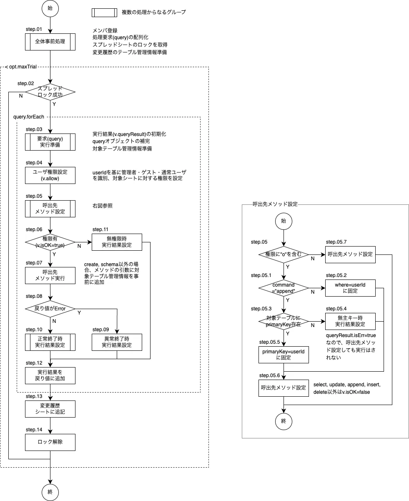

# <a name="d4369fcf4044">SpreadDb 1.2.0</a>


## <a name="3eca2504fb57">概要</a>

  - 手順

    - スプレッドシートを凍結
    - queryで渡された操作要求を順次処理
    - 権限確認後、command系内部関数の呼び出し
    - 結果を実行結果オブジェクトに保存
    - 実行結果オブジェクトの配列を変更履歴シートに追記
    - スプレッドシートの凍結解除
  - 引数
    - query {[sdbQuery](#1e80990a7c63)[]} 操作要求、またはその配列
    - opt {[sdbOption](#a4a26014ccb3)}={} 起動時オプション
  - 戻り値 {[sdbMain](#b03c5ccd2f8f)}

## <a name="6f8d7dc5cd54">使用例</a>


## <a name="a9f01a749b53">内部関数 - 非command系</a>


### <a name="f783913fe275">genTable() : sdbTableオブジェクトを生成</a>

  - 引数
    - arg {Object}
      - name {string} - テーブル名
      - [cols] {[sdbColumn](#df5b3c98954e)[]} - 新規作成シートの項目定義オブジェクトの配列
      - [values] {Object[]|Array[]} - 新規作成シートに書き込む初期値
行オブジェクトの配列、またはシートイメージ(プリミティブ型二次元配列)

  - 戻り値 {[sdbTable](#976403e08f0e)}

### <a name="74c07b6144cd">genSchema() : sdbSchemaオブジェクトを生成</a>

  - 引数
    - arg {Object}
      - cols {[sdbColumn](#df5b3c98954e)[]} - 項目定義オブジェクトの配列
      - header {string[]} - ヘッダ行のシートイメージ(=項目名一覧)
      - notes {string[]} - 項目定義メモの配列
      - values {Object[]} - 初期データとなる行オブジェクトの配列
  - 戻り値 {[sdbGenSchema](#2609271977a8)}

### <a name="a8e56dd4e3c7">genColumn() : sdbColumnオブジェクトを生成</a>

  - 引数
    - arg {string|[sdbColumn](#df5b3c98954e)} シート上のメモの文字列またはsdbColumn
  - 戻り値 {Object}
    - column {[sdbColumn](#df5b3c98954e)} 項目の定義情報
    - note {string} シート上のメモの文字列

### <a name="6fb9aba6d9f9">genLog() : sdbLogオブジェクトを生成</a>

  - 引数
    - arg {Object.&lt;string,any&gt;} [sdbLog](#dab8cfcec9d8)に個別設定するメンバ名と値
  - 戻り値 {[sdbLog](#dab8cfcec9d8)}

### <a name="e65032ddce65">convertRow() : シートイメージと行オブジェクトの相互変換</a>

  - 引数
    - data {any[][]|Object[]} 行データ。シートイメージか行オブジェクトの配列
    - [header] {string[]}=[] - ヘッダ行。rowが行オブジェクトで項目の並びを指定したい場合に使用
  - 戻り値 {[sdbConvertRow](#01ee6b06c8a6)}

### <a name="6d09e5d0363d">functionalize() : オブジェクト・文字列を基にObject/stringを関数化</a>

  - 引数
    - arg
      - table {[sdbTable](#976403e08f0e)} 呼出元で処理対象としているテーブル
      - data {Object|function|string} 関数化するオブジェクトor文字列
引数のデータ型により以下のように処理分岐

- Object ⇒ {キー項目名:キー項目の値}形式で、key:valueに該当するレコードを更新
- Function ⇒ 行オブジェクトを引数に対象ならtrueを返す関数で、trueが返されたレコードを更新
- string
  - 無名関数またはアロー関数のソース文字列 ⇒ new Functionで関数化
  - その他 ⇒ 項目定義で"primaryKey"を指定した項目の値

  - 戻り値 {function}

## <a name="250e0f646160">内部関数 - command系</a>


### <a name="77304ebfbc33">createTable() : データから新規テーブルを生成</a>

管理者のみ実行可
  - 引数 : [genTable()の引数](#ea8faab5f9f2)と同じ
  - 戻り値 {[sdbLog](#dab8cfcec9d8)}

### <a name="a8ac2d5e7372">selectRow() : テーブルから条件に合致する行を抽出</a>

  - 引数
    - arg {Object|Object[]}
      - table {[sdbTable](#976403e08f0e)} 操作対象のテーブル管理情報
      - [where](#741ee9383b92) {Object|Function|string} 対象レコードの判定条件
  - 戻り値 {Object[]} 該当行オブジェクトの配列

### <a name="206036f40579">updateRow() : テーブルを更新</a>

  - 引数
    - arg {Object}
argの配列は使用しない。同一テーブルでも複数の条件で更新する場合、SpreadDb.arg.query自体を別オブジェクトで用意する
      - table {[sdbTable](#976403e08f0e)} 操作対象のテーブル管理情報
      - [where](#741ee9383b92) {Object|Function|string} 対象レコードの判定条件
      - [record](#58dde3944536) {Object|string|Function} 更新する値
  - 戻り値 {[sdbLog](#dab8cfcec9d8)[]}

### <a name="288276ee622d">appendRow() : テーブルに新規行を追加</a>

  - 引数
    - arg {Object|Object[]}
      - table {[sdbTable](#976403e08f0e)} 操作対象のテーブル管理情報
      - [record](#58dde3944536) {Object|Object[]} 追加する行オブジェクト
  - 戻り値 {[sdbLog](#dab8cfcec9d8)[]}

### <a name="30d4aa5c9fd7">deleteRow() : テーブルから条件に合致する行を削除</a>

  - 引数
    - arg {Object|Object[]}
      - table {[sdbTable](#976403e08f0e)} 操作対象のテーブル管理情報
      - [where](#741ee9383b92) {Object|Function|string} 対象レコードの判定条件
  - 戻り値 {[sdbLog](#dab8cfcec9d8)[]}

### <a name="701a78c34e0a">getSchema() : 指定されたテーブルの構造情報を取得</a>

  - 引数
    - arg {string|string[]} 取得対象テーブル名
  - 戻り値 {Object.&lt;string,[sdbColumn](#df5b3c98954e)[]&gt;} {テーブル名：項目定義オブジェクトの配列}形式

## <a name="5a75202c3db4">typedefs</a>


### <a name="fa77053faee2">メンバ(pv = private variables)</a>

  - whois {string} 'SpreadDb'固定
  - opt {[sdbOption](#a4a26014ccb3)} 起動時オプション
  - spread {<a href="https://developers.google.com/apps-script/reference/spreadsheet/spreadsheet?hl=ja">Spread</a>} スプレッドシートオブジェクト
  - table {Object.&lt;string,[sdbTable](#976403e08f0e)&gt;} スプレッドシート上の各テーブル(領域)の情報
  - log {[sdbLog](#dab8cfcec9d8)[]}=[] 更新履歴シートオブジェクト

### <a name="1e80990a7c63">sdbQuery {Object[]} 操作要求の内容</a>

以下、行頭の「crudas」はコマンドの種類により必要となるパラメータ。'r'はselect(read)

  - table {string|string[]} 操作対象テーブル名
全commandで使用。command='schema'の場合、取得対象テーブル名またはその配列

  - command {string} 操作名
全commandで使用。「[commandの種類とrwdos文字列によるアクセス制御](#0055bda95f77)」参照
  - cols {[sdbColumn](#df5b3c98954e)[]} - 新規作成シートの項目定義オブジェクトの配列
command='create'のみで使用
  - values {Object[]|Array[]} - 新規作成シートに書き込む初期値
command='create'のみで使用
  - [where](#741ee9383b92) {Object|Function|string} 対象レコードの判定条件
command='select','update','delete'で使用
  - [record](#58dde3944536) {Object|Function} 追加・更新する値
command='update','append'で使用
  - isErr {boolean}=false command系メソッドで設定。対象レコード全てが正常終了ならfalse
一つのqueryで複数の処理を指示した場合(ex.複数レコードの追加)、いずれか一つでもエラーになればisErrはtrueとなる。

### <a name="a4a26014ccb3">sdbOption {Object} オプション</a>

  - userId {string}='guest' ユーザの識別子
指定する場合、必ずuserAuthも併せて指定
  - userAuth {Object.&lt;string,string&gt;}={} テーブル毎のアクセス権限。<code>{シート名:rwdos文字列}</code> 形式
r:select(read), w:write, d:delete, s:schema, o:own only(指定シートのprimaryKeyがuserIdと一致するレコードのみ参照・変更可。削除不可)。追加はwがあれば可

o(own record only)の指定は他の'rwdos'に優先、'o'のみの指定と看做す(rwds指定は有っても無視)。
また検索対象テーブルはprimaryKey要設定、検索条件もprimaryKeyの値のみ指定可
read/writeは自分のみ可、delete/schemaは実行不可

  - log {string}='log' 更新履歴テーブル名
nullの場合、ログ出力は行わない。領域名 &gt; A1記法 &gt; シート名の順に解釈
  - maxTrial {number}=5 テーブル更新時、ロックされていた場合の最大試行回数
  - interval {number}=10000 テーブル更新時、ロックされていた場合の試行間隔(ミリ秒)
  - guestAuth {Object.&lt;string,string&gt;}={} ゲストに付与する権限。<code>{シート名:rwdos文字列}</code> 形式
  - adminId {string}='Administrator' 管理者として扱うuserId
管理者は全てのシートの全権限を持つ


### <a name="976403e08f0e">sdbTable {Object} テーブルの管理情報</a>

  - name {string} テーブル名(範囲名)
  - account {string} 更新者のアカウント(識別子)
  - sheet {<a href="https://developers.google.com/apps-script/reference/spreadsheet/sheet?hl=ja">Sheet</a>} スプレッドシート内の操作対象シート(ex."master"シート)
  - schema {[sdbSchema](#7b012b226f8e)} シートの項目定義
  - values {Object[]} 行オブジェクトの配列。<code>{項目名:値,..}</code> 形式
  - header {string[]} 項目名一覧(ヘッダ行)
  - notes {string[]} ヘッダ行のメモ
  - colnum {number} データ領域の列数
  - rownum {number} データ領域の行数(ヘッダ行は含まず)

### <a name="7b012b226f8e">sdbSchema {Object} テーブルの構造情報</a>

  - cols {[sdbColumn](#df5b3c98954e)[]} 項目定義オブジェクトの配列
  - primaryKey {string}='id' 一意キー項目名
  - unique {Object.&lt;string, any[]&gt;} primaryKeyおよびunique属性項目の管理情報
メンバ名はprimaryKey/uniqueの項目名

  - auto_increment {Object.&lt;string,Object&gt;} auto_increment属性項目の管理情報
メンバ名はauto_incrementの項目名

    - start {number} 開始値
    - step {number} 増減値
    - current {number} 現在の最大(小)値
currentはsdbTableインスタンスで操作する。
  - defaultRow {Object|function} 既定値項目で構成されたオブジェクト。appendの際のプロトタイプ

### <a name="df5b3c98954e">sdbColumn {Object} 項目の構造情報</a>

= シート上のメモの文字列
  - name {string} 項目名
  - type {string} データ型。string,number,boolean,Date,JSON,UUID
  - format {string} 表示形式。type=Dateの場合のみ指定
  - options {string} 取り得る選択肢(配列)のJSON表現
ex. ["未入場","既収","未収","無料"]
  - default {function} 既定値を取得する関数。引数は当該行オブジェクト
指定の際は必ず<code>{〜}</code> で囲み、return文を付与のこと。
ex.<code>o =&gt; {return toLocale(new Date())}</code> 

  - primaryKey {boolean}=false 一意キー項目ならtrue
  - unique {boolean}=false primaryKey以外で一意な値を持つならtrue
  - auto_increment {bloolean|null|number|number[]}=false 自動採番項目
null ⇒ 自動採番しない
boolean ⇒ true:自動採番する(基数=1,増減値=1)、false:自動採番しない
number ⇒ 自動採番する(基数=指定値,増減値=1)
number[] ⇒ 自動採番する(基数=添字0,増減値=添字1)
object ⇒ {start:m,step:n}形式
  - suffix {string} "not null"等、上記以外のSQLのcreate table文のフィールド制約
  - note {string} 本項目に関する備考
ローカル側のcreate table等では使用しない

### <a name="dab8cfcec9d8">sdbLog {Object} 更新履歴オブジェクト</a>

  - timestamp {string}=toLocale(new Date()) 更新日時(ISO8601拡張形式)
  - userId {string|number} uuid等、更新者の識別子
  - table {string} 更新対象テーブル名
  - command {string} 操作内容
設定内容は「[commandの種類とrwdos文字列によるアクセス制御](#0055bda95f77)」参照
  - argument {string} 操作関数に渡された引数(JSON)
  - ErrCD {string} エラーコード
rev.1.1.0 isErrとmessageを合併

  - before {JSON} 更新前の行データオブジェクト(JSON)
  - after {JSON} 更新後の行データオブジェクト(JSON)
  - diff {JSON} 追加の場合は行オブジェクト、更新の場合は差分情報
{項目名：[更新前,更新後],...}形式

### <a name="b03c5ccd2f8f">sdbMain {Object[]} 主処理、ひいてはSpreadDb全体の戻り値</a>

  - query {[sdbQuery](#1e80990a7c63)[]} 引数として渡されたqueryのコピー
  - row {Object[]}=null selectの該当行オブジェクトの配列
該当無しの場合、row.length===0
  - schema {Object.&lt;string,[sdbColumn](#df5b3c98954e)[]&gt;} schemaで取得した{テーブル名：項目定義オブジェクトの配列}形式のオブジェクト
  - log {[sdbLog](#dab8cfcec9d8)[]} 更新履歴
update,deleteで該当無しの場合、log.length===0


### <a name="2609271977a8">sdbGenSchema {Object} genSchemaの戻り値</a>

sdbSchemaにメモ情報を付加
  - schema {[sdbSchema](#7b012b226f8e)}
  - notes {string[]} ヘッダ行に対応したメモ

### <a name="01ee6b06c8a6">sdbConvertRow {Object} convertRowの戻り値</a>

  - raw {any[][]} シートイメージ
  - obj {Object[]} 行オブジェクトの配列
  - header {string} ヘッダ行

## <a name="235f8a9e77af">variables</a>

複数属性が定義され、内容によって意味が変わる変数の解説

### <a name="741ee9383b92">where {Object|Function|string} 対象レコードの判定条件</a>

- Object ⇒ {キー項目名:キー項目の値}形式で、key:valueに該当するレコードを更新
- function ⇒ 行オブジェクトを引数に対象ならtrueを返す関数で、trueが返されたレコードを更新
- string
  - 無名関数またはアロー関数のソース文字列 ⇒ new Functionで関数化。<code>{〜}</code> で囲みreturn文を付与。
  - その他 ⇒ 項目定義で"primaryKey"を指定した項目の値
- その他(Object,function,string以外) ⇒ 項目定義で"primaryKey"を指定した項目の値


### <a name="58dde3944536">record {Object|string|Function} 更新する値</a>

record句の指定方法
- Object ⇒ appendなら行オブジェクト、updateなら{更新対象項目名:セットする値}
- string ⇒ 上記Objectに変換可能なJSON文字列
- Function ⇒ 行オブジェクトを引数に、上記Objectを返す関数
  【例】abc欄にfuga+hogeの値をセットする : {func: o=&gt;{return {abc:(o.fuga||0)+(o.hoge||0)}}}

## <a name="56eaf36cc785">用語解説、注意事項</a>


### <a name="2df536ff0f8d">関数での抽出条件・値の指定時の制約</a>

default(sdbColumn), where, record(update他)では関数での指定を可能にしている。
これらをセル・メモで保存する場合、文字列に変換する必要があるが、以下のルールで対応する。

- 引数は行オブジェクトのみ(引数は必ず一つ)
- 関数に復元する場合`new Function('o',[ロジック部分文字列])で関数化
  - 必ず"{〜}"で囲み、return文を付ける


### <a name="0055bda95f77">commandの種類とrwdos文字列によるアクセス制御</a>

commandの種類は下表の通り。&lt;br&gt;
"rwdos"とは"Read/Write/Delete/Own/Schema"の頭文字。管理者のみ実行可能な"c"(createTable)と特殊権限"o"を加えてシート毎のアクセス制御を行う。

内容 | command | rwdos
:-- | :-- | :-- 
テーブル生成 | create | c
参照 | select | r
更新 | update | rw
追加 | append/insert | w
削除 | delete | d
テーブル管理情報取得 | schema | s

特殊権限'o' : イベント申込情報等、本人以外の参照・更新を抑止するためのアクセス権限。
- `userAuth:{シート名:o}`が指定された場合、当該シートのprimaryKey=userIdとなっているレコードのみ'r','w'可と看做す。
- 'o'指定が有るシートのアクセス権として'rwds'が指定されていても'o'のみ指定されたと看做す
- 'o'指定でselect/updateする場合、where句は無視され自情報に対する処理要求と看做す
  ex. userId=2の人がuserId=1の人の氏名の更新を要求 ⇒ userId=2の氏名が更新される
  ```
  SpreadDb(
    {table:'camp2024',command:'update',where:1,record:{'申込者氏名':'テスト'}},
    {userId:2,userAuth:{camp2024:'o'}}
  ); // -&gt; userId=2の氏名が「テスト」に
  ```

## <a name="d154b1fe324f">更新履歴</a>

- rev.1.2.0 : 2025/01/04〜
  - エラー発生時、messageではなくエラーコードで返すよう変更
  - 1つの処理要求(query)で複数レコードを対象とする場合、一レコードでもエラーが発生したらエラーに
  - 変更履歴シートのUUIDは削除
