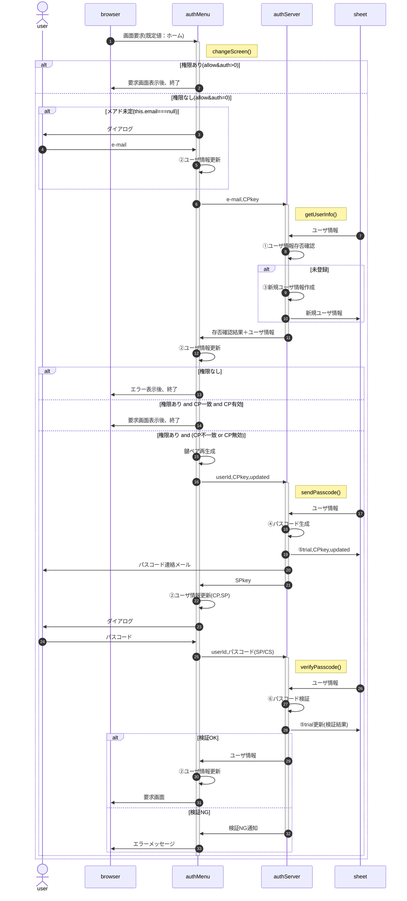

# 画面切替

- ①ユーザ情報存否確認
  - e-mailが登録済 ? 登録済 : 未登録
  - 復号化したCPkeyがシート上のCPkeyと一致 ? CP一致 : CP不一致
  - CPkey生成・更新日時＋CPkey有効期間 > Date.now() ? CP有効 : CP無効

## typedef

| 名称 | 属性 | 内容 | loc | ses | mem | I/O | sht |
| :-- | :-- | :-- | :--: | :--: | :--: | :--: | :--: |
| userId | number | (新規採番された)ユーザID | ◎ | ◎ | ◎ | ◎ | ◎ |
| created | string | ユーザID新規登録時刻(日時文字列) | × | × | × | × | ◎ |
| email | string | ユーザの連絡先メールアドレス | × | ◎ | ◎ | × | ◎ |
| auth | number | ユーザの権限 | × | ◎ | ◎ | ◎ | ◎ |
| passPhrase | string | クライアント側鍵ペア生成のパスフレーズ | × | ◎ | × | × | × |
| CSkey | object | クライアント側の秘密鍵 | × | × | ◎ | × | × |
| CPkey | string | クライアント側の公開鍵 | × | ◎ | ◎ | × | ◎ |
| updated | string | クライアント側公開鍵生成時刻(日時文字列) | × | ◎ | ◎ | × | ◎ |
| SPkey | string | サーバ側の公開鍵 | × | ◎ | ◎ | ◎ | × |
| isExist | boolean | 新規登録対象メアドが登録済ならtrue | × | × | × | ◎ | × |
| trial | object | ログイン試行関係情報 | × | × | × | ▲ | ◎ |

| 名称 | 属性 | 内容 | I/O |
| :-- | :-- | :-- | :-- |
| startAt | number | 試行開始日時(UNIX時刻) | × |
| passcode | number | パスコード(原則数値6桁) | × |
| log | object[] | 試行の記録。unshiftで先頭を最新にする | × |
| timestamp | number | 試行日時(UNIX時刻) | × |
| entered | number | 入力されたパスコード | × |
| result | boolean | パスコードと入力値の比較結果(true:OK) | × |
| status | string | NGの場合の理由。'OK':試行OK | × |
| endAt | number | 試行終了日時(UNIX時刻) | × |
| result | boolean | 試行の結果(true:OK) | ◎ |
| unfreeze | number | ログイン連続失敗後、凍結解除される日時(UNIX時刻) | ◎ |
- loc : localStorage
- ses : sessionStorage
- mem : authMenuインスタンス変数(メンバ)
- I/O : authServer -> authMenuへ送られるオブジェクト
- sht : シート