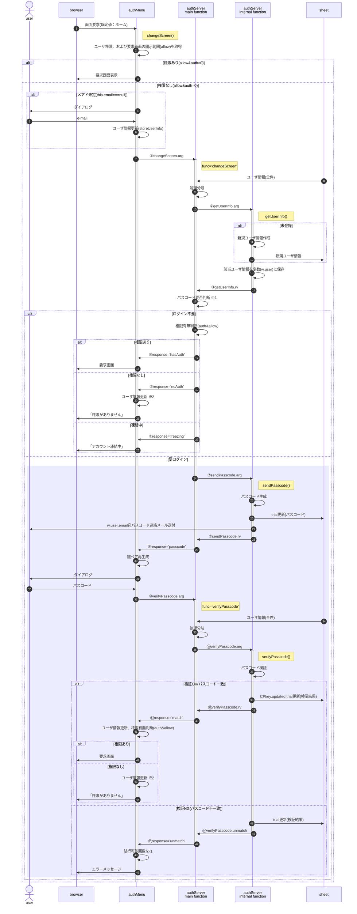

# 新規ユーザ登録、画面切替

「画面切替」はサーバ側に開示範囲(allow)を渡し、シート上のユーザ権限(auth)と比較することで「要求画面を表示する権限が存在するか」を確認し、クライアント側でサーバ側の確認結果に基づき画面切替を行う。

新規ユーザ登録は「応募情報表示・編集画面に切り替える」という画面切替の一般事例に「シート上にユーザ情報が存在しなければ追加」という手順を追加することで、画面切替の特殊事例として扱う。

- ※1 : パスコード要否判断：いかのいずれかの場合、パスコードが必要
  - 新規ユーザ登録
  - パスコード生成からログインまでの猶予時間を過ぎている
  - クライアント側ログイン(CPkey)有効期限切れ
  - 引数のCPkeyがシート上のCPkeyと不一致
- ※2 : 権限が無いのにサーバまで問合せが来るのは、クライアント側の権限情報が誤っている可能性があるため、念のため更新する。

<iframe width="100%" height="500px" src="changeScreen.html"></iframe>
<!--
原本(Google Spread)
MyDrive > fy2024 > 2024mmdd_camp2024 > camp2024.gsheet > changeScreenシート
https://docs.google.com/spreadsheets/d/1wizrYCTnFbRpi38gJ3ZIdXtC3lV7NfEcQGkuj6-E0Jk/edit#gid=0
-->

<!--
## typedef

| 名称 | 属性 | 内容 | loc | ses | mem | I/O | sht |
| :-- | :-- | :-- | :--: | :--: | :--: | :--: | :--: |
| userId | number | (新規採番された)ユーザID | ◎ | ◎ | ◎ | ◎ | ◎ |
| created | string | ユーザID新規登録時刻(日時文字列) | × | × | × | × | ◎ |
| email | string | ユーザの連絡先メールアドレス | × | ◎ | ◎ | × | ◎ |
| auth | number | ユーザの権限 | × | ◎ | ◎ | ◎ | ◎ |
| passPhrase | string | クライアント側鍵ペア生成のパスフレーズ | × | ◎ | × | × | × |
| CSkey | object | クライアント側の秘密鍵 | × | × | ◎ | × | × |
| CPkey | string | クライアント側の公開鍵 | × | ◎ | ◎ | × | ◎ |
| updated | string | クライアント側公開鍵生成時刻(日時文字列) | × | ◎ | ◎ | × | ◎ |
| SPkey | string | サーバ側の公開鍵 | × | ◎ | ◎ | ◎ | × |
| isExist | boolean | 新規登録対象メアドが登録済ならtrue | × | × | × | ◎ | × |
| trial | object | ログイン試行関係情報 | × | × | × | ▲ | ◎ |

| 名称 | 属性 | 内容 | I/O |
| :-- | :-- | :-- | :-- |
| startAt | number | 試行開始日時(UNIX時刻) | × |
| passcode | number | パスコード(原則数値6桁) | × |
| log | object[] | 試行の記録。unshiftで先頭を最新にする | × |
| timestamp | number | 試行日時(UNIX時刻) | × |
| entered | number | 入力されたパスコード | × |
| result | boolean | パスコードと入力値の比較結果(true:OK) | × |
| status | string | NGの場合の理由。'OK':試行OK | × |
| endAt | number | 試行終了日時(UNIX時刻) | × |
| result | boolean | 試行の結果(true:OK) | ◎ |
| unfreeze | number | ログイン連続失敗後、凍結解除される日時(UNIX時刻) | ◎ |
- loc : localStorage
- ses : sessionStorage
- mem : authMenuインスタンス変数(メンバ)
- I/O : authServer -> authMenuへ送られるオブジェクト
- sht : シート
-->