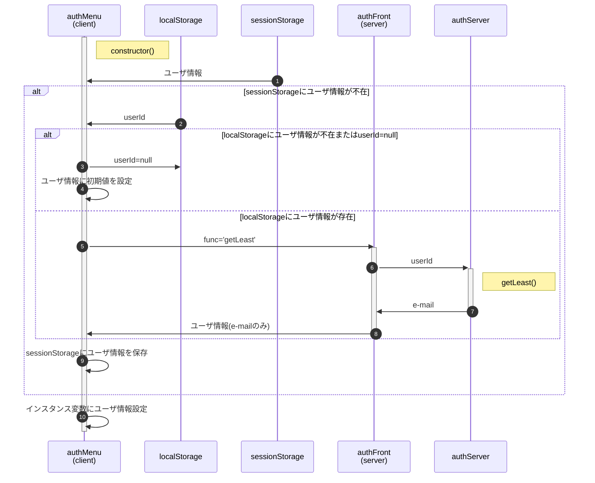
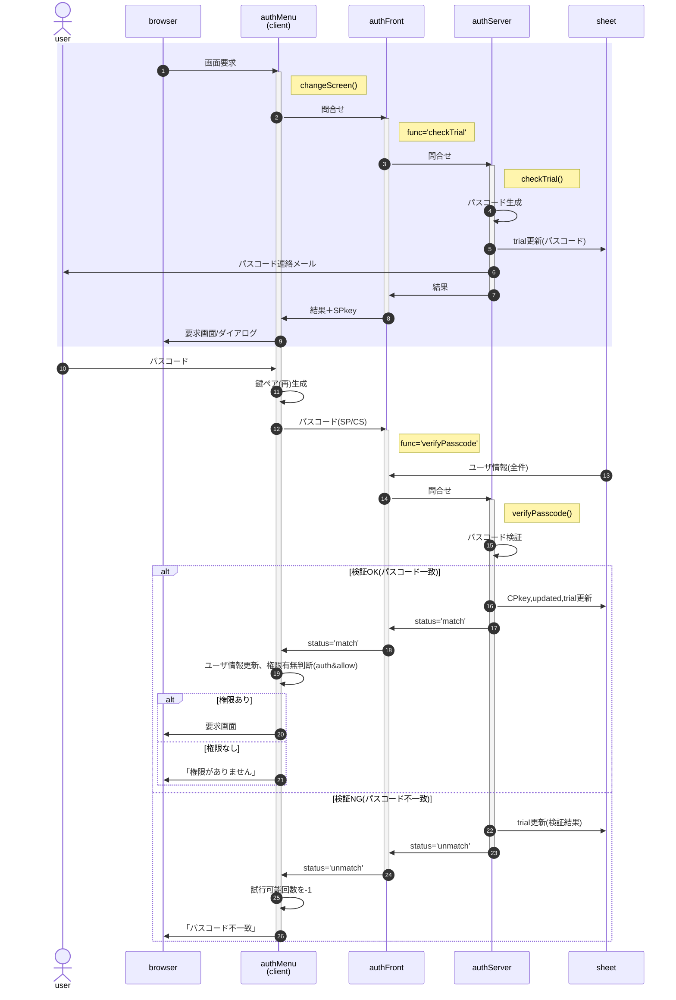
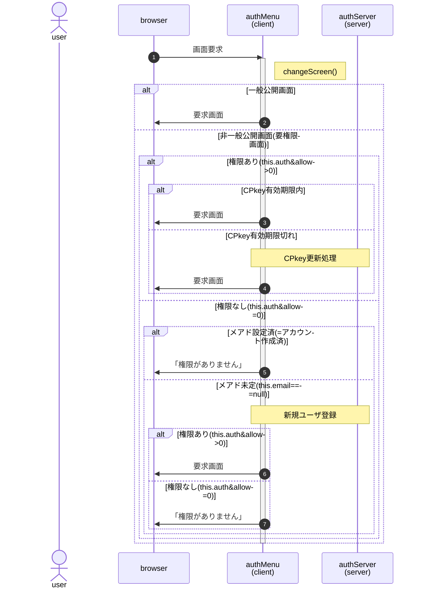

<!--
引数・戻り値型定義情報　原本(Google Spread)
ena.kaon > MyDrive > projects > GitHub > library > typeDefs > typeDefs.gsheet
https://docs.google.com/spreadsheets/d/1XN7p14-Hyo2DCu76A0I6UXjUxLlKtfP9697UxjS-7ys/edit#gid=207341953
-->

- authMenu機能群 [授受データ型定義情報](https://script.google.com/macros/s/AKfycbxEG0HhYdS9Yo7g5biJfVLgy_YTjR6NuhwNZc4YXB8/dev?pId=4)

# 事前処理

新規プロジェクト(スプレッドシート)作成時、GASでsetProperties()を行い、サーバ側の設定をDocumentPropertiesに保存する。

# 初期化処理

authMenuインスタンス化時点で以下の処理を行う。



- 「ユーザ情報が不在」とは`xxxxStorage.getItem('auth') === null`を指す
- 「ユーザ情報の初期値」とは`{userId=null,email=null,auth=defaultAuth,CPkey=null}`を指す
- 'defaultAuth'とはサーバ側で保持する「一般公開部分(のみ)の閲覧権限」<br>
  本来サーバ側設定なので問い合わせが必要だが、簡易化のため"1"固定とする。
- authMenuインスタンス生成時点では一般公開のみの利用者である可能性に鑑み、SPkeyの取得は行わない


# 新規ユーザ登録、画面切替

「画面切替」はdivのdata-menu属性に設定されている開示範囲(allow)と、ユーザ権限(authMenu.auth)と比較することで「要求画面を表示する権限が存在するか」を確認し、結果に基づき画面を表示するか判断する。

新規ユーザ登録は「応募情報表示・編集画面に切り替える」という画面切替の一般事例に「シート上にユーザ情報が存在しなければ追加」という手順を追加することで、画面切替の特殊事例として扱う。

## 処理の流れ

- 紫の部分の詳細はフローチャートで後掲



## authMenu.changeScreen 処理概要

<svg xmlns="http://www.w3.org/2000/svg" xmlns:xlink="http://www.w3.org/1999/xlink" version="1.1" width="682px" height="481px" viewBox="-0.5 -0.5 682 481"><defs/><g><g><path d="M 61 120 L 61 460 L 473.13 460" fill="none" stroke="rgb(0, 0, 0)" stroke-miterlimit="10" pointer-events="stroke"/><path d="M 479.88 460 L 470.88 464.5 L 473.13 460 L 470.88 455.5 Z" fill="rgb(0, 0, 0)" stroke="rgb(0, 0, 0)" stroke-miterlimit="10" pointer-events="all"/></g><g><path d="M 61 80 L 121 100 L 61 120 L 1 100 Z" fill="rgb(255, 255, 255)" stroke="rgb(0, 0, 0)" stroke-width="2" stroke-miterlimit="10" pointer-events="all"/></g><g><g transform="translate(-0.5 -0.5)"><switch><foreignObject pointer-events="none" width="100%" height="100%" requiredFeatures="http://www.w3.org/TR/SVG11/feature#Extensibility" style="overflow: visible; text-align: left;"><div xmlns="http://www.w3.org/1999/xhtml" style="display: flex; align-items: unsafe center; justify-content: unsafe center; width: 118px; height: 1px; padding-top: 100px; margin-left: 2px;"><div data-drawio-colors="color: rgb(0, 0, 0); " style="box-sizing: border-box; font-size: 0px; text-align: center;"><div style="display: inline-block; font-size: 12px; font-family: Helvetica; color: rgb(0, 0, 0); line-height: 1.2; pointer-events: all; white-space: normal; overflow-wrap: normal;">開示範囲</div></div></div></foreignObject><text x="61" y="104" fill="rgb(0, 0, 0)" font-family="Helvetica" font-size="12px" text-anchor="middle">開示範囲</text></switch></g></g><g><rect x="61" y="120" width="80" height="40" fill="none" stroke="none" pointer-events="all"/></g><g><g transform="translate(-0.5 -0.5)"><switch><foreignObject pointer-events="none" width="100%" height="100%" requiredFeatures="http://www.w3.org/TR/SVG11/feature#Extensibility" style="overflow: visible; text-align: left;"><div xmlns="http://www.w3.org/1999/xhtml" style="display: flex; align-items: unsafe center; justify-content: unsafe center; width: 78px; height: 1px; padding-top: 140px; margin-left: 62px;"><div data-drawio-colors="color: rgb(0, 0, 0); " style="box-sizing: border-box; font-size: 0px; text-align: center;"><div style="display: inline-block; font-size: 16px; font-family: Helvetica; color: rgb(0, 0, 0); line-height: 1.2; pointer-events: all; white-space: normal; overflow-wrap: normal;"><font style="font-size: 12px;">一般公開</font><div><font style="font-size: 12px;">(allow&amp;1&gt;0)</font></div></div></div></div></foreignObject><text x="101" y="145" fill="rgb(0, 0, 0)" font-family="Helvetica" font-size="16px" text-anchor="middle">一般公開(allow&amp;1&gt;0...</text></switch></g></g><g><rect x="91" y="50" width="80" height="40" fill="none" stroke="none" pointer-events="all"/></g><g><g transform="translate(-0.5 -0.5)"><switch><foreignObject pointer-events="none" width="100%" height="100%" requiredFeatures="http://www.w3.org/TR/SVG11/feature#Extensibility" style="overflow: visible; text-align: left;"><div xmlns="http://www.w3.org/1999/xhtml" style="display: flex; align-items: unsafe center; justify-content: unsafe center; width: 78px; height: 1px; padding-top: 70px; margin-left: 92px;"><div data-drawio-colors="color: rgb(0, 0, 0); " style="box-sizing: border-box; font-size: 0px; text-align: center;"><div style="display: inline-block; font-size: 16px; font-family: Helvetica; color: rgb(0, 0, 0); line-height: 1.2; pointer-events: all; white-space: normal; overflow-wrap: normal;"><font style="font-size: 12px;">限定公開</font><div><font style="font-size: 12px;">(allow&amp;1=0)</font></div></div></div></div></foreignObject><text x="131" y="75" fill="rgb(0, 0, 0)" font-family="Helvetica" font-size="16px" text-anchor="middle">限定公開(allow&amp;1=0...</text></switch></g></g><g><path d="M 221 80 L 281 100 L 221 120 L 161 100 Z" fill="rgb(255, 255, 255)" stroke="rgb(0, 0, 0)" stroke-width="2" stroke-miterlimit="10" pointer-events="all"/></g><g><g transform="translate(-0.5 -0.5)"><switch><foreignObject pointer-events="none" width="100%" height="100%" requiredFeatures="http://www.w3.org/TR/SVG11/feature#Extensibility" style="overflow: visible; text-align: left;"><div xmlns="http://www.w3.org/1999/xhtml" style="display: flex; align-items: unsafe center; justify-content: unsafe center; width: 118px; height: 1px; padding-top: 100px; margin-left: 162px;"><div data-drawio-colors="color: rgb(0, 0, 0); " style="box-sizing: border-box; font-size: 0px; text-align: center;"><div style="display: inline-block; font-size: 12px; font-family: Helvetica; color: rgb(0, 0, 0); line-height: 1.2; pointer-events: all; white-space: normal; overflow-wrap: normal;">シート登録済？</div></div></div></foreignObject><text x="221" y="104" fill="rgb(0, 0, 0)" font-family="Helvetica" font-size="12px" text-anchor="middle">シート登録済？</text></switch></g></g><g><path d="M 121 100 L 142 100.5 L 153.13 100.21" fill="none" stroke="rgb(0, 0, 0)" stroke-miterlimit="10" pointer-events="stroke"/><path d="M 159.88 100.03 L 151 104.76 L 153.13 100.21 L 150.77 95.77 Z" fill="rgb(0, 0, 0)" stroke="rgb(0, 0, 0)" stroke-miterlimit="10" pointer-events="all"/></g><g><rect x="221" y="120" width="80" height="40" fill="none" stroke="none" pointer-events="all"/></g><g><g transform="translate(-0.5 -0.5)"><switch><foreignObject pointer-events="none" width="100%" height="100%" requiredFeatures="http://www.w3.org/TR/SVG11/feature#Extensibility" style="overflow: visible; text-align: left;"><div xmlns="http://www.w3.org/1999/xhtml" style="display: flex; align-items: unsafe center; justify-content: unsafe flex-start; width: 78px; height: 1px; padding-top: 140px; margin-left: 223px;"><div data-drawio-colors="color: rgb(0, 0, 0); " style="box-sizing: border-box; font-size: 0px; text-align: left;"><div style="display: inline-block; font-size: 16px; font-family: Helvetica; color: rgb(0, 0, 0); line-height: 1.2; pointer-events: all; white-space: normal; overflow-wrap: normal;"><span style="font-size: 12px;">登録済</span><div><span style="font-size: 12px;">(SPkey!=null)</span></div></div></div></div></foreignObject><text x="223" y="145" fill="rgb(0, 0, 0)" font-family="Helvetica" font-size="16px">登録済(SPkey!=nu...</text></switch></g></g><g><rect x="261" y="50" width="80" height="40" fill="none" stroke="none" pointer-events="all"/></g><g><g transform="translate(-0.5 -0.5)"><switch><foreignObject pointer-events="none" width="100%" height="100%" requiredFeatures="http://www.w3.org/TR/SVG11/feature#Extensibility" style="overflow: visible; text-align: left;"><div xmlns="http://www.w3.org/1999/xhtml" style="display: flex; align-items: unsafe center; justify-content: unsafe center; width: 78px; height: 1px; padding-top: 70px; margin-left: 262px;"><div data-drawio-colors="color: rgb(0, 0, 0); " style="box-sizing: border-box; font-size: 0px; text-align: center;"><div style="display: inline-block; font-size: 16px; font-family: Helvetica; color: rgb(0, 0, 0); line-height: 1.2; pointer-events: all; white-space: normal; overflow-wrap: normal;"><span style="font-size: 12px;">未登録</span><div><span style="font-size: 12px;">(SPkey=null)</span></div></div></div></div></foreignObject><text x="301" y="75" fill="rgb(0, 0, 0)" font-family="Helvetica" font-size="16px" text-anchor="middle">未登録(SPkey=nul...</text></switch></g></g><g><path d="M 281 100 L 301 100 L 313.13 100" fill="none" stroke="rgb(0, 0, 0)" stroke-miterlimit="10" pointer-events="stroke"/><path d="M 319.88 100 L 310.88 104.5 L 313.13 100 L 310.88 95.5 Z" fill="rgb(0, 0, 0)" stroke="rgb(0, 0, 0)" stroke-miterlimit="10" pointer-events="all"/></g><g><path d="M 441 400 L 473.13 400" fill="none" stroke="rgb(0, 0, 0)" stroke-miterlimit="10" pointer-events="stroke"/><path d="M 479.88 400 L 470.88 404.5 L 473.13 400 L 470.88 395.5 Z" fill="rgb(0, 0, 0)" stroke="rgb(0, 0, 0)" stroke-miterlimit="10" pointer-events="all"/></g><g><path d="M 381 420 L 381 460 L 473.13 460" fill="none" stroke="rgb(0, 0, 0)" stroke-miterlimit="10" pointer-events="stroke"/><path d="M 479.88 460 L 470.88 464.5 L 473.13 460 L 470.88 455.5 Z" fill="rgb(0, 0, 0)" stroke="rgb(0, 0, 0)" stroke-miterlimit="10" pointer-events="all"/></g><g><path d="M 381 380 L 441 400 L 381 420 L 321 400 Z" fill="rgb(255, 255, 255)" stroke="rgb(0, 0, 0)" stroke-width="2" stroke-miterlimit="10" pointer-events="all"/></g><g><g transform="translate(-0.5 -0.5)"><switch><foreignObject pointer-events="none" width="100%" height="100%" requiredFeatures="http://www.w3.org/TR/SVG11/feature#Extensibility" style="overflow: visible; text-align: left;"><div xmlns="http://www.w3.org/1999/xhtml" style="display: flex; align-items: unsafe center; justify-content: unsafe center; width: 118px; height: 1px; padding-top: 400px; margin-left: 322px;"><div data-drawio-colors="color: rgb(0, 0, 0); " style="box-sizing: border-box; font-size: 0px; text-align: center;"><div style="display: inline-block; font-size: 12px; font-family: Helvetica; color: rgb(0, 0, 0); line-height: 1.2; pointer-events: all; white-space: normal; overflow-wrap: normal;">権限</div></div></div></foreignObject><text x="381" y="404" fill="rgb(0, 0, 0)" font-family="Helvetica" font-size="12px" text-anchor="middle">権限</text></switch></g></g><g><rect x="301" y="410" width="80" height="50" fill="none" stroke="none" pointer-events="all"/></g><g><g transform="translate(-0.5 -0.5)"><switch><foreignObject pointer-events="none" width="100%" height="100%" requiredFeatures="http://www.w3.org/TR/SVG11/feature#Extensibility" style="overflow: visible; text-align: left;"><div xmlns="http://www.w3.org/1999/xhtml" style="display: flex; align-items: unsafe center; justify-content: unsafe center; width: 78px; height: 1px; padding-top: 435px; margin-left: 302px;"><div data-drawio-colors="color: rgb(0, 0, 0); " style="box-sizing: border-box; font-size: 0px; text-align: center;"><div style="display: inline-block; font-size: 16px; font-family: Helvetica; color: rgb(0, 0, 0); line-height: 1.2; pointer-events: all; white-space: normal; overflow-wrap: normal;"><span style="font-size: 12px;">有り</span><div><span style="font-size: 12px;">(auth&amp;allow&gt;0)</span></div></div></div></div></foreignObject><text x="341" y="440" fill="rgb(0, 0, 0)" font-family="Helvetica" font-size="16px" text-anchor="middle">有り(auth&amp;allo...</text></switch></g></g><g><rect x="411" y="370" width="40" height="20" fill="none" stroke="none" pointer-events="all"/></g><g><g transform="translate(-0.5 -0.5)"><switch><foreignObject pointer-events="none" width="100%" height="100%" requiredFeatures="http://www.w3.org/TR/SVG11/feature#Extensibility" style="overflow: visible; text-align: left;"><div xmlns="http://www.w3.org/1999/xhtml" style="display: flex; align-items: unsafe center; justify-content: unsafe center; width: 38px; height: 1px; padding-top: 380px; margin-left: 412px;"><div data-drawio-colors="color: rgb(0, 0, 0); " style="box-sizing: border-box; font-size: 0px; text-align: center;"><div style="display: inline-block; font-size: 16px; font-family: Helvetica; color: rgb(0, 0, 0); line-height: 1.2; pointer-events: all; white-space: normal; overflow-wrap: normal;"><span style="font-size: 12px; background-color: initial;">無し</span></div></div></div></foreignObject><text x="431" y="385" fill="rgb(0, 0, 0)" font-family="Helvetica" font-size="16px" text-anchor="middle">無し</text></switch></g></g><g><rect x="161" y="280" width="100" height="30" fill="none" stroke="none" pointer-events="all"/></g><g><g transform="translate(-0.5 -0.5)"><switch><foreignObject pointer-events="none" width="100%" height="100%" requiredFeatures="http://www.w3.org/TR/SVG11/feature#Extensibility" style="overflow: visible; text-align: left;"><div xmlns="http://www.w3.org/1999/xhtml" style="display: flex; align-items: unsafe center; justify-content: unsafe flex-start; width: 98px; height: 1px; padding-top: 295px; margin-left: 163px;"><div data-drawio-colors="color: rgb(0, 0, 0); background-color: rgb(255, 255, 255); " style="box-sizing: border-box; font-size: 0px; text-align: left;"><div style="display: inline-block; font-size: 12px; font-family: Helvetica; color: rgb(0, 0, 0); line-height: 1.2; pointer-events: all; background-color: rgb(255, 255, 255); white-space: normal; overflow-wrap: normal;">authServer.<div>checkTrial()</div></div></div></div></foreignObject><text x="163" y="299" fill="rgb(0, 0, 0)" font-family="Helvetica" font-size="12px">authServer....</text></switch></g></g><g><path d="M 281 180 L 313.13 180" fill="none" stroke="rgb(0, 0, 0)" stroke-miterlimit="10" pointer-events="stroke"/><path d="M 319.88 180 L 310.88 184.5 L 313.13 180 L 310.88 175.5 Z" fill="rgb(0, 0, 0)" stroke="rgb(0, 0, 0)" stroke-miterlimit="10" pointer-events="all"/></g><g><path d="M 221 200 L 221 232.13" fill="none" stroke="rgb(0, 0, 0)" stroke-miterlimit="10" pointer-events="stroke"/><path d="M 221 238.88 L 216.5 229.88 L 221 232.13 L 225.5 229.88 Z" fill="rgb(0, 0, 0)" stroke="rgb(0, 0, 0)" stroke-miterlimit="10" pointer-events="all"/></g><g><path d="M 221 160 L 281 180 L 221 200 L 161 180 Z" fill="rgb(255, 255, 255)" stroke="rgb(0, 0, 0)" stroke-width="2" stroke-miterlimit="10" pointer-events="all"/></g><g><g transform="translate(-0.5 -0.5)"><switch><foreignObject pointer-events="none" width="100%" height="100%" requiredFeatures="http://www.w3.org/TR/SVG11/feature#Extensibility" style="overflow: visible; text-align: left;"><div xmlns="http://www.w3.org/1999/xhtml" style="display: flex; align-items: unsafe center; justify-content: unsafe center; width: 118px; height: 1px; padding-top: 180px; margin-left: 162px;"><div data-drawio-colors="color: rgb(0, 0, 0); " style="box-sizing: border-box; font-size: 0px; text-align: center;"><div style="display: inline-block; font-size: 12px; font-family: Helvetica; color: rgb(0, 0, 0); line-height: 1.2; pointer-events: all; white-space: normal; overflow-wrap: normal;">CPkey</div></div></div></foreignObject><text x="221" y="184" fill="rgb(0, 0, 0)" font-family="Helvetica" font-size="12px" text-anchor="middle">CPkey</text></switch></g></g><g><rect x="181" y="200" width="40" height="20" fill="none" stroke="none" pointer-events="all"/></g><g><g transform="translate(-0.5 -0.5)"><switch><foreignObject pointer-events="none" width="100%" height="100%" requiredFeatures="http://www.w3.org/TR/SVG11/feature#Extensibility" style="overflow: visible; text-align: left;"><div xmlns="http://www.w3.org/1999/xhtml" style="display: flex; align-items: unsafe center; justify-content: unsafe center; width: 38px; height: 1px; padding-top: 210px; margin-left: 182px;"><div data-drawio-colors="color: rgb(0, 0, 0); " style="box-sizing: border-box; font-size: 0px; text-align: center;"><div style="display: inline-block; font-size: 16px; font-family: Helvetica; color: rgb(0, 0, 0); line-height: 1.2; pointer-events: all; white-space: normal; overflow-wrap: normal;"><span style="font-size: 12px;">有効</span></div></div></div></foreignObject><text x="201" y="215" fill="rgb(0, 0, 0)" font-family="Helvetica" font-size="16px" text-anchor="middle">有効</text></switch></g></g><g><rect x="281" y="180" width="40" height="20" fill="none" stroke="none" pointer-events="all"/></g><g><g transform="translate(-0.5 -0.5)"><switch><foreignObject pointer-events="none" width="100%" height="100%" requiredFeatures="http://www.w3.org/TR/SVG11/feature#Extensibility" style="overflow: visible; text-align: left;"><div xmlns="http://www.w3.org/1999/xhtml" style="display: flex; align-items: unsafe center; justify-content: unsafe center; width: 38px; height: 1px; padding-top: 190px; margin-left: 282px;"><div data-drawio-colors="color: rgb(0, 0, 0); " style="box-sizing: border-box; font-size: 0px; text-align: center;"><div style="display: inline-block; font-size: 16px; font-family: Helvetica; color: rgb(0, 0, 0); line-height: 1.2; pointer-events: all; white-space: normal; overflow-wrap: normal;"><span style="font-size: 12px;">無効</span></div></div></div></foreignObject><text x="301" y="195" fill="rgb(0, 0, 0)" font-family="Helvetica" font-size="16px" text-anchor="middle">無効</text></switch></g></g><g><path d="M 381 200 L 381 220 L 221 220 L 221 232.13" fill="none" stroke="rgb(0, 0, 0)" stroke-miterlimit="10" pointer-events="stroke"/><path d="M 221 238.88 L 216.5 229.88 L 221 232.13 L 225.5 229.88 Z" fill="rgb(0, 0, 0)" stroke="rgb(0, 0, 0)" stroke-miterlimit="10" pointer-events="all"/></g><g><rect x="321" y="160" width="120" height="40" fill="rgb(255, 255, 255)" stroke="rgb(0, 0, 0)" pointer-events="all"/></g><g><g transform="translate(-0.5 -0.5)"><switch><foreignObject pointer-events="none" width="100%" height="100%" requiredFeatures="http://www.w3.org/TR/SVG11/feature#Extensibility" style="overflow: visible; text-align: left;"><div xmlns="http://www.w3.org/1999/xhtml" style="display: flex; align-items: unsafe center; justify-content: unsafe center; width: 118px; height: 1px; padding-top: 180px; margin-left: 322px;"><div data-drawio-colors="color: rgb(0, 0, 0); " style="box-sizing: border-box; font-size: 0px; text-align: center;"><div style="display: inline-block; font-size: 12px; font-family: Helvetica; color: rgb(0, 0, 0); line-height: 1.2; pointer-events: all; white-space: normal; overflow-wrap: normal;">鍵ペア生成<div>SSとthisに保存</div></div></div></div></foreignObject><text x="381" y="184" fill="rgb(0, 0, 0)" font-family="Helvetica" font-size="12px" text-anchor="middle">鍵ペア生成&#xa;SSとthisに保存</text></switch></g></g><g><path d="M 221 120 L 221 152.13" fill="none" stroke="rgb(0, 0, 0)" stroke-miterlimit="10" pointer-events="stroke"/><path d="M 221 158.88 L 216.5 149.88 L 221 152.13 L 225.5 149.88 Z" fill="rgb(0, 0, 0)" stroke="rgb(0, 0, 0)" stroke-miterlimit="10" pointer-events="all"/></g><g><path d="M 441 100 L 473.13 100" fill="none" stroke="rgb(0, 0, 0)" stroke-miterlimit="10" pointer-events="stroke"/><path d="M 479.88 100 L 470.88 104.5 L 473.13 100 L 470.88 95.5 Z" fill="rgb(0, 0, 0)" stroke="rgb(0, 0, 0)" stroke-miterlimit="10" pointer-events="all"/></g><g><path d="M 381 120 L 381 152.13" fill="none" stroke="rgb(0, 0, 0)" stroke-miterlimit="10" pointer-events="stroke"/><path d="M 381 158.88 L 376.5 149.88 L 381 152.13 L 385.5 149.88 Z" fill="rgb(0, 0, 0)" stroke="rgb(0, 0, 0)" stroke-miterlimit="10" pointer-events="all"/></g><g><path d="M 381 80 L 441 100 L 381 120 L 321 100 Z" fill="rgb(255, 255, 255)" stroke="rgb(0, 0, 0)" stroke-width="2" stroke-miterlimit="10" pointer-events="all"/></g><g><g transform="translate(-0.5 -0.5)"><switch><foreignObject pointer-events="none" width="100%" height="100%" requiredFeatures="http://www.w3.org/TR/SVG11/feature#Extensibility" style="overflow: visible; text-align: left;"><div xmlns="http://www.w3.org/1999/xhtml" style="display: flex; align-items: unsafe center; justify-content: unsafe center; width: 118px; height: 1px; padding-top: 100px; margin-left: 322px;"><div data-drawio-colors="color: rgb(0, 0, 0); " style="box-sizing: border-box; font-size: 0px; text-align: center;"><div style="display: inline-block; font-size: 12px; font-family: Helvetica; color: rgb(0, 0, 0); line-height: 1.2; pointer-events: all; white-space: normal; overflow-wrap: normal;">e-mail</div></div></div></foreignObject><text x="381" y="104" fill="rgb(0, 0, 0)" font-family="Helvetica" font-size="12px" text-anchor="middle">e-mail</text></switch></g></g><g><rect x="381" y="120" width="40" height="20" fill="none" stroke="none" pointer-events="all"/></g><g><g transform="translate(-0.5 -0.5)"><switch><foreignObject pointer-events="none" width="100%" height="100%" requiredFeatures="http://www.w3.org/TR/SVG11/feature#Extensibility" style="overflow: visible; text-align: left;"><div xmlns="http://www.w3.org/1999/xhtml" style="display: flex; align-items: unsafe center; justify-content: unsafe center; width: 38px; height: 1px; padding-top: 130px; margin-left: 382px;"><div data-drawio-colors="color: rgb(0, 0, 0); " style="box-sizing: border-box; font-size: 0px; text-align: center;"><div style="display: inline-block; font-size: 16px; font-family: Helvetica; color: rgb(0, 0, 0); line-height: 1.2; pointer-events: all; white-space: normal; overflow-wrap: normal;"><span style="font-size: 12px;">取得済</span></div></div></div></foreignObject><text x="401" y="135" fill="rgb(0, 0, 0)" font-family="Helvetica" font-size="16px" text-anchor="middle">取得済</text></switch></g></g><g><rect x="421" y="70" width="40" height="20" fill="none" stroke="none" pointer-events="all"/></g><g><g transform="translate(-0.5 -0.5)"><switch><foreignObject pointer-events="none" width="100%" height="100%" requiredFeatures="http://www.w3.org/TR/SVG11/feature#Extensibility" style="overflow: visible; text-align: left;"><div xmlns="http://www.w3.org/1999/xhtml" style="display: flex; align-items: unsafe center; justify-content: unsafe center; width: 38px; height: 1px; padding-top: 80px; margin-left: 422px;"><div data-drawio-colors="color: rgb(0, 0, 0); " style="box-sizing: border-box; font-size: 0px; text-align: center;"><div style="display: inline-block; font-size: 16px; font-family: Helvetica; color: rgb(0, 0, 0); line-height: 1.2; pointer-events: all; white-space: normal; overflow-wrap: normal;"><span style="font-size: 12px;">未取得</span></div></div></div></foreignObject><text x="441" y="85" fill="rgb(0, 0, 0)" font-family="Helvetica" font-size="16px" text-anchor="middle">未取得</text></switch></g></g><g><path d="M 541 120 L 541 180 L 448.87 180" fill="none" stroke="rgb(0, 0, 0)" stroke-miterlimit="10" pointer-events="stroke"/><path d="M 442.12 180 L 451.12 175.5 L 448.87 180 L 451.12 184.5 Z" fill="rgb(0, 0, 0)" stroke="rgb(0, 0, 0)" stroke-miterlimit="10" pointer-events="all"/></g><g><rect x="481" y="80" width="120" height="40" fill="rgb(255, 255, 255)" stroke="rgb(0, 0, 0)" pointer-events="all"/></g><g><g transform="translate(-0.5 -0.5)"><switch><foreignObject pointer-events="none" width="100%" height="100%" requiredFeatures="http://www.w3.org/TR/SVG11/feature#Extensibility" style="overflow: visible; text-align: left;"><div xmlns="http://www.w3.org/1999/xhtml" style="display: flex; align-items: unsafe center; justify-content: unsafe center; width: 118px; height: 1px; padding-top: 100px; margin-left: 482px;"><div data-drawio-colors="color: rgb(0, 0, 0); " style="box-sizing: border-box; font-size: 0px; text-align: center;"><div style="display: inline-block; font-size: 12px; font-family: Helvetica; color: rgb(0, 0, 0); line-height: 1.2; pointer-events: all; white-space: normal; overflow-wrap: normal;">ダイアログを表示<div><span style="background-color: initial;">ブラウザから入力</span></div></div></div></div></foreignObject><text x="541" y="104" fill="rgb(0, 0, 0)" font-family="Helvetica" font-size="12px" text-anchor="middle">ダイアログを表示&#xa;ブラウザから入力</text></switch></g></g><g><rect x="161" y="240" width="120" height="40" fill="rgb(255, 255, 255)" stroke="rgb(0, 0, 0)" pointer-events="all"/></g><g><g transform="translate(-0.5 -0.5)"><switch><foreignObject pointer-events="none" width="100%" height="100%" requiredFeatures="http://www.w3.org/TR/SVG11/feature#Extensibility" style="overflow: visible; text-align: left;"><div xmlns="http://www.w3.org/1999/xhtml" style="display: flex; align-items: unsafe center; justify-content: unsafe center; width: 118px; height: 1px; padding-top: 260px; margin-left: 162px;"><div data-drawio-colors="color: rgb(0, 0, 0); " style="box-sizing: border-box; font-size: 0px; text-align: center;"><div style="display: inline-block; font-size: 12px; font-family: Helvetica; color: rgb(0, 0, 0); line-height: 1.2; pointer-events: all; white-space: normal; overflow-wrap: normal;">サーバ側に<div><span style="background-color: initial;">ユーザ情報要求</span></div></div></div></div></foreignObject><text x="221" y="264" fill="rgb(0, 0, 0)" font-family="Helvetica" font-size="12px" text-anchor="middle">サーバ側に&#xa;ユーザ情報要求</text></switch></g></g><g><rect x="161" y="380" width="120" height="40" fill="rgb(255, 255, 255)" stroke="rgb(0, 0, 0)" pointer-events="all"/></g><g><g transform="translate(-0.5 -0.5)"><switch><foreignObject pointer-events="none" width="100%" height="100%" requiredFeatures="http://www.w3.org/TR/SVG11/feature#Extensibility" style="overflow: visible; text-align: left;"><div xmlns="http://www.w3.org/1999/xhtml" style="display: flex; align-items: unsafe center; justify-content: unsafe center; width: 118px; height: 1px; padding-top: 400px; margin-left: 162px;"><div data-drawio-colors="color: rgb(0, 0, 0); " style="box-sizing: border-box; font-size: 0px; text-align: center;"><div style="display: inline-block; font-size: 12px; font-family: Helvetica; color: rgb(0, 0, 0); line-height: 1.2; pointer-events: all; white-space: normal; overflow-wrap: normal;">サーバ側のユーザ情報をSSとthisに保存</div></div></div></foreignObject><text x="221" y="404" fill="rgb(0, 0, 0)" font-family="Helvetica" font-size="12px" text-anchor="middle">サーバ側のユーザ情報をSSとthisに保存</text></switch></g></g><g><rect x="331" y="340" width="50" height="20" fill="none" stroke="none" pointer-events="all"/></g><g><g transform="translate(-0.5 -0.5)"><switch><foreignObject pointer-events="none" width="100%" height="100%" requiredFeatures="http://www.w3.org/TR/SVG11/feature#Extensibility" style="overflow: visible; text-align: left;"><div xmlns="http://www.w3.org/1999/xhtml" style="display: flex; align-items: unsafe center; justify-content: unsafe center; width: 48px; height: 1px; padding-top: 350px; margin-left: 332px;"><div data-drawio-colors="color: rgb(0, 0, 0); " style="box-sizing: border-box; font-size: 0px; text-align: center;"><div style="display: inline-block; font-size: 16px; font-family: Helvetica; color: rgb(0, 0, 0); line-height: 1.2; pointer-events: all; white-space: normal; overflow-wrap: normal;"><span style="font-size: 12px;">正常終了</span></div></div></div></foreignObject><text x="356" y="355" fill="rgb(0, 0, 0)" font-family="Helvetica" font-size="16px" text-anchor="middle">正常終了</text></switch></g></g><g><rect x="381" y="260" width="50" height="20" fill="none" stroke="none" pointer-events="all"/></g><g><g transform="translate(-0.5 -0.5)"><switch><foreignObject pointer-events="none" width="100%" height="100%" requiredFeatures="http://www.w3.org/TR/SVG11/feature#Extensibility" style="overflow: visible; text-align: left;"><div xmlns="http://www.w3.org/1999/xhtml" style="display: flex; align-items: unsafe center; justify-content: unsafe center; width: 48px; height: 1px; padding-top: 270px; margin-left: 382px;"><div data-drawio-colors="color: rgb(0, 0, 0); " style="box-sizing: border-box; font-size: 0px; text-align: center;"><div style="display: inline-block; font-size: 16px; font-family: Helvetica; color: rgb(0, 0, 0); line-height: 1.2; pointer-events: all; white-space: normal; overflow-wrap: normal;"><span style="font-size: 12px;">要確認</span></div></div></div></foreignObject><text x="406" y="275" fill="rgb(0, 0, 0)" font-family="Helvetica" font-size="16px" text-anchor="middle">要確認</text></switch></g></g><g><rect x="431" y="320" width="50" height="20" fill="none" stroke="none" pointer-events="all"/></g><g><g transform="translate(-0.5 -0.5)"><switch><foreignObject pointer-events="none" width="100%" height="100%" requiredFeatures="http://www.w3.org/TR/SVG11/feature#Extensibility" style="overflow: visible; text-align: left;"><div xmlns="http://www.w3.org/1999/xhtml" style="display: flex; align-items: unsafe center; justify-content: unsafe center; width: 48px; height: 1px; padding-top: 330px; margin-left: 432px;"><div data-drawio-colors="color: rgb(0, 0, 0); " style="box-sizing: border-box; font-size: 0px; text-align: center;"><div style="display: inline-block; font-size: 16px; font-family: Helvetica; color: rgb(0, 0, 0); line-height: 1.2; pointer-events: all; white-space: normal; overflow-wrap: normal;"><span style="font-size: 12px;">凍結中</span></div></div></div></foreignObject><text x="456" y="335" fill="rgb(0, 0, 0)" font-family="Helvetica" font-size="16px" text-anchor="middle">凍結中</text></switch></g></g><g><ellipse cx="661" cy="460" rx="20" ry="20" fill="rgb(255, 255, 255)" stroke="rgb(0, 0, 0)" pointer-events="all"/></g><g><g transform="translate(-0.5 -0.5)"><switch><foreignObject pointer-events="none" width="100%" height="100%" requiredFeatures="http://www.w3.org/TR/SVG11/feature#Extensibility" style="overflow: visible; text-align: left;"><div xmlns="http://www.w3.org/1999/xhtml" style="display: flex; align-items: unsafe center; justify-content: unsafe center; width: 38px; height: 1px; padding-top: 460px; margin-left: 642px;"><div data-drawio-colors="color: rgb(0, 0, 0); " style="box-sizing: border-box; font-size: 0px; text-align: center;"><div style="display: inline-block; font-size: 12px; font-family: Helvetica; color: rgb(0, 0, 0); line-height: 1.2; pointer-events: all; white-space: normal; overflow-wrap: normal;"><font style="font-size: 18px;">終</font></div></div></div></foreignObject><text x="661" y="464" fill="rgb(0, 0, 0)" font-family="Helvetica" font-size="12px" text-anchor="middle">終</text></switch></g></g><g><path d="M 381 300 L 381 260 L 473.13 260" fill="none" stroke="rgb(0, 0, 0)" stroke-miterlimit="10" pointer-events="stroke"/><path d="M 479.88 260 L 470.88 264.5 L 473.13 260 L 470.88 255.5 Z" fill="rgb(0, 0, 0)" stroke="rgb(0, 0, 0)" stroke-miterlimit="10" pointer-events="all"/></g><g><path d="M 441 320 L 473.13 320" fill="none" stroke="rgb(0, 0, 0)" stroke-miterlimit="10" pointer-events="stroke"/><path d="M 479.88 320 L 470.88 324.5 L 473.13 320 L 470.88 315.5 Z" fill="rgb(0, 0, 0)" stroke="rgb(0, 0, 0)" stroke-miterlimit="10" pointer-events="all"/></g><g><path d="M 381 340 L 381 360 L 221 360 L 221 372.13" fill="none" stroke="rgb(0, 0, 0)" stroke-miterlimit="10" pointer-events="stroke"/><path d="M 221 378.88 L 216.5 369.88 L 221 372.13 L 225.5 369.88 Z" fill="rgb(0, 0, 0)" stroke="rgb(0, 0, 0)" stroke-miterlimit="10" pointer-events="all"/></g><g><path d="M 381 300 L 441 320 L 381 340 L 321 320 Z" fill="rgb(255, 255, 255)" stroke="rgb(0, 0, 0)" stroke-width="2" stroke-miterlimit="10" pointer-events="all"/></g><g><g transform="translate(-0.5 -0.5)"><switch><foreignObject pointer-events="none" width="100%" height="100%" requiredFeatures="http://www.w3.org/TR/SVG11/feature#Extensibility" style="overflow: visible; text-align: left;"><div xmlns="http://www.w3.org/1999/xhtml" style="display: flex; align-items: unsafe center; justify-content: unsafe center; width: 118px; height: 1px; padding-top: 320px; margin-left: 322px;"><div data-drawio-colors="color: rgb(0, 0, 0); " style="box-sizing: border-box; font-size: 0px; text-align: center;"><div style="display: inline-block; font-size: 12px; font-family: Helvetica; color: rgb(0, 0, 0); line-height: 1.2; pointer-events: all; white-space: normal; overflow-wrap: normal;">処理結果</div></div></div></foreignObject><text x="381" y="324" fill="rgb(0, 0, 0)" font-family="Helvetica" font-size="12px" text-anchor="middle">処理結果</text></switch></g></g><g><path d="M 601 400 L 621 400 L 621 460 L 633.13 460" fill="none" stroke="rgb(0, 0, 0)" stroke-miterlimit="10" pointer-events="stroke"/><path d="M 639.88 460 L 630.88 464.5 L 633.13 460 L 630.88 455.5 Z" fill="rgb(0, 0, 0)" stroke="rgb(0, 0, 0)" stroke-miterlimit="10" pointer-events="all"/></g><g><rect x="481" y="380" width="120" height="40" fill="rgb(255, 255, 255)" stroke="rgb(0, 0, 0)" pointer-events="all"/></g><g><g transform="translate(-0.5 -0.5)"><switch><foreignObject pointer-events="none" width="100%" height="100%" requiredFeatures="http://www.w3.org/TR/SVG11/feature#Extensibility" style="overflow: visible; text-align: left;"><div xmlns="http://www.w3.org/1999/xhtml" style="display: flex; align-items: unsafe center; justify-content: unsafe center; width: 118px; height: 1px; padding-top: 400px; margin-left: 482px;"><div data-drawio-colors="color: rgb(0, 0, 0); " style="box-sizing: border-box; font-size: 0px; text-align: center;"><div style="display: inline-block; font-size: 12px; font-family: Helvetica; color: rgb(0, 0, 0); line-height: 1.2; pointer-events: all; white-space: normal; overflow-wrap: normal;">「表示権限がありません」ダイアログ</div></div></div></foreignObject><text x="541" y="404" fill="rgb(0, 0, 0)" font-family="Helvetica" font-size="12px" text-anchor="middle">「表示権限がありません」ダイアログ</text></switch></g></g><g><path d="M 601 460 L 633.13 460" fill="none" stroke="rgb(0, 0, 0)" stroke-miterlimit="10" pointer-events="stroke"/><path d="M 639.88 460 L 630.88 464.5 L 633.13 460 L 630.88 455.5 Z" fill="rgb(0, 0, 0)" stroke="rgb(0, 0, 0)" stroke-miterlimit="10" pointer-events="all"/></g><g><rect x="481" y="440" width="120" height="40" fill="rgb(255, 255, 255)" stroke="rgb(0, 0, 0)" pointer-events="all"/></g><g><g transform="translate(-0.5 -0.5)"><switch><foreignObject pointer-events="none" width="100%" height="100%" requiredFeatures="http://www.w3.org/TR/SVG11/feature#Extensibility" style="overflow: visible; text-align: left;"><div xmlns="http://www.w3.org/1999/xhtml" style="display: flex; align-items: unsafe center; justify-content: unsafe center; width: 118px; height: 1px; padding-top: 460px; margin-left: 482px;"><div data-drawio-colors="color: rgb(0, 0, 0); " style="box-sizing: border-box; font-size: 0px; text-align: center;"><div style="display: inline-block; font-size: 12px; font-family: Helvetica; color: rgb(0, 0, 0); line-height: 1.2; pointer-events: all; white-space: normal; overflow-wrap: normal;">要求画面に遷移</div></div></div></foreignObject><text x="541" y="464" fill="rgb(0, 0, 0)" font-family="Helvetica" font-size="12px" text-anchor="middle">要求画面に遷移</text></switch></g></g><g><path d="M 601 320 L 621 320 L 621 460 L 633.13 460" fill="none" stroke="rgb(0, 0, 0)" stroke-miterlimit="10" pointer-events="stroke"/><path d="M 639.88 460 L 630.88 464.5 L 633.13 460 L 630.88 455.5 Z" fill="rgb(0, 0, 0)" stroke="rgb(0, 0, 0)" stroke-miterlimit="10" pointer-events="all"/></g><g><rect x="481" y="300" width="120" height="40" fill="rgb(255, 255, 255)" stroke="rgb(0, 0, 0)" pointer-events="all"/></g><g><g transform="translate(-0.5 -0.5)"><switch><foreignObject pointer-events="none" width="100%" height="100%" requiredFeatures="http://www.w3.org/TR/SVG11/feature#Extensibility" style="overflow: visible; text-align: left;"><div xmlns="http://www.w3.org/1999/xhtml" style="display: flex; align-items: unsafe center; justify-content: unsafe center; width: 118px; height: 1px; padding-top: 320px; margin-left: 482px;"><div data-drawio-colors="color: rgb(0, 0, 0); " style="box-sizing: border-box; font-size: 0px; text-align: center;"><div style="display: inline-block; font-size: 12px; font-family: Helvetica; color: rgb(0, 0, 0); line-height: 1.2; pointer-events: all; white-space: normal; overflow-wrap: normal;">「凍結中です」<div>ダイアログ</div></div></div></div></foreignObject><text x="541" y="324" fill="rgb(0, 0, 0)" font-family="Helvetica" font-size="12px" text-anchor="middle">「凍結中です」&#xa;ダイアログ</text></switch></g></g><g><path d="M 601 260 L 633.13 260" fill="none" stroke="rgb(0, 0, 0)" stroke-miterlimit="10" pointer-events="stroke"/><path d="M 639.88 260 L 630.88 264.5 L 633.13 260 L 630.88 255.5 Z" fill="rgb(0, 0, 0)" stroke="rgb(0, 0, 0)" stroke-miterlimit="10" pointer-events="all"/></g><g><rect x="481" y="240" width="120" height="40" fill="rgb(255, 255, 255)" stroke="rgb(0, 0, 0)" pointer-events="all"/></g><g><g transform="translate(-0.5 -0.5)"><switch><foreignObject pointer-events="none" width="100%" height="100%" requiredFeatures="http://www.w3.org/TR/SVG11/feature#Extensibility" style="overflow: visible; text-align: left;"><div xmlns="http://www.w3.org/1999/xhtml" style="display: flex; align-items: unsafe center; justify-content: unsafe center; width: 118px; height: 1px; padding-top: 260px; margin-left: 482px;"><div data-drawio-colors="color: rgb(0, 0, 0); " style="box-sizing: border-box; font-size: 0px; text-align: center;"><div style="display: inline-block; font-size: 12px; font-family: Helvetica; color: rgb(0, 0, 0); line-height: 1.2; pointer-events: all; white-space: normal; overflow-wrap: normal;">パスコード入力<div>ダイアログ</div></div></div></div></foreignObject><text x="541" y="264" fill="rgb(0, 0, 0)" font-family="Helvetica" font-size="12px" text-anchor="middle">パスコード入力&#xa;ダイアログ</text></switch></g></g><g><path d="M 281 260 L 301 260 L 301 320 L 313.13 320" fill="none" stroke="rgb(0, 0, 0)" stroke-miterlimit="10" pointer-events="stroke"/><path d="M 319.88 320 L 310.88 324.5 L 313.13 320 L 310.88 315.5 Z" fill="rgb(0, 0, 0)" stroke="rgb(0, 0, 0)" stroke-miterlimit="10" pointer-events="all"/></g><g><path d="M 281 400 L 313.13 400" fill="none" stroke="rgb(0, 0, 0)" stroke-miterlimit="10" pointer-events="stroke"/><path d="M 319.88 400 L 310.88 404.5 L 313.13 400 L 310.88 395.5 Z" fill="rgb(0, 0, 0)" stroke="rgb(0, 0, 0)" stroke-miterlimit="10" pointer-events="all"/></g><g><rect x="81" y="185" width="80" height="50" fill="none" stroke="none" pointer-events="all"/></g><g><g transform="translate(-0.5 -0.5)"><switch><foreignObject pointer-events="none" width="100%" height="100%" requiredFeatures="http://www.w3.org/TR/SVG11/feature#Extensibility" style="overflow: visible; text-align: left;"><div xmlns="http://www.w3.org/1999/xhtml" style="display: flex; align-items: unsafe center; justify-content: unsafe flex-start; width: 78px; height: 1px; padding-top: 210px; margin-left: 83px;"><div data-drawio-colors="color: #000000; " style="box-sizing: border-box; font-size: 0px; text-align: left;"><div style="display: inline-block; font-size: 12px; font-family: Helvetica; color: rgb(0, 0, 0); line-height: 1.2; pointer-events: all; white-space: normal; overflow-wrap: normal;"><font style="font-size: 12px;">CPkey存在</font><div style="font-size: 12px;"><span style="background-color: initial; font-size: 12px;"><font style="font-size: 12px;">かつ期限内</font></span><div style="font-size: 12px;"><div style="font-size: 12px;"><div style="font-size: 12px;"><font style="font-size: 12px;">⇒ CPkey有効</font></div></div></div></div></div></div></div></foreignObject><text x="83" y="214" fill="#000000" font-family="Helvetica" font-size="12px">CPkey存在...</text></switch></g></g><g><ellipse cx="661" cy="260" rx="20" ry="20" fill="rgb(255, 255, 255)" stroke="rgb(0, 0, 0)" pointer-events="all"/></g><g><g transform="translate(-0.5 -0.5)"><switch><foreignObject pointer-events="none" width="100%" height="100%" requiredFeatures="http://www.w3.org/TR/SVG11/feature#Extensibility" style="overflow: visible; text-align: left;"><div xmlns="http://www.w3.org/1999/xhtml" style="display: flex; align-items: unsafe center; justify-content: unsafe center; width: 38px; height: 1px; padding-top: 260px; margin-left: 642px;"><div data-drawio-colors="color: rgb(0, 0, 0); " style="box-sizing: border-box; font-size: 0px; text-align: center;"><div style="display: inline-block; font-size: 12px; font-family: Helvetica; color: rgb(0, 0, 0); line-height: 1.2; pointer-events: all; white-space: normal; overflow-wrap: normal;"><font style="font-size: 18px;">続</font></div></div></div></foreignObject><text x="661" y="264" fill="rgb(0, 0, 0)" font-family="Helvetica" font-size="12px" text-anchor="middle">続</text></switch></g></g><g><ellipse cx="61" cy="20" rx="20" ry="20" fill="rgb(255, 255, 255)" stroke="rgb(0, 0, 0)" pointer-events="all"/></g><g><g transform="translate(-0.5 -0.5)"><switch><foreignObject pointer-events="none" width="100%" height="100%" requiredFeatures="http://www.w3.org/TR/SVG11/feature#Extensibility" style="overflow: visible; text-align: left;"><div xmlns="http://www.w3.org/1999/xhtml" style="display: flex; align-items: unsafe center; justify-content: unsafe center; width: 38px; height: 1px; padding-top: 20px; margin-left: 42px;"><div data-drawio-colors="color: rgb(0, 0, 0); " style="box-sizing: border-box; font-size: 0px; text-align: center;"><div style="display: inline-block; font-size: 12px; font-family: Helvetica; color: rgb(0, 0, 0); line-height: 1.2; pointer-events: all; white-space: normal; overflow-wrap: normal;"><font style="font-size: 18px;">始</font></div></div></div></foreignObject><text x="61" y="24" fill="rgb(0, 0, 0)" font-family="Helvetica" font-size="12px" text-anchor="middle">始</text></switch></g></g><g><path d="M 61 40 L 61 72.13" fill="none" stroke="rgb(0, 0, 0)" stroke-miterlimit="10" pointer-events="stroke"/><path d="M 61 78.88 L 56.5 69.88 L 61 72.13 L 65.5 69.88 Z" fill="rgb(0, 0, 0)" stroke="rgb(0, 0, 0)" stroke-miterlimit="10" pointer-events="all"/></g></g><switch><g requiredFeatures="http://www.w3.org/TR/SVG11/feature#Extensibility"/><a transform="translate(0,-5)" xlink:href="https://www.drawio.com/doc/faq/svg-export-text-problems" target="_blank"><text text-anchor="middle" font-size="10px" x="50%" y="100%">Text is not SVG - cannot display</text></a></switch></svg>

## authServer.checkTrial

<svg xmlns="http://www.w3.org/2000/svg" xmlns:xlink="http://www.w3.org/1999/xlink" version="1.1" width="542px" height="321px" viewBox="-0.5 -0.5 542 321"><defs/><g><g><path d="M 61 110 L 61 132.13" fill="none" stroke="rgb(0, 0, 0)" stroke-miterlimit="10" pointer-events="stroke"/><path d="M 61 138.88 L 56.5 129.88 L 61 132.13 L 65.5 129.88 Z" fill="rgb(0, 0, 0)" stroke="rgb(0, 0, 0)" stroke-miterlimit="10" pointer-events="all"/></g><g><path d="M 61 70 L 121 90 L 61 110 L 1 90 Z" fill="rgb(255, 255, 255)" stroke="rgb(0, 0, 0)" stroke-width="2" stroke-miterlimit="10" pointer-events="all"/></g><g><g transform="translate(-0.5 -0.5)"><switch><foreignObject pointer-events="none" width="100%" height="100%" requiredFeatures="http://www.w3.org/TR/SVG11/feature#Extensibility" style="overflow: visible; text-align: left;"><div xmlns="http://www.w3.org/1999/xhtml" style="display: flex; align-items: unsafe center; justify-content: unsafe center; width: 118px; height: 1px; padding-top: 90px; margin-left: 2px;"><div data-drawio-colors="color: rgb(0, 0, 0); " style="box-sizing: border-box; font-size: 0px; text-align: center;"><div style="display: inline-block; font-size: 12px; font-family: Helvetica; color: rgb(0, 0, 0); line-height: 1.2; pointer-events: all; white-space: normal; overflow-wrap: normal;">e-mail</div></div></div></foreignObject><text x="61" y="94" fill="rgb(0, 0, 0)" font-family="Helvetica" font-size="12px" text-anchor="middle">e-mail</text></switch></g></g><g><path d="M 441 300 L 493.13 300" fill="none" stroke="rgb(0, 0, 0)" stroke-miterlimit="10" pointer-events="stroke"/><path d="M 499.88 300 L 490.88 304.5 L 493.13 300 L 490.88 295.5 Z" fill="rgb(0, 0, 0)" stroke="rgb(0, 0, 0)" stroke-miterlimit="10" pointer-events="all"/></g><g><rect x="121" y="70" width="40" height="20" fill="none" stroke="none" pointer-events="all"/></g><g><g transform="translate(-0.5 -0.5)"><switch><foreignObject pointer-events="none" width="100%" height="100%" requiredFeatures="http://www.w3.org/TR/SVG11/feature#Extensibility" style="overflow: visible; text-align: left;"><div xmlns="http://www.w3.org/1999/xhtml" style="display: flex; align-items: unsafe center; justify-content: unsafe center; width: 38px; height: 1px; padding-top: 80px; margin-left: 122px;"><div data-drawio-colors="color: rgb(0, 0, 0); " style="box-sizing: border-box; font-size: 0px; text-align: center;"><div style="display: inline-block; font-size: 16px; font-family: Helvetica; color: rgb(0, 0, 0); line-height: 1.2; pointer-events: all; white-space: normal; overflow-wrap: normal;"><span style="font-size: 12px;">登録済</span></div></div></div></foreignObject><text x="141" y="85" fill="rgb(0, 0, 0)" font-family="Helvetica" font-size="16px" text-anchor="middle">登録済</text></switch></g></g><g><rect x="61" y="110" width="40" height="20" fill="none" stroke="none" pointer-events="all"/></g><g><g transform="translate(-0.5 -0.5)"><switch><foreignObject pointer-events="none" width="100%" height="100%" requiredFeatures="http://www.w3.org/TR/SVG11/feature#Extensibility" style="overflow: visible; text-align: left;"><div xmlns="http://www.w3.org/1999/xhtml" style="display: flex; align-items: unsafe center; justify-content: unsafe center; width: 38px; height: 1px; padding-top: 120px; margin-left: 62px;"><div data-drawio-colors="color: rgb(0, 0, 0); " style="box-sizing: border-box; font-size: 0px; text-align: center;"><div style="display: inline-block; font-size: 16px; font-family: Helvetica; color: rgb(0, 0, 0); line-height: 1.2; pointer-events: all; white-space: normal; overflow-wrap: normal;"><span style="font-size: 12px;">未登録</span></div></div></div></foreignObject><text x="81" y="125" fill="rgb(0, 0, 0)" font-family="Helvetica" font-size="16px" text-anchor="middle">未登録</text></switch></g></g><g><path d="M 221 110 L 221 132.13" fill="none" stroke="rgb(0, 0, 0)" stroke-miterlimit="10" pointer-events="stroke"/><path d="M 221 138.88 L 216.5 129.88 L 221 132.13 L 225.5 129.88 Z" fill="rgb(0, 0, 0)" stroke="rgb(0, 0, 0)" stroke-miterlimit="10" pointer-events="all"/></g><g><path d="M 281 90 L 313.13 90" fill="none" stroke="rgb(0, 0, 0)" stroke-miterlimit="10" pointer-events="stroke"/><path d="M 319.88 90 L 310.88 94.5 L 313.13 90 L 310.88 85.5 Z" fill="rgb(0, 0, 0)" stroke="rgb(0, 0, 0)" stroke-miterlimit="10" pointer-events="all"/></g><g><path d="M 221 70 L 281 90 L 221 110 L 161 90 Z" fill="rgb(255, 255, 255)" stroke="rgb(0, 0, 0)" stroke-width="2" stroke-miterlimit="10" pointer-events="all"/></g><g><g transform="translate(-0.5 -0.5)"><switch><foreignObject pointer-events="none" width="100%" height="100%" requiredFeatures="http://www.w3.org/TR/SVG11/feature#Extensibility" style="overflow: visible; text-align: left;"><div xmlns="http://www.w3.org/1999/xhtml" style="display: flex; align-items: unsafe center; justify-content: unsafe center; width: 118px; height: 1px; padding-top: 90px; margin-left: 162px;"><div data-drawio-colors="color: rgb(0, 0, 0); " style="box-sizing: border-box; font-size: 0px; text-align: center;"><div style="display: inline-block; font-size: 12px; font-family: Helvetica; color: rgb(0, 0, 0); line-height: 1.2; pointer-events: all; white-space: normal; overflow-wrap: normal;">CPkey</div></div></div></foreignObject><text x="221" y="94" fill="rgb(0, 0, 0)" font-family="Helvetica" font-size="12px" text-anchor="middle">CPkey</text></switch></g></g><g><rect x="221" y="110" width="40" height="20" fill="none" stroke="none" pointer-events="all"/></g><g><g transform="translate(-0.5 -0.5)"><switch><foreignObject pointer-events="none" width="100%" height="100%" requiredFeatures="http://www.w3.org/TR/SVG11/feature#Extensibility" style="overflow: visible; text-align: left;"><div xmlns="http://www.w3.org/1999/xhtml" style="display: flex; align-items: unsafe center; justify-content: unsafe center; width: 38px; height: 1px; padding-top: 120px; margin-left: 222px;"><div data-drawio-colors="color: rgb(0, 0, 0); " style="box-sizing: border-box; font-size: 0px; text-align: center;"><div style="display: inline-block; font-size: 16px; font-family: Helvetica; color: rgb(0, 0, 0); line-height: 1.2; pointer-events: all; white-space: normal; overflow-wrap: normal;"><span style="font-size: 12px;">無効</span></div></div></div></foreignObject><text x="241" y="125" fill="rgb(0, 0, 0)" font-family="Helvetica" font-size="16px" text-anchor="middle">無効</text></switch></g></g><g><path d="M 121 160 L 153.13 160" fill="none" stroke="rgb(0, 0, 0)" stroke-miterlimit="10" pointer-events="stroke"/><path d="M 159.88 160 L 150.88 164.5 L 153.13 160 L 150.88 155.5 Z" fill="rgb(0, 0, 0)" stroke="rgb(0, 0, 0)" stroke-miterlimit="10" pointer-events="all"/></g><g><rect x="1" y="140" width="120" height="40" fill="rgb(255, 255, 255)" stroke="rgb(0, 0, 0)" pointer-events="all"/></g><g><g transform="translate(-0.5 -0.5)"><switch><foreignObject pointer-events="none" width="100%" height="100%" requiredFeatures="http://www.w3.org/TR/SVG11/feature#Extensibility" style="overflow: visible; text-align: left;"><div xmlns="http://www.w3.org/1999/xhtml" style="display: flex; align-items: unsafe center; justify-content: unsafe center; width: 118px; height: 1px; padding-top: 160px; margin-left: 2px;"><div data-drawio-colors="color: rgb(0, 0, 0); " style="box-sizing: border-box; font-size: 0px; text-align: center;"><div style="display: inline-block; font-size: 12px; font-family: Helvetica; color: rgb(0, 0, 0); line-height: 1.2; pointer-events: all; white-space: normal; overflow-wrap: normal;">userIdを採番して<div>シートに新規登録</div></div></div></div></foreignObject><text x="61" y="164" fill="rgb(0, 0, 0)" font-family="Helvetica" font-size="12px" text-anchor="middle">userIdを採番して...</text></switch></g></g><g><rect x="281" y="70" width="40" height="20" fill="none" stroke="none" pointer-events="all"/></g><g><g transform="translate(-0.5 -0.5)"><switch><foreignObject pointer-events="none" width="100%" height="100%" requiredFeatures="http://www.w3.org/TR/SVG11/feature#Extensibility" style="overflow: visible; text-align: left;"><div xmlns="http://www.w3.org/1999/xhtml" style="display: flex; align-items: unsafe center; justify-content: unsafe center; width: 38px; height: 1px; padding-top: 80px; margin-left: 282px;"><div data-drawio-colors="color: rgb(0, 0, 0); " style="box-sizing: border-box; font-size: 0px; text-align: center;"><div style="display: inline-block; font-size: 16px; font-family: Helvetica; color: rgb(0, 0, 0); line-height: 1.2; pointer-events: all; white-space: normal; overflow-wrap: normal;"><span style="font-size: 12px;">有効</span></div></div></div></foreignObject><text x="301" y="85" fill="rgb(0, 0, 0)" font-family="Helvetica" font-size="16px" text-anchor="middle">有効</text></switch></g></g><g><path d="M 441 90 L 521 90 L 521 272.13" fill="none" stroke="rgb(0, 0, 0)" stroke-miterlimit="10" pointer-events="stroke"/><path d="M 521 278.88 L 516.5 269.88 L 521 272.13 L 525.5 269.88 Z" fill="rgb(0, 0, 0)" stroke="rgb(0, 0, 0)" stroke-miterlimit="10" pointer-events="all"/></g><g><rect x="321" y="70" width="120" height="40" fill="rgb(255, 255, 255)" stroke="rgb(0, 0, 0)" pointer-events="all"/></g><g><g transform="translate(-0.5 -0.5)"><switch><foreignObject pointer-events="none" width="100%" height="100%" requiredFeatures="http://www.w3.org/TR/SVG11/feature#Extensibility" style="overflow: visible; text-align: left;"><div xmlns="http://www.w3.org/1999/xhtml" style="display: flex; align-items: unsafe center; justify-content: unsafe center; width: 118px; height: 1px; padding-top: 90px; margin-left: 322px;"><div data-drawio-colors="color: rgb(0, 0, 0); " style="box-sizing: border-box; font-size: 0px; text-align: center;"><div style="display: inline-block; font-size: 12px; font-family: Helvetica; color: rgb(0, 0, 0); line-height: 1.2; pointer-events: all; white-space: normal; overflow-wrap: normal;">ユーザ情報を返信</div></div></div></foreignObject><text x="381" y="94" fill="rgb(0, 0, 0)" font-family="Helvetica" font-size="12px" text-anchor="middle">ユーザ情報を返信</text></switch></g></g><g><ellipse cx="521" cy="300" rx="20" ry="20" fill="rgb(255, 255, 255)" stroke="rgb(0, 0, 0)" pointer-events="all"/></g><g><g transform="translate(-0.5 -0.5)"><switch><foreignObject pointer-events="none" width="100%" height="100%" requiredFeatures="http://www.w3.org/TR/SVG11/feature#Extensibility" style="overflow: visible; text-align: left;"><div xmlns="http://www.w3.org/1999/xhtml" style="display: flex; align-items: unsafe center; justify-content: unsafe center; width: 38px; height: 1px; padding-top: 300px; margin-left: 502px;"><div data-drawio-colors="color: rgb(0, 0, 0); " style="box-sizing: border-box; font-size: 0px; text-align: center;"><div style="display: inline-block; font-size: 12px; font-family: Helvetica; color: rgb(0, 0, 0); line-height: 1.2; pointer-events: all; white-space: normal; overflow-wrap: normal;"><font style="font-size: 18px;">終</font></div></div></div></foreignObject><text x="521" y="304" fill="rgb(0, 0, 0)" font-family="Helvetica" font-size="12px" text-anchor="middle">終</text></switch></g></g><g><rect x="161" y="30" width="140" height="40" fill="none" stroke="none" pointer-events="all"/></g><g><g transform="translate(-0.5 -0.5)"><switch><foreignObject pointer-events="none" width="100%" height="100%" requiredFeatures="http://www.w3.org/TR/SVG11/feature#Extensibility" style="overflow: visible; text-align: left;"><div xmlns="http://www.w3.org/1999/xhtml" style="display: flex; align-items: unsafe center; justify-content: unsafe flex-start; width: 138px; height: 1px; padding-top: 50px; margin-left: 163px;"><div data-drawio-colors="color: rgb(0, 0, 0); " style="box-sizing: border-box; font-size: 0px; text-align: left;"><div style="display: inline-block; font-size: 16px; font-family: Helvetica; color: rgb(0, 0, 0); line-height: 1.2; pointer-events: all; white-space: normal; overflow-wrap: normal;"><span style="font-size: 12px;">CPkeyが一致</span><span style="background-color: initial; font-size: 12px;">かつ期限内</span><div><span style="background-color: initial; font-size: 12px;"> </span><span style="font-size: 12px; background-color: initial;">⇒ CPkey有効</span></div></div></div></div></foreignObject><text x="163" y="55" fill="rgb(0, 0, 0)" font-family="Helvetica" font-size="16px">CPkeyが一致かつ期限内...</text></switch></g></g><g><rect x="281" y="190" width="115" height="40" fill="none" stroke="none" pointer-events="all"/></g><g><g transform="translate(-0.5 -0.5)"><switch><foreignObject pointer-events="none" width="100%" height="100%" requiredFeatures="http://www.w3.org/TR/SVG11/feature#Extensibility" style="overflow: visible; text-align: left;"><div xmlns="http://www.w3.org/1999/xhtml" style="display: flex; align-items: unsafe center; justify-content: unsafe flex-start; width: 113px; height: 1px; padding-top: 210px; margin-left: 283px;"><div data-drawio-colors="color: rgb(0, 0, 0); " style="box-sizing: border-box; font-size: 0px; text-align: left;"><div style="display: inline-block; font-size: 16px; font-family: Helvetica; color: rgb(0, 0, 0); line-height: 1.2; pointer-events: all; white-space: normal; overflow-wrap: normal;"><span style="font-size: 12px;">規定回数連続失敗後</span><div><span style="font-size: 12px;">所定時間未経過</span></div></div></div></div></foreignObject><text x="283" y="215" fill="rgb(0, 0, 0)" font-family="Helvetica" font-size="16px">規定回数連続失敗後&#xa;所定時間未経過</text></switch></g></g><g><path d="M 121 90 L 153.13 90" fill="none" stroke="rgb(0, 0, 0)" stroke-miterlimit="10" pointer-events="stroke"/><path d="M 159.88 90 L 150.88 94.5 L 153.13 90 L 150.88 85.5 Z" fill="rgb(0, 0, 0)" stroke="rgb(0, 0, 0)" stroke-miterlimit="10" pointer-events="all"/></g><g><rect x="441" y="210" width="60" height="20" fill="none" stroke="none" pointer-events="all"/></g><g><g transform="translate(-0.5 -0.5)"><switch><foreignObject pointer-events="none" width="100%" height="100%" requiredFeatures="http://www.w3.org/TR/SVG11/feature#Extensibility" style="overflow: visible; text-align: left;"><div xmlns="http://www.w3.org/1999/xhtml" style="display: flex; align-items: unsafe center; justify-content: unsafe flex-start; width: 58px; height: 1px; padding-top: 220px; margin-left: 443px;"><div data-drawio-colors="color: rgb(0, 0, 0); " style="box-sizing: border-box; font-size: 0px; text-align: left;"><div style="display: inline-block; font-size: 16px; font-family: Helvetica; color: rgb(0, 0, 0); line-height: 1.2; pointer-events: all; white-space: normal; overflow-wrap: normal;"><span style="font-size: 12px;">「凍結中」</span></div></div></div></foreignObject><text x="443" y="225" fill="rgb(0, 0, 0)" font-family="Helvetica" font-size="16px">「凍結中」</text></switch></g></g><g><rect x="441" y="270" width="60" height="20" fill="none" stroke="none" pointer-events="all"/></g><g><g transform="translate(-0.5 -0.5)"><switch><foreignObject pointer-events="none" width="100%" height="100%" requiredFeatures="http://www.w3.org/TR/SVG11/feature#Extensibility" style="overflow: visible; text-align: left;"><div xmlns="http://www.w3.org/1999/xhtml" style="display: flex; align-items: unsafe center; justify-content: unsafe flex-start; width: 58px; height: 1px; padding-top: 280px; margin-left: 443px;"><div data-drawio-colors="color: rgb(0, 0, 0); " style="box-sizing: border-box; font-size: 0px; text-align: left;"><div style="display: inline-block; font-size: 16px; font-family: Helvetica; color: rgb(0, 0, 0); line-height: 1.2; pointer-events: all; white-space: normal; overflow-wrap: normal;"><span style="font-size: 12px;">「要確認」</span></div></div></div></foreignObject><text x="443" y="285" fill="rgb(0, 0, 0)" font-family="Helvetica" font-size="16px">「要確認」</text></switch></g></g><g><rect x="441" y="70" width="70" height="20" fill="none" stroke="none" pointer-events="all"/></g><g><g transform="translate(-0.5 -0.5)"><switch><foreignObject pointer-events="none" width="100%" height="100%" requiredFeatures="http://www.w3.org/TR/SVG11/feature#Extensibility" style="overflow: visible; text-align: left;"><div xmlns="http://www.w3.org/1999/xhtml" style="display: flex; align-items: unsafe center; justify-content: unsafe flex-start; width: 68px; height: 1px; padding-top: 80px; margin-left: 443px;"><div data-drawio-colors="color: rgb(0, 0, 0); " style="box-sizing: border-box; font-size: 0px; text-align: left;"><div style="display: inline-block; font-size: 16px; font-family: Helvetica; color: rgb(0, 0, 0); line-height: 1.2; pointer-events: all; white-space: normal; overflow-wrap: normal;"><span style="font-size: 12px;">「正常終了」</span></div></div></div></foreignObject><text x="443" y="85" fill="rgb(0, 0, 0)" font-family="Helvetica" font-size="16px">「正常終了」</text></switch></g></g><g><rect x="281" y="230" width="40" height="20" fill="none" stroke="none" pointer-events="all"/></g><g><g transform="translate(-0.5 -0.5)"><switch><foreignObject pointer-events="none" width="100%" height="100%" requiredFeatures="http://www.w3.org/TR/SVG11/feature#Extensibility" style="overflow: visible; text-align: left;"><div xmlns="http://www.w3.org/1999/xhtml" style="display: flex; align-items: unsafe center; justify-content: unsafe center; width: 38px; height: 1px; padding-top: 240px; margin-left: 282px;"><div data-drawio-colors="color: rgb(0, 0, 0); " style="box-sizing: border-box; font-size: 0px; text-align: center;"><div style="display: inline-block; font-size: 16px; font-family: Helvetica; color: rgb(0, 0, 0); line-height: 1.2; pointer-events: all; white-space: normal; overflow-wrap: normal;"><span style="font-size: 12px;">yes</span></div></div></div></foreignObject><text x="301" y="245" fill="rgb(0, 0, 0)" font-family="Helvetica" font-size="16px" text-anchor="middle">yes</text></switch></g></g><g><rect x="221" y="240" width="40" height="20" fill="none" stroke="none" pointer-events="all"/></g><g><g transform="translate(-0.5 -0.5)"><switch><foreignObject pointer-events="none" width="100%" height="100%" requiredFeatures="http://www.w3.org/TR/SVG11/feature#Extensibility" style="overflow: visible; text-align: left;"><div xmlns="http://www.w3.org/1999/xhtml" style="display: flex; align-items: unsafe center; justify-content: unsafe center; width: 38px; height: 1px; padding-top: 250px; margin-left: 222px;"><div data-drawio-colors="color: rgb(0, 0, 0); " style="box-sizing: border-box; font-size: 0px; text-align: center;"><div style="display: inline-block; font-size: 16px; font-family: Helvetica; color: rgb(0, 0, 0); line-height: 1.2; pointer-events: all; white-space: normal; overflow-wrap: normal;"><span style="font-size: 12px;">no</span></div></div></div></foreignObject><text x="241" y="255" fill="rgb(0, 0, 0)" font-family="Helvetica" font-size="16px" text-anchor="middle">no</text></switch></g></g><g><rect x="161" y="140" width="120" height="40" fill="rgb(255, 255, 255)" stroke="rgb(0, 0, 0)" pointer-events="all"/></g><g><g transform="translate(-0.5 -0.5)"><switch><foreignObject pointer-events="none" width="100%" height="100%" requiredFeatures="http://www.w3.org/TR/SVG11/feature#Extensibility" style="overflow: visible; text-align: left;"><div xmlns="http://www.w3.org/1999/xhtml" style="display: flex; align-items: unsafe center; justify-content: unsafe center; width: 118px; height: 1px; padding-top: 160px; margin-left: 162px;"><div data-drawio-colors="color: rgb(0, 0, 0); " style="box-sizing: border-box; font-size: 0px; text-align: center;"><div style="display: inline-block; font-size: 12px; font-family: Helvetica; color: rgb(0, 0, 0); line-height: 1.2; pointer-events: all; white-space: normal; overflow-wrap: normal;">ログイン<div>試行情報を参照</div></div></div></div></foreignObject><text x="221" y="164" fill="rgb(0, 0, 0)" font-family="Helvetica" font-size="12px" text-anchor="middle">ログイン&#xa;試行情報を参照</text></switch></g></g><g><path d="M 281 230 L 521 230 L 521 272.13" fill="none" stroke="rgb(0, 0, 0)" stroke-miterlimit="10" pointer-events="stroke"/><path d="M 521 278.88 L 516.5 269.88 L 521 272.13 L 525.5 269.88 Z" fill="rgb(0, 0, 0)" stroke="rgb(0, 0, 0)" stroke-miterlimit="10" pointer-events="all"/></g><g><path d="M 281 300 L 313.13 300" fill="none" stroke="rgb(0, 0, 0)" stroke-miterlimit="10" pointer-events="stroke"/><path d="M 319.88 300 L 310.88 304.5 L 313.13 300 L 310.88 295.5 Z" fill="rgb(0, 0, 0)" stroke="rgb(0, 0, 0)" stroke-miterlimit="10" pointer-events="all"/></g><g><rect x="161" y="280" width="120" height="40" fill="rgb(255, 255, 255)" stroke="rgb(0, 0, 0)" pointer-events="all"/></g><g><g transform="translate(-0.5 -0.5)"><switch><foreignObject pointer-events="none" width="100%" height="100%" requiredFeatures="http://www.w3.org/TR/SVG11/feature#Extensibility" style="overflow: visible; text-align: left;"><div xmlns="http://www.w3.org/1999/xhtml" style="display: flex; align-items: unsafe center; justify-content: unsafe center; width: 118px; height: 1px; padding-top: 300px; margin-left: 162px;"><div data-drawio-colors="color: rgb(0, 0, 0); " style="box-sizing: border-box; font-size: 0px; text-align: center;"><div style="display: inline-block; font-size: 12px; font-family: Helvetica; color: rgb(0, 0, 0); line-height: 1.2; pointer-events: all; white-space: normal; overflow-wrap: normal;">ログイン<div>試行情報を更新</div></div></div></div></foreignObject><text x="221" y="304" fill="rgb(0, 0, 0)" font-family="Helvetica" font-size="12px" text-anchor="middle">ログイン&#xa;試行情報を更新</text></switch></g></g><g><path d="M 221 250 L 221 272.13" fill="none" stroke="rgb(0, 0, 0)" stroke-miterlimit="10" pointer-events="stroke"/><path d="M 221 278.88 L 216.5 269.88 L 221 272.13 L 225.5 269.88 Z" fill="rgb(0, 0, 0)" stroke="rgb(0, 0, 0)" stroke-miterlimit="10" pointer-events="all"/></g><g><path d="M 221 210 L 281 230 L 221 250 L 161 230 Z" fill="rgb(255, 255, 255)" stroke="rgb(0, 0, 0)" stroke-width="2" stroke-miterlimit="10" pointer-events="all"/></g><g><g transform="translate(-0.5 -0.5)"><switch><foreignObject pointer-events="none" width="100%" height="100%" requiredFeatures="http://www.w3.org/TR/SVG11/feature#Extensibility" style="overflow: visible; text-align: left;"><div xmlns="http://www.w3.org/1999/xhtml" style="display: flex; align-items: unsafe center; justify-content: unsafe center; width: 118px; height: 1px; padding-top: 230px; margin-left: 162px;"><div data-drawio-colors="color: rgb(0, 0, 0); " style="box-sizing: border-box; font-size: 0px; text-align: center;"><div style="display: inline-block; font-size: 12px; font-family: Helvetica; color: rgb(0, 0, 0); line-height: 1.2; pointer-events: all; white-space: normal; overflow-wrap: normal;">凍結中</div></div></div></foreignObject><text x="221" y="234" fill="rgb(0, 0, 0)" font-family="Helvetica" font-size="12px" text-anchor="middle">凍結中</text></switch></g></g><g><rect x="321" y="280" width="120" height="40" fill="rgb(255, 255, 255)" stroke="rgb(0, 0, 0)" pointer-events="all"/></g><g><g transform="translate(-0.5 -0.5)"><switch><foreignObject pointer-events="none" width="100%" height="100%" requiredFeatures="http://www.w3.org/TR/SVG11/feature#Extensibility" style="overflow: visible; text-align: left;"><div xmlns="http://www.w3.org/1999/xhtml" style="display: flex; align-items: unsafe center; justify-content: unsafe center; width: 118px; height: 1px; padding-top: 300px; margin-left: 322px;"><div data-drawio-colors="color: rgb(0, 0, 0); " style="box-sizing: border-box; font-size: 0px; text-align: center;"><div style="display: inline-block; font-size: 12px; font-family: Helvetica; color: rgb(0, 0, 0); line-height: 1.2; pointer-events: all; white-space: normal; overflow-wrap: normal;">パスコードを<div>メールで送信</div></div></div></div></foreignObject><text x="381" y="304" fill="rgb(0, 0, 0)" font-family="Helvetica" font-size="12px" text-anchor="middle">パスコードを&#xa;メールで送信</text></switch></g></g><g><path d="M 221 180 L 221 202.13" fill="none" stroke="rgb(0, 0, 0)" stroke-miterlimit="10" pointer-events="stroke"/><path d="M 221 208.88 L 216.5 199.88 L 221 202.13 L 225.5 199.88 Z" fill="rgb(0, 0, 0)" stroke="rgb(0, 0, 0)" stroke-miterlimit="10" pointer-events="all"/></g><g><ellipse cx="61" cy="20" rx="20" ry="20" fill="rgb(255, 255, 255)" stroke="rgb(0, 0, 0)" pointer-events="all"/></g><g><g transform="translate(-0.5 -0.5)"><switch><foreignObject pointer-events="none" width="100%" height="100%" requiredFeatures="http://www.w3.org/TR/SVG11/feature#Extensibility" style="overflow: visible; text-align: left;"><div xmlns="http://www.w3.org/1999/xhtml" style="display: flex; align-items: unsafe center; justify-content: unsafe center; width: 38px; height: 1px; padding-top: 20px; margin-left: 42px;"><div data-drawio-colors="color: rgb(0, 0, 0); " style="box-sizing: border-box; font-size: 0px; text-align: center;"><div style="display: inline-block; font-size: 12px; font-family: Helvetica; color: rgb(0, 0, 0); line-height: 1.2; pointer-events: all; white-space: normal; overflow-wrap: normal;"><font style="font-size: 18px;">始</font></div></div></div></foreignObject><text x="61" y="24" fill="rgb(0, 0, 0)" font-family="Helvetica" font-size="12px" text-anchor="middle">始</text></switch></g></g><g><path d="M 61 40 L 61 62.13" fill="none" stroke="rgb(0, 0, 0)" stroke-miterlimit="10" pointer-events="stroke"/><path d="M 61 68.88 L 56.5 59.88 L 61 62.13 L 65.5 59.88 Z" fill="rgb(0, 0, 0)" stroke="rgb(0, 0, 0)" stroke-miterlimit="10" pointer-events="all"/></g></g><switch><g requiredFeatures="http://www.w3.org/TR/SVG11/feature#Extensibility"/><a transform="translate(0,-5)" xlink:href="https://www.drawio.com/doc/faq/svg-export-text-problems" target="_blank"><text text-anchor="middle" font-size="10px" x="50%" y="100%">Text is not SVG - cannot display</text></a></switch></svg>

## 注意事項

- サーバ側でallow/auth比較をしていないので、sessionStorageのauthを書き換えられたら権限外のページが表示されるリスクは残るが、**自分の個人情報以外の限定情報はサーバ側で権限を判断して提供**するので、これを許容する
- 「権限がありません」表示後にシート上のauthを更新した場合、sessionを切り替えるためbrowserで再読込が必要
- CPkey無効の場合のシート情報更新は、verifyPasscodeでパスコードが一致した後に行う


<!--
## 関数・メソッドの引数・戻り値

⇒「アクセ権限がありません」エラーが発生。ローカルでは見えない？

<iframe width="100%" height="500px" src="https://script.google.com/macros/s/AKfycbxEG0HhYdS9Yo7g5biJfVLgy_YTjR6NuhwNZc4YXB8/dev?pId=4&sn=ToBe"></iframe>

原本(Google Spread)
ena.kaon > MyDrive > projects > GitHub > library > typeDefs > typeDefs.gsheet
https://docs.google.com/spreadsheets/d/1XN7p14-Hyo2DCu76A0I6UXjUxLlKtfP9697UxjS-7ys/edit#gid=207341953
-->


<!--




## 新規ユーザ登録

```mermaid
sequenceDiagram
  autonumber
  actor user
  participant browser
  participant client as authMenu<br>(client)
  participant server as authServer<br>(server)
  participant sheet

  browser ->> client : ユーザ情報編集画面要求
  activate client
  Note right of client : changeScreen()
  alt 一般公開部分 or (権限あり and CPkey有効期限内)
    client ->> browser : 要求画面
    Note over user,client : 終了
  end

  alt メアド未定(this.email===null)
    client ->> user : ダイアログ
    user ->> client : e-mail

    client ->> server : e-mail
    activate server ## authServer
    Note right of server : signUp()
    server ->> server : 新規ユーザ情報作成
    server ->> sheet : 新規ユーザ情報
    server ->> server : sendPasscode()
    server ->> client : response='passcode'
    deactivate server ## authServer

    client ->> client : ユーザ情報更新(storeUserInfo)
  end


  deactivate client ##changeScreen

```

- 新規ユーザ情報作成 : userIdの採番、メンバuserに既定値＋emailを設定

# 従来版

「画面切替」はサーバ側に開示範囲(allow)を渡し、シート上のユーザ権限(auth)と比較することで「要求画面を表示する権限が存在するか」を確認し、クライアント側でサーバ側の確認結果に基づき画面切替を行う。

新規ユーザ登録は「応募情報表示・編集画面に切り替える」という画面切替の一般事例に「シート上にユーザ情報が存在しなければ追加」という手順を追加することで、画面切替の特殊事例として扱う。


- ※1 : パスコード要否判断：いかのいずれかの場合、パスコードが必要
  - 新規ユーザ登録
  - パスコード生成からログインまでの猶予時間を過ぎている
  - クライアント側ログイン(CPkey)有効期限切れ
  - 引数のCPkeyがシート上のCPkeyと不一致
- ※2 : 権限が無いのにサーバまで問合せが来るのは、クライアント側の権限情報が誤っている可能性があるため、念のため更新する。

<iframe width="100%" height="500px" src="changeScreen.html"></iframe>
<!--
原本(Google Spread)
MyDrive > fy2024 > 2024mmdd_camp2024 > camp2024.gsheet > changeScreenシート
https://docs.google.com/spreadsheets/d/1wizrYCTnFbRpi38gJ3ZIdXtC3lV7NfEcQGkuj6-E0Jk/edit#gid=0


## typedef

| 名称 | 属性 | 内容 | loc | ses | mem | I/O | sht |
| :-- | :-- | :-- | :--: | :--: | :--: | :--: | :--: |
| userId | number | (新規採番された)ユーザID | ◎ | ◎ | ◎ | ◎ | ◎ |
| created | string | ユーザID新規登録時刻(日時文字列) | × | × | × | × | ◎ |
| email | string | ユーザの連絡先メールアドレス | × | ◎ | ◎ | × | ◎ |
| auth | number | ユーザの権限 | × | ◎ | ◎ | ◎ | ◎ |
| passPhrase | string | クライアント側鍵ペア生成のパスフレーズ | × | ◎ | × | × | × |
| CSkey | object | クライアント側の秘密鍵 | × | × | ◎ | × | × |
| CPkey | string | クライアント側の公開鍵 | × | ◎ | ◎ | × | ◎ |
| updated | string | クライアント側公開鍵生成時刻(日時文字列) | × | ◎ | ◎ | × | ◎ |
| SPkey | string | サーバ側の公開鍵 | × | ◎ | ◎ | ◎ | × |
| isExist | boolean | 新規登録対象メアドが登録済ならtrue | × | × | × | ◎ | × |
| trial | object | ログイン試行関係情報 | × | × | × | ▲ | ◎ |

| 名称 | 属性 | 内容 | I/O |
| :-- | :-- | :-- | :-- |
| startAt | number | 試行開始日時(UNIX時刻) | × |
| passcode | number | パスコード(原則数値6桁) | × |
| log | object[] | 試行の記録。unshiftで先頭を最新にする | × |
| <span style="margin-left:1rem">timestamp</span> | number | 試行日時(UNIX時刻) | × |
| <span style="margin-left:1rem">entered</span> | number | 入力されたパスコード | × |
| <span style="margin-left:1rem">result</span> | boolean | パスコードと入力値の比較結果(true:OK) | × |
| <span style="margin-left:1rem">status</span> | string | NGの場合の理由。'OK':試行OK | × |
| endAt | number | 試行終了日時(UNIX時刻) | × |
| result | boolean | 試行の結果(true:OK) | ◎ |
| unfreeze | number | ログイン連続失敗後、凍結解除される日時(UNIX時刻) | ◎ |
- loc : localStorage
- ses : sessionStorage
- mem : authMenuインスタンス変数(メンバ)
- I/O : authServer -> authMenuへ送られるオブジェクト
- sht : シート
-->