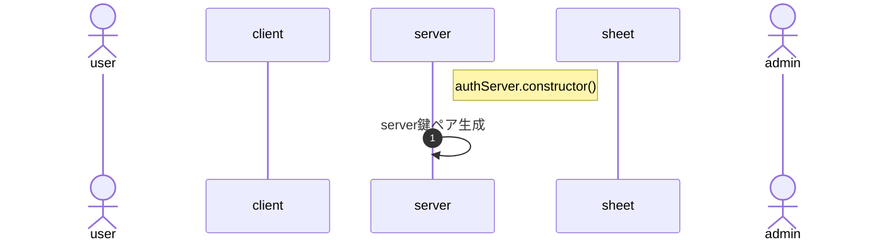

# 【備忘】GAS/htmlでの暗号化

## 手順



- server鍵ペア生成


- GASで返したhtml上でcookieの保存はできない
  ```
  <script type="text/javascript">
  document.cookie = 'camp2024=10';  // NG
  document.cookie = 'pKey=abcdefg'; // NG
  sessionStorage.setItem("camp2024", "value-sessionStorage"); // OK
  localStorage.setItem("camp2024", "value-localStorage"); // OK
  ```
- sessionStorage, localStorageへの保存はonload時もOK

- GAS
  - 鍵ペア生成
  - GASでの保存
  - 

## javascript用

- Node.jsスタイルで書かれたコードをブラウザ上で動くものに変換 : [ざっくりbrowserify入門](https://qiita.com/fgkm/items/a362b9917fa5f893c09a)
- [Javascriptで公開鍵ペア生成・暗号化/復号をしてみた](https://qiita.com/poruruba/items/272bdc8f539728d5b076)

javascript 鍵ペア ライブラリ


## GAS用

GASでは鍵ペア生成はできない ⇒ openssl等で作成し、プロパティサービスに保存しておく。

- stackoverflow[Generate a public / private Key RSA with Apps Scripts](https://stackoverflow.com/questions/51989469/generate-a-public-private-key-rsa-with-apps-scripts)

また、GASでは署名する方法はあるが、暗号化および署名検証の方法が見つからない

- 

- [GASでトークン等を保存しておけるプロパティサービスについてまとめてみた](https://qiita.com/zumi0/items/85ca400d57f60728a7c7)
- [GASのプロパティサービス(プロパティストア)とは？3種類の各特徴と使い分け方まとめ](https://auto-worker.com/blog/?p=7829)

鍵ペア生成できそうなのはcrypticoのみ。但しGASライブラリは無いし、requireしなければならない。

- [Google Apps Scriptでrequire()してみる](https://qiita.com/fossamagna/items/7c65e249e1e5ecad51ff)

1. main.jsの`function callHello()`を`global.callHello = function () {`に修正
1. `browserify main.js -o bundle.js`

失敗。GAS側は予め鍵を保存するよう方針転換。

- [.DERと .PEMという拡張子は鍵の中身じゃなくて、エンコーディングを表している](https://qiita.com/kunichiko/items/12cbccaadcbf41c72735#der%E3%81%A8-pem%E3%81%A8%E3%81%84%E3%81%86%E6%8B%A1%E5%BC%B5%E5%AD%90%E3%81%AF%E9%8D%B5%E3%81%AE%E4%B8%AD%E8%BA%AB%E3%81%98%E3%82%83%E3%81%AA%E3%81%8F%E3%81%A6%E3%82%A8%E3%83%B3%E3%82%B3%E3%83%BC%E3%83%87%E3%82%A3%E3%83%B3%E3%82%B0%E3%82%92%E8%A1%A8%E3%81%97%E3%81%A6%E3%81%84%E3%82%8B)

```
function getTest(){
  //スクリプトプロパティを取得し、ログ出力 -> 1度ファイルを閉じた後でも出力される
  console.log(PropertiesService.getScriptProperties().getProperty('TEST1'));
  console.log(PropertiesService.getDocumentProperties().getProperty('TEST2'));
  console.log(PropertiesService.getDocumentProperties().getProperty('TEST3'));
}

function setTest() {
  //PropertiesServiceでスクリプトプロパティをセット
  PropertiesService.getScriptProperties().setProperty('TEST1','テスト1です');
  PropertiesService.getDocumentProperties().setProperty('TEST2','テスト2です');
  PropertiesService.getDocumentProperties().setProperty('TEST3',{a:10});
  //スクリプトプロパティを取得し、ログ出力
  console.log(PropertiesService.getScriptProperties().getProperty('TEST1'));
  console.log(PropertiesService.getDocumentProperties().getProperty('TEST2'));
  console.log(PropertiesService.getDocumentProperties().getProperty('TEST3'));
}
```