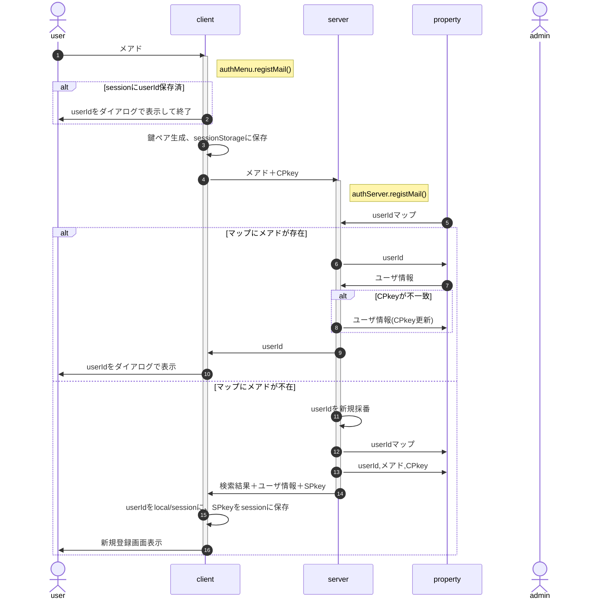

# 新規登録

新規登録では、[サーバ側のプロパティサービス](#332-%E3%83%A6%E3%83%BC%E3%82%B6%E6%83%85%E5%A0%B1)にIDとメアドのみ作成する。申込者名等、登録内容についてはユーザ情報の参照・編集画面を呼び出し、修正・加筆を行う。

- 参加者が改めて参加要項からメールアドレスを入力するのは「自分のuserIdを失念した」場合を想定
- メアド入力欄は募集要項の一部とし、userId(受付番号)がlocalStrageに存在する場合は表示しない
- 応募締切等、新規要求ができる期間の制限は、client側でも行う(authMenuの有効期間設定を想定)
- メアドは形式チェックのみ行い、到達確認および別ソースとの突合は行わない(ex.在校生メアド一覧との突合)
- ユーザはログインを行わないので、サーバ側のプロパティサービスにID/auth等のユーザ情報は保存しない。
- IDはstoreUserInfo関数を使用してlocal/sessionStorageでの保存を想定(∵タブを閉じても保存したい。個人情報とは言えず、特に問題ないと判断)
- 「検索結果=既存」の場合、ユーザ情報編集画面の表示も検討したが、なりすましでもe-mail入力で個人情報が表示されることになるので不適切と判断。
- 申込時に自分限定の申込情報操作のためログインすることになるので、メール到達確認はそこで行う
