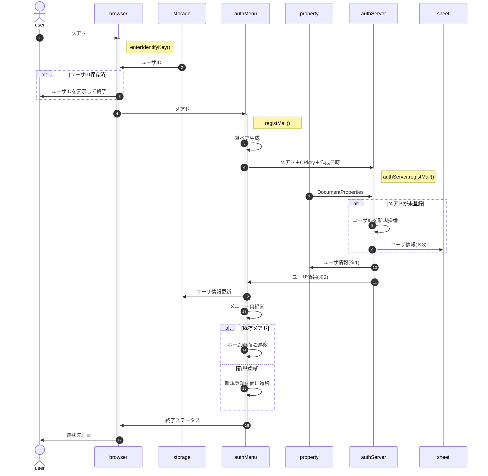

# 新規登録

新規登録では、[サーバ側のプロパティサービス](#332-%E3%83%A6%E3%83%BC%E3%82%B6%E6%83%85%E5%A0%B1)にIDとメアドのみ作成する。申込者名等、登録内容についてはユーザ情報の参照・編集画面を呼び出し、修正・加筆を行う。

- CPkeyは有効期限にかかわらず送付され、server側で更新する 
  ※有効期間の検証を省略するため、都度更新
- ※1(プロパティ保存),※2(SV->CL),※3(シート保存)の「ユーザ情報」オブジェクトのメンバは以下の通り。
  | 名称 | 属性 | 内容 | ※1 | ※2 | ※3 |
  | :-- | :-- | :-- | :--: | :--: | :--: |
  | isExist | boolean | true:登録済、false:新規登録 | × | ◎ | × |
  | userId | number | (新規採番された)ユーザID | ◎ | ◎ | ◎ |
  | created | number | ユーザID新規登録時刻(UNIX時刻) | ◎ | ◎ | ▲ (日付文字列) |
  | updated | number | サーバ側CPkey登録時刻(UNIX時刻) | ◎ | ◎ | ▲ (日付文字列) |
  | email | string | サーバ側に登録されたe-mail | ◎ | × | ◎ |
  | auth | number | サーバ側に登録されたユーザ権限 | ◎ | ◎ | ◎ |
  | SPkey | string | サーバ側の公開鍵 | × | ◎ | × |
  | CPkey | string | サーバ側に登録されたCPkey | ◎ | × | × |

- 参加者が改めて参加要項からメールアドレスを入力するのは「自分のuserIdを失念した」場合を想定
- 応募締切等、新規要求ができる期間の制限は、client側でも行う(authMenuの有効期間設定を想定)
- メアドは形式チェックのみ行い、到達確認および別ソースとの突合は行わない(ex.在校生メアド一覧との突合)
- IDはstoreUserInfo関数を使用してlocal/sessionStorageでの保存を想定(∵タブを閉じても保存したい。個人情報とは言えず、特に問題ないと判断)
- 「検索結果=既存」の場合、ユーザ情報編集画面の表示も検討したが、なりすましでもe-mail入力で個人情報が表示されることになるので不適切と判断。
- 申込時に自分限定の申込情報操作のためログインすることになるので、メール到達確認はそこで行う

<!--
- メアド入力欄は募集要項の一部とし、userId(受付番号)がlocalStrageに存在する場合は表示しない

sequenceDiagram
  autonumber
  actor user
  participant client
  participant server
  participant property
  participant sheet

  user ->> client : メアド
  activate client
  Note right of client : authMenu.registMail()
  alt userId保存済
    client ->> user : userIdを表示して終了
  end
  client ->> client : 鍵ペア生成
  client ->> server : メアド＋CPkey
  activate server
  Note right of server : authServer.registMail()
  property ->> server : DocumentProperties
  alt メアドが登録済
    server ->> property : ユーザ情報(※1)
    server ->> client : ユーザ情報(※2)
    client ->> client : 遷移先=ホーム画面
    client ->> user : userIdを表示
  else メアドが未登録
    server ->> server : userIdを新規採番
    server ->> property : ユーザ情報(※1)
    server ->> sheet : ユーザ情報(※3)
    server ->> client : ユーザ情報(※2)
    deactivate server
    client ->> client : 遷移先=新規登録画面
  end
  client ->> client : session/local更新、メニュー再描画、遷移先画面に遷移
  deactivate client
-->