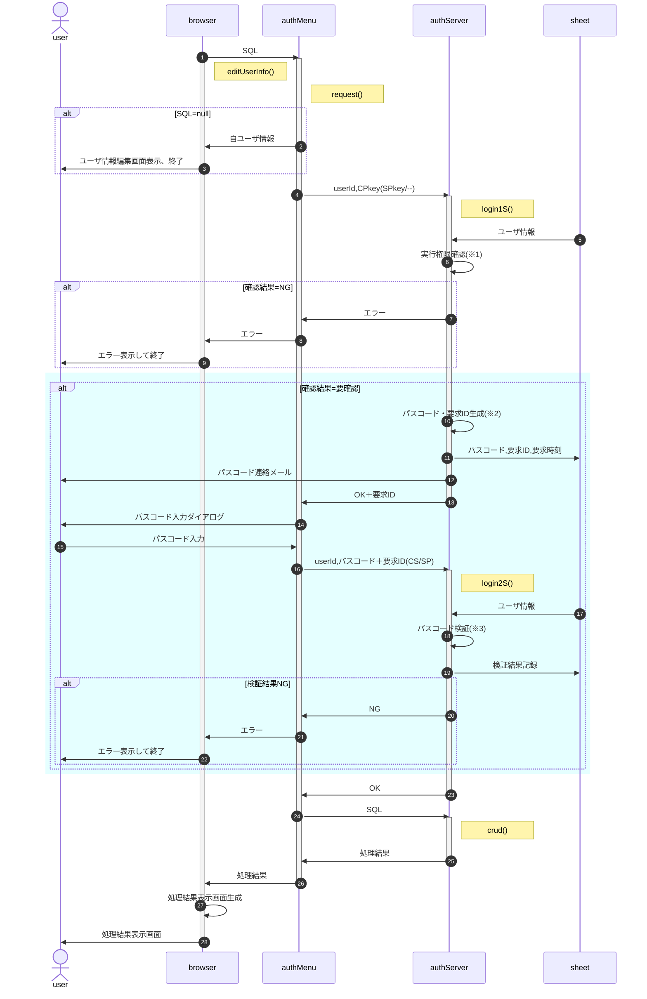

# ログイン要求

- ユーザIDやCS/CPkey他、自分のユーザ情報は先行する「新規ユーザ登録」によりインスタンス変数に存在する前提

- ※1 : 実行権限確認 
  | 実行権限 | CPkey | 凍結 | 結論 |
  | :-- | :-- | :-- | :-- |
  | 無し | — | — | NG (no permission) |
  | 有り | 有効 | — | OK |
  | 有り | 無効 | true | NG (lockout) |
  | 有り | 無効 | false | 要確認(confirm) |
  - 実行権限 : authServer内関数毎の所要権限 & ユーザ権限 > 0 ? 有り : 無し
  - CPkey : ① and ② ? 有効 : 無効 
  ①送られてきたCPkeyがユーザ毎のプロパティサービスに保存されたCPkeyと一致 
  ②ユーザ毎のプロパティサービスに保存されたCPkeyが有効期限内
  - 凍結 : 前回ログイン失敗(3回連続失敗)から一定時間内 ? true : false
- ※2 : パスコード・要求ID生成
  - パスコードは数値6桁(既定値)
  - 要求IDはuserIdと要求時刻(UNIX時刻)を連結した文字列のMD5(or CRC32)をbase64化
- ※3 : 「パスコード検証」は復号・署名確認の上、以下の点をチェックする
  - 復号可能且つ署名が一致
  - 送付されたパスコード・要求IDがプロパティサービスのそれと一致
  - 試行回数が一定数以下(既定値3回)
  - パスコード生成から一定時間内(既定値15分)
  - ログイン可能な権限
- パスコード再発行は凍結中以外認めるが、再発行前の失敗は持ち越す。 
  例：旧パスコードで2回連続失敗、再発行後の1回目で失敗したら凍結

<!--
sequenceDiagram
  autonumber
  actor user
  participant caller
  participant login
  participant server
  participant property

  caller ->> login : 呼び出し(userId,処理名)
  activate login
  Note right of login : authMenu.login()
  alt 鍵ペアが無効
    login ->> login : 鍵ペア再生成＋sessionに保存
  end

  login ->> server : userId,CPkey(SPkey/--)
  activate server
  Note right of server : authServer.login1S()
  server ->> property : userId
  property ->> server  : ユーザ情報
  server ->> server : 実行権限確認(※1)
  alt 実行権限確認結果がOK or NG
    server ->> login : OK or NG
    login ->> caller : OK or NG
  end

  server ->> server : パスコード・要求ID生成(※2)
  server ->> property : パスコード,要求ID,要求時刻
  server ->> user : パスコード連絡メール
  server ->> login : OK＋要求ID
  deactivate server
  login ->> user : パスコード入力ダイアログ

  user ->> login : パスコード入力
  login ->> server : userId,パスコード＋要求ID(CS/SP)
  activate server
  Note right of server : authServer.login2S()
  server ->> property : userId
  property ->> server : ユーザ情報
  server ->> server : パスコード検証(※3)
  server ->> property : 検証結果記録
  server ->> login : OK or NG
  deactivate server
  login ->> caller : OK or NG
  deactivate login
-->