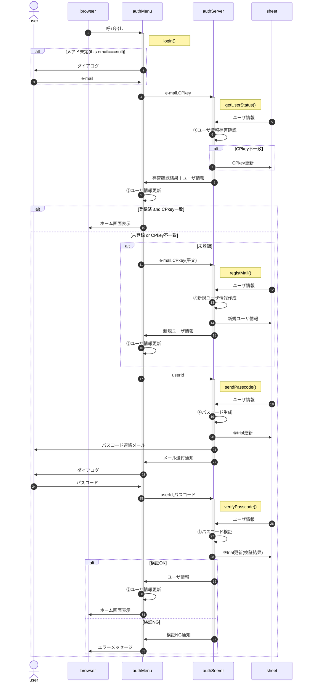

# 新規ユーザ登録、ログイン要求

- 新規ユーザ登録は「サーバ側に登録されていない」ことを確認の上行うので、ログイン要求の一部になる。
- ユーザIDやCS/CPkey他の自ユーザ情報、およびSPkeyはauthClient.constructor()で初期値を設定し、先行する「新規ユーザ登録」で修正済情報がインスタンス変数に存在する前提

- 応募締切等、新規要求ができる期間の制限は、client側でも行う(authMenuの有効期間設定を想定)
- メアドは形式チェックのみ行い、到達確認および別ソースとの突合は行わない(ex.在校生メアド一覧との突合)
- ①ユーザ情報存否確認
  - e-mailが登録済 ? 登録済 : 未登録
  - 復号化したCPkeyがシート上のCPkeyと一致 ? CPkey一致 : CPkey不一致
- CPkeyは有効期限にかかわらず送付され、server側で更新する 
  - 同一userIdで異なる機器からログインする場合を想定
  - 将来的に有効期間を設定した場合、強制更新ならその検証も省略可能
- ②ユーザ情報更新(storeUserInfo)
  1. authMenuインスタンス変数/sessionStorageのユーザ情報を更新
  1. メニューを再描画(genNavi()の実行)
- ※1(シート保存),※2(SV->CL)の「ユーザ情報」オブジェクトのメンバは以下の通り。
  | 名称 | 属性 | 内容 | loc | ses | mem | I/O | sht |
  | :-- | :-- | :-- | :--: | :--: | :--: | :--: | :--: |
  | userId | number | (新規採番された)ユーザID | ◎ | ◎ | ◎ | ◎ | ◎ |
  | created | string | ユーザID新規登録時刻(日時文字列) | × | × | × | × | ◎ |
  | email | string | ユーザの連絡先メールアドレス | × | ◎ | ◎ | × | ◎ |
  | auth | number | ユーザの権限 | × | ◎ | ◎ | ◎ | ◎ |
  | passPhrase | string | クライアント側鍵ペア生成のパスフレーズ | × | ◎ | × | × | × |
  | CSkey | object | クライアント側の秘密鍵 | × | × | ◎ | × | × |
  | CPkey | string | クライアント側の公開鍵 | × | ◎ | ◎ | × | ◎ |
  | updated | string | クライアント側公開鍵生成時刻(日時文字列) | × | ◎ | ◎ | × | ◎ |
  | SPkey | string | サーバ側の公開鍵 | × | ◎ | ◎ | ◎ | × |
  | isExist | boolean | 新規登録対象メアドが登録済ならtrue | × | × | × | ◎ | × |
  | trial | object | ログイン試行関係情報 | × | × | × | ▲ | ◎ |
- 新規登録では、[サーバ側のプロパティサービス](#332-%E3%83%A6%E3%83%BC%E3%82%B6%E6%83%85%E5%A0%B1)にIDとメアドのみ作成する。申込者名等、登録内容についてはユーザ情報の参照・編集画面を呼び出し、修正・加筆を行う。
- ③新規ユーザ情報作成
- ④パスコード生成
  - 実行権限の確認
    - CPkey : ① and ② ? 有効 : 無効 
      ①送られてきたCPkeyがユーザ毎のプロパティサービスに保存されたCPkeyと一致 
      ②ユーザ毎のプロパティサービスに保存されたCPkeyが有効期限内
    - 凍結 : 前回ログイン失敗(3回連続失敗)から一定時間内 ? true : false
- ⑤trial更新 : trialは以下のメンバを持つObjectをJSON形式でシート上で保存
  | 名称 | 属性 | 内容 | I/O |
  | :-- | :-- | :-- | :-- |
  | startAt | number | 試行開始日時(UNIX時刻) | × |
  | passcode | number | パスコード(原則数値6桁) | × |
  | log | object[] | 試行の記録。unshiftで先頭を最新にする | × |
  | timestamp | number | 試行日時(UNIX時刻) | × |
  | entered | number | 入力されたパスコード | × |
  | result | boolean | パスコードと入力値の比較結果(true:OK) | × |
  | status | string | NGの場合の理由。'OK':試行OK | × |
  | endAt | number | 試行終了日時(UNIX時刻) | × |
  | result | boolean | 試行の結果(true:OK) | ◎ |
  | unfreeze | number | ログイン連続失敗後、凍結解除される日時(UNIX時刻) | ◎ |
  - loc : localStorage
  - ses : sessionStorage
  - mem : authMenuインスタンス変数(メンバ)
  - I/O : authServer -> authMenuへ送られるオブジェクト
  - sht : シート
- ⑥パスコード検証 : 「パスコード検証」は復号・署名確認の上、以下の点をチェックする
  - 復号可能且つ署名が一致
  - 送付されたパスコード・要求IDがプロパティサービスのそれと一致
  - 試行回数が一定数以下(既定値3回)
  - パスコード生成から一定時間内(既定値15分)
  - ログイン可能な権限
- パスコード再発行は凍結中以外認めるが、再発行前の失敗は持ち越す。 
  例：旧パスコードで2回連続失敗、再発行後の1回目で失敗したら凍結

