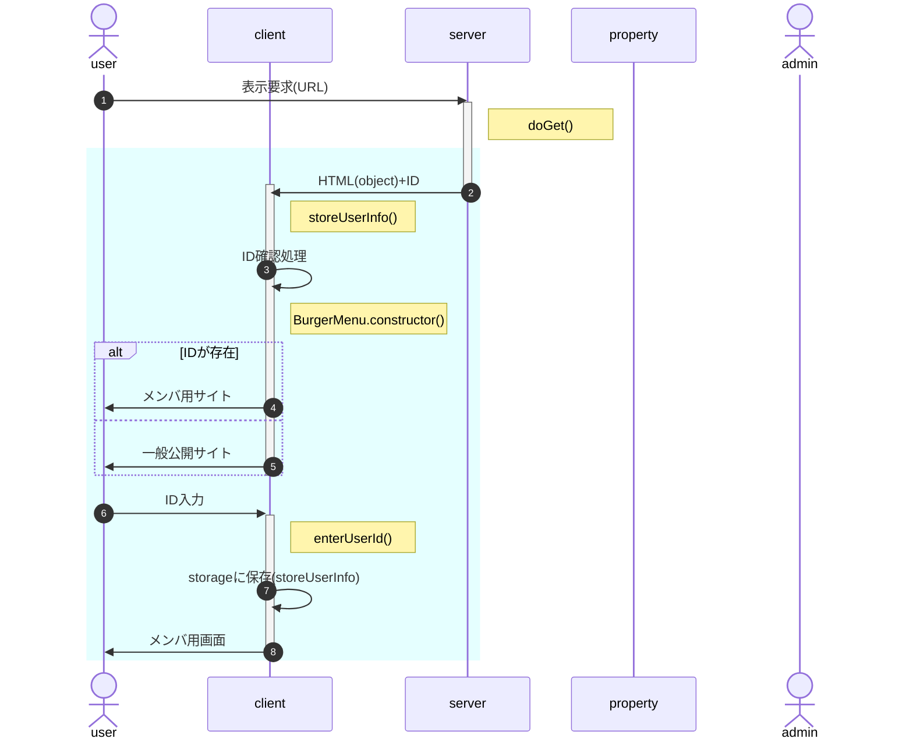

# onload時処理

- 水色の部分はhtmlのonload時処理
- 表示要求に対するserverからの戻り値(ID)は、bodyタグ直下の冒頭に隠しDIVを用意し、そのinnerTextとして返す。
- ID確認処理
  - 引数、HTML埋込情報、sessionStorage、localStorageのユーザ情報を取得
  - IDを特定(引数>HTML埋込>session>local。いずれにも無ければnull)
  - IDが特定されるならauthを一般公開->参加者に変更

<!--
- 「インスタンス生成」の処理内容
  1. authClient.constructor()
     1. localStorageにIDがあるか確認 
        不存在または不一致なら、serverから戻されたIDをlocalStorageに保存
  1. BurgerMenu.constructor()
     1. AuthインスタンスをBurgerMenuのインスタンスメンバとして生成(以下Burger.auth)
     1. Burger.auth.IDの値に従ってAuthメニュー描画(メニューアイコン、nav領域)

[HtmlOutput.appendUntrusted()](https://developers.google.com/apps-script/reference/html/html-output?hl=ja#appenduntrustedaddedcontent)を使用して、HTMLの要素として返す。

    user ->> client : ID入力
    activate client
    Note right of client : enterUserId()
    client ->> user : メンバ用サイト
    deactivate client

-->