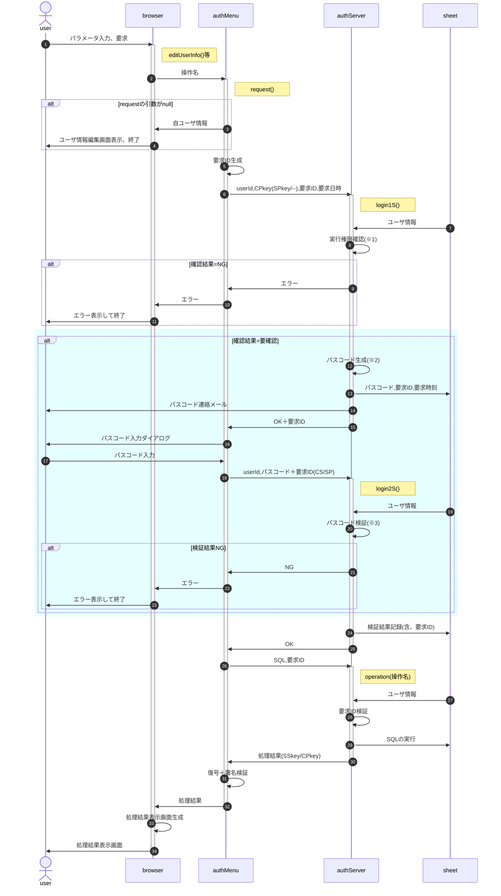

# 操作要求

ユーザ情報の編集や候補者リストの作成等、シートの操作(CRUD)は管理者が事前に`{操作名:実行関数}`の形でソースに埋め込んで定義する。<br>
例：`{lookup:(arg)=>data.find(x=>x.id==arg.id)}`

userは要求時に操作名を指定し、その実行結果を受け取る。



- 「操作要求」には新規ユーザ登録からの`authMenu.request()`呼出を含む
- 要求ID検証 : 要求IDが直近の検証結果であること、OKと判断されていること
- ※1 : 実行権限確認<br>
  | 実行権限 | CPkey | 凍結 | 結論 |
  | :-- | :-- | :-- | :-- |
  | 無し | — | — | NG (no permission) |
  | 有り | 有効 | — | OK |
  | 有り | 無効 | true | NG (lockout) |
  | 有り | 無効 | false | 要確認(confirm) |
  - 実行権限 : authServer内関数毎の所要権限 & ユーザ権限 > 0 ? 有り : 無し
  - CPkey : ① and ② ? 有効 : 無効<br>
  ①送られてきたCPkeyがユーザ毎のプロパティサービスに保存されたCPkeyと一致<br>
  ②ユーザ毎のプロパティサービスに保存されたCPkeyが有効期限内
  - 凍結 : 前回ログイン失敗(3回連続失敗)から一定時間内 ? true : false
- ※2 : パスコード・要求ID生成
  - パスコードは数値6桁(既定値)
  - 要求IDはuserIdと要求時刻(UNIX時刻)を連結した文字列のMD5(or CRC32)をbase64化
- ※3 : 「パスコード検証」は復号・署名確認の上、以下の点をチェックする
  - 復号可能且つ署名が一致
  - 送付されたパスコード・要求IDがプロパティサービスのそれと一致
  - 試行回数が一定数以下(既定値3回)
  - パスコード生成から一定時間内(既定値15分)
  - ログイン可能な権限
- パスコード再発行は凍結中以外認めるが、再発行前の失敗は持ち越す。<br>
  例：旧パスコードで2回連続失敗、再発行後の1回目で失敗したら凍結

- シートの操作(CRUD)は権限と有効期間の確認が必要なため、以下のようなオブジェクト(ハッシュ)を管理者がソースに埋め込む(configとして定義する)ことで行う。
  ```
  config.operations = {
    lookup : {  // {string} 操作名
      auth : 0, // {number} 操作を許可する権限フラグの論理和
      from : null, // {string} 有効期間を設定する場合、開始日時文字列
      to : null, // {string} 同、終了日時文字列
      func: // {Arrow|Function} 操作を定義する関数
        (data,id) => data.find(x => x.id === id),
    },
    list : {...},
    update : {...},
    ...
  }
  ```