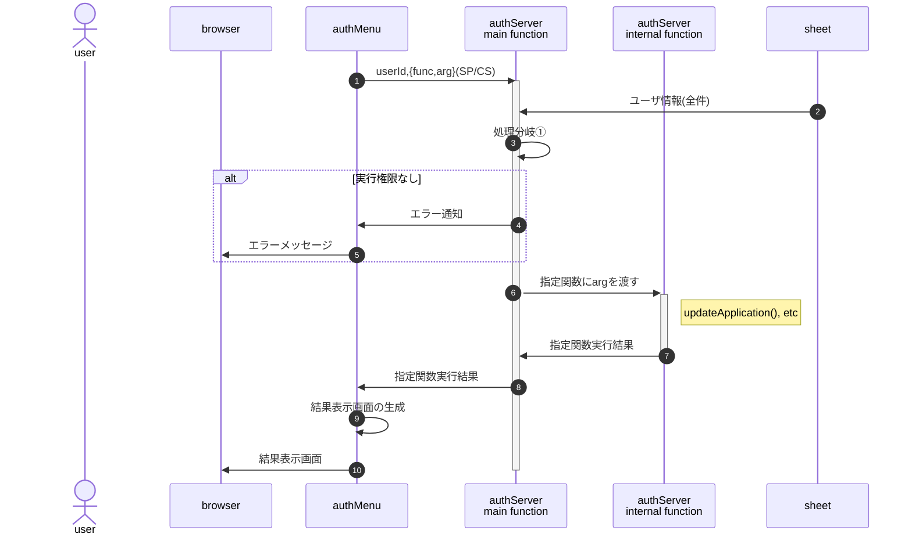

# シート更新

## シートの更新(CRUD)を伴う処理の定義方法

- ①処理分岐：以下の全てを満たす場合、funcにarg(Object)を渡す
  1. 引数(arg)を復号、署名検証を行う
  1. userIdから当該ユーザの権限(auth)を特定、指定処理(func)の実行権限があるか確認
- updateApplication等に必要となる実行可能権限は、`setProperties()`で'allow'として予め埋め込んでおく。