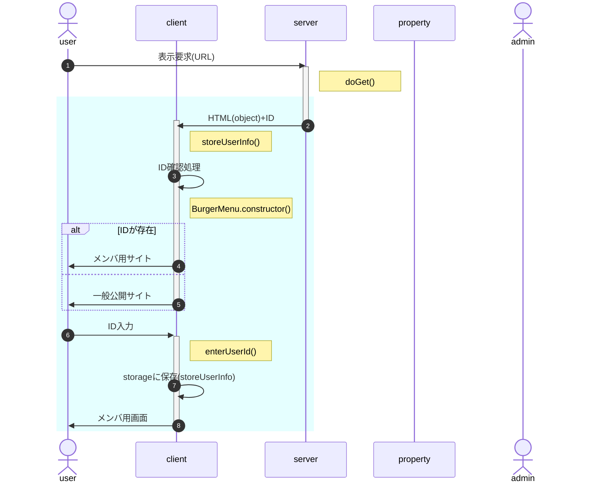
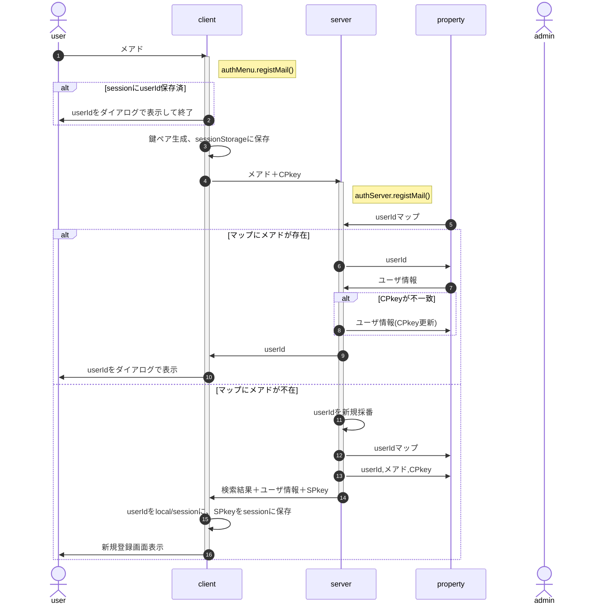
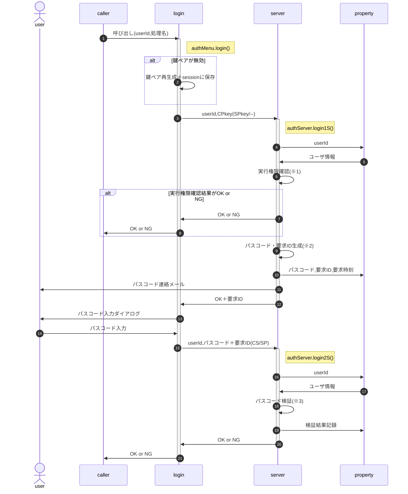
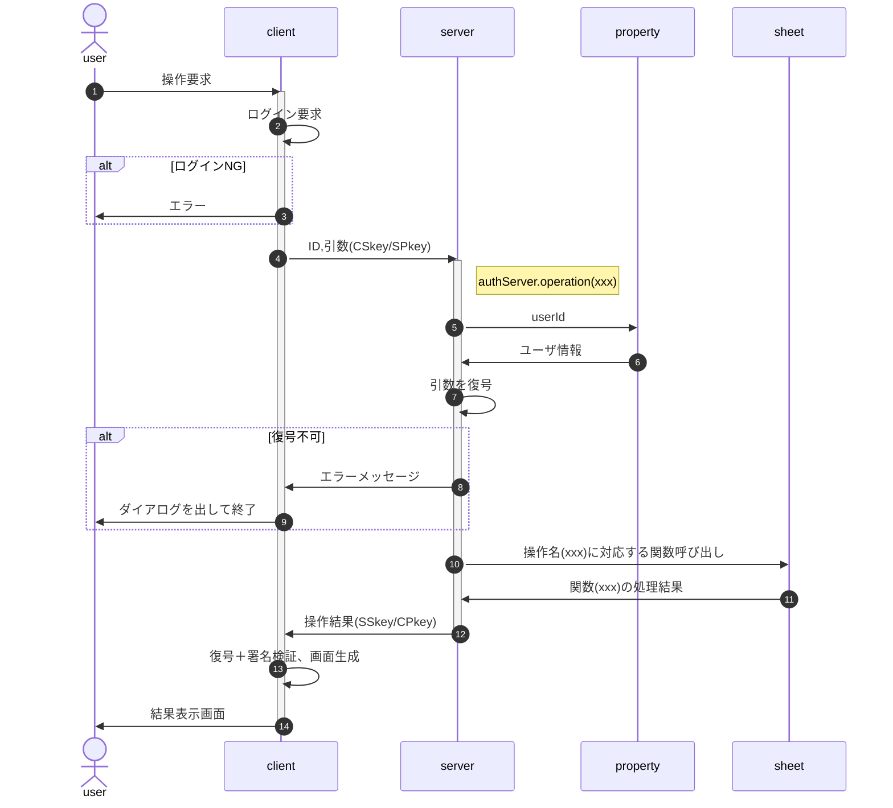
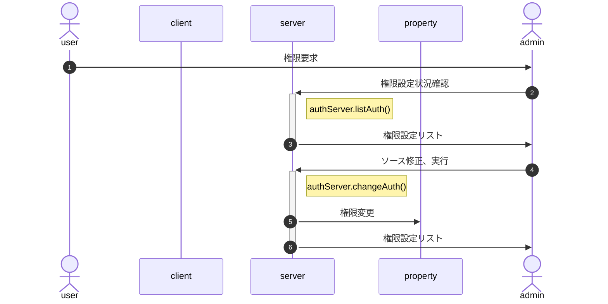
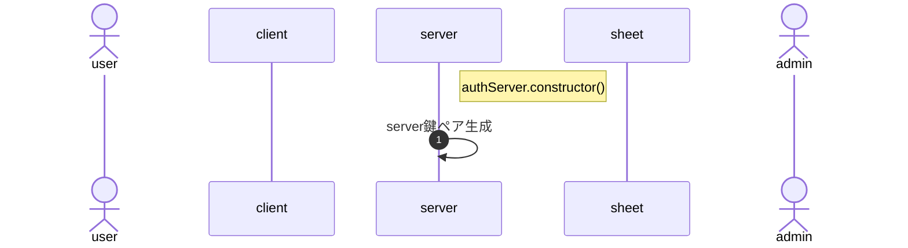

<!-- modifyMD original document 
<style>
/* -----------------------------------------------
  library/CSS/1.3.0/core.css
----------------------------------------------- */
html, body{
  width: 100%;
  margin: 0;
  /*font-size: 4vw;*/
  text-size-adjust: none; /* https://gotohayato.com/content/531/ */
}
body * {
  font-size: 1rem;
  font-family: sans-serif;
  box-sizing: border-box;
}
.num, .right {text-align:right;}
.screen {padding: 1rem;} /* SPAでの切替用画面 */
.title { /* Markdown他でのタイトル */
  font-size: 2.4rem;
  text-shadow: 2px 2px 5px #888;
}

/* --- テーブル -------------------------------- */
.table {display:grid}
th, .th, td, .td {
  margin: 0.2rem;
  padding: 0.2rem;
}
th, .th {
  background-color: #888;
  color: white;
}
td, .td {
  border-bottom: solid 1px #aaa;
  border-right: solid 1px #aaa;
}

/* --- 部品 ----------------------------------- */
.triDown { /* 下向き矢印 */
  --bw: 50px;
  width: 0px;
  height: 0px;
  border-top: calc(var(--bw) * 0.7) solid #aaa;
  border-right: var(--bw) solid transparent;
  border-left: var(--bw) solid transparent;
  border-bottom: calc(var(--bw) * 0.2) solid transparent;
}

/* --- 部品：待機画面 --------------------------- */
.loader,
.loader:after {
  border-radius: 50%;
  width: 10em;
  height: 10em;
}
.loader {
  margin: 60px auto;
  font-size: 10px;
  position: relative;
  text-indent: -9999em;
  border-top: 1.1em solid rgba(204,204,204, 0.2);
  border-right: 1.1em solid rgba(204,204,204, 0.2);
  border-bottom: 1.1em solid rgba(204,204,204, 0.2);
  border-left: 1.1em solid #cccccc;
  -webkit-transform: translateZ(0);
  -ms-transform: translateZ(0);
  transform: translateZ(0);
  -webkit-animation: load8 1.1s infinite linear;
  animation: load8 1.1s infinite linear;
}
@-webkit-keyframes load8 {
  0% {
    -webkit-transform: rotate(0deg);
    transform: rotate(0deg);
  }
  100% {
    -webkit-transform: rotate(360deg);
    transform: rotate(360deg);
  }
}
@keyframes load8 {
  0% {
    -webkit-transform: rotate(0deg);
    transform: rotate(0deg);
  }
  100% {
    -webkit-transform: rotate(360deg);
    transform: rotate(360deg);
  }
}
</style>
<p class="title">class authMenu</p>

# 機能概要

htmlからdata-menu属性を持つ要素を抽出、ハンバーガーメニューを作成する。

またHTML上のメニュー(SPAの機能)毎に許容権限を設定し、ユーザ毎に認証することで、表示制御を可能にする。

<?xml version="1.0" encoding="UTF-8"?>
<!DOCTYPE svg PUBLIC "-//W3C//DTD SVG 1.1//EN" "http://www.w3.org/Graphics/SVG/1.1/DTD/svg11.dtd">
<svg xmlns="http://www.w3.org/2000/svg" xmlns:xlink="http://www.w3.org/1999/xlink" version="1.1" width="726px" height="271px" viewBox="-0.5 -0.5 726 271"><defs/><g><g><path d="M 328.2 270 L 370.2 78 L 514.2 78 L 472.2 270 Z" fill="rgb(255, 255, 255)" stroke="rgb(0, 0, 0)" stroke-width="0.6" stroke-miterlimit="10" pointer-events="all"/></g><g><path d="M 328.2 234 L 370.2 42 L 514.2 42 L 472.2 234 Z" fill="#b3b3b3" stroke="none" pointer-events="all"/></g><g><path d="M 466.2 30 L 472.2 0 L 514.2 0 L 508.2 30 Z" fill="rgb(255, 255, 255)" stroke="rgb(0, 0, 0)" stroke-width="0.6" stroke-miterlimit="10" pointer-events="all"/></g><g><g transform="translate(-0.5 -0.5)scale(0.6)"><switch><foreignObject pointer-events="none" width="167%" height="167%" requiredFeatures="http://www.w3.org/TR/SVG11/feature#Extensibility" style="overflow: visible; text-align: left;"><div xmlns="http://www.w3.org/1999/xhtml" style="display: flex; align-items: unsafe center; justify-content: unsafe center; width: 78px; height: 1px; padding-top: 25px; margin-left: 778px;"><div data-drawio-colors="color: rgb(0, 0, 0); " style="box-sizing: border-box; font-size: 0px; text-align: center;"><div style="display: inline-block; font-size: 12px; font-family: Helvetica; color: rgb(0, 0, 0); line-height: 1.2; pointer-events: all; white-space: normal; overflow-wrap: normal;"><font style="font-size: 20px;">.icon</font></div></div></div></foreignObject><text x="817" y="29" fill="rgb(0, 0, 0)" font-family="Helvetica" font-size="12px" text-anchor="middle">.icon</text></switch></g></g><g><path d="M 364.2 198 L 400.2 30 L 508.2 30 L 472.2 198 Z" fill="rgb(255, 255, 255)" stroke="rgb(0, 0, 0)" stroke-width="0.6" stroke-miterlimit="10" pointer-events="all"/></g><g><g transform="translate(-0.5 -0.5)scale(0.6)"><switch><foreignObject pointer-events="none" width="167%" height="167%" requiredFeatures="http://www.w3.org/TR/SVG11/feature#Extensibility" style="overflow: visible; text-align: left;"><div xmlns="http://www.w3.org/1999/xhtml" style="display: flex; align-items: unsafe center; justify-content: unsafe center; width: 238px; height: 1px; padding-top: 190px; margin-left: 608px;"><div data-drawio-colors="color: rgb(0, 0, 0); " style="box-sizing: border-box; font-size: 0px; text-align: center;"><div style="display: inline-block; font-size: 12px; font-family: Helvetica; color: rgb(0, 0, 0); line-height: 1.2; pointer-events: all; white-space: normal; overflow-wrap: normal;"><font style="font-size: 20px;">nav</font></div></div></div></foreignObject><text x="727" y="194" fill="rgb(0, 0, 0)" font-family="Helvetica" font-size="12px" text-anchor="middle">nav</text></switch></g></g><g><rect x="388.2" y="204" width="36" height="18" fill="none" stroke="none" pointer-events="all"/></g><g><g transform="translate(-0.5 -0.5)scale(0.6)"><switch><foreignObject pointer-events="none" width="167%" height="167%" requiredFeatures="http://www.w3.org/TR/SVG11/feature#Extensibility" style="overflow: visible; text-align: left;"><div xmlns="http://www.w3.org/1999/xhtml" style="display: flex; align-items: unsafe center; justify-content: unsafe center; width: 58px; height: 1px; padding-top: 355px; margin-left: 648px;"><div data-drawio-colors="color: rgb(0, 0, 0); " style="box-sizing: border-box; font-size: 0px; text-align: center;"><div style="display: inline-block; font-size: 12px; font-family: Helvetica; color: rgb(0, 0, 0); line-height: 1.2; pointer-events: all; white-space: normal; overflow-wrap: normal;"><font style="font-size: 20px;">.back</font></div></div></div></foreignObject><text x="677" y="359" fill="rgb(0, 0, 0)" font-family="Helvetica" font-size="12px" text-anchor="middle">.back</text></switch></g></g><g><rect x="370.2" y="246" width="72" height="18" fill="none" stroke="none" pointer-events="all"/></g><g><g transform="translate(-0.5 -0.5)scale(0.6)"><switch><foreignObject pointer-events="none" width="167%" height="167%" requiredFeatures="http://www.w3.org/TR/SVG11/feature#Extensibility" style="overflow: visible; text-align: left;"><div xmlns="http://www.w3.org/1999/xhtml" style="display: flex; align-items: unsafe center; justify-content: unsafe center; width: 118px; height: 1px; padding-top: 425px; margin-left: 618px;"><div data-drawio-colors="color: rgb(0, 0, 0); " style="box-sizing: border-box; font-size: 0px; text-align: center;"><div style="display: inline-block; font-size: 12px; font-family: Helvetica; color: rgb(0, 0, 0); line-height: 1.2; pointer-events: all; white-space: normal; overflow-wrap: normal;"><span style="font-size: 20px;">.wrapper</span></div></div></div></foreignObject><text x="677" y="429" fill="rgb(0, 0, 0)" font-family="Helvetica" font-size="12px" text-anchor="middle">.wrapper</text></switch></g></g><g><rect x="0" y="0" width="253.2" height="258" fill="rgb(255, 255, 255)" stroke="rgb(0, 0, 0)" stroke-width="0.6" pointer-events="all"/></g><g><g transform="translate(-0.5 -0.5)scale(0.6)"><switch><foreignObject pointer-events="none" width="167%" height="167%" requiredFeatures="http://www.w3.org/TR/SVG11/feature#Extensibility" style="overflow: visible; text-align: left;"><div xmlns="http://www.w3.org/1999/xhtml" style="display: flex; align-items: unsafe flex-start; justify-content: unsafe flex-start; width: 420px; height: 1px; padding-top: 7px; margin-left: 2px;"><div data-drawio-colors="color: rgb(0, 0, 0); " style="box-sizing: border-box; font-size: 0px; text-align: left;"><div style="display: inline-block; font-size: 12px; font-family: Helvetica; color: rgb(0, 0, 0); line-height: 1.2; pointer-events: all; white-space: normal; overflow-wrap: normal;"><font style="font-size: 20px;">.menu.screen name="wrapper"</font></div></div></div></foreignObject><text x="2" y="19" fill="rgb(0, 0, 0)" font-family="Helvetica" font-size="12px">.menu.screen name="wrapper"</text></switch></g></g><g><rect x="7.2" y="24" width="240" height="42" fill="rgb(255, 255, 255)" stroke="rgb(0, 0, 0)" stroke-width="0.6" pointer-events="all"/></g><g><g transform="translate(-0.5 -0.5)scale(0.6)"><switch><foreignObject pointer-events="none" width="167%" height="167%" requiredFeatures="http://www.w3.org/TR/SVG11/feature#Extensibility" style="overflow: visible; text-align: left;"><div xmlns="http://www.w3.org/1999/xhtml" style="display: flex; align-items: unsafe flex-start; justify-content: unsafe flex-start; width: 398px; height: 1px; padding-top: 47px; margin-left: 14px;"><div data-drawio-colors="color: rgb(0, 0, 0); " style="box-sizing: border-box; font-size: 0px; text-align: left;"><div style="display: inline-block; font-size: 12px; font-family: Helvetica; color: rgb(0, 0, 0); line-height: 1.2; pointer-events: all; white-space: normal; overflow-wrap: normal;"><font style="font-size: 20px;">.data-menu</font><div><font style="font-size: 20px;">="id:'c11',label:'掲示板',func:'board'"</font></div></div></div></div></foreignObject><text x="14" y="59" fill="rgb(0, 0, 0)" font-family="Helvetica" font-size="12px">.data-menu...</text></switch></g></g><g><rect x="7.2" y="72" width="240" height="42" fill="rgb(255, 255, 255)" stroke="rgb(0, 0, 0)" stroke-width="0.6" pointer-events="all"/></g><g><g transform="translate(-0.5 -0.5)scale(0.6)"><switch><foreignObject pointer-events="none" width="167%" height="167%" requiredFeatures="http://www.w3.org/TR/SVG11/feature#Extensibility" style="overflow: visible; text-align: left;"><div xmlns="http://www.w3.org/1999/xhtml" style="display: flex; align-items: unsafe flex-start; justify-content: unsafe flex-start; width: 398px; height: 1px; padding-top: 127px; margin-left: 14px;"><div data-drawio-colors="color: rgb(0, 0, 0); " style="box-sizing: border-box; font-size: 0px; text-align: left;"><div style="display: inline-block; font-size: 12px; font-family: Helvetica; color: rgb(0, 0, 0); line-height: 1.2; pointer-events: all; white-space: normal; overflow-wrap: normal;"><font style="font-size: 20px;">.data-menu</font><div><font style="font-size: 20px;">="id:'c21',label:'入会申込',href:'https://〜'"</font></div></div></div></div></foreignObject><text x="14" y="139" fill="rgb(0, 0, 0)" font-family="Helvetica" font-size="12px">.data-menu...</text></switch></g></g><g><rect x="7.2" y="120" width="240" height="132" fill="rgb(255, 255, 255)" stroke="rgb(0, 0, 0)" stroke-width="0.6" pointer-events="all"/></g><g><g transform="translate(-0.5 -0.5)scale(0.6)"><switch><foreignObject pointer-events="none" width="167%" height="167%" requiredFeatures="http://www.w3.org/TR/SVG11/feature#Extensibility" style="overflow: visible; text-align: left;"><div xmlns="http://www.w3.org/1999/xhtml" style="display: flex; align-items: unsafe flex-start; justify-content: unsafe flex-start; width: 398px; height: 1px; padding-top: 207px; margin-left: 14px;"><div data-drawio-colors="color: rgb(0, 0, 0); " style="box-sizing: border-box; font-size: 0px; text-align: left;"><div style="display: inline-block; font-size: 12px; font-family: Helvetica; color: rgb(0, 0, 0); line-height: 1.2; pointer-events: all; white-space: normal; overflow-wrap: normal;"><font style="font-size: 20px;">.data-menu</font><div><font style="font-size: 20px;">="id:'c30',label:'Information'</font></div></div></div></div></foreignObject><text x="14" y="219" fill="rgb(0, 0, 0)" font-family="Helvetica" font-size="12px">.data-menu...</text></switch></g></g><g><rect x="14.4" y="156" width="177.6" height="42" fill="rgb(255, 255, 255)" stroke="rgb(0, 0, 0)" stroke-width="0.6" pointer-events="all"/></g><g><g transform="translate(-0.5 -0.5)scale(0.6)"><switch><foreignObject pointer-events="none" width="167%" height="167%" requiredFeatures="http://www.w3.org/TR/SVG11/feature#Extensibility" style="overflow: visible; text-align: left;"><div xmlns="http://www.w3.org/1999/xhtml" style="display: flex; align-items: unsafe flex-start; justify-content: unsafe flex-start; width: 294px; height: 1px; padding-top: 267px; margin-left: 26px;"><div data-drawio-colors="color: rgb(0, 0, 0); " style="box-sizing: border-box; font-size: 0px; text-align: left;"><div style="display: inline-block; font-size: 12px; font-family: Helvetica; color: rgb(0, 0, 0); line-height: 1.2; pointer-events: all; white-space: normal; overflow-wrap: normal;"><font style="font-size: 20px;">.data-menu</font><div><font style="font-size: 20px;">="id:'c31',label:'会場案内図'</font></div></div></div></div></foreignObject><text x="26" y="279" fill="rgb(0, 0, 0)" font-family="Helvetica" font-size="12px">.data-menu...</text></switch></g></g><g><rect x="14.4" y="204" width="177.6" height="42" fill="rgb(255, 255, 255)" stroke="rgb(0, 0, 0)" stroke-width="0.6" pointer-events="all"/></g><g><g transform="translate(-0.5 -0.5)scale(0.6)"><switch><foreignObject pointer-events="none" width="167%" height="167%" requiredFeatures="http://www.w3.org/TR/SVG11/feature#Extensibility" style="overflow: visible; text-align: left;"><div xmlns="http://www.w3.org/1999/xhtml" style="display: flex; align-items: unsafe flex-start; justify-content: unsafe flex-start; width: 294px; height: 1px; padding-top: 347px; margin-left: 26px;"><div data-drawio-colors="color: rgb(0, 0, 0); " style="box-sizing: border-box; font-size: 0px; text-align: left;"><div style="display: inline-block; font-size: 12px; font-family: Helvetica; color: rgb(0, 0, 0); line-height: 1.2; pointer-events: all; white-space: normal; overflow-wrap: normal;"><font style="font-size: 20px;">.data-menu</font><div><font style="font-size: 20px;">="id:'c32',label:'タイムテーブル'</font></div></div></div></div></foreignObject><text x="26" y="359" fill="rgb(0, 0, 0)" font-family="Helvetica" font-size="12px">.data-menu...</text></switch></g></g><g><rect x="580.2" y="3" width="144" height="234" fill="#b3b3b3" stroke="none" pointer-events="all"/></g><g/><g><rect x="616.2" y="33" width="108" height="150" fill="#cccccc" stroke="#ffffff" stroke-width="1.2" pointer-events="all"/></g><g><rect x="622.2" y="39" width="102" height="24" fill="#cccccc" stroke="#ffffff" stroke-width="1.2" pointer-events="all"/></g><g><g transform="translate(-0.5 -0.5)scale(0.6)"><switch><foreignObject pointer-events="none" width="167%" height="167%" requiredFeatures="http://www.w3.org/TR/SVG11/feature#Extensibility" style="overflow: visible; text-align: left;"><div xmlns="http://www.w3.org/1999/xhtml" style="display: flex; align-items: unsafe center; justify-content: unsafe flex-start; width: 168px; height: 1px; padding-top: 85px; margin-left: 1039px;"><div data-drawio-colors="color: rgb(0, 0, 0); " style="box-sizing: border-box; font-size: 0px; text-align: left;"><div style="display: inline-block; font-size: 12px; font-family: Helvetica; color: rgb(0, 0, 0); line-height: 1.2; pointer-events: all; white-space: normal; overflow-wrap: normal;"><font style="font-size: 20px;"> 掲示板</font></div></div></div></foreignObject><text x="1039" y="89" fill="rgb(0, 0, 0)" font-family="Helvetica" font-size="12px"> 掲示板</text></switch></g></g><g><rect x="622.2" y="66" width="102" height="24" fill="#cccccc" stroke="#ffffff" stroke-width="1.2" pointer-events="all"/></g><g><g transform="translate(-0.5 -0.5)scale(0.6)"><switch><foreignObject pointer-events="none" width="167%" height="167%" requiredFeatures="http://www.w3.org/TR/SVG11/feature#Extensibility" style="overflow: visible; text-align: left;"><div xmlns="http://www.w3.org/1999/xhtml" style="display: flex; align-items: unsafe center; justify-content: unsafe flex-start; width: 168px; height: 1px; padding-top: 130px; margin-left: 1039px;"><div data-drawio-colors="color: rgb(0, 0, 0); " style="box-sizing: border-box; font-size: 0px; text-align: left;"><div style="display: inline-block; font-size: 12px; font-family: Helvetica; color: rgb(0, 0, 0); line-height: 1.2; pointer-events: all; white-space: normal; overflow-wrap: normal;"><font style="font-size: 20px;">入会申込</font></div></div></div></foreignObject><text x="1039" y="134" fill="rgb(0, 0, 0)" font-family="Helvetica" font-size="12px">入会申込</text></switch></g></g><g><rect x="622.2" y="93" width="102" height="84" fill="#cccccc" stroke="#ffffff" stroke-width="1.2" pointer-events="all"/></g><g><g transform="translate(-0.5 -0.5)scale(0.6)"><switch><foreignObject pointer-events="none" width="167%" height="167%" requiredFeatures="http://www.w3.org/TR/SVG11/feature#Extensibility" style="overflow: visible; text-align: left;"><div xmlns="http://www.w3.org/1999/xhtml" style="display: flex; align-items: unsafe flex-start; justify-content: unsafe flex-start; width: 168px; height: 1px; padding-top: 162px; margin-left: 1039px;"><div data-drawio-colors="color: rgb(0, 0, 0); " style="box-sizing: border-box; font-size: 0px; text-align: left;"><div style="display: inline-block; font-size: 12px; font-family: Helvetica; color: rgb(0, 0, 0); line-height: 1.2; pointer-events: all; white-space: normal; overflow-wrap: normal;"><font style="font-size: 20px;"> Information</font></div></div></div></foreignObject><text x="1039" y="174" fill="rgb(0, 0, 0)" font-family="Helvetica" font-size="12px"> Information</text></switch></g></g><g><rect x="628.2" y="117" width="96" height="24" fill="#cccccc" stroke="#ffffff" stroke-width="1.2" pointer-events="all"/></g><g><g transform="translate(-0.5 -0.5)scale(0.6)"><switch><foreignObject pointer-events="none" width="167%" height="167%" requiredFeatures="http://www.w3.org/TR/SVG11/feature#Extensibility" style="overflow: visible; text-align: left;"><div xmlns="http://www.w3.org/1999/xhtml" style="display: flex; align-items: unsafe center; justify-content: unsafe flex-start; width: 158px; height: 1px; padding-top: 215px; margin-left: 1049px;"><div data-drawio-colors="color: rgb(0, 0, 0); " style="box-sizing: border-box; font-size: 0px; text-align: left;"><div style="display: inline-block; font-size: 12px; font-family: Helvetica; color: rgb(0, 0, 0); line-height: 1.2; pointer-events: all; white-space: normal; overflow-wrap: normal;"><font style="font-size: 20px;">会場案内図</font></div></div></div></foreignObject><text x="1049" y="219" fill="rgb(0, 0, 0)" font-family="Helvetica" font-size="12px">会場案内図</text></switch></g></g><g><rect x="628.2" y="147" width="96" height="24" fill="#cccccc" stroke="#ffffff" stroke-width="1.2" pointer-events="all"/></g><g><g transform="translate(-0.5 -0.5)scale(0.6)"><switch><foreignObject pointer-events="none" width="167%" height="167%" requiredFeatures="http://www.w3.org/TR/SVG11/feature#Extensibility" style="overflow: visible; text-align: left;"><div xmlns="http://www.w3.org/1999/xhtml" style="display: flex; align-items: unsafe center; justify-content: unsafe flex-start; width: 158px; height: 1px; padding-top: 265px; margin-left: 1049px;"><div data-drawio-colors="color: rgb(0, 0, 0); " style="box-sizing: border-box; font-size: 0px; text-align: left;"><div style="display: inline-block; font-size: 12px; font-family: Helvetica; color: rgb(0, 0, 0); line-height: 1.2; pointer-events: all; white-space: normal; overflow-wrap: normal;"><font style="font-size: 20px;">タイムテーブル</font></div></div></div></foreignObject><text x="1049" y="269" fill="rgb(0, 0, 0)" font-family="Helvetica" font-size="12px">タイムテーブル</text></switch></g></g><g/><g><rect x="694.2" y="3" width="30" height="30" fill="rgb(255, 255, 255)" stroke="none" pointer-events="all"/></g><g><rect x="694.2" y="3" width="30" height="30" fill="rgb(255, 255, 255)" stroke="none" pointer-events="all"/></g><g><path d="M 697.2 9 L 721.2 9" fill="none" stroke="#999999" stroke-width="3.6" stroke-miterlimit="10" pointer-events="stroke"/></g><g><path d="M 697.2 18 L 721.2 18" fill="none" stroke="#999999" stroke-width="3.6" stroke-miterlimit="10" pointer-events="stroke"/></g><g><path d="M 697.2 27 L 721.2 27" fill="none" stroke="#999999" stroke-width="3.6" stroke-miterlimit="10" pointer-events="stroke"/></g><g><path d="M 274.2 72 L 310.2 130.5 L 274.2 189 Z" fill="#e6e6e6" stroke="none" pointer-events="all"/></g><g><path d="M 532.2 70.5 L 568.2 129 L 532.2 187.5 Z" fill="#e6e6e6" stroke="none" pointer-events="all"/></g></g></svg>

本クラスは**Google SpreadのGASにデプロイし、SPAとして使用する**ことを想定しているため、'camp2024'等の**呼出元**で以下の作業を行う。

1. caller/index.htmlの作成
   1. body部でのメニュー要素定義
   1. authMenuの適用値設定
   1. グローバル変数、local/sessionStorageでのユーザ情報保存(※1)
   1. class authMenu(=authMenu/client.js)の組み込み(※2)
1. caller/server.gs
   1. authServerの適用値設定
   1. documentPropertiesでのサーバ・ユーザ情報保存(※1)
   1. authServer(=authMenu/server.js)の組み込み(※2)

なお以下2点は自動的に行う。
- ※1 : 「〜情報保存」は、システム側で自動的に処理(作業は発生しない)
- ※2 : 呼出元のbuild.shで自動処理。記述方法は「フォルダ構成、ビルド手順」を参照。

# 使用方法

## body部でのメニュー要素定義

### メニュー要素の定義

- 表示部は&lt;div data-menu&gt;の階層内で定義する。<br>
  階層外の要素はメニューで選択しても表示されない。
- data-menu属性を持つ要素にIDとなるclass属性を付与

```
<body>
  <p class="title">校庭キャンプ2024</p>
  <div class="BurgerMenu screen" name="wrapper">
    <div data-menu="id:'イベント情報'">
      <div data-menu="id:'掲示板',func:'dispBoard'"></div>
      <div data-menu="id:'実施要領'">
        <!--：：$tmp/実施要領.html：：--＞ ※ embedRecursivelyのプレースホルダは一行で記述
      </div>
    </div>
  </div>
(中略)
```

下位の階層を持つ場合、自分自身の表示内容は持たせない(以下はNG)

```
<div data-menu="id:'お知らせ'">
!!NG!! <p>お知らせのページです</p>
  <div data-menu="id:'掲示板'">〜</div>
  <div data-menu="id:'注意事項'">〜</div>
</div>
```

「お知らせ」は「掲示板」「注意事項」のブランチとして扱われるので、「&lt;p&gt;お知らせのページです&lt;/p&gt;」というお知らせページ自身の表示内容は定義不可。

### data-menu属性に設定する文字列

タグのallowとその人の権限(auth)の論理積>0ならメニューを表示する。

オブジェクトの記述に準ずる。但し短縮するため前後の"{","}"は省略する。

- {string} id - 【必須】メニューID
- {string} [label] - メニュー化する時の名称。省略時はidを使用
- {string} [func] - メニュー選択時に実行する関数名。<br>
  関数名と実際の関数はBurgerMenuインスタンス生成時に定義。
- {string} [href] - 遷移先のURL。別タブが開かれる。
- {number} [allow=2^32-1] - 開示範囲。<br>
  BurgerMenuインスタンス生成時のユーザ権限(auth)との論理積>0なら表示する。
  > ex: 一般参加者1、スタッフ2として
  >     data-menu="allow:2"とされた要素は、
  >     new BurgerMenu({auth:1})の一般参加者は非表示、
  >     new BurgerMenu({auth:2})のスタッフは表示となる。
- {string} [from='1970/1/1'] - メニュー有効期間の開始日時。Dateオブジェクトで処理可能な日時文字列で指定
- {string} [to='9999/12/31'] - メニュー有効期間の終了日時

注意事項

- func, hrefは排他。両方指定された場合はfuncを優先する
- func, href共に指定されなかった場合、SPAの画面切替指示と見なし、idの画面に切り替える
- href指定の場合、タグ内の文字列は無視される(下例2行目の「テスト」)
  ```
  <div data-menu="id:'c41',label:'これはOK',href:'https://〜'"></div>
  <div data-menu="id:'c41',label:'これはNG',href:'https://〜'">テスト</div>
  ```
- 以下例ではシステム管理者(auth=8)は両方表示されるが、一般ユーザ(auth=1)にはシステム設定は表示されない
  ```
  <div data-menu="allow:9">利用案内</div>
  <div data-menu="allow:8">システム設定</div>
  (中略)
  <script>
    const auth = new Auth(...);  // 利用権限を取得。一般ユーザ:1, 管理者:8
    const menu = new BurgerMenu();
  ```
- ユーザ権限は一般公開部分は`auth=1`とし、auth=0は使用しない(∵0⇒誰も見えない)。以降**権限が大きくなるにつれて大きな数字を使用**する
- 申込フォームのように申込期限がある場合、同一IDで下の例のように設定する。
  ```
  <!-- 申込開始前 〜2024/03/31 --＞
  <div data-menu="id:'entryForm',to:'2024/04/01 00:00:00'">
    「まだお申し込みいただけません」
  </div>

  <!-- 申込期間内 2024/04/01〜07 --＞
  <div data-menu="id:'entryForm',from:'2024/04/01',to:'2024/04/08 00:00:00'">
    申込フォーム
  </div>

  <!-- 申込終了後 2024/04/08〜 --＞
  <div data-menu="id:'entryForm',from:'2024/04/08'">
    「申込は終了しました」
  </div>
  ```
- メニュー生成時点で有効期限を判断、同一IDが複数存在する場合はいずれか一つのDIVのみ残して残りを削除してメニューを生成する。

## authMenuの適用値設定

インスタンス生成時の引数はそのまま**authMenuメンバ変数**となる。

以下はthisとして「constructorのv.default < constructorの引数 < listViewの引数」の順で有効となる。

1. 「**太字**」はインスタンス生成時、必須指定項目
1. 「【*内部*】」は指定不要の項目(constructor他で自動的に設定されるメンバ)
1. その他はconstructorの引数で指定可、指定が無い項目は既定値をセット

- wrapper='.authMenu.screen[name="wrapper"]' {string|HTMLElement} 作成対象のdata-menuを全て含む親要素。CSSセレクタかHTMLElementで指定。
- func {Object.<string,Function>} メニューから実行する関数を集めたライブラリ
- home {string} ホーム画面として使用するメニューの識別子。無指定の場合、wrapper直下でdata-menu属性を持つ最初の要素
- initialSubMenu=true {boolean} サブメニューの初期状態。true:開いた状態、false:閉じた状態
- css {string} authMenu専用CSS
- toggle {Arrow} 【*内部*】ナビゲーション領域の表示/非表示切り替え
- showChildren {Arrow} 【*内部*】ブランチの下位階層メニュー表示/非表示切り替え

### インスタンス生成時の処理フロー



- 水色の部分はhtmlのonload時処理
- 表示要求に対するserverからの戻り値(ID)は、bodyタグ直下の冒頭に隠しDIVを用意し、そのinnerTextとして返す。
- ID確認処理
  - 引数、HTML埋込情報、sessionStorage、localStorageのユーザ情報を取得
  - IDを特定(引数>HTML埋込>session>local。いずれにも無ければnull)
  - IDが特定されるならauthを一般公開->参加者に変更

<!--
- 「インスタンス生成」の処理内容
  1. authClient.constructor()
     1. localStorageにIDがあるか確認<br>
        不存在または不一致なら、serverから戻されたIDをlocalStorageに保存
  1. BurgerMenu.constructor()
     1. AuthインスタンスをBurgerMenuのインスタンスメンバとして生成(以下Burger.auth)
     1. Burger.auth.IDの値に従ってAuthメニュー描画(メニューアイコン、nav領域)

[HtmlOutput.appendUntrusted()](https://developers.google.com/apps-script/reference/html/html-output?hl=ja#appenduntrustedaddedcontent)を使用して、HTMLの要素として返す。

    user ->> client : ID入力
    activate client
    Note right of client : enterUserId()
    client ->> user : メンバ用サイト
    deactivate client

--＞

### scriptサンプル

```
window.addEventListener('DOMContentLoaded',() => {
  const v = {whois:'DOMContentLoaded',rv:null,step:0};
  console.log(`${v.whois} start.`);
  try {

    v.step = 1; // userId,authをセット
    v.config = storeUserInfo();
    if( v.r instanceof Error ) throw v.r;

    v.step = 2.1; // 使用するクラスのインスタンス化
    v.auth = new authMenu();
    v.step = 2.2;
    v.menu = new authMenu({func:{
      enterId:()=>{
        console.log('enterId start.');
        const v = window.prompt('受付番号を入力してください');
        if( v.match(/^[0-9]+/) ){
          v.r = storeUserInfo(v);
          if( v.r instanceof Error ) throw v.r;
          //this.auth = 2; -> thisはwindowになる
          console.log(this);
          //this.genNavi(2); -> thisはwindowになる
        }
      }
    }});

    v.step = 99; // 終了処理
    console.log(`${v.whois} normal end.`);
    return v.rv;
  } catch(e) {
    e.message = `${v.whois} abnormal end at step.${v.step}\n${e.message}`;
    console.error(`${e.message}\nv=${JSON.stringify(v)}`);
    alert(e.message);
  }
});
```

## グローバル変数、local/sessionStorageのユーザ情報保存

`onClick`や`addEventListener`から呼ばれる関数にauthMenuインスタンスを渡す必要があるため、**authMenuのインスタンスはグローバル変数として定義**する。

```
<script type="text/javascript">
const g = {};
(中略)
window.addEventListener('DOMContentLoaded',() => {
  g.menu = new authMenu({...});
  (後略)
});
</script>
```

- localStorage : `"authMenu"(固定) : ユーザID(初期値null)`
- sessionStorage : `"authMenu"(固定)`
  1. {number} userId=null - ユーザID
  1. {string} email='' - 連絡先メールアドレス
  1. {number} created=null - ユーザ側鍵ペアの作成日時(UNIX時刻)。有効期間検証に使用
  1. {string} passPhrase=createPassword() - クライアント側鍵ペア生成の際のパスフレーズ
  1. {number} auth=1 - ユーザの権限
  1. {number} unfreeze=null - ログイン連続失敗後、凍結解除される日時(UNIX時刻)
  1. {string} SPkey=null - サーバ側公開鍵
- グローバル変数
  1. {string} programId - authMenuを呼び出すプロジェクト(関数)名
  1. {Object} CSkey - クライアント側の秘密鍵
  1. {string} CPkey - クライアント側の公開鍵

**注意事項**

1. local/sessionStorageに`authMenu`キーがない場合、作成
1. グローバル変数にCS/CPkeyがない場合、作成

※ sessionStorageに秘密鍵を保存することができないため、鍵ペアはonload時に生成し、グローバル変数として保持する

## authServerの適用値設定

1. {Object.<string>:<Function>} func={} - 使用する関数を集めたオブジェクト
1. {number} loginRetryInterval=3,600,000(60分) - 前回ログイン失敗(3回連続失敗)から再挑戦可能になるまでの時間(ミリ秒)
1. {number} numberOfLoginAttempts=3 - ログイン失敗になるまでの試行回数
1. {number} loginGraceTime=900,000(15分) - パスコード生成からログインまでの猶予時間(ミリ秒)
1. {number} userLoginLifeTime=86,400,000(24時間) - クライアント側ログイン(CPkey)有効期間
1. {string} masterSheet='master' - 参加者マスタのシート名
1. {string} primatyKeyColumn='userId' - 主キーとなる項目名。主キーは数値で設定
1. {string} emailColumn='email' - e-mailを格納する項目名

## documentPropertiesのサーバ・ユーザ情報保存

- DocumentProperties : `"authServer"(固定)`
  1. {string} passPhrase - サーバ側鍵ペア生成の際のパスフレーズ
  1. {Object} SCkey - サーバ側秘密鍵
  1. {string} SPkey - サーバ側公開鍵
- DocumentProperties : `(ユーザID)`
  1. {number} userId - ユーザID
  1. {string} email - e-mail
  1. {number} created - ユーザ側鍵ペアの作成日時(UNIX時刻)。有効期間検証に使用
  1. {string} CPKey - ユーザの公開鍵
  1. {number} auth - ユーザの権限
  1. {Object[]} log - ログイン試行のログ。unshiftで保存、先頭を最新にする
     1. {number} startAt - 試行開始日時(UNIX時刻)
     1. {number} passcode - パスコード(原則数値6桁)
     1. {Object[]} trial - 試行。unshiftで保存、先頭を最新にする
        1. {number} timestamp - 試行日時(UNIX時刻)
        1. {number} entered - 入力されたパスコード
        1. {boolean} result - パスコードと入力値の比較結果(true:OK)
        1. {string} message='' - NGの場合の理由。OKなら空文字列
     1. {number} endAt - 試行終了日時(UNIX時刻)
     1. {boolean} result - 試行の結果(true:OK)

# 機能別処理フロー

窃取したIDでの操作を防止するため、clientで有効期間付きの鍵ペアを生成し、依頼元の信頼性を確保する(CSkey, CPkey : clientの秘密鍵・公開鍵)。

また何らかの手段でCPkeyが窃取されて操作要求が行われた場合、処理結果の暗号化で結果受領を阻止するため、server側も鍵ペアを使用する(SSkey, SPkey : serverの秘密鍵・公開鍵)。

以降の図中で`(XSkey/YPkey)`は「X側の秘密鍵で署名、Y側の公開鍵で暗号化する」の意味。

## 新規ユーザ登録

新規登録では、[サーバ側のプロパティサービス](#332-%E3%83%A6%E3%83%BC%E3%82%B6%E6%83%85%E5%A0%B1)にIDとメアドのみ作成する。申込者名等、登録内容についてはユーザ情報の参照・編集画面を呼び出し、修正・加筆を行う。



- 参加者が改めて参加要項からメールアドレスを入力するのは「自分のuserIdを失念した」場合を想定
- メアド入力欄は募集要項の一部とし、userId(受付番号)がlocalStrageに存在する場合は表示しない
- 応募締切等、新規要求ができる期間の制限は、client側でも行う(BurgerMenuの有効期間設定を想定)
- メアドは形式チェックのみ行い、到達確認および別ソースとの突合は行わない(ex.在校生メアド一覧との突合)
- ユーザはログインを行わないので、サーバ側のプロパティサービスにID/auth等のユーザ情報は保存しない。
- IDはstoreUserInfo関数を使用してlocal/sessionStorageでの保存を想定(∵タブを閉じても保存したい。個人情報とは言えず、特に問題ないと判断)
- 「検索結果=既存」の場合、ユーザ情報編集画面の表示も検討したが、なりすましでもe-mail入力で個人情報が表示されることになるので不適切と判断。
- 申込時に自分限定の申込情報操作のためログインすることになるので、メール到達確認はそこで行う

## ログイン要求



- ※1 : 実行権限確認<br>
  | 実行権限 | CPkey | 凍結 | 結論 |
  | :-- | :-- | :-- | :-- |
  | 無し | — | — | NG (no permission) |
  | 有り | 有効 | — | OK |
  | 有り | 無効 | true | NG (lockout) |
  | 有り | 無効 | false | 以降の処理を実施 |
  - 実行権限 : authServer内関数毎の所要権限 & ユーザ権限 > 0 ? 有り : 無し
  - CPkey : ① and ② ? 有効 : 無効<br>
  ①送られてきたCPkeyがユーザ毎のプロパティサービスに保存されたCPkeyと一致<br>
  ②ユーザ毎のプロパティサービスに保存されたCPkeyが有効期限内
  - 凍結 : 前回ログイン失敗(3回連続失敗)から一定時間内 ? true : false
- ※2 : パスコード・要求ID生成
  - パスコードは数値6桁(既定値)
  - 要求IDはuserIdと要求時刻(UNIX時刻)を連結した文字列のMD5(or CRC32)をbase64化
- ※3 : 「パスコード検証」は復号・署名確認の上、以下の点をチェックする
  - 復号可能且つ署名が一致
  - 送付されたパスコード・要求IDがプロパティサービスのそれと一致
  - 試行回数が一定数以下(既定値3回)
  - パスコード生成から一定時間内(既定値15分)
  - ログイン可能な権限
- パスコード再発行は凍結中以外認めるが、再発行前の失敗は持ち越す。<br>
  例：旧パスコードで2回連続失敗、再発行後の1回目で失敗したら凍結

## ユーザ情報の参照・編集

シートの操作(CRUD)は、管理者が事前に`{操作名:実行関数}`の形でソースに埋め込んで定義する。<br>
例：`{lookup:(arg)=>data.find(x=>x.id==arg.id)}`

userは要求時に操作名を指定し、その実行結果を受け取る。



シートの操作(CRUD)は権限と有効期間の確認が必要なため、以下のようなオブジェクト(ハッシュ)を管理者がソースに埋め込む(configとして定義する)ことで行う。

```
config.operations = {
  lookup : {  // {string} 操作名
    auth : 0, // {number} 操作を許可する権限フラグの論理和
    from : null, // {string} 有効期間を設定する場合、開始日時文字列
    to : null, // {string} 同、終了日時文字列
    func: // {Arrow|Function} 操作を定義する関数
      (data,id) => data.find(x => x.id === id),
  },
  list : {...},
  update : {...},
  ...
}
```

## 権限設定、変更

権限を付与すべきかは個別に判断する必要があるため、システム化せず、管理者がソース(`authServer.changeAuth()`)を直接編集、GASコンソール上で実行する。



# フォルダ構成、ビルド手順

クライアント(ブラウザ)側の"class authMenu"とサーバ(GAS)側の"class authServer"に分かれるが、一体管理のためソースは一元管理する。

- archves : アーカイブ
- doc/ : readme.mdの各記事のソース集
  - proto.md : readme.mdのプロトタイプ
  - xxx.md : readme.mdに埋め込む各記事のソース
- src/ : プログラムソース
  - config.common.js : client/server共通config
  - config.client.js : client特有のconfig
  - config.server.js : server特有のconfig
  - authMenu.js : class authMenuのテンプレート
  - authServer.js : class authServerのテンプレート
  - authXxxx.yyyy.js : class authMenu/Server各メソッドのソース
- test/ : テスト用
- build.sh : client/server全体のビルダ
- index.html : クライアント側のソース
- server.gs : サーバ側のソース
- initialize.gs : サーバ側初期化処理のソース
- readme.md : doc配下を統合した、client/server全体の仕様書

# 仕様(JSDoc)

<!--:x:$tmp/client.md::--＞

<!--:x:$tmp/server.md::--＞

# テクニカルメモ

## GAS/htmlでの暗号化

#### 手順



- server鍵ペア生成


- GASで返したhtml上でcookieの保存はできない
  ```
  <script type="text/javascript">
  document.cookie = 'camp2024=10';  // NG
  document.cookie = 'pKey=abcdefg'; // NG
  sessionStorage.setItem("camp2024", "value-sessionStorage"); // OK
  localStorage.setItem("camp2024", "value-localStorage"); // OK
  ```
- sessionStorage, localStorageへの保存はonload時もOK

- GAS
  - 鍵ペア生成
  - GASでの保存
  - 

#### javascript用

- Node.jsスタイルで書かれたコードをブラウザ上で動くものに変換 : [ざっくりbrowserify入門](https://qiita.com/fgkm/items/a362b9917fa5f893c09a)
- [Javascriptで公開鍵ペア生成・暗号化/復号をしてみた](https://qiita.com/poruruba/items/272bdc8f539728d5b076)

javascript 鍵ペア ライブラリ


#### GAS用

GASでは鍵ペア生成はできない ⇒ openssl等で作成し、プロパティサービスに保存しておく。

- stackoverflow[Generate a public / private Key RSA with Apps Scripts](https://stackoverflow.com/questions/51989469/generate-a-public-private-key-rsa-with-apps-scripts)

また、GASでは署名する方法はあるが、暗号化および署名検証の方法が見つからない

- 

- [GASでトークン等を保存しておけるプロパティサービスについてまとめてみた](https://qiita.com/zumi0/items/85ca400d57f60728a7c7)
- [GASのプロパティサービス(プロパティストア)とは？3種類の各特徴と使い分け方まとめ](https://auto-worker.com/blog/?p=7829)

鍵ペア生成できそうなのはcrypticoのみ。但しGASライブラリは無いし、requireしなければならない。

- [Google Apps Scriptでrequire()してみる](https://qiita.com/fossamagna/items/7c65e249e1e5ecad51ff)

1. main.jsの`function callHello()`を`global.callHello = function () {`に修正
1. `browserify main.js -o bundle.js`

失敗。GAS側は予め鍵を保存するよう方針転換。

- [.DERと .PEMという拡張子は鍵の中身じゃなくて、エンコーディングを表している](https://qiita.com/kunichiko/items/12cbccaadcbf41c72735#der%E3%81%A8-pem%E3%81%A8%E3%81%84%E3%81%86%E6%8B%A1%E5%BC%B5%E5%AD%90%E3%81%AF%E9%8D%B5%E3%81%AE%E4%B8%AD%E8%BA%AB%E3%81%98%E3%82%83%E3%81%AA%E3%81%8F%E3%81%A6%E3%82%A8%E3%83%B3%E3%82%B3%E3%83%BC%E3%83%87%E3%82%A3%E3%83%B3%E3%82%B0%E3%82%92%E8%A1%A8%E3%81%97%E3%81%A6%E3%81%84%E3%82%8B)

```
function getTest(){
  //スクリプトプロパティを取得し、ログ出力 -> 1度ファイルを閉じた後でも出力される
  console.log(PropertiesService.getScriptProperties().getProperty('TEST1'));
  console.log(PropertiesService.getDocumentProperties().getProperty('TEST2'));
  console.log(PropertiesService.getDocumentProperties().getProperty('TEST3'));
}

function setTest() {
  //PropertiesServiceでスクリプトプロパティをセット
  PropertiesService.getScriptProperties().setProperty('TEST1','テスト1です');
  PropertiesService.getDocumentProperties().setProperty('TEST2','テスト2です');
  PropertiesService.getDocumentProperties().setProperty('TEST3',{a:10});
  //スクリプトプロパティを取得し、ログ出力
  console.log(PropertiesService.getScriptProperties().getProperty('TEST1'));
  console.log(PropertiesService.getDocumentProperties().getProperty('TEST2'));
  console.log(PropertiesService.getDocumentProperties().getProperty('TEST3'));
}
```

# プログラムソース

<!--:x:$tmp/client.js::--＞

<!--:x:$tmp/server.js::--＞

# 改版履歴

- rev 1.0.0 : 2024/04/20
  - "class BurgerMenu rev 1.2.0"および作成途中の"class authClient/Server 2.0.0"を統合
-->
<a name="ac0000"></a>
<style>
/* -----------------------------------------------
  library/CSS/1.3.0/core.css
----------------------------------------------- */
html, body{
  width: 100%;
  margin: 0;
  /*font-size: 4vw;*/
  text-size-adjust: none; /* https://gotohayato.com/content/531/ */
}
body * {
  font-size: 1rem;
  font-family: sans-serif;
  box-sizing: border-box;
}
.num, .right {text-align:right;}
.screen {padding: 1rem;} /* SPAでの切替用画面 */
.title { /* Markdown他でのタイトル */
  font-size: 2.4rem;
  text-shadow: 2px 2px 5px #888;
}

/* --- テーブル -------------------------------- */
.table {display:grid}
th, .th, td, .td {
  margin: 0.2rem;
  padding: 0.2rem;
}
th, .th {
  background-color: #888;
  color: white;
}
td, .td {
  border-bottom: solid 1px #aaa;
  border-right: solid 1px #aaa;
}

/* --- 部品 ----------------------------------- */
.triDown { /* 下向き矢印 */
  --bw: 50px;
  width: 0px;
  height: 0px;
  border-top: calc(var(--bw) * 0.7) solid #aaa;
  border-right: var(--bw) solid transparent;
  border-left: var(--bw) solid transparent;
  border-bottom: calc(var(--bw) * 0.2) solid transparent;
}

/* --- 部品：待機画面 --------------------------- */
.loader,
.loader:after {
  border-radius: 50%;
  width: 10em;
  height: 10em;
}
.loader {
  margin: 60px auto;
  font-size: 10px;
  position: relative;
  text-indent: -9999em;
  border-top: 1.1em solid rgba(204,204,204, 0.2);
  border-right: 1.1em solid rgba(204,204,204, 0.2);
  border-bottom: 1.1em solid rgba(204,204,204, 0.2);
  border-left: 1.1em solid #cccccc;
  -webkit-transform: translateZ(0);
  -ms-transform: translateZ(0);
  transform: translateZ(0);
  -webkit-animation: load8 1.1s infinite linear;
  animation: load8 1.1s infinite linear;
}
@-webkit-keyframes load8 {
  0% {
    -webkit-transform: rotate(0deg);
    transform: rotate(0deg);
  }
  100% {
    -webkit-transform: rotate(360deg);
    transform: rotate(360deg);
  }
}
@keyframes load8 {
  0% {
    -webkit-transform: rotate(0deg);
    transform: rotate(0deg);
  }
  100% {
    -webkit-transform: rotate(360deg);
    transform: rotate(360deg);
  }
}
</style>
<p class="title">class authMenu</p>


# 目次

1. <a href="#ac0001">機能概要</a>
1. <a href="#ac0002">使用方法</a>
   1. <a href="#ac0003">body部でのメニュー要素定義</a>
      1. <a href="#ac0004">メニュー要素の定義</a>
      1. <a href="#ac0005">data-menu属性に設定する文字列</a>
   1. <a href="#ac0006">authMenuの適用値設定</a>
      1. <a href="#ac0007">インスタンス生成時の処理フロー</a>
      1. <a href="#ac0008">scriptサンプル</a>
   1. <a href="#ac0009">グローバル変数、local/sessionStorageのユーザ情報保存</a>
   1. <a href="#ac0010">authServerの適用値設定</a>
   1. <a href="#ac0011">documentPropertiesのサーバ・ユーザ情報保存</a>
1. <a href="#ac0012">機能別処理フロー</a>
   1. <a href="#ac0013">新規ユーザ登録</a>
   1. <a href="#ac0014">ログイン要求</a>
   1. <a href="#ac0015">ユーザ情報の参照・編集</a>
   1. <a href="#ac0016">権限設定、変更</a>
1. <a href="#ac0017">フォルダ構成、ビルド手順</a>
1. <a href="#ac0018">仕様(JSDoc)</a>
1. <a href="#ac0019">テクニカルメモ</a>
   1. <a href="#ac0020">GAS/htmlでの暗号化</a>
         1. <a href="#ac0021">手順</a>
         1. <a href="#ac0022">javascript用</a>
         1. <a href="#ac0023">GAS用</a>
1. <a href="#ac0024">プログラムソース</a>
1. <a href="#ac0025">改版履歴</a>

# 1 機能概要<a name="ac0001"></a>

[先頭](#ac0000) > 機能概要


htmlからdata-menu属性を持つ要素を抽出、ハンバーガーメニューを作成する。

またHTML上のメニュー(SPAの機能)毎に許容権限を設定し、ユーザ毎に認証することで、表示制御を可能にする。

<?xml version="1.0" encoding="UTF-8"?>
<!DOCTYPE svg PUBLIC "-//W3C//DTD SVG 1.1//EN" "http://www.w3.org/Graphics/SVG/1.1/DTD/svg11.dtd">
<svg xmlns="http://www.w3.org/2000/svg" xmlns:xlink="http://www.w3.org/1999/xlink" version="1.1" width="726px" height="271px" viewBox="-0.5 -0.5 726 271"><defs/><g><g><path d="M 328.2 270 L 370.2 78 L 514.2 78 L 472.2 270 Z" fill="rgb(255, 255, 255)" stroke="rgb(0, 0, 0)" stroke-width="0.6" stroke-miterlimit="10" pointer-events="all"/></g><g><path d="M 328.2 234 L 370.2 42 L 514.2 42 L 472.2 234 Z" fill="#b3b3b3" stroke="none" pointer-events="all"/></g><g><path d="M 466.2 30 L 472.2 0 L 514.2 0 L 508.2 30 Z" fill="rgb(255, 255, 255)" stroke="rgb(0, 0, 0)" stroke-width="0.6" stroke-miterlimit="10" pointer-events="all"/></g><g><g transform="translate(-0.5 -0.5)scale(0.6)"><switch><foreignObject pointer-events="none" width="167%" height="167%" requiredFeatures="http://www.w3.org/TR/SVG11/feature#Extensibility" style="overflow: visible; text-align: left;"><div xmlns="http://www.w3.org/1999/xhtml" style="display: flex; align-items: unsafe center; justify-content: unsafe center; width: 78px; height: 1px; padding-top: 25px; margin-left: 778px;"><div data-drawio-colors="color: rgb(0, 0, 0); " style="box-sizing: border-box; font-size: 0px; text-align: center;"><div style="display: inline-block; font-size: 12px; font-family: Helvetica; color: rgb(0, 0, 0); line-height: 1.2; pointer-events: all; white-space: normal; overflow-wrap: normal;"><font style="font-size: 20px;">.icon</font></div></div></div></foreignObject><text x="817" y="29" fill="rgb(0, 0, 0)" font-family="Helvetica" font-size="12px" text-anchor="middle">.icon</text></switch></g></g><g><path d="M 364.2 198 L 400.2 30 L 508.2 30 L 472.2 198 Z" fill="rgb(255, 255, 255)" stroke="rgb(0, 0, 0)" stroke-width="0.6" stroke-miterlimit="10" pointer-events="all"/></g><g><g transform="translate(-0.5 -0.5)scale(0.6)"><switch><foreignObject pointer-events="none" width="167%" height="167%" requiredFeatures="http://www.w3.org/TR/SVG11/feature#Extensibility" style="overflow: visible; text-align: left;"><div xmlns="http://www.w3.org/1999/xhtml" style="display: flex; align-items: unsafe center; justify-content: unsafe center; width: 238px; height: 1px; padding-top: 190px; margin-left: 608px;"><div data-drawio-colors="color: rgb(0, 0, 0); " style="box-sizing: border-box; font-size: 0px; text-align: center;"><div style="display: inline-block; font-size: 12px; font-family: Helvetica; color: rgb(0, 0, 0); line-height: 1.2; pointer-events: all; white-space: normal; overflow-wrap: normal;"><font style="font-size: 20px;">nav</font></div></div></div></foreignObject><text x="727" y="194" fill="rgb(0, 0, 0)" font-family="Helvetica" font-size="12px" text-anchor="middle">nav</text></switch></g></g><g><rect x="388.2" y="204" width="36" height="18" fill="none" stroke="none" pointer-events="all"/></g><g><g transform="translate(-0.5 -0.5)scale(0.6)"><switch><foreignObject pointer-events="none" width="167%" height="167%" requiredFeatures="http://www.w3.org/TR/SVG11/feature#Extensibility" style="overflow: visible; text-align: left;"><div xmlns="http://www.w3.org/1999/xhtml" style="display: flex; align-items: unsafe center; justify-content: unsafe center; width: 58px; height: 1px; padding-top: 355px; margin-left: 648px;"><div data-drawio-colors="color: rgb(0, 0, 0); " style="box-sizing: border-box; font-size: 0px; text-align: center;"><div style="display: inline-block; font-size: 12px; font-family: Helvetica; color: rgb(0, 0, 0); line-height: 1.2; pointer-events: all; white-space: normal; overflow-wrap: normal;"><font style="font-size: 20px;">.back</font></div></div></div></foreignObject><text x="677" y="359" fill="rgb(0, 0, 0)" font-family="Helvetica" font-size="12px" text-anchor="middle">.back</text></switch></g></g><g><rect x="370.2" y="246" width="72" height="18" fill="none" stroke="none" pointer-events="all"/></g><g><g transform="translate(-0.5 -0.5)scale(0.6)"><switch><foreignObject pointer-events="none" width="167%" height="167%" requiredFeatures="http://www.w3.org/TR/SVG11/feature#Extensibility" style="overflow: visible; text-align: left;"><div xmlns="http://www.w3.org/1999/xhtml" style="display: flex; align-items: unsafe center; justify-content: unsafe center; width: 118px; height: 1px; padding-top: 425px; margin-left: 618px;"><div data-drawio-colors="color: rgb(0, 0, 0); " style="box-sizing: border-box; font-size: 0px; text-align: center;"><div style="display: inline-block; font-size: 12px; font-family: Helvetica; color: rgb(0, 0, 0); line-height: 1.2; pointer-events: all; white-space: normal; overflow-wrap: normal;"><span style="font-size: 20px;">.wrapper</span></div></div></div></foreignObject><text x="677" y="429" fill="rgb(0, 0, 0)" font-family="Helvetica" font-size="12px" text-anchor="middle">.wrapper</text></switch></g></g><g><rect x="0" y="0" width="253.2" height="258" fill="rgb(255, 255, 255)" stroke="rgb(0, 0, 0)" stroke-width="0.6" pointer-events="all"/></g><g><g transform="translate(-0.5 -0.5)scale(0.6)"><switch><foreignObject pointer-events="none" width="167%" height="167%" requiredFeatures="http://www.w3.org/TR/SVG11/feature#Extensibility" style="overflow: visible; text-align: left;"><div xmlns="http://www.w3.org/1999/xhtml" style="display: flex; align-items: unsafe flex-start; justify-content: unsafe flex-start; width: 420px; height: 1px; padding-top: 7px; margin-left: 2px;"><div data-drawio-colors="color: rgb(0, 0, 0); " style="box-sizing: border-box; font-size: 0px; text-align: left;"><div style="display: inline-block; font-size: 12px; font-family: Helvetica; color: rgb(0, 0, 0); line-height: 1.2; pointer-events: all; white-space: normal; overflow-wrap: normal;"><font style="font-size: 20px;">.menu.screen name="wrapper"</font></div></div></div></foreignObject><text x="2" y="19" fill="rgb(0, 0, 0)" font-family="Helvetica" font-size="12px">.menu.screen name="wrapper"</text></switch></g></g><g><rect x="7.2" y="24" width="240" height="42" fill="rgb(255, 255, 255)" stroke="rgb(0, 0, 0)" stroke-width="0.6" pointer-events="all"/></g><g><g transform="translate(-0.5 -0.5)scale(0.6)"><switch><foreignObject pointer-events="none" width="167%" height="167%" requiredFeatures="http://www.w3.org/TR/SVG11/feature#Extensibility" style="overflow: visible; text-align: left;"><div xmlns="http://www.w3.org/1999/xhtml" style="display: flex; align-items: unsafe flex-start; justify-content: unsafe flex-start; width: 398px; height: 1px; padding-top: 47px; margin-left: 14px;"><div data-drawio-colors="color: rgb(0, 0, 0); " style="box-sizing: border-box; font-size: 0px; text-align: left;"><div style="display: inline-block; font-size: 12px; font-family: Helvetica; color: rgb(0, 0, 0); line-height: 1.2; pointer-events: all; white-space: normal; overflow-wrap: normal;"><font style="font-size: 20px;">.data-menu</font><div><font style="font-size: 20px;">="id:'c11',label:'掲示板',func:'board'"</font></div></div></div></div></foreignObject><text x="14" y="59" fill="rgb(0, 0, 0)" font-family="Helvetica" font-size="12px">.data-menu...</text></switch></g></g><g><rect x="7.2" y="72" width="240" height="42" fill="rgb(255, 255, 255)" stroke="rgb(0, 0, 0)" stroke-width="0.6" pointer-events="all"/></g><g><g transform="translate(-0.5 -0.5)scale(0.6)"><switch><foreignObject pointer-events="none" width="167%" height="167%" requiredFeatures="http://www.w3.org/TR/SVG11/feature#Extensibility" style="overflow: visible; text-align: left;"><div xmlns="http://www.w3.org/1999/xhtml" style="display: flex; align-items: unsafe flex-start; justify-content: unsafe flex-start; width: 398px; height: 1px; padding-top: 127px; margin-left: 14px;"><div data-drawio-colors="color: rgb(0, 0, 0); " style="box-sizing: border-box; font-size: 0px; text-align: left;"><div style="display: inline-block; font-size: 12px; font-family: Helvetica; color: rgb(0, 0, 0); line-height: 1.2; pointer-events: all; white-space: normal; overflow-wrap: normal;"><font style="font-size: 20px;">.data-menu</font><div><font style="font-size: 20px;">="id:'c21',label:'入会申込',href:'https://〜'"</font></div></div></div></div></foreignObject><text x="14" y="139" fill="rgb(0, 0, 0)" font-family="Helvetica" font-size="12px">.data-menu...</text></switch></g></g><g><rect x="7.2" y="120" width="240" height="132" fill="rgb(255, 255, 255)" stroke="rgb(0, 0, 0)" stroke-width="0.6" pointer-events="all"/></g><g><g transform="translate(-0.5 -0.5)scale(0.6)"><switch><foreignObject pointer-events="none" width="167%" height="167%" requiredFeatures="http://www.w3.org/TR/SVG11/feature#Extensibility" style="overflow: visible; text-align: left;"><div xmlns="http://www.w3.org/1999/xhtml" style="display: flex; align-items: unsafe flex-start; justify-content: unsafe flex-start; width: 398px; height: 1px; padding-top: 207px; margin-left: 14px;"><div data-drawio-colors="color: rgb(0, 0, 0); " style="box-sizing: border-box; font-size: 0px; text-align: left;"><div style="display: inline-block; font-size: 12px; font-family: Helvetica; color: rgb(0, 0, 0); line-height: 1.2; pointer-events: all; white-space: normal; overflow-wrap: normal;"><font style="font-size: 20px;">.data-menu</font><div><font style="font-size: 20px;">="id:'c30',label:'Information'</font></div></div></div></div></foreignObject><text x="14" y="219" fill="rgb(0, 0, 0)" font-family="Helvetica" font-size="12px">.data-menu...</text></switch></g></g><g><rect x="14.4" y="156" width="177.6" height="42" fill="rgb(255, 255, 255)" stroke="rgb(0, 0, 0)" stroke-width="0.6" pointer-events="all"/></g><g><g transform="translate(-0.5 -0.5)scale(0.6)"><switch><foreignObject pointer-events="none" width="167%" height="167%" requiredFeatures="http://www.w3.org/TR/SVG11/feature#Extensibility" style="overflow: visible; text-align: left;"><div xmlns="http://www.w3.org/1999/xhtml" style="display: flex; align-items: unsafe flex-start; justify-content: unsafe flex-start; width: 294px; height: 1px; padding-top: 267px; margin-left: 26px;"><div data-drawio-colors="color: rgb(0, 0, 0); " style="box-sizing: border-box; font-size: 0px; text-align: left;"><div style="display: inline-block; font-size: 12px; font-family: Helvetica; color: rgb(0, 0, 0); line-height: 1.2; pointer-events: all; white-space: normal; overflow-wrap: normal;"><font style="font-size: 20px;">.data-menu</font><div><font style="font-size: 20px;">="id:'c31',label:'会場案内図'</font></div></div></div></div></foreignObject><text x="26" y="279" fill="rgb(0, 0, 0)" font-family="Helvetica" font-size="12px">.data-menu...</text></switch></g></g><g><rect x="14.4" y="204" width="177.6" height="42" fill="rgb(255, 255, 255)" stroke="rgb(0, 0, 0)" stroke-width="0.6" pointer-events="all"/></g><g><g transform="translate(-0.5 -0.5)scale(0.6)"><switch><foreignObject pointer-events="none" width="167%" height="167%" requiredFeatures="http://www.w3.org/TR/SVG11/feature#Extensibility" style="overflow: visible; text-align: left;"><div xmlns="http://www.w3.org/1999/xhtml" style="display: flex; align-items: unsafe flex-start; justify-content: unsafe flex-start; width: 294px; height: 1px; padding-top: 347px; margin-left: 26px;"><div data-drawio-colors="color: rgb(0, 0, 0); " style="box-sizing: border-box; font-size: 0px; text-align: left;"><div style="display: inline-block; font-size: 12px; font-family: Helvetica; color: rgb(0, 0, 0); line-height: 1.2; pointer-events: all; white-space: normal; overflow-wrap: normal;"><font style="font-size: 20px;">.data-menu</font><div><font style="font-size: 20px;">="id:'c32',label:'タイムテーブル'</font></div></div></div></div></foreignObject><text x="26" y="359" fill="rgb(0, 0, 0)" font-family="Helvetica" font-size="12px">.data-menu...</text></switch></g></g><g><rect x="580.2" y="3" width="144" height="234" fill="#b3b3b3" stroke="none" pointer-events="all"/></g><g/><g><rect x="616.2" y="33" width="108" height="150" fill="#cccccc" stroke="#ffffff" stroke-width="1.2" pointer-events="all"/></g><g><rect x="622.2" y="39" width="102" height="24" fill="#cccccc" stroke="#ffffff" stroke-width="1.2" pointer-events="all"/></g><g><g transform="translate(-0.5 -0.5)scale(0.6)"><switch><foreignObject pointer-events="none" width="167%" height="167%" requiredFeatures="http://www.w3.org/TR/SVG11/feature#Extensibility" style="overflow: visible; text-align: left;"><div xmlns="http://www.w3.org/1999/xhtml" style="display: flex; align-items: unsafe center; justify-content: unsafe flex-start; width: 168px; height: 1px; padding-top: 85px; margin-left: 1039px;"><div data-drawio-colors="color: rgb(0, 0, 0); " style="box-sizing: border-box; font-size: 0px; text-align: left;"><div style="display: inline-block; font-size: 12px; font-family: Helvetica; color: rgb(0, 0, 0); line-height: 1.2; pointer-events: all; white-space: normal; overflow-wrap: normal;"><font style="font-size: 20px;"> 掲示板</font></div></div></div></foreignObject><text x="1039" y="89" fill="rgb(0, 0, 0)" font-family="Helvetica" font-size="12px"> 掲示板</text></switch></g></g><g><rect x="622.2" y="66" width="102" height="24" fill="#cccccc" stroke="#ffffff" stroke-width="1.2" pointer-events="all"/></g><g><g transform="translate(-0.5 -0.5)scale(0.6)"><switch><foreignObject pointer-events="none" width="167%" height="167%" requiredFeatures="http://www.w3.org/TR/SVG11/feature#Extensibility" style="overflow: visible; text-align: left;"><div xmlns="http://www.w3.org/1999/xhtml" style="display: flex; align-items: unsafe center; justify-content: unsafe flex-start; width: 168px; height: 1px; padding-top: 130px; margin-left: 1039px;"><div data-drawio-colors="color: rgb(0, 0, 0); " style="box-sizing: border-box; font-size: 0px; text-align: left;"><div style="display: inline-block; font-size: 12px; font-family: Helvetica; color: rgb(0, 0, 0); line-height: 1.2; pointer-events: all; white-space: normal; overflow-wrap: normal;"><font style="font-size: 20px;">入会申込</font></div></div></div></foreignObject><text x="1039" y="134" fill="rgb(0, 0, 0)" font-family="Helvetica" font-size="12px">入会申込</text></switch></g></g><g><rect x="622.2" y="93" width="102" height="84" fill="#cccccc" stroke="#ffffff" stroke-width="1.2" pointer-events="all"/></g><g><g transform="translate(-0.5 -0.5)scale(0.6)"><switch><foreignObject pointer-events="none" width="167%" height="167%" requiredFeatures="http://www.w3.org/TR/SVG11/feature#Extensibility" style="overflow: visible; text-align: left;"><div xmlns="http://www.w3.org/1999/xhtml" style="display: flex; align-items: unsafe flex-start; justify-content: unsafe flex-start; width: 168px; height: 1px; padding-top: 162px; margin-left: 1039px;"><div data-drawio-colors="color: rgb(0, 0, 0); " style="box-sizing: border-box; font-size: 0px; text-align: left;"><div style="display: inline-block; font-size: 12px; font-family: Helvetica; color: rgb(0, 0, 0); line-height: 1.2; pointer-events: all; white-space: normal; overflow-wrap: normal;"><font style="font-size: 20px;"> Information</font></div></div></div></foreignObject><text x="1039" y="174" fill="rgb(0, 0, 0)" font-family="Helvetica" font-size="12px"> Information</text></switch></g></g><g><rect x="628.2" y="117" width="96" height="24" fill="#cccccc" stroke="#ffffff" stroke-width="1.2" pointer-events="all"/></g><g><g transform="translate(-0.5 -0.5)scale(0.6)"><switch><foreignObject pointer-events="none" width="167%" height="167%" requiredFeatures="http://www.w3.org/TR/SVG11/feature#Extensibility" style="overflow: visible; text-align: left;"><div xmlns="http://www.w3.org/1999/xhtml" style="display: flex; align-items: unsafe center; justify-content: unsafe flex-start; width: 158px; height: 1px; padding-top: 215px; margin-left: 1049px;"><div data-drawio-colors="color: rgb(0, 0, 0); " style="box-sizing: border-box; font-size: 0px; text-align: left;"><div style="display: inline-block; font-size: 12px; font-family: Helvetica; color: rgb(0, 0, 0); line-height: 1.2; pointer-events: all; white-space: normal; overflow-wrap: normal;"><font style="font-size: 20px;">会場案内図</font></div></div></div></foreignObject><text x="1049" y="219" fill="rgb(0, 0, 0)" font-family="Helvetica" font-size="12px">会場案内図</text></switch></g></g><g><rect x="628.2" y="147" width="96" height="24" fill="#cccccc" stroke="#ffffff" stroke-width="1.2" pointer-events="all"/></g><g><g transform="translate(-0.5 -0.5)scale(0.6)"><switch><foreignObject pointer-events="none" width="167%" height="167%" requiredFeatures="http://www.w3.org/TR/SVG11/feature#Extensibility" style="overflow: visible; text-align: left;"><div xmlns="http://www.w3.org/1999/xhtml" style="display: flex; align-items: unsafe center; justify-content: unsafe flex-start; width: 158px; height: 1px; padding-top: 265px; margin-left: 1049px;"><div data-drawio-colors="color: rgb(0, 0, 0); " style="box-sizing: border-box; font-size: 0px; text-align: left;"><div style="display: inline-block; font-size: 12px; font-family: Helvetica; color: rgb(0, 0, 0); line-height: 1.2; pointer-events: all; white-space: normal; overflow-wrap: normal;"><font style="font-size: 20px;">タイムテーブル</font></div></div></div></foreignObject><text x="1049" y="269" fill="rgb(0, 0, 0)" font-family="Helvetica" font-size="12px">タイムテーブル</text></switch></g></g><g/><g><rect x="694.2" y="3" width="30" height="30" fill="rgb(255, 255, 255)" stroke="none" pointer-events="all"/></g><g><rect x="694.2" y="3" width="30" height="30" fill="rgb(255, 255, 255)" stroke="none" pointer-events="all"/></g><g><path d="M 697.2 9 L 721.2 9" fill="none" stroke="#999999" stroke-width="3.6" stroke-miterlimit="10" pointer-events="stroke"/></g><g><path d="M 697.2 18 L 721.2 18" fill="none" stroke="#999999" stroke-width="3.6" stroke-miterlimit="10" pointer-events="stroke"/></g><g><path d="M 697.2 27 L 721.2 27" fill="none" stroke="#999999" stroke-width="3.6" stroke-miterlimit="10" pointer-events="stroke"/></g><g><path d="M 274.2 72 L 310.2 130.5 L 274.2 189 Z" fill="#e6e6e6" stroke="none" pointer-events="all"/></g><g><path d="M 532.2 70.5 L 568.2 129 L 532.2 187.5 Z" fill="#e6e6e6" stroke="none" pointer-events="all"/></g></g></svg>

本クラスは**Google SpreadのGASにデプロイし、SPAとして使用する**ことを想定しているため、'camp2024'等の**呼出元**で以下の作業を行う。

1. caller/index.htmlの作成
   1. body部でのメニュー要素定義
   1. authMenuの適用値設定
   1. グローバル変数、local/sessionStorageでのユーザ情報保存(※1)
   1. class authMenu(=authMenu/client.js)の組み込み(※2)
1. caller/server.gs
   1. authServerの適用値設定
   1. documentPropertiesでのサーバ・ユーザ情報保存(※1)
   1. authServer(=authMenu/server.js)の組み込み(※2)

なお以下2点は自動的に行う。
- ※1 : 「〜情報保存」は、システム側で自動的に処理(作業は発生しない)
- ※2 : 呼出元のbuild.shで自動処理。記述方法は「フォルダ構成、ビルド手順」を参照。

# 2 使用方法<a name="ac0002"></a>

[先頭](#ac0000) > 使用方法


## 2.1 body部でのメニュー要素定義<a name="ac0003"></a>

[先頭](#ac0000) > [使用方法](#ac0002) > body部でのメニュー要素定義


### 2.1.1 メニュー要素の定義<a name="ac0004"></a>

[先頭](#ac0000) > [使用方法](#ac0002) > [body部でのメニュー要素定義](#ac0003) > メニュー要素の定義


- 表示部は&lt;div data-menu&gt;の階層内で定義する。<br>
  階層外の要素はメニューで選択しても表示されない。
- data-menu属性を持つ要素にIDとなるclass属性を付与

```
<body>
  <p class="title">校庭キャンプ2024</p>
  <div class="BurgerMenu screen" name="wrapper">
    <div data-menu="id:'イベント情報'">
      <div data-menu="id:'掲示板',func:'dispBoard'"></div>
      <div data-menu="id:'実施要領'">
        <!--：：$tmp/実施要領.html：：--> ※ embedRecursivelyのプレースホルダは一行で記述
      </div>
    </div>
  </div>
(中略)
```

下位の階層を持つ場合、自分自身の表示内容は持たせない(以下はNG)

```
<div data-menu="id:'お知らせ'">
!!NG!! <p>お知らせのページです</p>
  <div data-menu="id:'掲示板'">〜</div>
  <div data-menu="id:'注意事項'">〜</div>
</div>
```

「お知らせ」は「掲示板」「注意事項」のブランチとして扱われるので、「&lt;p&gt;お知らせのページです&lt;/p&gt;」というお知らせページ自身の表示内容は定義不可。

### 2.1.2 data-menu属性に設定する文字列<a name="ac0005"></a>

[先頭](#ac0000) > [使用方法](#ac0002) > [body部でのメニュー要素定義](#ac0003) > data-menu属性に設定する文字列


タグのallowとその人の権限(auth)の論理積>0ならメニューを表示する。

オブジェクトの記述に準ずる。但し短縮するため前後の"{","}"は省略する。

- {string} id - 【必須】メニューID
- {string} [label] - メニュー化する時の名称。省略時はidを使用
- {string} [func] - メニュー選択時に実行する関数名。<br>
  関数名と実際の関数はBurgerMenuインスタンス生成時に定義。
- {string} [href] - 遷移先のURL。別タブが開かれる。
- {number} [allow=2^32-1] - 開示範囲。<br>
  BurgerMenuインスタンス生成時のユーザ権限(auth)との論理積>0なら表示する。
  > ex: 一般参加者1、スタッフ2として
  >     data-menu="allow:2"とされた要素は、
  >     new BurgerMenu({auth:1})の一般参加者は非表示、
  >     new BurgerMenu({auth:2})のスタッフは表示となる。
- {string} [from='1970/1/1'] - メニュー有効期間の開始日時。Dateオブジェクトで処理可能な日時文字列で指定
- {string} [to='9999/12/31'] - メニュー有効期間の終了日時

注意事項

- func, hrefは排他。両方指定された場合はfuncを優先する
- func, href共に指定されなかった場合、SPAの画面切替指示と見なし、idの画面に切り替える
- href指定の場合、タグ内の文字列は無視される(下例2行目の「テスト」)
  ```
  <div data-menu="id:'c41',label:'これはOK',href:'https://〜'"></div>
  <div data-menu="id:'c41',label:'これはNG',href:'https://〜'">テスト</div>
  ```
- 以下例ではシステム管理者(auth=8)は両方表示されるが、一般ユーザ(auth=1)にはシステム設定は表示されない
  ```
  <div data-menu="allow:9">利用案内</div>
  <div data-menu="allow:8">システム設定</div>
  (中略)
  <script>
    const auth = new Auth(...);  // 利用権限を取得。一般ユーザ:1, 管理者:8
    const menu = new BurgerMenu();
  ```
- ユーザ権限は一般公開部分は`auth=1`とし、auth=0は使用しない(∵0⇒誰も見えない)。以降**権限が大きくなるにつれて大きな数字を使用**する
- 申込フォームのように申込期限がある場合、同一IDで下の例のように設定する。
  ```
  <!-- 申込開始前 〜2024/03/31 -->
  <div data-menu="id:'entryForm',to:'2024/04/01 00:00:00'">
    「まだお申し込みいただけません」
  </div>

  <!-- 申込期間内 2024/04/01〜07 -->
  <div data-menu="id:'entryForm',from:'2024/04/01',to:'2024/04/08 00:00:00'">
    申込フォーム
  </div>

  <!-- 申込終了後 2024/04/08〜 -->
  <div data-menu="id:'entryForm',from:'2024/04/08'">
    「申込は終了しました」
  </div>
  ```
- メニュー生成時点で有効期限を判断、同一IDが複数存在する場合はいずれか一つのDIVのみ残して残りを削除してメニューを生成する。

## 2.2 authMenuの適用値設定<a name="ac0006"></a>

[先頭](#ac0000) > [使用方法](#ac0002) > authMenuの適用値設定


インスタンス生成時の引数はそのまま**authMenuメンバ変数**となる。

以下はthisとして「constructorのv.default < constructorの引数 < listViewの引数」の順で有効となる。

1. 「**太字**」はインスタンス生成時、必須指定項目
1. 「【*内部*】」は指定不要の項目(constructor他で自動的に設定されるメンバ)
1. その他はconstructorの引数で指定可、指定が無い項目は既定値をセット

- wrapper='.authMenu.screen[name="wrapper"]' {string|HTMLElement} 作成対象のdata-menuを全て含む親要素。CSSセレクタかHTMLElementで指定。
- func {Object.<string,Function>} メニューから実行する関数を集めたライブラリ
- home {string} ホーム画面として使用するメニューの識別子。無指定の場合、wrapper直下でdata-menu属性を持つ最初の要素
- initialSubMenu=true {boolean} サブメニューの初期状態。true:開いた状態、false:閉じた状態
- css {string} authMenu専用CSS
- toggle {Arrow} 【*内部*】ナビゲーション領域の表示/非表示切り替え
- showChildren {Arrow} 【*内部*】ブランチの下位階層メニュー表示/非表示切り替え

### 2.2.1 インスタンス生成時の処理フロー<a name="ac0007"></a>

[先頭](#ac0000) > [使用方法](#ac0002) > [authMenuの適用値設定](#ac0006) > インスタンス生成時の処理フロー


- 水色の部分はhtmlのonload時処理
- 表示要求に対するserverからの戻り値(ID)は、bodyタグ直下の冒頭に隠しDIVを用意し、そのinnerTextとして返す。
- ID確認処理
  - 引数、HTML埋込情報、sessionStorage、localStorageのユーザ情報を取得
  - IDを特定(引数>HTML埋込>session>local。いずれにも無ければnull)
  - IDが特定されるならauthを一般公開->参加者に変更

<!--
- 「インスタンス生成」の処理内容
  1. authClient.constructor()
     1. localStorageにIDがあるか確認<br>
        不存在または不一致なら、serverから戻されたIDをlocalStorageに保存
  1. BurgerMenu.constructor()
     1. AuthインスタンスをBurgerMenuのインスタンスメンバとして生成(以下Burger.auth)
     1. Burger.auth.IDの値に従ってAuthメニュー描画(メニューアイコン、nav領域)

[HtmlOutput.appendUntrusted()](https://developers.google.com/apps-script/reference/html/html-output?hl=ja#appenduntrustedaddedcontent)を使用して、HTMLの要素として返す。

    user ->> client : ID入力
    activate client
    Note right of client : enterUserId()
    client ->> user : メンバ用サイト
    deactivate client

-->

### 2.2.2 scriptサンプル<a name="ac0008"></a>

[先頭](#ac0000) > [使用方法](#ac0002) > [authMenuの適用値設定](#ac0006) > scriptサンプル


```
window.addEventListener('DOMContentLoaded',() => {
  const v = {whois:'DOMContentLoaded',rv:null,step:0};
  console.log(`${v.whois} start.`);
  try {

    v.step = 1; // userId,authをセット
    v.config = storeUserInfo();
    if( v.r instanceof Error ) throw v.r;

    v.step = 2.1; // 使用するクラスのインスタンス化
    v.auth = new authMenu();
    v.step = 2.2;
    v.menu = new authMenu({func:{
      enterId:()=>{
        console.log('enterId start.');
        const v = window.prompt('受付番号を入力してください');
        if( v.match(/^[0-9]+/) ){
          v.r = storeUserInfo(v);
          if( v.r instanceof Error ) throw v.r;
          //this.auth = 2; -> thisはwindowになる
          console.log(this);
          //this.genNavi(2); -> thisはwindowになる
        }
      }
    }});

    v.step = 99; // 終了処理
    console.log(`${v.whois} normal end.`);
    return v.rv;
  } catch(e) {
    e.message = `${v.whois} abnormal end at step.${v.step}\n${e.message}`;
    console.error(`${e.message}\nv=${JSON.stringify(v)}`);
    alert(e.message);
  }
});
```

## 2.3 グローバル変数、local/sessionStorageのユーザ情報保存<a name="ac0009"></a>

[先頭](#ac0000) > [使用方法](#ac0002) > グローバル変数、local/sessionStorageのユーザ情報保存


`onClick`や`addEventListener`から呼ばれる関数にauthMenuインスタンスを渡す必要があるため、**authMenuのインスタンスはグローバル変数として定義**する。

```
<script type="text/javascript">
const g = {};
(中略)
window.addEventListener('DOMContentLoaded',() => {
  g.menu = new authMenu({...});
  (後略)
});
</script>
```

- localStorage : `"authMenu"(固定) : ユーザID(初期値null)`
- sessionStorage : `"authMenu"(固定)`
  1. {number} userId=null - ユーザID
  1. {string} email='' - 連絡先メールアドレス
  1. {number} created=null - ユーザ側鍵ペアの作成日時(UNIX時刻)。有効期間検証に使用
  1. {string} passPhrase=createPassword() - クライアント側鍵ペア生成の際のパスフレーズ
  1. {number} auth=1 - ユーザの権限
  1. {number} unfreeze=null - ログイン連続失敗後、凍結解除される日時(UNIX時刻)
  1. {string} SPkey=null - サーバ側公開鍵
- グローバル変数
  1. {string} programId - authMenuを呼び出すプロジェクト(関数)名
  1. {Object} CSkey - クライアント側の秘密鍵
  1. {string} CPkey - クライアント側の公開鍵

**注意事項**

1. local/sessionStorageに`authMenu`キーがない場合、作成
1. グローバル変数にCS/CPkeyがない場合、作成

※ sessionStorageに秘密鍵を保存することができないため、鍵ペアはonload時に生成し、グローバル変数として保持する

## 2.4 authServerの適用値設定<a name="ac0010"></a>

[先頭](#ac0000) > [使用方法](#ac0002) > authServerの適用値設定


1. {Object.<string>:<Function>} func={} - 使用する関数を集めたオブジェクト
1. {number} loginRetryInterval=3,600,000(60分) - 前回ログイン失敗(3回連続失敗)から再挑戦可能になるまでの時間(ミリ秒)
1. {number} numberOfLoginAttempts=3 - ログイン失敗になるまでの試行回数
1. {number} loginGraceTime=900,000(15分) - パスコード生成からログインまでの猶予時間(ミリ秒)
1. {number} userLoginLifeTime=86,400,000(24時間) - クライアント側ログイン(CPkey)有効期間
1. {string} masterSheet='master' - 参加者マスタのシート名
1. {string} primatyKeyColumn='userId' - 主キーとなる項目名。主キーは数値で設定
1. {string} emailColumn='email' - e-mailを格納する項目名

## 2.5 documentPropertiesのサーバ・ユーザ情報保存<a name="ac0011"></a>

[先頭](#ac0000) > [使用方法](#ac0002) > documentPropertiesのサーバ・ユーザ情報保存


- DocumentProperties : `"authServer"(固定)`
  1. {string} passPhrase - サーバ側鍵ペア生成の際のパスフレーズ
  1. {Object} SCkey - サーバ側秘密鍵
  1. {string} SPkey - サーバ側公開鍵
- DocumentProperties : `(ユーザID)`
  1. {number} userId - ユーザID
  1. {string} email - e-mail
  1. {number} created - ユーザ側鍵ペアの作成日時(UNIX時刻)。有効期間検証に使用
  1. {string} CPKey - ユーザの公開鍵
  1. {number} auth - ユーザの権限
  1. {Object[]} log - ログイン試行のログ。unshiftで保存、先頭を最新にする
     1. {number} startAt - 試行開始日時(UNIX時刻)
     1. {number} passcode - パスコード(原則数値6桁)
     1. {Object[]} trial - 試行。unshiftで保存、先頭を最新にする
        1. {number} timestamp - 試行日時(UNIX時刻)
        1. {number} entered - 入力されたパスコード
        1. {boolean} result - パスコードと入力値の比較結果(true:OK)
        1. {string} message='' - NGの場合の理由。OKなら空文字列
     1. {number} endAt - 試行終了日時(UNIX時刻)
     1. {boolean} result - 試行の結果(true:OK)

# 3 機能別処理フロー<a name="ac0012"></a>

[先頭](#ac0000) > 機能別処理フロー


窃取したIDでの操作を防止するため、clientで有効期間付きの鍵ペアを生成し、依頼元の信頼性を確保する(CSkey, CPkey : clientの秘密鍵・公開鍵)。

また何らかの手段でCPkeyが窃取されて操作要求が行われた場合、処理結果の暗号化で結果受領を阻止するため、server側も鍵ペアを使用する(SSkey, SPkey : serverの秘密鍵・公開鍵)。

以降の図中で`(XSkey/YPkey)`は「X側の秘密鍵で署名、Y側の公開鍵で暗号化する」の意味。

## 3.1 新規ユーザ登録<a name="ac0013"></a>

[先頭](#ac0000) > [機能別処理フロー](#ac0012) > 新規ユーザ登録


新規登録では、[サーバ側のプロパティサービス](#332-%E3%83%A6%E3%83%BC%E3%82%B6%E6%83%85%E5%A0%B1)にIDとメアドのみ作成する。申込者名等、登録内容についてはユーザ情報の参照・編集画面を呼び出し、修正・加筆を行う。


- 参加者が改めて参加要項からメールアドレスを入力するのは「自分のuserIdを失念した」場合を想定
- メアド入力欄は募集要項の一部とし、userId(受付番号)がlocalStrageに存在する場合は表示しない
- 応募締切等、新規要求ができる期間の制限は、client側でも行う(BurgerMenuの有効期間設定を想定)
- メアドは形式チェックのみ行い、到達確認および別ソースとの突合は行わない(ex.在校生メアド一覧との突合)
- ユーザはログインを行わないので、サーバ側のプロパティサービスにID/auth等のユーザ情報は保存しない。
- IDはstoreUserInfo関数を使用してlocal/sessionStorageでの保存を想定(∵タブを閉じても保存したい。個人情報とは言えず、特に問題ないと判断)
- 「検索結果=既存」の場合、ユーザ情報編集画面の表示も検討したが、なりすましでもe-mail入力で個人情報が表示されることになるので不適切と判断。
- 申込時に自分限定の申込情報操作のためログインすることになるので、メール到達確認はそこで行う

## 3.2 ログイン要求<a name="ac0014"></a>

[先頭](#ac0000) > [機能別処理フロー](#ac0012) > ログイン要求


- ※1 : 実行権限確認<br>
  | 実行権限 | CPkey | 凍結 | 結論 |
  | :-- | :-- | :-- | :-- |
  | 無し | — | — | NG (no permission) |
  | 有り | 有効 | — | OK |
  | 有り | 無効 | true | NG (lockout) |
  | 有り | 無効 | false | 以降の処理を実施 |
  - 実行権限 : authServer内関数毎の所要権限 & ユーザ権限 > 0 ? 有り : 無し
  - CPkey : ① and ② ? 有効 : 無効<br>
  ①送られてきたCPkeyがユーザ毎のプロパティサービスに保存されたCPkeyと一致<br>
  ②ユーザ毎のプロパティサービスに保存されたCPkeyが有効期限内
  - 凍結 : 前回ログイン失敗(3回連続失敗)から一定時間内 ? true : false
- ※2 : パスコード・要求ID生成
  - パスコードは数値6桁(既定値)
  - 要求IDはuserIdと要求時刻(UNIX時刻)を連結した文字列のMD5(or CRC32)をbase64化
- ※3 : 「パスコード検証」は復号・署名確認の上、以下の点をチェックする
  - 復号可能且つ署名が一致
  - 送付されたパスコード・要求IDがプロパティサービスのそれと一致
  - 試行回数が一定数以下(既定値3回)
  - パスコード生成から一定時間内(既定値15分)
  - ログイン可能な権限
- パスコード再発行は凍結中以外認めるが、再発行前の失敗は持ち越す。<br>
  例：旧パスコードで2回連続失敗、再発行後の1回目で失敗したら凍結

## 3.3 ユーザ情報の参照・編集<a name="ac0015"></a>

[先頭](#ac0000) > [機能別処理フロー](#ac0012) > ユーザ情報の参照・編集


シートの操作(CRUD)は、管理者が事前に`{操作名:実行関数}`の形でソースに埋め込んで定義する。<br>
例：`{lookup:(arg)=>data.find(x=>x.id==arg.id)}`

userは要求時に操作名を指定し、その実行結果を受け取る。


シートの操作(CRUD)は権限と有効期間の確認が必要なため、以下のようなオブジェクト(ハッシュ)を管理者がソースに埋め込む(configとして定義する)ことで行う。

```
config.operations = {
  lookup : {  // {string} 操作名
    auth : 0, // {number} 操作を許可する権限フラグの論理和
    from : null, // {string} 有効期間を設定する場合、開始日時文字列
    to : null, // {string} 同、終了日時文字列
    func: // {Arrow|Function} 操作を定義する関数
      (data,id) => data.find(x => x.id === id),
  },
  list : {...},
  update : {...},
  ...
}
```

## 3.4 権限設定、変更<a name="ac0016"></a>

[先頭](#ac0000) > [機能別処理フロー](#ac0012) > 権限設定、変更


権限を付与すべきかは個別に判断する必要があるため、システム化せず、管理者がソース(`authServer.changeAuth()`)を直接編集、GASコンソール上で実行する。


# 4 フォルダ構成、ビルド手順<a name="ac0017"></a>

[先頭](#ac0000) > フォルダ構成、ビルド手順


クライアント(ブラウザ)側の"class authMenu"とサーバ(GAS)側の"class authServer"に分かれるが、一体管理のためソースは一元管理する。

- archves : アーカイブ
- doc/ : readme.mdの各記事のソース集
  - proto.md : readme.mdのプロトタイプ
  - xxx.md : readme.mdに埋め込む各記事のソース
- src/ : プログラムソース
  - config.common.js : client/server共通config
  - config.client.js : client特有のconfig
  - config.server.js : server特有のconfig
  - authMenu.js : class authMenuのテンプレート
  - authServer.js : class authServerのテンプレート
  - authXxxx.yyyy.js : class authMenu/Server各メソッドのソース
- test/ : テスト用
- build.sh : client/server全体のビルダ
- index.html : クライアント側のソース
- server.gs : サーバ側のソース
- initialize.gs : サーバ側初期化処理のソース
- readme.md : doc配下を統合した、client/server全体の仕様書

# 5 仕様(JSDoc)<a name="ac0018"></a>

[先頭](#ac0000) > 仕様(JSDoc)


<!--:x:$tmp/client.md::-->

<!--:x:$tmp/server.md::-->

# 6 テクニカルメモ<a name="ac0019"></a>

[先頭](#ac0000) > テクニカルメモ


## 6.1 GAS/htmlでの暗号化<a name="ac0020"></a>

[先頭](#ac0000) > [テクニカルメモ](#ac0019) > GAS/htmlでの暗号化


#### 6.1.1 手順<a name="ac0021"></a>

[先頭](#ac0000) > [テクニカルメモ](#ac0019) > [GAS/htmlでの暗号化](#ac0020) > 手順


- server鍵ペア生成


- GASで返したhtml上でcookieの保存はできない
  ```
  <script type="text/javascript">
  document.cookie = 'camp2024=10';  // NG
  document.cookie = 'pKey=abcdefg'; // NG
  sessionStorage.setItem("camp2024", "value-sessionStorage"); // OK
  localStorage.setItem("camp2024", "value-localStorage"); // OK
  ```
- sessionStorage, localStorageへの保存はonload時もOK

- GAS
  - 鍵ペア生成
  - GASでの保存
  - 

#### 6.1.2 javascript用<a name="ac0022"></a>

[先頭](#ac0000) > [テクニカルメモ](#ac0019) > [GAS/htmlでの暗号化](#ac0020) > javascript用


- Node.jsスタイルで書かれたコードをブラウザ上で動くものに変換 : [ざっくりbrowserify入門](https://qiita.com/fgkm/items/a362b9917fa5f893c09a)
- [Javascriptで公開鍵ペア生成・暗号化/復号をしてみた](https://qiita.com/poruruba/items/272bdc8f539728d5b076)

javascript 鍵ペア ライブラリ


#### 6.1.3 GAS用<a name="ac0023"></a>

[先頭](#ac0000) > [テクニカルメモ](#ac0019) > [GAS/htmlでの暗号化](#ac0020) > GAS用


GASでは鍵ペア生成はできない ⇒ openssl等で作成し、プロパティサービスに保存しておく。

- stackoverflow[Generate a public / private Key RSA with Apps Scripts](https://stackoverflow.com/questions/51989469/generate-a-public-private-key-rsa-with-apps-scripts)

また、GASでは署名する方法はあるが、暗号化および署名検証の方法が見つからない

- 

- [GASでトークン等を保存しておけるプロパティサービスについてまとめてみた](https://qiita.com/zumi0/items/85ca400d57f60728a7c7)
- [GASのプロパティサービス(プロパティストア)とは？3種類の各特徴と使い分け方まとめ](https://auto-worker.com/blog/?p=7829)

鍵ペア生成できそうなのはcrypticoのみ。但しGASライブラリは無いし、requireしなければならない。

- [Google Apps Scriptでrequire()してみる](https://qiita.com/fossamagna/items/7c65e249e1e5ecad51ff)

1. main.jsの`function callHello()`を`global.callHello = function () {`に修正
1. `browserify main.js -o bundle.js`

失敗。GAS側は予め鍵を保存するよう方針転換。

- [.DERと .PEMという拡張子は鍵の中身じゃなくて、エンコーディングを表している](https://qiita.com/kunichiko/items/12cbccaadcbf41c72735#der%E3%81%A8-pem%E3%81%A8%E3%81%84%E3%81%86%E6%8B%A1%E5%BC%B5%E5%AD%90%E3%81%AF%E9%8D%B5%E3%81%AE%E4%B8%AD%E8%BA%AB%E3%81%98%E3%82%83%E3%81%AA%E3%81%8F%E3%81%A6%E3%82%A8%E3%83%B3%E3%82%B3%E3%83%BC%E3%83%87%E3%82%A3%E3%83%B3%E3%82%B0%E3%82%92%E8%A1%A8%E3%81%97%E3%81%A6%E3%81%84%E3%82%8B)

```
function getTest(){
  //スクリプトプロパティを取得し、ログ出力 -> 1度ファイルを閉じた後でも出力される
  console.log(PropertiesService.getScriptProperties().getProperty('TEST1'));
  console.log(PropertiesService.getDocumentProperties().getProperty('TEST2'));
  console.log(PropertiesService.getDocumentProperties().getProperty('TEST3'));
}

function setTest() {
  //PropertiesServiceでスクリプトプロパティをセット
  PropertiesService.getScriptProperties().setProperty('TEST1','テスト1です');
  PropertiesService.getDocumentProperties().setProperty('TEST2','テスト2です');
  PropertiesService.getDocumentProperties().setProperty('TEST3',{a:10});
  //スクリプトプロパティを取得し、ログ出力
  console.log(PropertiesService.getScriptProperties().getProperty('TEST1'));
  console.log(PropertiesService.getDocumentProperties().getProperty('TEST2'));
  console.log(PropertiesService.getDocumentProperties().getProperty('TEST3'));
}
```

# 7 プログラムソース<a name="ac0024"></a>

[先頭](#ac0000) > プログラムソース


<!--:x:$tmp/client.js::-->

<!--:x:$tmp/server.js::-->

# 8 改版履歴<a name="ac0025"></a>

[先頭](#ac0000) > 改版履歴


- rev 1.0.0 : 2024/04/20
  - "class BurgerMenu rev 1.2.0"および作成途中の"class authClient/Server 2.0.0"を統合

