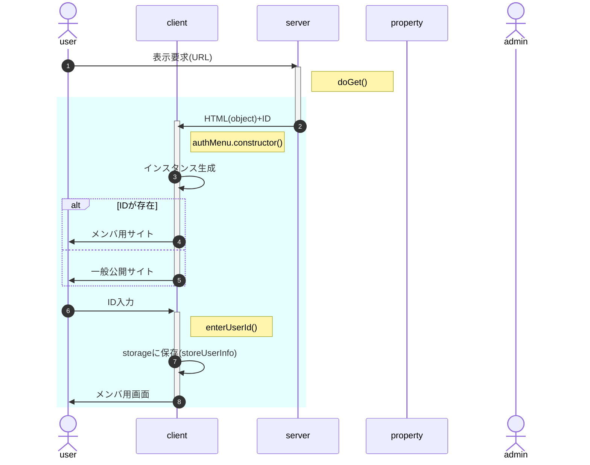
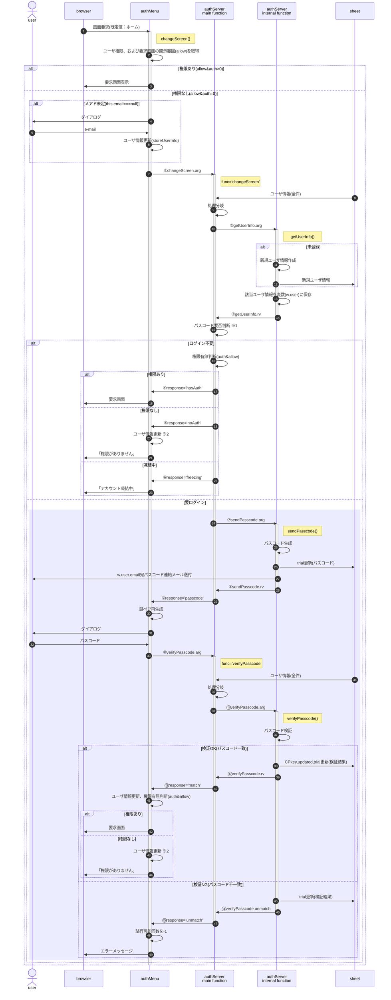
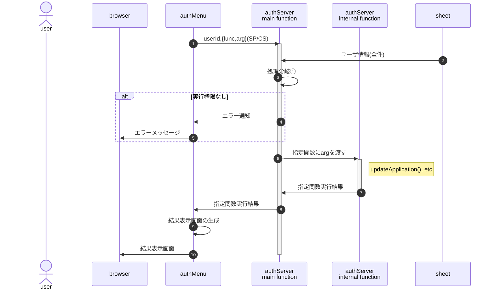
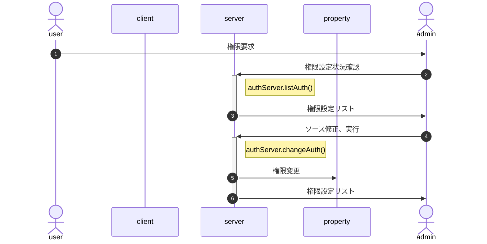
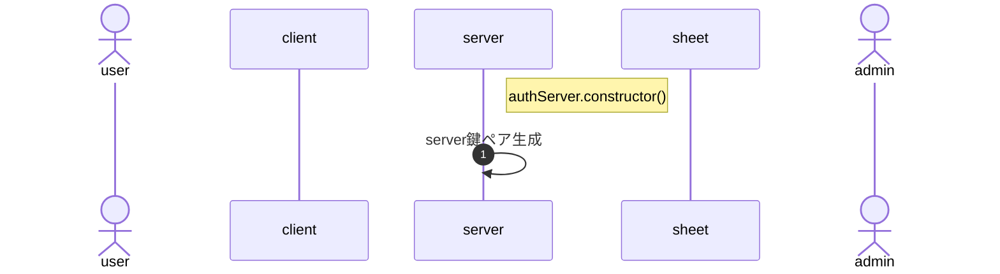

<!-- modifyMD original document 
<style>
/* -----------------------------------------------
  library/CSS/1.3.0/core.css
----------------------------------------------- */
html, body{
  width: 100%;
  margin: 0;
  /*font-size: 4vw;*/
  text-size-adjust: none; /* https://gotohayato.com/content/531/ */
}
body * {
  font-size: 1rem;
  font-family: sans-serif;
  box-sizing: border-box;
}
.num, .right {text-align:right;}
.screen {padding: 1rem;} /* SPAでの切替用画面 */
.title { /* Markdown他でのタイトル */
  font-size: 2.4rem;
  text-shadow: 2px 2px 5px #888;
}

/* --- テーブル -------------------------------- */
.table {display:grid}
th, .th, td, .td {
  margin: 0.2rem;
  padding: 0.2rem;
}
th, .th {
  background-color: #888;
  color: white;
}
td, .td {
  border-bottom: solid 1px #aaa;
  border-right: solid 1px #aaa;
}

/* --- 部品 ----------------------------------- */
.triDown { /* 下向き矢印 */
  --bw: 50px;
  width: 0px;
  height: 0px;
  border-top: calc(var(--bw) * 0.7) solid #aaa;
  border-right: var(--bw) solid transparent;
  border-left: var(--bw) solid transparent;
  border-bottom: calc(var(--bw) * 0.2) solid transparent;
}

/* --- 部品：待機画面 --------------------------- */
.loader,
.loader:after {
  border-radius: 50%;
  width: 10em;
  height: 10em;
}
.loader {
  margin: 60px auto;
  font-size: 10px;
  position: relative;
  text-indent: -9999em;
  border-top: 1.1em solid rgba(204,204,204, 0.2);
  border-right: 1.1em solid rgba(204,204,204, 0.2);
  border-bottom: 1.1em solid rgba(204,204,204, 0.2);
  border-left: 1.1em solid #cccccc;
  -webkit-transform: translateZ(0);
  -ms-transform: translateZ(0);
  transform: translateZ(0);
  -webkit-animation: load8 1.1s infinite linear;
  animation: load8 1.1s infinite linear;
}
@-webkit-keyframes load8 {
  0% {
    -webkit-transform: rotate(0deg);
    transform: rotate(0deg);
  }
  100% {
    -webkit-transform: rotate(360deg);
    transform: rotate(360deg);
  }
}
@keyframes load8 {
  0% {
    -webkit-transform: rotate(0deg);
    transform: rotate(0deg);
  }
  100% {
    -webkit-transform: rotate(360deg);
    transform: rotate(360deg);
  }
}
</style>
<p class="title">class authMenu</p>

# 機能概要

htmlからdata-menu属性を持つ要素を抽出、ハンバーガーメニューを作成する。

またHTML上のメニュー(SPAの機能)毎に許容権限を設定し、ユーザ毎に認証することで、表示制御を可能にする。

<?xml version="1.0" encoding="UTF-8"?>
<!DOCTYPE svg PUBLIC "-//W3C//DTD SVG 1.1//EN" "http://www.w3.org/Graphics/SVG/1.1/DTD/svg11.dtd">
<svg xmlns="http://www.w3.org/2000/svg" xmlns:xlink="http://www.w3.org/1999/xlink" version="1.1" width="726px" height="271px" viewBox="-0.5 -0.5 726 271"><defs/><g><g><path d="M 328.2 270 L 370.2 78 L 514.2 78 L 472.2 270 Z" fill="rgb(255, 255, 255)" stroke="rgb(0, 0, 0)" stroke-width="0.6" stroke-miterlimit="10" pointer-events="all"/></g><g><path d="M 328.2 234 L 370.2 42 L 514.2 42 L 472.2 234 Z" fill="#b3b3b3" stroke="none" pointer-events="all"/></g><g><path d="M 466.2 30 L 472.2 0 L 514.2 0 L 508.2 30 Z" fill="rgb(255, 255, 255)" stroke="rgb(0, 0, 0)" stroke-width="0.6" stroke-miterlimit="10" pointer-events="all"/></g><g><g transform="translate(-0.5 -0.5)scale(0.6)"><switch><foreignObject pointer-events="none" width="167%" height="167%" requiredFeatures="http://www.w3.org/TR/SVG11/feature#Extensibility" style="overflow: visible; text-align: left;"><div xmlns="http://www.w3.org/1999/xhtml" style="display: flex; align-items: unsafe center; justify-content: unsafe center; width: 78px; height: 1px; padding-top: 25px; margin-left: 778px;"><div data-drawio-colors="color: rgb(0, 0, 0); " style="box-sizing: border-box; font-size: 0px; text-align: center;"><div style="display: inline-block; font-size: 12px; font-family: Helvetica; color: rgb(0, 0, 0); line-height: 1.2; pointer-events: all; white-space: normal; overflow-wrap: normal;"><font style="font-size: 20px;">.icon</font></div></div></div></foreignObject><text x="817" y="29" fill="rgb(0, 0, 0)" font-family="Helvetica" font-size="12px" text-anchor="middle">.icon</text></switch></g></g><g><path d="M 364.2 198 L 400.2 30 L 508.2 30 L 472.2 198 Z" fill="rgb(255, 255, 255)" stroke="rgb(0, 0, 0)" stroke-width="0.6" stroke-miterlimit="10" pointer-events="all"/></g><g><g transform="translate(-0.5 -0.5)scale(0.6)"><switch><foreignObject pointer-events="none" width="167%" height="167%" requiredFeatures="http://www.w3.org/TR/SVG11/feature#Extensibility" style="overflow: visible; text-align: left;"><div xmlns="http://www.w3.org/1999/xhtml" style="display: flex; align-items: unsafe center; justify-content: unsafe center; width: 238px; height: 1px; padding-top: 190px; margin-left: 608px;"><div data-drawio-colors="color: rgb(0, 0, 0); " style="box-sizing: border-box; font-size: 0px; text-align: center;"><div style="display: inline-block; font-size: 12px; font-family: Helvetica; color: rgb(0, 0, 0); line-height: 1.2; pointer-events: all; white-space: normal; overflow-wrap: normal;"><font style="font-size: 20px;">nav</font></div></div></div></foreignObject><text x="727" y="194" fill="rgb(0, 0, 0)" font-family="Helvetica" font-size="12px" text-anchor="middle">nav</text></switch></g></g><g><rect x="388.2" y="204" width="36" height="18" fill="none" stroke="none" pointer-events="all"/></g><g><g transform="translate(-0.5 -0.5)scale(0.6)"><switch><foreignObject pointer-events="none" width="167%" height="167%" requiredFeatures="http://www.w3.org/TR/SVG11/feature#Extensibility" style="overflow: visible; text-align: left;"><div xmlns="http://www.w3.org/1999/xhtml" style="display: flex; align-items: unsafe center; justify-content: unsafe center; width: 58px; height: 1px; padding-top: 355px; margin-left: 648px;"><div data-drawio-colors="color: rgb(0, 0, 0); " style="box-sizing: border-box; font-size: 0px; text-align: center;"><div style="display: inline-block; font-size: 12px; font-family: Helvetica; color: rgb(0, 0, 0); line-height: 1.2; pointer-events: all; white-space: normal; overflow-wrap: normal;"><font style="font-size: 20px;">.back</font></div></div></div></foreignObject><text x="677" y="359" fill="rgb(0, 0, 0)" font-family="Helvetica" font-size="12px" text-anchor="middle">.back</text></switch></g></g><g><rect x="370.2" y="246" width="72" height="18" fill="none" stroke="none" pointer-events="all"/></g><g><g transform="translate(-0.5 -0.5)scale(0.6)"><switch><foreignObject pointer-events="none" width="167%" height="167%" requiredFeatures="http://www.w3.org/TR/SVG11/feature#Extensibility" style="overflow: visible; text-align: left;"><div xmlns="http://www.w3.org/1999/xhtml" style="display: flex; align-items: unsafe center; justify-content: unsafe center; width: 118px; height: 1px; padding-top: 425px; margin-left: 618px;"><div data-drawio-colors="color: rgb(0, 0, 0); " style="box-sizing: border-box; font-size: 0px; text-align: center;"><div style="display: inline-block; font-size: 12px; font-family: Helvetica; color: rgb(0, 0, 0); line-height: 1.2; pointer-events: all; white-space: normal; overflow-wrap: normal;"><span style="font-size: 20px;">.wrapper</span></div></div></div></foreignObject><text x="677" y="429" fill="rgb(0, 0, 0)" font-family="Helvetica" font-size="12px" text-anchor="middle">.wrapper</text></switch></g></g><g><rect x="0" y="0" width="253.2" height="258" fill="rgb(255, 255, 255)" stroke="rgb(0, 0, 0)" stroke-width="0.6" pointer-events="all"/></g><g><g transform="translate(-0.5 -0.5)scale(0.6)"><switch><foreignObject pointer-events="none" width="167%" height="167%" requiredFeatures="http://www.w3.org/TR/SVG11/feature#Extensibility" style="overflow: visible; text-align: left;"><div xmlns="http://www.w3.org/1999/xhtml" style="display: flex; align-items: unsafe flex-start; justify-content: unsafe flex-start; width: 420px; height: 1px; padding-top: 7px; margin-left: 2px;"><div data-drawio-colors="color: rgb(0, 0, 0); " style="box-sizing: border-box; font-size: 0px; text-align: left;"><div style="display: inline-block; font-size: 12px; font-family: Helvetica; color: rgb(0, 0, 0); line-height: 1.2; pointer-events: all; white-space: normal; overflow-wrap: normal;"><font style="font-size: 20px;">.menu.screen name="wrapper"</font></div></div></div></foreignObject><text x="2" y="19" fill="rgb(0, 0, 0)" font-family="Helvetica" font-size="12px">.menu.screen name="wrapper"</text></switch></g></g><g><rect x="7.2" y="24" width="240" height="42" fill="rgb(255, 255, 255)" stroke="rgb(0, 0, 0)" stroke-width="0.6" pointer-events="all"/></g><g><g transform="translate(-0.5 -0.5)scale(0.6)"><switch><foreignObject pointer-events="none" width="167%" height="167%" requiredFeatures="http://www.w3.org/TR/SVG11/feature#Extensibility" style="overflow: visible; text-align: left;"><div xmlns="http://www.w3.org/1999/xhtml" style="display: flex; align-items: unsafe flex-start; justify-content: unsafe flex-start; width: 398px; height: 1px; padding-top: 47px; margin-left: 14px;"><div data-drawio-colors="color: rgb(0, 0, 0); " style="box-sizing: border-box; font-size: 0px; text-align: left;"><div style="display: inline-block; font-size: 12px; font-family: Helvetica; color: rgb(0, 0, 0); line-height: 1.2; pointer-events: all; white-space: normal; overflow-wrap: normal;"><font style="font-size: 20px;">.data-menu</font><div><font style="font-size: 20px;">="id:'c11',label:'掲示板',func:'board'"</font></div></div></div></div></foreignObject><text x="14" y="59" fill="rgb(0, 0, 0)" font-family="Helvetica" font-size="12px">.data-menu...</text></switch></g></g><g><rect x="7.2" y="72" width="240" height="42" fill="rgb(255, 255, 255)" stroke="rgb(0, 0, 0)" stroke-width="0.6" pointer-events="all"/></g><g><g transform="translate(-0.5 -0.5)scale(0.6)"><switch><foreignObject pointer-events="none" width="167%" height="167%" requiredFeatures="http://www.w3.org/TR/SVG11/feature#Extensibility" style="overflow: visible; text-align: left;"><div xmlns="http://www.w3.org/1999/xhtml" style="display: flex; align-items: unsafe flex-start; justify-content: unsafe flex-start; width: 398px; height: 1px; padding-top: 127px; margin-left: 14px;"><div data-drawio-colors="color: rgb(0, 0, 0); " style="box-sizing: border-box; font-size: 0px; text-align: left;"><div style="display: inline-block; font-size: 12px; font-family: Helvetica; color: rgb(0, 0, 0); line-height: 1.2; pointer-events: all; white-space: normal; overflow-wrap: normal;"><font style="font-size: 20px;">.data-menu</font><div><font style="font-size: 20px;">="id:'c21',label:'入会申込',href:'https://〜'"</font></div></div></div></div></foreignObject><text x="14" y="139" fill="rgb(0, 0, 0)" font-family="Helvetica" font-size="12px">.data-menu...</text></switch></g></g><g><rect x="7.2" y="120" width="240" height="132" fill="rgb(255, 255, 255)" stroke="rgb(0, 0, 0)" stroke-width="0.6" pointer-events="all"/></g><g><g transform="translate(-0.5 -0.5)scale(0.6)"><switch><foreignObject pointer-events="none" width="167%" height="167%" requiredFeatures="http://www.w3.org/TR/SVG11/feature#Extensibility" style="overflow: visible; text-align: left;"><div xmlns="http://www.w3.org/1999/xhtml" style="display: flex; align-items: unsafe flex-start; justify-content: unsafe flex-start; width: 398px; height: 1px; padding-top: 207px; margin-left: 14px;"><div data-drawio-colors="color: rgb(0, 0, 0); " style="box-sizing: border-box; font-size: 0px; text-align: left;"><div style="display: inline-block; font-size: 12px; font-family: Helvetica; color: rgb(0, 0, 0); line-height: 1.2; pointer-events: all; white-space: normal; overflow-wrap: normal;"><font style="font-size: 20px;">.data-menu</font><div><font style="font-size: 20px;">="id:'c30',label:'Information'</font></div></div></div></div></foreignObject><text x="14" y="219" fill="rgb(0, 0, 0)" font-family="Helvetica" font-size="12px">.data-menu...</text></switch></g></g><g><rect x="14.4" y="156" width="177.6" height="42" fill="rgb(255, 255, 255)" stroke="rgb(0, 0, 0)" stroke-width="0.6" pointer-events="all"/></g><g><g transform="translate(-0.5 -0.5)scale(0.6)"><switch><foreignObject pointer-events="none" width="167%" height="167%" requiredFeatures="http://www.w3.org/TR/SVG11/feature#Extensibility" style="overflow: visible; text-align: left;"><div xmlns="http://www.w3.org/1999/xhtml" style="display: flex; align-items: unsafe flex-start; justify-content: unsafe flex-start; width: 294px; height: 1px; padding-top: 267px; margin-left: 26px;"><div data-drawio-colors="color: rgb(0, 0, 0); " style="box-sizing: border-box; font-size: 0px; text-align: left;"><div style="display: inline-block; font-size: 12px; font-family: Helvetica; color: rgb(0, 0, 0); line-height: 1.2; pointer-events: all; white-space: normal; overflow-wrap: normal;"><font style="font-size: 20px;">.data-menu</font><div><font style="font-size: 20px;">="id:'c31',label:'会場案内図'</font></div></div></div></div></foreignObject><text x="26" y="279" fill="rgb(0, 0, 0)" font-family="Helvetica" font-size="12px">.data-menu...</text></switch></g></g><g><rect x="14.4" y="204" width="177.6" height="42" fill="rgb(255, 255, 255)" stroke="rgb(0, 0, 0)" stroke-width="0.6" pointer-events="all"/></g><g><g transform="translate(-0.5 -0.5)scale(0.6)"><switch><foreignObject pointer-events="none" width="167%" height="167%" requiredFeatures="http://www.w3.org/TR/SVG11/feature#Extensibility" style="overflow: visible; text-align: left;"><div xmlns="http://www.w3.org/1999/xhtml" style="display: flex; align-items: unsafe flex-start; justify-content: unsafe flex-start; width: 294px; height: 1px; padding-top: 347px; margin-left: 26px;"><div data-drawio-colors="color: rgb(0, 0, 0); " style="box-sizing: border-box; font-size: 0px; text-align: left;"><div style="display: inline-block; font-size: 12px; font-family: Helvetica; color: rgb(0, 0, 0); line-height: 1.2; pointer-events: all; white-space: normal; overflow-wrap: normal;"><font style="font-size: 20px;">.data-menu</font><div><font style="font-size: 20px;">="id:'c32',label:'タイムテーブル'</font></div></div></div></div></foreignObject><text x="26" y="359" fill="rgb(0, 0, 0)" font-family="Helvetica" font-size="12px">.data-menu...</text></switch></g></g><g><rect x="580.2" y="3" width="144" height="234" fill="#b3b3b3" stroke="none" pointer-events="all"/></g><g/><g><rect x="616.2" y="33" width="108" height="150" fill="#cccccc" stroke="#ffffff" stroke-width="1.2" pointer-events="all"/></g><g><rect x="622.2" y="39" width="102" height="24" fill="#cccccc" stroke="#ffffff" stroke-width="1.2" pointer-events="all"/></g><g><g transform="translate(-0.5 -0.5)scale(0.6)"><switch><foreignObject pointer-events="none" width="167%" height="167%" requiredFeatures="http://www.w3.org/TR/SVG11/feature#Extensibility" style="overflow: visible; text-align: left;"><div xmlns="http://www.w3.org/1999/xhtml" style="display: flex; align-items: unsafe center; justify-content: unsafe flex-start; width: 168px; height: 1px; padding-top: 85px; margin-left: 1039px;"><div data-drawio-colors="color: rgb(0, 0, 0); " style="box-sizing: border-box; font-size: 0px; text-align: left;"><div style="display: inline-block; font-size: 12px; font-family: Helvetica; color: rgb(0, 0, 0); line-height: 1.2; pointer-events: all; white-space: normal; overflow-wrap: normal;"><font style="font-size: 20px;"> 掲示板</font></div></div></div></foreignObject><text x="1039" y="89" fill="rgb(0, 0, 0)" font-family="Helvetica" font-size="12px"> 掲示板</text></switch></g></g><g><rect x="622.2" y="66" width="102" height="24" fill="#cccccc" stroke="#ffffff" stroke-width="1.2" pointer-events="all"/></g><g><g transform="translate(-0.5 -0.5)scale(0.6)"><switch><foreignObject pointer-events="none" width="167%" height="167%" requiredFeatures="http://www.w3.org/TR/SVG11/feature#Extensibility" style="overflow: visible; text-align: left;"><div xmlns="http://www.w3.org/1999/xhtml" style="display: flex; align-items: unsafe center; justify-content: unsafe flex-start; width: 168px; height: 1px; padding-top: 130px; margin-left: 1039px;"><div data-drawio-colors="color: rgb(0, 0, 0); " style="box-sizing: border-box; font-size: 0px; text-align: left;"><div style="display: inline-block; font-size: 12px; font-family: Helvetica; color: rgb(0, 0, 0); line-height: 1.2; pointer-events: all; white-space: normal; overflow-wrap: normal;"><font style="font-size: 20px;">入会申込</font></div></div></div></foreignObject><text x="1039" y="134" fill="rgb(0, 0, 0)" font-family="Helvetica" font-size="12px">入会申込</text></switch></g></g><g><rect x="622.2" y="93" width="102" height="84" fill="#cccccc" stroke="#ffffff" stroke-width="1.2" pointer-events="all"/></g><g><g transform="translate(-0.5 -0.5)scale(0.6)"><switch><foreignObject pointer-events="none" width="167%" height="167%" requiredFeatures="http://www.w3.org/TR/SVG11/feature#Extensibility" style="overflow: visible; text-align: left;"><div xmlns="http://www.w3.org/1999/xhtml" style="display: flex; align-items: unsafe flex-start; justify-content: unsafe flex-start; width: 168px; height: 1px; padding-top: 162px; margin-left: 1039px;"><div data-drawio-colors="color: rgb(0, 0, 0); " style="box-sizing: border-box; font-size: 0px; text-align: left;"><div style="display: inline-block; font-size: 12px; font-family: Helvetica; color: rgb(0, 0, 0); line-height: 1.2; pointer-events: all; white-space: normal; overflow-wrap: normal;"><font style="font-size: 20px;"> Information</font></div></div></div></foreignObject><text x="1039" y="174" fill="rgb(0, 0, 0)" font-family="Helvetica" font-size="12px"> Information</text></switch></g></g><g><rect x="628.2" y="117" width="96" height="24" fill="#cccccc" stroke="#ffffff" stroke-width="1.2" pointer-events="all"/></g><g><g transform="translate(-0.5 -0.5)scale(0.6)"><switch><foreignObject pointer-events="none" width="167%" height="167%" requiredFeatures="http://www.w3.org/TR/SVG11/feature#Extensibility" style="overflow: visible; text-align: left;"><div xmlns="http://www.w3.org/1999/xhtml" style="display: flex; align-items: unsafe center; justify-content: unsafe flex-start; width: 158px; height: 1px; padding-top: 215px; margin-left: 1049px;"><div data-drawio-colors="color: rgb(0, 0, 0); " style="box-sizing: border-box; font-size: 0px; text-align: left;"><div style="display: inline-block; font-size: 12px; font-family: Helvetica; color: rgb(0, 0, 0); line-height: 1.2; pointer-events: all; white-space: normal; overflow-wrap: normal;"><font style="font-size: 20px;">会場案内図</font></div></div></div></foreignObject><text x="1049" y="219" fill="rgb(0, 0, 0)" font-family="Helvetica" font-size="12px">会場案内図</text></switch></g></g><g><rect x="628.2" y="147" width="96" height="24" fill="#cccccc" stroke="#ffffff" stroke-width="1.2" pointer-events="all"/></g><g><g transform="translate(-0.5 -0.5)scale(0.6)"><switch><foreignObject pointer-events="none" width="167%" height="167%" requiredFeatures="http://www.w3.org/TR/SVG11/feature#Extensibility" style="overflow: visible; text-align: left;"><div xmlns="http://www.w3.org/1999/xhtml" style="display: flex; align-items: unsafe center; justify-content: unsafe flex-start; width: 158px; height: 1px; padding-top: 265px; margin-left: 1049px;"><div data-drawio-colors="color: rgb(0, 0, 0); " style="box-sizing: border-box; font-size: 0px; text-align: left;"><div style="display: inline-block; font-size: 12px; font-family: Helvetica; color: rgb(0, 0, 0); line-height: 1.2; pointer-events: all; white-space: normal; overflow-wrap: normal;"><font style="font-size: 20px;">タイムテーブル</font></div></div></div></foreignObject><text x="1049" y="269" fill="rgb(0, 0, 0)" font-family="Helvetica" font-size="12px">タイムテーブル</text></switch></g></g><g/><g><rect x="694.2" y="3" width="30" height="30" fill="rgb(255, 255, 255)" stroke="none" pointer-events="all"/></g><g><rect x="694.2" y="3" width="30" height="30" fill="rgb(255, 255, 255)" stroke="none" pointer-events="all"/></g><g><path d="M 697.2 9 L 721.2 9" fill="none" stroke="#999999" stroke-width="3.6" stroke-miterlimit="10" pointer-events="stroke"/></g><g><path d="M 697.2 18 L 721.2 18" fill="none" stroke="#999999" stroke-width="3.6" stroke-miterlimit="10" pointer-events="stroke"/></g><g><path d="M 697.2 27 L 721.2 27" fill="none" stroke="#999999" stroke-width="3.6" stroke-miterlimit="10" pointer-events="stroke"/></g><g><path d="M 274.2 72 L 310.2 130.5 L 274.2 189 Z" fill="#e6e6e6" stroke="none" pointer-events="all"/></g><g><path d="M 532.2 70.5 L 568.2 129 L 532.2 187.5 Z" fill="#e6e6e6" stroke="none" pointer-events="all"/></g></g></svg>

本クラスは**Google SpreadのGASにデプロイし、SPAとして使用する**ことを想定しているため、'camp2024'等の**呼出元**で以下の作業を行う。

1. caller/index.htmlの作成
   1. body部での要素定義
   1. authMenuの適用値設定
   1. グローバル変数、local/sessionStorageでのユーザ情報保存(※1)
   1. class authMenu(=authMenu/client.js)の組み込み(※2)
1. caller/server.gs
   1. authServerの適用値設定
   1. documentPropertiesでのサーバ・ユーザ情報保存(※1)
   1. authServer(=authMenu/server.js)の組み込み(※2)
1. ユーザ情報保存用シートの作成

なお以下2点は自動的に行う。
- ※1 : 「〜情報保存」は、システム側で自動的に処理(作業は発生しない)
- ※2 : 呼出元のbuild.shで自動処理。記述方法は「フォルダ構成、ビルド手順」を参照。

# 使用方法

## body部での要素定義

<a name="receiving_query_string"></a>

### クエリ文字列の受取

以下は`https://script.google.com/〜4yz/exec?id=XXX`として、変数`id`でユーザIDを渡している例。

サーバ側でクエリ文字列を受け取り、HTML内の変数`userId`にセット。

```
function doGet(e){
  const template = HtmlService.createTemplateFromFile('index');
  template.userId = e.parameter.id;  // ここ!!
  const htmlOutput = template.evaluate();
  htmlOutput.setTitle('camp2024');
  return htmlOutput;
}
```

クライアント側では`<?= userId ?>`で値を取得。

```
<div style="display:none" name="userId"><?= userId ?></div>
```

以下、querySelector等で適宜参照する。

### メニュー要素の定義

- 表示部は&lt;div data-menu&gt;の階層内で定義する。<br>
  階層外の要素はメニューで選択しても表示されない。
- data-menu属性を持つ要素にIDとなるclass属性を付与

```
<body>
  <p class="title">校庭キャンプ2024</p>
  <div class="authMenu screen" name="wrapper">
    <div data-menu="id:'イベント情報'">
      <div data-menu="id:'掲示板',func:'dispBoard'"></div>
      <div data-menu="id:'実施要領'">
        <!--：：$tmp/実施要領.html：：--＞ ※ embedRecursivelyのプレースホルダは一行で記述
      </div>
    </div>
  </div>
(中略)
```

下位の階層を持つ場合、自分自身の表示内容は持たせない(以下はNG)

```
<div data-menu="id:'お知らせ'">
!!NG!! <p>お知らせのページです</p>
  <div data-menu="id:'掲示板'">〜</div>
  <div data-menu="id:'注意事項'">〜</div>
</div>
```

「お知らせ」は「掲示板」「注意事項」のブランチとして扱われるので、「&lt;p&gt;お知らせのページです&lt;/p&gt;」というお知らせページ自身の表示内容は定義不可。

### data-menu属性に設定する文字列

タグのallowとその人の権限(auth)の論理積>0ならメニューを表示する。

オブジェクトの記述に準ずる。但し短縮するため前後の"{","}"は省略する。

- {string} id - 【必須】メニューID
- {string} [label] - メニュー化する時の名称。省略時はidを使用
- {string} [func] - メニュー選択時に実行する関数名。<br>
  関数名と実際の関数はauthMenuインスタンス生成時に定義。
- {string} [href] - 遷移先のURL。別タブが開かれる。
- {number} [allow=2^32-1] - 開示範囲。<br>
  authMenuインスタンス生成時のユーザ権限(auth)との論理積>0なら表示する。
  > ex: 一般参加者1、スタッフ2として
  >     data-menu="allow:2"とされた要素は、
  >     new authMenu({auth:1})の一般参加者は非表示、
  >     new authMenu({auth:2})のスタッフは表示となる。
- {string} [from='1970/1/1'] - メニュー有効期間の開始日時。Dateオブジェクトで処理可能な日時文字列で指定
- {string} [to='9999/12/31'] - メニュー有効期間の終了日時

注意事項

- func, hrefは排他。両方指定された場合はfuncを優先する
- func, href共に指定されなかった場合、SPAの画面切替指示と見なし、idの画面に切り替える
- href指定の場合、タグ内の文字列は無視される(下例2行目の「テスト」)
  ```
  <div data-menu="id:'c41',label:'これはOK',href:'https://〜'"></div>
  <div data-menu="id:'c41',label:'これはNG',href:'https://〜'">テスト</div>
  ```
- 以下例ではシステム管理者(auth=8)は両方表示されるが、一般ユーザ(auth=1)にはシステム設定は表示されない
  ```
  <div data-menu="allow:9">利用案内</div>
  <div data-menu="allow:8">システム設定</div>
  (中略)
  <script>
    const auth = new Auth(...);  // 利用権限を取得。一般ユーザ:1, 管理者:8
    const menu = new authMenu();
  ```
- ユーザ権限は一般公開部分は`auth=1`とし、auth=0は使用しない(∵0⇒誰も見えない)。以降**権限が大きくなるにつれて大きな数字を使用**する
- 申込フォームのように申込期限がある場合、同一IDで下の例のように設定する。
  ```
  <!-- 申込開始前 〜2024/03/31 --＞
  <div data-menu="id:'entryForm',to:'2024/04/01 00:00:00'">
    「まだお申し込みいただけません」
  </div>

  <!-- 申込期間内 2024/04/01〜07 --＞
  <div data-menu="id:'entryForm',from:'2024/04/01',to:'2024/04/08 00:00:00'">
    申込フォーム
  </div>

  <!-- 申込終了後 2024/04/08〜 --＞
  <div data-menu="id:'entryForm',from:'2024/04/08'">
    「申込は終了しました」
  </div>
  ```
- メニュー生成時点で有効期限を判断、同一IDが複数存在する場合はいずれか一つのDIVのみ残して残りを削除してメニューを生成する。

## authMenuの適用値設定

インスタンス生成時の引数はそのまま**authMenuメンバ変数**となる。

以下はthisとして「constructorのv.default < constructorの引数 < listViewの引数」の順で有効となる。

1. 「**太字**」はインスタンス生成時、必須指定項目
1. 「【*内部*】」は指定不要の項目(constructor他で自動的に設定されるメンバ)
1. その他はconstructorの引数で指定可、指定が無い項目は既定値をセット

- wrapper='.authMenu.screen[name="wrapper"]' {string|HTMLElement} 作成対象のdata-menuを全て含む親要素。CSSセレクタかHTMLElementで指定。
- func {Object.<string,Function>} メニューから実行する関数を集めたライブラリ
- home {string} ホーム画面として使用するメニューの識別子。無指定の場合、wrapper直下でdata-menu属性を持つ最初の要素
- initialSubMenu=true {boolean} サブメニューの初期状態。true:開いた状態、false:閉じた状態
- css {string} authMenu専用CSS
- toggle {Arrow} 【*内部*】ナビゲーション領域の表示/非表示切り替え
- showChildren {Arrow} 【*内部*】ブランチの下位階層メニュー表示/非表示切り替え

### インスタンス生成時の処理フロー



- 水色の部分はhtmlのonload時処理
- 表示要求に対するserverからの戻り値(ID)については、「[クエリ文字列の受取](#receiving_query_string)」の項を参照。
- 「インスタンス生成」での処理内容
  1. ユーザ情報を取得、不足分は既定値を設定
     - 引数、HTML埋込情報、sessionStorage、localStorageのユーザ情報を取得
     - IDを特定(引数>HTML埋込>session>local。いずれにも無ければnull)
     - IDが特定されるならauthを一般公開->参加者に変更
  1. 親要素を走査してナビゲーションを作成(アイコン、ナビ領域、背景)
- 図中の`enterUserId()`は、`new authMenu()`の引数として渡された関数

<!--
- 「インスタンス生成」の処理内容
  1. authClient.constructor()
     1. localStorageにIDがあるか確認<br>
        不存在または不一致なら、serverから戻されたIDをlocalStorageに保存
  1. authMenu.constructor()
     1. AuthインスタンスをauthMenuのインスタンスメンバとして生成(以下Burger.auth)
     1. Burger.auth.IDの値に従ってAuthメニュー描画(メニューアイコン、nav領域)

[HtmlOutput.appendUntrusted()](https://developers.google.com/apps-script/reference/html/html-output?hl=ja#appenduntrustedaddedcontent)を使用して、HTMLの要素として返す。

    user ->> client : ID入力
    activate client
    Note right of client : enterUserId()
    client ->> user : メンバ用サイト
    deactivate client

--＞

### scriptサンプル

```
window.addEventListener('DOMContentLoaded',() => {
  const v = {whois:'DOMContentLoaded',rv:null,step:0};
  console.log(`${v.whois} start.`);
  try {

    v.step = 1; // userId,authをセット
    v.config = storeUserInfo();
    if( v.r instanceof Error ) throw v.r;

    v.step = 2.1; // 使用するクラスのインスタンス化
    v.auth = new authMenu();
    v.step = 2.2;
    v.menu = new authMenu({func:{
      enterId:()=>{
        console.log('enterId start.');
        const v = window.prompt('受付番号を入力してください');
        if( v.match(/^[0-9]+/) ){
          v.r = storeUserInfo(v);
          if( v.r instanceof Error ) throw v.r;
          //this.auth = 2; -> thisはwindowになる
          console.log(this);
          //this.genNavi(2); -> thisはwindowになる
        }
      }
    }});

    v.step = 99; // 終了処理
    console.log(`${v.whois} normal end.`);
    return v.rv;
  } catch(e) {
    e.message = `${v.whois} abnormal end at step.${v.step}\n${e.message}`;
    console.error(`${e.message}\nv=${JSON.stringify(v)}`);
    alert(e.message);
  }
});
```

## グローバル変数、local/sessionStorageのユーザ情報保存

`onClick`や`addEventListener`から呼ばれる関数にauthMenuインスタンスを渡す必要があるため、**authMenuのインスタンスはグローバル変数として定義**する。

```
<script type="text/javascript">
const g = {};
(中略)
window.addEventListener('DOMContentLoaded',() => {
  g.menu = new authMenu({...});
  (後略)
});
</script>
```

- localStorage : `"authMenu"(固定) : ユーザID(初期値null)`
- sessionStorage : `"authMenu"(固定)`
  1. {number} userId=null - ユーザID
  1. {string} email='' - 連絡先メールアドレス
  1. {number} created=null - ユーザ側鍵ペアの作成日時(UNIX時刻)。有効期間検証に使用
  1. {string} passPhrase=createPassword() - クライアント側鍵ペア生成の際のパスフレーズ
  1. {number} auth=1 - ユーザの権限
  1. {number} unfreeze=null - ログイン連続失敗後、凍結解除される日時(UNIX時刻)
  1. {string} SPkey=null - サーバ側公開鍵
- グローバル変数
  1. {string} programId - authMenuを呼び出すプロジェクト(関数)名
  1. {Object} CSkey - クライアント側の秘密鍵
  1. {string} CPkey - クライアント側の公開鍵

**注意事項**

1. local/sessionStorageに`authMenu`キーがない場合、作成
1. グローバル変数にCS/CPkeyがない場合、作成

※ sessionStorageに秘密鍵を保存することができないため、鍵ペアはonload時に生成し、グローバル変数として保持する

<a name="7decbcdb14f79d872117b5ebedc691c5"></a>

## authServerの適用値設定

1. {Object.<string>:<Function>} func={} - 使用する関数を集めたオブジェクト
1. {number} loginRetryInterval=3,600,000(60分) - 前回ログイン失敗(3回連続失敗)から再挑戦可能になるまでの時間(ミリ秒)
1. {number} numberOfLoginAttempts=3 - ログイン失敗になるまでの試行回数
1. {number} loginGraceTime=900,000(15分) - パスコード生成からログインまでの猶予時間(ミリ秒)
1. {number} userLoginLifeTime=86,400,000(24時間) - クライアント側ログイン(CPkey)有効期間
1. {string} masterSheet='master' - 参加者マスタのシート名
1. {string} primatyKeyColumn='userId' - 主キーとなる項目名。主キーは数値で設定
1. {string} emailColumn='email' - e-mailを格納する項目名

## documentPropertiesのサーバ・ユーザ情報保存

- DocumentProperties : `"authServer"(固定)`
  1. {string} passPhrase - サーバ側鍵ペア生成の際のパスフレーズ
  1. {Object} SCkey - サーバ側秘密鍵
  1. {string} SPkey - サーバ側公開鍵
  1. {Object} map - `{email:userId}`形式のマップ
- DocumentProperties : `(ユーザID)`
  1. {number} userId - ユーザID
  1. {string} email - e-mail
  1. {number} created - ユーザ側鍵ペアの作成日時(UNIX時刻)。有効期間検証に使用
  1. {string} CPKey - ユーザの公開鍵
  1. {number} auth - ユーザの権限
  1. {Object[]} log - ログイン試行のログ。unshiftで保存、先頭を最新にする
     1. {number} startAt - 試行開始日時(UNIX時刻)
     1. {number} passcode - パスコード(原則数値6桁)
     1. {Object[]} trial - 試行。unshiftで保存、先頭を最新にする
        1. {number} timestamp - 試行日時(UNIX時刻)
        1. {number} entered - 入力されたパスコード
        1. {boolean} result - パスコードと入力値の比較結果(true:OK)
        1. {string} message='' - NGの場合の理由。OKなら空文字列
     1. {number} endAt - 試行終了日時(UNIX時刻)
     1. {boolean} result - 試行の結果(true:OK)

## ユーザ情報保存用シートの作成

システム関係項目として以下を作成し、シート名を[authServerの適用値設定](#7decbcdb14f79d872117b5ebedc691c5)の`masterSheet`に定義する。

1. 「【*内部*】」は指定不要の項目(システム側で自動的に作成・更新)

- userId {number} 【*内部*】ユーザID
- created {string} 【*内部*】ユーザIDを登録した日時文字列
- email {string} 【*内部*】ユーザのe-mailアドレス
- auth {number} ユーザの権限
- CPkey {string} 【*内部*】ユーザの公開鍵
- updated {string} 【*内部*】ユーザ公開鍵が作成・更新された日時文字列
- trial {string} 【*内部*】ログイン試行関係情報のJSON文字列

1. 順番は不問
1. ヘッダ部(1行目)のみ作成し、2行目以降のデータ部は作成不要
1. `auth`のみ手動で変更可。他項目はシステムで設定・変更するので手動での変更は不可
1. これ以外の項目は任意に追加可能

# 機能別処理フロー

窃取したIDでの操作を防止するため、clientで有効期間付きの鍵ペアを生成し、依頼元の信頼性を確保する(CSkey, CPkey : clientの秘密鍵・公開鍵)。

また何らかの手段でCPkeyが窃取されて操作要求が行われた場合、処理結果の暗号化で結果受領を阻止するため、server側も鍵ペアを使用する(SSkey, SPkey : serverの秘密鍵・公開鍵)。

以降の図中で`(XSkey/YPkey)`は「X側の秘密鍵で署名、Y側の公開鍵で暗号化する」の意味。

## 画面切替(＋新規ユーザ登録)

「画面切替」はサーバ側に開示範囲(allow)を渡し、シート上のユーザ権限(auth)と比較することで「要求画面を表示する権限が存在するか」を確認し、クライアント側でサーバ側の確認結果に基づき画面切替を行う。

新規ユーザ登録は「応募情報表示・編集画面に切り替える」という画面切替の一般事例に「シート上にユーザ情報が存在しなければ追加」という手順を追加することで、画面切替の特殊事例として扱う。



- ※1 : パスコード要否判断：いかのいずれかの場合、パスコードが必要
  - 新規ユーザ登録
  - パスコード生成からログインまでの猶予時間を過ぎている
  - クライアント側ログイン(CPkey)有効期限切れ
  - 引数のCPkeyがシート上のCPkeyと不一致
- ※2 : 権限が無いのにサーバまで問合せが来るのは、クライアント側の権限情報が誤っている可能性があるため、念のため更新する。

<iframe width="100%" height="500px" src="changeScreen.html"></iframe>
<!--
原本(Google Spread)
MyDrive > fy2024 > 2024mmdd_camp2024 > camp2024.gsheet > changeScreenシート
https://docs.google.com/spreadsheets/d/1wizrYCTnFbRpi38gJ3ZIdXtC3lV7NfEcQGkuj6-E0Jk/edit#gid=0
--＞

<!--
#### typedef

| 名称 | 属性 | 内容 | loc | ses | mem | I/O | sht |
| :-- | :-- | :-- | :--: | :--: | :--: | :--: | :--: |
| userId | number | (新規採番された)ユーザID | ◎ | ◎ | ◎ | ◎ | ◎ |
| created | string | ユーザID新規登録時刻(日時文字列) | × | × | × | × | ◎ |
| email | string | ユーザの連絡先メールアドレス | × | ◎ | ◎ | × | ◎ |
| auth | number | ユーザの権限 | × | ◎ | ◎ | ◎ | ◎ |
| passPhrase | string | クライアント側鍵ペア生成のパスフレーズ | × | ◎ | × | × | × |
| CSkey | object | クライアント側の秘密鍵 | × | × | ◎ | × | × |
| CPkey | string | クライアント側の公開鍵 | × | ◎ | ◎ | × | ◎ |
| updated | string | クライアント側公開鍵生成時刻(日時文字列) | × | ◎ | ◎ | × | ◎ |
| SPkey | string | サーバ側の公開鍵 | × | ◎ | ◎ | ◎ | × |
| isExist | boolean | 新規登録対象メアドが登録済ならtrue | × | × | × | ◎ | × |
| trial | object | ログイン試行関係情報 | × | × | × | ▲ | ◎ |

| 名称 | 属性 | 内容 | I/O |
| :-- | :-- | :-- | :-- |
| startAt | number | 試行開始日時(UNIX時刻) | × |
| passcode | number | パスコード(原則数値6桁) | × |
| log | object[] | 試行の記録。unshiftで先頭を最新にする | × |
| <span style="margin-left:1rem">timestamp</span> | number | 試行日時(UNIX時刻) | × |
| <span style="margin-left:1rem">entered</span> | number | 入力されたパスコード | × |
| <span style="margin-left:1rem">result</span> | boolean | パスコードと入力値の比較結果(true:OK) | × |
| <span style="margin-left:1rem">status</span> | string | NGの場合の理由。'OK':試行OK | × |
| endAt | number | 試行終了日時(UNIX時刻) | × |
| result | boolean | 試行の結果(true:OK) | ◎ |
| unfreeze | number | ログイン連続失敗後、凍結解除される日時(UNIX時刻) | ◎ |
- loc : localStorage
- ses : sessionStorage
- mem : authMenuインスタンス変数(メンバ)
- I/O : authServer -> authMenuへ送られるオブジェクト
- sht : シート
--＞

## シート更新

#### シートの更新(CRUD)を伴う処理の定義方法



- ①処理分岐：以下の全てを満たす場合、funcにarg(Object)を渡す
  1. 引数(arg)を復号、署名検証を行う
  1. userIdから当該ユーザの権限(auth)を特定、指定処理(func)の実行権限があるか確認
- updateApplication等に必要となる実行可能権限は、`setProperties()`で'allow'として予め埋め込んでおく。

## 権限設定、変更

権限を付与すべきかは個別に判断する必要があるため、システム化せず、管理者がソース(`authServer.changeAuth()`)を直接編集、GASコンソール上で実行する。



# フォルダ構成、ビルド手順

クライアント(ブラウザ)側の"class authMenu"とサーバ(GAS)側の"class authServer"に分かれるが、一体管理のためソースは一元管理する。

- archves : アーカイブ
- doc/ : readme.mdの各記事のソース集
  - proto.md : readme.mdのプロトタイプ
  - xxx.md : readme.mdに埋め込む各記事のソース
- src/ : プログラムソース
  - config.common.js : client/server共通config
  - config.client.js : client特有のconfig
  - config.server.js : server特有のconfig
  - authMenu.js : class authMenuのテンプレート
  - authServer.js : class authServerのテンプレート
  - authXxxx.yyyy.js : class authMenu/Server各メソッドのソース
- test/ : テスト用
- build.sh : client/server全体のビルダ
- index.html : クライアント側のソース
- server.gs : サーバ側のソース
- initialize.gs : サーバ側初期化処理のソース
- readme.md : doc配下を統合した、client/server全体の仕様書

# 仕様(JSDoc)

* [authMenu](#authMenu)
    * [new authMenu(arg)](#new_authMenu_new)
    * [.changeScreen(screenName)](#authMenu+changeScreen) ⇒ <code>void</code>
    * [.genNavi(wrapper, navi, depth, addMenu)](#authMenu+genNavi) ⇒ <code>null</code> \| <code>Error</code>
    * [.storeUserInfo(arg)](#authMenu+storeUserInfo) ⇒ <code>void</code>
    * [.doGAS()](#authMenu+doGAS)
    * [.toggle()](#authMenu+toggle)
    * [.showChildren()](#authMenu+showChildren)

<a name="new_authMenu_new"></a>

## new authMenu(arg)

| Param | Type |
| --- | --- |
| arg | <code>Object</code> | 

<a name="authMenu+changeScreen"></a>

## authMenu.changeScreen(screenName) ⇒ <code>void</code>
適宜認証を行った上で画面を切り替える

**Kind**: instance method of [<code>authMenu</code>](#authMenu)  

| Param | Type | Default | Description |
| --- | --- | --- | --- |
| screenName | <code>string</code> | <code>null</code> | 切替先の画面名 |

<a name="authMenu+genNavi"></a>

## authMenu.genNavi(wrapper, navi, depth, addMenu) ⇒ <code>null</code> \| <code>Error</code>
親要素を走査してナビゲーションを作成

**Kind**: instance method of [<code>authMenu</code>](#authMenu)  

| Param | Type | Default | Description |
| --- | --- | --- | --- |
| wrapper | <code>HTMLElement</code> |  | body等の親要素。 |
| navi | <code>HTMLElement</code> |  | nav等のナビゲーション領域 |
| depth | <code>number</code> | <code>0</code> | 再帰呼出の階層 |
| addMenu | <code>boolean</code> | <code>true</code> | 再帰呼出で呼出元(親要素)がメニュー化対象ならtrue |

<a name="authMenu+storeUserInfo"></a>

## authMenu.storeUserInfo(arg) ⇒ <code>void</code>
storeUserInfo: インスタンス変数やstorageに保存したユーザ情報を更新


1. 本関数の引数オブジェクト
1. インスタンス変数
1. sessionStorage
1. localStorage
1. HTMLに埋め込まれたユーザ情報

ユーザ情報を取得し、①>②>③>④>⑤の優先順位で最新の情報を特定、各々の内容を更新する。

| 名称 | 属性 | 内容 | loc | ses | mem | I/O | sht |
| :-- | :-- | :-- | :--: | :--: | :--: | :--: | :--: |
| userId | number | (新規採番された)ユーザID | ◎ | ◎ | ◎ | ◎ | ◎ |
| created | string | ユーザID新規登録時刻(日時文字列) | × | ◎ | ◎ | × | ◎ |
| email | string | ユーザの連絡先メールアドレス | × | ◎ | ◎ | × | ◎ |
| auth | number | ユーザの権限 | × | ◎ | ◎ | ◎ | ◎ |
| passPhrase | string | クライアント側鍵ペア生成のパスフレーズ | × | ◎ | ◎ | × | × |
| CSkey | object | クライアント側の秘密鍵 | × | × | ◎ | × | × |
| CPkey | string | クライアント側の公開鍵 | × | ◎ | ◎ | × | ◎ |
| updated | string | クライアント側公開鍵生成時刻(日時文字列) | × | ◎ | ◎ | × | ◎ |
| SPkey | string | サーバ側の公開鍵 | × | ◎ | ◎ | ◎ | × |
| isExist | boolean | 新規登録対象メアドが登録済ならtrue | × | × | × | ◎ | × |
| trial | object | ログイン試行関係情報 | × | × | × | ▲ | ◎ |

- インスタンス変数には関数実行結果を除く全項目を持たせ、他の格納場所のマスタとして使用する
- sessionStorageはインスタンス変数のバックアップとして、保持可能な全項目を持たせる
- ユーザ情報に関するインスタンス変数(メンバ)は、他のインスタンス変数(設定項目)と区別するため、
  `this.user`オブジェクトに上記メンバを持たせる

**Kind**: instance method of [<code>authMenu</code>](#authMenu)  

| Param | Type | Default | Description |
| --- | --- | --- | --- |
| arg | <code>object</code> | <code>{}</code> | 特定の値を設定する場合に使用 |

**Example**  
**実行結果(例)**

- localStorage : ユーザIDのみ。以下は例。
  | Key | Value |
  | :-- | :-- |
  | authMenu | 123 |
- sessionStorage : ユーザID＋ユーザ権限
  | Key | Value |
  | :-- | :-- |
  | authMenu | {"userId":123,"auth":1} |

**HTMLへのユーザIDの埋め込み**

応募後の登録内容確認メールのように、URLのクエリ文字列でユーザIDが与えられた場合、
以下のようにHTMLにIDが埋め込まれて返される。

1. クエリ文字列が埋め込まれたURL(末尾の`id=123`)
   ```
   https://script.google.com/macros/s/AK〜24yz/exec?id=123
   ```
2. doGet関数で返すHTMLファイルに予め埋込用の要素を定義
   ```
   <div style="display:none" name="userId"><?= userId ?></div>
   ```
3. 要求時、クエリ文字列を埋め込んだHTMLを返す<br>
   ```
   function doGet(e){
     const template = HtmlService.createTemplateFromFile('index');
     template.userId = e.parameter.id;  // 'userId'がHTML上の変数、末尾'id'がクエリ文字列の内容
     const htmlOutput = template.evaluate();
     htmlOutput.setTitle('camp2024');
     return htmlOutput;
   }
   ```
4. `opt.userIdSelector='div[name="userId"]'`を指定して本関数を実行、HTMLからユーザIDを取得
<a name="authMenu+doGAS"></a>

## authMenu.doGAS()
authMenu用の既定値をセットしてdoGASを呼び出し

async doGAS(func,...args){
  return await doGAS('authServer',this.userId,func,...args);
}

**Kind**: instance method of [<code>authMenu</code>](#authMenu)  
<a name="authMenu+toggle"></a>

## authMenu.toggle()
ナビゲーション領域の表示/非表示切り替え

**Kind**: instance method of [<code>authMenu</code>](#authMenu)  
<a name="authMenu+showChildren"></a>

## authMenu.showChildren()
ブランチの下位階層メニュー表示/非表示切り替え

**Kind**: instance method of [<code>authMenu</code>](#authMenu)

<dd><p>authServer: 必要に応じて引数を復号・署名検証した上で、サーバ側の処理を分岐させる</p>
<p>最初にシート上の全ユーザ情報を取得(w.master)した上で、引数の型・内容に基づき
以下のデシジョンテーブルによって処理を分岐させる。</p>
<table>
<thead>
<tr>
<th align="left">userId</th>
<th align="left">arg</th>
<th align="left">分岐先関数</th>
<th align="left">処理</th>
</tr>
</thead>
<tbody><tr>
<td align="left">null</td>
<td align="left">JSON(平文)</td>
<td align="left">getUserInfo</td>
<td align="left">新規ユーザ登録</td>
</tr>
<tr>
<td align="left">number</td>
<td align="left">JSON(平文) or null</td>
<td align="left">getUserInfo</td>
<td align="left">応募情報(自情報)取得</td>
</tr>
<tr>
<td align="left">number</td>
<td align="left">JSON(SP/--)</td>
<td align="left">verifyPasscode</td>
<td align="left">パスコード検証</td>
</tr>
</tbody></table>
</dd>
<dt><a href="#setProperties">setProperties()</a> ⇒ <code>void</code></dt>
<dd><p>setProperties: authServerの適用値を設定</p>
<ul>
<li>プロジェクト横断で使用する設定値をDocumentPropertiesに保存。</li>
<li>設定値はauthServerソースに埋め込むのは不適切なため、プロジェクト初期化時に一回だけ実行後、ソースから削除する</li>
<li>設定値はプロジェクトにより異なるため、プロジェクト毎に適宜ソースを修正して使用すること。</li>
<li>参考：<a href="https://developers.google.com/apps-script/reference/properties/properties?hl=ja">Class Properties</a></li>
</ul>
</dd>
</dl>

<a name="authServer"></a>

## authServer(userId, arg) ⇒ <code>Object</code>
authServer: 必要に応じて引数を復号・署名検証した上で、サーバ側の処理を分岐させる

最初にシート上の全ユーザ情報を取得(w.master)した上で、引数の型・内容に基づき
以下のデシジョンテーブルによって処理を分岐させる。

| userId | arg | 分岐先関数 | 処理 |
| :-- | :-- | :-- | :-- |
| null   | JSON(平文)         | getUserInfo    | 新規ユーザ登録 |
| number | JSON(平文) or null | getUserInfo    | 応募情報(自情報)取得 |
| number | JSON(SP/--)       | verifyPasscode | パスコード検証 |

**Kind**: global function  
**Returns**: <code>Object</code> - 分岐先処理での処理結果  

| Param | Type | Default | Description |
| --- | --- | --- | --- |
| userId | <code>number</code> | <code></code> |  |
| arg | <code>null</code> \| <code>string</code> | <code></code> | 分岐先処理名、分岐先処理に渡す引数オブジェクトのJSON |

<a name="setProperties"></a>

## setProperties() ⇒ <code>void</code>
setProperties: authServerの適用値を設定

- プロジェクト横断で使用する設定値をDocumentPropertiesに保存。
- 設定値はauthServerソースに埋め込むのは不適切なため、プロジェクト初期化時に一回だけ実行後、ソースから削除する
- 設定値はプロジェクトにより異なるため、プロジェクト毎に適宜ソースを修正して使用すること。
- 参考：[Class Properties](https://developers.google.com/apps-script/reference/properties/properties?hl=ja)

**Kind**: global function  

| Param | Type |
| --- | --- |
|  | <code>void</code> |

# テクニカルメモ

## GAS/htmlでの暗号化

#### 手順



- server鍵ペア生成


- GASで返したhtml上でcookieの保存はできない
  ```
  <script type="text/javascript">
  document.cookie = 'camp2024=10';  // NG
  document.cookie = 'pKey=abcdefg'; // NG
  sessionStorage.setItem("camp2024", "value-sessionStorage"); // OK
  localStorage.setItem("camp2024", "value-localStorage"); // OK
  ```
- sessionStorage, localStorageへの保存はonload時もOK

- GAS
  - 鍵ペア生成
  - GASでの保存
  - 

#### javascript用

- Node.jsスタイルで書かれたコードをブラウザ上で動くものに変換 : [ざっくりbrowserify入門](https://qiita.com/fgkm/items/a362b9917fa5f893c09a)
- [Javascriptで公開鍵ペア生成・暗号化/復号をしてみた](https://qiita.com/poruruba/items/272bdc8f539728d5b076)

javascript 鍵ペア ライブラリ


#### GAS用

GASでは鍵ペア生成はできない ⇒ openssl等で作成し、プロパティサービスに保存しておく。

- stackoverflow[Generate a public / private Key RSA with Apps Scripts](https://stackoverflow.com/questions/51989469/generate-a-public-private-key-rsa-with-apps-scripts)

また、GASでは署名する方法はあるが、暗号化および署名検証の方法が見つからない

- 

- [GASでトークン等を保存しておけるプロパティサービスについてまとめてみた](https://qiita.com/zumi0/items/85ca400d57f60728a7c7)
- [GASのプロパティサービス(プロパティストア)とは？3種類の各特徴と使い分け方まとめ](https://auto-worker.com/blog/?p=7829)

鍵ペア生成できそうなのはcrypticoのみ。但しGASライブラリは無いし、requireしなければならない。

- [Google Apps Scriptでrequire()してみる](https://qiita.com/fossamagna/items/7c65e249e1e5ecad51ff)

1. main.jsの`function callHello()`を`global.callHello = function () {`に修正
1. `browserify main.js -o bundle.js`

失敗。GAS側は予め鍵を保存するよう方針転換。

- [.DERと .PEMという拡張子は鍵の中身じゃなくて、エンコーディングを表している](https://qiita.com/kunichiko/items/12cbccaadcbf41c72735#der%E3%81%A8-pem%E3%81%A8%E3%81%84%E3%81%86%E6%8B%A1%E5%BC%B5%E5%AD%90%E3%81%AF%E9%8D%B5%E3%81%AE%E4%B8%AD%E8%BA%AB%E3%81%98%E3%82%83%E3%81%AA%E3%81%8F%E3%81%A6%E3%82%A8%E3%83%B3%E3%82%B3%E3%83%BC%E3%83%87%E3%82%A3%E3%83%B3%E3%82%B0%E3%82%92%E8%A1%A8%E3%81%97%E3%81%A6%E3%81%84%E3%82%8B)

```
function getTest(){
  //スクリプトプロパティを取得し、ログ出力 -> 1度ファイルを閉じた後でも出力される
  console.log(PropertiesService.getScriptProperties().getProperty('TEST1'));
  console.log(PropertiesService.getDocumentProperties().getProperty('TEST2'));
  console.log(PropertiesService.getDocumentProperties().getProperty('TEST3'));
}

function setTest() {
  //PropertiesServiceでスクリプトプロパティをセット
  PropertiesService.getScriptProperties().setProperty('TEST1','テスト1です');
  PropertiesService.getDocumentProperties().setProperty('TEST2','テスト2です');
  PropertiesService.getDocumentProperties().setProperty('TEST3',{a:10});
  //スクリプトプロパティを取得し、ログ出力
  console.log(PropertiesService.getScriptProperties().getProperty('TEST1'));
  console.log(PropertiesService.getDocumentProperties().getProperty('TEST2'));
  console.log(PropertiesService.getDocumentProperties().getProperty('TEST3'));
}
```

# プログラムソース

<details><summary>client.js</summary>

```
class authMenu {
/** 
 * @constructor
 * @param {Object} arg 
 * @returns {authMenu|Error}
 */
constructor(arg={}){
  const v = {whois:this.constructor.name+'.constructor',rv:null,step:0};
  console.log(`${v.whois} start.\narg=${stringify(arg)}`);
  try {

    v.step = 1; // 引数と既定値からメンバの値を設定
    v.r = this.#setProperties(arg);
    if( v.r instanceof Error ) throw v.r;

    v.step = 2; // アイコン、ナビ、背景の作成
    v.step = 2.1; // アイコンの作成
    this.icon = createElement({
      attr:{class:'icon'},
      event:{click:this.toggle},
      children:[{
        tag:'button',
        children:[{tag:'span'},{tag:'span'},{tag:'span'}],
      }]
    },this.wrapper);
    v.step = 2.2; // ナビゲータの作成
      this.navi = createElement({
      tag:'nav',
    },this.wrapper);
    v.step = 2.3; // ナビゲータ背景の作成
      this.back = createElement({
      attr:{class:'back'},
      event:{click:this.toggle},
    },this.wrapper);

    v.step = 3; // 親要素を走査してナビゲーションを作成
    v.rv = this.genNavi();
    if( v.rv instanceof Error ) throw v.rv;

    v.step = 9; // 終了処理
    v.r = this.changeScreen();
    if( v.r instanceof Error ) throw v.r;
    console.log(`${v.whois} normal end.`);

  } catch(e) {
    e.message = `${v.whois} abnormal end at step.${v.step}`
    + `\n${e.message}`
    + `\narg=${stringify(arg)}`;  // 引数
    console.error(`${e.message}\nv=${stringify(v)}`);
    return e;
  }
}
/** 適宜認証を行った上で画面を切り替える
 * @param {string} screenName=null - 切替先の画面名
 * @returns {void}
 */
async changeScreen(screenName=null){
  const v = {whois:this.constructor.name+'.changeScreen',rv:null,step:0};
  console.log(`${v.whois} start.\nscreenName(${typeof screenName})="${screenName}"`);
  try {

    v.step = 1; // ユーザ権限と要求画面の開示範囲を比較
    v.step = 1.1; // 対象画面が未指定の場合、特定
    if( screenName === null ){
      // 変更先画面が無指定 => ホーム画面を表示
      screenName = typeof this.home === 'string' ? this.home : this.home[this.user.auth];
    }

    v.step = 1.2; // 権限と開示範囲の比較
    if ( (this.screenAttr[screenName].allow & this.auth) > 0 ){
      v.step = 1.3; // 画面表示の権限が有る場合、要求画面を表示して終了
      console.log(`${v.whois} normal end.`);
      return changeScreen(screenName);  // 注：このchangeScreenはメソッドでは無くライブラリ関数
    }
  
    // 以降、対象画面の開示権限が無い場合の処理
    v.step = 2; // メアド未登録の場合
    if( !this.user.hasOwnProperty('email') || !this.user.email ){
      v.step = 2.1; // ダイアログでメアドを入力
      v.email = window.prompt('メールアドレスを入力してください');
      if( v.email === null ){
        v.step = 2.2; // 入力キャンセルなら即終了
        console.log(`${v.whois}: email address enter canceled (step ${v.step}).`);
        return v.rv;
      } else {
        v.step = 2.3; // メアドの形式チェック
        if( checkFormat(v.email,'email' ) === false ){
          alert('メールアドレスの形式が不適切です');
          console.log(`${v.whois}: invalid email address (step ${v.step}).`);
          return v.rv;
        }
        v.step = 2.4; // ユーザ情報更新
        v.r = this.storeUserInfo({email:v.email});
        if( v.r instanceof Error ) throw v.r;
      }
    }
  
    v.step = 4.1; // ユーザ情報の取得。ユーザ不在なら新規登録
    v.r = await this.doGAS({  // authServer.changeScreen().argを定義
      func: 'changeScreen',
      email: this.user.email,
      CPkey: this.user.CPkey,
      updated: this.user.updated,
      allow: this.screenAttr[screenName].allow,
      createIfNotExist: true,
      updateCPkey: true,
      returnTrialStatus: true,
    },{type:'JSON'});
    if( v.r instanceof Error ) throw v.r;

    v.step = 5; // ユーザ情報の取得結果に基づき処理分岐
    switch(v.r.response){
      case 'hasAuth':
        v.step = 5.1; // 権限あり ⇒ 要求画面表示
        v.r = this.storeUserInfo(v.r.data);
        if( v.r instanceof Error ) throw v.r;
        v.r = changeScreen(screenName);
        if( v.r instanceof Error ) throw v.r;
        break;
      case 'noAuth':
        v.step = 5.2; // 権限なし ⇒ auth更新後メッセージ表示
        alert(`指定画面(${screenName})の表示権限がありません。`);
        console.log(`${v.whois}: no authority (step ${v.step}).`
          +`\nremainRetryInterval=${v.r}`);
        break;
      case 'freezing':
        v.step = 5.3; // 凍結中 ⇒ メッセージ表示
        break;
      case 'passcode':
        v.step = 5.4; // パスコード入力
        break;
      default: throw new Error('Invalid response');
    }

  } catch(e) {
    e.message = `${v.whois} abnormal end at step.${v.step}\n${e.message}`;
    console.error(`${e.message}\nv=${stringify(v)}`);
    return e;
  }
}
/** 親要素を走査してナビゲーションを作成
 * @param {HTMLElement} wrapper - body等の親要素。
 * @param {HTMLElement} navi - nav等のナビゲーション領域
 * @param {number} depth=0 - 再帰呼出の階層
 * @param {boolean} addMenu=true - 再帰呼出で呼出元(親要素)がメニュー化対象ならtrue
 * @returns {null|Error}
 */
genNavi(wrapper=this.wrapper,navi=this.navi,depth=0,addMenu=true){
  const v = {whois:this.constructor.name+'.genNavi',rv:null,step:0,now:Date.now()};
  console.log(`${v.whois} start. depth=${depth}`);
  try {

    v.step = 1; // navi領域および画面・要素対応マップをクリア
    // 本作業は呼出後の最初の一回のみ実行、再帰呼出の場合は実施しない
    if( depth === 0 ){
      navi.innerHTML = '';
      this.screenAttr = {};
    }

    v.childDom = wrapper.querySelectorAll(':scope > [data-menu]');
    for( v.i=0 ; v.i < v.childDom.length ; v.i++ ){
      v.d = v.childDom[v.i];

      // ----------------------------------------------
      // wrapper内のdata-menu属性を持つ全要素に対する処理
      // ----------------------------------------------
      v.step = 2.1; // data-menu属性をthis.screenAttrに登録
      v.attr = this.#objectize(v.d.getAttribute(`data-menu`));
      if( v.attr instanceof Error ) throw v.attr;

      v.step = 2.2; // screenクラスが無ければ追加
      v.class = v.d.className.match(/screen/);
      if( !v.class ) v.d.classList.add('screen'); 

      v.step = 2.3; // nameが無ければ追加
      v.name = v.d.getAttribute('name');
      if( !v.name ){
        v.name = v.attr.id;
        v.d.setAttribute('name',v.name);
      }

      v.step = 2.4; // 画面・要素対応マップ(this.screenAttr)に登録
      this.screenAttr[v.name] = v.attr;

      // ----------------------------------------------
      // メニュー化対象か判断、対象ならナビ領域に追加
      // ----------------------------------------------

      v.step = 3; // navi領域への追加が必要か、判断
      v.addMenu = false;
      if( addMenu // 再帰呼出で呼出元(親要素)がメニュー化対象
        && (this.user.auth & v.attr.allow) > 0 // 実行権限が存在
        && v.attr.from <= v.now && v.now <= v.attr.to // かつ有効期間内
      ){
        v.addMenu = true;

        v.step = 3.1; // navi領域にul未設定なら追加
        if( navi.tagName !== 'UL' ){
          v.r = createElement({tag:'ul',attr:{class:this.constructor.name}},navi);
          if( v.r instanceof Error ) throw v.r;
          navi = v.r;
        }

        v.step = 3.2; // メニュー項目(li)の追加
        v.li = {tag:'li',children:[{
          tag:'a',
          text:v.attr.label,
          attr:{class:this.constructor.name,name:v.attr.id},
        }]};

        // 動作別にメニュー項目の内容を設定
        if( v.attr.hasOwnProperty('func') ){
          v.step = 3.3; // 指定関数実行の場合
          Object.assign(v.li.children[0],{
            attr:{href:'#',name:v.attr.func},
            event:{click:(event)=>{
              this.toggle();  // メニューを閉じる
              this.func[event.target.name](event); // 指定関数の実行
              this.genNavi(); // メニュー再描画
            }},
          });
        } else if( v.attr.hasOwnProperty('href') ){
          v.step = 3.4; // 他サイトへの遷移指定の場合
          Object.assign(v.li.children[0].attr,{href:v.attr.href,target:'_blank'});
          Object.assign(v.li.children[0],{event:{click:this.toggle}}); // 遷移後メニューを閉じる
        } else {
          // その他(=画面切替)の場合、子孫メニューがあるか確認
          if( v.d.querySelector(`[data-menu]`) ){
            v.step = 3.5; // 子孫メニューが存在する場合
            Object.assign(v.li.children[0],{
              // 初期がサブメニュー表示ならclassにis_openを追加
              attr:{class:(this.initialSubMenu ? 'is_open' : '')},
              // '▼'または'▶︎'をメニューの前につける
              text: (this.initialSubMenu ? '▶︎' : '▼') + v.li.children[0].text,
              event: {click:this.showChildren}
            });
          } else { // 子孫メニューが存在しない場合
            v.step = 3.6; // nameを指定して画面切替
            Object.assign(v.li.children[0],{
              event:{click:(event)=>{
                this.changeScreen(this.screenAttr[event.target.getAttribute('name')].screen);
                this.toggle();
              }}
            });
          }
        }

        v.step = 3.7; // navi領域にliを追加
        v.r = createElement(v.li,navi);
        if( v.r instanceof Error ) throw v.r;
      }

      // ----------------------------------------------
      // 子孫階層を持つか判断、子孫有りなら再帰呼出
      // ----------------------------------------------
      v.step = 4;
      if( v.d.querySelector('[data-menu]') !== null ){
        console.log('l.729',v.d,v.r,depth+1,(addMenu && v.addMenu))
        v.r = this.genNavi(v.d,v.r,depth+1,(addMenu && v.addMenu));
        if( v.r instanceof Error ) throw v.r;
      }
    }

    v.step = 5; // 終了処理
    console.log(`${v.whois} normal end.`);
    return v.rv;

  } catch(e) {
    e.message = `${v.whois} abnormal end at step.${v.step}\n${e.message}`;
    console.error(`${e.message}\nv=${stringify(v)}`);
    return e;
  }
}
/** data-menu属性の文字列をオブジェクトに変換
 * authMenu専用として、以下の制限は許容する
 * - メンバ名は英小文字に限定
 * - カンマは区切記号のみで、id,label,func,hrefの値(文字列)内には不存在
 * 
 * @param {string} arg - data-menuにセットされた文字列
 * @returns {Object|null|Error} 引数がnullまたは空文字列ならnullを返す
 */
#objectize(arg){
  const v = {whois:this.constructor.name+'.objectize',rv:{},step:0};
  console.log(`${v.whois} start.`);
  try {

    v.step = 1; // nullまたは空文字列にはnullを返す
    if( !arg || arg.length === 0 ) return null;

    v.step = 2; // カンマで分割
    v.p = arg.split(',');

    v.step = 3; // 各値をオブジェクト化
    for( v.i=0 ; v.i<v.p.length ; v.i++ ){
      v.m = v.p[v.i].match(/^([a-z]+):['"]?(.+?)['"]?$/);
      if( v.m ){
        v.rv[v.m[1]] = v.m[2];
      } else {
        throw new Error('data-menuの設定値が不適切です\n'+arg);
      }
    }

    v.step = 4.1; // idの存否チェック
    if( !v.rv.hasOwnProperty('id') )
      throw new Error('data-menuの設定値にはidが必須です\n'+arg);
    v.step = 4.2; // ラベル不在の場合はidをセット
    if( !v.rv.hasOwnProperty('label') )
      v.rv.label = v.rv.id;
    v.step = 4.3; // allowの既定値設定
    v.rv.allow = v.rv.hasOwnProperty('allow') ? Number(v.rv.allow) : this.allow;
    v.step = 4.4; // func,href両方有ればhrefを削除
    if( v.rv.hasOwnProperty('func') && v.rv.hasOwnProperty('href') )
      delete v.rv.href;
    v.step = 4.5; // from/toの既定値設定
    v.rv.from = v.rv.hasOwnProperty('from')
      ? new Date(v.rv.from).getTime() : 0;  // 1970/1/1(UTC)
    v.rv.to = v.rv.hasOwnProperty('to')
      ? new Date(v.rv.from).getTime() : 253402182000000; // 9999/12/31(UTC)

    v.step = 5; // 終了処理
    console.log(`${v.whois} normal end.`);
    return v.rv;

  } catch(e) {
    e.message = `${v.whois} abnormal end at step.${v.step}`
    + `\n${e.message}\narg=${stringify(arg)}`;
    console.error(`${e.message}\nv=${stringify(v)}`);
    return e;
  }
}
/** setProperties: constructorの引数と既定値からthisの値を設定
 * 
 * @param {Object} arg - constructorに渡された引数オブジェクト
 * @returns {null|Error}
 * 
 * @desc
 * 
 * ### <a id="authMenu_memberList">authMenuクラスメンバ一覧</a>
 * 
 * 1. 「**太字**」はインスタンス生成時、必須指定項目
 * 1. 「【*内部*】」は指定不要の項目(constructor他で自動的に設定されるメンバ)
 * 1. その他はconstructorの引数で指定可、指定が無い項目は既定値をセット
 * 
 * - wrapper='.authMenu[name="wrapper"] {string|HTMLElement}<br>
 *   メニュー全体を囲む要素。body不可
 * - icon {HTMLElement} : 【*内部*】メニューアイコンとなるHTML要素
 * - navi {HTMLElement} : 【*内部*】ナビ領域となるHTML要素
 * - back {HTMLElement} : 【*内部*】ナビ領域の背景となるHTML要素
 * - userId {number} : ユーザID。this.storeUserInfoで設定
 * - auth=1 {number} : ユーザ(クライアント)の権限
 * - userIdSelector='[name="userId"]' {string}<br>
 *   URLクエリ文字列で与えられたuserIdを保持する要素のCSSセレクタ
 * - publicAuth=1 {number}<br>
 *   ユーザIDの特定で権限が昇格する場合、変更前の権限(一般公開用権限)
 * - memberAuth=2 {number}<br>
 *   ユーザIDの特定で権限が昇格する場合、変更後の権限(参加者用権限)
 * - allow=2**32-1 {number}<br>
 *   data-menuのauth(開示範囲)の既定値
 * - func={} {Object.<string,function>}<br>
 *   メニューから呼び出される関数。ラベルはdata-menu属性の`func`に対応させる。
 * - **home** {string|Object.<number,string>}<br>
 *   文字列の場合、ホーム画面とするdata-menu属性のid。<br>
 *   ユーザ権限別にホームを設定するなら`{auth:スクリーン名(.screen[name])}`形式のオブジェクトを指定。<br>
 *   例(auth=1:一般公開,2:参加者,4:スタッフ)⇒`{1:'実施要領',2:'参加者パス',4:'スタッフの手引き'}`
 * - initialSubMenu=true {boolean}<br>
 *   サブメニューの初期状態。true:開いた状態、false:閉じた状態
 * - css {string} : authMenu専用CSS。書き換えする場合、全文指定すること(一部変更は不可)
 * - RSAkeyLength=1024 {number} : 鍵ペアのキー長
 * - passPhraseLength=16 {number} : 鍵ペア生成の際のパスフレーズ長
 * - user={} {object} ユーザ情報オブジェクト。詳細はstoreUserInfo()で設定
 * - screenAttr={} {Object.<string, object>}<br>
 *   メニューに登録した画面名とdata-menu属性(オブジェクト)の対応
 */
#setProperties(arg){
  const v = {whois:this.constructor.name+'.setProperties',rv:null,step:0};
  console.log(`${v.whois} start.`);
  try {

    v.step = 1; // 既定値の定義
    v.default = {
      wrapper: `.${this.constructor.name}[name="wrapper"]`, // {string|HTMLElement}
      userId: null,
      auth: 1, // ユーザ権限の既定値
      userIdSelector: '[name="userId"]',
      publicAuth: 1,
      memberAuth: 2,
      allow: 2 ** 32 - 1, // data-menuのauth(開示範囲)の既定値
      func: {}, // {Object.<string,function>} メニューから呼び出される関数
      home: null,
      initialSubMenu: true, // サブメニューの初期状態。true:開いた状態、false:閉じた状態
      RSAkeyLength: 1024,
      passPhraseLength: 16,
      user: {}, // ユーザ情報
    };
    v.default.css = `/* authMenu専用CSS
        authMenu共通変数定義
        --text: テキストおよびハンバーガーアイコンの線の色
        --maxIndex: ローディング画面優先なので、最大値2147483647-1
      */
      .authMenu {
        --text : #000;
        --fore : #fff;
        --back : #ddd;
        --debug : rgba(255,0,0,1);
        --iconSize : 100px;
        --maxIndex : 2147483646;
        --navWidth : 0.7;
      }
      /* ハンバーガーアイコン
        icon周囲にiconSizeの40%程度の余白が必要なのでtop,rightを指定
      */
      .authMenu .icon {
        display : flex;
        justify-content : flex-end;
        place-items : center;
        position : absolute;
        top : calc(var(--iconSize) * 0.4);
        right : calc(var(--iconSize) * 0.4);
        width : var(--iconSize);
        height : var(--iconSize);
        z-index : var(--maxIndex);
      }
      .authMenu .icon > button {
        place-content : center center;
        display : block;
        margin : 0;
        padding : 0px;
        box-sizing : border-box;
        width : calc(var(--iconSize) * 0.7);
        height : calc(var(--iconSize) * 0.7);
        border : none;
        background : rgba(0,0,0,0);
        position : relative;
        box-shadow : none;
      }
      .authMenu .icon button span {
        display : block;
        width : 100%;
        height : calc(var(--iconSize) * 0.12);
        border-radius : calc(var(--iconSize) * 0.06);
        position : absolute;
        left : 0;
        background : var(--text);
        transition : top 0.24s, transform 0.24s, opacity 0.24s;
      }
      .authMenu .icon button span:nth-child(1) {
        top : 0;
      }
      .authMenu .icon button span:nth-child(2) {
        top : 50%;
        transform : translateY(-50%);
      }
      .authMenu .icon button span:nth-child(3) {
        top : 100%;
        transform : translateY(-100%);
      }
      .authMenu .icon button span.is_active:nth-child(1) {
        top : 50%;
        transform : translateY(-50%) rotate(135deg);
      }
      .authMenu .icon button span.is_active:nth-child(2) {
        transform : translate(50%, -50%);
        opacity : 0;
      }
      .authMenu .icon button span.is_active:nth-child(3) {
        top : 50%;
        transform : translateY(-50%) rotate(-135deg);
      }
      /* ナビゲーション領域 */
      .authMenu nav {
        display : none;
      }
      .authMenu nav.is_active {
        display : block;
        margin : 0 0 0 auto;
        font-size : 1rem;
        position : absolute;
        top : calc(var(--iconSize) * 1.8);
        right : 0;
        width : calc(100% * var(--navWidth));
        height : var(--iconSize);
        z-index : var(--maxIndex);
      }
      .authMenu nav ul {
        margin : 0rem 0rem 1rem 0rem;
        padding : 0rem 0rem 0rem 0rem;
        background-color : var(--back);
      }
      .authMenu nav ul ul { /* 2階層以降のulにのみ適用 */
        display : none;
      }
      .authMenu nav ul ul.is_open {
        display : block;
        border-top : solid 0.2rem var(--fore);
        border-left : solid 0.7rem var(--fore);
      }
      .authMenu nav li {
        margin : 0.6rem 0rem 0.3rem 0.5rem;
        padding : 0.5rem 0rem 0rem 0rem;
        list-style : none;
        background-color : var(--back);
      }
      .authMenu nav li a {
        color : var(--text);
        text-decoration : none;
        font-size: 1.5rem;
      },
      /* 背景 */
      .authMenu .back {
        display : none;
      }
      .authMenu .back.is_active {
        display : block;
        position : absolute;
        top : 0;
        right : 0;
        width : 100vw;
        height : 100vh;
        z-index : calc(var(--maxIndex) - 1);
        background : rgba(100,100,100,0.8);
      }
    `;

    v.step = 2; // 引数と既定値から設定値のオブジェクトを作成
    v.arg = mergeDeeply(arg,v.default);
    if( v.arg instanceof Error ) throw v.arg;

    v.step = 3; // インスタンス変数に設定値を保存
    Object.keys(v.arg).forEach(x => this[x] = v.arg[x]);

    v.step = 4; // sessionStorage他のユーザ情報を更新
    v.r = this.storeUserInfo(v.arg.user);
    if( v.r instanceof Error ) throw v.r;

    v.step = 5; // wrapperが文字列(CSSセレクタ)ならHTMLElementに変更
    if( typeof this.wrapper === 'string' ){
      this.wrapper = document.querySelector(this.wrapper);
    }
    v.step = 6; // authMenu専用CSSが未定義なら追加
    if( !document.querySelector(`style[name="${this.constructor.name}"]`) ){
      v.styleTag = document.createElement('style');
      v.styleTag.setAttribute('name',this.constructor.name);
      v.styleTag.textContent = this.css;
      document.head.appendChild(v.styleTag);
    }
    v.step = 7; // 待機画面が未定義ならbody直下に追加
    if( !document.querySelector('body > div[name="loading"]') ){
      v.r = createElement({
        attr:{name:'loading',class:'loader screen'},
        text:'loading...'
      },'body');
    }

    v.step = 8; // 終了処理
    console.log(`${v.whois} normal end.`);
    return v.rv;

  } catch(e) {
    e.message = `${v.whois} abnormal end at step.${v.step}`
    + `\n${e.message}\narg=${stringify(arg)}`;
    console.error(`${e.message}\nv=${stringify(v)}`);
    return e;
  }
}
/** storeUserInfo: インスタンス変数やstorageに保存したユーザ情報を更新
 * 
 * 
 * 1. 本関数の引数オブジェクト
 * 1. インスタンス変数
 * 1. sessionStorage
 * 1. localStorage
 * 1. HTMLに埋め込まれたユーザ情報
 * 
 * ユーザ情報を取得し、①>②>③>④>⑤の優先順位で最新の情報を特定、各々の内容を更新する。
 * 
 * | 名称 | 属性 | 内容 | loc | ses | mem | I/O | sht |
 * | :-- | :-- | :-- | :--: | :--: | :--: | :--: | :--: |
 * | userId | number | (新規採番された)ユーザID | ◎ | ◎ | ◎ | ◎ | ◎ |
 * | created | string | ユーザID新規登録時刻(日時文字列) | × | ◎ | ◎ | × | ◎ |
 * | email | string | ユーザの連絡先メールアドレス | × | ◎ | ◎ | × | ◎ |
 * | auth | number | ユーザの権限 | × | ◎ | ◎ | ◎ | ◎ |
 * | passPhrase | string | クライアント側鍵ペア生成のパスフレーズ | × | ◎ | ◎ | × | × |
 * | CSkey | object | クライアント側の秘密鍵 | × | × | ◎ | × | × |
 * | CPkey | string | クライアント側の公開鍵 | × | ◎ | ◎ | × | ◎ |
 * | updated | string | クライアント側公開鍵生成時刻(日時文字列) | × | ◎ | ◎ | × | ◎ |
 * | SPkey | string | サーバ側の公開鍵 | × | ◎ | ◎ | ◎ | × |
 * | isExist | boolean | 新規登録対象メアドが登録済ならtrue | × | × | × | ◎ | × |
 * | trial | object | ログイン試行関係情報 | × | × | × | ▲ | ◎ |
 * 
 * - インスタンス変数には関数実行結果を除く全項目を持たせ、他の格納場所のマスタとして使用する
 * - sessionStorageはインスタンス変数のバックアップとして、保持可能な全項目を持たせる
 * - ユーザ情報に関するインスタンス変数(メンバ)は、他のインスタンス変数(設定項目)と区別するため、
 *   `this.user`オブジェクトに上記メンバを持たせる
 * 
 * 
 * @param {object} arg={} - 特定の値を設定する場合に使用 
 * @returns {void}
 * 
 * @example
 * 
 * **実行結果(例)**
 * 
 * - localStorage : ユーザIDのみ。以下は例。
 *   | Key | Value |
 *   | :-- | :-- |
 *   | authMenu | 123 |
 * - sessionStorage : ユーザID＋ユーザ権限
 *   | Key | Value |
 *   | :-- | :-- |
 *   | authMenu | {"userId":123,"auth":1} |
 * 
 * **HTMLへのユーザIDの埋め込み**
 * 
 * 応募後の登録内容確認メールのように、URLのクエリ文字列でユーザIDが与えられた場合、
 * 以下のようにHTMLにIDが埋め込まれて返される。
 * 
 * 1. クエリ文字列が埋め込まれたURL(末尾の`id=123`)
 *    ```
 *    https://script.google.com/macros/s/AK〜24yz/exec?id=123
 *    ```
 * 2. doGet関数で返すHTMLファイルに予め埋込用の要素を定義
 *    ```
 *    <div style="display:none" name="userId"><?= userId ?></div>
 *    ```
 * 3. 要求時、クエリ文字列を埋め込んだHTMLを返す<br>
 *    ```
 *    function doGet(e){
 *      const template = HtmlService.createTemplateFromFile('index');
 *      template.userId = e.parameter.id;  // 'userId'がHTML上の変数、末尾'id'がクエリ文字列の内容
 *      const htmlOutput = template.evaluate();
 *      htmlOutput.setTitle('camp2024');
 *      return htmlOutput;
 *    }
 *    ```
 * 4. `opt.userIdSelector='div[name="userId"]'`を指定して本関数を実行、HTMLからユーザIDを取得
 * 
 */
storeUserInfo(arg={}){
  const v = {whois:this.constructor.name+'.storeUserInfo',rv:null,step:0};
  console.log(`${v.whois} start.\narg=${stringify(arg)}`);
  try {

    // -------------------------------------
    // 各格納場所から現在の保存内容を取得
    // -------------------------------------
    v.step = 1.1; //インスタンス変数
    v.user = this.hasOwnProperty('user') ? this.user : {};
    if( Object.keys(v.user).length === 0 ){
      // メンバが存在しない場合、全項目nullの初期オブジェクトを作成
      ['userId','created','email','auth','passPhrase','CSkey',
      'CPkey','updated','SPkey'].forEach(x => v.user[x]=null);
    }
    v.step = 1.2; // sessionStorage
    v.r = sessionStorage.getItem(this.constructor.name);
    v.session = v.r ? JSON.parse(v.r) : {};
    v.step = 1.3; // localStorage
    v.r = localStorage.getItem(this.constructor.name);
    v.local = v.r ? {userId:Number(v.r)} : {};
    v.step = 1.4; // HTMLに埋め込まれたユーザ情報(ID)
    v.dom = document.querySelector(this.userIdSelector);
    v.html = (v.dom !== null && v.dom.innerText.length > 0)
      ? {userId:Number(v.r)} :{};

    // -------------------------------------
    // 各格納場所のユーザ情報をv.rvに一元化
    // -------------------------------------
    v.step = 2.1; // 優先順位に沿ってユーザ情報を統合
    // 優先順位は`html < local < session < user < arg`
    v.rv = Object.assign(v.html,v.local,v.session,v.user,arg);

    v.step = 2.2; // 鍵ペア・秘密鍵が存在しなければ作成
    if( v.rv.passPhrase === null || v.rv.CSkey === null ){
      if( v.rv.passPhrase === null ){
        v.rv.passPhrase = createPassword(this.passPhraseLength);
        v.rv.updated = toLocale(new Date(),'yyyy/MM/dd hh:mm:ss.nnn');
      }
      v.rv.CSkey = cryptico.generateRSAKey(v.rv.passPhrase,(this.RSAkeyLength));
      v.rv.CPkey = cryptico.publicKeyString(v.rv.CSkey);
    }

    v.step = 2.3; // ユーザ権限の設定
    if( v.rv.auth === null ){
      // ユーザIDが未設定 ⇒ 一般公開用
      v.rv.auth = this.publicAuth;
    } else if( v.rv.auth === this.publicAuth ){
      // ユーザIDが設定済だが権限が一般公開用 ⇒ 参加者用に修正
      v.rv.auth = this.memberAuth;
    }

    // -------------------------------------
    // 各格納場所の値を更新
    // -------------------------------------
    v.step = 3.3; // インスタンス変数(メンバ)への保存
    this.user = v.rv;
    v.step = 3.2; // sessionStorageへの保存
    Object.keys(v.user).filter(x => x !== 'CSkey').forEach(x => {
      if( v.rv.hasOwnProperty(x) && v.rv[x] ){
        v.session[x] = v.rv[x];
      }
    });
    sessionStorage.setItem(this.constructor.name,JSON.stringify(v.session));
    v.step = 3.1; // localStorageへの保存
    localStorage.setItem(this.constructor.name,v.rv.userId);

    v.step = 4; // 終了処理
    console.log(`${v.whois} normal end.\nv.rv=${stringify(v.rv)}`);
    return v.rv;

  } catch(e) {
    e.message = `${v.whois} abnormal end at step.${v.step}\n${e.message}\nv.rv=${v.rv}`;
    console.error(`${e.message}\nv=${stringify(v)}`);
    return e;
  }
}
/** authMenu用の既定値をセットしてdoGASを呼び出し
 * 
async doGAS(func,...args){
  return await doGAS('authServer',this.userId,func,...args);
}
 */
async doGAS(arg,opt={type:'JSON'}){
  return await doGAS('authServer',this.userId,JSON.stringify(arg));
}

/** ナビゲーション領域の表示/非表示切り替え */
toggle(){
  const v = {whois:'authMenu.toggle'};
  console.log(`${v.whois} start.`);
  try {
    v.step = 1;
    document.querySelector(`.authMenu nav`).classList.toggle('is_active');
    v.step = 2;
    document.querySelector(`.authMenu .back`).classList.toggle('is_active');
    v.step = 3;
    document.querySelectorAll(`.authMenu .icon button span`)
    .forEach(x => x.classList.toggle('is_active'));        
    console.log(`${v.whois} normal end.`);
  } catch(e) {
    e.message = `${v.whois} abnormal end at step.${v.step}\n${e.message}`;
    console.error(`${e.message}\nv=${stringify(v)}`);
    return e;
  }
}
/** ブランチの下位階層メニュー表示/非表示切り替え */
showChildren(event){
  event.target.parentNode.querySelector('ul').classList.toggle('is_open');
  let m = event.target.innerText.match(/^([▶️▼])(.+)/);
  const text = ((m[1] === '▼') ? '▶️' : '▼') + m[2];
  event.target.innerText = text;  
}
}
```

</details>

<details><summary>server.gs</summary>

```
/** authServer: 必要に応じて引数を復号・署名検証した上で、サーバ側の処理を分岐させる
 * 
 * 最初にシート上の全ユーザ情報を取得(w.master)した上で、引数の型・内容に基づき
 * 以下のデシジョンテーブルによって処理を分岐させる。
 * 
 * | userId | arg | 分岐先関数 | 処理 |
 * | :-- | :-- | :-- | :-- |
 * | null   | JSON(平文)         | getUserInfo    | 新規ユーザ登録 |
 * | number | JSON(平文) or null | getUserInfo    | 応募情報(自情報)取得 |
 * | number | JSON(SP/--)       | verifyPasscode | パスコード検証 |
 * 
 * @param {number} userId 
 * @param {null|string} arg - 分岐先処理名、分岐先処理に渡す引数オブジェクトのJSON
 * @returns {Object} 分岐先処理での処理結果
 */
function authServer(userId=null,arg=null) {
  // 内部関数で'v'を使用するため、ここでは'w'で定義
  const w = {whois:'authServer',rv:null,step:0,func:{},
    type: 'null', // argの種類。null, JSON, encrypt
    prop:{}, // setPropertiesで設定されるauthServerのconfig
    isJSON:str=>{try{JSON.parse(str)}catch(e){return false} return true},
  };

/** preProcess: 事前準備。シートからユーザ情報全権取得、引数のオブジェクト化
 * @param {void}
 * @returns {void}
 * 
 * **オブジェクト'w'にセットする内容**
 * 
 * - prop {Object} PropertiesServiceに格納された値。内容はsetProperties参照
 * - master {SingleTable} シートの情報
 * - userId {number|null} ユーザID
 * - arg {Object} JSON形式のauthServerの引数argをオブジェクト化
 * - argType {string} authServerの引数argのデータ型。null/JSON/encrypted
 * - decrypt {Object} argが暗号化されていた場合、復号化したオブジェクト
 *   - status {string} "success"
 *   - plaintext {string} 復号した文字列
 *   - signature {string} verified, forged, unsigned
 *   - publicKeyString {string} 送信側公開鍵
 */
w.func.preProcess = function(){
  const v = {whois:w.whois+'.preProcess',step:0,rv:null};
  console.log(`${v.whois} start.`);
    
  w.step = 1.1; // PropertiesServiceに格納された値をw.propに読み込み
  w.prop = PropertiesService.getDocumentProperties().getProperties();
  if( !w.prop ) throw new Error('Property service not configured.');
  // JSONで定義されている項目をオブジェクト化
  w.prop.notificatePasscodeMail = JSON.parse(w.prop.notificatePasscodeMail);

  w.step = 1.2; // シートから全ユーザ情報の取得
  w.master = new SingleTable(w.prop.masterSheet);
  if( w.master instanceof Error ) throw w.master;

  w.step = 1.3; // 引数userIdの前処理
  if( isNaN(userId) ) throw new Error('Invalid userId');
  w.userId = (userId === null ? null : Number(userId));

  w.step = 1.4; // 引数argの前処理
  if( arg === null ){
    w.step = 1.41;
    w.argType = 'null';
    w.arg = null;
  } else {
    if( typeof arg === 'string' ){
      if( w.isJSON(arg) ){
        w.step = 1.42;
        w.argType = 'JSON';
        w.arg = JSON.parse(arg);
      } else {
        w.step = 1.43;
        w.prop.SSkey = cryptico.generateRSAKey(w.prop.passPhrase,w.prop.bits);
        w.decrypt = cryptico.decrypt(arg,w.prop.SSkey);
        if( w.decrypt.status === 'success' ){
          w.step = 1.431;
          w.argType = 'encrypted';
          w.arg = JSON.parse(w.decrypt.plaintext);
        } else {
          w.step = 1.432;
          throw new Error('Decrypt failed');
        }
      }
    } else {
      throw new Error('Invalid arg');
    }
  }

  console.log(`${v.whois} normal end.`
    + `\nw.userId=${w.userId}`
    + `\nw.argType=${w.argType}`
    + `\nw.arg=${stringify(w.arg)}`
  );
}
/** getUserInfo: authClientからの要求を受け、ユーザ情報と状態を返す
 * 
 * - IDは自然数の前提、1から順に採番。
 * - 新規採番は途中の欠損は考慮せず、最大値＋1とする
 * 
 * @param {number} userId=null - ユーザID
 * @param {Object} arg={}
 * @param {string} arg.email=null - e-mail。新規ユーザ登録時のみ使用の想定
 * @param {string} arg.CPkey=null - 要求があったユーザの公開鍵
 * @param {string} arg.updated=null - CPkey生成・更新日時文字列
 * @param {number} arg.allow - 開示範囲フラグ
 * @param {boolean} arg.createIfNotExist=false - true:メアドが未登録なら作成
 * @param {boolean} arg.updateCPkey=false - true:渡されたCPkeyがシートと異なる場合は更新
 * @param {boolean} arg.returnTrialStatus=true - true:現在のログイン試行の状態を返す
 * @returns {object} 以下のメンバを持つオブジェクト
 * - response {string} 処理結果
 *   - 'hasAuth'  : 権限あり
 *   - 'noAuth'   : 権限なし
 *   - 'freezing' : 凍結中
 *   - 'passcode' : パスコードの入力が必要
 * - data=null {Object} シート上のユーザ情報オブジェクト(除、trial欄)
 * - trial={} {Object} オブジェクト化したtrial欄(JSON)
 * - isExist=0 {number} - 既存メアドなら0、新規登録したなら新規採番したユーザID
 * - status {number}
 *   - 0 : 問題なし
 *   - 1〜4 : 要ログイン
 *     - 1 : ①パスコード生成からログインまでの猶予時間を過ぎている
 *     - 2 : ②クライアント側ログイン(CPkey)有効期限切れ
 *             ※シート上のupdatedが空欄ならノーチェック
 *     - 4 : ③引数のCPkeyがシート上のCPkeyと不一致
 *             ※引数にCPkeyが含まれない場合はノーチェック
 *   - 8 : ④凍結中
 * - numberOfLoginAttempts {number} 試行可能回数
 * - loginGraceTime=900,000(15分) {number}<br>
 *   パスコード生成からログインまでの猶予時間(ミリ秒)
 * - remainRetryInterval=0 {number} 再挑戦可能になるまでの時間(ミリ秒)
 * - passcodeDigits=6 {number} : パスコードの桁数
 */
w.func.getUserInfo = function(userId=null,arg={}){
  const v = {whois:w.whois+'.getUserInfo',step:0,
    rv:{response:null,data:null,isExist:0}};
  console.log(`${v.whois} start.\narg(${typeof arg})=${stringify(arg)}`);
  try {

    // ---------------------------------------------
    v.step = 1; // 事前準備
    // ---------------------------------------------
    v.step = 1.1; // 引数の既定値を設定
    v.arg = Object.assign({
      userId: userId === null ? null : Number(userId),
      email: null,
      CPkey: null,
      updated: null,
      createIfNotExist: false,
      updateCPkey: false,
      returnTrialStatus: true,
    },arg);

    v.step = 1.2; // 対象ユーザ情報の取得
    v.r = v.arg.userId === null
    ? w.master.select({where: x => x[w.prop.emailColumn] === v.arg.email})
    : w.master.select({where: x => x[w.prop.primatyKeyColumn] === v.arg.userId});
    if( v.r instanceof Error ) throw v.r;


    // ---------------------------------------------
    v.step = 2; // ユーザ情報の保存
    // ---------------------------------------------
    if( v.r.length > 1 ){              // 複数件該当 ⇒ エラー
      throw new Error('Multiple target users exist on the sheet.');
    } else if( v.r.length === 1 ){     // 1件該当 ⇒ 既存ユーザ
      v.step = 2.1;
      v.rv.data = v.r[0];
      if( v.arg.updateCPkey // CPkeyの更新
        && v.rv.data.CPkey !== v.arg.CPkey
        && typeof v.arg.CPkey === 'string'
      ){
        v.step = 2.2; // 渡されたCPkeyとシートとが異なり、更新指示が有った場合は更新
        v.r = w.master.update({CPkey:v.arg.CPkey,updated:v.arg.updated},
          {where:x => x[w.prop.primatyKeyColumn] === v.arg.userId});
        if( v.r instanceof Error ) throw v.r;
      }
    } else if( v.arg.createIfNotExist ){ // 該当無しand作成指示 ⇒ 新規ユーザ
      v.step = 2.2; // emailアドレスの妥当性検証
      if( checkFormat(v.arg.email,'email' ) === false ){
        throw new Error(`Invalid e-mail address.`);
      }

      v.step = 2.3; // userIdの最大値を取得
      if( w.master.data.length === 0 ){
        // 登録済が0件(シート作成直後)の場合
        v.max = w.prop.userIdStartNumber - 1;
      } else {
        v.map = w.master.data.map(x =>
          isNaN(x[w.prop.primatyKeyColumn])
          ? 0 : Number(x[w.prop.primatyKeyColumn]));
        v.max = Math.max(...v.map);
      }

      v.step = 2.4; // シートに初期値を登録
      v.rv.data = {
        userId  : v.max + 1,
        created : toLocale(new Date(),'yyyy/MM/dd hh:mm:ss.nnn'),
        email   : v.arg.email,
        auth    : w.prop.defaultAuth,
        CPkey   : v.arg.CPkey,
        updated : null,
        trial   : '{"log":[]}',
      };
      v.rv.data.updated = v.rv.data.created;
      v.r = w.master.insert([v.rv.data]);
      if( v.r instanceof Error ) throw v.r;

      v.step = 2.5; // 存否フラグを更新
      v.rv.isExist = v.rv.data.userId;
    } else {  // 該当無しand作成指示無し
      //return v.rv;
      throw new Error('No matching user found');
    }

    // ---------------------------------------------
    v.step = 3; // 現在のログイン試行の状態
    //【シート上のtrial欄(JSON)オブジェクト定義】
    // - passcode {number} パスコード(原則数値6桁)
    // - created {number} パスコード生成日時(UNIX時刻)
    // - log {object[]} 試行の記録。unshiftで先頭を最新にする
    //   - timestamp {number} 試行日時(UNIX時刻)
    //   - entered {number} 入力されたパスコード
    //   - status {number} 失敗した原因(v.trial.statusの値)
    //   - result {number} 0:成功、1〜n:連続n回目の失敗
    // trialオブジェクトはunshiftで常に先頭(添字=0)が最新になるようにする。
    // ---------------------------------------------
    v.step = 3.1; // ログイン試行関係情報をv.trialに格納
    if( v.rv.data.hasOwnProperty('trial') ){
      // パスコードが含まれるtrialはdata配下からrv直下に移動
      v.trial = JSON.parse(v.rv.data.trial);
      delete v.rv.data.trial;
    } else {
      // シート上に不存在かつ新規ユーザ登録をしない場合
      v.trial = {log:[]};
    }

    // ログイン試行の状態に関する項目を戻り値オブジェクトに追加
    v.step = 3.2; // 既定値の作成
    v.rv = Object.assign(v.rv,{
      status: 0,
      numberOfLoginAttempts: w.prop.numberOfLoginAttempts,
      loginGraceTime: w.prop.loginGraceTime,
      remainRetryInterval: 0,
      passcodeDigits: w.prop.passcodeDigits,    
    });

    v.step = 3.3; // ①パスコード生成からログインまでの猶予時間を過ぎている
    if( ( v.trial.hasOwnProperty('created')
      && w.prop.loginGraceTime + v.trial.created) > Date.now() ){
      v.rv.status += 1;
      v.rv.response = 'passcode';
    }

    v.step = 3.4; // ②クライアント側ログイン(CPkey)有効期限切れ
    if( String(v.rv.data.updated).length > 0
      && (new Date(v.rv.data.updated).getTime() + w.prop.userLoginLifeTime) < Date.now() ){
      v.rv.status += 2;
      v.rv.response = 'passcode';
    }

    v.step = 3.5; // ③引数のCPkeyがシート上のCPkeyと不一致
    if( v.arg.CPkey && v.arg.CPkey !== v.rv.data.CPkey ){
      v.rv.status += 4;
      v.rv.response = 'passcode';
    }

    v.step = 3.6; // 新規登録されたユーザはパスコード入力
    if( v.rv.isExist > 0 ) v.rv.response = 'passcode';

    if( v.trial.log.length > 0 ){
      v.log = v.trial.log[0];

      v.step = 3.7; // 試行Objがlogに存在するなら残りの試行可能回数を計算
      v.rv.numberOfLoginAttempts = w.prop.numberOfLoginAttempts - v.log.result;

      v.step = 3.8; // ④凍結中(前回ログイン失敗から一定時間経過していない)
      if( v.log.hasOwnProperty('result')
        && v.log.result === w.prop.numberOfLoginAttempts
        && v.log.hasOwnProperty('timestamp')
        && (v.log.timestamp + w.prop.loginRetryInterval) > Date.now()
      ){
        v.rv.status += 8;
        v.rv.response = 'freezing';
        // 再挑戦可能になるまでの時間を計算(ミリ秒)
        v.rv.remainRetryInterval = v.log.timestamp
          + w.prop.loginRetryInterval - Date.now();  
      }
    }

    v.step = 3.9; // 上記に引っかからず、auth&allow>0なら権限あり
    if( v.rv.response === null ){
      v.rv.response = (v.arg.allow & v.rv.data.auth) > 0
      ? 'hasAuth' : 'noAuth';
    }

    // ---------------------------------------------
    v.step = 4; // 終了処理
    // ---------------------------------------------
    console.log(`${v.whois} normal end.\nv.rv=${stringify(v.rv)}`);
    return v.rv;

  } catch(e) {
    e.message = `${v.whois} abnormal end at step.${v.step}`
    + `\n${e.message}\narg=${stringify(arg)}`;
    console.error(`${e.message}\nv=${stringify(v)}`);
    return e;
  }
}
/** sendPasscode: 指定ユーザにパスコード連絡メールを発信する
 * 
 * @param {number} userId=null - ユーザID
 * @returns {null|Error}
 */
w.func.sendPasscode = function(userId=null){
  const v = {whois:w.whois+'.sendPasscode',step:0,rv:null};
  console.log(`${v.whois} start. userId(${typeof userId})=${userId}`);
  try {

    v.step = 1; // パスコード生成、trialを更新
    v.passcode = ('0'.repeat(w.prop.passcodeDigits)
      + Math.floor(Math.random() * (10 ** w.prop.passcodeDigits))).slice(-w.prop.passcodeDigits);
    v.r = w.master.update({trial:JSON.stringify({
      passcode: v.passcode,
      created: Date.now(),
      log: [],
    })},{where:x => x[w.prop.primatyKeyColumn] === userId});

    
    v.step = 2; // マスタ(SingleTable)からユーザ情報を特定
    v.user = w.master.select({where: x => x[w.prop.primatyKeyColumn] === userId})[0];
    if( v.user instanceof Error ) throw v.user;
    if( !v.user ) throw new Error('userId nomatch');


    v.step = 3; // パスコード連絡メールを発信
    v.rv = sendmail(
      v.user.email,
      w.prop.notificatePasscodeMail.subject,
      w.prop.notificatePasscodeMail.body.replace('::passcode::',v.passcode),
      w.prop.notificatePasscodeMail.options,
    );
    if( v.rv instanceof Error ) throw v.rv;


    v.step = 4; // 終了処理
    console.log(`${v.whois} normal end.\nv.rv=${stringify(v.rv)}`);
    return v.rv;

  } catch(e) {
    e.message = `${v.whois} abnormal end at step.${v.step}\n${e.message}`;
    console.error(`${e.message}\nv=${stringify(v)}`);
    return e;
  }
}
/** verifyPasscode: 入力されたパスコードの検証
 * 
 * - 権限有無判断(auth&allow)は授受するデータを減らすため、クライアント側で行う
 * 
 * @param {Object} arg
 * @param {number} arg.userId=null - ユーザID
 * @param {string} arg.CPkey=null - 要求があったユーザの公開鍵
 * @param {string} arg.updated=null - CPkey生成・更新日時文字列
 * @param {number} arg.passcode=-1 - 入力されたパスコード
 * @returns {object} 以下のメンバを持つオブジェクト(getUserInfoの戻り値)
 * - data=null {Object} シート上のユーザ情報オブジェクト(除、trial)
 * - status
 *   - 0 : OK(パスコード一致、CPkey他も問題なし) ⇒ OK
 *   - 1〜4 : 要ログイン
 *     - 1 : ①パスコード生成からログインまでの猶予時間を過ぎている ⇒ NG
 *     - 2 : ②クライアント側ログイン(CPkey)有効期限切れ ⇒ (書き換えるから)OK
 *     - 4 : ③引数のCPkeyがシート上のCPkeyと不一致 ⇒ (書き換えるから)OK
 *   - 8 : NG(権限はあるが)凍結中 ⇒ NG
 *   - 16 : パスコード不一致
 */
w.func.verifyPasscode = function(arg){
  const v = {whois:w.whois+'.verifyPasscode',step:0,rv:null};
  console.log(`${v.whois} start.\ntypeof arg=${typeof arg}\narg=${stringify(arg)}`);
  try {

    // ---------------------------------------------
    v.step = 1; // パスコード検証
    // ---------------------------------------------
    v.step = 1.1; // 引数の既定値の設定
    v.arg = Object.assign({
      userId: null,
      CPkey: null,
      updated: null,
      passcode: -1,
    },arg);

    v.step = 1.1; // 対象ユーザ情報の取得
    v.rv = this.getUserInfo(v.arg);
    if( v.rv instanceof Error ) throw v.rv;
    v.trial = v.rv.trial;
    delete v.rv.trial;  // trialは戻り値に含めない

    v.step = 1.2; // パスコード不一致 ⇒ statusのフラグを立てる
    if( Number(v.arg.passcode) !== Number(v.trial.passcode) ){
      v.rv.status += 16;
    }

    // ---------------------------------------------
    v.step = 2; // trial更新(検証結果)
    //【trialオブジェクト定義】
    // - passcode {number} パスコード(原則数値6桁)
    // - created {number} パスコード生成日時(UNIX時刻)
    // - log {object[]} 試行の記録。unshiftで先頭を最新にする
    //   - timestamp {number} 試行日時(UNIX時刻)
    //   - entered {number} 入力されたパスコード
    //   - status {number} v.rv.statusの値
    //   - result {number} 0:成功、1〜n:連続n回目の失敗
    // trialオブジェクトはunshiftで常に先頭(添字=0)が最新になるようにする。
    // ---------------------------------------------
    v.step = 2.1; // ログObjを作成、log配列先頭に追加
    v.trial.log.unshift({
      timestamp: Date.now(),
      entered: v.arg.passcode,
      status: v.rv.status,
      result: v.rv.status === 0 ? 0 : (v.trial.log[0].result + 1),
    });

    v.step = 2.2; // シートのtrial欄を更新
    v.obj = {trial:JSON.stringify(v.trial)};
    // パスコードが一致していたらCPkey,updatedも更新
    // 以下の条件を全て満たす場合、CPkey,updatedも更新
    // 1. getUserInfoのstatusが②有効期限切れまたは③不一致
    // 2. 有効なCPkey,updatedが両方引数で渡されている
    if( (v.rv.status & (2+4)) > 0 && arg.CPkey !== null && arg.updated !== null ){
      v.obj.CPkey = v.rv.data.CPkey = arg.CPkey;
      v.obj.updated = v.rv.data.updated = arg.updated;
      // ユーザ情報およびtrial欄に記録するstatusの値が2or4なら0に書き換え
      // 25 = 1 + 8 + 16 (2と4以外のフラグの合計値。2と4は強制的に0にする)
      v.rv.status = v.rv.status & 25;
      v.trial.log[0].status = v.trial.log[0].status & 25;
      v.obj.trial = JSON.stringify(v.trial);
    }
    v.r = v.master.update(v.obj,
      {where: x => x[w.prop.primatyKeyColumn] === arg.userId});
    if( v.r instanceof Error ) throw v.r;

    // ---------------------------------------------
    v.step = 3; // 終了処理
    // ---------------------------------------------
    // OK以外はユーザ情報を戻り値から削除
    if( v.rv.status !== 0 ) delete v.rv.data;
    console.log(`${v.whois} normal end.\nv.rv=${stringify(v.rv)}`);
    return v.rv;

  } catch(e) {
    e.message = `${v.whois} abnormal end at step.${v.step}`
    + `\n${e.message}\narg=${stringify(arg)}`;
    console.error(`${e.message}\nv=${stringify(v)}`);
    return e;
  }
}

  console.log(`${w.whois} start.`);
  try {

    w.step = 1; // 前処理
    w.func.preProcess();

    w.step = 2; // 画面切替
    if( w.arg.func === 'changeScreen' ){
      w.step = 2.1; // ユーザ情報を取得
      w.r = w.func.getUserInfo(w.userId,w.arg);
      if( w.r instanceof Error ) throw w.r;
      console.log('l.467 w.r='+stringify(w.r))

      w.step = 2.2; // 戻り値の設定
      switch(w.r.response){
        case 'hasAuth':
          w.rv = {
            response: w.r.response,
            data: w.r.data,
            SPkey: w.prop.SPkey,
          };
          break;
        case 'noAuth':
          w.rv = {
            response: w.r.response,
            data: {auth:w.r.data.auth},
          };
          break;
        case 'freezing':
          w.rv = {
            response: w.r.response,
            status: w.r.status,
            numberOfLoginAttempts: w.r.numberOfLoginAttempts,
            loginGraceTime: w.r.loginGraceTime,
            remainRetryInterval: w.r.remainRetryInterval,
            passcodeDigits: w.r.passcodeDigits,
          };
          break;
        case 'passcode':
          w.rv = {response:w.r.response};
          w.r = w.func.sendPasscode(w.r.data.userId);
          if( w.r instanceof Error ) throw w.r;
          break;
        default: w.rv = null;
      }
    }

    w.step = 5; // 終了処理
    console.log(`${w.whois} normal end.\nw.rv=${stringify(w.rv)}`);
    // 該当処理なしの場合、何も返さない
    if( w.rv !== null ) return w.rv;

  } catch(e) {
    e.message = `${w.whois} abnormal end at step.${w.step}`
    + `\n${e.message}\nuserId=${userId}\narg=${stringify(arg)}`;
    console.error(`${e.message}\nw=${stringify(w)}`);
    return e;
  }
}
/** setProperties: authServerの適用値を設定
 * 
 * - プロジェクト横断で使用する設定値をDocumentPropertiesに保存。
 * - 設定値はauthServerソースに埋め込むのは不適切なため、プロジェクト初期化時に一回だけ実行後、ソースから削除する
 * - 設定値はプロジェクトにより異なるため、プロジェクト毎に適宜ソースを修正して使用すること。
 * - 参考：[Class Properties](https://developers.google.com/apps-script/reference/properties/properties?hl=ja)
 * 
 * @param {void}
 * @returns {void}
 */
function setProperties(){
  const v = {whois:'setProperties',rv:0,step:0};
  console.log(`${v.whois} start.`);
  try {

    v.step = 1.1; // 現在の登録内容をクリア
    PropertiesService.getDocumentProperties().deleteAllProperties();

    v.step = 1.2; // 項目・値を定義
    v.prop = {

      // ログイン認証関係
      passcodeDigits : 6, // {number} パスコードの桁数
      loginRetryInterval : 3600000,// {number} 前回ログイン失敗(凍結)から再挑戦可能になるまでの時間(ミリ秒)
      numberOfLoginAttempts : 3, // {number} ログイン失敗になるまでの試行回数
      loginGraceTime : 900000, // {number} パスコード生成からログインまでの猶予時間(ミリ秒)
      notificatePasscodeMail: JSON.stringify({ // {Object} パスコード連絡メールのテンプレート
        subject: '[連絡] パスコード',
        body: 'パスコードは以下の通りです。\n\n::passcode::',
        options: {},
      }),

      // ユーザ情報関係
      userLoginLifeTime : 86400000, // {number} クライアント側ログイン(CPkey)有効期間
      defaultAuth : 2, // {number} 新規登録者に設定する権限
      userIdStartNumber : 1, // {number} ユーザID(数値)の開始値

      // シート定義関係
      masterSheet : 'master', // {string} 参加者マスタのシート名
      primatyKeyColumn : 'userId', // {string} 主キーとなる項目名。主キー項目の値は数値で設定
      emailColumn : 'email', // {string} e-mailを格納するシート上の項目名

      // サーバ側RSAキー関連情報
      passPhrase : null, // {string} パスフレーズ
      passPhraseLength : 16, // {number} authServerのパスフレーズの長さ
      bits: 1024,  // {number} RSAキーのビット長
      SPkey: null, // {string} サーバ側公開鍵

      // authServerメソッド関係
      allow: {}, // {Object.<string,number>} authServerのメソッド実行に必要な権限

    };

    v.step = 1.3; // 導出項目の値を設定
    v.prop.passPhrase = createPassword(v.prop.passPhraseLength),
    v.prop.SSkey = cryptico.generateRSAKey(v.prop.passPhrase,v.prop.bits);
    v.prop.SPkey = cryptico.publicKeyString(v.prop.SSkey);
    delete v.prop.SSkey; // 秘密鍵は文字列としてできないので削除

    v.step = 2.1; // プロパティサービスを更新
    PropertiesService.getDocumentProperties().setProperties(v.prop);

    v.step = 2.2; // 設定内容の確認
    v.r = PropertiesService.getDocumentProperties().getProperties();
    console.log(`DocumentProperties=${JSON.stringify(v.r)}`);

    v.step = 2.3; // RSAキー動作の確認 -> "signature":"verified"
    v.SSkey = cryptico.generateRSAKey(v.r.passPhrase,v.r.bits);
    v.str = `This is test string.`;
    v.enc = cryptico.encrypt(v.str,v.prop.SPkey);
    console.log(`v.enc=${stringify(v.enc)}`);
    v.dec = cryptico.decrypt(v.enc.cipher,v.SSkey);
    console.log(`v.dec=${stringify(v.dec)}`);

    v.step = 2.4; // RSAテスト -> "signature":"verified"
    v.S = createPassword(v.prop.passPhraseLength);
    v.SS = cryptico.generateRSAKey(v.S,v.prop.bits);
    v.SP = cryptico.publicKeyString(v.SS);
    v.R = createPassword(v.prop.passPhraseLength);
    v.RS = cryptico.generateRSAKey(v.R,v.prop.bits);
    v.RP = cryptico.publicKeyString(v.RS);

    v.enc = cryptico.encrypt(v.str,v.RP,v.SS);
    console.log(`v.enc=${stringify(v.enc)}`);
    v.dec = cryptico.decrypt(v.enc.cipher,v.RS);
    console.log(`v.dec=${stringify(v.dec)}`); //-> "signature":"verified"

    v.step = 3; // 終了処理
    console.log(`${v.whois} normal end.`);

  } catch(e) {
    e.message = `${v.whois} abnormal end at step.${v.step}\n${e.message}`;
    console.error(`${e.message}\nv=${stringify(v)}`);
    return e;
  }
}
```

</details>

# 改版履歴

- rev 1.0.0 : 2024/04/20
  - "class authMenu(rev 1.2.0)"および作成途中の"class Auth(rev 2.0.0)"を統合
  - "storeUserInfo(rev 1.0.0)"を吸収
-->
<a name="ac0000"></a>
<style>
/* -----------------------------------------------
  library/CSS/1.3.0/core.css
----------------------------------------------- */
html, body{
  width: 100%;
  margin: 0;
  /*font-size: 4vw;*/
  text-size-adjust: none; /* https://gotohayato.com/content/531/ */
}
body * {
  font-size: 1rem;
  font-family: sans-serif;
  box-sizing: border-box;
}
.num, .right {text-align:right;}
.screen {padding: 1rem;} /* SPAでの切替用画面 */
.title { /* Markdown他でのタイトル */
  font-size: 2.4rem;
  text-shadow: 2px 2px 5px #888;
}

/* --- テーブル -------------------------------- */
.table {display:grid}
th, .th, td, .td {
  margin: 0.2rem;
  padding: 0.2rem;
}
th, .th {
  background-color: #888;
  color: white;
}
td, .td {
  border-bottom: solid 1px #aaa;
  border-right: solid 1px #aaa;
}

/* --- 部品 ----------------------------------- */
.triDown { /* 下向き矢印 */
  --bw: 50px;
  width: 0px;
  height: 0px;
  border-top: calc(var(--bw) * 0.7) solid #aaa;
  border-right: var(--bw) solid transparent;
  border-left: var(--bw) solid transparent;
  border-bottom: calc(var(--bw) * 0.2) solid transparent;
}

/* --- 部品：待機画面 --------------------------- */
.loader,
.loader:after {
  border-radius: 50%;
  width: 10em;
  height: 10em;
}
.loader {
  margin: 60px auto;
  font-size: 10px;
  position: relative;
  text-indent: -9999em;
  border-top: 1.1em solid rgba(204,204,204, 0.2);
  border-right: 1.1em solid rgba(204,204,204, 0.2);
  border-bottom: 1.1em solid rgba(204,204,204, 0.2);
  border-left: 1.1em solid #cccccc;
  -webkit-transform: translateZ(0);
  -ms-transform: translateZ(0);
  transform: translateZ(0);
  -webkit-animation: load8 1.1s infinite linear;
  animation: load8 1.1s infinite linear;
}
@-webkit-keyframes load8 {
  0% {
    -webkit-transform: rotate(0deg);
    transform: rotate(0deg);
  }
  100% {
    -webkit-transform: rotate(360deg);
    transform: rotate(360deg);
  }
}
@keyframes load8 {
  0% {
    -webkit-transform: rotate(0deg);
    transform: rotate(0deg);
  }
  100% {
    -webkit-transform: rotate(360deg);
    transform: rotate(360deg);
  }
}
</style>
<p class="title">class authMenu</p>


# 目次

1. <a href="#ac0001">機能概要</a>
1. <a href="#ac0002">使用方法</a>
   1. <a href="#ac0003">body部での要素定義</a>
      1. <a href="#ac0004">クエリ文字列の受取</a>
      1. <a href="#ac0005">メニュー要素の定義</a>
      1. <a href="#ac0006">data-menu属性に設定する文字列</a>
   1. <a href="#ac0007">authMenuの適用値設定</a>
      1. <a href="#ac0008">インスタンス生成時の処理フロー</a>
      1. <a href="#ac0009">scriptサンプル</a>
   1. <a href="#ac0010">グローバル変数、local/sessionStorageのユーザ情報保存</a>
   1. <a href="#ac0011">authServerの適用値設定</a>
   1. <a href="#ac0012">documentPropertiesのサーバ・ユーザ情報保存</a>
   1. <a href="#ac0013">ユーザ情報保存用シートの作成</a>
1. <a href="#ac0014">機能別処理フロー</a>
   1. <a href="#ac0015">画面切替(＋新規ユーザ登録)</a>
         1. <a href="#ac0016">typedef</a>
   1. <a href="#ac0017">シート更新</a>
         1. <a href="#ac0018">シートの更新(CRUD)を伴う処理の定義方法</a>
   1. <a href="#ac0019">権限設定、変更</a>
1. <a href="#ac0020">フォルダ構成、ビルド手順</a>
1. <a href="#ac0021">仕様(JSDoc)</a>
   1. <a href="#ac0022">new authMenu(arg)</a>
   1. <a href="#ac0023">authMenu.changeScreen(screenName) ⇒ <code>void</code></a>
   1. <a href="#ac0024">authMenu.genNavi(wrapper, navi, depth, addMenu) ⇒ <code>null</code> \| <code>Error</code></a>
   1. <a href="#ac0025">authMenu.storeUserInfo(arg) ⇒ <code>void</code></a>
   1. <a href="#ac0026">authMenu.doGAS()</a>
   1. <a href="#ac0027">authMenu.toggle()</a>
   1. <a href="#ac0028">authMenu.showChildren()</a>
   1. <a href="#ac0029">authServer(userId, arg) ⇒ <code>Object</code></a>
   1. <a href="#ac0030">setProperties() ⇒ <code>void</code></a>
1. <a href="#ac0031">テクニカルメモ</a>
   1. <a href="#ac0032">GAS/htmlでの暗号化</a>
         1. <a href="#ac0033">手順</a>
         1. <a href="#ac0034">javascript用</a>
         1. <a href="#ac0035">GAS用</a>
1. <a href="#ac0036">プログラムソース</a>
1. <a href="#ac0037">改版履歴</a>

# 1 機能概要<a name="ac0001"></a>

[先頭](#ac0000) > 機能概要


htmlからdata-menu属性を持つ要素を抽出、ハンバーガーメニューを作成する。

またHTML上のメニュー(SPAの機能)毎に許容権限を設定し、ユーザ毎に認証することで、表示制御を可能にする。

<?xml version="1.0" encoding="UTF-8"?>
<!DOCTYPE svg PUBLIC "-//W3C//DTD SVG 1.1//EN" "http://www.w3.org/Graphics/SVG/1.1/DTD/svg11.dtd">
<svg xmlns="http://www.w3.org/2000/svg" xmlns:xlink="http://www.w3.org/1999/xlink" version="1.1" width="726px" height="271px" viewBox="-0.5 -0.5 726 271"><defs/><g><g><path d="M 328.2 270 L 370.2 78 L 514.2 78 L 472.2 270 Z" fill="rgb(255, 255, 255)" stroke="rgb(0, 0, 0)" stroke-width="0.6" stroke-miterlimit="10" pointer-events="all"/></g><g><path d="M 328.2 234 L 370.2 42 L 514.2 42 L 472.2 234 Z" fill="#b3b3b3" stroke="none" pointer-events="all"/></g><g><path d="M 466.2 30 L 472.2 0 L 514.2 0 L 508.2 30 Z" fill="rgb(255, 255, 255)" stroke="rgb(0, 0, 0)" stroke-width="0.6" stroke-miterlimit="10" pointer-events="all"/></g><g><g transform="translate(-0.5 -0.5)scale(0.6)"><switch><foreignObject pointer-events="none" width="167%" height="167%" requiredFeatures="http://www.w3.org/TR/SVG11/feature#Extensibility" style="overflow: visible; text-align: left;"><div xmlns="http://www.w3.org/1999/xhtml" style="display: flex; align-items: unsafe center; justify-content: unsafe center; width: 78px; height: 1px; padding-top: 25px; margin-left: 778px;"><div data-drawio-colors="color: rgb(0, 0, 0); " style="box-sizing: border-box; font-size: 0px; text-align: center;"><div style="display: inline-block; font-size: 12px; font-family: Helvetica; color: rgb(0, 0, 0); line-height: 1.2; pointer-events: all; white-space: normal; overflow-wrap: normal;"><font style="font-size: 20px;">.icon</font></div></div></div></foreignObject><text x="817" y="29" fill="rgb(0, 0, 0)" font-family="Helvetica" font-size="12px" text-anchor="middle">.icon</text></switch></g></g><g><path d="M 364.2 198 L 400.2 30 L 508.2 30 L 472.2 198 Z" fill="rgb(255, 255, 255)" stroke="rgb(0, 0, 0)" stroke-width="0.6" stroke-miterlimit="10" pointer-events="all"/></g><g><g transform="translate(-0.5 -0.5)scale(0.6)"><switch><foreignObject pointer-events="none" width="167%" height="167%" requiredFeatures="http://www.w3.org/TR/SVG11/feature#Extensibility" style="overflow: visible; text-align: left;"><div xmlns="http://www.w3.org/1999/xhtml" style="display: flex; align-items: unsafe center; justify-content: unsafe center; width: 238px; height: 1px; padding-top: 190px; margin-left: 608px;"><div data-drawio-colors="color: rgb(0, 0, 0); " style="box-sizing: border-box; font-size: 0px; text-align: center;"><div style="display: inline-block; font-size: 12px; font-family: Helvetica; color: rgb(0, 0, 0); line-height: 1.2; pointer-events: all; white-space: normal; overflow-wrap: normal;"><font style="font-size: 20px;">nav</font></div></div></div></foreignObject><text x="727" y="194" fill="rgb(0, 0, 0)" font-family="Helvetica" font-size="12px" text-anchor="middle">nav</text></switch></g></g><g><rect x="388.2" y="204" width="36" height="18" fill="none" stroke="none" pointer-events="all"/></g><g><g transform="translate(-0.5 -0.5)scale(0.6)"><switch><foreignObject pointer-events="none" width="167%" height="167%" requiredFeatures="http://www.w3.org/TR/SVG11/feature#Extensibility" style="overflow: visible; text-align: left;"><div xmlns="http://www.w3.org/1999/xhtml" style="display: flex; align-items: unsafe center; justify-content: unsafe center; width: 58px; height: 1px; padding-top: 355px; margin-left: 648px;"><div data-drawio-colors="color: rgb(0, 0, 0); " style="box-sizing: border-box; font-size: 0px; text-align: center;"><div style="display: inline-block; font-size: 12px; font-family: Helvetica; color: rgb(0, 0, 0); line-height: 1.2; pointer-events: all; white-space: normal; overflow-wrap: normal;"><font style="font-size: 20px;">.back</font></div></div></div></foreignObject><text x="677" y="359" fill="rgb(0, 0, 0)" font-family="Helvetica" font-size="12px" text-anchor="middle">.back</text></switch></g></g><g><rect x="370.2" y="246" width="72" height="18" fill="none" stroke="none" pointer-events="all"/></g><g><g transform="translate(-0.5 -0.5)scale(0.6)"><switch><foreignObject pointer-events="none" width="167%" height="167%" requiredFeatures="http://www.w3.org/TR/SVG11/feature#Extensibility" style="overflow: visible; text-align: left;"><div xmlns="http://www.w3.org/1999/xhtml" style="display: flex; align-items: unsafe center; justify-content: unsafe center; width: 118px; height: 1px; padding-top: 425px; margin-left: 618px;"><div data-drawio-colors="color: rgb(0, 0, 0); " style="box-sizing: border-box; font-size: 0px; text-align: center;"><div style="display: inline-block; font-size: 12px; font-family: Helvetica; color: rgb(0, 0, 0); line-height: 1.2; pointer-events: all; white-space: normal; overflow-wrap: normal;"><span style="font-size: 20px;">.wrapper</span></div></div></div></foreignObject><text x="677" y="429" fill="rgb(0, 0, 0)" font-family="Helvetica" font-size="12px" text-anchor="middle">.wrapper</text></switch></g></g><g><rect x="0" y="0" width="253.2" height="258" fill="rgb(255, 255, 255)" stroke="rgb(0, 0, 0)" stroke-width="0.6" pointer-events="all"/></g><g><g transform="translate(-0.5 -0.5)scale(0.6)"><switch><foreignObject pointer-events="none" width="167%" height="167%" requiredFeatures="http://www.w3.org/TR/SVG11/feature#Extensibility" style="overflow: visible; text-align: left;"><div xmlns="http://www.w3.org/1999/xhtml" style="display: flex; align-items: unsafe flex-start; justify-content: unsafe flex-start; width: 420px; height: 1px; padding-top: 7px; margin-left: 2px;"><div data-drawio-colors="color: rgb(0, 0, 0); " style="box-sizing: border-box; font-size: 0px; text-align: left;"><div style="display: inline-block; font-size: 12px; font-family: Helvetica; color: rgb(0, 0, 0); line-height: 1.2; pointer-events: all; white-space: normal; overflow-wrap: normal;"><font style="font-size: 20px;">.menu.screen name="wrapper"</font></div></div></div></foreignObject><text x="2" y="19" fill="rgb(0, 0, 0)" font-family="Helvetica" font-size="12px">.menu.screen name="wrapper"</text></switch></g></g><g><rect x="7.2" y="24" width="240" height="42" fill="rgb(255, 255, 255)" stroke="rgb(0, 0, 0)" stroke-width="0.6" pointer-events="all"/></g><g><g transform="translate(-0.5 -0.5)scale(0.6)"><switch><foreignObject pointer-events="none" width="167%" height="167%" requiredFeatures="http://www.w3.org/TR/SVG11/feature#Extensibility" style="overflow: visible; text-align: left;"><div xmlns="http://www.w3.org/1999/xhtml" style="display: flex; align-items: unsafe flex-start; justify-content: unsafe flex-start; width: 398px; height: 1px; padding-top: 47px; margin-left: 14px;"><div data-drawio-colors="color: rgb(0, 0, 0); " style="box-sizing: border-box; font-size: 0px; text-align: left;"><div style="display: inline-block; font-size: 12px; font-family: Helvetica; color: rgb(0, 0, 0); line-height: 1.2; pointer-events: all; white-space: normal; overflow-wrap: normal;"><font style="font-size: 20px;">.data-menu</font><div><font style="font-size: 20px;">="id:'c11',label:'掲示板',func:'board'"</font></div></div></div></div></foreignObject><text x="14" y="59" fill="rgb(0, 0, 0)" font-family="Helvetica" font-size="12px">.data-menu...</text></switch></g></g><g><rect x="7.2" y="72" width="240" height="42" fill="rgb(255, 255, 255)" stroke="rgb(0, 0, 0)" stroke-width="0.6" pointer-events="all"/></g><g><g transform="translate(-0.5 -0.5)scale(0.6)"><switch><foreignObject pointer-events="none" width="167%" height="167%" requiredFeatures="http://www.w3.org/TR/SVG11/feature#Extensibility" style="overflow: visible; text-align: left;"><div xmlns="http://www.w3.org/1999/xhtml" style="display: flex; align-items: unsafe flex-start; justify-content: unsafe flex-start; width: 398px; height: 1px; padding-top: 127px; margin-left: 14px;"><div data-drawio-colors="color: rgb(0, 0, 0); " style="box-sizing: border-box; font-size: 0px; text-align: left;"><div style="display: inline-block; font-size: 12px; font-family: Helvetica; color: rgb(0, 0, 0); line-height: 1.2; pointer-events: all; white-space: normal; overflow-wrap: normal;"><font style="font-size: 20px;">.data-menu</font><div><font style="font-size: 20px;">="id:'c21',label:'入会申込',href:'https://〜'"</font></div></div></div></div></foreignObject><text x="14" y="139" fill="rgb(0, 0, 0)" font-family="Helvetica" font-size="12px">.data-menu...</text></switch></g></g><g><rect x="7.2" y="120" width="240" height="132" fill="rgb(255, 255, 255)" stroke="rgb(0, 0, 0)" stroke-width="0.6" pointer-events="all"/></g><g><g transform="translate(-0.5 -0.5)scale(0.6)"><switch><foreignObject pointer-events="none" width="167%" height="167%" requiredFeatures="http://www.w3.org/TR/SVG11/feature#Extensibility" style="overflow: visible; text-align: left;"><div xmlns="http://www.w3.org/1999/xhtml" style="display: flex; align-items: unsafe flex-start; justify-content: unsafe flex-start; width: 398px; height: 1px; padding-top: 207px; margin-left: 14px;"><div data-drawio-colors="color: rgb(0, 0, 0); " style="box-sizing: border-box; font-size: 0px; text-align: left;"><div style="display: inline-block; font-size: 12px; font-family: Helvetica; color: rgb(0, 0, 0); line-height: 1.2; pointer-events: all; white-space: normal; overflow-wrap: normal;"><font style="font-size: 20px;">.data-menu</font><div><font style="font-size: 20px;">="id:'c30',label:'Information'</font></div></div></div></div></foreignObject><text x="14" y="219" fill="rgb(0, 0, 0)" font-family="Helvetica" font-size="12px">.data-menu...</text></switch></g></g><g><rect x="14.4" y="156" width="177.6" height="42" fill="rgb(255, 255, 255)" stroke="rgb(0, 0, 0)" stroke-width="0.6" pointer-events="all"/></g><g><g transform="translate(-0.5 -0.5)scale(0.6)"><switch><foreignObject pointer-events="none" width="167%" height="167%" requiredFeatures="http://www.w3.org/TR/SVG11/feature#Extensibility" style="overflow: visible; text-align: left;"><div xmlns="http://www.w3.org/1999/xhtml" style="display: flex; align-items: unsafe flex-start; justify-content: unsafe flex-start; width: 294px; height: 1px; padding-top: 267px; margin-left: 26px;"><div data-drawio-colors="color: rgb(0, 0, 0); " style="box-sizing: border-box; font-size: 0px; text-align: left;"><div style="display: inline-block; font-size: 12px; font-family: Helvetica; color: rgb(0, 0, 0); line-height: 1.2; pointer-events: all; white-space: normal; overflow-wrap: normal;"><font style="font-size: 20px;">.data-menu</font><div><font style="font-size: 20px;">="id:'c31',label:'会場案内図'</font></div></div></div></div></foreignObject><text x="26" y="279" fill="rgb(0, 0, 0)" font-family="Helvetica" font-size="12px">.data-menu...</text></switch></g></g><g><rect x="14.4" y="204" width="177.6" height="42" fill="rgb(255, 255, 255)" stroke="rgb(0, 0, 0)" stroke-width="0.6" pointer-events="all"/></g><g><g transform="translate(-0.5 -0.5)scale(0.6)"><switch><foreignObject pointer-events="none" width="167%" height="167%" requiredFeatures="http://www.w3.org/TR/SVG11/feature#Extensibility" style="overflow: visible; text-align: left;"><div xmlns="http://www.w3.org/1999/xhtml" style="display: flex; align-items: unsafe flex-start; justify-content: unsafe flex-start; width: 294px; height: 1px; padding-top: 347px; margin-left: 26px;"><div data-drawio-colors="color: rgb(0, 0, 0); " style="box-sizing: border-box; font-size: 0px; text-align: left;"><div style="display: inline-block; font-size: 12px; font-family: Helvetica; color: rgb(0, 0, 0); line-height: 1.2; pointer-events: all; white-space: normal; overflow-wrap: normal;"><font style="font-size: 20px;">.data-menu</font><div><font style="font-size: 20px;">="id:'c32',label:'タイムテーブル'</font></div></div></div></div></foreignObject><text x="26" y="359" fill="rgb(0, 0, 0)" font-family="Helvetica" font-size="12px">.data-menu...</text></switch></g></g><g><rect x="580.2" y="3" width="144" height="234" fill="#b3b3b3" stroke="none" pointer-events="all"/></g><g/><g><rect x="616.2" y="33" width="108" height="150" fill="#cccccc" stroke="#ffffff" stroke-width="1.2" pointer-events="all"/></g><g><rect x="622.2" y="39" width="102" height="24" fill="#cccccc" stroke="#ffffff" stroke-width="1.2" pointer-events="all"/></g><g><g transform="translate(-0.5 -0.5)scale(0.6)"><switch><foreignObject pointer-events="none" width="167%" height="167%" requiredFeatures="http://www.w3.org/TR/SVG11/feature#Extensibility" style="overflow: visible; text-align: left;"><div xmlns="http://www.w3.org/1999/xhtml" style="display: flex; align-items: unsafe center; justify-content: unsafe flex-start; width: 168px; height: 1px; padding-top: 85px; margin-left: 1039px;"><div data-drawio-colors="color: rgb(0, 0, 0); " style="box-sizing: border-box; font-size: 0px; text-align: left;"><div style="display: inline-block; font-size: 12px; font-family: Helvetica; color: rgb(0, 0, 0); line-height: 1.2; pointer-events: all; white-space: normal; overflow-wrap: normal;"><font style="font-size: 20px;"> 掲示板</font></div></div></div></foreignObject><text x="1039" y="89" fill="rgb(0, 0, 0)" font-family="Helvetica" font-size="12px"> 掲示板</text></switch></g></g><g><rect x="622.2" y="66" width="102" height="24" fill="#cccccc" stroke="#ffffff" stroke-width="1.2" pointer-events="all"/></g><g><g transform="translate(-0.5 -0.5)scale(0.6)"><switch><foreignObject pointer-events="none" width="167%" height="167%" requiredFeatures="http://www.w3.org/TR/SVG11/feature#Extensibility" style="overflow: visible; text-align: left;"><div xmlns="http://www.w3.org/1999/xhtml" style="display: flex; align-items: unsafe center; justify-content: unsafe flex-start; width: 168px; height: 1px; padding-top: 130px; margin-left: 1039px;"><div data-drawio-colors="color: rgb(0, 0, 0); " style="box-sizing: border-box; font-size: 0px; text-align: left;"><div style="display: inline-block; font-size: 12px; font-family: Helvetica; color: rgb(0, 0, 0); line-height: 1.2; pointer-events: all; white-space: normal; overflow-wrap: normal;"><font style="font-size: 20px;">入会申込</font></div></div></div></foreignObject><text x="1039" y="134" fill="rgb(0, 0, 0)" font-family="Helvetica" font-size="12px">入会申込</text></switch></g></g><g><rect x="622.2" y="93" width="102" height="84" fill="#cccccc" stroke="#ffffff" stroke-width="1.2" pointer-events="all"/></g><g><g transform="translate(-0.5 -0.5)scale(0.6)"><switch><foreignObject pointer-events="none" width="167%" height="167%" requiredFeatures="http://www.w3.org/TR/SVG11/feature#Extensibility" style="overflow: visible; text-align: left;"><div xmlns="http://www.w3.org/1999/xhtml" style="display: flex; align-items: unsafe flex-start; justify-content: unsafe flex-start; width: 168px; height: 1px; padding-top: 162px; margin-left: 1039px;"><div data-drawio-colors="color: rgb(0, 0, 0); " style="box-sizing: border-box; font-size: 0px; text-align: left;"><div style="display: inline-block; font-size: 12px; font-family: Helvetica; color: rgb(0, 0, 0); line-height: 1.2; pointer-events: all; white-space: normal; overflow-wrap: normal;"><font style="font-size: 20px;"> Information</font></div></div></div></foreignObject><text x="1039" y="174" fill="rgb(0, 0, 0)" font-family="Helvetica" font-size="12px"> Information</text></switch></g></g><g><rect x="628.2" y="117" width="96" height="24" fill="#cccccc" stroke="#ffffff" stroke-width="1.2" pointer-events="all"/></g><g><g transform="translate(-0.5 -0.5)scale(0.6)"><switch><foreignObject pointer-events="none" width="167%" height="167%" requiredFeatures="http://www.w3.org/TR/SVG11/feature#Extensibility" style="overflow: visible; text-align: left;"><div xmlns="http://www.w3.org/1999/xhtml" style="display: flex; align-items: unsafe center; justify-content: unsafe flex-start; width: 158px; height: 1px; padding-top: 215px; margin-left: 1049px;"><div data-drawio-colors="color: rgb(0, 0, 0); " style="box-sizing: border-box; font-size: 0px; text-align: left;"><div style="display: inline-block; font-size: 12px; font-family: Helvetica; color: rgb(0, 0, 0); line-height: 1.2; pointer-events: all; white-space: normal; overflow-wrap: normal;"><font style="font-size: 20px;">会場案内図</font></div></div></div></foreignObject><text x="1049" y="219" fill="rgb(0, 0, 0)" font-family="Helvetica" font-size="12px">会場案内図</text></switch></g></g><g><rect x="628.2" y="147" width="96" height="24" fill="#cccccc" stroke="#ffffff" stroke-width="1.2" pointer-events="all"/></g><g><g transform="translate(-0.5 -0.5)scale(0.6)"><switch><foreignObject pointer-events="none" width="167%" height="167%" requiredFeatures="http://www.w3.org/TR/SVG11/feature#Extensibility" style="overflow: visible; text-align: left;"><div xmlns="http://www.w3.org/1999/xhtml" style="display: flex; align-items: unsafe center; justify-content: unsafe flex-start; width: 158px; height: 1px; padding-top: 265px; margin-left: 1049px;"><div data-drawio-colors="color: rgb(0, 0, 0); " style="box-sizing: border-box; font-size: 0px; text-align: left;"><div style="display: inline-block; font-size: 12px; font-family: Helvetica; color: rgb(0, 0, 0); line-height: 1.2; pointer-events: all; white-space: normal; overflow-wrap: normal;"><font style="font-size: 20px;">タイムテーブル</font></div></div></div></foreignObject><text x="1049" y="269" fill="rgb(0, 0, 0)" font-family="Helvetica" font-size="12px">タイムテーブル</text></switch></g></g><g/><g><rect x="694.2" y="3" width="30" height="30" fill="rgb(255, 255, 255)" stroke="none" pointer-events="all"/></g><g><rect x="694.2" y="3" width="30" height="30" fill="rgb(255, 255, 255)" stroke="none" pointer-events="all"/></g><g><path d="M 697.2 9 L 721.2 9" fill="none" stroke="#999999" stroke-width="3.6" stroke-miterlimit="10" pointer-events="stroke"/></g><g><path d="M 697.2 18 L 721.2 18" fill="none" stroke="#999999" stroke-width="3.6" stroke-miterlimit="10" pointer-events="stroke"/></g><g><path d="M 697.2 27 L 721.2 27" fill="none" stroke="#999999" stroke-width="3.6" stroke-miterlimit="10" pointer-events="stroke"/></g><g><path d="M 274.2 72 L 310.2 130.5 L 274.2 189 Z" fill="#e6e6e6" stroke="none" pointer-events="all"/></g><g><path d="M 532.2 70.5 L 568.2 129 L 532.2 187.5 Z" fill="#e6e6e6" stroke="none" pointer-events="all"/></g></g></svg>

本クラスは**Google SpreadのGASにデプロイし、SPAとして使用する**ことを想定しているため、'camp2024'等の**呼出元**で以下の作業を行う。

1. caller/index.htmlの作成
   1. body部での要素定義
   1. authMenuの適用値設定
   1. グローバル変数、local/sessionStorageでのユーザ情報保存(※1)
   1. class authMenu(=authMenu/client.js)の組み込み(※2)
1. caller/server.gs
   1. authServerの適用値設定
   1. documentPropertiesでのサーバ・ユーザ情報保存(※1)
   1. authServer(=authMenu/server.js)の組み込み(※2)
1. ユーザ情報保存用シートの作成

なお以下2点は自動的に行う。
- ※1 : 「〜情報保存」は、システム側で自動的に処理(作業は発生しない)
- ※2 : 呼出元のbuild.shで自動処理。記述方法は「フォルダ構成、ビルド手順」を参照。

# 2 使用方法<a name="ac0002"></a>

[先頭](#ac0000) > 使用方法


## 2.1 body部での要素定義<a name="ac0003"></a>

[先頭](#ac0000) > [使用方法](#ac0002) > body部での要素定義


<a name="receiving_query_string"></a>

### 2.1.1 クエリ文字列の受取<a name="ac0004"></a>

[先頭](#ac0000) > [使用方法](#ac0002) > [body部での要素定義](#ac0003) > クエリ文字列の受取


以下は`https://script.google.com/〜4yz/exec?id=XXX`として、変数`id`でユーザIDを渡している例。

サーバ側でクエリ文字列を受け取り、HTML内の変数`userId`にセット。

```
function doGet(e){
  const template = HtmlService.createTemplateFromFile('index');
  template.userId = e.parameter.id;  // ここ!!
  const htmlOutput = template.evaluate();
  htmlOutput.setTitle('camp2024');
  return htmlOutput;
}
```

クライアント側では`<?= userId ?>`で値を取得。

```
<div style="display:none" name="userId"><?= userId ?></div>
```

以下、querySelector等で適宜参照する。

### 2.1.2 メニュー要素の定義<a name="ac0005"></a>

[先頭](#ac0000) > [使用方法](#ac0002) > [body部での要素定義](#ac0003) > メニュー要素の定義


- 表示部は&lt;div data-menu&gt;の階層内で定義する。<br>
  階層外の要素はメニューで選択しても表示されない。
- data-menu属性を持つ要素にIDとなるclass属性を付与

```
<body>
  <p class="title">校庭キャンプ2024</p>
  <div class="authMenu screen" name="wrapper">
    <div data-menu="id:'イベント情報'">
      <div data-menu="id:'掲示板',func:'dispBoard'"></div>
      <div data-menu="id:'実施要領'">
        <!--：：$tmp/実施要領.html：：--> ※ embedRecursivelyのプレースホルダは一行で記述
      </div>
    </div>
  </div>
(中略)
```

下位の階層を持つ場合、自分自身の表示内容は持たせない(以下はNG)

```
<div data-menu="id:'お知らせ'">
!!NG!! <p>お知らせのページです</p>
  <div data-menu="id:'掲示板'">〜</div>
  <div data-menu="id:'注意事項'">〜</div>
</div>
```

「お知らせ」は「掲示板」「注意事項」のブランチとして扱われるので、「&lt;p&gt;お知らせのページです&lt;/p&gt;」というお知らせページ自身の表示内容は定義不可。

### 2.1.3 data-menu属性に設定する文字列<a name="ac0006"></a>

[先頭](#ac0000) > [使用方法](#ac0002) > [body部での要素定義](#ac0003) > data-menu属性に設定する文字列


タグのallowとその人の権限(auth)の論理積>0ならメニューを表示する。

オブジェクトの記述に準ずる。但し短縮するため前後の"{","}"は省略する。

- {string} id - 【必須】メニューID
- {string} [label] - メニュー化する時の名称。省略時はidを使用
- {string} [func] - メニュー選択時に実行する関数名。<br>
  関数名と実際の関数はauthMenuインスタンス生成時に定義。
- {string} [href] - 遷移先のURL。別タブが開かれる。
- {number} [allow=2^32-1] - 開示範囲。<br>
  authMenuインスタンス生成時のユーザ権限(auth)との論理積>0なら表示する。
  > ex: 一般参加者1、スタッフ2として
  >     data-menu="allow:2"とされた要素は、
  >     new authMenu({auth:1})の一般参加者は非表示、
  >     new authMenu({auth:2})のスタッフは表示となる。
- {string} [from='1970/1/1'] - メニュー有効期間の開始日時。Dateオブジェクトで処理可能な日時文字列で指定
- {string} [to='9999/12/31'] - メニュー有効期間の終了日時

注意事項

- func, hrefは排他。両方指定された場合はfuncを優先する
- func, href共に指定されなかった場合、SPAの画面切替指示と見なし、idの画面に切り替える
- href指定の場合、タグ内の文字列は無視される(下例2行目の「テスト」)
  ```
  <div data-menu="id:'c41',label:'これはOK',href:'https://〜'"></div>
  <div data-menu="id:'c41',label:'これはNG',href:'https://〜'">テスト</div>
  ```
- 以下例ではシステム管理者(auth=8)は両方表示されるが、一般ユーザ(auth=1)にはシステム設定は表示されない
  ```
  <div data-menu="allow:9">利用案内</div>
  <div data-menu="allow:8">システム設定</div>
  (中略)
  <script>
    const auth = new Auth(...);  // 利用権限を取得。一般ユーザ:1, 管理者:8
    const menu = new authMenu();
  ```
- ユーザ権限は一般公開部分は`auth=1`とし、auth=0は使用しない(∵0⇒誰も見えない)。以降**権限が大きくなるにつれて大きな数字を使用**する
- 申込フォームのように申込期限がある場合、同一IDで下の例のように設定する。
  ```
  <!-- 申込開始前 〜2024/03/31 -->
  <div data-menu="id:'entryForm',to:'2024/04/01 00:00:00'">
    「まだお申し込みいただけません」
  </div>

  <!-- 申込期間内 2024/04/01〜07 -->
  <div data-menu="id:'entryForm',from:'2024/04/01',to:'2024/04/08 00:00:00'">
    申込フォーム
  </div>

  <!-- 申込終了後 2024/04/08〜 -->
  <div data-menu="id:'entryForm',from:'2024/04/08'">
    「申込は終了しました」
  </div>
  ```
- メニュー生成時点で有効期限を判断、同一IDが複数存在する場合はいずれか一つのDIVのみ残して残りを削除してメニューを生成する。

## 2.2 authMenuの適用値設定<a name="ac0007"></a>

[先頭](#ac0000) > [使用方法](#ac0002) > authMenuの適用値設定


インスタンス生成時の引数はそのまま**authMenuメンバ変数**となる。

以下はthisとして「constructorのv.default < constructorの引数 < listViewの引数」の順で有効となる。

1. 「**太字**」はインスタンス生成時、必須指定項目
1. 「【*内部*】」は指定不要の項目(constructor他で自動的に設定されるメンバ)
1. その他はconstructorの引数で指定可、指定が無い項目は既定値をセット

- wrapper='.authMenu.screen[name="wrapper"]' {string|HTMLElement} 作成対象のdata-menuを全て含む親要素。CSSセレクタかHTMLElementで指定。
- func {Object.<string,Function>} メニューから実行する関数を集めたライブラリ
- home {string} ホーム画面として使用するメニューの識別子。無指定の場合、wrapper直下でdata-menu属性を持つ最初の要素
- initialSubMenu=true {boolean} サブメニューの初期状態。true:開いた状態、false:閉じた状態
- css {string} authMenu専用CSS
- toggle {Arrow} 【*内部*】ナビゲーション領域の表示/非表示切り替え
- showChildren {Arrow} 【*内部*】ブランチの下位階層メニュー表示/非表示切り替え

### 2.2.1 インスタンス生成時の処理フロー<a name="ac0008"></a>

[先頭](#ac0000) > [使用方法](#ac0002) > [authMenuの適用値設定](#ac0007) > インスタンス生成時の処理フロー


- 水色の部分はhtmlのonload時処理
- 表示要求に対するserverからの戻り値(ID)については、「[クエリ文字列の受取](#receiving_query_string)」の項を参照。
- 「インスタンス生成」での処理内容
  1. ユーザ情報を取得、不足分は既定値を設定
     - 引数、HTML埋込情報、sessionStorage、localStorageのユーザ情報を取得
     - IDを特定(引数>HTML埋込>session>local。いずれにも無ければnull)
     - IDが特定されるならauthを一般公開->参加者に変更
  1. 親要素を走査してナビゲーションを作成(アイコン、ナビ領域、背景)
- 図中の`enterUserId()`は、`new authMenu()`の引数として渡された関数

<!--
- 「インスタンス生成」の処理内容
  1. authClient.constructor()
     1. localStorageにIDがあるか確認<br>
        不存在または不一致なら、serverから戻されたIDをlocalStorageに保存
  1. authMenu.constructor()
     1. AuthインスタンスをauthMenuのインスタンスメンバとして生成(以下Burger.auth)
     1. Burger.auth.IDの値に従ってAuthメニュー描画(メニューアイコン、nav領域)

[HtmlOutput.appendUntrusted()](https://developers.google.com/apps-script/reference/html/html-output?hl=ja#appenduntrustedaddedcontent)を使用して、HTMLの要素として返す。

    user ->> client : ID入力
    activate client
    Note right of client : enterUserId()
    client ->> user : メンバ用サイト
    deactivate client

-->

### 2.2.2 scriptサンプル<a name="ac0009"></a>

[先頭](#ac0000) > [使用方法](#ac0002) > [authMenuの適用値設定](#ac0007) > scriptサンプル


```
window.addEventListener('DOMContentLoaded',() => {
  const v = {whois:'DOMContentLoaded',rv:null,step:0};
  console.log(`${v.whois} start.`);
  try {

    v.step = 1; // userId,authをセット
    v.config = storeUserInfo();
    if( v.r instanceof Error ) throw v.r;

    v.step = 2.1; // 使用するクラスのインスタンス化
    v.auth = new authMenu();
    v.step = 2.2;
    v.menu = new authMenu({func:{
      enterId:()=>{
        console.log('enterId start.');
        const v = window.prompt('受付番号を入力してください');
        if( v.match(/^[0-9]+/) ){
          v.r = storeUserInfo(v);
          if( v.r instanceof Error ) throw v.r;
          //this.auth = 2; -> thisはwindowになる
          console.log(this);
          //this.genNavi(2); -> thisはwindowになる
        }
      }
    }});

    v.step = 99; // 終了処理
    console.log(`${v.whois} normal end.`);
    return v.rv;
  } catch(e) {
    e.message = `${v.whois} abnormal end at step.${v.step}\n${e.message}`;
    console.error(`${e.message}\nv=${JSON.stringify(v)}`);
    alert(e.message);
  }
});
```

## 2.3 グローバル変数、local/sessionStorageのユーザ情報保存<a name="ac0010"></a>

[先頭](#ac0000) > [使用方法](#ac0002) > グローバル変数、local/sessionStorageのユーザ情報保存


`onClick`や`addEventListener`から呼ばれる関数にauthMenuインスタンスを渡す必要があるため、**authMenuのインスタンスはグローバル変数として定義**する。

```
<script type="text/javascript">
const g = {};
(中略)
window.addEventListener('DOMContentLoaded',() => {
  g.menu = new authMenu({...});
  (後略)
});
</script>
```

- localStorage : `"authMenu"(固定) : ユーザID(初期値null)`
- sessionStorage : `"authMenu"(固定)`
  1. {number} userId=null - ユーザID
  1. {string} email='' - 連絡先メールアドレス
  1. {number} created=null - ユーザ側鍵ペアの作成日時(UNIX時刻)。有効期間検証に使用
  1. {string} passPhrase=createPassword() - クライアント側鍵ペア生成の際のパスフレーズ
  1. {number} auth=1 - ユーザの権限
  1. {number} unfreeze=null - ログイン連続失敗後、凍結解除される日時(UNIX時刻)
  1. {string} SPkey=null - サーバ側公開鍵
- グローバル変数
  1. {string} programId - authMenuを呼び出すプロジェクト(関数)名
  1. {Object} CSkey - クライアント側の秘密鍵
  1. {string} CPkey - クライアント側の公開鍵

**注意事項**

1. local/sessionStorageに`authMenu`キーがない場合、作成
1. グローバル変数にCS/CPkeyがない場合、作成

※ sessionStorageに秘密鍵を保存することができないため、鍵ペアはonload時に生成し、グローバル変数として保持する

<a name="7decbcdb14f79d872117b5ebedc691c5"></a>

## 2.4 authServerの適用値設定<a name="ac0011"></a>

[先頭](#ac0000) > [使用方法](#ac0002) > authServerの適用値設定


1. {Object.<string>:<Function>} func={} - 使用する関数を集めたオブジェクト
1. {number} loginRetryInterval=3,600,000(60分) - 前回ログイン失敗(3回連続失敗)から再挑戦可能になるまでの時間(ミリ秒)
1. {number} numberOfLoginAttempts=3 - ログイン失敗になるまでの試行回数
1. {number} loginGraceTime=900,000(15分) - パスコード生成からログインまでの猶予時間(ミリ秒)
1. {number} userLoginLifeTime=86,400,000(24時間) - クライアント側ログイン(CPkey)有効期間
1. {string} masterSheet='master' - 参加者マスタのシート名
1. {string} primatyKeyColumn='userId' - 主キーとなる項目名。主キーは数値で設定
1. {string} emailColumn='email' - e-mailを格納する項目名

## 2.5 documentPropertiesのサーバ・ユーザ情報保存<a name="ac0012"></a>

[先頭](#ac0000) > [使用方法](#ac0002) > documentPropertiesのサーバ・ユーザ情報保存


- DocumentProperties : `"authServer"(固定)`
  1. {string} passPhrase - サーバ側鍵ペア生成の際のパスフレーズ
  1. {Object} SCkey - サーバ側秘密鍵
  1. {string} SPkey - サーバ側公開鍵
  1. {Object} map - `{email:userId}`形式のマップ
- DocumentProperties : `(ユーザID)`
  1. {number} userId - ユーザID
  1. {string} email - e-mail
  1. {number} created - ユーザ側鍵ペアの作成日時(UNIX時刻)。有効期間検証に使用
  1. {string} CPKey - ユーザの公開鍵
  1. {number} auth - ユーザの権限
  1. {Object[]} log - ログイン試行のログ。unshiftで保存、先頭を最新にする
     1. {number} startAt - 試行開始日時(UNIX時刻)
     1. {number} passcode - パスコード(原則数値6桁)
     1. {Object[]} trial - 試行。unshiftで保存、先頭を最新にする
        1. {number} timestamp - 試行日時(UNIX時刻)
        1. {number} entered - 入力されたパスコード
        1. {boolean} result - パスコードと入力値の比較結果(true:OK)
        1. {string} message='' - NGの場合の理由。OKなら空文字列
     1. {number} endAt - 試行終了日時(UNIX時刻)
     1. {boolean} result - 試行の結果(true:OK)

## 2.6 ユーザ情報保存用シートの作成<a name="ac0013"></a>

[先頭](#ac0000) > [使用方法](#ac0002) > ユーザ情報保存用シートの作成


システム関係項目として以下を作成し、シート名を[authServerの適用値設定](#7decbcdb14f79d872117b5ebedc691c5)の`masterSheet`に定義する。

1. 「【*内部*】」は指定不要の項目(システム側で自動的に作成・更新)

- userId {number} 【*内部*】ユーザID
- created {string} 【*内部*】ユーザIDを登録した日時文字列
- email {string} 【*内部*】ユーザのe-mailアドレス
- auth {number} ユーザの権限
- CPkey {string} 【*内部*】ユーザの公開鍵
- updated {string} 【*内部*】ユーザ公開鍵が作成・更新された日時文字列
- trial {string} 【*内部*】ログイン試行関係情報のJSON文字列

1. 順番は不問
1. ヘッダ部(1行目)のみ作成し、2行目以降のデータ部は作成不要
1. `auth`のみ手動で変更可。他項目はシステムで設定・変更するので手動での変更は不可
1. これ以外の項目は任意に追加可能

# 3 機能別処理フロー<a name="ac0014"></a>

[先頭](#ac0000) > 機能別処理フロー


窃取したIDでの操作を防止するため、clientで有効期間付きの鍵ペアを生成し、依頼元の信頼性を確保する(CSkey, CPkey : clientの秘密鍵・公開鍵)。

また何らかの手段でCPkeyが窃取されて操作要求が行われた場合、処理結果の暗号化で結果受領を阻止するため、server側も鍵ペアを使用する(SSkey, SPkey : serverの秘密鍵・公開鍵)。

以降の図中で`(XSkey/YPkey)`は「X側の秘密鍵で署名、Y側の公開鍵で暗号化する」の意味。

## 3.1 画面切替(＋新規ユーザ登録)<a name="ac0015"></a>

[先頭](#ac0000) > [機能別処理フロー](#ac0014) > 画面切替(＋新規ユーザ登録)


「画面切替」はサーバ側に開示範囲(allow)を渡し、シート上のユーザ権限(auth)と比較することで「要求画面を表示する権限が存在するか」を確認し、クライアント側でサーバ側の確認結果に基づき画面切替を行う。

新規ユーザ登録は「応募情報表示・編集画面に切り替える」という画面切替の一般事例に「シート上にユーザ情報が存在しなければ追加」という手順を追加することで、画面切替の特殊事例として扱う。


- ※1 : パスコード要否判断：いかのいずれかの場合、パスコードが必要
  - 新規ユーザ登録
  - パスコード生成からログインまでの猶予時間を過ぎている
  - クライアント側ログイン(CPkey)有効期限切れ
  - 引数のCPkeyがシート上のCPkeyと不一致
- ※2 : 権限が無いのにサーバまで問合せが来るのは、クライアント側の権限情報が誤っている可能性があるため、念のため更新する。

<iframe width="100%" height="500px" src="changeScreen.html"></iframe>
<!--
原本(Google Spread)
MyDrive > fy2024 > 2024mmdd_camp2024 > camp2024.gsheet > changeScreenシート
https://docs.google.com/spreadsheets/d/1wizrYCTnFbRpi38gJ3ZIdXtC3lV7NfEcQGkuj6-E0Jk/edit#gid=0
-->

<!--
#### 3.1.1 typedef<a name="ac0016"></a>

[先頭](#ac0000) > [機能別処理フロー](#ac0014) > [画面切替(＋新規ユーザ登録)](#ac0015) > typedef


| 名称 | 属性 | 内容 | loc | ses | mem | I/O | sht |
| :-- | :-- | :-- | :--: | :--: | :--: | :--: | :--: |
| userId | number | (新規採番された)ユーザID | ◎ | ◎ | ◎ | ◎ | ◎ |
| created | string | ユーザID新規登録時刻(日時文字列) | × | × | × | × | ◎ |
| email | string | ユーザの連絡先メールアドレス | × | ◎ | ◎ | × | ◎ |
| auth | number | ユーザの権限 | × | ◎ | ◎ | ◎ | ◎ |
| passPhrase | string | クライアント側鍵ペア生成のパスフレーズ | × | ◎ | × | × | × |
| CSkey | object | クライアント側の秘密鍵 | × | × | ◎ | × | × |
| CPkey | string | クライアント側の公開鍵 | × | ◎ | ◎ | × | ◎ |
| updated | string | クライアント側公開鍵生成時刻(日時文字列) | × | ◎ | ◎ | × | ◎ |
| SPkey | string | サーバ側の公開鍵 | × | ◎ | ◎ | ◎ | × |
| isExist | boolean | 新規登録対象メアドが登録済ならtrue | × | × | × | ◎ | × |
| trial | object | ログイン試行関係情報 | × | × | × | ▲ | ◎ |

| 名称 | 属性 | 内容 | I/O |
| :-- | :-- | :-- | :-- |
| startAt | number | 試行開始日時(UNIX時刻) | × |
| passcode | number | パスコード(原則数値6桁) | × |
| log | object[] | 試行の記録。unshiftで先頭を最新にする | × |
| <span style="margin-left:1rem">timestamp</span> | number | 試行日時(UNIX時刻) | × |
| <span style="margin-left:1rem">entered</span> | number | 入力されたパスコード | × |
| <span style="margin-left:1rem">result</span> | boolean | パスコードと入力値の比較結果(true:OK) | × |
| <span style="margin-left:1rem">status</span> | string | NGの場合の理由。'OK':試行OK | × |
| endAt | number | 試行終了日時(UNIX時刻) | × |
| result | boolean | 試行の結果(true:OK) | ◎ |
| unfreeze | number | ログイン連続失敗後、凍結解除される日時(UNIX時刻) | ◎ |
- loc : localStorage
- ses : sessionStorage
- mem : authMenuインスタンス変数(メンバ)
- I/O : authServer -> authMenuへ送られるオブジェクト
- sht : シート
-->

## 3.2 シート更新<a name="ac0017"></a>

[先頭](#ac0000) > [機能別処理フロー](#ac0014) > シート更新


#### 3.2.1 シートの更新(CRUD)を伴う処理の定義方法<a name="ac0018"></a>

[先頭](#ac0000) > [機能別処理フロー](#ac0014) > [シート更新](#ac0017) > シートの更新(CRUD)を伴う処理の定義方法


- ①処理分岐：以下の全てを満たす場合、funcにarg(Object)を渡す
  1. 引数(arg)を復号、署名検証を行う
  1. userIdから当該ユーザの権限(auth)を特定、指定処理(func)の実行権限があるか確認
- updateApplication等に必要となる実行可能権限は、`setProperties()`で'allow'として予め埋め込んでおく。

## 3.3 権限設定、変更<a name="ac0019"></a>

[先頭](#ac0000) > [機能別処理フロー](#ac0014) > 権限設定、変更


権限を付与すべきかは個別に判断する必要があるため、システム化せず、管理者がソース(`authServer.changeAuth()`)を直接編集、GASコンソール上で実行する。


# 4 フォルダ構成、ビルド手順<a name="ac0020"></a>

[先頭](#ac0000) > フォルダ構成、ビルド手順


クライアント(ブラウザ)側の"class authMenu"とサーバ(GAS)側の"class authServer"に分かれるが、一体管理のためソースは一元管理する。

- archves : アーカイブ
- doc/ : readme.mdの各記事のソース集
  - proto.md : readme.mdのプロトタイプ
  - xxx.md : readme.mdに埋め込む各記事のソース
- src/ : プログラムソース
  - config.common.js : client/server共通config
  - config.client.js : client特有のconfig
  - config.server.js : server特有のconfig
  - authMenu.js : class authMenuのテンプレート
  - authServer.js : class authServerのテンプレート
  - authXxxx.yyyy.js : class authMenu/Server各メソッドのソース
- test/ : テスト用
- build.sh : client/server全体のビルダ
- index.html : クライアント側のソース
- server.gs : サーバ側のソース
- initialize.gs : サーバ側初期化処理のソース
- readme.md : doc配下を統合した、client/server全体の仕様書

# 5 仕様(JSDoc)<a name="ac0021"></a>

[先頭](#ac0000) > 仕様(JSDoc)


* [authMenu](#authMenu)
    * [new authMenu(arg)](#new_authMenu_new)
    * [.changeScreen(screenName)](#authMenu+changeScreen) ⇒ <code>void</code>
    * [.genNavi(wrapper, navi, depth, addMenu)](#authMenu+genNavi) ⇒ <code>null</code> \| <code>Error</code>
    * [.storeUserInfo(arg)](#authMenu+storeUserInfo) ⇒ <code>void</code>
    * [.doGAS()](#authMenu+doGAS)
    * [.toggle()](#authMenu+toggle)
    * [.showChildren()](#authMenu+showChildren)

<a name="new_authMenu_new"></a>

## 5.1 new authMenu(arg)<a name="ac0022"></a>

[先頭](#ac0000) > [仕様(JSDoc)](#ac0021) > new authMenu(arg)


| Param | Type |
| --- | --- |
| arg | <code>Object</code> | 

<a name="authMenu+changeScreen"></a>

## 5.2 authMenu.changeScreen(screenName) ⇒ <code>void</code><a name="ac0023"></a>

[先頭](#ac0000) > [仕様(JSDoc)](#ac0021) > authMenu.changeScreen(screenName) ⇒ <code>void</code>

適宜認証を行った上で画面を切り替える

**Kind**: instance method of [<code>authMenu</code>](#authMenu)  

| Param | Type | Default | Description |
| --- | --- | --- | --- |
| screenName | <code>string</code> | <code>null</code> | 切替先の画面名 |

<a name="authMenu+genNavi"></a>

## 5.3 authMenu.genNavi(wrapper, navi, depth, addMenu) ⇒ <code>null</code> \| <code>Error</code><a name="ac0024"></a>

[先頭](#ac0000) > [仕様(JSDoc)](#ac0021) > authMenu.genNavi(wrapper, navi, depth, addMenu) ⇒ <code>null</code> \| <code>Error</code>

親要素を走査してナビゲーションを作成

**Kind**: instance method of [<code>authMenu</code>](#authMenu)  

| Param | Type | Default | Description |
| --- | --- | --- | --- |
| wrapper | <code>HTMLElement</code> |  | body等の親要素。 |
| navi | <code>HTMLElement</code> |  | nav等のナビゲーション領域 |
| depth | <code>number</code> | <code>0</code> | 再帰呼出の階層 |
| addMenu | <code>boolean</code> | <code>true</code> | 再帰呼出で呼出元(親要素)がメニュー化対象ならtrue |

<a name="authMenu+storeUserInfo"></a>

## 5.4 authMenu.storeUserInfo(arg) ⇒ <code>void</code><a name="ac0025"></a>

[先頭](#ac0000) > [仕様(JSDoc)](#ac0021) > authMenu.storeUserInfo(arg) ⇒ <code>void</code>

storeUserInfo: インスタンス変数やstorageに保存したユーザ情報を更新


1. 本関数の引数オブジェクト
1. インスタンス変数
1. sessionStorage
1. localStorage
1. HTMLに埋め込まれたユーザ情報

ユーザ情報を取得し、①>②>③>④>⑤の優先順位で最新の情報を特定、各々の内容を更新する。

| 名称 | 属性 | 内容 | loc | ses | mem | I/O | sht |
| :-- | :-- | :-- | :--: | :--: | :--: | :--: | :--: |
| userId | number | (新規採番された)ユーザID | ◎ | ◎ | ◎ | ◎ | ◎ |
| created | string | ユーザID新規登録時刻(日時文字列) | × | ◎ | ◎ | × | ◎ |
| email | string | ユーザの連絡先メールアドレス | × | ◎ | ◎ | × | ◎ |
| auth | number | ユーザの権限 | × | ◎ | ◎ | ◎ | ◎ |
| passPhrase | string | クライアント側鍵ペア生成のパスフレーズ | × | ◎ | ◎ | × | × |
| CSkey | object | クライアント側の秘密鍵 | × | × | ◎ | × | × |
| CPkey | string | クライアント側の公開鍵 | × | ◎ | ◎ | × | ◎ |
| updated | string | クライアント側公開鍵生成時刻(日時文字列) | × | ◎ | ◎ | × | ◎ |
| SPkey | string | サーバ側の公開鍵 | × | ◎ | ◎ | ◎ | × |
| isExist | boolean | 新規登録対象メアドが登録済ならtrue | × | × | × | ◎ | × |
| trial | object | ログイン試行関係情報 | × | × | × | ▲ | ◎ |

- インスタンス変数には関数実行結果を除く全項目を持たせ、他の格納場所のマスタとして使用する
- sessionStorageはインスタンス変数のバックアップとして、保持可能な全項目を持たせる
- ユーザ情報に関するインスタンス変数(メンバ)は、他のインスタンス変数(設定項目)と区別するため、
  `this.user`オブジェクトに上記メンバを持たせる

**Kind**: instance method of [<code>authMenu</code>](#authMenu)  

| Param | Type | Default | Description |
| --- | --- | --- | --- |
| arg | <code>object</code> | <code>{}</code> | 特定の値を設定する場合に使用 |

**Example**  
**実行結果(例)**

- localStorage : ユーザIDのみ。以下は例。
  | Key | Value |
  | :-- | :-- |
  | authMenu | 123 |
- sessionStorage : ユーザID＋ユーザ権限
  | Key | Value |
  | :-- | :-- |
  | authMenu | {"userId":123,"auth":1} |

**HTMLへのユーザIDの埋め込み**

応募後の登録内容確認メールのように、URLのクエリ文字列でユーザIDが与えられた場合、
以下のようにHTMLにIDが埋め込まれて返される。

1. クエリ文字列が埋め込まれたURL(末尾の`id=123`)
   ```
   https://script.google.com/macros/s/AK〜24yz/exec?id=123
   ```
2. doGet関数で返すHTMLファイルに予め埋込用の要素を定義
   ```
   <div style="display:none" name="userId"><?= userId ?></div>
   ```
3. 要求時、クエリ文字列を埋め込んだHTMLを返す<br>
   ```
   function doGet(e){
     const template = HtmlService.createTemplateFromFile('index');
     template.userId = e.parameter.id;  // 'userId'がHTML上の変数、末尾'id'がクエリ文字列の内容
     const htmlOutput = template.evaluate();
     htmlOutput.setTitle('camp2024');
     return htmlOutput;
   }
   ```
4. `opt.userIdSelector='div[name="userId"]'`を指定して本関数を実行、HTMLからユーザIDを取得
<a name="authMenu+doGAS"></a>

## 5.5 authMenu.doGAS()<a name="ac0026"></a>

[先頭](#ac0000) > [仕様(JSDoc)](#ac0021) > authMenu.doGAS()

authMenu用の既定値をセットしてdoGASを呼び出し

async doGAS(func,...args){
  return await doGAS('authServer',this.userId,func,...args);
}

**Kind**: instance method of [<code>authMenu</code>](#authMenu)  
<a name="authMenu+toggle"></a>

## 5.6 authMenu.toggle()<a name="ac0027"></a>

[先頭](#ac0000) > [仕様(JSDoc)](#ac0021) > authMenu.toggle()

ナビゲーション領域の表示/非表示切り替え

**Kind**: instance method of [<code>authMenu</code>](#authMenu)  
<a name="authMenu+showChildren"></a>

## 5.7 authMenu.showChildren()<a name="ac0028"></a>

[先頭](#ac0000) > [仕様(JSDoc)](#ac0021) > authMenu.showChildren()

ブランチの下位階層メニュー表示/非表示切り替え

**Kind**: instance method of [<code>authMenu</code>](#authMenu)

<dd><p>authServer: 必要に応じて引数を復号・署名検証した上で、サーバ側の処理を分岐させる</p>
<p>最初にシート上の全ユーザ情報を取得(w.master)した上で、引数の型・内容に基づき
以下のデシジョンテーブルによって処理を分岐させる。</p>
<table>
<thead>
<tr>
<th align="left">userId</th>
<th align="left">arg</th>
<th align="left">分岐先関数</th>
<th align="left">処理</th>
</tr>
</thead>
<tbody><tr>
<td align="left">null</td>
<td align="left">JSON(平文)</td>
<td align="left">getUserInfo</td>
<td align="left">新規ユーザ登録</td>
</tr>
<tr>
<td align="left">number</td>
<td align="left">JSON(平文) or null</td>
<td align="left">getUserInfo</td>
<td align="left">応募情報(自情報)取得</td>
</tr>
<tr>
<td align="left">number</td>
<td align="left">JSON(SP/--)</td>
<td align="left">verifyPasscode</td>
<td align="left">パスコード検証</td>
</tr>
</tbody></table>
</dd>
<dt><a href="#setProperties">setProperties()</a> ⇒ <code>void</code></dt>
<dd><p>setProperties: authServerの適用値を設定</p>
<ul>
<li>プロジェクト横断で使用する設定値をDocumentPropertiesに保存。</li>
<li>設定値はauthServerソースに埋め込むのは不適切なため、プロジェクト初期化時に一回だけ実行後、ソースから削除する</li>
<li>設定値はプロジェクトにより異なるため、プロジェクト毎に適宜ソースを修正して使用すること。</li>
<li>参考：<a href="https://developers.google.com/apps-script/reference/properties/properties?hl=ja">Class Properties</a></li>
</ul>
</dd>
</dl>

<a name="authServer"></a>

## 5.8 authServer(userId, arg) ⇒ <code>Object</code><a name="ac0029"></a>

[先頭](#ac0000) > [仕様(JSDoc)](#ac0021) > authServer(userId, arg) ⇒ <code>Object</code>

authServer: 必要に応じて引数を復号・署名検証した上で、サーバ側の処理を分岐させる

最初にシート上の全ユーザ情報を取得(w.master)した上で、引数の型・内容に基づき
以下のデシジョンテーブルによって処理を分岐させる。

| userId | arg | 分岐先関数 | 処理 |
| :-- | :-- | :-- | :-- |
| null   | JSON(平文)         | getUserInfo    | 新規ユーザ登録 |
| number | JSON(平文) or null | getUserInfo    | 応募情報(自情報)取得 |
| number | JSON(SP/--)       | verifyPasscode | パスコード検証 |

**Kind**: global function  
**Returns**: <code>Object</code> - 分岐先処理での処理結果  

| Param | Type | Default | Description |
| --- | --- | --- | --- |
| userId | <code>number</code> | <code></code> |  |
| arg | <code>null</code> \| <code>string</code> | <code></code> | 分岐先処理名、分岐先処理に渡す引数オブジェクトのJSON |

<a name="setProperties"></a>

## 5.9 setProperties() ⇒ <code>void</code><a name="ac0030"></a>

[先頭](#ac0000) > [仕様(JSDoc)](#ac0021) > setProperties() ⇒ <code>void</code>

setProperties: authServerの適用値を設定

- プロジェクト横断で使用する設定値をDocumentPropertiesに保存。
- 設定値はauthServerソースに埋め込むのは不適切なため、プロジェクト初期化時に一回だけ実行後、ソースから削除する
- 設定値はプロジェクトにより異なるため、プロジェクト毎に適宜ソースを修正して使用すること。
- 参考：[Class Properties](https://developers.google.com/apps-script/reference/properties/properties?hl=ja)

**Kind**: global function  

| Param | Type |
| --- | --- |
|  | <code>void</code> |

# 6 テクニカルメモ<a name="ac0031"></a>

[先頭](#ac0000) > テクニカルメモ


## 6.1 GAS/htmlでの暗号化<a name="ac0032"></a>

[先頭](#ac0000) > [テクニカルメモ](#ac0031) > GAS/htmlでの暗号化


#### 6.1.1 手順<a name="ac0033"></a>

[先頭](#ac0000) > [テクニカルメモ](#ac0031) > [GAS/htmlでの暗号化](#ac0032) > 手順


- server鍵ペア生成


- GASで返したhtml上でcookieの保存はできない
  ```
  <script type="text/javascript">
  document.cookie = 'camp2024=10';  // NG
  document.cookie = 'pKey=abcdefg'; // NG
  sessionStorage.setItem("camp2024", "value-sessionStorage"); // OK
  localStorage.setItem("camp2024", "value-localStorage"); // OK
  ```
- sessionStorage, localStorageへの保存はonload時もOK

- GAS
  - 鍵ペア生成
  - GASでの保存
  - 

#### 6.1.2 javascript用<a name="ac0034"></a>

[先頭](#ac0000) > [テクニカルメモ](#ac0031) > [GAS/htmlでの暗号化](#ac0032) > javascript用


- Node.jsスタイルで書かれたコードをブラウザ上で動くものに変換 : [ざっくりbrowserify入門](https://qiita.com/fgkm/items/a362b9917fa5f893c09a)
- [Javascriptで公開鍵ペア生成・暗号化/復号をしてみた](https://qiita.com/poruruba/items/272bdc8f539728d5b076)

javascript 鍵ペア ライブラリ


#### 6.1.3 GAS用<a name="ac0035"></a>

[先頭](#ac0000) > [テクニカルメモ](#ac0031) > [GAS/htmlでの暗号化](#ac0032) > GAS用


GASでは鍵ペア生成はできない ⇒ openssl等で作成し、プロパティサービスに保存しておく。

- stackoverflow[Generate a public / private Key RSA with Apps Scripts](https://stackoverflow.com/questions/51989469/generate-a-public-private-key-rsa-with-apps-scripts)

また、GASでは署名する方法はあるが、暗号化および署名検証の方法が見つからない

- 

- [GASでトークン等を保存しておけるプロパティサービスについてまとめてみた](https://qiita.com/zumi0/items/85ca400d57f60728a7c7)
- [GASのプロパティサービス(プロパティストア)とは？3種類の各特徴と使い分け方まとめ](https://auto-worker.com/blog/?p=7829)

鍵ペア生成できそうなのはcrypticoのみ。但しGASライブラリは無いし、requireしなければならない。

- [Google Apps Scriptでrequire()してみる](https://qiita.com/fossamagna/items/7c65e249e1e5ecad51ff)

1. main.jsの`function callHello()`を`global.callHello = function () {`に修正
1. `browserify main.js -o bundle.js`

失敗。GAS側は予め鍵を保存するよう方針転換。

- [.DERと .PEMという拡張子は鍵の中身じゃなくて、エンコーディングを表している](https://qiita.com/kunichiko/items/12cbccaadcbf41c72735#der%E3%81%A8-pem%E3%81%A8%E3%81%84%E3%81%86%E6%8B%A1%E5%BC%B5%E5%AD%90%E3%81%AF%E9%8D%B5%E3%81%AE%E4%B8%AD%E8%BA%AB%E3%81%98%E3%82%83%E3%81%AA%E3%81%8F%E3%81%A6%E3%82%A8%E3%83%B3%E3%82%B3%E3%83%BC%E3%83%87%E3%82%A3%E3%83%B3%E3%82%B0%E3%82%92%E8%A1%A8%E3%81%97%E3%81%A6%E3%81%84%E3%82%8B)

```
function getTest(){
  //スクリプトプロパティを取得し、ログ出力 -> 1度ファイルを閉じた後でも出力される
  console.log(PropertiesService.getScriptProperties().getProperty('TEST1'));
  console.log(PropertiesService.getDocumentProperties().getProperty('TEST2'));
  console.log(PropertiesService.getDocumentProperties().getProperty('TEST3'));
}

function setTest() {
  //PropertiesServiceでスクリプトプロパティをセット
  PropertiesService.getScriptProperties().setProperty('TEST1','テスト1です');
  PropertiesService.getDocumentProperties().setProperty('TEST2','テスト2です');
  PropertiesService.getDocumentProperties().setProperty('TEST3',{a:10});
  //スクリプトプロパティを取得し、ログ出力
  console.log(PropertiesService.getScriptProperties().getProperty('TEST1'));
  console.log(PropertiesService.getDocumentProperties().getProperty('TEST2'));
  console.log(PropertiesService.getDocumentProperties().getProperty('TEST3'));
}
```

# 7 プログラムソース<a name="ac0036"></a>

[先頭](#ac0000) > プログラムソース


<details><summary>client.js</summary>

```
class authMenu {
/** 
 * @constructor
 * @param {Object} arg 
 * @returns {authMenu|Error}
 */
constructor(arg={}){
  const v = {whois:this.constructor.name+'.constructor',rv:null,step:0};
  console.log(`${v.whois} start.\narg=${stringify(arg)}`);
  try {

    v.step = 1; // 引数と既定値からメンバの値を設定
    v.r = this.#setProperties(arg);
    if( v.r instanceof Error ) throw v.r;

    v.step = 2; // アイコン、ナビ、背景の作成
    v.step = 2.1; // アイコンの作成
    this.icon = createElement({
      attr:{class:'icon'},
      event:{click:this.toggle},
      children:[{
        tag:'button',
        children:[{tag:'span'},{tag:'span'},{tag:'span'}],
      }]
    },this.wrapper);
    v.step = 2.2; // ナビゲータの作成
      this.navi = createElement({
      tag:'nav',
    },this.wrapper);
    v.step = 2.3; // ナビゲータ背景の作成
      this.back = createElement({
      attr:{class:'back'},
      event:{click:this.toggle},
    },this.wrapper);

    v.step = 3; // 親要素を走査してナビゲーションを作成
    v.rv = this.genNavi();
    if( v.rv instanceof Error ) throw v.rv;

    v.step = 9; // 終了処理
    v.r = this.changeScreen();
    if( v.r instanceof Error ) throw v.r;
    console.log(`${v.whois} normal end.`);

  } catch(e) {
    e.message = `${v.whois} abnormal end at step.${v.step}`
    + `\n${e.message}`
    + `\narg=${stringify(arg)}`;  // 引数
    console.error(`${e.message}\nv=${stringify(v)}`);
    return e;
  }
}
/** 適宜認証を行った上で画面を切り替える
 * @param {string} screenName=null - 切替先の画面名
 * @returns {void}
 */
async changeScreen(screenName=null){
  const v = {whois:this.constructor.name+'.changeScreen',rv:null,step:0};
  console.log(`${v.whois} start.\nscreenName(${typeof screenName})="${screenName}"`);
  try {

    v.step = 1; // ユーザ権限と要求画面の開示範囲を比較
    v.step = 1.1; // 対象画面が未指定の場合、特定
    if( screenName === null ){
      // 変更先画面が無指定 => ホーム画面を表示
      screenName = typeof this.home === 'string' ? this.home : this.home[this.user.auth];
    }

    v.step = 1.2; // 権限と開示範囲の比較
    if ( (this.screenAttr[screenName].allow & this.auth) > 0 ){
      v.step = 1.3; // 画面表示の権限が有る場合、要求画面を表示して終了
      console.log(`${v.whois} normal end.`);
      return changeScreen(screenName);  // 注：このchangeScreenはメソッドでは無くライブラリ関数
    }
  
    // 以降、対象画面の開示権限が無い場合の処理
    v.step = 2; // メアド未登録の場合
    if( !this.user.hasOwnProperty('email') || !this.user.email ){
      v.step = 2.1; // ダイアログでメアドを入力
      v.email = window.prompt('メールアドレスを入力してください');
      if( v.email === null ){
        v.step = 2.2; // 入力キャンセルなら即終了
        console.log(`${v.whois}: email address enter canceled (step ${v.step}).`);
        return v.rv;
      } else {
        v.step = 2.3; // メアドの形式チェック
        if( checkFormat(v.email,'email' ) === false ){
          alert('メールアドレスの形式が不適切です');
          console.log(`${v.whois}: invalid email address (step ${v.step}).`);
          return v.rv;
        }
        v.step = 2.4; // ユーザ情報更新
        v.r = this.storeUserInfo({email:v.email});
        if( v.r instanceof Error ) throw v.r;
      }
    }
  
    v.step = 4.1; // ユーザ情報の取得。ユーザ不在なら新規登録
    v.r = await this.doGAS({  // authServer.changeScreen().argを定義
      func: 'changeScreen',
      email: this.user.email,
      CPkey: this.user.CPkey,
      updated: this.user.updated,
      allow: this.screenAttr[screenName].allow,
      createIfNotExist: true,
      updateCPkey: true,
      returnTrialStatus: true,
    },{type:'JSON'});
    if( v.r instanceof Error ) throw v.r;

    v.step = 5; // ユーザ情報の取得結果に基づき処理分岐
    switch(v.r.response){
      case 'hasAuth':
        v.step = 5.1; // 権限あり ⇒ 要求画面表示
        v.r = this.storeUserInfo(v.r.data);
        if( v.r instanceof Error ) throw v.r;
        v.r = changeScreen(screenName);
        if( v.r instanceof Error ) throw v.r;
        break;
      case 'noAuth':
        v.step = 5.2; // 権限なし ⇒ auth更新後メッセージ表示
        alert(`指定画面(${screenName})の表示権限がありません。`);
        console.log(`${v.whois}: no authority (step ${v.step}).`
          +`\nremainRetryInterval=${v.r}`);
        break;
      case 'freezing':
        v.step = 5.3; // 凍結中 ⇒ メッセージ表示
        break;
      case 'passcode':
        v.step = 5.4; // パスコード入力
        break;
      default: throw new Error('Invalid response');
    }

  } catch(e) {
    e.message = `${v.whois} abnormal end at step.${v.step}\n${e.message}`;
    console.error(`${e.message}\nv=${stringify(v)}`);
    return e;
  }
}
/** 親要素を走査してナビゲーションを作成
 * @param {HTMLElement} wrapper - body等の親要素。
 * @param {HTMLElement} navi - nav等のナビゲーション領域
 * @param {number} depth=0 - 再帰呼出の階層
 * @param {boolean} addMenu=true - 再帰呼出で呼出元(親要素)がメニュー化対象ならtrue
 * @returns {null|Error}
 */
genNavi(wrapper=this.wrapper,navi=this.navi,depth=0,addMenu=true){
  const v = {whois:this.constructor.name+'.genNavi',rv:null,step:0,now:Date.now()};
  console.log(`${v.whois} start. depth=${depth}`);
  try {

    v.step = 1; // navi領域および画面・要素対応マップをクリア
    // 本作業は呼出後の最初の一回のみ実行、再帰呼出の場合は実施しない
    if( depth === 0 ){
      navi.innerHTML = '';
      this.screenAttr = {};
    }

    v.childDom = wrapper.querySelectorAll(':scope > [data-menu]');
    for( v.i=0 ; v.i < v.childDom.length ; v.i++ ){
      v.d = v.childDom[v.i];

      // ----------------------------------------------
      // wrapper内のdata-menu属性を持つ全要素に対する処理
      // ----------------------------------------------
      v.step = 2.1; // data-menu属性をthis.screenAttrに登録
      v.attr = this.#objectize(v.d.getAttribute(`data-menu`));
      if( v.attr instanceof Error ) throw v.attr;

      v.step = 2.2; // screenクラスが無ければ追加
      v.class = v.d.className.match(/screen/);
      if( !v.class ) v.d.classList.add('screen'); 

      v.step = 2.3; // nameが無ければ追加
      v.name = v.d.getAttribute('name');
      if( !v.name ){
        v.name = v.attr.id;
        v.d.setAttribute('name',v.name);
      }

      v.step = 2.4; // 画面・要素対応マップ(this.screenAttr)に登録
      this.screenAttr[v.name] = v.attr;

      // ----------------------------------------------
      // メニュー化対象か判断、対象ならナビ領域に追加
      // ----------------------------------------------

      v.step = 3; // navi領域への追加が必要か、判断
      v.addMenu = false;
      if( addMenu // 再帰呼出で呼出元(親要素)がメニュー化対象
        && (this.user.auth & v.attr.allow) > 0 // 実行権限が存在
        && v.attr.from <= v.now && v.now <= v.attr.to // かつ有効期間内
      ){
        v.addMenu = true;

        v.step = 3.1; // navi領域にul未設定なら追加
        if( navi.tagName !== 'UL' ){
          v.r = createElement({tag:'ul',attr:{class:this.constructor.name}},navi);
          if( v.r instanceof Error ) throw v.r;
          navi = v.r;
        }

        v.step = 3.2; // メニュー項目(li)の追加
        v.li = {tag:'li',children:[{
          tag:'a',
          text:v.attr.label,
          attr:{class:this.constructor.name,name:v.attr.id},
        }]};

        // 動作別にメニュー項目の内容を設定
        if( v.attr.hasOwnProperty('func') ){
          v.step = 3.3; // 指定関数実行の場合
          Object.assign(v.li.children[0],{
            attr:{href:'#',name:v.attr.func},
            event:{click:(event)=>{
              this.toggle();  // メニューを閉じる
              this.func[event.target.name](event); // 指定関数の実行
              this.genNavi(); // メニュー再描画
            }},
          });
        } else if( v.attr.hasOwnProperty('href') ){
          v.step = 3.4; // 他サイトへの遷移指定の場合
          Object.assign(v.li.children[0].attr,{href:v.attr.href,target:'_blank'});
          Object.assign(v.li.children[0],{event:{click:this.toggle}}); // 遷移後メニューを閉じる
        } else {
          // その他(=画面切替)の場合、子孫メニューがあるか確認
          if( v.d.querySelector(`[data-menu]`) ){
            v.step = 3.5; // 子孫メニューが存在する場合
            Object.assign(v.li.children[0],{
              // 初期がサブメニュー表示ならclassにis_openを追加
              attr:{class:(this.initialSubMenu ? 'is_open' : '')},
              // '▼'または'▶︎'をメニューの前につける
              text: (this.initialSubMenu ? '▶︎' : '▼') + v.li.children[0].text,
              event: {click:this.showChildren}
            });
          } else { // 子孫メニューが存在しない場合
            v.step = 3.6; // nameを指定して画面切替
            Object.assign(v.li.children[0],{
              event:{click:(event)=>{
                this.changeScreen(this.screenAttr[event.target.getAttribute('name')].screen);
                this.toggle();
              }}
            });
          }
        }

        v.step = 3.7; // navi領域にliを追加
        v.r = createElement(v.li,navi);
        if( v.r instanceof Error ) throw v.r;
      }

      // ----------------------------------------------
      // 子孫階層を持つか判断、子孫有りなら再帰呼出
      // ----------------------------------------------
      v.step = 4;
      if( v.d.querySelector('[data-menu]') !== null ){
        console.log('l.729',v.d,v.r,depth+1,(addMenu && v.addMenu))
        v.r = this.genNavi(v.d,v.r,depth+1,(addMenu && v.addMenu));
        if( v.r instanceof Error ) throw v.r;
      }
    }

    v.step = 5; // 終了処理
    console.log(`${v.whois} normal end.`);
    return v.rv;

  } catch(e) {
    e.message = `${v.whois} abnormal end at step.${v.step}\n${e.message}`;
    console.error(`${e.message}\nv=${stringify(v)}`);
    return e;
  }
}
/** data-menu属性の文字列をオブジェクトに変換
 * authMenu専用として、以下の制限は許容する
 * - メンバ名は英小文字に限定
 * - カンマは区切記号のみで、id,label,func,hrefの値(文字列)内には不存在
 * 
 * @param {string} arg - data-menuにセットされた文字列
 * @returns {Object|null|Error} 引数がnullまたは空文字列ならnullを返す
 */
#objectize(arg){
  const v = {whois:this.constructor.name+'.objectize',rv:{},step:0};
  console.log(`${v.whois} start.`);
  try {

    v.step = 1; // nullまたは空文字列にはnullを返す
    if( !arg || arg.length === 0 ) return null;

    v.step = 2; // カンマで分割
    v.p = arg.split(',');

    v.step = 3; // 各値をオブジェクト化
    for( v.i=0 ; v.i<v.p.length ; v.i++ ){
      v.m = v.p[v.i].match(/^([a-z]+):['"]?(.+?)['"]?$/);
      if( v.m ){
        v.rv[v.m[1]] = v.m[2];
      } else {
        throw new Error('data-menuの設定値が不適切です\n'+arg);
      }
    }

    v.step = 4.1; // idの存否チェック
    if( !v.rv.hasOwnProperty('id') )
      throw new Error('data-menuの設定値にはidが必須です\n'+arg);
    v.step = 4.2; // ラベル不在の場合はidをセット
    if( !v.rv.hasOwnProperty('label') )
      v.rv.label = v.rv.id;
    v.step = 4.3; // allowの既定値設定
    v.rv.allow = v.rv.hasOwnProperty('allow') ? Number(v.rv.allow) : this.allow;
    v.step = 4.4; // func,href両方有ればhrefを削除
    if( v.rv.hasOwnProperty('func') && v.rv.hasOwnProperty('href') )
      delete v.rv.href;
    v.step = 4.5; // from/toの既定値設定
    v.rv.from = v.rv.hasOwnProperty('from')
      ? new Date(v.rv.from).getTime() : 0;  // 1970/1/1(UTC)
    v.rv.to = v.rv.hasOwnProperty('to')
      ? new Date(v.rv.from).getTime() : 253402182000000; // 9999/12/31(UTC)

    v.step = 5; // 終了処理
    console.log(`${v.whois} normal end.`);
    return v.rv;

  } catch(e) {
    e.message = `${v.whois} abnormal end at step.${v.step}`
    + `\n${e.message}\narg=${stringify(arg)}`;
    console.error(`${e.message}\nv=${stringify(v)}`);
    return e;
  }
}
/** setProperties: constructorの引数と既定値からthisの値を設定
 * 
 * @param {Object} arg - constructorに渡された引数オブジェクト
 * @returns {null|Error}
 * 
 * @desc
 * 
 * ### <a id="authMenu_memberList">authMenuクラスメンバ一覧</a>
 * 
 * 1. 「**太字**」はインスタンス生成時、必須指定項目
 * 1. 「【*内部*】」は指定不要の項目(constructor他で自動的に設定されるメンバ)
 * 1. その他はconstructorの引数で指定可、指定が無い項目は既定値をセット
 * 
 * - wrapper='.authMenu[name="wrapper"] {string|HTMLElement}<br>
 *   メニュー全体を囲む要素。body不可
 * - icon {HTMLElement} : 【*内部*】メニューアイコンとなるHTML要素
 * - navi {HTMLElement} : 【*内部*】ナビ領域となるHTML要素
 * - back {HTMLElement} : 【*内部*】ナビ領域の背景となるHTML要素
 * - userId {number} : ユーザID。this.storeUserInfoで設定
 * - auth=1 {number} : ユーザ(クライアント)の権限
 * - userIdSelector='[name="userId"]' {string}<br>
 *   URLクエリ文字列で与えられたuserIdを保持する要素のCSSセレクタ
 * - publicAuth=1 {number}<br>
 *   ユーザIDの特定で権限が昇格する場合、変更前の権限(一般公開用権限)
 * - memberAuth=2 {number}<br>
 *   ユーザIDの特定で権限が昇格する場合、変更後の権限(参加者用権限)
 * - allow=2**32-1 {number}<br>
 *   data-menuのauth(開示範囲)の既定値
 * - func={} {Object.<string,function>}<br>
 *   メニューから呼び出される関数。ラベルはdata-menu属性の`func`に対応させる。
 * - **home** {string|Object.<number,string>}<br>
 *   文字列の場合、ホーム画面とするdata-menu属性のid。<br>
 *   ユーザ権限別にホームを設定するなら`{auth:スクリーン名(.screen[name])}`形式のオブジェクトを指定。<br>
 *   例(auth=1:一般公開,2:参加者,4:スタッフ)⇒`{1:'実施要領',2:'参加者パス',4:'スタッフの手引き'}`
 * - initialSubMenu=true {boolean}<br>
 *   サブメニューの初期状態。true:開いた状態、false:閉じた状態
 * - css {string} : authMenu専用CSS。書き換えする場合、全文指定すること(一部変更は不可)
 * - RSAkeyLength=1024 {number} : 鍵ペアのキー長
 * - passPhraseLength=16 {number} : 鍵ペア生成の際のパスフレーズ長
 * - user={} {object} ユーザ情報オブジェクト。詳細はstoreUserInfo()で設定
 * - screenAttr={} {Object.<string, object>}<br>
 *   メニューに登録した画面名とdata-menu属性(オブジェクト)の対応
 */
#setProperties(arg){
  const v = {whois:this.constructor.name+'.setProperties',rv:null,step:0};
  console.log(`${v.whois} start.`);
  try {

    v.step = 1; // 既定値の定義
    v.default = {
      wrapper: `.${this.constructor.name}[name="wrapper"]`, // {string|HTMLElement}
      userId: null,
      auth: 1, // ユーザ権限の既定値
      userIdSelector: '[name="userId"]',
      publicAuth: 1,
      memberAuth: 2,
      allow: 2 ** 32 - 1, // data-menuのauth(開示範囲)の既定値
      func: {}, // {Object.<string,function>} メニューから呼び出される関数
      home: null,
      initialSubMenu: true, // サブメニューの初期状態。true:開いた状態、false:閉じた状態
      RSAkeyLength: 1024,
      passPhraseLength: 16,
      user: {}, // ユーザ情報
    };
    v.default.css = `/* authMenu専用CSS
        authMenu共通変数定義
        --text: テキストおよびハンバーガーアイコンの線の色
        --maxIndex: ローディング画面優先なので、最大値2147483647-1
      */
      .authMenu {
        --text : #000;
        --fore : #fff;
        --back : #ddd;
        --debug : rgba(255,0,0,1);
        --iconSize : 100px;
        --maxIndex : 2147483646;
        --navWidth : 0.7;
      }
      /* ハンバーガーアイコン
        icon周囲にiconSizeの40%程度の余白が必要なのでtop,rightを指定
      */
      .authMenu .icon {
        display : flex;
        justify-content : flex-end;
        place-items : center;
        position : absolute;
        top : calc(var(--iconSize) * 0.4);
        right : calc(var(--iconSize) * 0.4);
        width : var(--iconSize);
        height : var(--iconSize);
        z-index : var(--maxIndex);
      }
      .authMenu .icon > button {
        place-content : center center;
        display : block;
        margin : 0;
        padding : 0px;
        box-sizing : border-box;
        width : calc(var(--iconSize) * 0.7);
        height : calc(var(--iconSize) * 0.7);
        border : none;
        background : rgba(0,0,0,0);
        position : relative;
        box-shadow : none;
      }
      .authMenu .icon button span {
        display : block;
        width : 100%;
        height : calc(var(--iconSize) * 0.12);
        border-radius : calc(var(--iconSize) * 0.06);
        position : absolute;
        left : 0;
        background : var(--text);
        transition : top 0.24s, transform 0.24s, opacity 0.24s;
      }
      .authMenu .icon button span:nth-child(1) {
        top : 0;
      }
      .authMenu .icon button span:nth-child(2) {
        top : 50%;
        transform : translateY(-50%);
      }
      .authMenu .icon button span:nth-child(3) {
        top : 100%;
        transform : translateY(-100%);
      }
      .authMenu .icon button span.is_active:nth-child(1) {
        top : 50%;
        transform : translateY(-50%) rotate(135deg);
      }
      .authMenu .icon button span.is_active:nth-child(2) {
        transform : translate(50%, -50%);
        opacity : 0;
      }
      .authMenu .icon button span.is_active:nth-child(3) {
        top : 50%;
        transform : translateY(-50%) rotate(-135deg);
      }
      /* ナビゲーション領域 */
      .authMenu nav {
        display : none;
      }
      .authMenu nav.is_active {
        display : block;
        margin : 0 0 0 auto;
        font-size : 1rem;
        position : absolute;
        top : calc(var(--iconSize) * 1.8);
        right : 0;
        width : calc(100% * var(--navWidth));
        height : var(--iconSize);
        z-index : var(--maxIndex);
      }
      .authMenu nav ul {
        margin : 0rem 0rem 1rem 0rem;
        padding : 0rem 0rem 0rem 0rem;
        background-color : var(--back);
      }
      .authMenu nav ul ul { /* 2階層以降のulにのみ適用 */
        display : none;
      }
      .authMenu nav ul ul.is_open {
        display : block;
        border-top : solid 0.2rem var(--fore);
        border-left : solid 0.7rem var(--fore);
      }
      .authMenu nav li {
        margin : 0.6rem 0rem 0.3rem 0.5rem;
        padding : 0.5rem 0rem 0rem 0rem;
        list-style : none;
        background-color : var(--back);
      }
      .authMenu nav li a {
        color : var(--text);
        text-decoration : none;
        font-size: 1.5rem;
      },
      /* 背景 */
      .authMenu .back {
        display : none;
      }
      .authMenu .back.is_active {
        display : block;
        position : absolute;
        top : 0;
        right : 0;
        width : 100vw;
        height : 100vh;
        z-index : calc(var(--maxIndex) - 1);
        background : rgba(100,100,100,0.8);
      }
    `;

    v.step = 2; // 引数と既定値から設定値のオブジェクトを作成
    v.arg = mergeDeeply(arg,v.default);
    if( v.arg instanceof Error ) throw v.arg;

    v.step = 3; // インスタンス変数に設定値を保存
    Object.keys(v.arg).forEach(x => this[x] = v.arg[x]);

    v.step = 4; // sessionStorage他のユーザ情報を更新
    v.r = this.storeUserInfo(v.arg.user);
    if( v.r instanceof Error ) throw v.r;

    v.step = 5; // wrapperが文字列(CSSセレクタ)ならHTMLElementに変更
    if( typeof this.wrapper === 'string' ){
      this.wrapper = document.querySelector(this.wrapper);
    }
    v.step = 6; // authMenu専用CSSが未定義なら追加
    if( !document.querySelector(`style[name="${this.constructor.name}"]`) ){
      v.styleTag = document.createElement('style');
      v.styleTag.setAttribute('name',this.constructor.name);
      v.styleTag.textContent = this.css;
      document.head.appendChild(v.styleTag);
    }
    v.step = 7; // 待機画面が未定義ならbody直下に追加
    if( !document.querySelector('body > div[name="loading"]') ){
      v.r = createElement({
        attr:{name:'loading',class:'loader screen'},
        text:'loading...'
      },'body');
    }

    v.step = 8; // 終了処理
    console.log(`${v.whois} normal end.`);
    return v.rv;

  } catch(e) {
    e.message = `${v.whois} abnormal end at step.${v.step}`
    + `\n${e.message}\narg=${stringify(arg)}`;
    console.error(`${e.message}\nv=${stringify(v)}`);
    return e;
  }
}
/** storeUserInfo: インスタンス変数やstorageに保存したユーザ情報を更新
 * 
 * 
 * 1. 本関数の引数オブジェクト
 * 1. インスタンス変数
 * 1. sessionStorage
 * 1. localStorage
 * 1. HTMLに埋め込まれたユーザ情報
 * 
 * ユーザ情報を取得し、①>②>③>④>⑤の優先順位で最新の情報を特定、各々の内容を更新する。
 * 
 * | 名称 | 属性 | 内容 | loc | ses | mem | I/O | sht |
 * | :-- | :-- | :-- | :--: | :--: | :--: | :--: | :--: |
 * | userId | number | (新規採番された)ユーザID | ◎ | ◎ | ◎ | ◎ | ◎ |
 * | created | string | ユーザID新規登録時刻(日時文字列) | × | ◎ | ◎ | × | ◎ |
 * | email | string | ユーザの連絡先メールアドレス | × | ◎ | ◎ | × | ◎ |
 * | auth | number | ユーザの権限 | × | ◎ | ◎ | ◎ | ◎ |
 * | passPhrase | string | クライアント側鍵ペア生成のパスフレーズ | × | ◎ | ◎ | × | × |
 * | CSkey | object | クライアント側の秘密鍵 | × | × | ◎ | × | × |
 * | CPkey | string | クライアント側の公開鍵 | × | ◎ | ◎ | × | ◎ |
 * | updated | string | クライアント側公開鍵生成時刻(日時文字列) | × | ◎ | ◎ | × | ◎ |
 * | SPkey | string | サーバ側の公開鍵 | × | ◎ | ◎ | ◎ | × |
 * | isExist | boolean | 新規登録対象メアドが登録済ならtrue | × | × | × | ◎ | × |
 * | trial | object | ログイン試行関係情報 | × | × | × | ▲ | ◎ |
 * 
 * - インスタンス変数には関数実行結果を除く全項目を持たせ、他の格納場所のマスタとして使用する
 * - sessionStorageはインスタンス変数のバックアップとして、保持可能な全項目を持たせる
 * - ユーザ情報に関するインスタンス変数(メンバ)は、他のインスタンス変数(設定項目)と区別するため、
 *   `this.user`オブジェクトに上記メンバを持たせる
 * 
 * 
 * @param {object} arg={} - 特定の値を設定する場合に使用 
 * @returns {void}
 * 
 * @example
 * 
 * **実行結果(例)**
 * 
 * - localStorage : ユーザIDのみ。以下は例。
 *   | Key | Value |
 *   | :-- | :-- |
 *   | authMenu | 123 |
 * - sessionStorage : ユーザID＋ユーザ権限
 *   | Key | Value |
 *   | :-- | :-- |
 *   | authMenu | {"userId":123,"auth":1} |
 * 
 * **HTMLへのユーザIDの埋め込み**
 * 
 * 応募後の登録内容確認メールのように、URLのクエリ文字列でユーザIDが与えられた場合、
 * 以下のようにHTMLにIDが埋め込まれて返される。
 * 
 * 1. クエリ文字列が埋め込まれたURL(末尾の`id=123`)
 *    ```
 *    https://script.google.com/macros/s/AK〜24yz/exec?id=123
 *    ```
 * 2. doGet関数で返すHTMLファイルに予め埋込用の要素を定義
 *    ```
 *    <div style="display:none" name="userId"><?= userId ?></div>
 *    ```
 * 3. 要求時、クエリ文字列を埋め込んだHTMLを返す<br>
 *    ```
 *    function doGet(e){
 *      const template = HtmlService.createTemplateFromFile('index');
 *      template.userId = e.parameter.id;  // 'userId'がHTML上の変数、末尾'id'がクエリ文字列の内容
 *      const htmlOutput = template.evaluate();
 *      htmlOutput.setTitle('camp2024');
 *      return htmlOutput;
 *    }
 *    ```
 * 4. `opt.userIdSelector='div[name="userId"]'`を指定して本関数を実行、HTMLからユーザIDを取得
 * 
 */
storeUserInfo(arg={}){
  const v = {whois:this.constructor.name+'.storeUserInfo',rv:null,step:0};
  console.log(`${v.whois} start.\narg=${stringify(arg)}`);
  try {

    // -------------------------------------
    // 各格納場所から現在の保存内容を取得
    // -------------------------------------
    v.step = 1.1; //インスタンス変数
    v.user = this.hasOwnProperty('user') ? this.user : {};
    if( Object.keys(v.user).length === 0 ){
      // メンバが存在しない場合、全項目nullの初期オブジェクトを作成
      ['userId','created','email','auth','passPhrase','CSkey',
      'CPkey','updated','SPkey'].forEach(x => v.user[x]=null);
    }
    v.step = 1.2; // sessionStorage
    v.r = sessionStorage.getItem(this.constructor.name);
    v.session = v.r ? JSON.parse(v.r) : {};
    v.step = 1.3; // localStorage
    v.r = localStorage.getItem(this.constructor.name);
    v.local = v.r ? {userId:Number(v.r)} : {};
    v.step = 1.4; // HTMLに埋め込まれたユーザ情報(ID)
    v.dom = document.querySelector(this.userIdSelector);
    v.html = (v.dom !== null && v.dom.innerText.length > 0)
      ? {userId:Number(v.r)} :{};

    // -------------------------------------
    // 各格納場所のユーザ情報をv.rvに一元化
    // -------------------------------------
    v.step = 2.1; // 優先順位に沿ってユーザ情報を統合
    // 優先順位は`html < local < session < user < arg`
    v.rv = Object.assign(v.html,v.local,v.session,v.user,arg);

    v.step = 2.2; // 鍵ペア・秘密鍵が存在しなければ作成
    if( v.rv.passPhrase === null || v.rv.CSkey === null ){
      if( v.rv.passPhrase === null ){
        v.rv.passPhrase = createPassword(this.passPhraseLength);
        v.rv.updated = toLocale(new Date(),'yyyy/MM/dd hh:mm:ss.nnn');
      }
      v.rv.CSkey = cryptico.generateRSAKey(v.rv.passPhrase,(this.RSAkeyLength));
      v.rv.CPkey = cryptico.publicKeyString(v.rv.CSkey);
    }

    v.step = 2.3; // ユーザ権限の設定
    if( v.rv.auth === null ){
      // ユーザIDが未設定 ⇒ 一般公開用
      v.rv.auth = this.publicAuth;
    } else if( v.rv.auth === this.publicAuth ){
      // ユーザIDが設定済だが権限が一般公開用 ⇒ 参加者用に修正
      v.rv.auth = this.memberAuth;
    }

    // -------------------------------------
    // 各格納場所の値を更新
    // -------------------------------------
    v.step = 3.3; // インスタンス変数(メンバ)への保存
    this.user = v.rv;
    v.step = 3.2; // sessionStorageへの保存
    Object.keys(v.user).filter(x => x !== 'CSkey').forEach(x => {
      if( v.rv.hasOwnProperty(x) && v.rv[x] ){
        v.session[x] = v.rv[x];
      }
    });
    sessionStorage.setItem(this.constructor.name,JSON.stringify(v.session));
    v.step = 3.1; // localStorageへの保存
    localStorage.setItem(this.constructor.name,v.rv.userId);

    v.step = 4; // 終了処理
    console.log(`${v.whois} normal end.\nv.rv=${stringify(v.rv)}`);
    return v.rv;

  } catch(e) {
    e.message = `${v.whois} abnormal end at step.${v.step}\n${e.message}\nv.rv=${v.rv}`;
    console.error(`${e.message}\nv=${stringify(v)}`);
    return e;
  }
}
/** authMenu用の既定値をセットしてdoGASを呼び出し
 * 
async doGAS(func,...args){
  return await doGAS('authServer',this.userId,func,...args);
}
 */
async doGAS(arg,opt={type:'JSON'}){
  return await doGAS('authServer',this.userId,JSON.stringify(arg));
}

/** ナビゲーション領域の表示/非表示切り替え */
toggle(){
  const v = {whois:'authMenu.toggle'};
  console.log(`${v.whois} start.`);
  try {
    v.step = 1;
    document.querySelector(`.authMenu nav`).classList.toggle('is_active');
    v.step = 2;
    document.querySelector(`.authMenu .back`).classList.toggle('is_active');
    v.step = 3;
    document.querySelectorAll(`.authMenu .icon button span`)
    .forEach(x => x.classList.toggle('is_active'));        
    console.log(`${v.whois} normal end.`);
  } catch(e) {
    e.message = `${v.whois} abnormal end at step.${v.step}\n${e.message}`;
    console.error(`${e.message}\nv=${stringify(v)}`);
    return e;
  }
}
/** ブランチの下位階層メニュー表示/非表示切り替え */
showChildren(event){
  event.target.parentNode.querySelector('ul').classList.toggle('is_open');
  let m = event.target.innerText.match(/^([▶️▼])(.+)/);
  const text = ((m[1] === '▼') ? '▶️' : '▼') + m[2];
  event.target.innerText = text;  
}
}
```

</details>

<details><summary>server.gs</summary>

```
/** authServer: 必要に応じて引数を復号・署名検証した上で、サーバ側の処理を分岐させる
 * 
 * 最初にシート上の全ユーザ情報を取得(w.master)した上で、引数の型・内容に基づき
 * 以下のデシジョンテーブルによって処理を分岐させる。
 * 
 * | userId | arg | 分岐先関数 | 処理 |
 * | :-- | :-- | :-- | :-- |
 * | null   | JSON(平文)         | getUserInfo    | 新規ユーザ登録 |
 * | number | JSON(平文) or null | getUserInfo    | 応募情報(自情報)取得 |
 * | number | JSON(SP/--)       | verifyPasscode | パスコード検証 |
 * 
 * @param {number} userId 
 * @param {null|string} arg - 分岐先処理名、分岐先処理に渡す引数オブジェクトのJSON
 * @returns {Object} 分岐先処理での処理結果
 */
function authServer(userId=null,arg=null) {
  // 内部関数で'v'を使用するため、ここでは'w'で定義
  const w = {whois:'authServer',rv:null,step:0,func:{},
    type: 'null', // argの種類。null, JSON, encrypt
    prop:{}, // setPropertiesで設定されるauthServerのconfig
    isJSON:str=>{try{JSON.parse(str)}catch(e){return false} return true},
  };

/** preProcess: 事前準備。シートからユーザ情報全権取得、引数のオブジェクト化
 * @param {void}
 * @returns {void}
 * 
 * **オブジェクト'w'にセットする内容**
 * 
 * - prop {Object} PropertiesServiceに格納された値。内容はsetProperties参照
 * - master {SingleTable} シートの情報
 * - userId {number|null} ユーザID
 * - arg {Object} JSON形式のauthServerの引数argをオブジェクト化
 * - argType {string} authServerの引数argのデータ型。null/JSON/encrypted
 * - decrypt {Object} argが暗号化されていた場合、復号化したオブジェクト
 *   - status {string} "success"
 *   - plaintext {string} 復号した文字列
 *   - signature {string} verified, forged, unsigned
 *   - publicKeyString {string} 送信側公開鍵
 */
w.func.preProcess = function(){
  const v = {whois:w.whois+'.preProcess',step:0,rv:null};
  console.log(`${v.whois} start.`);
    
  w.step = 1.1; // PropertiesServiceに格納された値をw.propに読み込み
  w.prop = PropertiesService.getDocumentProperties().getProperties();
  if( !w.prop ) throw new Error('Property service not configured.');
  // JSONで定義されている項目をオブジェクト化
  w.prop.notificatePasscodeMail = JSON.parse(w.prop.notificatePasscodeMail);

  w.step = 1.2; // シートから全ユーザ情報の取得
  w.master = new SingleTable(w.prop.masterSheet);
  if( w.master instanceof Error ) throw w.master;

  w.step = 1.3; // 引数userIdの前処理
  if( isNaN(userId) ) throw new Error('Invalid userId');
  w.userId = (userId === null ? null : Number(userId));

  w.step = 1.4; // 引数argの前処理
  if( arg === null ){
    w.step = 1.41;
    w.argType = 'null';
    w.arg = null;
  } else {
    if( typeof arg === 'string' ){
      if( w.isJSON(arg) ){
        w.step = 1.42;
        w.argType = 'JSON';
        w.arg = JSON.parse(arg);
      } else {
        w.step = 1.43;
        w.prop.SSkey = cryptico.generateRSAKey(w.prop.passPhrase,w.prop.bits);
        w.decrypt = cryptico.decrypt(arg,w.prop.SSkey);
        if( w.decrypt.status === 'success' ){
          w.step = 1.431;
          w.argType = 'encrypted';
          w.arg = JSON.parse(w.decrypt.plaintext);
        } else {
          w.step = 1.432;
          throw new Error('Decrypt failed');
        }
      }
    } else {
      throw new Error('Invalid arg');
    }
  }

  console.log(`${v.whois} normal end.`
    + `\nw.userId=${w.userId}`
    + `\nw.argType=${w.argType}`
    + `\nw.arg=${stringify(w.arg)}`
  );
}
/** getUserInfo: authClientからの要求を受け、ユーザ情報と状態を返す
 * 
 * - IDは自然数の前提、1から順に採番。
 * - 新規採番は途中の欠損は考慮せず、最大値＋1とする
 * 
 * @param {number} userId=null - ユーザID
 * @param {Object} arg={}
 * @param {string} arg.email=null - e-mail。新規ユーザ登録時のみ使用の想定
 * @param {string} arg.CPkey=null - 要求があったユーザの公開鍵
 * @param {string} arg.updated=null - CPkey生成・更新日時文字列
 * @param {number} arg.allow - 開示範囲フラグ
 * @param {boolean} arg.createIfNotExist=false - true:メアドが未登録なら作成
 * @param {boolean} arg.updateCPkey=false - true:渡されたCPkeyがシートと異なる場合は更新
 * @param {boolean} arg.returnTrialStatus=true - true:現在のログイン試行の状態を返す
 * @returns {object} 以下のメンバを持つオブジェクト
 * - response {string} 処理結果
 *   - 'hasAuth'  : 権限あり
 *   - 'noAuth'   : 権限なし
 *   - 'freezing' : 凍結中
 *   - 'passcode' : パスコードの入力が必要
 * - data=null {Object} シート上のユーザ情報オブジェクト(除、trial欄)
 * - trial={} {Object} オブジェクト化したtrial欄(JSON)
 * - isExist=0 {number} - 既存メアドなら0、新規登録したなら新規採番したユーザID
 * - status {number}
 *   - 0 : 問題なし
 *   - 1〜4 : 要ログイン
 *     - 1 : ①パスコード生成からログインまでの猶予時間を過ぎている
 *     - 2 : ②クライアント側ログイン(CPkey)有効期限切れ
 *             ※シート上のupdatedが空欄ならノーチェック
 *     - 4 : ③引数のCPkeyがシート上のCPkeyと不一致
 *             ※引数にCPkeyが含まれない場合はノーチェック
 *   - 8 : ④凍結中
 * - numberOfLoginAttempts {number} 試行可能回数
 * - loginGraceTime=900,000(15分) {number}<br>
 *   パスコード生成からログインまでの猶予時間(ミリ秒)
 * - remainRetryInterval=0 {number} 再挑戦可能になるまでの時間(ミリ秒)
 * - passcodeDigits=6 {number} : パスコードの桁数
 */
w.func.getUserInfo = function(userId=null,arg={}){
  const v = {whois:w.whois+'.getUserInfo',step:0,
    rv:{response:null,data:null,isExist:0}};
  console.log(`${v.whois} start.\narg(${typeof arg})=${stringify(arg)}`);
  try {

    // ---------------------------------------------
    v.step = 1; // 事前準備
    // ---------------------------------------------
    v.step = 1.1; // 引数の既定値を設定
    v.arg = Object.assign({
      userId: userId === null ? null : Number(userId),
      email: null,
      CPkey: null,
      updated: null,
      createIfNotExist: false,
      updateCPkey: false,
      returnTrialStatus: true,
    },arg);

    v.step = 1.2; // 対象ユーザ情報の取得
    v.r = v.arg.userId === null
    ? w.master.select({where: x => x[w.prop.emailColumn] === v.arg.email})
    : w.master.select({where: x => x[w.prop.primatyKeyColumn] === v.arg.userId});
    if( v.r instanceof Error ) throw v.r;


    // ---------------------------------------------
    v.step = 2; // ユーザ情報の保存
    // ---------------------------------------------
    if( v.r.length > 1 ){              // 複数件該当 ⇒ エラー
      throw new Error('Multiple target users exist on the sheet.');
    } else if( v.r.length === 1 ){     // 1件該当 ⇒ 既存ユーザ
      v.step = 2.1;
      v.rv.data = v.r[0];
      if( v.arg.updateCPkey // CPkeyの更新
        && v.rv.data.CPkey !== v.arg.CPkey
        && typeof v.arg.CPkey === 'string'
      ){
        v.step = 2.2; // 渡されたCPkeyとシートとが異なり、更新指示が有った場合は更新
        v.r = w.master.update({CPkey:v.arg.CPkey,updated:v.arg.updated},
          {where:x => x[w.prop.primatyKeyColumn] === v.arg.userId});
        if( v.r instanceof Error ) throw v.r;
      }
    } else if( v.arg.createIfNotExist ){ // 該当無しand作成指示 ⇒ 新規ユーザ
      v.step = 2.2; // emailアドレスの妥当性検証
      if( checkFormat(v.arg.email,'email' ) === false ){
        throw new Error(`Invalid e-mail address.`);
      }

      v.step = 2.3; // userIdの最大値を取得
      if( w.master.data.length === 0 ){
        // 登録済が0件(シート作成直後)の場合
        v.max = w.prop.userIdStartNumber - 1;
      } else {
        v.map = w.master.data.map(x =>
          isNaN(x[w.prop.primatyKeyColumn])
          ? 0 : Number(x[w.prop.primatyKeyColumn]));
        v.max = Math.max(...v.map);
      }

      v.step = 2.4; // シートに初期値を登録
      v.rv.data = {
        userId  : v.max + 1,
        created : toLocale(new Date(),'yyyy/MM/dd hh:mm:ss.nnn'),
        email   : v.arg.email,
        auth    : w.prop.defaultAuth,
        CPkey   : v.arg.CPkey,
        updated : null,
        trial   : '{"log":[]}',
      };
      v.rv.data.updated = v.rv.data.created;
      v.r = w.master.insert([v.rv.data]);
      if( v.r instanceof Error ) throw v.r;

      v.step = 2.5; // 存否フラグを更新
      v.rv.isExist = v.rv.data.userId;
    } else {  // 該当無しand作成指示無し
      //return v.rv;
      throw new Error('No matching user found');
    }

    // ---------------------------------------------
    v.step = 3; // 現在のログイン試行の状態
    //【シート上のtrial欄(JSON)オブジェクト定義】
    // - passcode {number} パスコード(原則数値6桁)
    // - created {number} パスコード生成日時(UNIX時刻)
    // - log {object[]} 試行の記録。unshiftで先頭を最新にする
    //   - timestamp {number} 試行日時(UNIX時刻)
    //   - entered {number} 入力されたパスコード
    //   - status {number} 失敗した原因(v.trial.statusの値)
    //   - result {number} 0:成功、1〜n:連続n回目の失敗
    // trialオブジェクトはunshiftで常に先頭(添字=0)が最新になるようにする。
    // ---------------------------------------------
    v.step = 3.1; // ログイン試行関係情報をv.trialに格納
    if( v.rv.data.hasOwnProperty('trial') ){
      // パスコードが含まれるtrialはdata配下からrv直下に移動
      v.trial = JSON.parse(v.rv.data.trial);
      delete v.rv.data.trial;
    } else {
      // シート上に不存在かつ新規ユーザ登録をしない場合
      v.trial = {log:[]};
    }

    // ログイン試行の状態に関する項目を戻り値オブジェクトに追加
    v.step = 3.2; // 既定値の作成
    v.rv = Object.assign(v.rv,{
      status: 0,
      numberOfLoginAttempts: w.prop.numberOfLoginAttempts,
      loginGraceTime: w.prop.loginGraceTime,
      remainRetryInterval: 0,
      passcodeDigits: w.prop.passcodeDigits,    
    });

    v.step = 3.3; // ①パスコード生成からログインまでの猶予時間を過ぎている
    if( ( v.trial.hasOwnProperty('created')
      && w.prop.loginGraceTime + v.trial.created) > Date.now() ){
      v.rv.status += 1;
      v.rv.response = 'passcode';
    }

    v.step = 3.4; // ②クライアント側ログイン(CPkey)有効期限切れ
    if( String(v.rv.data.updated).length > 0
      && (new Date(v.rv.data.updated).getTime() + w.prop.userLoginLifeTime) < Date.now() ){
      v.rv.status += 2;
      v.rv.response = 'passcode';
    }

    v.step = 3.5; // ③引数のCPkeyがシート上のCPkeyと不一致
    if( v.arg.CPkey && v.arg.CPkey !== v.rv.data.CPkey ){
      v.rv.status += 4;
      v.rv.response = 'passcode';
    }

    v.step = 3.6; // 新規登録されたユーザはパスコード入力
    if( v.rv.isExist > 0 ) v.rv.response = 'passcode';

    if( v.trial.log.length > 0 ){
      v.log = v.trial.log[0];

      v.step = 3.7; // 試行Objがlogに存在するなら残りの試行可能回数を計算
      v.rv.numberOfLoginAttempts = w.prop.numberOfLoginAttempts - v.log.result;

      v.step = 3.8; // ④凍結中(前回ログイン失敗から一定時間経過していない)
      if( v.log.hasOwnProperty('result')
        && v.log.result === w.prop.numberOfLoginAttempts
        && v.log.hasOwnProperty('timestamp')
        && (v.log.timestamp + w.prop.loginRetryInterval) > Date.now()
      ){
        v.rv.status += 8;
        v.rv.response = 'freezing';
        // 再挑戦可能になるまでの時間を計算(ミリ秒)
        v.rv.remainRetryInterval = v.log.timestamp
          + w.prop.loginRetryInterval - Date.now();  
      }
    }

    v.step = 3.9; // 上記に引っかからず、auth&allow>0なら権限あり
    if( v.rv.response === null ){
      v.rv.response = (v.arg.allow & v.rv.data.auth) > 0
      ? 'hasAuth' : 'noAuth';
    }

    // ---------------------------------------------
    v.step = 4; // 終了処理
    // ---------------------------------------------
    console.log(`${v.whois} normal end.\nv.rv=${stringify(v.rv)}`);
    return v.rv;

  } catch(e) {
    e.message = `${v.whois} abnormal end at step.${v.step}`
    + `\n${e.message}\narg=${stringify(arg)}`;
    console.error(`${e.message}\nv=${stringify(v)}`);
    return e;
  }
}
/** sendPasscode: 指定ユーザにパスコード連絡メールを発信する
 * 
 * @param {number} userId=null - ユーザID
 * @returns {null|Error}
 */
w.func.sendPasscode = function(userId=null){
  const v = {whois:w.whois+'.sendPasscode',step:0,rv:null};
  console.log(`${v.whois} start. userId(${typeof userId})=${userId}`);
  try {

    v.step = 1; // パスコード生成、trialを更新
    v.passcode = ('0'.repeat(w.prop.passcodeDigits)
      + Math.floor(Math.random() * (10 ** w.prop.passcodeDigits))).slice(-w.prop.passcodeDigits);
    v.r = w.master.update({trial:JSON.stringify({
      passcode: v.passcode,
      created: Date.now(),
      log: [],
    })},{where:x => x[w.prop.primatyKeyColumn] === userId});

    
    v.step = 2; // マスタ(SingleTable)からユーザ情報を特定
    v.user = w.master.select({where: x => x[w.prop.primatyKeyColumn] === userId})[0];
    if( v.user instanceof Error ) throw v.user;
    if( !v.user ) throw new Error('userId nomatch');


    v.step = 3; // パスコード連絡メールを発信
    v.rv = sendmail(
      v.user.email,
      w.prop.notificatePasscodeMail.subject,
      w.prop.notificatePasscodeMail.body.replace('::passcode::',v.passcode),
      w.prop.notificatePasscodeMail.options,
    );
    if( v.rv instanceof Error ) throw v.rv;


    v.step = 4; // 終了処理
    console.log(`${v.whois} normal end.\nv.rv=${stringify(v.rv)}`);
    return v.rv;

  } catch(e) {
    e.message = `${v.whois} abnormal end at step.${v.step}\n${e.message}`;
    console.error(`${e.message}\nv=${stringify(v)}`);
    return e;
  }
}
/** verifyPasscode: 入力されたパスコードの検証
 * 
 * - 権限有無判断(auth&allow)は授受するデータを減らすため、クライアント側で行う
 * 
 * @param {Object} arg
 * @param {number} arg.userId=null - ユーザID
 * @param {string} arg.CPkey=null - 要求があったユーザの公開鍵
 * @param {string} arg.updated=null - CPkey生成・更新日時文字列
 * @param {number} arg.passcode=-1 - 入力されたパスコード
 * @returns {object} 以下のメンバを持つオブジェクト(getUserInfoの戻り値)
 * - data=null {Object} シート上のユーザ情報オブジェクト(除、trial)
 * - status
 *   - 0 : OK(パスコード一致、CPkey他も問題なし) ⇒ OK
 *   - 1〜4 : 要ログイン
 *     - 1 : ①パスコード生成からログインまでの猶予時間を過ぎている ⇒ NG
 *     - 2 : ②クライアント側ログイン(CPkey)有効期限切れ ⇒ (書き換えるから)OK
 *     - 4 : ③引数のCPkeyがシート上のCPkeyと不一致 ⇒ (書き換えるから)OK
 *   - 8 : NG(権限はあるが)凍結中 ⇒ NG
 *   - 16 : パスコード不一致
 */
w.func.verifyPasscode = function(arg){
  const v = {whois:w.whois+'.verifyPasscode',step:0,rv:null};
  console.log(`${v.whois} start.\ntypeof arg=${typeof arg}\narg=${stringify(arg)}`);
  try {

    // ---------------------------------------------
    v.step = 1; // パスコード検証
    // ---------------------------------------------
    v.step = 1.1; // 引数の既定値の設定
    v.arg = Object.assign({
      userId: null,
      CPkey: null,
      updated: null,
      passcode: -1,
    },arg);

    v.step = 1.1; // 対象ユーザ情報の取得
    v.rv = this.getUserInfo(v.arg);
    if( v.rv instanceof Error ) throw v.rv;
    v.trial = v.rv.trial;
    delete v.rv.trial;  // trialは戻り値に含めない

    v.step = 1.2; // パスコード不一致 ⇒ statusのフラグを立てる
    if( Number(v.arg.passcode) !== Number(v.trial.passcode) ){
      v.rv.status += 16;
    }

    // ---------------------------------------------
    v.step = 2; // trial更新(検証結果)
    //【trialオブジェクト定義】
    // - passcode {number} パスコード(原則数値6桁)
    // - created {number} パスコード生成日時(UNIX時刻)
    // - log {object[]} 試行の記録。unshiftで先頭を最新にする
    //   - timestamp {number} 試行日時(UNIX時刻)
    //   - entered {number} 入力されたパスコード
    //   - status {number} v.rv.statusの値
    //   - result {number} 0:成功、1〜n:連続n回目の失敗
    // trialオブジェクトはunshiftで常に先頭(添字=0)が最新になるようにする。
    // ---------------------------------------------
    v.step = 2.1; // ログObjを作成、log配列先頭に追加
    v.trial.log.unshift({
      timestamp: Date.now(),
      entered: v.arg.passcode,
      status: v.rv.status,
      result: v.rv.status === 0 ? 0 : (v.trial.log[0].result + 1),
    });

    v.step = 2.2; // シートのtrial欄を更新
    v.obj = {trial:JSON.stringify(v.trial)};
    // パスコードが一致していたらCPkey,updatedも更新
    // 以下の条件を全て満たす場合、CPkey,updatedも更新
    // 1. getUserInfoのstatusが②有効期限切れまたは③不一致
    // 2. 有効なCPkey,updatedが両方引数で渡されている
    if( (v.rv.status & (2+4)) > 0 && arg.CPkey !== null && arg.updated !== null ){
      v.obj.CPkey = v.rv.data.CPkey = arg.CPkey;
      v.obj.updated = v.rv.data.updated = arg.updated;
      // ユーザ情報およびtrial欄に記録するstatusの値が2or4なら0に書き換え
      // 25 = 1 + 8 + 16 (2と4以外のフラグの合計値。2と4は強制的に0にする)
      v.rv.status = v.rv.status & 25;
      v.trial.log[0].status = v.trial.log[0].status & 25;
      v.obj.trial = JSON.stringify(v.trial);
    }
    v.r = v.master.update(v.obj,
      {where: x => x[w.prop.primatyKeyColumn] === arg.userId});
    if( v.r instanceof Error ) throw v.r;

    // ---------------------------------------------
    v.step = 3; // 終了処理
    // ---------------------------------------------
    // OK以外はユーザ情報を戻り値から削除
    if( v.rv.status !== 0 ) delete v.rv.data;
    console.log(`${v.whois} normal end.\nv.rv=${stringify(v.rv)}`);
    return v.rv;

  } catch(e) {
    e.message = `${v.whois} abnormal end at step.${v.step}`
    + `\n${e.message}\narg=${stringify(arg)}`;
    console.error(`${e.message}\nv=${stringify(v)}`);
    return e;
  }
}

  console.log(`${w.whois} start.`);
  try {

    w.step = 1; // 前処理
    w.func.preProcess();

    w.step = 2; // 画面切替
    if( w.arg.func === 'changeScreen' ){
      w.step = 2.1; // ユーザ情報を取得
      w.r = w.func.getUserInfo(w.userId,w.arg);
      if( w.r instanceof Error ) throw w.r;
      console.log('l.467 w.r='+stringify(w.r))

      w.step = 2.2; // 戻り値の設定
      switch(w.r.response){
        case 'hasAuth':
          w.rv = {
            response: w.r.response,
            data: w.r.data,
            SPkey: w.prop.SPkey,
          };
          break;
        case 'noAuth':
          w.rv = {
            response: w.r.response,
            data: {auth:w.r.data.auth},
          };
          break;
        case 'freezing':
          w.rv = {
            response: w.r.response,
            status: w.r.status,
            numberOfLoginAttempts: w.r.numberOfLoginAttempts,
            loginGraceTime: w.r.loginGraceTime,
            remainRetryInterval: w.r.remainRetryInterval,
            passcodeDigits: w.r.passcodeDigits,
          };
          break;
        case 'passcode':
          w.rv = {response:w.r.response};
          w.r = w.func.sendPasscode(w.r.data.userId);
          if( w.r instanceof Error ) throw w.r;
          break;
        default: w.rv = null;
      }
    }

    w.step = 5; // 終了処理
    console.log(`${w.whois} normal end.\nw.rv=${stringify(w.rv)}`);
    // 該当処理なしの場合、何も返さない
    if( w.rv !== null ) return w.rv;

  } catch(e) {
    e.message = `${w.whois} abnormal end at step.${w.step}`
    + `\n${e.message}\nuserId=${userId}\narg=${stringify(arg)}`;
    console.error(`${e.message}\nw=${stringify(w)}`);
    return e;
  }
}
/** setProperties: authServerの適用値を設定
 * 
 * - プロジェクト横断で使用する設定値をDocumentPropertiesに保存。
 * - 設定値はauthServerソースに埋め込むのは不適切なため、プロジェクト初期化時に一回だけ実行後、ソースから削除する
 * - 設定値はプロジェクトにより異なるため、プロジェクト毎に適宜ソースを修正して使用すること。
 * - 参考：[Class Properties](https://developers.google.com/apps-script/reference/properties/properties?hl=ja)
 * 
 * @param {void}
 * @returns {void}
 */
function setProperties(){
  const v = {whois:'setProperties',rv:0,step:0};
  console.log(`${v.whois} start.`);
  try {

    v.step = 1.1; // 現在の登録内容をクリア
    PropertiesService.getDocumentProperties().deleteAllProperties();

    v.step = 1.2; // 項目・値を定義
    v.prop = {

      // ログイン認証関係
      passcodeDigits : 6, // {number} パスコードの桁数
      loginRetryInterval : 3600000,// {number} 前回ログイン失敗(凍結)から再挑戦可能になるまでの時間(ミリ秒)
      numberOfLoginAttempts : 3, // {number} ログイン失敗になるまでの試行回数
      loginGraceTime : 900000, // {number} パスコード生成からログインまでの猶予時間(ミリ秒)
      notificatePasscodeMail: JSON.stringify({ // {Object} パスコード連絡メールのテンプレート
        subject: '[連絡] パスコード',
        body: 'パスコードは以下の通りです。\n\n::passcode::',
        options: {},
      }),

      // ユーザ情報関係
      userLoginLifeTime : 86400000, // {number} クライアント側ログイン(CPkey)有効期間
      defaultAuth : 2, // {number} 新規登録者に設定する権限
      userIdStartNumber : 1, // {number} ユーザID(数値)の開始値

      // シート定義関係
      masterSheet : 'master', // {string} 参加者マスタのシート名
      primatyKeyColumn : 'userId', // {string} 主キーとなる項目名。主キー項目の値は数値で設定
      emailColumn : 'email', // {string} e-mailを格納するシート上の項目名

      // サーバ側RSAキー関連情報
      passPhrase : null, // {string} パスフレーズ
      passPhraseLength : 16, // {number} authServerのパスフレーズの長さ
      bits: 1024,  // {number} RSAキーのビット長
      SPkey: null, // {string} サーバ側公開鍵

      // authServerメソッド関係
      allow: {}, // {Object.<string,number>} authServerのメソッド実行に必要な権限

    };

    v.step = 1.3; // 導出項目の値を設定
    v.prop.passPhrase = createPassword(v.prop.passPhraseLength),
    v.prop.SSkey = cryptico.generateRSAKey(v.prop.passPhrase,v.prop.bits);
    v.prop.SPkey = cryptico.publicKeyString(v.prop.SSkey);
    delete v.prop.SSkey; // 秘密鍵は文字列としてできないので削除

    v.step = 2.1; // プロパティサービスを更新
    PropertiesService.getDocumentProperties().setProperties(v.prop);

    v.step = 2.2; // 設定内容の確認
    v.r = PropertiesService.getDocumentProperties().getProperties();
    console.log(`DocumentProperties=${JSON.stringify(v.r)}`);

    v.step = 2.3; // RSAキー動作の確認 -> "signature":"verified"
    v.SSkey = cryptico.generateRSAKey(v.r.passPhrase,v.r.bits);
    v.str = `This is test string.`;
    v.enc = cryptico.encrypt(v.str,v.prop.SPkey);
    console.log(`v.enc=${stringify(v.enc)}`);
    v.dec = cryptico.decrypt(v.enc.cipher,v.SSkey);
    console.log(`v.dec=${stringify(v.dec)}`);

    v.step = 2.4; // RSAテスト -> "signature":"verified"
    v.S = createPassword(v.prop.passPhraseLength);
    v.SS = cryptico.generateRSAKey(v.S,v.prop.bits);
    v.SP = cryptico.publicKeyString(v.SS);
    v.R = createPassword(v.prop.passPhraseLength);
    v.RS = cryptico.generateRSAKey(v.R,v.prop.bits);
    v.RP = cryptico.publicKeyString(v.RS);

    v.enc = cryptico.encrypt(v.str,v.RP,v.SS);
    console.log(`v.enc=${stringify(v.enc)}`);
    v.dec = cryptico.decrypt(v.enc.cipher,v.RS);
    console.log(`v.dec=${stringify(v.dec)}`); //-> "signature":"verified"

    v.step = 3; // 終了処理
    console.log(`${v.whois} normal end.`);

  } catch(e) {
    e.message = `${v.whois} abnormal end at step.${v.step}\n${e.message}`;
    console.error(`${e.message}\nv=${stringify(v)}`);
    return e;
  }
}
```

</details>

# 8 改版履歴<a name="ac0037"></a>

[先頭](#ac0000) > 改版履歴


- rev 1.0.0 : 2024/04/20
  - "class authMenu(rev 1.2.0)"および作成途中の"class Auth(rev 2.0.0)"を統合
  - "storeUserInfo(rev 1.0.0)"を吸収

