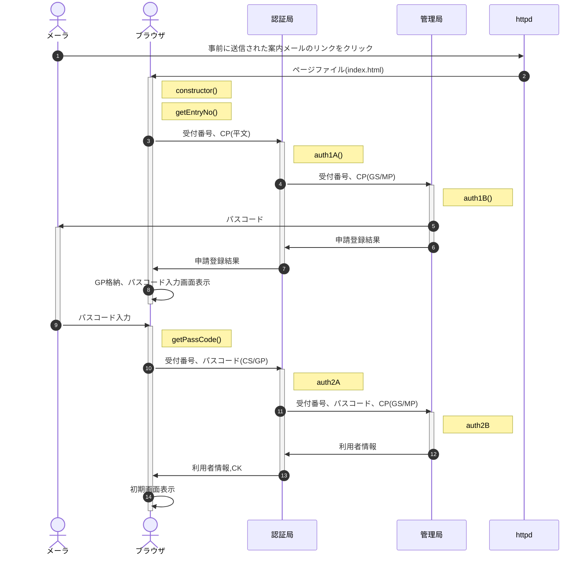

lastUpdate: 2023年 8月 5日 土曜日 18時15分46秒 JST

## Classes

<dl>
<dt><a href="#Auth">Auth</a></dt>
<dd><p>入力されたID/PWと登録情報を突合し、IDに紐づく各種情報を返す</p>
<ul>
<li>パスコード(passCode) : 受付番号入力後受信したメールに記載された番号</li>
<li>パスワード(passWord) : 鍵ペア生成の際、秘密鍵の基となる文字列</li>
</ul>
</dd>
</dl>

## Typedefs

<dl>
<dt><a href="#AuthProp">AuthProp</a> : <code>Object</code></dt>
<dd><p>AuthOpt以外のAuthクラスプロパティ</p>
</dd>
<dt><a href="#AuthOpt">AuthOpt</a> : <code>Object</code></dt>
<dd></dd>
</dl>

<a name="Auth"></a>

## Auth
入力されたID/PWと登録情報を突合し、IDに紐づく各種情報を返す

- パスコード(passCode) : 受付番号入力後受信したメールに記載された番号
- パスワード(passWord) : 鍵ペア生成の際、秘密鍵の基となる文字列

**Kind**: global class  

* [Auth](#Auth)
    * [new Auth(gatewayUrl, [opt])](#new_Auth_new)
    * [.getEntryNo()](#Auth+getEntryNo) ⇒ <code>void</code>
    * [.getPassCode()](#Auth+getPassCode) ⇒ <code>void</code>

<a name="new_Auth_new"></a>

### new Auth(gatewayUrl, [opt])
**Returns**: <code>void</code> - なし

## 処理概要



- 文中の記号は以下の通り
  - CK:共通鍵(Common Key)
  - CP:利用者公開鍵(Client Public key)、CS:利用者秘密鍵(Client Secret key)
  - GP:認証局公開鍵(Gateway Public key)、GS:認証局秘密鍵(Gateway Secret key)
  - FP:配信局公開鍵(Front Public key)、FS:配信局秘密鍵(Front Secret key)
  - MP:管理局公開鍵(Master Public key)、MS:管理局秘密鍵(Master Secret key)
  - (xS/yP) = XX局秘密鍵で署名、YY局公開鍵で暗号化した、XX->YY宛の通信<br>
    例：(GS/MP) ⇒ GS(認証局秘密鍵)で署名、MP(管理局公開鍵)で暗号化
- (02) constructor() : DOMContentLoaded時、以下の処理を実行
  1. 利用者の秘密鍵(以下CSkey)・公開鍵(以下CPkey)を生成
  1. getEntryNo()を呼び出し
- (02) getEntryNo() : 受付番号入力
  1. 受付番号入力画面を表示(z-indexを最大にして他の画面を触らせない)
  1. 入力後待機画面表示、レスポンスがあったらgetPassCode()を呼び出し
- (03) auth1A() : 認証申請の受付
  1. 受付番号とCPをauth1Bに送信
  1. auth1Bの申請結果を受けたらブラウザに結果を送信<br>
     申請OKの場合はGPも併せて送信
- (04) auth1B() : 認証申請の登録
  1. 受付番号とCPをシートに書き込み
  1. 正当性を検証
     - パスコードが一致
     - パスコード発行日時から1時間以内
     - 3回連続失敗後1時間以上経過
  1. 正当だった場合はパスコードを生成、シートに書き込み
  1. 申請者にパスコードを通知(05)
  1. 申請登録の結果をauth1Aに返す
- (09) getPassCode() : パスコード入力
  1. パスコード入力画面を表示
  1. パスコードが入力されたらauth2Aに送信
  1. auth2Aからレスポンスがあったらthisに保存、初期画面を表示
- (10) auth2A
  1. 受付番号・パスコード・CPkeyを管理局に送信
  1. 利用者情報をauth2Bから受けたらFPを追加して利用者に返す
- (12) auth2B
  1. 送信された受付番号・パスコード・CPkeyが有効か、シートの申請登録と突合
  1. OKなら利用者情報をauth2Aに返す  

| Param | Type | Default | Description |
| --- | --- | --- | --- |
| gatewayUrl | <code>string</code> |  | 認証局APIのURL |
| [opt] | [<code>AuthOpt</code>](#AuthOpt) | <code>{}</code> | 生成時オプション |

<a name="Auth+getEntryNo"></a>

### auth.getEntryNo() ⇒ <code>void</code>
entryNo(ID)を認証局に送信

**Kind**: instance method of [<code>Auth</code>](#Auth)  

| Param | Type |
| --- | --- |
|  | <code>void</code> | 

<a name="Auth+getPassCode"></a>

### auth.getPassCode() ⇒ <code>void</code>
メールから入力したpassCodeを認証局に送信

**Kind**: instance method of [<code>Auth</code>](#Auth)  

| Param | Type |
| --- | --- |
|  | <code>void</code> | 

<a name="AuthProp"></a>

## AuthProp : <code>Object</code>
AuthOpt以外のAuthクラスプロパティ

**Kind**: global typedef  
**Properties**

| Name | Type | Description |
| --- | --- | --- |
| constructorStart | <code>number</code> | constructor開始時刻(UNIX時間) |
| parentSelector | <code>string</code> | 親画面のCSSセレクタ |
| parentWindow | <code>HTMLElement</code> | 親画面のHTML要素 |
| AuthWindow | <code>HTMLElement</code> | Auth関係画面のwrapper |
| loading | <code>HTMLElement</code> | ローディング画面のHTML要素 |

<a name="AuthOpt"></a>

## AuthOpt : <code>Object</code>
**Kind**: global typedef  
**Properties**

| Name | Type | Default | Description |
| --- | --- | --- | --- |
| [entryNo] | <code>string</code> |  | 受付番号(ID) |
| [passWord] | <code>string</code> |  | パスワード |
| [header] | <code>string</code> | <code>&quot;&#x27;&#x27;&quot;</code> | 受付番号入力画面に表示するheaderのinnerHTML |
| [entryNoMessage] | <code>string</code> | <code>&quot;&#x27;受付番号を入力してください&#x27;&quot;</code> | 受付番号入力画面に表示するメッセージ |
| [entryNoButton] | <code>string</code> | <code>&quot;&#x27;送信&#x27;&quot;</code> | 受付番号入力画面のボタンのラベル |
| [entryNoRegExp] | <code>RegExp</code> | <code>/^[0-9]{1,4}$/</code> | 受付番号チェック用正規表現 |


## source

```
/* コアScript */
/**
 * @typedef {Object} AuthProp - AuthOpt以外のAuthクラスプロパティ
 * @prop {number} constructorStart - constructor開始時刻(UNIX時間)
 * @prop {string} parentSelector - 親画面のCSSセレクタ
 * @prop {HTMLElement} parentWindow - 親画面のHTML要素
 * @prop {HTMLElement} AuthWindow - Auth関係画面のwrapper
 * @prop {HTMLElement} loading - ローディング画面のHTML要素
 */

/**
 * @typedef {Object} AuthOpt
 * @prop {string} [entryNo] - 受付番号(ID)
 * @prop {string} [passWord] - パスワード
 * @prop {string} [header=''] - 受付番号入力画面に表示するheaderのinnerHTML
 * @prop {string} [entryNoMessage='受付番号を入力してください'] - 受付番号入力画面に表示するメッセージ
 * @prop {string} [entryNoButton='送信'] - 受付番号入力画面のボタンのラベル
 * @prop {RegExp} [entryNoRegExp=/^[0-9]{1,4}$/] - 受付番号チェック用正規表現
 */

/**
 * @classdesc 入力されたID/PWと登録情報を突合し、IDに紐づく各種情報を返す
 *
 * - パスコード(passCode) : 受付番号入力後受信したメールに記載された番号
 * - パスワード(passWord) : 鍵ペア生成の際、秘密鍵の基となる文字列
 * 
 */
class Auth {
  /**
   * @constructor
   * @param {string} gatewayUrl - 認証局APIのURL
   * @param {AuthOpt} [opt={}] - 生成時オプション
   * @returns {void} なし
   * 
   * #### 処理概要
   * 
   * ```mermaid
   * sequenceDiagram
   *   autonumber
   *   actor mailer as メーラ
   *   actor browser as ブラウザ
   *   participant gateway as 認証局
   *   participant master as 管理局
   *   participant httpd as httpd
   * 
   *   %% 受付番号入力
   *   mailer ->> httpd : 事前に送信された案内メールのリンクをクリック
   *   httpd ->> browser : ページファイル(index.html)
   *   activate browser
   *   Note right of browser: constructor()
   *   Note right of browser: getEntryNo()
   * 
   *   browser ->> gateway : 受付番号、CP(平文)
   *   activate gateway
   *   Note right of gateway : auth1A()
   * 
   *   gateway ->> master : 受付番号、CP(GS/MP)
   *   activate master
   *   Note right of master : auth1B()
   *   master ->> mailer : パスコード
   *   activate mailer
   * 
   *   master ->> gateway : 申請登録結果
   *   deactivate master
   * 
   *   gateway ->> browser : 申請登録結果
   *   deactivate gateway
   *   browser ->> browser : GP格納、パスコード入力画面表示
   *   deactivate browser
   * 
   * 
   *   %% パスコード入力
   *   mailer ->> browser : パスコード入力
   *   deactivate mailer
   *   activate browser
   *   Note right of browser : getPassCode()
   *   browser ->> gateway : 受付番号、パスコード(CS/GP)
   *   activate gateway
   *   Note right of gateway : auth2A
   *   gateway ->> master : 受付番号、パスコード、CP(GS/MP)
   *   activate master
   *   Note right of master : auth2B
   *   master ->> gateway : 利用者情報
   *   deactivate master
   *   gateway ->> browser : 利用者情報,CK
   *   deactivate gateway
   *   browser ->> browser : 初期画面表示
   *   deactivate browser
   * 
   * ```
   * 
   * - 文中の記号は以下の通り
   *   - CK:共通鍵(Common Key)
   *   - CP:利用者公開鍵(Client Public key)、CS:利用者秘密鍵(Client Secret key)
   *   - GP:認証局公開鍵(Gateway Public key)、GS:認証局秘密鍵(Gateway Secret key)
   *   - FP:配信局公開鍵(Front Public key)、FS:配信局秘密鍵(Front Secret key)
   *   - MP:管理局公開鍵(Master Public key)、MS:管理局秘密鍵(Master Secret key)
   *   - (xS/yP) = XX局秘密鍵で署名、YY局公開鍵で暗号化した、XX->YY宛の通信<br>
   *     例：(GS/MP) ⇒ GS(認証局秘密鍵)で署名、MP(管理局公開鍵)で暗号化
   * - (02) constructor() : DOMContentLoaded時、以下の処理を実行
   *   1. 利用者の秘密鍵(以下CSkey)・公開鍵(以下CPkey)を生成
   *   1. getEntryNo()を呼び出し
   * - (02) getEntryNo() : 受付番号入力
   *   1. 受付番号入力画面を表示(z-indexを最大にして他の画面を触らせない)
   *   1. 入力後待機画面表示、レスポンスがあったらgetPassCode()を呼び出し
   * - (03) auth1A() : 認証申請の受付
   *   1. 受付番号とCPをauth1Bに送信
   *   1. auth1Bの申請結果を受けたらブラウザに結果を送信<br>
   *      申請OKの場合はGPも併せて送信
   * - (04) auth1B() : 認証申請の登録
   *   1. 受付番号とCPをシートに書き込み
   *   1. 正当性を検証
   *      - パスコードが一致
   *      - パスコード発行日時から1時間以内
   *      - 3回連続失敗後1時間以上経過
   *   1. 正当だった場合はパスコードを生成、シートに書き込み
   *   1. 申請者にパスコードを通知(05)
   *   1. 申請登録の結果をauth1Aに返す
   * - (09) getPassCode() : パスコード入力
   *   1. パスコード入力画面を表示
   *   1. パスコードが入力されたらauth2Aに送信
   *   1. auth2Aからレスポンスがあったらthisに保存、初期画面を表示
   * - (10) auth2A
   *   1. 受付番号・パスコード・CPkeyを管理局に送信
   *   1. 利用者情報をauth2Bから受けたらFPを追加して利用者に返す
   * - (12) auth2B
   *   1. 送信された受付番号・パスコード・CPkeyが有効か、シートの申請登録と突合
   *   1. OKなら利用者情報をauth2Aに返す
   */
  constructor(gatewayUrl,opt={}){
    const v = {rv:null};
    console.log('Auth.constructor start.');
    try {
      this.constructorStart = Date.now();

      // 1.オプション未定義項目の既定値をプロパティにセット
      this.#setProperties(this,null,opt);
      console.log('this:',this);
      console.log(Date.now()-this.constructorStart);

      // 2.必須項目をプロパティに保存
      this.gateway.url = gatewayUrl;  // 認証局のURL
      console.log(Date.now()-this.constructorStart);

      // 3.各種画面を用意する
      //   ※鍵ペア生成で時間がかかるので、先に待機画面を表示
      this.#setWindows();
      // 初期画面として待機画面を表示
      this.#changeScreen('loading');
      console.log(Date.now()-this.constructorStart);

      // 4.秘密鍵・公開鍵を作成し、プロパティに格納する
      this.#setupKeys();
      console.log(Date.now()-this.constructorStart);

      // 5.非同期の初期化処理を呼出
      this.#changeScreen('entryNo');
      //this.build();

      //console.log('v.rv='+JSON.stringify(v.rv));
      console.log('Auth.constructor end.');
      return v.rv;
    } catch(e){
      console.error('Auth.constructor abnormal end.',e);
      // ブラウザで実行する場合はアラート表示
      //if( typeof window !== 'undefined' ) alert(e.stack);
      throw e; //以降の処理を全て停止
    }
  }

  /** 既定値を設定する
   * @param {AuthOpt} opt - 生成時オプションとして渡された値
   * @returns {void}
   */
  #setProperties(dest,def,opt){
    const v = {rv:true,def:{
      parentSelector: "body", // {string} - 親要素のCSSセレクタ
      RSA:{  // 自局のRSAキー関係情報
        bits: 1024,     // {number} - RSAキー長
        passWord: null, // {string} - パスワード
        pwLength: 32,   // {number} - 自動生成する場合のパスワード文字数
        sKey: null,     // {RSAKey} - 秘密鍵
        pKey: null,     // {string} - 公開鍵
      },
      info: null, // 管理局から取得する参加者情報
      gateway:{ // 認証局関連情報
        url: null,  // {string} - APIのURL
        pKey: null, // {string} - 公開鍵
      },
      front: {  // 配信局関連情報
        url: null,  // {string} - APIのURL
        pKey: null, // {string} - 公開鍵
      },
      AuthWindow: {
        element: null, // {HTMLElement} - 受付番号入力画面の要素。setWindowsで設定。
        zIndex: 2147483646,  // z-indexの最大値-1
      },
      entryNo:{ // 受付番号関係
        element: null, // {HTMLElement} - 受付番号入力画面の要素。setWindowsで設定。
        value: '',  // {string} - 受付番号
        header:'',    // {string} - 受付番号入力画面に表示するheaderのinnerHTML
        msg1:'受付番号を入力してください', // {string} - 入力欄の前に表示するメッセージ
        button:'送信',  // {string} - 受付番号入力画面のボタンのラベル
        msg2:'',      // {string} - 入力欄の後に表示するメッセージ
        rex:/^[0-9]{1,4}$/, // {RegExp} - 受付番号チェック用正規表現
      },
      loading: {
        element: null,
        zIndex: 2147483647,  // z-indexの最大値
      },
      passCode:{
        element: null, // {HTMLElement} - パスコード入力画面の要素。setWindowsで設定。
        //value: null,  // {string} - パスコード
        header:'',    // {string} - パスコード入力画面に表示するheaderのinnerHTML
        msg1:'確認のメールを送信しました。記載されているパスコード(数字6桁)を入力してください。<br>'
        + '※まれに迷惑メールと判定される場合があります。メールが来ない場合、そちらもご確認ください。',
                      // {string} - 入力欄の前に表示するメッセージ
        button:'送信',  // {string} - パスコード入力画面のボタンのラベル
        msg2: '※パスコードの有効期限は1時間です',
        rex:/^[0-9]{6}$/, // {RegExp} - パスコードチェック用正規表現
      },
    }};
    console.log('Auth.#setProperties start.');
    try {
      if( def !== null ){ // 2回目以降の呼出(再起呼出)
        // 再起呼出の場合、呼出元から渡された定義Objを使用
        v.def = def;
      }

      for( let key in v.def ){
        if( whichType(v.def[key]) !== 'Object' ){
          dest[key] = opt[key] || v.def[key]; // 配列はマージしない
        } else {
          if( !dest.hasOwnProperty(key) ) dest[key] = {};
          this.#setProperties(dest[key],v.def[key],opt[key]||{});
        }
      }

      if( def === null ){ // 初回呼出(非再帰)
        // 親画面のHTML要素を保存
        this.parentWindow = document.querySelector(this.parentSelector);
      }

      //console.log('this='+JSON.stringify(this));
      console.log('Auth.#setProperties end.');
      return v.rv;
    } catch(e){
      console.error('Auth.#setProperties abnormal end.',e);
      //if( typeof window !== 'undefined' ) alert(e.stack);
      v.rv.stack = e.stack; return v.rv;
    }
  }

  /** 秘密鍵・公開鍵を作成し、プロパティに格納する
   * @param {void}
   * @returns {void}
   */
  #setupKeys(){
    const v = {rv:null};
    console.log('Auth.#setupKeys start.');
    try {
      // パスワード未指定なら作成
      if( this.RSA.passWord === null ){
        this.RSA.passWord = createPassword(this.RSA.pwLength);
      }

      // 鍵ペアの生成
      this.RSA.sKey = cryptico.generateRSAKey(this.RSA.passWord, this.RSA.bits);
      this.RSA.pKey = cryptico.publicKeyString(this.RSA.sKey);
      //console.log(this.RSA);

      // 秘密鍵の保存
      //Fs.writeFileSync('./private.json', JSON.stringify(key.toJSON()));

      //console.log('v.rv='+JSON.stringify(v.rv));
      console.log('Auth.#setupKeys end.');
      return v.rv;
    } catch(e){
      console.error('Auth.#setupKeys abnormal end.',e);
      // ブラウザで実行する場合はアラート表示
      if( typeof window !== 'undefined' ) alert(e.stack); 
      //throw e; //以降の処理を全て停止する場合
      v.rv.stack = e.stack; return v.rv; // 処理継続する場合
    }
  }

  /** Auth関係画面をセットする
   *
   */
  #setWindows(){
    const v = {rv:null};
    console.log('Auth.#setWindows start.');
    try {
      // Auth関係画面のwrapper
      this.AuthWindow.element = createElement({
        attr:{name:"AuthWindow"},
        style:{
          // CSSで全画面オーバーレイを実装する方法＆コード例
          // https://pisuke-code.com/css-fullscreen-overlay/
          position: "absolute",
          left: 0, top: 0,
          width: "100%", height:"100%",
          background:"#fff",
          zIndex:this.AuthWindow.zIndex,
        },
      });

      // 受付番号入力画面
      this.entryNo.element = createElement({
        children:[
          {html:this.entryNo.header}, // タイトル
          {tag:'p',html:this.entryNo.msg1},  // 入力欄前メッセージ
          { // inputBox
            tag:'input',
            attr:{type:'text',name:'entryNo',value:this.entryNo.value},
            event:{'input':(event)=>{
              // 入力値チェック
              const m = event.target.value.match(this.entryNo.rex);
              console.log('m',m);
              const b = document.querySelector('div[name="AuthWindow"] input[name="entryNoButton"]');
              if( m ){
                b.removeAttribute('disabled');
              } else {
                b.setAttribute('disabled',true);
              }
            }},
          },
          { // 送信ボタン
            tag:'input',
            attr:{
              type:'button',
              name:'entryNoButton',
              value:this.entryNo.button,
            },
            logical:{
              disabled: this.entryNo.value.match(this.entryNo.rex) ? false : true,
            },
            event:{'click':()=>this.getEntryNo()},
          },
          {tag:'p',html:this.entryNo.msg2},  // 入力欄後メッセージ
        ],
      });

      // ローディング画面
      // ※ 受付番号・パスコード入力を隠蔽するため
      //   loading.zIndex > AuthWindow.zIndex とする。
      this.loading = {element:createElement({
        style:{
          position: "absolute",
          left: 0, top: 0,
          width: "100%", height:"100%",
          background:"#fff",
          zIndex:this.loading.zIndex,
        },
        children:[
          {
            style:{
              display:"flex",
              width:"100%",
              height:"100%",
              background:"#fff",
              justifyContent:"center",
              alignItems:"center",
            },
            children:[
              {
                attr:{class:'loading5'},
                style:{ // 点の軌道/大きさ/色
                  //"--dot-size":"4rem",
                  //"--m0:3.2rem",
                  "--R":0,
                  "--G":0,
                  "--B":0,
                },
                text:'loading...'
              },
            ],
          }
        ],
      })};

      // パスコード入力画面
      this.passCode.element = createElement({
        children:[
          {html:this.passCode.header}, // タイトル
          {tag:'p',html:this.passCode.msg1},  // 入力欄前メッセージ
          { // inputBox
            tag:'input',
            attr:{type:'text',name:'passCode',value:''},
            event:{'input':(event)=>{
              // 入力値チェック
              const m = event.target.value.match(this.passCode.rex);
              console.log('m',m);
              const b = document.querySelector('div[name="AuthWindow"] input[name="passCodeButton"]');
              if( m ){
                b.removeAttribute('disabled');
              } else {
                b.setAttribute('disabled',true);
              }
            }},
          },
          { // 送信ボタン
            tag:'input',
            attr:{
              type:'button',
              name:'passCodeButton',
              value:this.passCode.button,disabled:true
            },
            event:{'click':()=>this.getPassCode()},
          },
          {tag:'p',html:this.passCode.msg2},  // 入力欄後メッセージ
        ],
      });

      // 画面をセット
      this.parentWindow.appendChild(this.AuthWindow.element);
      this.AuthWindow.element.appendChild(this.entryNo.element);
      this.AuthWindow.element.appendChild(this.loading.element);
      this.AuthWindow.element.appendChild(this.passCode.element);

      //console.log('v.rv='+JSON.stringify(v.rv));
      console.log('Auth.#setWindows end.');
      return v.rv;
    } catch(e){
      console.error('Auth.#setWindows abnormal end.',e);
      // ブラウザで実行する場合はアラート表示
      //if( typeof window !== 'undefined' ) alert(e.stack);
      v.rv.stack = e.stack; return v.rv; // 処理継続する場合
    }

  }

  /** Auth関係画面の切り替え
   * @param {string} screenId - 画面ID。open/close->AuthWindowの開閉、他は指定ウィンドウの表示
   * @returns {void}
   */
  #changeScreen(screenId){
    const v = {rv:true};
    console.log('Auth.#changeScreen start.');
    try {

      if( screenId === 'close' ){
        this.AuthWindow.element.style.display = 'none';
      } else if( screenId === 'open' ){
        this.AuthWindow.element.style.display = '';
      } else {
        ['entryNo','loading','passCode'].forEach(x => {
          this[x].element.style.display = x === screenId ? '' : 'none';
        });
      }

      console.log('Auth.#changeScreen end.');
      return v.rv;
    } catch(e){
      console.error('Auth.#changeScreen abnormal end.',e);
      // ブラウザで実行する場合はアラート表示
      //if( typeof window !== 'undefined' ) alert(e.stack);
      //throw e; //以降の処理を全て停止する場合
      v.rv.stack = e.stack; return v.rv; // 処理継続する場合
    }

  }

  /** entryNo(ID)を認証局に送信
   * @param {void}
   * @returns {void}
   */
  async getEntryNo(){
    const v = {rv:null,data:{cp:this.RSA.pKey}};
    console.log('Auth.getEntryNo start.');
    try {

      // 入力フォームから値を取得
      this.#changeScreen('loading');
      v.rv = await this.#fetchFromClient('auth1A',this.RSA.pKey,0);
      if( v.rv instanceof Error ) throw v.rv;

      this.gateway.pKey = v.rv;
      this.#changeScreen('passCode');

      console.log('this.gateway.pKey='+JSON.stringify(this.gateway.pKey));
      console.log('Auth.getEntryNo end.');
      return v.rv;
    } catch(e){
      console.error('Auth.getEntryNo abnormal end.',e);
      // ブラウザで実行する場合はアラート表示
      if( typeof window !== 'undefined' ) alert(e.stack);
      //throw e; //以降の処理を全て停止する場合
      v.rv.stack = e.stack; return v.rv; // 処理継続する場合
    }
  }

  /** メールから入力したpassCodeを認証局に送信
   * @param {void}
   * @returns {void}
   */
  async getPassCode(){
    const v = {rv:null,data:{cp:this.RSA.pKey}};
    console.log('Auth.getPassCode start.');
    try {

      // 入力フォームから値を取得
      this.#changeScreen('loading');
      v.arg = {
        entryNo: this.entryNo.value,
        passCode: this.passCode.element.querySelector('input').value,
      }
      console.log('arg',v.arg);
      v.rv = await this.#fetchFromClient('auth2A',v.arg,3);
      if( v.rv instanceof Error ) throw v.rv;

      // パスコード入力画面を閉じる
      if( v.rv.isErr ){
        throw new Error(v.rv.message);
      } else {
        this.info = v.rv.info;
        console.log('info',this.info);
        this.#changeScreen('close');
      }

      console.log('Auth.getPassCode end.');
      return v.rv;
    } catch(e){
      console.error('Auth.getPassCode abnormal end.',e);
      // ブラウザで実行する場合はアラート表示
      if( typeof window !== 'undefined' ) alert(e.stack);
      //throw e; //以降の処理を全て停止する場合
      v.rv.stack = e.stack; return v.rv; // 処理継続する場合
    }
  }

  /** GASのAPI(doPost)を呼び出す
   * @param {string} to - 呼び先(gateway or front)
   * @param {string} func - 呼び先関数名(auth1A等)
   * @param {Object} data - 呼び先関数に渡すデータオブジェクト
   * @returns {Object} 呼び先からの戻り値
   * 
   * - JS: [Async/await](https://ja.javascript.info/async-await)
   * - MDN: [フェッチが成功したかの確認](https://developer.mozilla.org/ja/docs/Web/API/Fetch_API/Using_Fetch#%E3%83%95%E3%82%A7%E3%83%83%E3%83%81%E3%81%8C%E6%88%90%E5%8A%9F%E3%81%97%E3%81%9F%E3%81%8B%E3%81%AE%E7%A2%BA%E8%AA%8D)
   * - MDN: [fetch()](https://developer.mozilla.org/ja/docs/Web/API/fetch)
   * - MDN: [Response Object](https://developer.mozilla.org/ja/docs/Web/API/Response)
   * - Qiita: [Fetch APIでネットワークエラーも含めてエラーハンドリングする](https://qiita.com/IzumiSy/items/031df1df4f4541e536b4)
   */
  async #fetchFromClient(fc,arg,md=0){
    const v = {rv:null,data:{cp:this.RSA.pKey}};
    console.log('Auth.#fetchFromClient start.');
    try {

      // 送信するトークンを生成
      v.token = {
        fm: this.entryNo.value,
        to: 'gateway',
        md: md,
        ts: Date.now(),
        dt: {
          fc: fc,
          arg: arg,
        }
      };

      // 認証局の公開鍵を入手済みなら暗号化
      if( this.gateway.pKey !== null ){
        v.plaintext = JSON.stringify(v.token.dt);
        v.encode = encodeURI(v.plaintext);
        v.encrypt = cryptico.encrypt(v.encode,this.gateway.pKey,this.RSA.sKey);
        console.log('encrypt',v.encrypt);
        if( v.encrypt.status !== 'success' )
          throw new Error(JSON.stringify(v.encrypt));
        v.token.dt = v.encrypt.cipher;
        v.token.md = 3; // 署名付き暗号化
      }

      v.fetch = await fetch(this.gateway.url,{
        "method": "POST",
        "body": JSON.stringify(v.token),
        "Accept": "application/json",
        "Content-Type": "application/json",
      });
      v.rv = await v.fetch.json();
      if( v.rv instanceof Error ) throw v.rv;
      //console.log(v.rv);

      console.log('Auth.#fetchFromClient end.');
      return v.rv;
    } catch(e){
      console.error('Auth.#fetchFromClient abnormal end.',e);
      // ブラウザで実行する場合はアラート表示
      if( typeof window !== 'undefined' ) alert(e.stack);
      //throw e; //以降の処理を全て停止する場合
      v.rv.stack = e.stack; return v.rv; // 処理継続する場合
    }
  }
}
```
