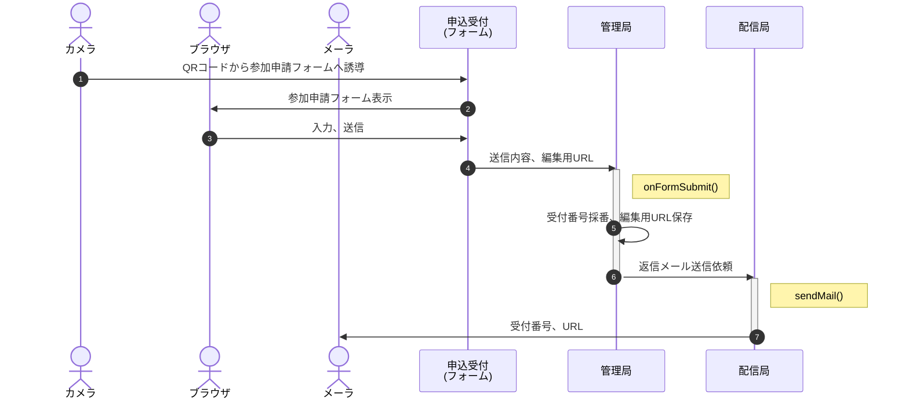
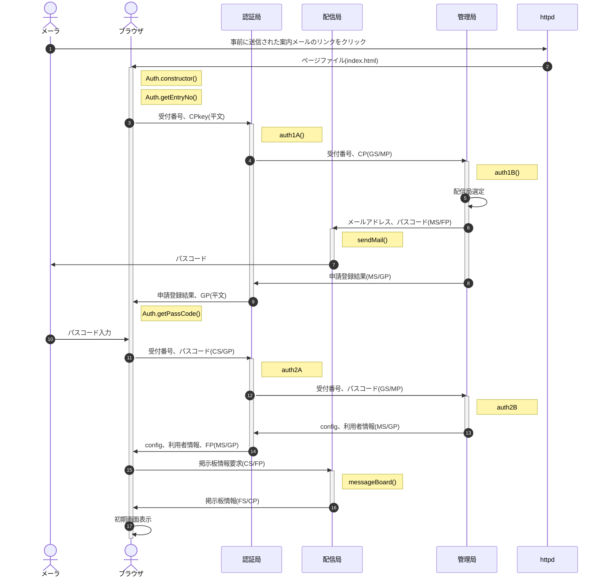
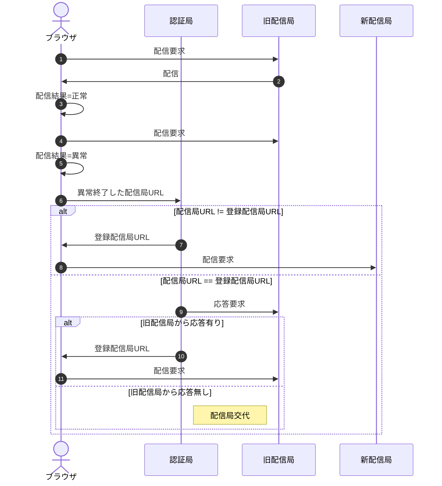
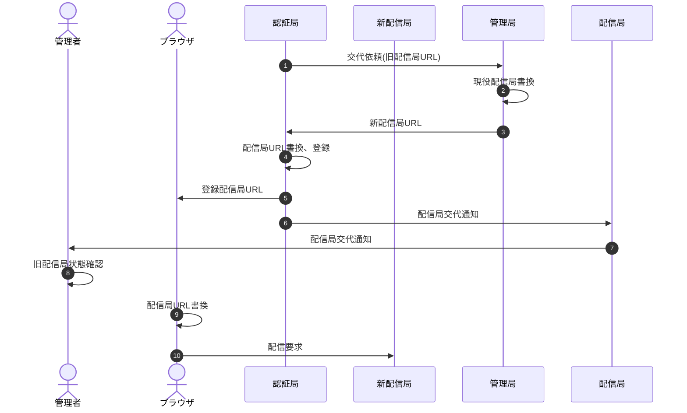

class Auth README

# 別紙仕様書目録

1. [開発の目的](Auth.purpose.md)(現状/課題/解決案/メリット、デメリットと対策)
1. [管理局の構成](Auth.master.md)
1. [認証局の構成](Auth.gateway.md)
1. [配信局の構成](Auth.front.md)
1. [署名・暗号化処理](Auth.cryptico.md)

# 性能要件とGASの制約

## 想定所要

- 参加申込みへの返信メール
  - 参加申込数500口、参加人数1,000人
  - 参加申込は10日以上に分散、但し開催前日および当日は各25%(125口)の申込みが発生
  - ピーク想定：開催当日125通のメール送信
- 二段階認証時のパスコード送信メール
  - パスコード配信は、当日に集中してスマホ利用者数×1.5倍発生(1倍超は操作ミス等による複数回ログイン者)
  - スマホ利用者数は、参加申込数(500口)と一致。スタッフは参加申込数に含まれるものとする
  - ピーク想定：開催当日750通のメール送信
- 掲示板へのアクセス
  - お知らせ配信のため、20秒/回間隔で処理時間700msの掲示板へのアクセスが発生
  - 期間は当日08:00〜20:00の12時間
    - 08:00〜13:00 スタッフのみなので5%
    - 13:00〜18:00 スタッフ5%＋参加者の30%(残りはセッション継続だがブラウザを開いていない想定)
    - 18:00〜20:00 スタッフ5%＋参加者の10%(順次帰宅)
  - ピーク想定：3回/分×60分×0.7秒×500口 = 63,000秒/時 ...(a)
    - 08:00〜13:00(5H) ×  5% × a =  15,750秒
    - 13:00〜18:00(5H) × 35% × a = 110,250秒
    - 18:00〜20:00(2H) × 15% × a =  18,900秒
    - 処理時間合計：144,900秒(2415分)

## GASの制約と対応

- [GASの制約](https://tetsuooo.net/gas/1101/#)
  - トリガーの総実行時間：90分/日
  - メール発信100通/日

■対応

1. クライアントへの配信に特化した「配信局」を別アカウントで複数作成、20〜30%を「稼働中」とし残りを「待機中」とする
1. クライアントへの配信とは、メール配信およびクライアント側の定期的情報更新が必要なお知らせ配信(＋将来的には予約状況)を指す。
1. 配信局の稼働状況を「資源局」で管理。制約により稼働不能になったアカウントを「退役」とし、待機中から一つ選んで「稼働中」とする
1. 「お知らせ」はスタッフが「放送局」に投稿後、放送局から各配信局に配信する。
1. 認証局、管理局等の全体コントロールも規模に合わせて別アカウントにする
1. 各局間は共通鍵で認証する。共通鍵はszLibに保存し、szLibは限定列挙されたアカウントのみ閲覧可とする

なお集中アクセスに対する負荷等、インフラの性能に起因する問題は考慮しない

# 処理の流れ

## 参加登録

## 認証

- 文中の記号は以下の通り
  - CP:利用者公開鍵(Client Public key)、CS:利用者秘密鍵(Client Secret key)
  - GP:認証局公開鍵(Gateway Public key)、GS:認証局秘密鍵(Gateway Secret key)
  - FP:配信局公開鍵(Front Public key)、FS:配信局秘密鍵(Front Secret key)
  - MP:管理局公開鍵(Master Public key)、MS:管理局秘密鍵(Master Secret key)
  - (xS/yP) = XX局秘密鍵で署名、YY局公開鍵で暗号化した、XX->YY宛の通信 
    例：(GS/MP) ⇒ GS(認証局秘密鍵)で署名、MP(管理局公開鍵)で暗号化
- (02) Auth.constructor() : DOMContentLoaded時、以下の処理を実行
  1. 利用者の秘密鍵(以下CSkey)・公開鍵(以下CPkey)を生成
  1. Auth.getEntryNo()を呼び出し
- (02) Auth.getEntryNo() : 受付番号入力
  1. 受付番号入力画面を表示(z-indexを最大にして他の画面を触らせない)
  1. 入力後待機画面表示、レスポンスがあったらAuth.getPassCode()を呼び出し
- (03) auth1A() : 認証申請の受付
  1. 受付番号とCPをauth1Bに送信
  1. auth1Bの申請結果を受けたらブラウザに結果を送信 
     申請OKの場合はGPも併せて送信
- (04) auth1B() : 認証申請の登録
  1. 受付番号とCPをシートに書き込み
  1. 正当性を検証
     - パスコードが一致
     - パスコード発行日時から1時間以内
     - 3回連続失敗後1時間以上経過
  1. 正当だった場合はパスコードを生成、シートに書き込み
  1. 配信局選定：登録済配信局(複数または単数)から以下の条件で使用する配信局を選定
     1. [MailApp.getRemainingDailyQuota()](https://developers.google.com/apps-script/reference/mail/mail-app?hl=ja#getremainingdailyquota)取得済かつ一定数(95程度)未満の配信局
     1. DailyQuota未取得で登録順位が上の配信局
  1. 配信局経由で申請者にパスコードを通知(05)
  1. 申請登録の結果をauth1Aに返す
- (09) Auth.getPassCode() : パスコード入力
  1. パスコード入力画面を表示
  1. パスコードが入力されたらauth2Aに送信
  1. auth2Aからレスポンスがあったらthisに保存、初期画面を表示
- (11) auth2A
  1. 受付番号・パスコードを管理局に送信
  1. configと利用者情報をauth2Bから受けたらFPを追加して利用者に返す
- (12) auth2B
  1. 送信された受付番号・パスコードが有効か、シートの申請登録と突合
  1. OKならconfigと利用者情報をauth2Aに返す

## 定期配信異常対応

配信局のリソースが制約にかかった場合、利用者のブラウザに反応が帰らなくなる。

## 異常検知手順

### 配信局交代

- (08) 旧配信局状態確認：以下の確認作業を手動で行う
  1. 旧配信局にdoGet
  1. 直接GASを開き、適当なスクリプトを走らせる
  1. 1,2の結果、まだquota未到達と判断される場合、管理局の情報を手動で書き換える