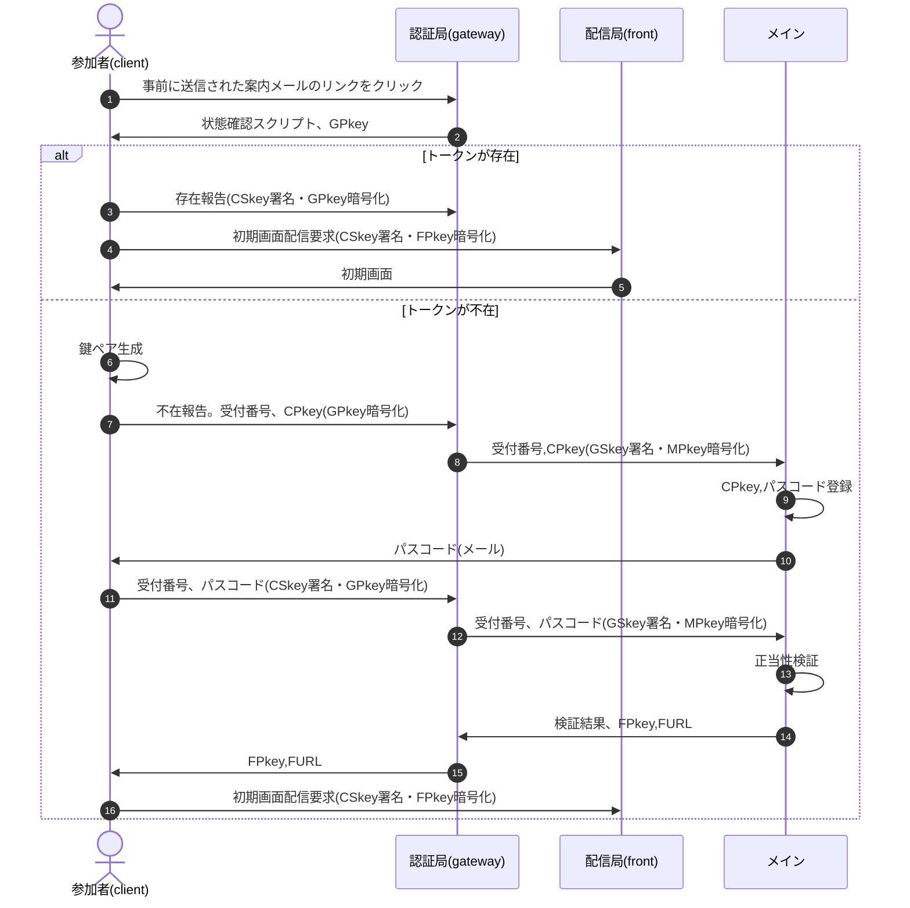

# class Auth README

## TOC

1. [開発の目的](Auth.purpose.md)(現状/課題/解決案/メリット、デメリットと対策)
1. [管理局の構成](Auth.master.md)
1. [認証局の構成](Auth.gateway.md)
1. [配信局の構成](Auth.front.md)
1. [署名・暗号化処理](Auth.cryptico.md)

## sequence

- clientを含め、公開鍵はsafeで保存。上図では煩雑になるためsafeとのやりとりは省略
- ⑬正当性検証の項目は以下の通り
  - パスコードが一致
  - パスコード発行日時は一時間以内
  - 3回連続失敗後1時間以上経過