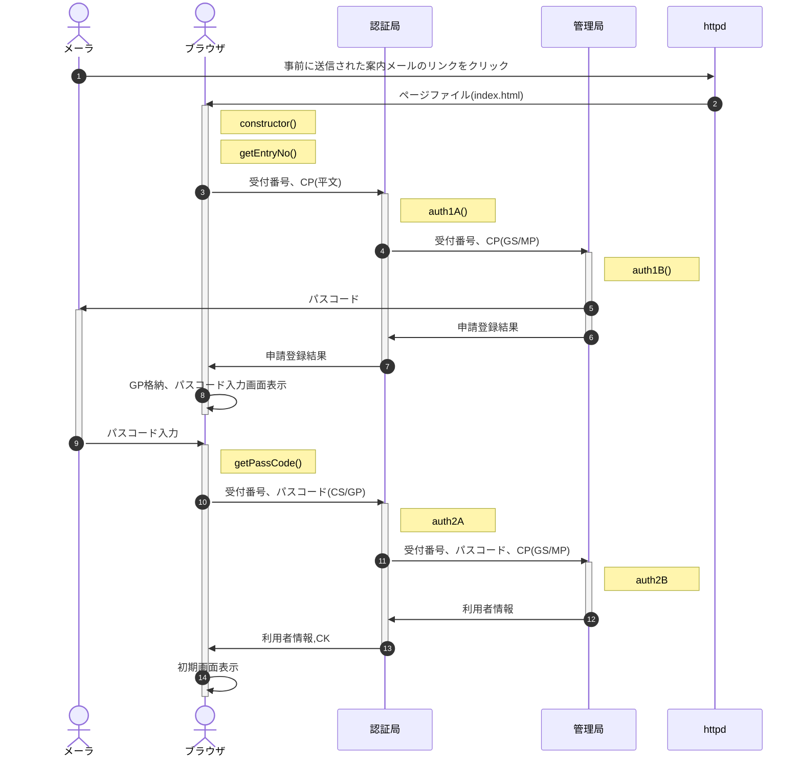

- [core.js](core.md)
- [GAS.js](GAS.md)

## 処理概要



- 文中の記号は以下の通り
  - CK:共通鍵(Common Key)
  - CP:利用者公開鍵(Client Public key)、CS:利用者秘密鍵(Client Secret key)
  - GP:認証局公開鍵(Gateway Public key)、GS:認証局秘密鍵(Gateway Secret key)
  - FP:配信局公開鍵(Front Public key)、FS:配信局秘密鍵(Front Secret key)
  - MP:管理局公開鍵(Master Public key)、MS:管理局秘密鍵(Master Secret key)
  - (xS/yP) = XX局秘密鍵で署名、YY局公開鍵で暗号化した、XX->YY宛の通信<br>
    例：(GS/MP) ⇒ GS(認証局秘密鍵)で署名、MP(管理局公開鍵)で暗号化
- (02) constructor() : DOMContentLoaded時、以下の処理を実行
  1. 利用者の秘密鍵(以下CSkey)・公開鍵(以下CPkey)を生成
  1. getEntryNo()を呼び出し
- (02) getEntryNo() : 受付番号入力
  1. 受付番号入力画面を表示(z-indexを最大にして他の画面を触らせない)
  1. 入力後待機画面表示、レスポンスがあったらgetPassCode()を呼び出し
- (03) auth1A() : 認証申請の受付
  1. 受付番号とCPをauth1Bに送信
  1. auth1Bの申請結果を受けたらブラウザに結果を送信<br>
     申請OKの場合はGPも併せて送信
- (04) auth1B() : 認証申請の登録
  1. 受付番号とCPをシートに書き込み
  1. 正当性を検証
     - パスコードが一致
     - パスコード発行日時から1時間以内
     - 3回連続失敗後1時間以上経過
  1. 正当だった場合はパスコードを生成、シートに書き込み
  1. 申請者にパスコードを通知(05)
  1. 申請登録の結果をauth1Aに返す
- (09) getPassCode() : パスコード入力
  1. パスコード入力画面を表示<br>
     ※パスコードは数値6桁を想定。変更する場合、auth2Bのパスコード正当性ロジック見直しのこと。
  1. パスコードが入力されたらauth2Aに送信
  1. auth2Aからレスポンスがあったらthisに保存、初期画面を表示
- (10) auth2A
  1. 受付番号・パスコード・CPkeyを管理局に送信
  1. 利用者情報をauth2Bから受けたらFPを追加して利用者に返す
- (12) auth2B
  1. 送信された受付番号・パスコード・CPkeyが有効か、シートの申請登録と突合
  1. OKなら利用者情報をauth2Aに返す

## 使用方法

```
let config;
window.addEventListener('DOMContentLoaded',async () => {
  const v = {};
  console.log('DOMContentLoaded start.');
  v.auth = new Auth('https://script.google.com/macros/s/〜/exec');
  await v.auth.build();
  // ローディング画面解除
  document.querySelector('div[name="loading"]').style.display = 'none';

  console.log(v.auth);
  console.log('DOMContentLoaded end.');
});
```

- `new Auth()`実行後、必ず`.build()`を実行する