# CSS

| ファイル名 | 概要 |
| :-- | :-- |
| [szLib.css](szLib.css) | 独自作成標準CSS |
| [loading.css](loading.css) | 待機中(loading)画面作成 |

# 関数

| 関数名 | 概要 |
| :-- | :-- |
| [analyzeArg](analyzeArg.md) | コマンドラインから`node xxx.js aa bb`を実行した場合の引数(`aa`,`bb`)を取得し、オブジェクトにして返す |
| [analyzePath](analyzePath.md) | パス名文字列から構成要素を抽出 |
| [convertCharacters](convertCharacters.md) | 全角英数字は半角、半角カナは全角、ひらがな・カタカナは指定の方に変換 |
| [createElement](createElement.md) | HTMLの要素を生成 |
| [createPassword](createPassword.md) | パスワード文字列の生成 |
| [decryptAES](cryptoAES.md) | 共通鍵(AES)による復号化処理 |
| [deserializeRSAKey](deserializeRSAKey.md) | 文字列化されたRSAキーを復元 |
| [embedComponent](embedComponent.md) | テンプレート(HTML)のタグに含まれる'data-embed'属性に基づき、他文書から該当箇所を挿入 |
| [encryptAES](cryptoAES.md) | 共通鍵(AES)による暗号化処理 |
| [genToken](genToken.md) | GASのdoPostで投げるトークンを作成 |
| [gSpreadTabulize](gSpreadTabulize.md) | GAS関数jsonRangeの出力からHTMLのテーブルを作成 |
| [isValidArg](isValidArg.md) | GASのdoPostで引数として渡されたトークンが適切か判定 |
| [jsonRange](jsonRange.md) | Googleスプレッド上で、選択範囲のセル情報をJSON化してmsgBoxに表示 |
| [mergeDeeply](mergeDeeply.md) | オブジェクトのプロパティを再帰的にマージ |
| [objectize](objectize.md) | 階層形式の二次元配列をオブジェクト化 |
| [onFormSubmit](onFormSubmit.md) | [GAS]フォーム申込み時のメールの自動返信 |
| [postMails](postMails.md) | GAS上の管理局等の発信局でメールを発信、通数制限を超える場合は配信局を変更 |
| [sendMails](sendMails.md) | GAS上の配信局でテンプレートに個別メールのデータを差し込み、送信する |
| [serializeRSAKey](serializeRSAKey.md) | RSAキーを文字列化 |
| [toolbox](toolbox.md) | Googleスプレッドのメニューに「道具箱」を追加 |
| [urlFetch](urlFetch.md) | GAS上で他のwebアプリのdoPostを呼び出す |
| [querySelector](querySelector.md) | HTMLの指定CSSセレクタの内容を抽出 |
| [whichType](whichType.md) | 変数の型を判定し、型名を文字列で返す |

# クラス

| クラス名 | 概要 |
| :-- | :-- |
| [Auth](Auth.md) | ブラウザで認証を行い、Webアプリから設定情報(config)を取得、後続処理を行う |
| [BurgerMenu](BurgerMenu.md) | HTMLにハンバーガーメニューを作成する |
| [szSheet](szSheet.md) | Googleスプレッドでデータ/行のCRUDを行う擬似クラス |
| [szTree](szTree.md) | Googleスプレッド上でツリー構造を持つ二次元配列の検索 |
| [TabMenu](TabMenu.md) | HTMLにタブメニューを作成する |
| [TimeTable](TimeTable.md) | HTMLにタイムテーブルを描画する |
| [webScanner](webScanner.md) | 指定セレクタ以下にcanvas他の必要な要素を作成してスキャン実行、指定の後続処理を呼び出す |

# 既存型へのメソッド追加

| 既存型 | メソッド名 | 概要 |
| :-- | :-- | :-- |
| Array | [tabulize](Array.tabulize.md) | Array型の変数に2次元配列からHTMLの表を作成してtable要素として返す |
| Date  | [calc](Date.calc.md) | 指定日に年/月/日/時/分/秒/ミリ秒数を加減した日時を計算する"calc()"メソッドをDate型に追加 |
| Date  | [toLocale](Date.toLocale.md) | 日時を指定形式の文字列にして返す"toLocale()"メソッドをDate型に追加 |

# コンポーネントの作成手順

## componentUpdate.shでの処理



## 実施手順

1. componentをHTML形式で作成
   1. 原則本体・テスト・Webアプリをまとめてhtml形式で作成<br>
      時間がとれない場合、スクリプトのみ".js"での保存も可
   1. tipsの[HTMLテンプレート(ライブラリコンポーネント用)](console/tips/tips.html?id=28166520)をコピー
   1. ドキュメントをJSDoc形式で記述
1. JSDoc/部品用/コンソール用を作成
   - `tools/updateComponent.sh xxx`(xxxはコンポーネントの拡張子を除いたベースファイル名)
   - jsは`jsdoc2md xxx.js > ../component/xxx.md`
1. 作成したドキュメントをcomponent/README.mdに登録

- 既存型に独自メソッドを追加する場合、'.'を'_'にした別関数として定義した上で既存型に追加する。<br>
  (∵下の例で`Array.prototype.tabulize = function(opt){〜`とすると動作はするがjsdoc2mdでMDが生成されない)
  ```
  function Array.tabulyze(opt){
    (中略)
  }
  Array.prototype.tabulize = Array.tabulyze;
  ```
