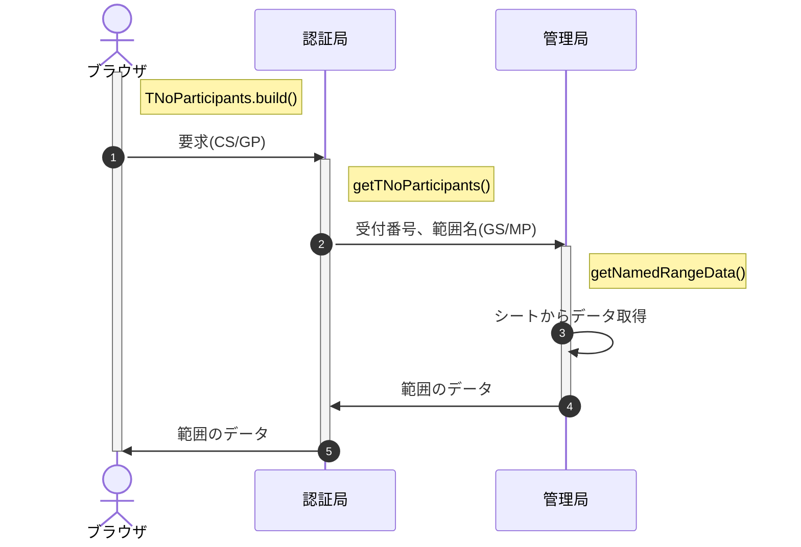

## 処理概要

- 文中の記号は以下の通り
  - CK:共通鍵(Common Key)
  - CP:利用者公開鍵(Client Public key)、CS:利用者秘密鍵(Client Secret key)
  - GP:認証局公開鍵(Gateway Public key)、GS:認証局秘密鍵(Gateway Secret key)
  - FP:配信局公開鍵(Front Public key)、FS:配信局秘密鍵(Front Secret key)
  - MP:管理局公開鍵(Master Public key)、MS:管理局秘密鍵(Master Secret key)
  - (xS/yP) = XX局秘密鍵で署名、YY局公開鍵で暗号化した、XX->YY宛の通信 
    例：(GS/MP) ⇒ GS(認証局秘密鍵)で署名、MP(管理局公開鍵)で暗号化
