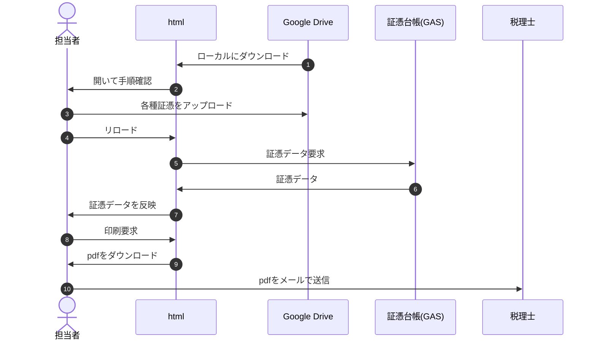

# 税務定期作業

```
/library/component/zeimu
┣ readme.md(.html) - 仕様書
┣ webApp.html - サンプル、Webアプリ
┣ core.js - コアとなるスクリプト
┣ GAS.js - コアとなるスクリプト(GAS側の処理)
┣ GASLib.js - GAS.jsから参照するGASライブラリ
┣ console.js - コンソール実行形式(使用するコンポーネントは参照する)
┣ update.sh/js - Markdown等の文書、Webアプリ(SPA)、コンソール実行形式の更新
┣ xxx.html - Webアプリ(ライブラリ埋込版)
┣ xxx.js - コンソール実行形式(ライブラリ埋込版)
┣ doc/ - readmdから参照する仕様書(部分)
┃ ┣ GAS.md - jsdoc2md GAS.js の出力結果
┃ ┗ GASLib.md - jsdoc2md GASLib.js の出力結果
┗ ref/ - 画像等、使用する外部ファイル
```

## 作業手順



- 06.証憑データの内容は[responseObj](doc/gas.md#responseObj)参照。