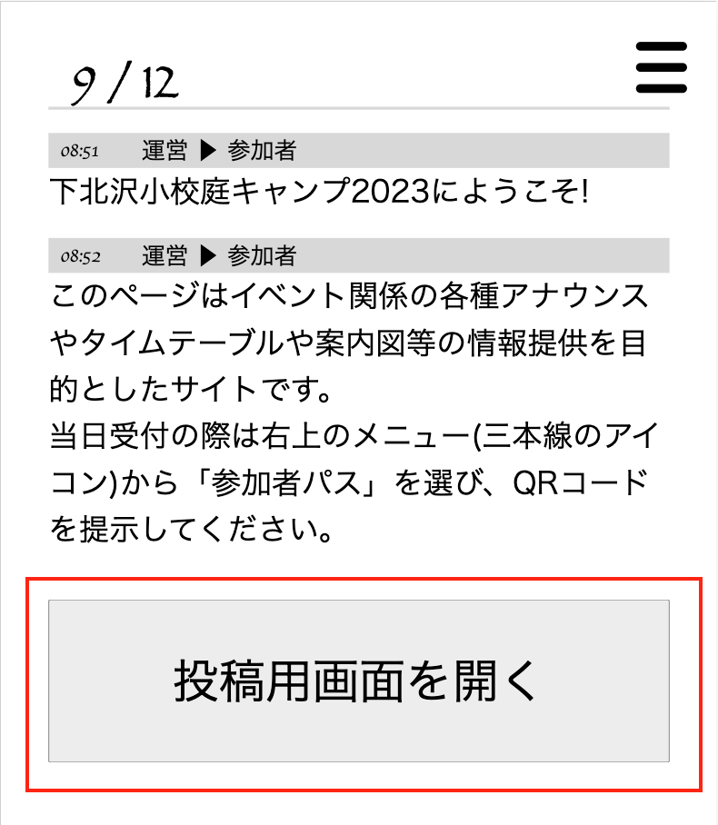
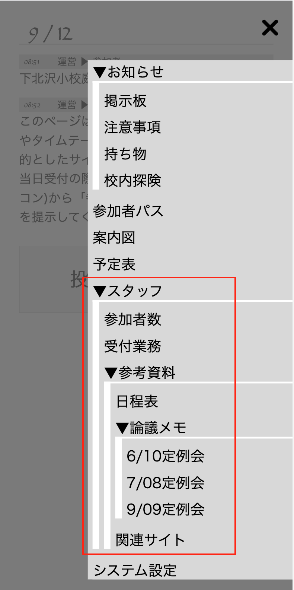
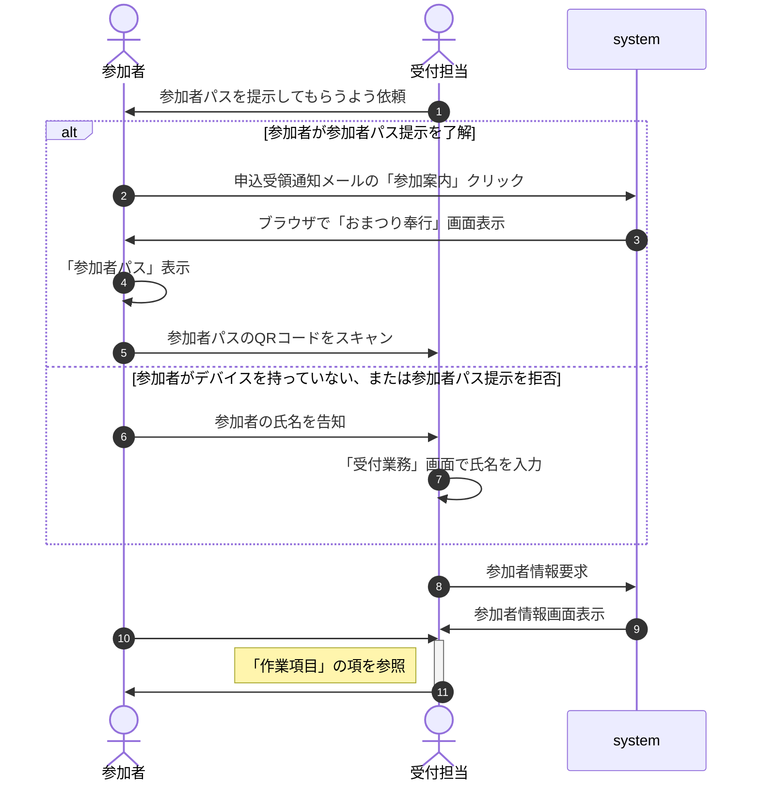

# 業務マニュアル

おまつり奉行：校内キャンプ2023専用のアプリの名前(JavaScript SPA)。申込受領通知メールの「参加案内」クリックして表示される。

1. 一般参加者用との違い
2. 掲示板への投稿
3. 受付業務
   1. 参加者パスの表示
   2. 受付業務画面の表示
   3. 業務フロー
   4. 作業項目
   5. 練習用画面

## 1. 一般参加者用との違い

スタッフ用のおまつり奉行は、一般参加者用の画面にスタッフ専用機能を追加している。

1. 掲示板(ホーム画面)に投稿用ボタンが存在(一般参加者は投稿不可)
   

1. 「スタッフ」専用のメニューが存在
   

## 2. 掲示板への投稿

## 3. 受付業務

## 3.1. 参加者パスの表示
## 3.2. 受付業務画面の表示
## 3.3. 業務フロー

1. 参加者パス提示依頼：事前に正門前に依頼ポスターを貼付予定
4. 「参加者パス」表示：おまつり奉行メニュー > 参加者パス
5. 受付業務画面：おまつり奉行メニュー > スタッフ > 受付業務

## 3.4. 作業項目

1. 参加資格の確認
   - 画面右上に「テント」「体育館」「日帰り」とあるのは当選した方
   - 画面右上に赤文字で「落選」とあるのは、応募したが落選した方
   - 当日参加を希望されてもお断りください。
   - 「体育館」「日帰り」の場合、テントの持ち込みがないことを確認

1. 参加費の徴収
   - 表示された参加者全員の参加費を収納した場合、「全員受領」をクリック
   - 父親は後から参加等、一部参加者が受付時にいない場合、全員分を徴収するか受付時にいる人のみ徴収するかは参加者の意思によって処理。
     - 全員分を先にお支払いいただく場合は「全員受領」(この場合遅参する方も入場済状態になる)
     - 一部を先行してお支払いいただく場合、参加者一覧の参加費欄を修正の上、「決定」をクリック
   - おつりが出せなかった場合、

1. その他判断がつかない事例
   本部に相談。手が離せない場合はおやじの会LINEグループまたは掲示板に連絡、または参加者に本部に回ってもらう

## 3.5. 練習用画面
