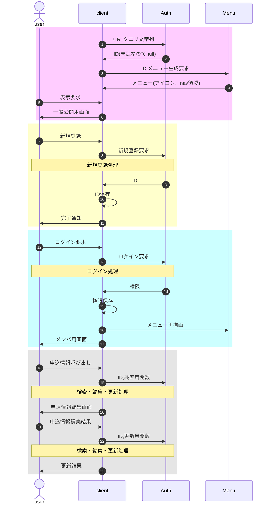

# SPAにおける表示制御

## 募集内容確認〜申込完了までの流れ

- 記号
  - client : camp2024等のブラウザ上のプログラム
  - Auth : class authClient+authServer
  - Menu : class BurgerMenu
- 領域色
  - ピンク : ID未定(初回)表示時の処理
  - 黄色 : 応募申込開始時の処理。詳細は「[新規登録](overview.md#新規登録)」参照
  - 水色 : メアド登録完了し、申込内容記入用のログイン処理。詳細は「[ログイン要求](overview.md#ログイン要求)」参照
  - 灰色 : ログイン完了後の申込内容記入処理。詳細は「[検索・編集・更新](overview.md#検索・編集・更新)」参照

■作成手順

1. Google Spreadを用意、名簿(list)シートを作成
1. configに名簿シート各項目の定義を記載
1. 実装する機能・ページ毎にclient(index.html)にDIV要素を作成
1. build.shを実行、client,server(server.gs)を生成
1. index.html,server.gsをシートのApps Scriptとしてコピー、デプロイ