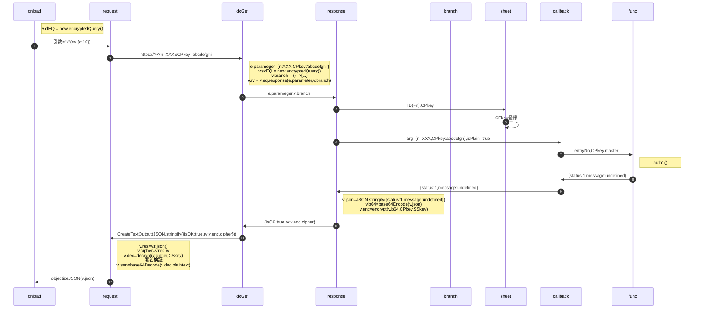

# 処理手順

- upv='n'とする

<!--
sequenceDiagram
  autonumber
  actor mailer as メーラ
  actor browser as ブラウザ
  participant public as 公開サイト
  participant staff as スタッフ用
  participant master as 管理局

  master ->> master : SPkey(DocumentProperties)
  public ->> browser : 公開サイト表示
  browser ->> browser : 鍵ペア生成
  browser ->> staff : 受付番号＋CPkey
  activate staff
  Note right of staff : auth()
  staff ->> master : 受付番号＋CPkey
  activate master
  Note right of master : auth1()
  master ->> master : CPkey保存＋試行可否判断
  master ->> mailer : パスコード通知メール
  master ->> staff : auth1結果通知
  deactivate master
  staff ->> browser : パスコード入力ダイアログ
  browser ->> staff : パスコード
  staff ->> master : パスコード
  activate master
  Note right of master : auth2()
  master ->> master : パスコード確認
  master ->> staff : auth2結果通知＋SPkey
  deactivate master
  staff ->> browser : 画面情報＋SPkey
  deactivate staff
  browser ->> browser : 画面生成、SPkey保存
-->