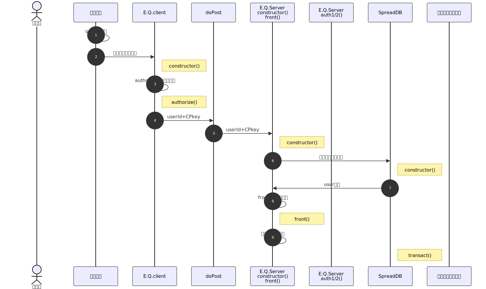
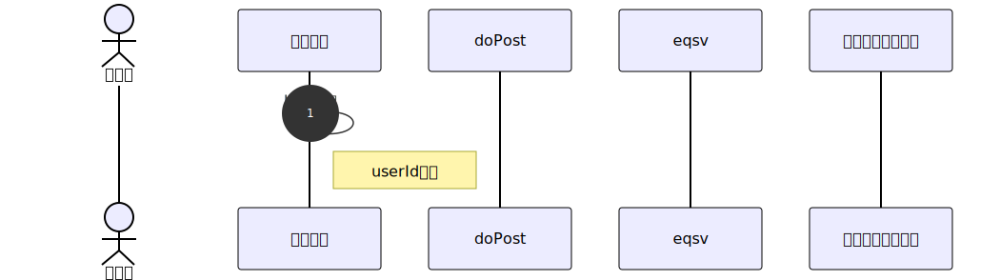

# 処理手順

## 起動時処理

- E.Q.client.constructor : 以下の処理を行う
  - userId取得 : URLクエリまたはlocalStorageからuserId取得を試行。いずれにも存在しない場合、ダイアログから入力
  - client側鍵ペア生成 : 有効期限が切れていない場合はsessionStorageに保存された鍵ペアを使用。
- encryptedQueryServer.constructor() : 以下の処理を行う
  - user情報全件の取得
  - 引数として渡されたuserIdに該当するuser情報による処理の分岐
    - 
  - 引数の内容(オブジェクトのメンバ)による処理の分岐
    - userId,CPkey : encryptedQueryServer.auth()の呼び出し
- 分岐先関数の判断
  | userId 

## 更新処理

