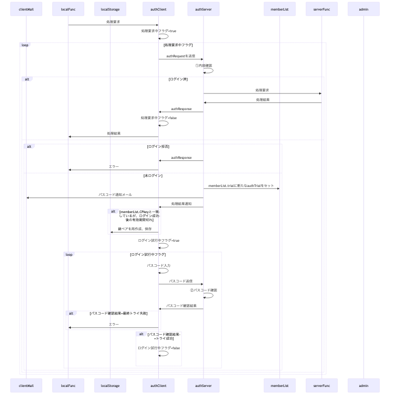

# 総説

## 生成AIへ

- 本文書はMarkdownで書かれています。画像へのリンク(``)は無視してください。
- 以下の仕様に基づき、ブラウザ側JavaScript関数"authClient"とGAS関数"authServer"を作成する予定だが、今回は本仕様のレビューをお願いします。記述が無い・不足している点や使用するツールの推薦をお願いします。
- 開発スピード・安定稼働を重視し多少のリスクは許容しますが、重大なセキュリティホールは指摘してください。
- GASライブラリは使えなくなる場合も有るため、CDNのように「ダウンロードして埋め込む」という選択肢がとれる範囲でお願いします。
- 「ライブラリ」欄に記載された機能は過去に使用実績があるため、特に問題無ければそれを流用します。

## 要求仕様

ブラウザ(クライアント)とGAS(サーバ)の間で認証された通信を行う。

- サーバ側(以下authServer)はスプレッドシートのコンテナバインドスクリプト、クライアント側(以下authClient)はHTMLのJavaScript
- サーバ側・クライアント側とも鍵ペアを使用
- 原則として通信は受信側公開鍵で暗号化＋発信側秘密鍵で署名
- クライアントの識別(ID)はメールアドレスで行う

## 用語

- SPkey, SSkey：サーバ側の公開鍵(Server side Public key)と秘密鍵(Server side Secret key)
- CPkey, CSkey：クライアント側の公開鍵(Client side Public key)と秘密鍵(Client side Secret key)
- パスフレーズ：クライアント側鍵ペア作成時のキー文字列。JavaScriptで自動的に生成
- パスワード：運用時、クライアント(人間)がブラウザ上で入力する本人確認用の文字列
- パスコード：二段階認証実行時、サーバからクライアントに送られる6桁の数字

# 処理手順

## 加入手順


<details><summary>source</summary>

```mermaid
<!--::$doc/joining.mermaid::-->
```

</details>

- ①公開鍵の準備：DocumentPropertiesから公開鍵を取得。鍵ペア未生成なら生成して保存
- ②鍵ペアの準備：localStorageからパスフレーズを取得、CPkey/CSkeyを生成<br>
  localStorageにパスフレーズが無い場合は新たに生成し、localStorageに生成時刻と共に保存
- ③加入可否検討：加入可ならmemberList.acceptedに記入(不可なら空欄のまま)。処理後、スプレッドシートのメニューから「加入登録」処理を呼び出し
- ④結果連絡：memberList.reportResultが空欄のメンバに対して加入可否検討結果をメールで送信

## 処理要求手順



<details><summary>source</summary>

```mermaid
<!--::$doc/authenticate.mermaid::-->
```

</details>

- ①内容確認：authRequestを復号し、以下の何れに該当するか判断
  - ログイン拒否
    - memberListにメールアドレスが登録されていない
    - メンバ加入承認後の有効期間が過ぎている<br>
      `Date.now() < memberList.accepted + authConfig.memberLifeTime`
    - 凍結期間中である
      `Date.now() < memberId.trial.freezingUntil`
  - 未ログイン
    - 署名がmemberList.CPkeyと不一致
    - memberList.CPkeyと一致しているが、ログイン成功後の有効期間が過ぎている
  - ログイン済
    - 署名がmemberList.CPkeyと一致、かつログイン成功後の有効期間内
- ②パスコード確認：以下の一連の作業
  1. 復号後、memberList.CPkeyを署名で書き換え
  2. 入力されたパスコードを元にmemberList.trial.logを追加、以下の何れに該当するか判断
    - 最終トライ失敗：パスコード不一致で試行回数がauthConfig.maxTrialと一致
    - トライ失敗：パスコード不一致だが試行回数がauthConfig.maxTrial未満
    - トライ成功：パスコードが一致
  3. 最終トライ失敗なら`memberId.trial.freezingUntil=Date.now()+authConfig.freezion*1000`をセット

# データ格納方法と形式

- スプレッドシート以外で日時を文字列として記録する場合はISO8601拡張形式の文字列(`yyyy-MM-ddThh:mm:ss.nnn+09:00`)
- 日時を数値として記録する場合はUNIX時刻(new Date().getTime())

## DocumentProperties

キー名は`authConfig.system.name`、データは以下のオブジェクトをJSON化した文字列。

- typeof {Object} authDocumentProperties - サーバのDocumentPropertiesに保存するオブジェクト
- prop {string} SPkey - サーバ側の公開鍵

## localStorage

キー名は`authConfig.system.name`、データは以下のオブジェクトをJSON化した文字列。

- typeof {Object} authLocalStorage - クライアントのlocalStorageに保存するオブジェクト
- prop {string} passPhrase - クライアント側鍵ペア生成用パスフレーズ
- prop {number} keyGeneratedDateTime - パスフレーズ生成日時。UNIX時刻(new Date().getTime())

## memberList(スプレッドシート)

- typedef {Object} memberList
- prop {string} memberId - メンバの識別子(=メールアドレス)
- prop {string} CPkey - メンバの公開鍵
- prop {string} CPkeyUpdated - 最新のCPkeyが登録された日時
- prop {string} accepted - 加入が承認されたメンバには承認日時を設定
- prop {string} reportResult - 「加入登録」処理中で結果連絡メールを送信した日時
- prop {string} trial - ログイン試行関連情報オブジェクト(authTrial)のJSON文字列

# データ型(typedef)

## authConfig

authClient/authServer共通で使用される設定値

- typedef {Object} authConfig
- prop {Object} system
- prop {string} [system.name='auth'] - システム名
- prop {string} [system.adminMail=''] - 管理者のメールアドレス
- prop {string} [system.adminName=''] - 管理者名
- prop {Object.<string,Function|Arrow>} func - サーバ側の関数マップ。{関数名：関数}形式
- prop {number} [memberLifeTime=365] - メンバ加入承認後の有効期間。単位：日
- prop {number} [loginLifeTime=86400000] - ログイン成功後の有効期間(=CPkeyの有効期間)。既定値は1日
- prop {number} [maxTrial=3] パスコード入力の最大試行回数
- prop {number} [passcodeLifeTime=600] - パスコードの有効期間。単位：秒
- prop {number} [freezing=3600] - 連続失敗した場合の凍結期間。単位：秒
- prop {number} [RSAbits=2048] - 鍵ペアの鍵長

## authTrial

ログイン試行時のパスコード関係情報オブジェクト

- typedef {Object} authTrial
- prop {string} passcode - 設定されているパスコード
- prop {number} [freezingUntil=0] - 凍結解除日時。最大試行回数を超えたら現在日時を設定
- prop {Object[]} [log=[]] - 試行履歴
- prop {string} log.enterd - 入力されたパスコード
- prop {boolean} log.result - 成功すればtrue
- prop {number} log.timestamp - 判定処理日時

## authRequest

authClientからauthServerに送られる処理要求オブジェクト

- typedef {Object} authRequest
- prop {string} memberId - メンバの識別子(=メールアドレス)
- prop {string} requestId - 要求の識別子。UUID
- prop {number} timestamp - 要求日時。UNIX時刻
- prop {string} func - サーバ側関数名
- prop {any[]} arguments - サーバ側関数に渡す引数

## authResponse

authServerからauthClientに送られる処理結果オブジェクト

- typedef {Object} authResponse
- prop {string} requestId - 要求の識別子。UUID
- prop {number} timestamp - 処理日時。UNIX時刻
- prop {string} status - 処理結果。正常終了ならnull、異常終了ならErrorオブジェクトをJSON化した文字列
- prop {string} response - 要求された関数の戻り値をJSON化した文字列

# ライブラリ

- cryptico
  - [クライアント側](https://cdnjs.cloudflare.com/ajax/libs/cryptico/0.0.1343522940/cryptico.min.js)
  - サーバ側：クライアント側の先頭に以下のソースをつけたもの
    ```
    const navigator = {appName: "Netscape",appVersion: '5.0'};
    ```
- createPassword()：長さ・文字種指定に基づき、パスワードを生成