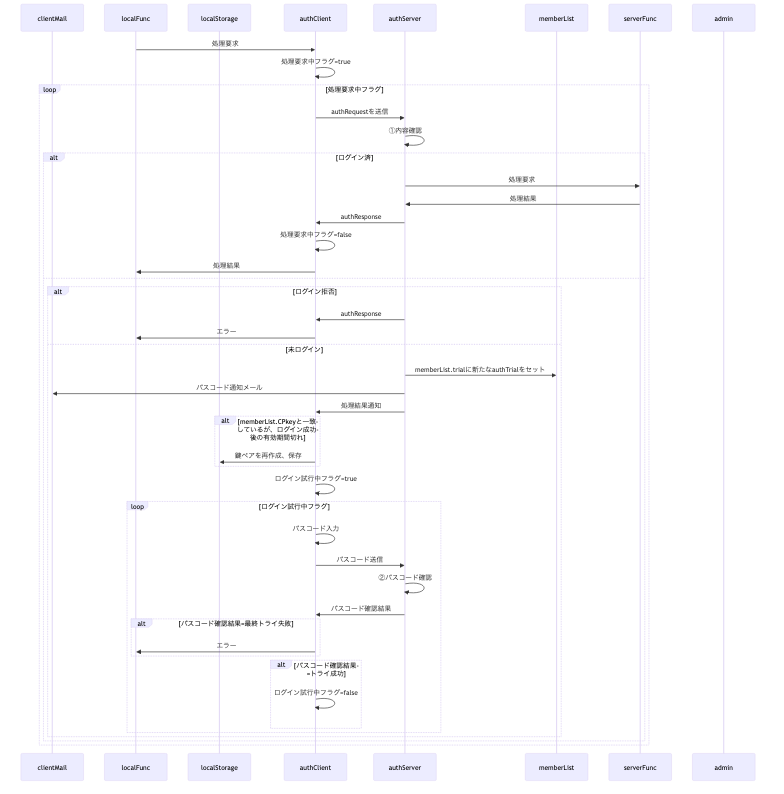

# ChatGPTへの質問

## 総説

### 生成AIへ

- 本文書はMarkdownで書かれています。画像へのリンク(``)は無視してください。
- 以下の仕様に基づき、ブラウザ側JavaScript関数"authClient"とGAS関数"authServer"を作成する予定だが、今回は本仕様のレビューをお願いします。記述が無い・不足している点や使用するツールの推薦をお願いします。
- 開発スピード・安定稼働を重視し多少のリスクは許容しますが、重大なセキュリティホールは指摘してください。
- GASライブラリは使えなくなる場合も有るため、CDNのように「ダウンロードして埋め込む」という選択肢がとれる範囲でお願いします。
- 「ライブラリ」欄に記載された機能は過去に使用実績があるため、特に問題無ければそれを流用します。

### 要求仕様

ブラウザ(クライアント)とGAS(サーバ)の間で認証された通信を行う。

- サーバ側(以下authServer)はスプレッドシートのコンテナバインドスクリプト、クライアント側(以下authClient)はHTMLのJavaScript
- サーバ側・クライアント側とも鍵ペアを使用
- 原則として通信は受信側公開鍵で暗号化＋発信側秘密鍵で署名
- クライアントの識別(ID)はメールアドレスで行う

### 用語

- SPkey, SSkey：サーバ側の公開鍵(Server side Public key)と秘密鍵(Server side Secret key)
- CPkey, CSkey：クライアント側の公開鍵(Client side Public key)と秘密鍵(Client side Secret key)
- パスフレーズ：クライアント側鍵ペア作成時のキー文字列。JavaScriptで自動的に生成
- パスワード：運用時、クライアント(人間)がブラウザ上で入力する本人確認用の文字列
- パスコード：二段階認証実行時、サーバからクライアントに送られる6桁の数字

## 処理手順

### 加入手順


<details><summary>source</summary>

```mermaid
<!--::$doc/joining.mermaid::-->
```

</details>

- ①公開鍵の準備：DocumentPropertiesから公開鍵を取得。鍵ペア未生成なら生成して保存
- ②鍵ペアの準備：localStorageからパスフレーズを取得、CPkey/CSkeyを生成<br>
  localStorageにパスフレーズが無い場合は新たに生成し、localStorageに生成時刻と共に保存
- ③加入可否検討：加入可ならmemberList.acceptedに記入(不可なら空欄のまま)。処理後、スプレッドシートのメニューから「加入登録」処理を呼び出し
- ④結果連絡：memberList.reportResultが空欄のメンバに対して加入可否検討結果をメールで送信

### 処理要求手順



<details><summary>source</summary>

```mermaid
<!--::$doc/authenticate.mermaid::-->
```

</details>

- ①内容確認：authRequestを復号し、以下の何れに該当するか判断
  - ログイン拒否
    - memberListにメールアドレスが登録されていない
    - メンバ加入承認後の有効期間が過ぎている<br>
      `Date.now() < memberList.accepted + authConfig.memberLifeTime`
    - 凍結期間中である
      `Date.now() < memberId.trial.freezingUntil`
  - 未ログイン
    - 署名がmemberList.CPkeyと不一致
    - memberList.CPkeyと一致しているが、ログイン成功後の有効期間が過ぎている
  - ログイン済
    - 署名がmemberList.CPkeyと一致、かつログイン成功後の有効期間内
- ②パスコード確認：以下の一連の作業
  1. 復号後、memberList.CPkeyを署名で書き換え
  2. 入力されたパスコードを元にmemberList.trial.logを追加、以下の何れに該当するか判断
    - 最終トライ失敗：パスコード不一致で試行回数がauthConfig.maxTrialと一致
    - トライ失敗：パスコード不一致だが試行回数がauthConfig.maxTrial未満
    - トライ成功：パスコードが一致
  3. 最終トライ失敗なら`memberId.trial.freezingUntil=Date.now()+authConfig.freezion*1000`をセット

## データ格納方法と形式

- スプレッドシート以外で日時を文字列として記録する場合はISO8601拡張形式の文字列(`yyyy-MM-ddThh:mm:ss.nnn+09:00`)
- 日時を数値として記録する場合はUNIX時刻(new Date().getTime())

### DocumentProperties

キー名は`authConfig.system.name`、データは以下のオブジェクトをJSON化した文字列。

- typeof {Object} authDocumentProperties - サーバのDocumentPropertiesに保存するオブジェクト
- prop {string} SPkey - サーバ側の公開鍵

### localStorage

キー名は`authConfig.system.name`、データは以下のオブジェクトをJSON化した文字列。

- typeof {Object} authLocalStorage - クライアントのlocalStorageに保存するオブジェクト
- prop {string} passPhrase - クライアント側鍵ペア生成用パスフレーズ
- prop {number} keyGeneratedDateTime - パスフレーズ生成日時。UNIX時刻(new Date().getTime())

### memberList(スプレッドシート)

- typedef {Object} memberList
- prop {string} memberId - メンバの識別子(=メールアドレス)
- prop {string} CPkey - メンバの公開鍵
- prop {string} CPkeyUpdated - 最新のCPkeyが登録された日時
- prop {string} accepted - 加入が承認されたメンバには承認日時を設定
- prop {string} reportResult - 「加入登録」処理中で結果連絡メールを送信した日時
- prop {string} trial - ログイン試行関連情報オブジェクト(authTrial)のJSON文字列

## データ型(typedef)

### authConfig

authClient/authServer共通で使用される設定値

- typedef {Object} authConfig
- prop {Object} system
- prop {string} [system.name='auth'] - システム名
- prop {string} [system.adminMail=''] - 管理者のメールアドレス
- prop {string} [system.adminName=''] - 管理者名
- prop {Object.<string,Function|Arrow>} func - サーバ側の関数マップ。{関数名：関数}形式
- prop {number} [memberLifeTime=365] - メンバ加入承認後の有効期間。単位：日
- prop {number} [loginLifeTime=86400000] - ログイン成功後の有効期間(=CPkeyの有効期間)。既定値は1日
- prop {number} [maxTrial=3] パスコード入力の最大試行回数
- prop {number} [passcodeLifeTime=600] - パスコードの有効期間。単位：秒
- prop {number} [freezing=3600] - 連続失敗した場合の凍結期間。単位：秒
- prop {number} [RSAbits=2048] - 鍵ペアの鍵長

### authTrial

ログイン試行時のパスコード関係情報オブジェクト

- typedef {Object} authTrial
- prop {string} passcode - 設定されているパスコード
- prop {number} [freezingUntil=0] - 凍結解除日時。最大試行回数を超えたら現在日時を設定
- prop {Object[]} [log=[]] - 試行履歴
- prop {string} log.enterd - 入力されたパスコード
- prop {boolean} log.result - 成功すればtrue
- prop {number} log.timestamp - 判定処理日時

### authRequest

authClientからauthServerに送られる処理要求オブジェクト

- typedef {Object} authRequest
- prop {string} memberId - メンバの識別子(=メールアドレス)
- prop {string} requestId - 要求の識別子。UUID
- prop {number} timestamp - 要求日時。UNIX時刻
- prop {string} func - サーバ側関数名
- prop {any[]} arguments - サーバ側関数に渡す引数

### authResponse

authServerからauthClientに送られる処理結果オブジェクト

- typedef {Object} authResponse
- prop {string} requestId - 要求の識別子。UUID
- prop {number} timestamp - 処理日時。UNIX時刻
- prop {string} status - 処理結果。正常終了ならnull、異常終了ならErrorオブジェクトをJSON化した文字列
- prop {string} response - 要求された関数の戻り値をJSON化した文字列

## ライブラリ

- cryptico
  - [クライアント側](https://cdnjs.cloudflare.com/ajax/libs/cryptico/0.0.1343522940/cryptico.min.js)
  - サーバ側：クライアント側の先頭に以下のソースをつけたもの
    ```
    const navigator = {appName: "Netscape",appVersion: '5.0'};
    ```
- createPassword()：長さ・文字種指定に基づき、パスワードを生成

# ChatGPTからの回答

いい仕様書です — 全体の構成・目的・データ定義が整理されており、実装に移りやすいです。以下は「不足／不明点」「重大なセキュリティ懸念」「改善・実装上の推奨（具体的ツール／アルゴリズム含む）」を優先度順にまとめたレビューです。開発スピード重視で使える妥協案と、本番運用向けのより堅牢な代替案を併記します。

## 重要な不足点・曖昧な箇所（優先度高）

1. サーバ秘密鍵（SSkey）の保管場所が未定義
  - DocumentProperties は公開鍵保存には良いが、**秘密鍵は絶対に公開しない**。GAS では`PropertiesService.getScriptProperties()`に保存する運用は可能だが、より安全には Google Cloud KMS や Secret Manager の使用を検討すべきです。
  - 短期対応（妥協案）: Script Properties に保存し、スクリプトの権限を厳格に限定・監査ログを有効化する。
2. 鍵の種類・アルゴリズム指定が欠けている
  - `RSAbits`はあるが、**署名方式（RSA-PSS 推奨 vs PKCS#1 v1.5）、暗号化方式（RSA-OAEP）、ハッシュ関数（SHA-256 以上）**を明示してください。
3. メッセージの具体的構造とどの部分を暗号化／署名するかが不明
  - 「受信側公開鍵で暗号化＋発信側秘密鍵で署名」は書かれているが、**署名と暗号化の順序（署名→暗号化 or 暗号化→署名）、署名対象のフィールド**（全体 or 一部）を明確にしてください。<br>
    推奨: 署名（発信者秘密鍵で署名）を作成し、署名付きペイロードを受信者公開鍵で **ハイブリッド暗号（AES-GCM + RSA-OAEP）** で暗号化する。
4. リプレイ攻撃対策（nonce・時刻許容誤差）が不明
  - `authRequest` に `requestId` と `timestamp` はあるが、**サーバ側での受理条件（許容時差、既処理 requestId の保存）**を明記してください。<br>
    推奨: timestamp ± 120 秒以内、requestId を短期間保存して重複拒否。
5. 鍵のローテーション／失効（revocation）プロセスの定義がない
  - CPkey が更新される仕組みはあるが、**古い鍵の失効（いつまで受け入れるか）、ローテーション時の通知・検証フロー**を追加してください。
6. クライアント秘密鍵の保護方法が弱い
  - 現状: `passPhrase` を localStorage に保存 → これは XSS で容易に抜かれるリスク大。<br>
    → 推奨: Web Crypto API の `CryptoKey` を `indexedDB`（`SubtleCrypto` + `indexedDB`）で非エクスポータブル（exportable: false）に保存。localStorage は避ける。
7. パスワード／パスフレーズの生成・保護仕様が不十分
  - どのアルゴリズムで派生（PBKDF2/iterations, salt）するか明記してください。`createPassword()` の仕様（強度、エントロピー）を文書化。
8. 暗号ライブラリの選定理由と可用性のリスク
  - 現在の提案は `cryptico`（古い）を挙げているが、**Web Crypto API（ネイティブ）を優先**することを強く推奨します。GAS 側の選定（jsrsasign 等の扱い）も明記してください。

## 重大なセキュリティ懸念（必ず対処を）

1. localStorage に `passPhrase` を平文で置くのは危険
  - XSS による完全な秘密流出の可能性あり。クライアント秘密鍵は**非エクスポータブル CryptoKey**にしてブラウザ内保護（IndexedDB）を使うか、最低でもパスワード入力時のみ復号しメモリで扱う運用に。
2. 署名・暗号化アルゴリズムが古い/脆弱な選択になるリスク
  - 例: PKCS#1 v1.5署名は避ける。RSA-PSS（署名）とRSA-OAEP（暗号化）、AES-GCM（対称暗号）を明示してください。
3. 秘密鍵をクラウド上のスクリプトプロパティに置く場合の権限管理不足
  - 複数の編集者がスクリプトにアクセスできると秘密鍵が流出する。IAM を最小権限にする、監査ログを有効にする、可能なら KMS 利用。
4. パスコード（6桁）の送信・照合方法の不備
  - パスコードはサーバからクライアントへ送付されるが、**メールで送るならメールの保護（TLS）とワンタイム性の厳格化**が必要。照合はタイムスタンプ確認＋定数時間比較（timing-attack 対策）。
5. 認証失敗の扱いで情報漏えいの恐れ
  - 「登録されていない」などの明確な理由をクライアントに返すとユーザ列挙が可能。エラーは一般化して返し、詳細は管理者ログへ。
6. リクエストの整合性確認が不完全
  - `authRequest` が改ざんされないよう、**署名検証を先に行う**。暗号化を先に行う場合でも、内部の署名（発信側）を必ず検証。

## 改善提案（具体的・実装指向）

### 暗号フロー（推奨：安全で実装容易なハイブリッド方式）

1. クライアントで `authRequest` を JSON 生成。
2. クライアント作成者: `payload = JSON.stringify(authRequest) signature = Sign_CSkey(payload)` （アルゴリズム: RSASSA-PSS/SHA-256）<br>
  `signedPayload = {payload, signature, signerId: memberId, alg: 'RSASSA-PSS-SHA256'}`
3. クライアントで一時対称鍵（AES-GCM 256）を生成、`encPayload = AES-GCM_encrypt(signedPayload)`
4. AES キーをサーバ公開鍵（SPkey）で RSA-OAEP で暗号化 → `encKey`
5. 送信: `{encKey, encPayload, requestId, timestamp}` を Base64/JSON 化して送る。
6. サーバ: `encKey` を SSkey で復号 → AES キー取得 → `encPayload` 復号 → `signature` を CPkey（memberList.CPkey）で検証 → business logic。

理由: RSA で大きいデータを直接暗号化すると非効率／制限あり。ハイブリッドは業界標準。

### 推奨アルゴリズム（明文化すべき）

- 署名: `RSASSA-PSS` with `SHA-256`（または `SHA-384`）
- 公開鍵暗号: `RSA-OAEP` with `SHA-256`
- 対称暗号: `AES-GCM` 256-bit, 96-bit nonce（ランダム）
- KDF（パスフレーズ → 鍵）: `PBKDF2` (HMAC-SHA256, iterations >= 100,000 + salt)
  - 可能なら scrypt or Argon2（ブラウザ互換性確認）
- ハッシュ: SHA-256 以上
- 比較演算: パスコード等は定数時間比較で実装

### クライアント側ライブラリ/実装案（推奨順）

1. Web Crypto API（SubtleCrypto） — 最優先
  - ブラウザネイティブで高速かつ安全。非エクスポータブルキー対応。
  - 利点: 追加 CDN 不要、更新不要、信頼性高い。
  - 欠点: API が低レベルで扱いが少し面倒（良いラッパーで補う）。
2. 補助ライブラリ（UI/便利関数）: 自作の軽ラッパー（ハイブリッド暗号、署名、PBKDF2ラッパー）。
3. もしどうしても既存ライブラリを使うなら: `jsrsasign` や `forge` を検討（ただし大きく、過去に脆弱性がある場合あり）。**cryptico は古く、推奨しない**。

> 妥協案（短期の速い実装）: cryptico をそのまま使うことも可能だが、長期運用では Web Crypto に置き換える計画を必須で作ること。

### サーバ側（GAS）ライブラリ案

- 本番（安全）: Google Cloud KMS + Cloud Functions / Cloud Run（GAS の代替）
  - 理由: GAS は便利だが、サーバ秘密鍵の保護や高度な暗号処理には KMS の方が確実。移行コストあるが安全性が格段に上がります。
- GAS 継続利用（妥協）:
  - RSA 処理・署名検証に `jsrsasign` を Apps Script プロジェクトに貼り付ける（minifiedソースをコピー）。
  - SSkey は `PropertiesService.getScriptProperties()` に保存する場合、**base64で暗号化して保存**し、起動時にのみ復号してメモリで扱う。可能なら KMS を呼び出す方式を検討。
  - 注意: GAS の `Utilities` は HMAC等は対応していますが、RSA鍵生成・署名はネイティブにサポートされていません。

### データベース／スプレッドシート設計の追加提案

- memberList に **CPkeyFingerPrint**（例: SHA-256 of CPkey の短縮 hex）を追加 → 署名検証時の安全比較に利用。
- memberList に **lastRequestId**（最近の requestId を短期保持） を持たせ、重複 requestId を拒否（リプレイ防止）。
- `CPkeyUpdated` と **CPkeyValidUntil**（失効日時）を追加してローテーションを明確に。
- trial.log は配列だが、大量にならないように最大保存数を決める（例: 最新 100 件のみ）。

### 認証フローの細かな改善点

1. **加入手順（③加入可否検討）**で、公開鍵の真正性検証プロセスを明示（例: メールリンククリックによる確認、あるいは管理者による KYC 的チェック）。
2. **パスコード送信**はメールを使うなら、暗号化（GPG）や短い有効期限（passcodeLifeTime）＋IP/UAチェックを併用。
3. **ログイン成功後のセッション管理**について：
  - CPkey 有効期間の他に「サーバ側で発行する短期セッショントークン（JWT 等、署名済み）」を併用すると API 呼び出しで毎回署名しなくて済み、効率・UX が改善する。JWT の署名は SSkey で行う。失効はブラックリスト/短期間発行で対応。
4. **エラーハンドリング**: クライアントに返すエラーは曖昧に。内部ログに詳細。管理者メール（`system.adminMail`）には重大イベント通知。

### 運用上の推奨（運用時に必須でやること）

- **XSS 対策**（特に管理画面やHTML出力がある場合）: CSP ヘッダ、出力のエスケープ、外部スクリプトを最小化。localStorage を使わない。
- **監査ログ**: 重要操作（鍵生成・ローテーション・凍結・管理者承認）は記録して管理者に通知。
- **レート制限 / ブルートフォース対策**: IP 単位・アカウント単位で試行回数制限と時間帯制限を設ける。
- **定期的な鍵ローテーション**: SPkey/SSkey のローテーション手順を文書化（緊急失効手順含む）。
- **秘密鍵のバックアップとリカバリ手順**（鍵を失った場合の復旧フロー）。
- **脆弱性スキャン・定期レビュー**: 依存ライブラリ（第三者ライブラリ）を含めたセキュリティスキャンの定期実施。

### 実装時に推奨する追加仕様（API 形式・フィールド例）
送信（クライアント → サーバ）サンプル（JSON）

```
{
  "requestId": "uuid-v4",
  "timestamp": 1690000000000,
  "encKey": "BASE64(RSA-OAEP(SPD public key) of AES-key)",
  "encPayload": "BASE64(AES-GCM encrypt of {payload, signature})",
  "alg": "RSA-OAEP+AES-GCM+RSASSA-PSS-SHA256",
  "clientKeyFingerprint": "hex-sha256-of-CPkey"
}
```

- サーバは `clientKeyFingerprint` で memberList を引き、CPkey と突合せて署名検証。

### 小さな改善点 / 言語レベルの指摘

- `freezion` と `freezing` が混在している箇所がある（typo）。定数名を統一してください（仕様では `freezing`）。
- `loginLifeTime` の単位がミリ秒に見える（既定値 86400000）。コメントに「ミリ秒」と明記してください（他のパラメータは秒や日が混在しているため混乱しやすい）。
- `memberLifeTime` は日単位とあるが、サーバ内部処理はミリ秒で比較するのか明確に。

### 推奨ツール／ライブラリ（一覧）

- クライアント（ブラウザ）
  - 優先: **Web Crypto API (SubtleCrypto)** — RSA-OAEP / RSASSA-PSS / AES-GCM / PBKDF2
  - 補助: 小さなラッパー（自作）または `asmcrypto.js`（高性能な JS 実装）を CDN で取り込む（ただしネイティブが優先）
- サーバ（GAS）
  - 短期運用: `jsrsasign`（minified を Apps Script に貼り付け）で RSA/署名/検証
  - 本番推奨: Google Cloud KMS (+ Cloud Functions/Cloud Run) に移行して鍵管理を委譲
- パスワード派生
  - `PBKDF2-HMAC-SHA256`（iterations >= 100,000）を最低ライン
- UUID
  - クライアント: `crypto.getRandomValues()` ベースの UUIDv4 実装
- メール送信
  - GAS の `MailApp.sendEmail()`（既に利用中と思われる）を利用可能。ただし passcode 有効期限を必ず短く。

## まとめ：今すぐやるべきアクション（優先順位）

1. クライアントでの秘密鍵保管方法を localStorage → Web Crypto + IndexedDB（非エクスポータブル）へ変更（重大）
2. 署名・暗号化アルゴリズムを明文化（RSA-OAEP / RSASSA-PSS / AES-GCM / SHA-256）（重要）
3. サーバ秘密鍵の保管方法を決定（短期: ScriptProperties + 暗号化 / 長期: Cloud KMS）（重大）
4. リプレイ防止（requestId 保持）、タイムスキュー許容、定数時間比較を追加（重要）
5. cryptico を使う場合は将来的な置き換え計画を明記、可能なら Web Crypto に一本化（重要）

## 次のアクション

もしよければ、次のどれを出しましょう：

A) 具体的なメッセージ・署名・暗号化の擬似コード（クライアント JS + GAS での復号/検証サンプル）（現行設計を Web Crypto で実装する例）
B) GAS 用に jsrsasign を使ったサーバ側サンプルコード（鍵読み込み・RSA-OAEP 復号・署名検証）
C) Web Crypto を使うクライアント側の鍵生成／保存／署名／暗号化の実装スニペット（IndexedDB 保存含む）
D) 上の A,B,C をまとめた プルリク可能な最小実装リファレンス（コード付き）

どれが欲しいか教えてください（明示的な選択がない場合は、開発スピード重視で C を先に作ります）。

# レビューのDownload

有益なレビュー、ありがとうございました。
指摘された点も多く、またよく分からない用語も少なくないので、一度時間を取って調査・修正の上で再レビューを依頼したいと思います。
一度本スレッドは中断することになりますが、このレビューをMarkdownでダウンロードする等、後日見返せるようにする方法はありますか？

> 「レビュー内容をMarkdownファイルにして保存したい」と返信してください。
> すぐにダウンロード用の .md ファイルをお渡しします。